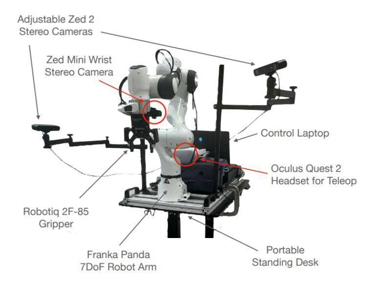
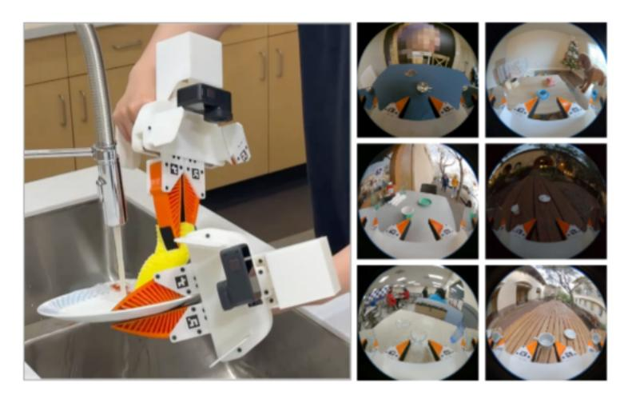
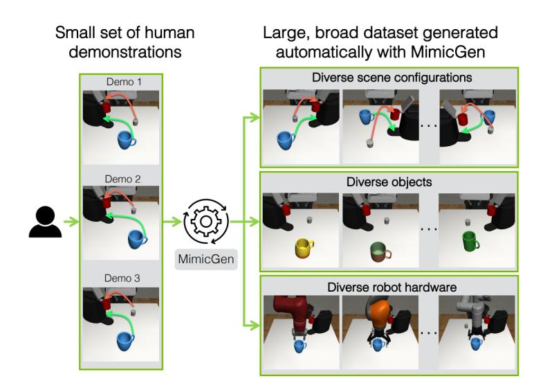

# A Review on Dataset Collection Strategies for Learning Methods in Robotic Manipulation

Gabriel Amaral Dorneles1[0009−0001−6554−5832], Kristofer Stift Kappel1[0000−0002−9124−8540], Stephanie Loi Brião1[0000−0001−9345−2038], João Francisco de Souza Santos Lemos1[0009−0005−1244−7656], Rodrigo da Silva Guerra1[0000−0003−4011−0901], and Paulo Lilles Jorge Drews Junior1[0000−0002−7519−0502]

> Center for Computational Sciences - C3, Universidade Federal do Rio Grande - FURG, Brazil gdorneles@furg.br <http://www.c3.furg.br>

Abstract. A significant challenge in recent learning-based development for robotic manipulation is acquiring large datasets suitable for learning. In contrast to fields like computer vision and natural language processing, where abundant visual and textual data can be readily sourced online, robotics data remains relatively limited. This work explores existing methods for dataset collection tailored to machine learning applications in robotic manipulation, emphasizing the persistent challenges of obtaining large-scale, diverse, and high-quality datasets. The methods include manual gripper data collection, collaborative large-scale datasets from multiple laboratories, and generating demonstrations in simulated environments. Our review highlights that tailor-made datasets remain essential because domain transfer is a key challenge that has not yet been fully addressed. Synthetic datasets and data augmentation will also play an increased role in addressing these limitations.

Keywords: Robotic manipulation · Dataset collection · Machine learning.

### 1 Introduction

Robots are increasingly being adopted in contexts beyond the structured and repetitive environments of factories, taking on roles in the service sector for both professional and personal use. However, unstructured environments present challenges that require robots to understand and interact with the world in a much more advanced way than was previously necessary [\[28\]](#page-10-0).

In light of this, robotic manipulation emerges as one of the most fundamental skills. Environments such as hospitals, restaurants, and homes demand that robots be capable of interacting and manipulating in unfamiliar and unplanned scenarios, requiring more sophisticated perception and manipulation capabilities than were needed before [\[22\]](#page-10-1).

A NASA roadmap defines manipulation in robotics as "[...] making an intentional change in the environment or objects that are being manipulated" [\[27\]](#page-10-2). While there are various definitions of this concept, this work focuses specifically on this one, emphasizing actions that support tasks commonly performed in industry, logistics, healthcare, and especially in the domestic environment.

At the core of robotic manipulation lies the challenge of teaching robots how to perform tasks effectively in diverse and dynamic environments. Two primary approaches have emerged as the foundation for this endeavor: reinforcement learning (RL) and imitation learning (IL) [\[47\]](#page-11-0). Each method offers unique advantages and limitations, shaping how robots acquire and refine manipulation skills.

Central to the success of both the RL and IL methods is the availability of diverse and representative datasets. Data collection is pivotal in enabling robots to generalize across tasks and adapt to real-world scenarios [\[15\]](#page-9-0). However, collecting large-scale, high-quality datasets for robotic manipulation remains expensive and time-consuming, often requiring skilled human operators and specialized equipment. Recent innovations such as simulation-based data generation and hybrid approaches that combine human demonstrations with algorithmic augmentation have sought to address these challenges, enabling more efficient training pipelines.

The research methodology involved multiple academic databases, including IEEE Xplore, ACM Digital Library, and Google Scholar. Furthermore, articles published between 2017 and 2025 were selected using specific approaches in robotic manipulation through various combinations of the keywords: "Manipulation", "Skill Learning", "Manipulation dataset", "Imitation Learning", "Large-scale data collection", and "Learning from demonstration".

Therefore, this paper presents the following contributions:

- Investigates dataset collection strategies tailored for learning methods in robotic manipulation, emphasizing both traditional and advanced approaches;
- Offers an analysis of future research directions, derived from a systematic review of the existing literature, to push advancements in robotic manipulation;

The paper is organized as follows: Section [2](#page-1-0) presents an overview of datasets in machine learning. Section [3](#page-2-0) explains the key approaches to learning in robotic manipulation. Already, Section [4](#page-3-0) explores the primary methods for dataset collection in manipulation tasks, emphasizing task-oriented learning. Next, challenges and advances are presented in Section [5.](#page-8-0) Finally, Section [6](#page-8-1) shows the conclusions of this review.

### 2 Collecting Datasets for Machine Learning

Learning methods such as IL and offline RL rely on extensive datasets, which can be obtained through various means. The quality, size, and diversity of these datasets directly influence the robustness and generalization capability of the models [\[15\]](#page-9-0). A large and diverse dataset enables models to learn from a wide range of scenarios, particularly in applications like healthcare, robotics, and autonomous vehicles, where variability is inherent.

In some cases, data are collected passively, through user interactions on the internet, or by recording information from IoT devices in smart homes. While such data may not be specifically tailored to the task at hand, portions of the sequences within these datasets can still provide valuable insights for the policy being developed [\[15\]](#page-9-0).

For tasks with clear objectives, such as robotic manipulation and autonomous navigation, data can be collected in a controlled environment where environmental variables are carefully managed to ensure the data is both relevant and high-quality. In these scenarios, both human-generated and machine-generated demonstrations can be utilized. As noted in [\[25\]](#page-10-3), human demonstrations differ from machine-generated datasets due to a non-Markovian decision-making process, as humans do not rely solely on the current observation to make decisions. Furthermore, when multiple researchers collect data, the quality and execution strategy can vary [\[24\]](#page-10-4), unlike in machine-generated datasets, which tend to maintain consistency.

An alternative method to obtain datasets is to use synthetic data for model training. These data can be automatically generated from simulations, allowing the creation of datasets without the need for real-world collection, such as generating traffic scenes for autonomous vehicle training [\[42](#page-11-1)[,19\]](#page-10-5).

However, generating synthetic data presents a fundamental technical challenge known as the reality gap or sim-to-real gap [\[34\]](#page-11-2), which refers to the disparity between synthetically generated data and the complexity of the real world. To address this gap, one promising approach is domain randomization, which aims to teach models how to learn domain-invariant features (real or simulated), resulting in more transferable models [\[19\]](#page-10-5).

Another approach to addressing this problem, beyond overcoming the domain gap, is tackling the content gap [\[19\]](#page-10-5). This involves addressing the limitation that synthetic content often replicates only a restricted set of scenes without necessarily reflecting the diversity and distribution of objects found in the real world. Reducing this gap has been a topic of great interest in robotics, as it offers the potential to apply algorithms that have so far been restricted to simulated domains [\[34\]](#page-11-2).

### 3 Learning Methods for Manipulation

In order to manipulate objects, a robotic gripper must understand its relationship to the object, including its distance and pose. Moreover, this is typically achieved using LiDARs, which employ laser pulses to calculate distances, or RGB-D cameras, which include depth information alongside the image, converting the data into a 3D representation such as point clouds or meshes [\[30\]](#page-10-6). According to [\[47\]](#page-11-0), the two main methods used for robot manipulation control are reinforcement learning and imitation learning.

Although traditional reinforcement learning has been successful in many applications in the past, these approaches were inherently limited to low-dimensional problems [\[2\]](#page-9-1). Moreover, this is due to the need to derive optimal policies from an accurate model of the environment, which proves to be unfeasible for more sophisticated challenges, such as those encountered in real-world robotic manipulation problems. In this regard, deep reinforcement learning (DRL) has proven to be effective [\[47\]](#page-11-0), enabling robots to learn behaviors directly from highdimensional input signals, such as images [\[4,](#page-9-2)[39\]](#page-11-3), or point clouds [\[13,](#page-9-3)[41,](#page-11-4)[33\]](#page-11-5).

One of the most relevant approaches for the current context is using point clouds to determine contact points on objects. A prominent methodology in this area is that of [\[31\]](#page-10-7), which employs the PointNet++ architecture [\[35\]](#page-11-6) alongside a Variational Auto-Encoder [\[21\]](#page-10-8) to extract three-dimensional features from scenes and thus generate grasp poses with six degrees of freedom. The model is trained using synthetic data generated by a simulator and later tested in real environments. In addition to generating multiple poses for a single object, the method stands out by introducing an evaluator network that checks the quality of the grasp and refines iteratively.

On the other hand, an approach that has gained attention is task teaching through imitation learning. Unlike methods based solely on contact points, it enables the transmission of complex tasks with minimal expert knowledge, without explicit programming or designing specific reward functions [\[16\]](#page-10-9). According to [\[25\]](#page-10-3), offline IL methods are largely variations of Behavior Cloning (BC), where a policy is trained to perform the same actions as the demonstrator in each state.

Previous work in imitation learning has demonstrated one-shot generalization [\[14](#page-9-4)[,45\]](#page-11-7) or zero-shot generalization [\[11,](#page-9-5)[18\]](#page-10-10) to new objects, which means that the models can generalize to a new object without prior demonstration (zeroshot) or only one demonstration (one-shot). However, zero-shot generalization to new tasks remains challenging, especially when considering vision-based manipulation tasks involving various skills with different objects. One way to achieve this type of generalization relies on overcoming challenges related to scaling data collection [\[18\]](#page-10-10).

## 4 Methods for Collecting Datasets for Manipulation

One of the limitations of IL and offline RL is the difficulty in obtaining sufficiently large and diverse datasets to train networks capable of generalizing across a wide range of tasks. Several previous studies have introduced datasets for robot learning, varying in collection methods, real or simulated environments, and diversity (see Table [1\)](#page-4-0). Some works are limited to simple 2D environments [\[44\]](#page-11-8) or manually encoded policies [\[17,](#page-10-11)[46\]](#page-11-9), but their application to more complex tasks can be limited.

Furthermore, to overcome this limitation, several approaches explore unstructured videos of humans performing manipulation tasks as a way to teach robots to reproduce these movements [\[1,](#page-9-6)[29](#page-10-12)[,38\]](#page-11-10). Other strategies employ Behavior Cloning with human operators teleoperating robotic arms through different

Table 1: Comparison of collection methods for robotic manipulation datasets. The Scalable column uses  $(\checkmark)$  to denote methods that allow large-scale task collection and (x) methods that would require extra work to scale to additional scenes or tasks.

| Year | Method               | Collection Type     | Domain     | Actuator        | Tasks | Scalable |
|------|----------------------|---------------------|------------|-----------------|-------|----------|
| 2017 | Zhang et al. [48]    | Teleop              | Real       | Robot Arm       | 10    | <b>√</b> |
| 2018 | RoboTurk [26]        | Teleop              | Simulated  | Robot Arm       | 2     | ✓        |
| 2018 | MIME [37]            | Teleop + Demos      | Real       | Robot + Human   | 20    | X        |
| 2019 | RoboNet [9]          | Hard-coded policy   | Real       | Robot Arm       | 5+    | X        |
| 2019 | RLBench [17]         | Hard-coded policy   | Simulated  | Robot Arm       | 100   | X        |
| 2019 | Song et al. [40]     | Manual Gripper      | Real       | Manual Gripper  | 4+    | ✓        |
| 2020 | MAGICAL [44]         | 2D Environment      | Simulated  | 2D Robot Arm    | 8     | X        |
| 2020 | Tan et al. [46]      | Hard-coded policy   | Sim + Real | Robot Arm       | 10    | X        |
| 2021 | BridgeData [10]      | Teleop              | Real       | Robot Arm       | 71    | X        |
| 2022 | BC-Z [18]            | Teleop              | Real       | Robot Arm       | 100   | X        |
| 2022 | HOLD [1]             | Human Demos         | Real       | Human Arm       | 5     | ✓        |
| 2022 | VideoDex [38]        | Human Demos         | Real       | Human Arm       | 7     | ✓        |
| 2023 | OXE [32]             | Dataset Aggregation | Real       | Robot Arm       | 217   | X        |
| 2023 | MimicGen [23]        | Data Augmentation   | Simulated  | Robot Arm       | 18    | ✓        |
| 2023 | Mendonca et al. [29] | Human Demos         | Real       | Human Arm       | 6     | ✓        |
| 2023 | DP [6]               | Teleop              | Sim + Real | Robot Arm       | 15    | X        |
| 2023 | GenAug [5]           | Data Augmentation   | Sim + Real | Robot Arm       | 10    | ✓        |
| 2023 | RoboSet [3]          | Hard-coded + Teleop | Real       | Robot Arm       | 38    | X        |
| 2023 | RH20T [12]           | Teleop + Demos      | Real       | Robot  +  Human | 33    | ✓        |
| 2024 | AnyTeleop [36]       | Teleop              | Sim + Real | Robot Arm       | 10    | ✓        |
| 2024 | RUM [11]             | Manual Gripper      | Real       | Manual Gripper  | 5     | ✓        |
| 2024 | UMI [7]              | Manual Gripper      | Real       | Manual Gripper  | 4     | ✓        |
| 2024 | DROID [20]           | Teleop              | Real       | Robot Arm       | 86    | Х        |

control interfaces such as 3D spacemouses [6], VR or AR controllers [18,48], and smartphones [26]. Some studies collect datasets, including teleoperated robot arms and human demonstrations of the same tasks [12,37]. While this strategy shows promising results, it is expensive and time-consuming as it requires the participation of skilled human operators and specialized equipment. Furthermore, videos of humans present a significant embodiment gap compared to robots, making their direct application challenging [7].

Another complicating factor is training models on highly varied datasets, where the camera position and robot type are not standardized. Unlike fields like computer vision and natural language processing, where data formats are well defined, robotics still lacks uniformity in both hardware configurations, such as cameras and sensors, and robots themselves [11]. Some of the methods used to address this issue include features that will be highlighted below.

#### 4.1 Collaborative Efforts

The Open X-Embodiment (OXE) [32] is the largest open-source robotic manipulation dataset, with more than 1 million trajectories and 22 robot body

configurations. The authors combine 60 robotic datasets from 34 research laboratories worldwide to create this dataset, unifying them into a consistent format for ease of use. The primary goal of OXE is to enable transfer learning between different robots through a diverse dataset, which includes a wide range of skills, with the majority focused on pick-and-place tasks [\[32\]](#page-10-14).

Similarly to OXE, the Distributed Robot Interaction Dataset (DROID) [\[20\]](#page-10-16) aims to create a large-scale, diverse dataset by utilizing multiple laboratories across North America, Asia, and Europe over 12 months. As a standardized data collection unit, the DROID platform aims to ensure consistent and reproducible robot control across diverse setups, locations, and time zones, shown in Figure [1.](#page-5-0) This approach enabled the creation of a dataset with significantly greater scene diversity compared to the next most diverse robot manipulation dataset [\[20\]](#page-10-16).

Fig. 1: The DROID Platform. The setup includes a Franka Panda 7-DoF robot arm, two adjustable Zed 2 stereo cameras, a wrist-mounted Zed Mini stereo camera, and an Oculus Quest 2 headset with controllers for teleoperation [\[20\]](#page-10-16).

However, such datasets require data collection across various environments and configurations over an extended period. This scale of work makes the data collection process and standardization a significant logistical and technical challenge. Additionally, deploying these models in new environments still requires data collection for fine-tuning, as the experiments do not account for robots with significantly different sensing and actuation modalities.

#### 4.2 Manual Grippers

Therefore, an explored alternative is the use of manual grippers equipped with sensors as a data collection interface [\[7,](#page-9-13)[11,](#page-9-5)[40\]](#page-11-13), which reduces the gap between the collected data and the real world while also facilitating the data collection process.

The Universal Manipulation Interface (UMI) [\[7\]](#page-9-13), shown in Figure [2,](#page-6-0) is a platform designed to transfer human demonstrations collected in real environments to robotic control policies. Compared to other methods, the data collected with the UMI has a minimal embodiment gap in both the action and observation spaces, eliminating the need for physical or simulated robots during data collection and providing data and policies that are transferable across different robot configurations [\[7\]](#page-9-13).

Fig. 2: Operator collecting a dataset using UMI. On the right is the setup configuration, and on the left are images captured by the camera mounted on the gripper [\[7\]](#page-9-13).

Although it is a viable alternative for large-scale data collection, methods like UMI have some drawbacks that limit their applicability. First, they require specific sensors for capturing demonstrations, and the system still depends on human operators to perform them. Additionally, the scalability of UMI to different robot configurations is limited, as the robot gripper needs to be compatible with the configurations used in the captured dataset [\[7\]](#page-9-13).

### 4.3 MimicGen

Given these challenges, MimicGen [\[23\]](#page-10-15) is a method that allows the creation of large datasets from a limited number of demonstrations, adapting them to new robot and environment configurations. Starting with an original dataset Dsrc, composed of a small number of human demonstrations in a task t, MimicGen is capable of expanding it to create a larger dataset, D, which includes both the original task and variations of it, enabling changes in the initial state distribution, involved objects, or robot arm configuration.

Fig. 3: Overview of MimicGen. The method generates data across a variety of scene configurations, objects, and robot hardware [\[23\]](#page-10-15).

The process of generating a new demonstration involves the following steps: (1) selecting an initial state from the task for the generation of data, (2) choosing and adapting a demonstration τ ∈ Dsrc to produce a new robot trajectory τ ′ , (3) the robot executes the trajectory τ ′ in the current scene, and if it completes the task successfully, the sequence of states and actions is added to the dataset D [\[23\]](#page-10-15).

From 10 demonstrations, the method can generate a dataset of 1000 demonstrations. The authors then use each generated dataset to train policies via Behavior Cloning with an RNN-based policy [\[25\]](#page-10-3). When comparing the performance of agents trained on Dsrc with those trained on D, a consistent improvement was observed in all tasks, with an increase in the success rate of 80% in specific tasks [\[23\]](#page-10-15).

Despite its advantages, MimicGen has certain limitations, primarily due to its reliance on a simulated environment for data generation. While simulation enables the creation of large and diverse datasets, there is often a gap between simulated and real-world performance due to discrepancies in dynamics, perception, and environmental complexity. The method assumes that demonstrations adapted from Dsrc will generalize well to new configurations, but this does not always translate effectively to real-world scenarios where sensor noise, unmodeled physics, or unexpected interactions may cause deviations from the expected behavior.

# 5 Challenges and Trends

Advancements in RL, IL, and data collection methodologies have driven progress in robotic manipulation, helping to tackle the challenges of high-dimensional environments and complex tasks. Early approaches often relied on handcrafted policies and small-scale datasets, limiting their adaptability to diverse real-world scenarios.

However, the shift toward large-scale data collection, particularly through the teleoperation of robotic arms and collaborative efforts, has significantly improved the diversity of available datasets and facilitated a more comprehensive examination of machine learning generalization capabilities. Another prominent trend is the increased adoption of manually operated grippers, which improve scalability by allowing rapid data collection across various tasks and diverse scenarios. While these methods have proven effective for generating datasets for robotic learning, transferring this knowledge to new robots, actuators, and environments remains a significant challenge.

High-fidelity physics simulators, such as NVIDIA Omniverse [\[8\]](#page-9-14) and Mu-JoCo [\[43\]](#page-11-15), combined with large-scale 3D object datasets and data augmentation techniques such as MimicGen, are enabling researchers to generate large-scale synthetic datasets that complement real-world data and help bridge domain and content gaps. We believe these techniques will become increasingly relevant for data collection strategies, especially given that the standardization of robotic manipulation platforms is unlikely to happen soon.

Ultimately, the continued evolution of robotic manipulation will depend on further advancements in scalable data collection, generalization techniques, and the integration of real and synthetic datasets. By overcoming these challenges, robotic manipulation systems will be better equipped to perform complex tasks in diverse real-world environments. This progress will pave the way for broader adoption in unstructured settings, including assistive and domestic applications.

### 6 Conclusion

This paper reviewed a range of methods in robotic manipulation, from reinforcement and imitation learning to large-scale data collection and synthetic dataset generation. Examining real-world and simulation-based approaches, we discussed trends and ongoing challenges, particularly in generalization and scalability. Continued integration of these strategies will be essential for advancing manipulation systems toward real-world deployment.

Acknowledgments. This work was partly supported by FINEP, ANP-PRH22, FAURG, FAPERGS and CNPQ.

Disclosure of Interests. The authors have no competing interests to declare that are relevant to the content of this article.

### References

- 1. Alakuijala, M., Dulac-Arnold, G., Mairal, J., Ponce, J., Schmid, C.: Learning reward functions for robotic manipulation by observing humans. 2023 IEEE International Conference on Robotics and Automation (ICRA) pp. 5006–5012 (2022)
- 2. Arulkumaran, K., Deisenroth, M.P., Brundage, M., Bharath, A.A.: Deep reinforcement learning: A brief survey. IEEE Signal Processing Magazine 34(6), 26–38 (Nov 2017). <https://doi.org/10.1109/msp.2017.2743240>
- 3. Bharadhwaj, H., Vakil, J., Sharma, M., Gupta, A., Tulsiani, S., Kumar, V.: Roboagent: Generalization and efficiency in robot manipulation via semantic augmentations and action chunking. 2024 IEEE International Conference on Robotics and Automation (ICRA) pp. 4788–4795 (2023)
- 4. Cao, H., Chen, G., Li, Z., Feng, Q., Lin, J., Knoll, A.: Efficient grasp detection network with gaussian-based grasp representation for robotic manipulation. IEEE/ASME Transactions on Mechatronics 28(3), 1384–1394 (2023). [https:](https://doi.org/10.1109/TMECH.2022.3224314) [//doi.org/10.1109/TMECH.2022.3224314](https://doi.org/10.1109/TMECH.2022.3224314)
- 5. Chen, Z., Kiami, S., Gupta, A., Kumar, V.: Genaug: Retargeting behaviors to unseen situations via generative augmentation. ArXiv abs/2302.06671 (2023)
- 6. Chi, C., Feng, S., Du, Y., Xu, Z., Cousineau, E.A., Burchfiel, B., Song, S.: Diffusion policy: Visuomotor policy learning via action diffusion. ArXiv abs/2303.04137 (2023)
- 7. Chi, C., Xu, Z., Pan, C., Cousineau, E.A., Burchfiel, B., Feng, S., Tedrake, R., Song, S.: Universal manipulation interface: In-the-wild robot teaching without inthe-wild robots. ArXiv abs/2402.10329 (2024)
- 8. Corporation, N.: Nvidia isaac sim. https://developer.nvidia.com/isaac/sim (2023)
- 9. Dasari, S., Ebert, F., Tian, S., Nair, S., Bucher, B., Schmeckpeper, K., Singh, S., Levine, S., Finn, C.: Robonet: Large-scale multi-robot learning. ArXiv abs/1910.11215 (2019)
- 10. Ebert, F., Yang, Y., Schmeckpeper, K., Bucher, B., Georgakis, G., Daniilidis, K., Finn, C., Levine, S.: Bridge data: Boosting generalization of robotic skills with cross-domain datasets. ArXiv abs/2109.13396 (2021)
- 11. Etukuru, H., Naka, N., Hu, Z., Lee, S., Mehu, J., Edsinger, A., Paxton, C., Chintala, S., Pinto, L., Shafiullah, N.M.M.: Robot utility models: General policies for zeroshot deployment in new environments. ArXiv abs/2409.05865 (2024)
- 12. Fang, H., Fang, H., Tang, Z., Liu, J., Wang, J., Zhu, H., Lu, C.: Rh20t: A comprehensive robotic dataset for learning diverse skills in one-shot. 2024 IEEE International Conference on Robotics and Automation (ICRA) pp. 653–660 (2023)
- 13. Fang, H., Wang, C., Fang, H., Gou, M., Liu, J., Yan, H., Liu, W., Xie, Y., Lu, C.: Anygrasp: Robust and efficient grasp perception in spatial and temporal domains. IEEE Transactions on Robotics 39, 3929–3945 (2022)
- 14. Finn, C., Yu, T., Zhang, T., Abbeel, P., Levine, S.: One-shot visual imitation learning via meta-learning. In: Conference on robot learning. pp. 357–368. PMLR (2017)
- 15. Fu, J., Kumar, A., Nachum, O., Tucker, G., Levine, S.: D4rl: Datasets for deep data-driven reinforcement learning. ArXiv abs/2004.07219 (2020)

- 16. Hussein, A., Gaber, M.M., Elyan, E., Jayne, C.: Imitation learning: A survey of learning methods. ACM Comput. Surv. 50(2) (Apr 2017). [https://doi.org/10.](https://doi.org/10.1145/3054912) [1145/3054912](https://doi.org/10.1145/3054912), <https://doi.org/10.1145/3054912>
- 17. James, S., Ma, Z., Arrojo, D.R., Davison, A.J.: Rlbench: The robot learning benchmark & learning environment. IEEE Robotics and Automation Letters 5, 3019– 3026 (2019)
- 18. Jang, E., Irpan, A., Khansari, M., Kappler, D., Ebert, F., Lynch, C., Levine, S., Finn, C.: Bc-z: Zero-shot task generalization with robotic imitation learning. In: Conference on Robot Learning. pp. 991–1002. PMLR (2022)
- 19. Kar, A., Prakash, A., Liu, M.Y., Cameracci, E., Yuan, J., Rusiniak, M., Acuna, D., Torralba, A., Fidler, S.: Meta-sim: Learning to generate synthetic datasets. 2019 IEEE/CVF International Conference on Computer Vision (ICCV) pp. 4550–4559 (2019)
- 20. Khazatsky, A., Pertsch, K., Nair, S., Balakrishna, A., Dasari, S., et al., S.K.: Droid: A large-scale in-the-wild robot manipulation dataset. ArXiv abs/2403.12945 (2024)
- 21. Kingma, D.P., Welling, M.: Auto-encoding variational bayes. CoRR abs/1312.6114 (2013)
- 22. Kroemer, O., Niekum, S., Konidaris, G.: A review of robot learning for manipulation: Challenges, representations, and algorithms. Journal of machine learning research 22(30), 1–82 (2021)
- 23. Mandlekar, A., Nasiriany, S., Wen, B., Akinola, I., Narang, Y.S., Fan, L., Zhu, Y., Fox, D.: Mimicgen: A data generation system for scalable robot learning using human demonstrations. In: Conference on Robot Learning (2023)
- 24. Mandlekar, A., Ramos, F., Boots, B., Fei-Fei, L., Garg, A., Fox, D.: Iris: Implicit reinforcement without interaction at scale for learning control from offline robot manipulation data. 2020 IEEE International Conference on Robotics and Automation (ICRA) pp. 4414–4420 (2019)
- 25. Mandlekar, A., Xu, D., Wong, J., Nasiriany, S., Wang, C., Kulkarni, R., Fei-Fei, L., Savarese, S., Zhu, Y., Mart'in-Mart'in, R.: What matters in learning from offline human demonstrations for robot manipulation. ArXiv abs/2108.03298 (2021)
- 26. Mandlekar, A., Zhu, Y., Garg, A., Booher, J., Spero, M., Tung, A., Gao, J., Emmons, J., Gupta, A., Orbay, E., Savarese, S., Fei-Fei, L.: Roboturk: A crowdsourcing platform for robotic skill learning through imitation. In: Conference on Robot Learning (2018)
- 27. Mason, M.T.: Toward robotic manipulation. Annual Review of Control, Robotics, and Autonomous Systems 1, 1–28 (2018)
- 28. Mejía, C., Kajikawa, Y.: Bibliometric analysis of social robotics research: Identifying research trends and knowledgebase. Applied Sciences 7, 1316 (2017)
- 29. Mendonca, R., Bahl, S., Pathak, D.: Structured world models from human videos. ArXiv abs/2308.10901 (2023)
- 30. Ming, Y., Yang, X., Wang, W., Chen, Z., Feng, J., Xing, Y., Zhang, G.: Benchmarking neural radiance fields for autonomous robots: An overview. Engineering Applications of Artificial Intelligence 140, 109685 (2025). [https://doi.org/https:](https://doi.org/https://doi.org/10.1016/j.engappai.2024.109685) [//doi.org/10.1016/j.engappai.2024.109685](https://doi.org/https://doi.org/10.1016/j.engappai.2024.109685)
- 31. Mousavian, A., Eppner, C., Fox, D.: 6-dof graspnet: Variational grasp generation for object manipulation. 2019 IEEE/CVF International Conference on Computer Vision (ICCV) pp. 2901–2910 (2019), <https://arxiv.org/abs/1905.10520>
- 32. Padalkar, A., Pooley, A., Jain, A., Bewley, A., Herzog, A., Irpan, A., et al.: Open xembodiment: Robotic learning datasets and rt-x models. ArXiv abs/2310.08864 (2023)

- 33. ten Pas, A., Gualtieri, M., Saenko, K., Platt, R.W.: Grasp pose detection in point clouds. The International Journal of Robotics Research 36, 1455 – 1473 (2017)
- 34. Peng, X.B., Andrychowicz, M., Zaremba, W., Abbeel, P.: Sim-to-real transfer of robotic control with dynamics randomization. 2018 IEEE International Conference on Robotics and Automation (ICRA) pp. 1–8 (2017)
- 35. Qi, C.R., Yi, L., Su, H., Guibas, L.J.: Pointnet++: Deep hierarchical feature learning on point sets in a metric space. Advances in neural information processing systems 30 (2017)
- 36. Qin, Y., Yang, W., Huang, B., Wyk, K.V., Su, H., Wang, X., Chao, Y.W., Fox, D.: Anyteleop: A general vision-based dexterous robot arm-hand teleoperation system. ArXiv abs/2307.04577 (2023)
- 37. Sharma, P., Mohan, L., Pinto, L., Gupta, A.K.: Multiple interactions made easy (mime): Large scale demonstrations data for imitation. In: Conference on Robot Learning (2018)
- 38. Shaw, K., Bahl, S., Pathak, D.: Videodex: Learning dexterity from internet videos. ArXiv abs/2212.04498 (2022)
- 39. Shi, Y., Tang, Z., Cai, X., Zhang, H., Hu, D., Xu, X.: Symmetrygrasp: Symmetryaware antipodal grasp detection from single-view rgb-d images. IEEE Robotics and Automation Letters 7, 12235–12242 (2022)
- 40. Song, S., Zeng, A., Lee, J., Funkhouser, T.A.: Grasping in the wild: Learning 6dof closed-loop grasping from low-cost demonstrations. IEEE Robotics and Automation Letters 5, 4978–4985 (2019)
- 41. Sundermeyer, M., Mousavian, A., Triebel, R., Fox, D.: Contact-graspnet: Efficient 6-dof grasp generation in cluttered scenes. 2021 IEEE International Conference on Robotics and Automation (ICRA) pp. 13438–13444 (2021)
- 42. Tan, S., Wong, K., Wang, S., Manivasagam, S., Ren, M., Urtasun, R.: Scenegen: Learning to generate realistic traffic scenes. 2021 IEEE/CVF Conference on Computer Vision and Pattern Recognition (CVPR) pp. 892–901 (2021)
- 43. Todorov, E., Erez, T., Tassa, Y.: Mujoco: A physics engine for model-based control. 2012 IEEE/RSJ International Conference on Intelligent Robots and Systems pp. 5026–5033 (2012)
- 44. Toyer, S., Shah, R., Critch, A., Russell, S.: The magical benchmark for robust imitation. Advances in Neural Information Processing Systems 33, 18284–18295 (2020)
- 45. Yu, T., Finn, C., Xie, A., Dasari, S., Zhang, T., Abbeel, P., Levine, S.: Oneshot imitation from observing humans via domain-adaptive meta-learning. ArXiv abs/1802.01557 (2018)
- 46. Zeng, A., Florence, P.R., Tompson, J., Welker, S., Chien, J.M., Attarian, M., Armstrong, T., Krasin, I., Duong, D., Sindhwani, V., Lee, J.: Transporter networks: Rearranging the visual world for robotic manipulation. In: Conference on Robot Learning (2020)
- 47. Zhang, H., Kebria, P.M., Mohamed, S.M.K., Yu, S., Nahavandi, S.: A review on robot manipulation methods in human-robot interactions. ArXiv abs/2309.04687 (2023)
- 48. Zhang, T., McCarthy, Z., Jow, O., Lee, D., Goldberg, K., Abbeel, P.: Deep imitation learning for complex manipulation tasks from virtual reality teleoperation. In: IEEE International Conference on Robotics and Automation (2017)