Contents lists available at [ScienceDirect](https://www.elsevier.com/locate/rcim)

# Robotics and Computer-Integrated Manufacturing

journal homepage: [www.elsevier.com/locate/rcim](https://www.elsevier.com/locate/rcim)

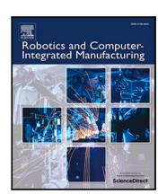

# Review

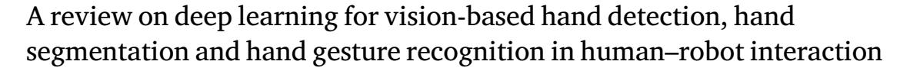

Reza Jalayer [a](#page-0-0),[b](#page-0-1) ,[∗](#page-0-2) , Masoud Jalayer [c](#page-0-3),[d](#page-0-4) , Carlotta Orsenigo [a](#page-0-0) , Masayoshi Tomizuka [b](#page-0-1)

- a *Department of Management, Economics and Industrial Engineering, Politecnico di Milano, Via Lambruschini 24/b, 20156, Milan, Italy*
- b *Department of Mechanical Engineering, University of California at Berkeley, Berkeley, CA 94709, USA*
- c *Department of Materials and Mechanical Engineering, University of Turku, Vesilinnantie 5, Turku, 20014, Finland*
- d *Department of Information and Communications Engineering, Konemiehentie 1, Espoo, 02150, Finland*

### A R T I C L E I N F O

# *Keywords:* Human–robot interaction Hand gesture

Foundation models Collaborative robots Deep learning Multi-modal interaction

#### A B S T R A C T

Hand-based analysis, including hand detection, segmentation, and gesture recognition, plays a pivotal role in enabling natural and intuitive human–robot interaction (HRI). Recent advances in vision-based deep learning (DL) have significantly improved robots' ability to interpret hand cues across diverse settings. However, previous reviews have not addressed all three tasks collectively or focused on recent DL architectures. Filling this gap, we review recent studies at the intersection of DL and hand-based interaction in HRI. We structure the literature around three core tasks, i.e. hand detection, segmentation, and gesture recognition, highlighting DL models, dataset characteristics, evaluation metrics, and key challenges for each. We further examine the application of these models across industrial, assistive, social, aerial, and space robotics domains. We identify the dominant role of Convolutional and Recurrent Neural Networks (CNNs and RNNs), as well as emerging approaches such as attention-based models (Transformers), uncertainty-aware models, Graph Neural Networks (GNNs), and foundation models, i.e. Vision-Language Models (VLMs) and Large Language Models (LLMs). Our analysis reveals gaps, including the scarcity of HRI-specific datasets, underrepresentation of multi-hand and multi-user scenarios, limited use of RGBD and multi-modal inputs, weak cross-dataset generalization, and inconsistent real-time benchmarking. Dynamic and long-range gestures, multi-view setups, and contextaware understanding also remain relatively underexplored. Despite these limitations, promising directions have emerged, such as multi-modal fusion, use of foundation models for intent reasoning, and the development of lightweight architectures for deployment. This review offers a consolidated foundation to support future research on robust and context-aware DL systems for hand-centric HRI.

#### **Contents**

| 1. |      |        | Introduction                                                        | 2 |
|----|------|--------|---------------------------------------------------------------------|---|
| 2. |      |        | Review methodology                                                  | 3 |
| 3. |      |        | Hand detection and segmentation                                     | 5 |
|    | 3.1. |        | Deep learning models                                                | 5 |
|    |      | 3.1.1. | Convolutional neural networks                                       | 6 |
|    |      | 3.1.2. | Recurrent neural networks & convolutional recurrent neural networks | 8 |
|    |      | 3.1.3. | Recent deep learning approaches                                     | 8 |
|    | 3.2. |        | Continuous hand detection and segmentation (hand tracking)          | 8 |
|    | 3.3. |        | Overview of DL-based hand detection and segmentation papers         | 9 |
|    | 3.4. |        | Datasets 10                                                         |   |
|    |      | 3.4.1. | Hand detection datasets 10                                          |   |
|    |      | 3.4.2. | Hand segmentation datasets 10                                       |   |
|    | 3.5. |        | Evaluation metrics 11                                               |   |
|    |      | 3.5.1. | Hand detection performance metrics 11                               |   |

*E-mail addresses:* [reza.jalayer@polimi.it](mailto:reza.jalayer@polimi.it) (R. Jalayer), [masoud.jalayer@aalto.fi](mailto:masoud.jalayer@aalto.fi) (M. Jalayer).

∗ Corresponding author at: Department of Management, Economics and Industrial Engineering, Politecnico di Milano, Via Lambruschini 24/b, 20156, Milan, Italy.

|    |      | 3.5.2. | Hand segmentation performance metrics 12                                   |  |
|----|------|--------|----------------------------------------------------------------------------|--|
|    |      | 3.5.3. | Speed metrics 13                                                           |  |
|    | 3.6. |        | Challenges and opportunities in hand detection and segmentation 13         |  |
|    |      | 3.6.1. | Advanced models: foundation models and advanced segmentation techniques 13 |  |
|    |      | 3.6.2. | Data collection considerations 13                                          |  |
|    |      | 3.6.3. | Adaptability and real-time 14                                              |  |
| 4. |      |        | Hand gesture recognition 14                                                |  |
|    | 4.1. |        | Deep learning models 14                                                    |  |
|    |      | 4.1.1. | Convolutional neural networks 15                                           |  |
|    |      | 4.1.2. | Recurrent neural networks & convolutional recurrent neural networks 16     |  |
|    |      | 4.1.3. | Recent deep learning approaches 17                                         |  |
|    | 4.2. |        | Overview of DL-based hand gesture recognition papers 18                    |  |
|    | 4.3. |        | Datasets 18                                                                |  |
|    |      | 4.3.1. | Static hand gesture datasets 18                                            |  |
|    |      | 4.3.2. | Dynamic hand gesture datasets 21                                           |  |
|    | 4.4. |        | Evaluation metrics 21                                                      |  |
|    | 4.5. |        | Challenges and opportunities 22                                            |  |
| 5. |      |        | Applications in HRI 23                                                     |  |
|    | 5.1. |        | Industrial and collaborative robotics 23                                   |  |
|    | 5.2. |        | Healthcare and assistive robotics 23                                       |  |
|    | 5.3. |        | Social and companion robotics 23                                           |  |
|    | 5.4. |        | Space and aerial robotics 23                                               |  |
|    | 5.5. |        | General domains and other 24                                               |  |
| 6. |      |        | Future avenues 25                                                          |  |
| 7. |      |        | Conclusions 26                                                             |  |
|    |      |        | CRediT authorship contribution statement 26                                |  |
|    |      |        | Declaration of competing interest 26                                       |  |
|    |      |        | Acknowledgments 26                                                         |  |
|    |      |        | Appendix. Other datasets 26                                                |  |
|    |      |        | Data availability 28                                                       |  |
|    |      |        | References 28                                                              |  |
|    |      |        |                                                                            |  |

### **1. Introduction**

Human hands play a central role in nearly all forms of interaction, whether it be with objects, the environment, or other individuals. A significant portion of human communication relies on non-verbal cues, and hand gestures are among the most expressive components of such interactions [\[1\]](#page-27-2). In the context of human–robot interaction (HRI), the importance of hands becomes even more pronounced, as they are integral to conveying both physical and symbolic information. Hands are used for manipulating objects in collaborative tasks, issuing instructions through gestures, and expressing intentions or emotions. With robots increasingly sharing workspaces with humans in diverse fields such as manufacturing [[2](#page-27-3)], healthcare [[3](#page-27-4)], and assistive technologies [[4](#page-27-5)], the ability to accurately detect, interpret, and respond to human hand movements is essential for ensuring safety, efficiency, and seamless collaboration.

Vision-based methods have emerged as a cornerstone for addressing hand-related tasks in HRI due to their non-invasive nature and ability to capture rich contextual information. Unlike wearable sensors, e.g. Electromyography (EMG) or data gloves [\(Figs.](#page-2-1) [1\(a\)](#page-2-1) and [1\(b\)](#page-2-2)), vision-based approaches ([Fig.](#page-2-3) [1\(c\)\)](#page-2-3) enable natural interaction without requiring humans to wear or carry additional devices [\[5\]](#page-27-6). These methods utilize camera data to detect, segment, and analyze hand movements, allowing robots to identify the presence of hands and subsequently predict gestures or actions. This capability is especially valuable in dynamic environments, such as industrial settings, where hands interact with tools, machinery, and other objects. Moreover, vision-based approaches support multi-modal understanding by integrating visual cues from hand movements with other sensory data.

In recent years, deep learning (DL) models have significantly advanced the capabilities of vision-based approaches for hand detection, segmentation, and hand gesture recognition. These models excel in handling the complexity of visual data, automatically extracting features from images without the need for manual feature engineering [[5](#page-27-6)]. The rapid evolution of DL architectures, coupled with advancements in computational resources, has facilitated their widespread adoption, enabling high accuracy in tasks involving variability and complexity.

Despite the growing body of research in this domain, the existing literature lacks a comprehensive review that holistically addresses all stages of hand-related tasks in vision-based HRI. [Table](#page-2-4) [1](#page-2-4) lists the most relevant surveys published since 2020. While these reviews provide valuable insights, they leave significant gaps that this paper seeks to address. For example, the recent review by Qi et al. [[5](#page-27-6)] focuses exclusively on gesture recognition and does not cover hand detection and segmentation in HRI. Furthermore, their review places limited emphasis on DL methods, concentrating instead on traditional computer vision techniques like template matching and classical machine learning (ML) models. Similarly, the review by Shin et al. [[8](#page-27-7)] takes a broad approach covering multiple modalities but failing to delve deeply into computer vision or DL-based methods specific to HRI.

Other recent reviews, such as that by Benmessabih et al. [[9](#page-27-8)], examine motion analysis in industrial contexts but do not adequately focus on hand-related tasks or their application in HRI. Hashi et al. [\[10](#page-27-9)] review hand gesture studies but do not concentrate on vision-based approaches (they included wearable sensors studies) or DL methods, and the reviewed articles are not specific to HRI applications. Additionally, older reviews, such as those by Rawat et al. [[11\]](#page-27-10), Guo et al. [[6](#page-27-11)], and Sarma et al. [\[15](#page-27-12)], primarily address general applications of hand gesture recognition, often outside the scope of HRI. Of these, only the work by Jain et al. [[13\]](#page-27-13) focuses on DL models but restricts its scope to dynamic gesture recognition (prior to 2021), leaving many other areas such as static hand gestures, hand detection, and segmentation unexplored.

A common limitation across these reviews is their narrow focus on hand gesture recognition. However, there are many studies that have proposed hand detection and segmentation in their frameworks, and they are rarely reviewed in surveys. Furthermore, recent advancements in DL methods, including attention-based models and foundation models, i.e. Large Language Models (LLMs) and Vision Language Models

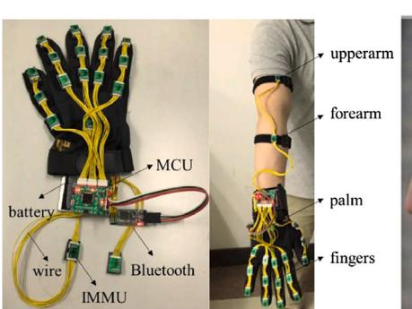

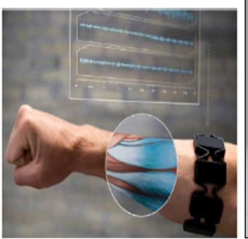

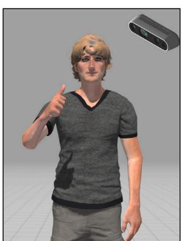

(a) Wearable sensors (data gloves [\[6](#page-27-11)]). The image is reproduced from [\[7](#page-27-14)] with permission from Elsevier.

(b) Wearable sensors (EMG). Reproduced from [\[8](#page-27-7)], licensed under CC BY-NC-ND 4.0.

(c) Vision-based (our focus)

**Fig. 1.** Different approaches (wearable sensors and vision-based) for capturing hand information.

**Table 1** Summary of related recent review articles (from 2020 onwards). In the Focus column, the abbreviations are HGR (Hand Gesture Recognition), DHGR (Dynamic Hand Gesture Recognition), MA (Motion Analysis), HD (Hand Detection), HS (Hand Segmentation), and AR (Action Recognition). In the Modalities columns, the abbreviations are V (Vision) and W (Wearable sensors). In the Applications columns, the abbreviations are HRI (Human–Robot Interaction), HMI (Human–Machine Interaction), HCI (Human–Computer Interaction), IND (Industrial), and G (General).

| Reference | Title                                                                                                             | Year | Time-span  | Focus                 | Modality | Application    |
|-----------|-------------------------------------------------------------------------------------------------------------------|------|------------|-----------------------|----------|----------------|
| [5]       | Computer vision-based hand gesture recognition for human–robot interaction: a review                           | 2024 | Up to 2023 | HGR                   | V        | HRI            |
| [8]       | A methodological and structural review of hand gesture recognition across diverse data modalities              | 2024 | 2014-2024  | HGR                   | V + W    | G              |
| [9]       | Online human motion analysis in industrial context: A review                                                   | 2024 | 2018-2023  | MA                    | V + W    | IND            |
| [10]      | A systematic review of hand gesture recognition: An update from 2018 to 2024                                   | 2024 | 2018-2024  | HGR                   | V + W    | G              |
| [11]      | A Review on Vision-based Hand Gesture Recognition Targeting RGB-Depth Sensors                                  | 2023 | Up to 2022 | HGR                   | V        | G              |
| [12]      | A Structured and Methodological Review on Vision-Based Hand Gesture Recognition System                         | 2022 | Up to 2022 | HGR                   | V        | G              |
| [13]      | Literature review of vision-based dynamic gesture recognition using deep learning techniques                   | 2022 | Up to 2021 | DHGR                  | V        | G              |
| [14]      | Emerging Wearable Interfaces and Algorithms for Hand Gesture Recognition: A Survey                             | 2022 | Up to 2021 | HGR                   | W        | G              |
| [6]       | Human–machine interaction sensing technology based on hand gesture recognition: A review                       | 2021 | Up to 2021 | HGR                   | V + W    | HMI            |
| [15]      | Methods, Databases and Recent Advancement of VisionBased Hand Gesture Recognition for HCI Systems: A Review | 2021 | Up to 2021 | HGR                   | V        | HCI            |
| [16]      | Gesture Recognition in Robotic Surgery: A Review                                                                  | 2021 | Up to 2020 | HGR                   | V + W    | HRI (surgical) |
| [17]      | Review of dynamic gesture recognition                                                                             | 2021 | Up to 2020 | DHGR                  | V + W    | G              |
| [18]      | Analysis of the Hands in Egocentric Vision: A Survey                                                              | 2020 | Up to 2020 | HD + HS + HGR + AR | V        | G              |
| [19]      | Hand gesture recognition based on computer vision: a review of technique                                       | 2020 | Up to 2020 | HGR                   | V        | G              |

(VLMs), have not been sufficiently addressed in existing surveys despite their growing relevance and potential in this field.

These gaps underscore the need for a unified review that examines the interconnected tasks of vision-based hand detection, segmentation and hand gesture recognition within the specific context of HRI, with a focus on DL-based approaches.

This paper aims to bridge these gaps by providing a comprehensive review of vision-based DL models for human hand detection, segmentation, and hand gesture recognition in HRI. It critically analyzes state-of-the-art methods, benchmark datasets, and the challenges and opportunities associated with applying these techniques to real-world scenarios. Additionally, this review emphasizes the importance of integrating these tasks into cohesive systems that enable robots to perceive and respond effectively in complex HRI environments.

The remainder of the paper is organized as follows. Section [2](#page-2-5) outlines the methodology used to identify and select articles for this review. Section [3](#page-4-2) focuses on studies addressing hand detection and segmentation in HRI using DL models. Section [4](#page-13-3) reviews the literature related to hand gesture recognition. Section [5](#page-22-5) categorizes the reviewed works based on their applications in HRI. Section [6](#page-24-1) highlights the opportunities for future research. Finally, Section [7](#page-25-5) concludes the paper with a summary of key findings and implications. To facilitate navigation and illustrate the logical flow of this review, the overall structure of the review including its major sections and subsections is depicted in [Fig.](#page-3-0) [2](#page-3-0).

#### **2. Review methodology**

To construct a comprehensive review of vision-based deep learning models for human hand detection, hand segmentation, and hand gesture recognition in human–robot interaction, we formulated a targeted

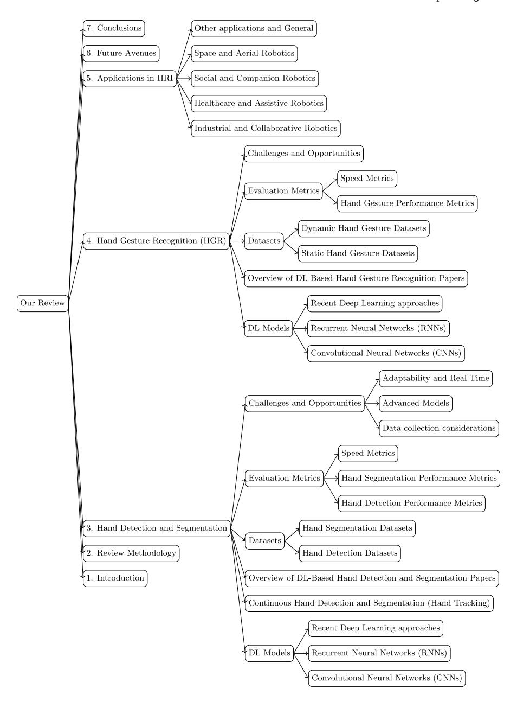

**Fig. 2.** Structure of the review paper across sections and subsections.

query to capture relevant studies from key academic databases, including Scopus, Web of Science (WOS), Google Scholar, and IEEEXplore. The search was structured around the following keywords:

(robot\* OR cobot\*) AND (human\* OR operator\*) AND (''hand detection'' OR ''hand segmentation'' OR ''hand gesture'' OR ''hand posture'' OR ''gesture recognition'' OR ''posture recognition'') AND (''deep learning'' OR ''DL'' OR ''AI'' OR ''artificial intelligence'' OR ''machine learning'' OR ''ML'')

The search covered the period from 2014 to the end of April 2025, reflecting recent advancements and emerging trends in the domain. This initial search was fine-tuned by filtering the papers written only in English, and yielded a total of 498 documents.

The first phase involved refining the results by removing duplicated entries across the databases, resulting in 472 unique articles. These articles were then screened based on their titles, abstracts, and keywords to ensure alignment with the objectives of this review. Specifically, studies that employed DL-based vision approaches were retained, while those relying on other modalities, such as wearable sensors, were excluded. Additionally, articles that focused on whole-body gestures or postures, rather than hand-centric tasks, were excluded. This phase reduced the pool to 129 articles.

Next, an in-depth screening process was conducted to further ensure the selected articles aligned with the scope of this review. This phase involved a detailed examination of the content of each paper to confirm its relevance to vision-based DL models for hand detection, hand segmentation and hand gesture recognition in HRI. For example, some studies using traditional ML methods, e.g. Support Vector Machines (SVMs), were excluded in this round to focus on more recent techniques. This advanced screening reduced the number of articles to 74.

Finally, the references and citations of the selected papers were examined to identify additional relevant studies that complemented the review. This process led to the inclusion of supplementary resources,

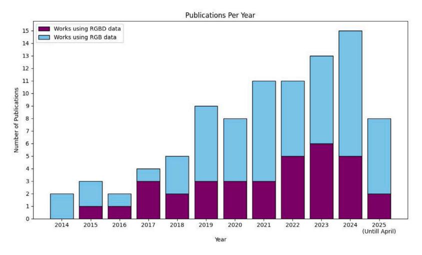

**Fig. 3.** Publications per year collected in our review on vision-based hand detection, segmentation, and gesture recognition in HRI using DL models. Each column is divided to show the vision modality used: the blue section represents works utilizing RGB data, while the purple section indicates papers employing RGBD data.

ultimately resulting in a total of 91 articles forming the foundation of this comprehensive analysis.

We analyzed the 91 papers by their publication years and the vision modalities they employed, which were either monocular RGB or depth-enhanced RGBD. Among these works, the majority (57 papers) relied on RGB data, while RGBD-based studies accounted for 34 papers, representing nearly half the number of RGB-based works.

The trend of publications per year, as illustrated in [Fig.](#page-4-3) [3,](#page-4-3) reveals a consistent overall growth in research interest in vision-based hand detection, segmentation, and gesture recognition tasks within human– robot interaction contexts using deep learning models. From 2014 to 2018, the number of publications was relatively modest, reflecting an initial exploration phase in this field. However, starting in 2019, the volume of studies increased. This rise aligns with the growing prominence of HRI applications and the rapid advancement of DL models, which have proven capable of addressing increasingly complex vision-based challenges. The relatively low publication count for 2025 is attributed to the dataset cutoff in April 2025.

Within these publications, the use of RGBD data exhibits a distinct yet complementary growth pattern. While early studies primarily relied on RGB data, RGBD-based research began gaining momentum in 2017, albeit at a slower pace. The emergence of improved RGBD cameras, such as newer generations of Microsoft Kinect, Leap Motion, and Intel RealSense, has contributed significantly to this growth. These devices provide enhanced depth information, which has become increasingly recognized as a key factor for improving the performance of hand detection and segmentation in dynamic and cluttered HRI environments. In recent years, the adoption of RGBD approaches has accelerated, reflecting a growing appreciation for the role of depth data in enabling robust and adaptable systems.

Overall, the increasing reliance on both RGB and RGBD data underscores the expanding scope and sophistication of vision-based DL models in HRI research. This upward trajectory highlights the growing emphasis on developing systems capable of accurately interpreting complex human hand movements in real-world settings. These trends further reinforce the importance of a comprehensive review to identify and analyze these advancements, address existing gaps, and chart future opportunities in this rapidly evolving domain.

This rigorous methodology ensured that the selected articles were both high-quality and domain-specific, providing a robust basis for analyzing state-of-the-art methods, datasets, and challenges in applying vision-based DL models for hand-centric tasks in HRI.

### **3. Hand detection and segmentation**

Hand detection and segmentation serve as foundational steps for higher-level tasks such as hand gesture recognition and action recognition. Precise hand segmentation enables robots to accurately distinguish human hands from background clutter, facilitating safe and efficient collaboration in shared human–robot workspaces. By localizing hands effectively, robots can better interpret human intent, ensuring smoother interaction in various HRI applications.

While much of the research in this domain focuses on hand gesture recognition, some studies have restricted their objectives to hand detection and segmentation. Hand detection can be done either by identifying hands as bounding boxes or key-points, as can be seen in [Figs.](#page-5-1) [4\(a\)](#page-5-1) and [4\(b\)](#page-5-2). In addition, some works focused on hand segmentation by isolating hands at the pixel level within recorded images, as schematically depicted in [Fig.](#page-5-3) [4\(c\).](#page-5-3) These foundational works are often underrepresented in surveys that predominantly emphasize gesture recognition. With the aim of emphasizing their importance, this section explores studies that specifically address hand detection or segmentation, as well as works on gesture recognition that also cover hand detection or segmentation within their studies.

We organize this section into the following areas. First, we categorize the works based on the diversity of deep learning architectures employed, highlighting the variety of approaches and emphasizing recent models in the field. Next, we explore the datasets used in these studies to give a clear understanding of each dataset and provide insights for future studies. Then, we discuss the metrics commonly used to evaluate hand detection and segmentation models. Finally, we identify the challenges faced in this domain and highlight opportunities for advancing hand detection and segmentation research in the context of HRI.

# *3.1. Deep learning models*

Early works, such as that by Luo et al. [[21\]](#page-27-21), utilized traditional machine learning algorithms like Support Vector Machines for detecting human hands in human–robot interaction tasks. These methods fall outside the scope of deep learning (DL) and are therefore not included in this review. Traditional machine learning models often relied on handcrafted features and lacked the ability to automatically learn representations directly from raw data, adding unnecessary efforts compared to DL models.

In the reviewed works, DL models for hand detection and segmentation predominantly fall into categories such as Convolutional Neural

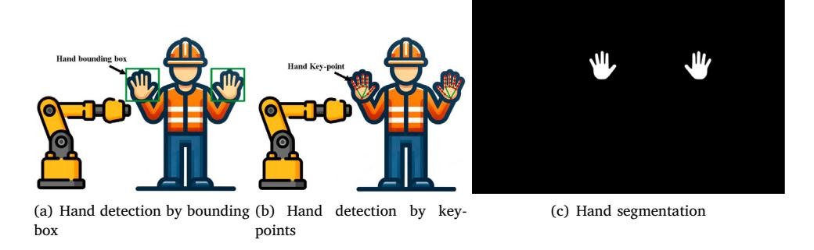

**Fig. 4.** Schematic visualizations of (a) hand detection by bounding box (b) hand detection by key-points (c) hand segmentation in a human robotic interaction scene.

*Source:* Reproduced from [[20\]](#page-27-22), licensed under CC BY 4.0.

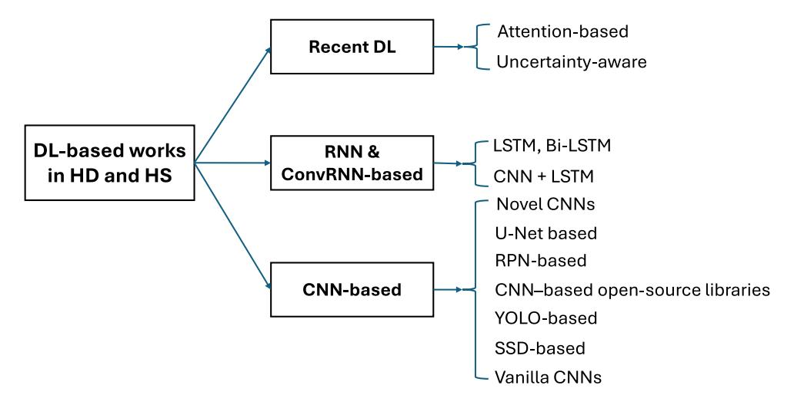

**Fig. 5.** Categories of DL-based hand detection and hand segmentation works.

Networks (CNNs) and, to a lesser extent, Recurrent Neural Networks (RNNs). Recent advances have introduced uncertainty-aware models like Bayesian Neural Networks (BNNs) and Deep Ensembles, alongside attention-based architectures for enhanced feature extraction. These emerging trends highlight the evolving sophistication of DL models in addressing complex vision-based challenges in HRI. For better clarity, the categories and subcategories of DL-based studies for hand detection and segmentation are illustrated in [Fig.](#page-5-4) [5](#page-5-4).

# *3.1.1. Convolutional neural networks*

Convolutional Neural Networks [\[22](#page-27-23)] are widely recognized for their ability to process spatially structured data, making them a cornerstone of computer vision tasks. CNNs excel at extracting local patterns in images, such as edges, textures, and shapes, which are critical for detecting and segmenting human hands in cluttered and dynamic environments.

Among the reviewed works, Lim et al. [[23\]](#page-27-24) pioneered the use of CNNs in hand detection in HRI. In this work, they did both human and hand detection and then identified hand gestures in an assembly task with an industrial robot using RGBD images. However, their study was limited to detecting a single hand and did not extend to hand segmentation. Similarly, Liu et al. [[24\]](#page-27-25) employed CNNs alongside Leap Motion cameras to detect hand skeleton models. Their study integrated hand motion detection with multi-modal features such as body posture and voice recognition, advancing the field by detecting dynamic hand motion. However, they also restricted their detection to a single hand and did not address segmentation.

**SSD-based approaches:** Gao et al. [\[25](#page-27-26)] were the first to apply the Single Shot Multibox Detector (SSD) in HRI for hand detection. SSD, introduced by Liu et al. [[26\]](#page-27-27), is a CNN-based architecture designed for fast and efficient object detection by leveraging multiple feature maps at different scales. Gao et al. used SSD to detect and locate human hands captured by Kinect cameras, primarily for space human–robot interaction (SHRI) tasks. The architecture was modified to improve the detection of small hands, addressing a key limitation of earlier models. However, their initial study was restricted to detecting a single hand. To overcome this limitation, Gao et al. [\[27](#page-27-28)] developed a dual-hand detection framework consisting of the Inception block and deep residual networks (ResNet [[28\]](#page-27-29)) that have been successfully implemented in previous works [[29\]](#page-27-30). This framework allowed the simultaneous detection of both left and right hands in HRI scenarios. Subsequently, they introduced an enhanced SSD architecture called the Feature-Map-Fused Single Shot Multibox Detector (FF-SSD) [[30\]](#page-27-31), which achieved higher accuracy and faster real-time performance in astronaut-robot interaction tasks. The SSD-inspired models have been widely adopted in other HRI studies. Asif et al. [\[31](#page-27-32)] proposed a CNN model inspired by SSD to detect bounding boxes of operator hands within RGBD images captured by Microsoft Kinect V2 cameras. Similarly, Ghasemi et al. [\[32](#page-27-33)] utilized SSD to detect hand locations, enabling the control of aerial robots in Robot Operating System (ROS [[33\]](#page-27-34)) simulations. Chumkamon et al. [\[34](#page-27-35)] extended SSD applications to assistive robotics, detecting hand locations of visually impaired individuals to plan robot motion for object grasping. This integration of hand detection with motion planning demonstrates the versatility of SSD in addressing diverse HRI challenges.

**YOLO-based approaches:** The YOLO (You Only Look Once) family of models is a series of CNN-based architectures designed for fast and accurate object detection by processing the entire image in a single forward pass through the network [[35\]](#page-27-36). This characteristic makes YOLO models particularly well-suited for real-time applications, including hand detection and segmentation tasks in HRI. Chen et al. [\[36](#page-27-37)] employed YOLOv3 [\[37](#page-27-38)], the third version of YOLO, to develop an end-to-end system for detecting, segmenting, and recognizing hand gestures. This framework was used to facilitate interactions between a human operator and a snake-like robot for control tasks, highlighting YOLOv3's ability to integrate multiple tasks seamlessly in HRI. Panteleris et al. [\[38](#page-27-39)] leveraged YOLOv2 [\[39](#page-27-40)] for detecting left and right hands in wild, uncontrolled environments. Their approach focused on predicting the joint positions of each hand from RGB images in realtime, demonstrating YOLOv2's suitability for dynamic scenarios. To enhance the accuracy of hand joint predictions, they utilized Open-Pose [\[40](#page-27-41)], an open-source library using a pre-trained CNN model, to annotate hands and faces before training YOLOv2. In a recent work, Park et al. [[41\]](#page-27-42) employed YOLOv8 [[42\]](#page-27-43), a very new version of YOLO version, for simultaneous detection of prosthetic robot hands and objects. This system enabled grasp-and-release functionalities in HRI by using RGBD images captured from an Intel RealSense SR305 camera mounted on the operator's forehead, providing an egocentric view essential for accurate detection in dynamic environments. Hubert et al. [[43](#page-27-44)] used YOLOv8 architecture for hand detection of operators working with an industrial cobot in multiple viewpoints.

**Open-source libraries (OpenPose and MediaPipe):** OpenPose, a popular open-source library built on CNN architectures, has been widely adopted in HRI tasks for detecting hand key-points. For instance, Mazhar et al. [[44\]](#page-28-0) employed OpenPose to obtain skeletal joint coordinates from RGBD data captured by a Microsoft Kinect V2 camera, which were then used to localize the operator's hands within bounding boxes during interactions with industrial robots. A recent study by Shaw et al. [[45\]](#page-28-1) leveraged OpenPose to detect the hand bounding box and hand key-points in a visual teleoperation pipeline designed for human–robot interaction. Another widely used open-source library is MediaPipe Hands [\[46](#page-28-2)], developed by Google. MediaPipe relies on CNN-based architectures to detect the palm of a hand and identify 21 landmarks (key-points) with high precision. In a comparative study, Docekal et al. [\[47](#page-28-3)] evaluated the performance of OpenPose and MediaPipe in detecting hand key-points in both static and dynamic scenarios from a camera mounted on the head of a humanoid robot. This study concluded that MediaPipe outperformed OpenPose in accuracy for hand key-point detection. Naseer et al. [\[48](#page-28-4)] applied MediaPipe to detect hand key-points for controlling drones, while Qin et al. [\[49](#page-28-5)] used it for teleoperation tasks involving human–robot collaboration. Bensaadallah et al. [\[50](#page-28-6)] used it to detect human hands and extract key-points for gesture-based control of an R12 robot. Similarly, Peral et al. [\[51](#page-28-7)] employed MediaPipe within the proposed two-stage framework ''EU-REKA'', to extract hand key-points, enabling gesture recognition during interactions with an assistant robot (IVO). MediaPipe has been utilized extensively in recent HRI research. A very recent work by Phuong et al. [\[52](#page-28-8)] used MediaPipe to detect hand location and key-points. Then, based on this information, the position and state of the operator's hand are obtained to remotely control the robot's joints. In agricultural applications, Srinil et al. [[53\]](#page-28-9) lately employed MediaPipe to effectively detect hand key-points and then hand gesture-based UAV control, allowing farmers to operate drones through hand gestures. Another recent study by Mendez et al. [\[54](#page-28-10)] combined MediaPipe with voice recognition and object detection for multi-modal interaction during collaborative assembly tasks with cobots. In a new work by Wang et al. [\[55](#page-28-11)] the hand key-points obtained by MediaPipe from two hands of a human operator (42 key-points) and then this information was used as a novel work to predict the human actions in both static and dynamic action recognition as a smart human–robot collaboration. Two recent studies [\[56](#page-28-12)[,57](#page-28-13)] utilized hand key-point detection via MediaPipe as a preprocessing step to enhance hand gesture recognition in HRI. They then integrated this key-point data with Large Language Models, leveraging their advanced contextual understanding to improve gesture interpretation and recognition. In addition to standalone use, MediaPipe and OpenPose have been integrated with other advanced models to enhance performance. For instance, Shi et al. [\[58](#page-28-14)] combined MediaPipe with YOLOv5 to improve hand and key-point detection, which was then used for gesture recognition to control a 3D printer robot. Hand key-pint detection was also done by other pre-trained models aside from OpenPose and MediaPipe, for instance, Csonka et al. [\[59](#page-28-15)] used pre-trained CNN architectures like MobileNet [[60\]](#page-28-16) and VGG16 [\[61](#page-28-17)] to detect hand key-points prior to implementing gesture recognition to control robot.

**RPN-based works:** Mask R-CNN, proposed by He et al. [\[62](#page-28-18)], is a versatile architecture that integrates Region Proposal Networks (RPN) to identify regions of interest within images, enabling simultaneous object detection and pixel-wise segmentation. Known for its efficiency, Mask R-CNN has been widely used in HRI for segmenting human hands and other body parts [[63\]](#page-28-19). For instance, Almeida et al. [\[64](#page-28-20)] applied Mask R-CNN to detect and segment hand regions in RGB images of a humanoid robot. To overcome dataset limitations, they employed simulation using the Unity game engine [[65\]](#page-28-21) and applied domain randomization technique [\[66](#page-28-22)] to generate diverse training data, effectively bridging the reality gap. Grushko et al. [\[67](#page-28-23)] further validated the effectiveness of Mask R-CNN for segmenting hands in cluttered industrial environments, showing its superior performance on RGBD data compared to alternative architectures. Additionally, Faster R-CNN [[68\]](#page-28-24), another RPN-based model, has also been employed for hand detection tasks. Bao et al. [[69\]](#page-28-25) recently used a pre-trained hand detection model based on Faster R-CNN used in [[70\]](#page-28-26) to detect bounding boxes of human hands within their experiment on Vision Language Model (VLM) to predict hand motion from egocentric videos.

**U-Net-based works:** U-Net, introduced by Ronneberger et al. [\[71](#page-28-27)], is a CNN architecture originally designed for biomedical segmentation tasks. Its encoder–decoder structure has been widely adopted across domains, including hand segmentation. Vysocky et al. [[72\]](#page-28-28) utilized U-Net to segment hands captured by an Intel RealSense D435 RGBD camera. Their primary objective was to create a synthetic dataset using domain randomization techniques to train depth-image segmentation models for hand localization. They evaluated the effectiveness of U-Net by training it on their synthetic dataset and applying it to segment human hands in real-world industrial HRI scenarios using RGBD data. Similarly, in a recent study, Sharma et al. [[73\]](#page-28-29) demonstrated the superiority of U-Net over other architectures for segmenting human hands in industrial human–robot interaction settings, showcasing its robustness in complex environments. Jalayer et al. [\[20](#page-27-22)] used U-Net and also a similar encoder–decoder architecture, i.e. RefineNet [[74\]](#page-28-30), to segment the hands of one and two human operators with an industrial robot.

**Novel CNN-based works:** Beyond the typical CNN architectures, several novel approaches have been proposed for hand detection and segmentation in HRI. Gao et al. [\[75](#page-28-31)] introduced a two-stream CNN (2S-CNN) framework that processes depth and RGB images simultaneously. In the first phase, the model segments a human operator's hand pixels from depth images, and the segmented regions are then used for hand gesture recognition tasks. While innovative, their method relies on the assumption that the closest pixel in-depth images corresponds to the hand area, which may not always hold true. Additionally, their work was limited to static hand segmentation and did not account for dynamic hand motions. Urkmez et al. [\[76](#page-28-32)] utilized two CNN models to detect human and hand bounding boxes from RGB-D images and used depth data to predict the 3D pointing direction of humans interacting with mobile robots. Among the tested models, YOLOv4 outperformed SSD and other CNN architectures in terms of accuracy and efficiency. Gao et al. [\[77](#page-28-33)] proposed a novel architecture called HandDetNet, which employs four CNN-based modules for precise operator's hand detection interacting with a robot. These modules include a center detection module, an offset detection module to refine center deviations, a size module to adapt to varying hand sizes, and a corner detection module for accurate bounding box generation. The authors demonstrated that HandDetNet achieved superior accuracy in hand detection compared to SSD and YOLO-based models, highlighting its potential for real-world applications.

### *3.1.2. Recurrent neural networks & convolutional recurrent neural networks*

Recurrent Neural Networks and their advanced variant, Long Short-Term Memory Networks (LSTMs), are particularly well-suited for sequential data processing [\[78](#page-28-34)]. These architectures excel at capturing temporal dynamics by maintaining a memory of previous inputs, which is critical for analyzing sequential data like video frames. While CNNs effectively analyze spatial data, RNNs and LSTMs complement them by processing temporal dependencies, making them indispensable for tasks involving dynamic hand detection and segmentation in video streams. In a study by Pozo et al. [\[79](#page-28-35)], an LSTM-based architecture was used alongside a Multi-view Bootstrapping technique, where multiple cameras captured the same hand from different angles. This approach enabled robust detection of human hand key-points in dynamic environments to detect effectively human hands around an industrial robot. Their work aimed to enhance operator safety by integrating hand detection with robot motion planning through Model Predictive Control (MPC). In a recent study, Rekik et al. [[80](#page-28-36)] proposed a framework combining YOLOACT [\[81](#page-28-37)], a YOLO-inspired architecture, with LSTM blocks. This hybrid model first segmented human hands in each frame and then leveraged temporal feature recognition from the LSTM block to predict human intentions in real-time from sequential video frames. The framework was tested in a realistic industrial setting using two Azure Kinect RGBD cameras mounted above an assembly station to monitor human operators and robotic arms. The authors also conducted a comparative analysis of RNN and LSTM variants, including bidirectional RNNs (Bi-RNNs) [\[82](#page-28-38)], LSTMs, and bidirectional LSTMs (Bi-LSTMs) [\[83](#page-28-39)]. Their results demonstrated that LSTM-based models outperformed RNN-based models in accurately predicting human intentions in dynamic HRI scenarios.

### *3.1.3. Recent deep learning approaches*

**Uncertainty-aware DL models:** Traditional deep learning models are deterministic and lack the ability to quantify the uncertainty of their predictions. This limitation becomes critical when models encounter novel, unseen data, referred to as out-of-distribution (OOD) data, which can lead to unreliable predictions [[84\]](#page-28-40). To address this, uncertaintyaware approaches such as Bayesian Neural Networks (BNNs) and ensemble of DL models (Deep Ensembles) have gained traction for their ability to quantify predictive uncertainty [\[85](#page-28-41)]. These methods are particularly valuable in safety-critical applications, such as human–robot interaction. Cai et al. [\[86](#page-28-42)] employed a Bayesian Convolutional Neural Network (BCNN) to segment hands and quantify prediction uncertainty under unseen conditions. Leveraging the uncertainty quantified by the BCNN, they used a semi-supervised adaptation technique [\[87\]](#page-28-43) to improve the model's generalization for hand segmentation in new environments. Similarly, Sajedi et al. [\[88](#page-28-44)] applied BCNN for segmenting human operator hands interacting with industrial robots. Their results highlighted the model's capability for uncertainty quantification from RGB images captured from random frames of a video. In their study, the segmentation was done in a static way and deisrable prediction speed per frame in the inference phase illustrated the ability of realtime performance of their model. Furthermore, their study was limited to segmenting the hands of a single human operator in each frame, segmenting at most two hands. In a more recent study, Sharma et al. [\[73](#page-28-29)] utilized a deep ensemble approach based on U-Net architecture, outperforming other ensemble architectures such as MobileSAM [[89\]](#page-28-45) and BiSeNetV2 [[90\]](#page-28-46) for hand segmentation. Their work introduced a novel industrial HRI dataset incorporating both in-distribution (ID) and OOD data, including operators with and without gloves. Despite their success, their segmentation was limited to a single operator's hands, though they made the notable contribution of separating left and right hands into distinct classes. Jalayer et al. [[20\]](#page-27-22) extended this research by employing a deep ensemble model comprising U-Net and RefineNet for hand segmentation in HRI scenarios. They evaluated the model's performance on diverse OOD scenarios, including rare gestures, hands with and without gloves, motion blur, and multiple operators captured from side-view and egocentric RGB cameras (Intel RealSense D435 and GoPro). Their findings showed significant performance gaps on OOD data, underscoring the need for better generalization techniques. However, their work was limited to binary segmentation and both left and right hands were classified as a unique class.

**Attention mechanism in DL models:** The attention mechanism has emerged as a transformative concept in deep learning [\[91](#page-28-47)]. It could help in tasks requiring fine-grained spatial understanding such as hand detection and segmentation. Inspired by human cognitive processes, attention mechanisms allow models to selectively focus on the most relevant regions of an image, enhancing the accuracy of predictions. Zhang et al. [[92](#page-28-48)] incorporated spatial and mixed-channel attention modules into the lower layers of YOLOv5 architecture, significantly improving hand detection accuracy in HRI frameworks. Gao et al. [\[93](#page-28-49)] extended the Faster R-CNN architecture with a bi-stream attention module (BA), inspired by the Convolutional Block Attention Module (CBAM) [[94\]](#page-28-50), to detect hands more effectively in dynamic environment in HRI. Yu et al. [\[95](#page-28-51)] introduced a novel model combining self-attention mechanisms inspired by [[96\]](#page-28-52) with LSTM and SSD architectures. This novel model, referred to as ''TA-LSTM'', effectively captured temporal dependencies in video frames, enabling robust hand detection even for small hand regions in dynamic environments. The integration of self-attention and LSTM improved the model's ability to detect hands in real-time, showcasing its applicability in scenarios where human operators interact with space robots.

### *3.2. Continuous hand detection and segmentation (hand tracking)*

In many studies concerning HRI, hand tracking is an important task that builds upon the foundational processes of hand detection and segmentation. Its primary objective is to continuously monitor the hand's position and configuration across successive video frames, enabling the recognition of hand motion, speed, and dynamic location. This temporal understanding is crucial for predicting human intent, anticipating next moves, avoiding probable collisions, and recognizing complex human actions.

Various methodologies are employed for hand tracking. Some approaches leverage specialized hardware, such as built-in cameras with dedicated sensors. For instance, Liu et al. [[24\]](#page-27-25) utilized a Leap Motion sensor to record precise hand and finger positions with timestamps, schematically visualizing movements through color-coded lines (e.g., demonstrating left-to-right hand trajectories). However, the majority of research in this domain relies on open-source software for keypoint-based hand tracking. Frameworks like MediaPipe and Open-Pose are widely adopted due to their high accuracy and real-time processing capabilities, allowing experimenters to effectively track hand keypoints in continuous frames [\[47](#page-28-3)[,49](#page-28-5)[–54](#page-28-10),[57,](#page-28-13)[72\]](#page-28-28). These methods typically estimate the 2D or 3D coordinates of specific hand joints and fingertips, providing rich kinematic data. Beyond general-purpose keypoint estimation, some studies integrate specialized tracking models within broader robotic frameworks. For example, Asif et al. [\[31](#page-27-32)] employed the skeletal tracker package available in the Robot Operating System (ROS) OpenNI Tracker [[99\]](#page-29-0) to specifically track the hands of an operator working collaboratively with a robot. Another prevalent approach to hand tracking involves leveraging fast object detection models, such as SSD and YOLO, to track the bounding boxes of detected hands across frames. This method prioritizes real-time performance by focusing on the overall hand region rather than individual keypoints. For instance, Ghasemi et al. [[32\]](#page-27-33) and Yu et al. [\[95](#page-28-51)] both utilized SSD for hand tracking, with the former applying it to drone control

**Table 2** Studies using ML/DL models in hand detection and segmentation with their specific architectures. HD, HS, and HT stand for Hand Detection, Hand Segmentation, and Hand Tracking and Ego and Exo stand for Egocentric and Exocentric.

| Paper | Year | ML/DL model            | Architecture                                | HD/HS   | HT  | # hands per frame | Vision modality | Camera perspectives |
|-------|------|------------------------|---------------------------------------------|---------|-----|----------------------|--------------------|------------------------|
| [97]  | 2015 | Traditional ML         | SVM                                         | HD      | No  | 1                    | RGB                | Exo                    |
| [21]  | 2015 | Traditional ML         | SVM                                         | HD      | No  | 1                    | RGB                | Exo                    |
| [23]  | 2017 | DL (CNN)               | Vanilla CNN                                 | HD      | No  | 1                    | RGBD               | Exo                    |
| [24]  | 2018 | DL                     | MLP, Vanilla CNN, LSTM                      | HD      | Yes | 1                    | RGB                | Exo                    |
| [25]  | 2018 | DL (CNN)               | SSD                                         | HD      | No  | 1                    | RGB                | Exo                    |
| [27]  | 2019 | DL (CNN)               | SSD + ResNet + Inception                    | HD      | No  | 2                    | RGB                | Exo                    |
| [36]  | 2019 | DL (CNN)               | YOLOv3                                      | HD      | No  | 1                    | RGB                | Exo                    |
| [31]  | 2019 | DL (CNN)               | SSD + clustering + voting                   | HD + HS | Yes | 2                    | RGB                | Exo                    |
| [30]  | 2020 | DL (CNN)               | SSD                                         | HD      | No  | 1                    | RGB                | Exo                    |
| [32]  | 2020 | DL (CNN)               | SSD                                         | HD      | Yes | 1                    | RGBD               | Exo                    |
| [34]  | 2020 | DL (CNN)               | SSD                                         | HD      | No  | 1                    | RGBD               | Exo                    |
| [75]  | 2020 | DL (CNN)               | Two-Stream CNN (2S-CNN)                     | HS      | No  | 1                    | RGBD               | Exo                    |
| [86]  | 2020 | DL (Uncertainty-aware) | BCNN                                        | HS      | No  | 2                    | RGB                | Ego                    |
| [93]  | 2021 | DL (Attention-based)   | Faster R-CNN + bi-stream                    | HD      | No  | 1                    | RGBD               | Exo                    |
|       |      |                        | attention                                   |         |     |                      |                    |                        |
| [64]  | 2021 | DL (CNN)               | Faster R-CNN                                | HD + HS | No  | 1                    | RGB                | Ego                    |
|       |      |                        |                                             |         |     |                      |                    |                        |
| [95]  | 2021 | DL (Attention-based)   | SSD + Temporal Attention LSTM            | HD      | Yes | 4                    | RGB                | Exo                    |
| [51]  | 2022 | DL (CNN)               | MediaPipe (off-the-shelf)                   | HD      | Yes | 1                    | RGB                | Exo                    |
| [92]  | 2022 | DL (Attention-based)   | YOLOv5 + mixed-channel attention modules | HD      | Yes | 1                    | RGB                | Exo                    |
| [47]  | 2022 | DL (CNN)               | MediaPipe, OpenPose (off-the-shelf)      | HD      | Yes | 2                    | RGBD               | Exo                    |
| [72]  | 2022 | DL (CNN)               | OpenPose (off-the-shelf), U-Net             | HD + HS | Yes | 1                    | RGBD               | Exo                    |
| [77]  | 2022 | DL (CNN)               | HandDetNet                                  | HD      | Yes | 2                    | RGBD               | Exo                    |
| [76]  | 2022 | DL (CNN)               | YOLOv4, SSD, Faster R-CNN                   | HD      | No  | 1                    | RGBD               | Exo                    |
| [88]  | 2022 | DL (Uncertainty-aware) | BCNN                                        | HS      | No  | 2                    | RGB                | Exo                    |
| [48]  | 2022 | DL (CNN)               | MediaPipe (off-the-shelf)                   | HD      | No  | 1                    | RGB                | Exo                    |
| [56]  | 2023 | DL (CNN)               | MediaPipe (off-the-shelf)                   | HD      | No  | 1                    | RGBD               | Exo                    |
| [49]  | 2023 | DL (CNN)               | MediaPipe (off-the-shelf)                   | HD      | Yes | 1                    | RGBD               | Exo                    |
| [59]  | 2023 | DL (CNN)               | MobileNet                                   | HD      | Yes | 1                    | RGB                | Exo                    |
| [79]  | 2023 | DL (RNN)               | LSTM                                        | HD      | Yes | 1                    | RGB                | Exo                    |
| [50]  | 2023 | DL (CNN)               | MediaPipe (off-the-shelf)                   | HD      | Yes | 1                    | RGB                | Exo                    |
| [67]  | 2023 | DL (CNN)               | Mask R-CNN                                  | HD + HS | No  | 2                    | RGBD               | Exo                    |
| [58]  | 2024 | DL (CNN)               | YOLOv5 + MediaPipe                          | HD      | No  | 1                    | RGBD               | Exo                    |
|       |      |                        | (off-the-shelf)                             |         |     |                      |                    |                        |
| [45]  | 2024 | DL (CNN)               | OpenPose (off-the-shelf)                    | HD      | Yes | 2                    | RGB                | Ego + Exo              |
| [52]  |      |                        |                                             |         |     |                      |                    |                        |
|       | 2024 | DL (CNN)               | MediaPipe (off-the-shelf)                   | HD      | Yes | 1                    | RGB                | Exo                    |
| [73]  | 2024 | DL (Uncertainty-aware) | Ensemble of U-Net                           | HS      | No  | 2                    | RGB                | Exo                    |
| [53]  | 2024 | DL (CNN)               | MediaPipe (off-the-shelf)                   | HD      | Yes | 1                    | RGB                | Exo                    |
| [80]  | 2024 | DL (RNN)               | YOLO + LSTM, Bi-LSTMs                       | HS      | Yes | 2                    | RGBD               | Exo                    |
| [54]  | 2024 | DL (CNN)               | MediaPipe (off-the-shelf)                   | HD      | Yes | 1                    | RGBD               | Exo                    |
| [98]  | 2024 | DL (Attention-based)   | FGDSNet + Attention module                  | HS      | No  | 1                    | RGB                | Exo                    |
| [20]  | 2025 | DL (Uncertainty-aware) | Ensemble of U-Net + RefineNet            | HS      | No  | 4                    | RGB                | Ego + Exo              |
| [43]  | 2025 | DL (CNN)               | YOLOv8                                      | HD      | No  | 2                    | RGBD               | Exo                    |
| [57]  | 2025 | DL (CNN)               | MediaPipe (off-the-shelf)                   | HD      | Yes | 1                    | RGB                | Exo                    |

and the latter to the control of a space robot. The inherent speed of YOLO in hand detection has also been exploited for real-time hand tracking, contributing to the recognition and classification of hand actions (e.g. zooming on a touchscreen) [\[92](#page-28-48)]. Furthermore, the combination of YOLO's fast detection with variants of LSTM networks has been shown to effectively capture temporal patterns in consecutive frames, enabling the recognition of operator intent in human–robot collaborative industrial assembly scenarios [\[80](#page-28-36)]. This hybrid approach combines the spatial accuracy of bounding box detection with the temporal understanding provided by recurrent neural networks.

Ultimately, these hand tracking methodologies significantly enhance the naturalness and effectiveness of human–robot interaction because they provide a continuous understanding of human hand movement and intent. This crucial temporal context is largely absent in HRI studies that rely solely on discrete hand detection and segmentation.

#### *3.3. Overview of DL-based hand detection and segmentation papers*

To organize the studies employing ML or DL models for hand detection and segmentation, we present them in [Table](#page-8-1) [2](#page-8-1). This table details each work based on its architecture, whether it performs hand detection or segmentation, its inclusion of hand tracking, and the number of hands detected or segmented per frame.

As evident in [Table](#page-8-1) [2](#page-8-1), CNN-based architectures remain the most prevalent choice among models. However, a notable trend emerging post-2020 is the increasing integration of LSTM, attention-based modules, and uncertainty-aware models. Interestingly, many studies frequently utilized off-the-shelf open-source models like MediaPipe and OpenPose for hand key-points detection, without significant modifications. As can be observed, hand detection, whether via bounding boxes or key-points, is far more common than hand segmentation among the studies using DL models. Among them, very few papers (only four papers [[31,](#page-27-32)[64,](#page-28-20)[67](#page-28-23)[,72](#page-28-28)]) performed both hand detection and segmentation within the HRI experiments. While hand tracking was performed in some papers, it was often not a primary objective. Instead, most studies focused on detecting or segmenting hands in non-continuous video frames or shuffled dataset images. Furthermore, the majority of studies concentrated on detecting or segmenting a single operator's hand interacting with a robot, although some papers segment or detect both hands. Only two studies [\[20](#page-27-22),[95\]](#page-28-51) extended their scope to include detecting or segmenting hands of more than one operator simultaneously

**Table 3** Summary of hand detection and hand segmentation datasets used in HRI works. HD and HS stand for Hand Detection and Hand Segmentation and Ego and Exo stand for Egocentric and Exocentric.

| Dataset name         | Year | Used in HRI         | HD/HS | Annotation         | Domain     | Real/ Synthetic | Vision modality | #Annotated data | Camera perspectives |
|----------------------|------|---------------------|-------|--------------------|------------|--------------------|--------------------|--------------------|------------------------|
| Oxford-Hand [100]    | 2011 | [27,30,77]          | HD    | Bounding box       | General    | Real               | RGB                | 13 050             | Exo                    |
| COCO-Hands [101]     | 2019 | [76]                | HD    | Bounding box       | General    | Real               | RGB                | 26 499             | Exo                    |
| Epic Kitchen [102]   | 2020 | [45,69]             | HD    | Bounding box       | General    | Real               | RGB                | 454 200            | Ego                    |
| COCO-WholeBody [103] | 2020 | [47]                | HD    | Key-points +       | General    | Real               | RGB                | 66 700             | Exo                    |
|                      |      |                     |       | Bounding box       |            |                    |                    |                    |                        |
| H2O [104]            | 2021 | [69]                | HD    | Key-points         | General    | Real               | RGBD               | 571 645            | Ego                    |
| MECCANO [105]        | 2021 | [73]                | HD    | Bounding box       | Industrial | Real               | RGB                | 299 376            | Ego                    |
| Halpe [106]          | 2022 | [47]                | HD    | Key-points         | General    | Real               | RGB                | 43 700             | Exo                    |
| EgoHands [107]       | 2015 | [20,27,31,67,72,73, | HS    | Pixel              | General    | Real               | RGB                | 4800               | Ego                    |
|                      |      | 77,88,98]           |       |                    |            |                    |                    |                    |                        |
| ObMan [108]          | 2019 | [67,72]             | HS    | Key-points + Pixel | General    | Synthetic          | RGB                | 147 000            | Exo                    |
| HandSeg [109]        | 2019 | [67,72]             | HS    | Pixel              | General    | Real               | RGBD               | 150 000            | Exo                    |
| Ego2Hands [110]      | 2020 | [20]                | HS    | Pixel              | General    | Real               | RGB                | 2000               | Ego                    |
| HADR [67]            | 2023 | [20,67,73]          | HS    | Pixel              | HRI        | Synthetic          | RGBD               | 117 000            | Exo                    |
| HAGS [73]            | 2024 | [20,73]             | HS    | Pixel              | HRI        | Real               | RGB                | 1728               | Exo                    |
| Predictive intention | 2024 | [80]                | HS    | Pixel              | HRI        | Real               | RGBD               | 1000               | Exo                    |
| recognition [80]     |      |                     |       |                    |            |                    |                    |                    |                        |

present in the interaction scene, highlighting an under-explored area. It is interesting to note that in recent studies (since 2020), there has been a considerable increase in experiments utilizing RGBD cameras to exploit depth information, though RGB-only approaches still dominate the experiments. Another less-addressed aspect in the reviewed papers is the lack of consideration for an egocentric view (only used in [\[20](#page-27-22), [45,](#page-28-1)[64,](#page-28-20)[86\]](#page-28-42)), which could offer significant advantages for augmented and extended reality (AR/XR) glasses in robotic experiments.

### *3.4. Datasets*

Hand detection and segmentation using DL models rely heavily on high-quality datasets to achieve accurate and reliable results. However, the process of collecting and annotating such data is time and laborintensive. Consequently, many studies leverage existing datasets to train and evaluate their models. Gaining a clear understanding of these datasets can guide future research in selecting the most suitable data for their specific objectives. To aid this, we have compiled and summarized the hand detection and segmentation datasets utilized in the reviewed HRI studies, as shown in [Table](#page-9-3) [3.](#page-9-3)

# *3.4.1. Hand detection datasets*

As observed in [Table](#page-9-3) [3,](#page-9-3) seven datasets have been employed for hand detection. Among them, the Oxford-Hand dataset [[100\]](#page-29-3) is the most frequently used. Introduced in 2011, this dataset predates the others and consists of images collected from various public RGB image datasets. These images, captured from a third-person (exocentric) view, depict human hands in everyday activities and are annotated with bounding boxes (13 050 annotated frames). A notable feature of this dataset is its inclusion of a wide range of hand sizes, including very small hands, which is particularly beneficial for training models to detect hands of varying scales in HRI scenarios [[27\]](#page-27-28). The Epic Kitchens dataset [[102](#page-29-5)] is one of the largest hand detection datasets, containing approximately 454.2K annotated images extracted from 11.5 million frames. These frames were recorded over 55 h of video captured by 32 participants using GoPro wearable cameras mounted on their heads (egocentric view) in kitchen environments. Both hands and objects in the kitchen are annotated with bounding boxes. This RGB dataset has been widely used in HRI studies involving household robots, particularly for tasks such as human-to-robot object handovers [\[45](#page-28-1),[69\]](#page-28-25). The MECCANO dataset [\[105\]](#page-29-8) is unique among the listed datasets as it is specifically designed with an industrial theme. This dataset consists of 299,376 RGB frames captured from an egocentric view, featuring 20 participants assembling a motorbike model with tools and small industrial objects. Hands and objects are annotated with bounding boxes, and additional action annotations are included, making the dataset well-suited for training models with dual objectives (hand detection and action recognition). The H2O (2 Hands and Objects) dataset [\[69](#page-28-25)] stands out as the only dataset that uses RGBD images to provide 3D annotations for both hands and objects. It contains a large number (571,645) of RGBD frames captured from an egocentric view, featuring four participants performing 36 distinct action classes across three environments: hall, office, and kitchen. The focus on daily activities makes this dataset particularly useful for training service robots in everyday interactions. Beyond key-point annotations for both left and right hands, the dataset includes 3D object bounding boxes and action-class annotations, enabling multi-task training for hand detection, object detection, and action recognition. The COCO-Hands [\[101\]](#page-29-4) dataset is derived from a subset of Microsoft's COCO dataset [\[111\]](#page-29-14). Since the original COCO dataset does not include specific annotations for human hands, COCO-Hands selects and re-annotates 26,499 RGB images, resulting in bounding box annotations for a total of 45,671 hands. COCO-WholeBody [\[103\]](#page-29-6) is another dataset derived from Microsoft's COCO dataset, offering a more comprehensive annotation scheme. In addition to bounding boxes for hands, it provides annotations for the entire human body, including the face and feet. Each image includes 68 face key-points, 42 hand key-points, and 23 key-points for the body and feet. Bounding boxes are also provided for the person, face, left hand, and right hand. This dataset is especially useful for HRI scenarios requiring whole-body interaction, such as human–robot tasks in close proximity [[47\]](#page-28-3). Halpe-FullBody [[106](#page-29-9)] is similar to COCO-WholeBody in that it provides comprehensive annotations for human body parts, including hands, face, body, and feet. The primary difference lies in the key-point structure, with Halpe-FullBody providing 20 body key-points, 6 foot key-points, 42 hand key-points, and 68 face key-points. These detailed annotations make it suitable for tasks requiring fine-grained analysis of human body parts during interactions with robots.

### *3.4.2. Hand segmentation datasets*

Seven datasets have been utilized for hand segmentation tasks, as outlined in [Table](#page-9-3) [3](#page-9-3). Among them, EgoHands [\[110\]](#page-29-13) is the most commonly used. This dataset, captured using Google Glass, comprises 48 first-person interaction videos between two individuals, resulting in 4800 egocentric RGB pixel-wise segmented frames. The dataset includes high-quality ground truth segmentation masks for over 15,000 hands, distinguishing between the left and right hands of both participants across various activities and locations. EgoHands has been widely applied in HRI studies to segment human operator hands from cluttered backgrounds. Ego2Hands [[110](#page-29-13)] is another egocentric dataset used for hand segmentation. Unlike EgoHands, Ego2Hands focuses on the segmentation of inter-hand occlusion as a novel contribution. It contains 2000 pixel-wise segmented RGB frames using a headmount webcam (Logitech C922), captured from 8 videos, with 4 additional participants performing free two-hand motions across diverse scenes and lighting conditions. However, this dataset considers only one participant per frame, resulting in a maximum of two hands per image. This characteristic may limit its suitability for scenarios involving multiple human operators. For instance, a study by Jalayer et al. [[20\]](#page-27-22) demonstrated that models trained on EgoHands performed better when two operators were in the scene compared to those trained on Ego2Hands. Obman [\[108\]](#page-29-11) is an exocentric synthetic dataset that includes RGB images of humans holding various objects. It encompasses diverse poses, backgrounds, textures, and lighting conditions. The dataset provides segmentation masks and hand key-point annotations, making it highly suitable for tasks like object grasping in HRI. Despite its large size (147 000 annotated images) and variability, Obman has limitations due to its synthetic nature, which may fail to fully replicate realworld complexities. Additionally, similar to Ego2Hands, this dataset restricts the scene to a maximum of one human, limiting its applicability in multi-operator HRI scenarios. HandSeg [\[109\]](#page-29-12) is another dataset designed for hand segmentation, captured using an Intel RealSense SR300 RGBD camera. It includes 150,000 annotated frames, where participants wore brightly colored gloves to enable quasi-automatic annotation of left-hand and right-hand segmentation masks. Although this dataset benefits from its realistic nature and large size, the environmental conditions like lighting and occlusion are not diverse. Moreover, like Ego2Hands and Obman, it limits the scene to one human per frame, which is a drawback for real-world HRI applications.

Interestingly, recent HRI studies have introduced domain-specific hand segmentation datasets tailored for industrial applications. HADR [[67\]](#page-28-23) was the first hand segmentation dataset specifically designed for industrial HRI scenarios. It is a large synthetic RGBD dataset containing 117,000 images with hand segmentation masks. HADR employs domain randomization techniques to introduce variability in simulation environments, such as textures and lighting, to mitigate the ''reality gap'' [\[66](#page-28-22)]. Despite its size and variability, HADR is limited to a single human operator per frame, which is a common drawback shared with previous datasets (except EgoHands). HAGS, introduced by Sharma et al. [[73\]](#page-28-29), is a realistic RGB dataset designed for hand segmentation in industrial HRI settings. It contains over 9 h of video footage captured from both side-view and top-view cameras during assembly tasks. The dataset features 12 diverse participants and includes hands with gloves in different colors as well as bare hands as a novel contribution. The segmentation masks also separate the left and right hands into different classes. Although smaller than other datasets like HADR, models trained on HAGS have demonstrated superior performance due to the realism and domain specificity of the data [[20\]](#page-27-22). However, similar to other datasets, HAGS restricts each frame to two hands, limiting its use in multi-operator scenarios. In a recent study, Rekik et al. [\[80](#page-28-36)] introduced an RGBD hand segmentation dataset specifically designed for collaborative assembly tasks in industrial settings. This dataset was captured using an Azure Kinect camera and features ground truth hand segmentation masks, along with realistic industrial backgrounds that include robotic arms, tools, and partially assembled components. While this dataset is highly relevant to industrial HRI applications, it has certain limitations. Its size is smaller compared to other datasets, and like many others (except EgoHands), it is restricted to a single human per frame. Additionally, it does not account for variations such as hands with gloves and also different camera angles, which are included in the more diverse HAGS dataset.

It is worth noting that several hand detection and segmentation datasets remain unutilized in current HRI studies. To inform researchers of these resources, we list them in [Appendix](#page-25-6) ([Table](#page-26-0) [A.1\)](#page-26-0). This table exclusively features large datasets published after 2014, emphasizing newer and substantial resources.

### *3.5. Evaluation metrics*

Evaluating the performance of deep learning (DL) models in hand detection and segmentation is critical for assessing their robustness, precision, and efficiency. This ensures that the models are not only ac-

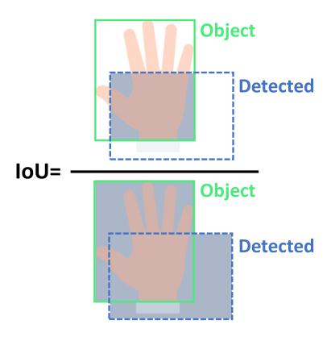

**Fig. 6.** Visualization of the IoU metric, illustrating the overlap between a predicted hand and the ground truth bounding box.

curate in detecting and segmenting hands but also capable of operating effectively in real-world human–robot interaction contexts where speed is a key factor. Given the differences in objectives and outcomes between hand detection and hand segmentation tasks, the evaluation metrics can be categorized into hand detection performance metrics, hand segmentation performance metrics, and speed metrics. The following subsections explain these categories in detail.

#### *3.5.1. Hand detection performance metrics*

Hand detection is often evaluated based on the model's ability to predict accurate hand bounding boxes or key-points within an image.

**mIoU for hand detection:** The Intersection over Union (IoU) is a common metric to measure the overlap between predicted hand bounding boxes and ground truth bounding boxes, as illustrated in [Fig.](#page-10-2) [6](#page-10-2). It is calculated as:

$$IoU = \frac{Area \text{ of Overlap}}{Area \text{ of Union}},$$
(1)

The mean Intersection over Union (mIoU) is the average IoU calculated over all hand bounding boxes in the inference phase. A higher mIoU indicates better localization of the hand bounding boxes. For example, if a predicted bounding box only partially overlaps with the ground truth bounding box, the IoU will be low. **Precision and Recall:** Precision and recall are fundamental metrics to evaluate the quality of hand detection:

• **Precision** measures the proportion of correctly detected hand bounding boxes (True Positives, TP) out of all detected bounding boxes: True Positives (TP) + False Positives (FP). Also, detection of a hand bounding boxes is considered as a True Positive only if its IoU is larger than a threshold (e.g., IoU ≥ 0*.*3). The precision is defined as:

$$Precision = \frac{TP}{TP + FP},$$
(2)

Higher precision means fewer False Positives, which is crucial when minimizing incorrect detections.

• **Recall** measures the proportion of correctly detected hand bounding boxes (True Positives) out of all actual hand instances (True Positives + False Negatives). It is defined as:

$$Recall = \frac{TP}{TP + FN},\tag{3}$$

Higher recall indicates that most of the actual hands in the image are correctly detected.

**Average Precision (AP):** Average Precision (AP) is a more comprehensive metric that combines precision and recall across different confidence thresholds [[112](#page-29-15)]. It is calculated as the area under the precision–recall curve. A higher AP indicates better detection performance, as the model achieves both high precision and high recall across varying thresholds. To account for different levels of localization accuracy, models are often evaluated at various IoU thresholds. These thresholds allow researchers to assess the robustness of the model's predictions across different degrees of overlap between predicted and ground truth bounding boxes. For instance, Gao et al. [[77\]](#page-28-33) reported hand detection performance using AP metrics at multiple IoU thresholds, i.e. AP@0.5 (IoU ≥ 0*.*5) and AP@0.75 (IoU ≥ 0*.*75), providing a more detailed evaluation of the model's performance under different levels of detection stringency. Similarly, Hubert et al. [[43\]](#page-27-44) evaluated hand detection performance at AP@0.5 and also reported AP@0.5:0.95, which represents the mean AP across increasing IoU thresholds, offering a more comprehensive evaluation of model performance under varying degrees of detection accuracy.

In another hand detection work [\[27](#page-27-28)], a novel approach was introduced by categorizing the left hand and right hand as separate classes. This allowed the evaluation of hand detection performance to be more granular, with the AP metric reported individually for the left hand and right hand, providing deeper insights into the model's ability to distinguish and accurately detect each hand.

**Key-point-based detection:** Key-point-based hand detection evaluates the performance of models in identifying specific key-points on hands, such as joints or fingertips, and is particularly relevant for detailed pose estimation. A widely used metric for evaluating key-point detection is the Object Key-point Similarity (OKS) [[113](#page-29-16)], which functions similarly to the Intersection over Union metric used in bounding box-based object detection. The OKS metric quantifies the similarity between detected key-points and their corresponding groundtruth annotations, taking into account the object scale and the distance between key-points. It is calculated as:

OKS = 
$$\frac{\sum_{i} \exp\left(\frac{-d_{i}^{2}}{2s^{2}k_{i}^{2}}\right) \delta(v_{i} > 0)}{\sum_{i} \delta(v_{i} > 0)},$$
 (4)

where represents the Euclidean distance between the detected keypoint and its corresponding ground-truth position, is the object scale (e.g., size of the hand), and is a key-point-specific constant that determines the falloff. The ( *>* 0) function ensures that only visible key-points, as indicated by their visibility flag , are included in the calculation. The numerator sums the exponential falloff of distances for all key-points, while the denominator normalizes this sum by the total number of visible key-points. The OKS score ranges from 0 to 1, where higher values indicate that the detected key-points are closer to their ground-truth locations. To convert OKS-based evaluation into a classification problem, an OKS threshold is applied. A detection is classified as a True Positive if its OKS score exceeds the threshold; otherwise, it is considered a False Positive. For comprehensive evaluation, multiple OKS thresholds are used, as outlined in the COCO challenge [[111](#page-29-14)]. These include specific thresholds such as OKS@0.5 and OKS@0.75, as well as an averaged interval from 0.5 to 0.95 with a step size of 0.05. For each threshold, precision and recall are computed, and the mean values across all thresholds provide the Average Precision and Average Recall, which are widely adopted for benchmarking key-point detection models.

This metric was employed in [\[47](#page-28-3)] to compare the performance of key-point detection models, such as MediaPipe and OpenPose, in detecting key-points on both the hands and other body parts of a human in human–robot interaction scenarios. The study focused on HRI in close proximity, where accurate key-point detection is critical for ensuring safe and effective collaboration.

### *3.5.2. Hand segmentation performance metrics*

Hand segmentation involves pixel-wise classification to differentiate hand regions from the background. Evaluating the performance of

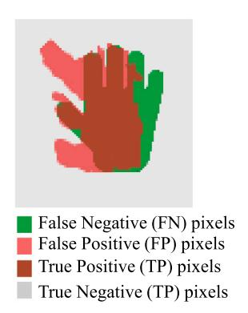

**Fig. 7.** Visualization of segmentation of a hand by pixel-wise prediction and ground truth mask.

segmentation models is crucial for assessing their accuracy, robustness, and reliability. The most commonly used metrics are described below.

**mIoU for hand segmentation:** mIoU is a widely adopted metric for segmentation accuracy, measuring the overlap between the predicted segmentation mask and the ground truth at the pixel level. As illustrated in [Fig.](#page-11-1) [7,](#page-11-1) correctly segmented hand pixels (brown) are True Positives (), incorrectly predicted hand pixels (red) are False Positives (), and hand pixels incorrectly classified as background (green) are False Negatives (). True Negative pixels () represent correctly identified background pixels (gray). Using these parameters the IoU for a single image can be calculated as:

$$IoU = \frac{TP_{pixels}}{TP_{pixels} + FP_{pixels} + FN_{pixels}},$$
(5)

**Precision, Recall, and F1 Score for hand segmentation:** While mIoU serves as the primary metric for evaluating segmentation quality, additional performance measures such as precision, recall, and F1-score provide complementary insights into model performance.

Almeida et al. [[64\]](#page-28-20) evaluated hand segmentation performance using Pixel-wise precision and recall, which are defined as follows:

Pixel-wise precision = 
$$\frac{TP_{\text{pixels}}}{TP_{\text{pixels}} + FP_{\text{pixels}}},$$
 (6)

Pixel-wise recall = 
$$\frac{TP_{\text{pixels}}}{TP_{\text{pixels}} + FN_{\text{pixels}}}$$
, (7)

To obtain the final evaluation scores, these metrics are averaged across all test images.

In addition to precision and recall, the harmonic mean of precision and recall, called F1-score, was also reported in segmentation studies such as [[88\]](#page-28-44). The Pixel-wise F1-score is an effective measure for reporting the segmentation ability to distinguish hand from background, ensuring that both False Positive and False Negative pixels are appropriately accounted for in the evaluation:

Pixel-wise F1-score = 
$$2 \times \frac{\text{Pixel-wise precision} \times \text{Pixel-wise recall}}{\text{Pixel-wise precision} + \text{Pixel-wise recall}}$$
, (8)

By incorporating these metrics alongside mIoU, researchers can better assess the segmentation model's ability to accurately distinguish human hands in HRI environments.

**Uncertainty quantification in hand segmentation:** Beyond accuracy metrics, some studies have incorporated uncertainty estimation to assess model confidence in predictions. Uncertainty-aware DL models, such as Bayesian Neural Networks (BNNs) and Deep Ensembles, produce multiple predictions for the same input image. In the case of Deep Ensembles, this is achieved by aggregating predictions from base learners [[20,](#page-27-22)[73\]](#page-28-29), whereas in BNNs, multiple predictions arise from sampling network weights [\[88](#page-28-44)]. The prediction uncertainty of each image is quantified using the entropy of predictions for each image, denoted as *̄*, as follows:

$$\bar{E} = \frac{1}{N} \sum_{p=1}^{N} \left( -\sum_{c=1}^{C} \frac{1}{K} \sum_{k=1}^{K} P_k(c|p) \log \left( \frac{1}{K} \sum_{k=1}^{K} P_k(c|p) \right) \right), \tag{9}$$

where (|) is the predicted probability of pixel belonging to class in the th prediction. Here, represents the number of classes (typically two: hand and background), and is the total number of pixels in the image.

[[20\]](#page-27-22) also analyzed the entropy specifically for hand pixels to assess model uncertainty in segmenting hand regions:

$$\bar{E}_h = \frac{1}{N_h} \sum_{p \in H} \left( -\sum_{c=1}^C \frac{1}{K} \sum_{k=1}^K P_k(c|p) \log \left( \frac{1}{K} \sum_{k=1}^K P_k(c|p) \right) \right), \tag{10}$$

where *ℎ* is the number of ground truth hand pixels, and represents the set of hand pixels in the ground truth.

Entropy serves as a crucial metric for quantifying model uncertainty in hand segmentation. Higher entropy values indicate greater uncertainty in the model's predictions, suggesting that the model struggles to confidently classify pixels. As a result, out-of-distribution data typically exhibit higher entropy compared to in-distribution data. This characteristic has been leveraged in hand segmentation studies to assess whether a model can effectively distinguish between ID and OOD data [[20,](#page-27-22)[73](#page-28-29)].

#### *3.5.3. Speed metrics*

The speed of a model is a critical factor in real-time HRI applications, where low latency is essential for seamless interaction between humans and robots. Ensuring that hand detection and segmentation models operate at high speeds is particularly important in dynamic environments where rapid decision-making is required to prevent collisions and enable fluid cooperation.

**Frames Per Second:** Frames Per Second (FPS) measures the number of frames a trained model can process per second during the inference phase. A higher FPS indicates a faster model, which is essential for realtime performance in HRI scenarios. However, there is no universally defined threshold that determines when a model's performance is considered real-time. The perception of real-time capability often depends on the specific application and task requirements. For example, in a study conducted by Sajedi et al. [\[88](#page-28-44)], a hand segmentation model operating at approximately 16 FPS was deemed sufficiently fast to respond to and prevent potential collisions between human hands and robots. In another study by Sharma et al. [\[73](#page-28-29)] multiple models were evaluated and found that most achieved hand segmentation speeds exceeding 56 FPS, claimed as real-time performance. Meanwhile, the slowest model in their study, running at 22 FPS, was considered near real-time. In another study by Yu et al. [\[90](#page-28-46)], 20 FPS was defined as a threshold for real-time hand detection in space human–robot interaction where different models were compared based on their accuracy and their real-time detection perspective.

It is important to note that FPS values are heavily dependent on the computational resources available during inference. The reported speed in each study is specific to the workstation capability used in the experiment. For instance, the hand key-point detection model implemented in MediaPipe, which has been used in many HRI studies e.g. [[47–](#page-28-3)[50\]](#page-28-6), has been shown to achieve real-time performance even on low-power devices such as mobile phones, demonstrating the efficiency of lightweight deep learning models for resource-constrained applications.

#### *3.6. Challenges and opportunities in hand detection and segmentation*

Despite significant advancements in deep learning-based hand detection and segmentation for human–robot interaction, several challenges remain unaddressed. These challenges open opportunities for future research to improve the robustness, efficiency, and applicability of these models in real-world scenarios.

*3.6.1. Advanced models: foundation models and advanced segmentation techniques*

**Foundation models:** Recently, LLMs and VLMs have attracted increasing attention in HRI research [[114](#page-29-17)[,115\]](#page-29-18). However, their application in hand detection and segmentation remains largely unexplored. Only a limited number of studies, such as [\[69](#page-28-25),[116](#page-29-19)], have incorporated VLMs and hand detection in HRI tasks. Given the ability of VLMs to integrate vision and natural language understanding, future research could leverage their contextual reasoning capabilities and use hand detection and segmentation for more adaptive and interpretable hand gesture or action recognition, enabling robots to better understand human intentions in complex environments.

**State-of-the-art segmentation models:** Similarly, advanced segmentation architectures, such as Segment Anything Model (SAM) [[117](#page-29-20)], developed by Meta, have not yet been extensively explored for hand segmentation in HRI. While SAM offers strong generalization across various domains, its computational cost remains a concern. To address this, lighter variants like MobileSAM [\[89](#page-28-45)] have been introduced, offering improved efficiency. Sharma et al. [[73\]](#page-28-29) evaluated MobileSAM for hand segmentation in HRI, but despite its high segmentation accuracy, it was found to be slower than models like U-Net, making it less suitable for real-time applications. Optimizing these models for speed and efficiency could significantly enhance their applicability in HRI settings where real-time performance is crucial.

### *3.6.2. Data collection considerations*

**Lack of domain-specific HRI dataset:** One of the key limitations in this field is the lack of domain-specific datasets tailored to HRI. Aside from three very recent datasets [\[67](#page-28-23)[,73](#page-28-29)[,80](#page-28-36)], most publicly available datasets primarily focus on daily activities rather than industrial or collaborative robotic environments. This domain gap limits the generalizability of models trained on these datasets.

**Gloves:** Another underexplored aspect is the presence of gloves in HRI datasets. Since wearing gloves is recommended for safety when interacting with robots, it is crucial to evaluate model performance under such conditions. However, very few studies have incorporated gloves into their datasets, and even fewer, such as [[73\]](#page-28-29), have considered gloves in various colors, which is essential for model robustness.

**Number of hands per image:** Most hand segmentation datasets restrict their data to a single human per scene, resulting in a maximum of two hands per frame. In realistic HRI applications, multiple human operators may be present simultaneously, necessitating datasets that reflect this complexity.

**Distinguishing left and right hands:** Only a few studies have explicitly annotated and treated the left and right hands as separate classes, such as Gao et al. [\[27](#page-27-28)] for hand detection and Sharma et al. [[73\]](#page-28-29) and Sajedi et al. [\[88](#page-28-44)] for hand segmentation. Expanding on this approach in future research could provide more detailed and structured hand recognition, enhancing model interpretability and application in HRI. Additionally, an interesting direction for future work could involve differentiating not only individual hands but also multiple human operators within the scene. For instance, in scenarios where two humans are interacting with a robot, the dataset could define four distinct classes separating both individuals and their respective left and right hands. This approach would enhance fine-grained hand detection and improve collaborative HRI applications, particularly in multi-user environments where hand differentiation is crucial.

**Variations in hand form:** Existing datasets predominantly focus on simple, clearly visible hands, often ignoring challenging conditions such as inter-occluded hands, rare gestures, and partially observable hands. These scenarios frequently occur in real-world HRI applications, yet remain underexplored in most datasets and studies.

**Variations in background conditions:** Beyond hand variability, background conditions play a crucial role in model performance. Factors such as dynamic backgrounds, varying lighting conditions, and image noise (e.g., motion blur) can significantly impact detection and segmentation accuracy. Future studies should incorporate these factors to evaluate model robustness in real-world conditions.

**Hand occlusions:** Hand occlusion presents a significant challenge in both hand detection and segmentation, directly impacting the robustness and accuracy of these systems. Occlusion occurs when portions of the hand are obscured from the camera's view. This can happen due to various factors in HRI scenarios, such as the objects a human is grasping [[69\]](#page-28-25), interactions with a robot arm in close proximity [\[20](#page-27-22), [43,](#page-27-44)[80\]](#page-28-36), or other elements within the environment [\[64](#page-28-20)[,67](#page-28-23)]. Furthermore, occlusion can be self-inflicted, where one part of the hand (or multiple hands) obscures another, often termed ''self-occlusion'' or ''inter-occluded hands'' [[49,](#page-28-5)[110](#page-29-13)]. For hand detection, severe occlusion can lead to missed detections if the visible hand portion is too small or lacks sufficient distinguishing features. In keypoint-based methods like MediaPipe, occlusion can even result in mislabeling, where one keypoint is mistakenly identified as another, consequently leading to incorrect gesture recognition [\[56](#page-28-12)]. For hand segmentation, occlusion yields incomplete or inaccurate masks, as the occluded pixels cannot be reliably identified as belonging to the hand [[20\]](#page-27-22). The challenges are further compounded by the dynamic nature of hand movements, which cause constantly changing and unpredictable occlusion patterns. Variability in lighting conditions and background clutter can also exacerbate the issue by reducing the visibility of the hand. To robustly address hand occlusion, several strategies have been explored. Some studies propose multi-view data fusion [[43\]](#page-27-44), combining input from multiple cameras to gain a more complete view of the hand. The use of depth information from RGBD cameras is another promising approach, where techniques like setting a depth threshold (a ''depth correction technique'') can help robustly detect hand regions even when partially occluded [[118](#page-29-21)]. Crucially, the development and use of specialized datasets containing diverse instances of occluded hands (e.g., Ego2Hands [[110](#page-29-13)], HADR [[67\]](#page-28-23), and MuViH [[43\]](#page-27-44)) are beneficial for future studies. Training models on such rich data can improve their ability to detect or segment observable hand regions accurately under occluded conditions.

**Ethical considerations:** Additionally, ethical considerations should be addressed in datasets where RGB images have the potential to reveal the identity of human operators. To ensure privacy and compliance with data protection regulations, sensitive areas, such as faces, should be blurred or masked during data preprocessing.

**Lack of RGBD data:** Most existing studies rely solely on RGB data, despite the potential benefits of integrating depth (RGBD) information. Depth data can enhance hand and object detection, enabling 3D localization for safer and more precise robotic interactions. The underutilization of RGBD data highlights an opportunity for future research to leverage depth-aware models for improved segmentation and detection performance.

**Camera perspectives and viewpoints:** Another limitation in existing studies is the predominant use of single-view camera angles. Most datasets and experiments capture hand movements from a single static viewpoint, which increases susceptibility to occlusions and limits the model's ability to generalize to unseen camera perspectives. Considering multi-view camera setups could enhance detection and segmentation accuracy, particularly in occluded environments. Additionally, integrating egocentric (head-mounted) cameras, such as GoPro (as used in the EpicKitchen dataset [\[102\]](#page-29-5) and HRI study [[20\]](#page-27-22)) or Google Glass (as used in EgoHands [\[107\]](#page-29-10)), could further improve model performance by capturing interactions from the human operator's perspective.

#### *3.6.3. Adaptability and real-time*

**Model adaptability and transfer learning:** Another underexplored area is the adaptation of models to diverse HRI environments through transfer learning and fine-tuning techniques. Pre-training models on large-scale datasets and then adapting them to specific industrial settings could improve generalization and reduce annotation costs. Although recent studies [\[20](#page-27-22)[,73](#page-28-29)] have highlighted the importance of fine-tuning for improved performance, its practical application in hand segmentation remains limited. Future research could investigate domain adaptation strategies to enhance model robustness when applied to unseen scenarios.

**Real-time performance and benchmarking:** Real-time performance is a critical factor in HRI applications, yet there is no universally accepted benchmark to define the FPS threshold required for realtime hand detection and segmentation in HRI. Many studies use FPS as a speed metric, but comparisons across studies are challenging due to variations in computational hardware. Additionally, real-time requirements vary by application; for instance, a model achieving 16 FPS was considered sufficient for preventing human–robot collisions in [[88\]](#page-28-44), while another study [\[73](#page-28-29)] reported 22 FPS as near real-time and 56 FPS as real-time performance. Standardized benchmarks tailored to different HRI tasks could help establish clearer guidelines for evaluating real-time performance in hand detection and segmentation models.

#### **4. Hand gesture recognition**

As discussed in Section [3](#page-4-2), hand detection and segmentation serve as foundational steps for hand gesture recognition (HGR). While some studies have focused solely on these preliminary tasks, many others have placed HGR as their primary objective. Therefore, in this section we dive deeper into these studies.

Hand gesture recognition is a fundamental interaction modality in human–robot interaction [[119](#page-29-22)[,120\]](#page-29-23), allowing robots to understand and respond to human intentions through natural and intuitive movements. Gestures provide an effective means for humans to convey commands, express emotions, and interact seamlessly with robotic systems in a variety of applications, including industrial collaboration, assistive robotics, and teleoperation. Compared to speech-based communication, which may be unreliable due to noise, language barriers, or environmental constraints, hand gestures offer a universal, nonintrusive alternative that is particularly advantageous in situations where verbal interaction is impractical.

In vision-based deep learning models, HGR is typically categorized into static and dynamic gesture recognition. Static gesture recognition, as represented in [Fig.](#page-14-1) [8,](#page-14-1) involves identifying predefined gestures from a single image or frame, often leveraging hand key-points, shape-based features, or hand segmentation masks. Dynamic gesture recognition, on the other hand, requires analyzing hand motion over a sequence of frames as illustrated in [Fig.](#page-14-1) [8,](#page-14-1) necessitating the use of temporal models that can effectively capture movement patterns and dependencies.

Following the structure of the previous section, the subsequent subsections will explore various deep learning models used for gesture recognition, with a particular emphasis on emerging models and techniques. Next, we will introduce and discuss benchmark datasets that have been used for training and evaluating HGR models. We will then detail the evaluation metrics commonly employed to assess model performance and then outline the challenges and opportunities in this evolving domain.

#### *4.1. Deep learning models*

Deep learning approaches have significantly advanced the task of hand gesture classification by enabling automatic extraction of spatial and temporal features, eliminating the need for handcrafted feature engineering. Traditional HGR methods often relied on multi-step processing pipelines [[5](#page-27-6)]. For instance, template matching-based HGR [[121](#page-29-24)] required the creation of extensive template databases in advance, making it less flexible and more labor-intensive than DL approaches, which directly learn relevant features from data without manual intervention. Prior to the spotlight being put on DL models, hand gesture classification in HRI primarily relied on conventional ML algorithms. These included gesture classifications by SVMs [\[21](#page-27-21),[97\]](#page-29-1), K-Nearest Neighbor (KNN) classifiers [[122](#page-29-25),[123](#page-29-26)], Naïve Bayes [[123](#page-29-26),[124\]](#page-29-27) and K-means

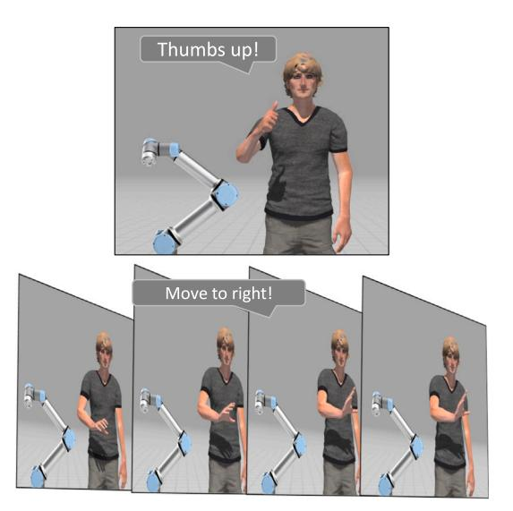

**Fig. 8.** Illustration of hand gesture recognition: The top image depicts the recognition of a static hand gesture from a single frame ('Thumbs up' gesture class), while the bottom sequence demonstrates the recognition of a dynamic hand gesture across multiple frames ('Move to right' gesture class).

clustering [[125](#page-29-28)]. A key limitation of these ML-based approaches was their dependence on manually extracted features, which restricted their adaptability to complex and dynamic gesture variations. In contrast, DL models eliminate the need for explicit feature extraction, directly learning representations from hand gesture images and sequences, thus improving accuracy and robustness [\[5\]](#page-27-6).

Deep learning models used for hand gesture classification generally fall into two broad categories: Convolutional Neural Networks (CNNs) and Recurrent Neural Networks (RNNs). CNNs are widely used for static gesture recognition due to their ability to capture spatial features from images, whereas RNNs and their variants, such as Long Short-Term Memory (LSTM) networks, are more commonly employed in dynamic hand gesture recognition, as they can effectively model temporal dependencies in sequential gesture data. Beyond these deep learning models, recent advancements, i.e. attention-based architectures, Graph Neural Networks (GNNs), and foundational models such as LLMs and VLMs have expanded the capabilities of HGR in HRI applications. The following subsections will review works on CNNs and RNNs and then explore these emerging trends, highlighting their unique contributions to improving gesture recognition performance and adaptability in realworld human–robot interaction scenarios. To provide an overview, [Fig.](#page-15-1) [9](#page-15-1) depicts the categories and subcategories of DL-based studies in hand gesture recognition.

### *4.1.1. Convolutional neural networks*

CNNs have played a pivotal role in advancing hand gesture recognition within HRI by enabling efficient extraction of spatial features from visual data. Their ability to learn hierarchical representations of image features has significantly improved the accuracy and robustness of gesture classification. To the best of our knowledge, the work of Nagi et al. [\[126\]](#page-29-29) was among the first to explore CNNs for HGR in an HRI setting. They proposed a six-layer CNN composed of convolutional and max-pooling layers for recognizing static hand gestures captured by a camera mounted on a mobile robot. Their system successfully classified six distinct static gestures and notably outperformed traditional classifiers such as SVMs. However, their method was constrained to static, single-handed gestures, limiting its generalizability to more complex or dynamic scenarios. Barros et al. [[127](#page-29-30)] introduced a multi-channel CNN architecture for static gesture classification, incorporating grayscale and two Sobel-filtered images in the X and Y directions (to enhance edge detection) as input channels. Each channel was processed independently through convolutional and pooling layers before feature fusion, allowing the model to capture rich spatial information. Their evaluation, which included a dataset recorded with a NAO robot, demonstrated that this multi-channel setup outperformed single-channel CNNs in gesture classification accuracy. Nevertheless, their dataset remained limited to four static, single-hand gestures to command the robot.

Lim et al. [[23\]](#page-27-24) extended CNN applications by integrating RGB and depth data from an RGBD camera to form a three-stage pipeline: human detection, hand detection, and gesture recognition. Their multi-channel CNN effectively classified eight single-hand static gestures in real time, enabling interaction between a mobile robot and a human operator. Simao et al. [\[128\]](#page-29-31) focused on both static and dynamic hand gesture recognition for real-time robot control. Their comparative analysis demonstrated that CNNs significantly outperformed traditional models such as SVMs and KNN, particularly in eliminating the need for manual feature extraction. Using a collaborative KUKA robot, their system accurately classified 24 static and 10 dynamic gestures during task-oriented interactions. With the same spirit, Castro et al. [[129](#page-29-32)] proposed a 3D CNN approach using sequences of RGBD frames captured by an Intel RealSense D435 camera with distances between 1.5 and 2.5 m from a participant. The model successfully recognized four dynamic gestures used to control a robot's directional movements (up, down, left, right), demonstrating the feasibility of spatial–temporal modeling using CNNs with depth information. More recently, Veena et al. [[130](#page-29-33)] compared CNN-based classifiers with SVMs for recognizing single-handed static hand gestures from both American and Indian Sign Languages, aimed at enabling assistive interactions of a robot with elderly users. Their results showed that CNNs not only achieved higher classification accuracy but also offered faster inference times.

Beyond these foundational and comparative studies using traditional CNN models, numerous recent works have adopted advanced CNN-based object detection architectures, such as Region Proposal Networks (RPNs) and YOLO, and also other well-known ones to first detect hand regions and subsequently classify gestures. To better review these works, we organize the following subsections based on the CNN-based architectures.

**RPN-based approaches:** Region Proposal Network (RPN)-based models have been widely utilized in HRI due to their high accuracy in object localization and classification. Nuzzi et al. [[131](#page-29-34)] employed Faster R-CNN to recognize 21 static hand gestures, including dual-hand configurations, captured from 15 participants using an RGB camera (Kinect v2). Their study was among the first in HRI to incorporate two-handed gestures, demonstrating the model's robustness across varied users, gestures, and backgrounds. Tellaeche et al. [\[132\]](#page-29-35) further extended this by combining Faster R-CNN with a lightweight CNN classifier to improve inference speed. Their hybrid model successfully recognized four dual-hand static gestures in real-time for robot command execution. Mask R-CNN, another RPN-based model capable of both detection and segmentation, was leveraged by Dou et al. [\[133\]](#page-29-36) to simultaneously identify hand gestures and the objects being manipulated. By associating the detected object with the performed gesture, their model enabled robots to infer context a step toward more intelligent interpretation. While dual-hand gestures were included, the study focused exclusively on static gestures. Jiang et al. [[134](#page-29-37)] applied Mask R-CNN to classify diver hand gestures interacting with an underwater robot. To overcome data scarcity in training Mask R-CNN, they augmented the CADDY dataset [[135](#page-29-38)] using a Generative Adversarial Network (GAN) [[136](#page-29-39)], improving performance on static hand gesture recognition in challenging underwater conditions.

**YOLO-based approaches:** YOLO models are popular in HRI due to their real-time speed and efficiency. Shang et al. [[137](#page-29-40)] used YOLOv4 to detect and classify eight static hand gestures for controlling a robotic arm. Their method also inferred whether gestures involved the left, right, or both hands based on bounding box positions, achieving both

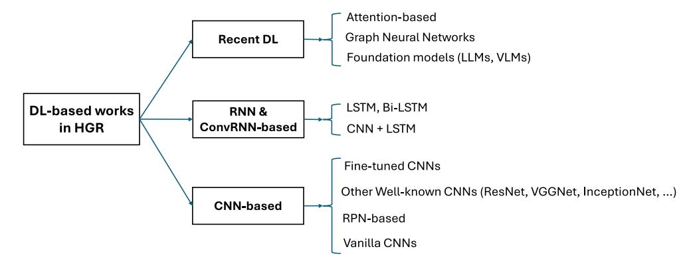

**Fig. 9.** Categories of DL-based hand gesture recognition works.

high accuracy and low latency. Urkmez et al. [[76\]](#page-28-32) employed YOLOv4 for the classification of pointing gestures, and also enabling 3D pointing direction estimation for mobile robot navigation. Their system outperformed Faster R-CNN in both accuracy and speed, highlighting YOLO's suitability for real-time HRI. In aerial robotics, Belattar et al. [\[138\]](#page-29-41) utilized YOLOv5 to classify three static drone control gestures, i.e. ''start recording'', ''take photo'', and ''stop recording''. Their comparative study showed YOLOv5 superior balance of accuracy and speed compared to YOLOv4 and Faster R-CNN, making it ideal for embedded drone systems.

**Other CNN-based approaches:** Several HRI studies have explored CNN architectures beyond standard object detection pipelines by customizing or extending well-known CNNs. Xu et al. [\[139\]](#page-29-42) proposed Det-ResNet, a gesture classifier inspired by ResNet, designed to recognize both single and dual-hand gestures from an RGBD camera (Kinect V2). Uniquely, they incorporated full-body motion analysis alongside hand gesture recognition to improve robustness in hand gesture transitions for virtual robot control. Lindner et al. [\[140\]](#page-29-43) applied ResNet variants (ResNet-50, 101, and 152) to static gesture classification in interactions with a mobile humanoid robot. ResNet-152 achieved the highest performance, and their setup also included human pose tracking for enhanced interaction context, though dynamic gestures were not explored. Hozyn [\[141\]](#page-29-44) compared multiple CNN architectures, i.e. ResNet, VGGNet [\[61](#page-28-17)], and InceptionNet [[142](#page-29-45)], on a six-class static hand gesture dataset to control a robot. While VGGNet slightly outperformed others in accuracy, ResNet was the fastest, making it suitable for latency-sensitive HRI applications. Very recently, Hubert et al. [[43\]](#page-27-44) introduced a ResNet-based classifier for multi-view hand gesture recognition in human–cobot interaction. Their system aggregated predictions from multiple synchronized cameras, significantly improving recognition accuracy and robustness across both single and dual-hand gestures using datasets like HANDS [[143](#page-29-46)] and a custom collection. Gao et al. [[77\]](#page-28-33) proposed HandClasNet, an EfficientNet [\[144\]](#page-29-47)-inspired model tailored for teleoperation using 24 static American Sign Language (ASL) gestures. Their real-time system controlled robotic manipulation tasks and demonstrated high classification performance and efficiency on RGBD input. Similarly, Srinil et al. [\[53](#page-28-9)] deployed EfficientNet for drone control using eight static hand gestures performed by multiple users in a real-world agricultural setting, achieving strong accuracy and real-time performance.

**Fine-tuning of pre-trained CNN models:** Fine-tuning pre-trained CNNs is a common strategy for leveraging learned visual representations while adapting to task-specific gesture datasets. Mazhar et al. [\[44](#page-28-0)] extended their prior CNN-based work [\[145](#page-30-0)] by fine-tuning Inception V3 [\[142\]](#page-29-45) to classify ten static gestures from diverse users and background conditions. They replaced the final output layer and adopted a three-phase training strategy involving selective freezing and unfreezing different layers of the network during training. This approach allowed the model to retain the rich spatial feature representations learned from large-scale datasets while adapting effectively to the new hand gesture data. Their fine-tuned model showed high robustness and real-time gesture recognition under varying backgrounds in industrial HRI. Yang et al. [\[146\]](#page-30-1) fine-tuned several pre-trained models, i.e. AlexNet [[147](#page-30-2)], VGGNet, ResNet, and GoogLeNet [[148](#page-30-3)], by retraining only the fully connected layers on the CADDY underwater dataset. Despite the limited changes, each model achieved high accuracy in classifying diver hand gestures for underwater robot interaction. Gao et al. [[75\]](#page-28-31) introduced a two-stream CNN architecture that fused RGB and depth information, fine-tuned from pre-trained ResNet, Inception, and VGGNet models on the ImageNet dataset. Their model, fine-tuned only on the last layer by ASL (with 24 gesture classes) hand gesture dataset [[149](#page-30-4)], achieved high accuracy through dual-modal feature fusion while handling only static gestures. Similarly, Amirtha et al. [[150](#page-30-5)] fine-tuned Inception V3 (pre-trained on the Imagenet dataset) for a simpler task involving six static gestures for robotic arm and home automation control. They also modified only the final output layer, showing that even minimal adaptation can yield solid performance in assistive settings. Nuzzi et al. [[151](#page-30-6)] fine-tuned a well-known RPN-based CNN model called R-FCN [[152](#page-30-7)], pre-trained on COCO [[111](#page-29-14)]. The fine-tuning was done by retaining only the model's last layer on their customized hand gesture RGB data (captured by Kinect v2). The customized data included a variety of operators performing dual-handed gesture commands, and the model classified these gestures accurately to control an industrial robot. Bose et al. [\[153\]](#page-30-8) adapted CenterNet [\[154\]](#page-30-9), a well-known CNN-based object detector model, for gesture classification by modifying the backbone architecture and fine-tuning on the MITI HD-II dataset [[155](#page-30-10)]. Their system demonstrated strong performance in classifying ten static gestures for a robot pick-and-place task. Baptista et al. [\[156\]](#page-30-11) investigated the generalization of fine-tuned Inception V3 models by comparing conventional fine-tuning with contrastive learning [\[157\]](#page-30-12). Trained on ASL gestures from a single user and evaluated on three unseen users, their results showed that contrastive learning significantly outperformed standard fine-tuning, demonstrating greater robustness to inter-user and background variability.

### *4.1.2. Recurrent neural networks & convolutional recurrent neural networks*

While CNNs excel at extracting spatial features from images, Recurrent Neural Networks (RNNs) are particularly well-suited for dynamic hand gesture recognition, as they can capture the temporal dependencies in sequential hand movements. Unlike static gesture recognition, which relies on a single frame, dynamic gestures require analyzing motion patterns across multiple frames, making RNN-based architectures an essential component in time-dependent hand gesture recognition. RNNs process sequential inputs by maintaining an internal memory that captures context from previous time steps. However, traditional RNNs suffer from issues such as vanishing gradients, limiting their ability to learn long-term dependencies. To address this, Long Short-Term Memory (LSTM) networks have been widely adopted, as they efficiently retain long-range dependencies in sequences.

Tsironi et al. [[158](#page-30-13)] were among the first to adopt an LSTM-enhanced architecture (CNN-LSTM) for dynamic gesture recognition in HRI. By integrating LSTM layers into a CNN pipeline, their system could classify nine dynamic hand gestures with significantly improved performance compared to a CNN-only baseline. This work demonstrated the potential of combining spatial and temporal modeling for controlling robots via gestures. Building on this, Simao et al. [\[128\]](#page-29-31) showed that incorporating LSTM layers markedly improved dynamic gesture recognition accuracy compared to CNNs alone. However, they also noted increased computational cost and slower inference times, a potential limitation for real-time applications. Luan et al. [\[159\]](#page-30-14) developed a lightweight yet effective MobileNetV2-LSTM model to classify eight dynamic hand gestures for a robot arm in a pick-and-place task. They collected a highspeed frame-rate dataset and reported high accuracy and fast response times, validating the effectiveness of combining mobile CNNs with LSTM units for real-time HRI. Qi et al. [\[160\]](#page-30-15) proposed a multi-view LSTM-based approach using two RGBD cameras to recognize ten hand gestures in a surgical robot collaboration task. Their model processed synchronized sequences and achieved high recognition accuracy and low latency, demonstrating practical applicability in time-critical medical robotics. Wu et al. [\[161\]](#page-30-16) utilized LSTM networks on RGBD input from Leap Motion sensors to recognize dynamic gestures in a playful HRI setup, specifically a rock–paper–scissors game with an NAO robot. Their model exhibited both high accuracy and real-time performance. Gao et al. [[93\]](#page-28-49) introduced a two-stage pipeline in which OpenPose was used to extract hand key-points, which were then fed into a CNN-LSTM model for gesture classification. Their evaluation on ten dynamic gestures for commanding a robot reinforced the advantage of LSTM layers in enhancing temporal modeling over CNNs.

Aside from the typical integration of CNN and LSTM, as a novel contribution, Ali et al. [[162](#page-30-17)] proposed a dual-channel architecture called Snapture. It fused static and dynamic gesture cues by combining CNN-LSTM for temporal modeling with a custom ''Gesture Peak'' detection module that extracts the most informative frame in a gesture sequence. Evaluated on the robotic command hand gesture datasets, i.e. GRIT [\[163\]](#page-30-18) and Montalbano [[164](#page-30-19)], their hybrid model significantly outperformed traditional CNN-LSTM architectures. Aitsam et al. [[165](#page-30-20)] introduced the use of an event-based vision sensor (SilkyCam VGA) in HRI for the first time. They created a novel dataset called EB-HandGesture and proposed ConvRNN, a convolutional RNN model, to classify dynamic gestures. Their approach showed superior accuracy over traditional CNNs such as MobileNet, particularly in a real-world application using humanoid robots. In another innovative work, Nihal et al. [[166](#page-30-21)] employed Bi-directional LSTM (Bi-LSTM) integrated with an Inception V3-based CNN to recognize ten static medical-related hand gestures for interaction with a humanoid robot. By processing gesture sequences bidirectionally, their model captured temporal dependencies more effectively and achieved high classification accuracy on a custom video dataset.

### *4.1.3. Recent deep learning approaches*

**Attention mechanism in DL:** While CNNs excel at extracting local spatial features and RNNs handle temporal sequences in hand gesture recognition tasks, both can struggle with capturing long-range dependencies and global contextual relationships. Attention-based architectures address this limitation by learning to focus selectively on the most pertinent regions or time steps within input sequences. Among the attention mechanism the ''self-attention'' mechanism, the core of Transformers introduced by Vaswani et al. [\[167\]](#page-30-22), learns pairwise relationships between all tokens (or patches in the case of images in Vision Transformers (ViT) [\[168\]](#page-30-23)) in a sequence enabling more robust and global context capture. Cheng et al. [[169](#page-30-24)] proposed a hybrid architecture (HybridNet) that combines the global feature capturing of ViT with the local feature extraction strength of MobileNetV2. Additionally, they introduced a Temporal-Channel Attention (TCA) module using 1D convolutions to model temporal dependencies across frames. Their model achieved high accuracy in classifying dynamic gestures in HRI, with low latency. Beeri et al. [\[170\]](#page-30-25) leveraged a Transformer-based model tailored for long-range hand gesture recognition. Their work focused on enabling robust gesture classification from distances up to 20 m, demonstrating its effectiveness in commanding a quadruped robot in outdoor settings. Very recently, Biswas et al. [[171](#page-30-26)] introduced a novel attention mechanism, Context-Augmented Scaled Dot-Product Attention (CASDPA), within a CNN-LSTM framework. This hybrid model effectively captured both spatial and temporal features and outperformed prior approaches on both static and dynamic gesture datasets in mobile robot interaction tasks.

**Graph Neural Networks:** GNNs have recently gained popularity in deep learning due to their ability to model structured and relational data [[172](#page-30-27)]. Unlike CNNs, which primarily operate on regular grid-based data such as images, GNNs can effectively represent non-Euclidean structures, such as hand key-points and skeletal representations, making them particularly useful for hand gesture recognition. Hand gestures involve complex movements and spatial relationships between fingers, which can be naturally modeled as a graph. Each hand key-point can be represented as a node, while the connections between them are modeled as edges in a graph structure. By leveraging GNNs, researchers have been able to effectively capture the dependencies between different hand joints, improving gesture classification accuracy. Recently, Graph Convolutional Networks (GCNs) have been widely used to learn high-level graph structure features and have exhibited high performance. In this regard, Yan et al. [[173](#page-30-28)] proposed a novel model Spatial-Temporal Graph Convolutional Networks (ST-GCNs) to limit the convolutional operations between the linked joints. Li et al. [[174](#page-30-29)] were among the first to apply ST-GCNs to hand gesture recognition. Their approach demonstrated superior performance over traditional CNN+LSTM combinations for dynamic hand gestures. Expanding on this, Slama et al. [[175\]](#page-30-30) proposed a hybrid GCN-Transformer architecture. The GCN component modeled spatial dependencies among joints, while the Transformer captured temporal dynamics across gesture sequences. Their model was deployed for both static and dynamic gestures in an industrial assembly setting with a collaborative robot. With the same spirit, Bemani et al. [[176](#page-30-31)] combined GCN with Visual Transformer architecture (GViT) targeting hand gesture classification of an operator in an ultra-range distance (up to 25 m). They used an experiment to evaluate their model on dynamic hand gesture commands to control a quadruped robot with different distances in indoor and outdoor environments. Their results showed the GViT model outperformed other models e.g., CNN-based models, GCN, and ViT in their experiments.

**Foundation models (LLM and VLM):** Foundation models, including LLMs and VLMs, have emerged as powerful tools for enabling contextual reasoning in complex tasks. These models are pre-trained on vast amounts of internet-scale data and can generalize across diverse domains such as robotics [[177](#page-30-32)]. In HRI, they can play a pivotal role in interpreting human intent by grounding hand gestures within a broader multi-modal context (e.g., speech, object recognition). Lin et al. [[56\]](#page-28-12) pioneered this direction by introducing GIRAF, a framework that integrates gesture recognition, voice input, and scene understanding to prompt an LLM (ChatGPT-3.5 text-davinci-003). The LLM can understand the exact intent of the human operator from the analysis of hand gestures (e.g., pointing toward the tool), voice commands (e.g. ''give me that tool''), and objects (e.g. screwdriver) in the scene and then generate the proper robot action policy. They showed that having LLM in their framework helped the robot to better understand the human intent from hand gestures and scene together a matter that was overlooked by traditional HGR works. Lim et al. [\[178\]](#page-30-33) proposed a multi-stage framework where a lightweight Transformer predicted sign language from hand and facial landmarks (from MediaPipe), which was then processed by an LLM (ChatGPT) to generate socially appropriate co-speech gestures from a social robot (Pepper), enabling more natural communication. Very recently, Kobzarev et al. [[57\]](#page-28-13) introduced GestLLM, a pipeline that uses hand key-points from MediaPipe to query advanced LLMs like ChatGPT-4 [\[179\]](#page-30-34) and O1 [[180](#page-30-35)] for hand gesture interpretation. Their zero-shot experiments showed impressive recognition accuracy even on uncommon gestures, like the ''Vulcan salute'', surpassing state-of-the-art VLMs (e.g., GPT-4o) in long-range recognition scenarios. They also demonstrated real-world deployment of GestLLM to control a UR3 robotic manipulator, achieving lower user frustration and similar control accuracy compared to robot controlling by a gamepad. Very recent study by Zhang et al. [\[181\]](#page-30-36) proposed a conceptual framework of AR-based multi-modal interface comprised of an AR headset (Meta Quest 3 HMD) and a local LLM (Llama 3.2B) to process the prompts from hand gestures and voice commands of operator controlling a Franka robotic arm. Using a local LLM hosted on the local server, this architecture ensured low-latency, privacypreserving inference for practical deployment. In a very recent study, Lai et al. [\[182\]](#page-30-37) introduced a comprehensive multi-modal framework named NMM-HRI, designed to assist elderly users through natural and context-aware interaction with a service robot. The system integrates hand gestures, body pose, and voice commands, which are collectively parsed and interpreted by an LLM (ChatGPT-4) to generate executable action sequences. Similar to the GIRAF framework [[56\]](#page-28-12), NMM-HRI incorporates object detection to identify the item of interest in the interaction scene. For example, when a user points toward a specific object (e.g. a cup) and gives a verbal instruction, the model grounds this deictic gesture within the visual and linguistic context to infer the appropriate robot behavior. Their framework was benchmarked against a VLM approach relying solely on voice input [[183](#page-30-38)], and the results demonstrated that NMM-HRI outperformed the VLM-based system across a range of HRI tasks and environmental settings.

#### *4.2. Overview of DL-based hand gesture recognition papers*

To better organize studies employing ML and DL models for hand gesture recognition, we list them in [Table](#page-18-0) [4.](#page-18-0) This table highlights architectural details, whether models were fine-tuned, if gestures were dynamic or static, and if they involved single- or two-handed gestures in their experiments.

[Table](#page-18-0) [4](#page-18-0) provides valuable insights into the evolving landscape of HGR within HRI. CNNs have been the backbone for most HGR studies, establishing themselves as a foundational architectural choice. However, more recent research, particularly post-2019, reveals a notable diversification in model architectures. It can be seen a growing adoption of RNN variants, such as LSTM and BiLSTM, which excel at processing sequential data inherent in dynamic gestures. Concurrently, attention mechanisms, especially Transformers, and GNNs are gaining traction, offering sophisticated ways to model complex relationships within hand data. A distinct development in recent works (post-2019) is the prevalence of fine-tuning pre-trained CNN models, rather than training them from scratch. This leverages the powerful feature extraction capabilities of established networks, leading to more efficient and robust HGR systems. Furthermore, the very latest studies (after 2023) are beginning to integrate LLMs into their HGR frameworks, hinting at exciting possibilities for more nuanced and context-aware gesture interpretation. Regarding the types of hand gestures explored, over half of HRI studies have primarily focused on static hand gestures, which involve fixed poses. Nevertheless, a considerable portion of research has expanded to include dynamic gestures or a combination of both static and dynamic gestures, indicating a move toward more natural and expressive interaction. Interestingly, single-hand gestures continue to dominate the research landscape, with dual-hand gestures remaining relatively underexplored, appearing in less than a quarter of the surveyed papers. However, this trend shows a noticeable shift in recent works (after 2020), with dual-hand gestures being incorporated more frequently, suggesting growing interest in richer, two-handed interactions. Concerning input modalities, the majority of HGR works in HRI still predominantly rely on RGB-only data. Despite this, it is significant that more than a third of experiments have already integrated depth information into their systems, acknowledging its value for improved robustness and 3D understanding. Finally, similar to our observations in [Table](#page-8-1) [2](#page-8-1) for HD and HS, [Table](#page-18-0) [4](#page-18-0) highlights that the egocentric perspective remains largely unexplored in HGR within HRI studies. Only two recent papers [[169](#page-30-24)[,181\]](#page-30-36) have specifically considered this viewpoint. This oversight is particularly striking given the immense potential of egocentric HGR for AR and XR applications in robotics.

## *4.3. Datasets*

Hand gesture recognition models require high-quality datasets that provide diverse hand gestures under different conditions to ensure robustness and generalization in real-world applications. The datasets used for HGR vary in terms of gesture types (static vs. dynamic), number of hand gesture classes, capture modalities, viewpoints, and environmental contexts. Understanding these datasets is crucial for selecting the most suitable data for researchers who want to implement hand gesture classification on HRI. Regarding this, the used hand gesture datasets in previous HRI studies are listed in [Table](#page-19-0) [5](#page-19-0).

#### *4.3.1. Static hand gesture datasets*

As evident from [Table](#page-19-0) [5](#page-19-0), static hand gestures were the majority of the datasets (24 out of 33 datasets) used in HRI studies. The oldest dataset was the Jochen Triesch Database (JTD) [[186](#page-30-39)]. At that time, HGR studies were using grayscale images; therefore, they published their work on this modality. They used different backgrounds and 10 people with different hand sizes to add diversity to their dataset, while their dataset was restricted to single-handed hand gestures. Aside from JTD, NUSHP [[188](#page-30-40)] was another hand gesture dataset using grayscale images in addition to RGB images from different people (40 subjects with different hand sizes, ethnicities, and gender) from both indoor and outdoor settings in different backgrounds. The wide intra-class variations in hand sizes and appearances help model to learn better the key features of each class, leading to better recognition of each hand gesture class when testing in different conditions [[196](#page-31-0)]. Aside from these two datasets, other datasets were mainly generated out of RGB or RGBD cameras, where as can be seen the proportion of datasets captured from RGB dominates the vision mode. All of the data was real image data captured from cameras except OpenSign dataset [\[44](#page-28-0)] which comprised 8646 real images and augmented by 12 304 synthetic images. The augmentation was done by substituting the backgrounds with random synthetic ones to add background diversity to the hand gesture images, helping the model to learn the most important features related to hand gesture class when training on OpenSign.

Interestingly, most of the HRI studies used the datasets captured in HRI settings to train their model, indicating the importance of domainspecific data to train their model. Among the HRI datasets, most of them were captured in human-industrial robot settings, while some target specific robots. For example, [\[126\]](#page-29-29) created their dataset specifically tailored for mobile robots such that it considers different distances (up to 3 m far) of human participants, highlighting the importance of hand gesture recognition when a robot is far from the participants. In this regard, URGR [[176](#page-30-31)] recently provided a more comprehensive dataset considering ultra-range distance (up to 25 m) in both indoor and outdoor environments targeting controlling mobile robots by different hand gestures of from a far distance. CADDY [\[135\]](#page-29-38) is another specific dataset specifically collected to control the underground robots, such that the images contain different hand gestures of the diver captured in the underwater conditions.

In these datasets, hand gesture classes are labeled by the number expressed according to the position taken by fingers, from 0 to 5 [\[43](#page-27-44)[,58](#page-28-14), [126](#page-29-29)[,135,](#page-29-38)[139](#page-29-42),[143](#page-29-46)[,153,](#page-30-8)[191,](#page-30-41)[192](#page-30-42)]. Some datasets used different letters of sign languages as gesture classes, for example American Sign Language (ASL) [\[44](#page-28-0),[156](#page-30-11)[,184,](#page-30-43)[189](#page-30-44)] or Indian Sign Language (ISL) [\[171,](#page-30-26)[190](#page-30-45),[191](#page-30-41)]. Others used their specific gesture classes, for example to control a robot

**Table 4** Studies used ML/DL models in hand gesture recognition with their specific architectures and other details. St and Dy stand for Static and Dynamic hand gesture and Ego and Exo stand for Egocentric and Exocentric.

| Paper | Year | ML/DL model                  | Architecture                           | Fine-tuned | St/Dy   | Two-handed gestures | Vision modality | Camera perspectives |
|-------|------|------------------------------|----------------------------------------|------------|---------|------------------------|--------------------|------------------------|
| [125] | 2014 | Traditional ML               | SVM, K-means                           | No         | Dy      | No                     | RGB                | Exo                    |
| [127] | 2014 | DL (CNN)                     | Multi-channel CNN                      | No         | St      | No                     | Grayscale + RGB | Exo                    |
| [97]  | 2015 | Traditional ML               | SVM                                    | No         | St      | No                     | RGB                | Exo                    |
| [158] | 2016 | DL (RNN)                     | CNN + LSTM                             | No         | Dy      | No                     | RGB                | Exo                    |
| [184] | 2017 | DL (CNN)                     | Parallel CNNs                          | No         | St      | No                     | RGBD               | Exo                    |
| [163] | 2017 | DL (RNN)                     | CNN + LSTM                             | No         | Dy      | No                     | RGB                | Exo                    |
| [23]  | 2017 | DL (CNN)                     | Vanilla CNN                            | No         | St      | No                     | RGBD               | Exo                    |
| [122] | 2017 | Traditional ML               | SVM, KNN                               | No         | St      | No                     | RGBD               | Exo                    |
| [145] | 2018 | DL (CNN)                     | Vanilla CNN                            | No         | St + Dy | No                     | RGBD               | Exo                    |
| [123] | 2018 | Traditional ML               | SVM, KNN                               | No         | St + Dy | No                     | RGBD               | Exo                    |
| [185] | 2018 | DL (CNN)                     | Faster R-CNN                           | No         | St      | Yes                    | RGB                | Exo                    |
|       |      |                              |                                        |            |         |                        |                    |                        |
| [25]  | 2018 | DL (CNN)                     | SSD                                    | No         | St      | No                     | RGB                | Exo                    |
| [159] | 2019 | DL (RNN)                     | MobileNetV2 + LSTM                     | No         | Dy      | No                     | RGB                | Exo                    |
| [128] | 2019 | DL (RNN)                     | CNN + LSTM                             | No         | St + Dy | No                     | RGB                | Exo                    |
| [44]  | 2019 | DL (CNN)                     | Inception v3                           | Yes        | St      | No                     | RGBD               | Exo                    |
| [36]  | 2019 | DL (CNN)                     | YOLOv3                                 | No         | St      | No                     | RGB                | Exo                    |
| [129] | 2019 | DL (CNN)                     | Vanilla CNN                            | No         | Dy      | No                     | RGBD               | Exo                    |
| [131] | 2019 | DL (CNN)                     | Faster R-CNN                           | No         | St      | Yes                    | RGB                | Exo                    |
| [146] | 2019 | DL (CNN)                     | AlexNet, VGGNet, ResNet, GoogLeNet  | Yes        | St      | No                     | RGB                | Exo                    |
| [139] | 2020 | DL (CNN)                     | Det-ResNet                             | No         | St      | No                     | RGBD               | Exo                    |
| [75]  | 2020 | DL (CNN)                     | ResNet, Inception, VGGNet           | Yes        | St + Dy | No                     | RGBD               | Exo                    |
| [133] | 2020 | DL (CNN)                     | Faster R-CNN                           | No         | St      | Yes                    | RGB                | Exo                    |
| [151] | 2021 | DL (CNN)                     | R-FCN                                  | Yes        | St      | Yes                    | RGB                | Exo                    |
| [166] | 2021 | DL (RNN)                     | Inception v3 + Bi-LSTM                 | No         | St      | No                     | RGB                | Exo                    |
| [134] | 2021 | DL (CNN)                     | Mask R-CNN                             | No         | St      | Yes                    | RGB                | Exo                    |
| [93]  | 2021 | DL (RNN)                     | CNN + LSTM                             | No         | Dy      | No                     | RGBD               | Exo                    |
| [150] | 2021 | DL (CNN)                     | Inception v3                           | Yes        | St      | No                     | RGB                | Exo                    |
| [137] | 2021 | DL (CNN)                     | YOLOv4                                 | No         | St      | Yes                    | RGB                | Exo                    |
|       |      |                              |                                        |            |         |                        |                    |                        |
| [160] | 2021 | DL (RNN)                     | LSTM                                   | No         | Dy      | No                     | RGBD               | Exo                    |
| [132] | 2021 | DL (CNN)                     | Faster R-CNN                           | No         | St      | Yes                    | RGB                | Exo                    |
| [138] | 2022 | DL (CNN)                     | YOLOv5                                 | No         | St      | No                     | RGB                | Exo                    |
| [124] | 2022 | Traditional ML               | Naïve Bayes, SVM                       | No         | St      | No                     | RGBD               | Exo                    |
| [77]  | 2022 | DL (CNN)                     | HandClasNet                            | No         | St      | Yes                    | RGBD               | Exo                    |
| [76]  | 2022 | DL (CNN)                     | YOLOv4                                 | No         | St      | No                     | RGBD               | Exo                    |
| [161] | 2022 | DL (RNN)                     | LSTM                                   | No         | Dy      | No                     | RGBD               | Exo                    |
| [178] | 2023 | DL (Attention + LLM)      | Transformer + ChatGPT                  | No         | St + Dy | Yes                    | RGB                | Exo                    |
| [56]  | 2023 | DL (LLM)                     | GIRAF (ChatGPT-3.5)                    | No         | St + Dy | No                     | RGBD               | Exo                    |
| [140] | 2023 | DL (CNN)                     | ResNet                                 | No         | St      | No                     | RGBD               | Exo                    |
| [153] | 2023 | DL (CNN)                     | CenterNet                              | Yes        | St      | No                     | RGBD               | Exo                    |
| [162] | 2023 | DL (RNN)                     | Snapture (CNN + LSTM)               | No         | St + Dy | Yes                    | RGBD               | Exo                    |
| [156] | 2023 | DL (CNN)                     | Inception V3                           | Yes        | St + Dy | No                     | RGBD               | Exo                    |
| [59]  | 2023 | DL (CNN)                     | MobileNet                              | No         | St      | No                     | RGB                | Exo                    |
| [141] | 2023 | DL (CNN)                     | ResNet, VGGNet, InceptionNet        | No         | St      | No                     | RGB                | Exo                    |
| [175] | 2023 | DL (GNN + Attention)      | GCNN + Transformer                     | No         | St + Dy | No                     | RGB                | Exo                    |
| [58]  | 2024 | DL (CNN)                     | YOLOv5 + MediaPipe                     | No         | St      | No                     | RGBD               | Exo                    |
| [176] | 2024 | DL (GNN +                    | GCNN + Transformer                     | No         | St + Dy | No                     | RGB                | Exo                    |
| [169] | 2024 | Attention) DL (Attention) | (GViT) MobileNetV2 +                | No         | St + Dy | No                     | RGB                | Ego + Exo              |
|       |      |                              | Temporal-Channel Attention          |            |         |                        |                    |                        |
| [130] | 2024 | DL (CNN)                     | Vanilla CNN                            | No         | St      | No                     | RGB                | Exo                    |
| [165] | 2024 | DL (RNN)                     | ConvRNN                                | No         | Dy      | Yes                    | RGB + Event        | Exo                    |
| [53]  | 2024 | DL (CNN)                     | EfficientNet                           | No         | St      | Yes                    | data RGB        | Exo                    |
| [98]  | 2024 | DL (Attention)               | FGDSNet + Attention                    | No         | St      | Yes                    | RGB                | Exo                    |
|       |      |                              | module                                 |            |         |                        |                    |                        |
| [170] | 2024 | DL (Attention)               | Slow-Fast-Transformer (SFT)         | No         | St + Dy | No                     | RGB                | Exo                    |
| [181] | 2025 | DL (LLM)                     | Llama 3.2B                             | No         | Dy      | No                     | RGB                | Ego                    |
| [43]  | 2025 | DL (CNN)                     | ResNet                                 | No         | St      | Yes                    | RGBD               | Exo                    |
| [57]  | 2025 | DL (LLM)                     | GestLLM (MediaPipe + ChatGPT-4, O1) | No         | St + Dy | No                     | RGB                | Exo                    |
| [171] | 2025 | DL (Attention)               | CNN + LSTM + Attention (CASDPA)     | No         | St + Dy | No                     | RGB                | Exo                    |

**Table 5** Summary of hand gesture recognition datasets used in HRI works. St and Dy stand for Static and Dynamic hand gesture and Ego and Exo stand for Egocentric and Exocentric.

| Dataset name                     | Year | Used in HRI | St/Dy   | Hand gesture classes               | Domain  | Real/ Synthetic  | Vision modality | #Annotated data | Camera perspectives |
|----------------------------------|------|----------------|---------|------------------------------------|---------|---------------------|--------------------|--------------------|------------------------|
| JTD [186]                        | 1996 | [127,171]      | St      | 10                                 | General | Real                | Grayscale          | 657                | Exo                    |
| [126]                            | 2011 | [126]          | St      | 6 (numbers 0 to 5)                 | HRI     | Real                | RGB                | 6000               | Exo                    |
| Senz-3D [187]                    | 2015 | [153]          | St      | 11                                 | General | Real                | RGBD               | 1320               | Exo                    |
| NUSHP [188]                      | 2017 | [153]          | St      | 10                                 | General | Real                | Grayscale + RGB | 2750               | Exo                    |
| ASL Fingerspelling [184]      | 2017 | [75,77]        | St      | 24 (ASL alphabet except J, Z)   | HRI     | Real                | RGBD               | 60 000             | Exo                    |
| ASL Alphabet [189]               | 2018 | [130]          | St      | 29 (ASL + Space, Delete, None)  | General | Real                | RGB                | 87 000             | Exo                    |
| BSL [190]                        | 2019 | [166]          | St      | 38 (ISL letters)                   | General | Real                | RGB                | 12 581             | Exo                    |
| OpenSign [44]                    | 2019 | [44]           | St      | 10 (9 ASL letters + None)       | HRI     | Real + Synthetic | RGBD               | 20 950             | Exo                    |
| CADDY [135]                      | 2019 | [134,146]      | St      | 15 (numbers + control)          | HRI     | Real                | RGB                | 10 000             | Exo                    |
| [139]                            | 2020 | [139]          | St      | 10 (numbers)                       | HRI     | Real                | RGBD               | 2500               | Exo                    |
| HANDS [143]                      | 2021 | [43,151]       | St      | 29 (numbers + control)          | HRI     | Real                | RGBD               | 12 000             | Exo                    |
| [137]                            | 2021 | [137]          | St      | 8 (control gestures)               | HRI     | Real                | RGB                | 24 000             | Exo                    |
| [132]                            | 2021 | [132]          | St      | 4 (Agree, Halt, Ok, Run)        | General | Real                | RGB                | 800                | Exo                    |
| ISL Alphabet [191]               | 2021 | [130]          | St      | 35 (ISL + numbers)                 | General | Real                | RGB                | 42 700             | Exo                    |
| Pointing dataset [76]            | 2022 | [76]           | St      | 2 (pointing/not)                   | HRI     | Real                | RGBD               | 5900               | Exo                    |
| [156]                            | 2023 | [156]          | St      | 4 (ASL A, F, L, Y)                 | HRI     | Real                | RGB                | 41 661             | Exo                    |
| [141]                            | 2023 | [141]          | St      | 7 (6 control + None)            | HRI     | Real                | RGB                | 4483               | Exo                    |
| MITI HD-II [153]                 | 2023 | [153]          | St      | 10 (numbers + control)          | HRI     | Real                | RGB                | 9800               | Exo                    |
| HaGRID [192]                     | 2024 | [57,140]       | St      | 19 (numbers + control + others) | General | Real                | RGB                | 554 800            | Exo                    |
| [53]                             | 2024 | [53]           | St      | 8 (control gestures)               | HRI     | Real                | RGB                | 1393               | Exo                    |
| [58]                             | 2024 | [58]           | St      | 6 (numbers)                        | HRI     | Real                | RGBD               | 15,450             | Exo                    |
| URGR [176]                       | 2024 | [176]          | St      | 6 (5 control + None)            | HRI     | Real                | RGB                | 347 483            | Exo                    |
| Custom ISL [171]                 | 2025 | [171]          | St      | 26 (ISL letters)                   | General | Real                | RGB                | 14 300             | Exo                    |
| MuViH [43]                       | 2025 | [43]           | St      | 17 (numbers + control)          | HRI     | Real                | RGBD               | 85 000             | Exo                    |
| EgoGesture [193]                 | 2018 | [56,169]       | St + Dy | 83                                 | General | Real                | RGBD               | 24 161             | Ego                    |
| UC2017 [128]                     | 2019 | [128]          | St + Dy | 24 Static + 10 Dynamic          | HRI     | Real                | RGB                | 3400               | Exo                    |
| Jesture [194]                    | 2019 | [169]          | St + Dy | 27                                 | General | Real                | RGBD               | 148 092            | Ego                    |
| Montalbano [195]                 | 2013 | [162]          | Dy      | 20 (Italian gestures)              | General | Real                | RGBD               | 13 206             | Exo                    |
| GRIT [158]                       | 2016 | [158,162]      | Dy      | 9 (control gestures)               | HRI     | Real                | RGB                | 543                | Exo                    |
| [159]                            | 2019 | [159]          | Dy      | 8 (control gestures)               | HRI     | Real                | RGB                | 800                | Exo                    |
| [129]                            | 2019 | [129]          | Dy      | 4 (Up, Down, Left, Right)       | HRI     | Real                | RGBD               | 9984               | Exo                    |
| HRI Dynamic Hand Gesture [93] | 2021 | [93]           | Dy      | 10 (control gestures)              | HRI     | Real                | RGBD               | 2000               | Exo                    |
| [161]                            | 2022 | [161]          | Dy      | 3 (Rock, Paper, Scissors)       | HRI     | Real                | RGBD               | 4500               | Exo                    |

giving a stop sign (e.g. ''Halt'' [[132](#page-29-35)]) to inform a robot to stop its action, or pointing toward a direction (deictic gesture) [\[76](#page-28-32)] to give a robot the operator intended direction. Most hand gesture datasets used single hand gestures, while only HANDS [[143](#page-29-46)], Muvih [\[43](#page-27-44)], and EgoGesture [\[193\]](#page-30-48) datasets considered gestures performed by both hands (two-handed gestures) in static hand gestures. Considering twohanded gestures could be beneficial since using both hands gives more flexibility to create diverse hand gesture classes. However, a DL model might face challenges in learning these gesture since it needs to consider both hands at the same time to interpret a hand gesture class. Additional reason to use two-handed gestures could be, as pointed out by Hubert et al. [\[43](#page-27-44)], the possible usage of two-handed gestures in most critical commands since there is little chance that an operator accidentally (unintentionally) perform these gestures.

Most datasets are recorded from an exocentric view, whereas egocentric (first-person) datasets like EgoGesture [[193](#page-30-48)] or Jesture [[194](#page-30-49)] are underrepresented but highly valuable for wearable or mobile robot scenarios. Encouraging more head-mounted or robot-mounted camera perspectives can support real-time and immersive HRI applications. Almost all datasets collected in exocentric view used a fixed camera position (fixed angle and location) to capture hand gestures. Among them, a very recent dataset, Muvih [\[43](#page-27-44)], considered multiple camera view points (6 cameras with different angles and locations) to add diversity. Aside from diverse camera points of view, the Muvih dataset benefits from the diversity of participants (20 participants) and considers diverse conditions (cluttered background, visual occlusions).

Some datasets like HaGRID [[192](#page-30-42)] (554k+), URGR [\[176\]](#page-30-31) (347k+), Jesture (148k+) [\[194\]](#page-30-49), ASL alphabet [\[189\]](#page-30-44) (87k), and MuViH [\[43](#page-27-44)] (85K) are massive, offering strong pretraining or transfer learning opportunities. On the other hand, several HRI-specific datasets have relatively small sample sizes, which can limit DL model generalizability.

In addition to static hand gestures, three datasets, i.e. UC2017 [[128](#page-29-31)], Jesture [[194](#page-30-49)], and EgoGesture [\[193\]](#page-30-48), used both static and dynamic hand gestures, which enables the HRI studies that want to train their models on a more flexible choice of hand gestures. For instance, a model trained on EgoGesture can benefit from learning 83 different static and dynamic hand gestures covering a wide range of hand gestures, so to enable the implementation of diverse tasks with robots.

#### 4.3.2. Dynamic hand gesture datasets

Dynamic hand gesture datasets are essential for advancing gesture recognition tasks in HRI, especially in applications where gestures involve temporal motion patterns and cannot be done by a single frame. Unlike static datasets, which capture single-frame representations, dynamic datasets consist of sequences of frames that reflect continuous hand movement. Compared to static datasets, dynamic gesture datasets often require more sophisticated annotation procedures, such as defining the start and end points of each gesture or labeling continuous gesture sequences. The duration of gestures can vary significantly between samples; for instance, in the EgoGesture dataset [193], some gestures were performed in just 3 frames, while others spanned up to 196 sequential frames. Dynamic hand gestures are more representative of real-world HRI settings, where temporal context plays a crucial role in understanding user intent. However, they also introduce additional challenges, such as potential errors caused by inconsistent hand motion, pauses, or reduced movement speed during execution by human operators [128].

As outlined in Table 5, several dynamic datasets have been adopted in HRI research. These generally contain fewer samples than static datasets, likely due to the increased complexity of both data collection and annotation, as well as the physical effort required from participants to perform each gestures correctly. Early examples include the Montalbano dataset [195], which comprises 20 Italian cultural/anthropological gestures in RGBD format. Another notable dataset is GRIT [158], featuring 9 control gestures in HRI scenarios. Similarly, the HRI Dynamic Hand Gesture dataset [93] offers 10 task-oriented gestures designed for robot control.

Some datasets also address domain-specific applications. For instance, Wu et al. [161] focused on dynamic gestures for social robot interaction, while Castro et al. [129] developed a dataset centered on directional gestures. Likewise, Luan et al. [159] proposed a dataset for pick-and-place tasks in collaborative HRI settings. These domain-specific gesture sets provide valuable resources for researchers who want to implement a specific HRI research by hand gestures, so they do not need to build their data from scratch.

The increasing utilization of dynamic gesture datasets emphasizes the growing need for models capable of capturing temporal patterns. Future datasets could be improved by expanding their size, incorporating multi-person interactions, addressing occlusion and environmental variability, and integrating multi-modal sensory inputs (e.g., audio, wearable sensors data). Such enhancements would help bridge the gap between controlled laboratory environments and complex real-world HRI scenarios.

Similar to hand detection and segmentation, several hand gesture recognition datasets remain untapped by current HRI studies, despite their potential benefits for future research. For this reason, we have included a list of these resources in Appendix (Table A.2), focusing specifically on large and recent datasets that could prove valuable for upcoming HRI investigations.

### 4.4. Evaluation metrics

Evaluating the performance of deep learning models in hand gesture recognition is essential to assess their accuracy, robustness, and reliability in human–robot interaction scenarios.

**Confusion matrix:** A widely used tool for evaluating hand gesture classification models is the confusion matrix. It provides a clear overview of how well the model distinguishes between different gesture classes. Each row of the matrix corresponds to the actual (ground truth) class, while each column corresponds to the predicted class by the model. Fig. 10 illustrates a confusion matrix for C hand gesture classes. The diagonal elements of this matrix represent True Positives (TP), corresponding to correctly classified gestures. In contrast, off-diagonal elements represent misclassifications, where the model confuses one gesture class for another.

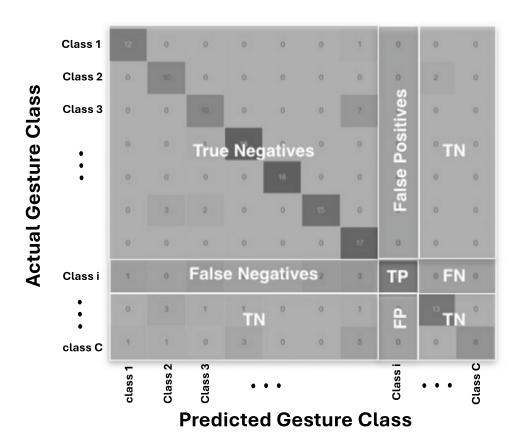

**Fig. 10.** Illustration of a confusion matrix for *C* hand gesture classes. Diagonal elements indicate correct predictions (True Positives), off-diagonal elements indicate misclassifications.

Ideally, a well-performing model should have high values along the diagonal and minimal values elsewhere, indicating precise classification. The presence of large off-diagonal values indicates confusion between gesture classes, often due to visual similarity or overlapping motion patterns. In the case of static hand gestures, Baptista et al. [156] observed from their confusion matrix that the model tended to misclassify instances of the "A" and "F" gestures as "Y" in American Sign Language. The authors attributed this confusion to the visual similarity between the gestures, noting that the "Y" gesture shares most of its hand posture with "A" and "F", differing only in the position of two extended fingers. In a dynamic gesture recognition study, Ali et al. [162] observed that some Italian gestures were frequently misclassified due to similarities in motion dynamics, highlighting the importance of confusion matrix analysis.

From the confusion matrix, several evaluation metrics can be computed to quantify classification performance in hand gesture classification tasks. These metrics are typically calculated for each gesture class individually.

**Precision** for gesture class *i* is:

$$Precision_i = \frac{TP_i}{TP_i + FP_i},$$
(11)

where  $FP_i$  is the total number of instances from other gesture classes that were incorrectly predicted as gesture class i.

**Recall** (Sensitivity) for gesture class i is:

$$\operatorname{Recall}_{i} = \frac{TP_{i}}{TP_{i} + FN_{i}},\tag{12}$$

where  $FN_i$  is the total number of instances that actually belong to gesture class i but were incorrectly predicted as another gesture class.

**F1-score** for gesture class *i* is:

$$F1\text{-score}_{i} = 2 \cdot \frac{\text{Precision}_{i} \cdot \text{Recall}_{i}}{\text{Precision}_{i} + \text{Recall}_{i}}, \tag{13}$$

**Average Accuracy** is often reported across all gesture classes as a general indicator of model performance:

Average Accuracy = 
$$\frac{\sum_{i=1}^{C} TP_i}{\text{Total number of samples}},$$
 (14)

where C is the total number of gesture classes.

In many hand gesture recognition studies (e.g. [129,162,166]), authors report the averages of per-class values of precision, recall, and F1-score across all classes (referred to as macro-averaged metrics). In macro-averaging, each class contributes equally to the final score, regardless of class frequency. These metrics are especially useful in cases of class imbalance or when evaluating how well the model performs across all gesture types uniformly.

**Cross-dataset evaluation:** Another important, yet underexplored, aspect of model evaluation in HGR is cross-dataset evaluation. This method involves training a model on one dataset and testing it on another to assess its generalization capability across different environments, camera settings, participants, or gesture variations. Crossdataset evaluation is crucial in determining whether the model has learned robust and transferable gesture representations or has overfitted to dataset-specific features.

Although cross-dataset evaluation has been overlooked in hand gesture recognition, recent works have highlighted its value. For instance, Hubert et al. [\[43](#page-27-44)] trained a model on either the HANDS [\[143\]](#page-29-46) or the MuViH [\[43](#page-27-44)] datasets and evaluated its performance on the other. Their results showed that the model trained on MuViH generalized significantly better (89.2% average accuracy on HANDS) compared to the model trained on HANDS and tested on MuViH (35.0% accuracy). This suggests that datasets with higher diversity, such as MuViH, provide better generalization capability and highlights the need for more diverse training data in HRI applications.

**Hand gesture recognition speed:** The speed of hand gesture recognition is a crucial factor HRI systems, especially in scenarios where low-latency feedback is required for natural and responsive collaboration between humans and robots. Despite its importance, many studies tend to overlook this aspect and primarily focus on classification accuracy. However, a few notable works have addressed the execution time and system delay, offering valuable insights into the real-time applicability of their models.

Mazhar et al. [[44\]](#page-28-0) reported a hand gesture detection frame rate of 20 Hz, corresponding to a 250 ms delay between the actual performance of a gesture and its detection. They argued that such delay is acceptable, as it aligns with the average human reaction time, which typically falls within the range of 200–250 ms. Additionally, they implemented a filtering mechanism that activates a gesture command only after five consecutive identical predictions, reducing the impact of False Positives. Simao et al. [\[128\]](#page-29-31) implemented a gesture-based human– robot interface using the UC2017 dataset and estimated the overall system delay to be around 300 ms. This delay accounts for multiple stages, including data acquisition, stream segmentation, preprocessing, classification, decision-making, and robot actuation, emphasizing the importance of end-to-end performance evaluation beyond model inference speed alone. Gao et al. [\[77](#page-28-33)] demonstrated the capability of their proposed model to classify hand gestures at an exceptionally high speed of 603 FPS. In their real-time teleoperation framework, this contributed to a total delay of approximately 0.68 s between gesture execution and robot response, confirming the model's suitability for practical deployment in dynamic environments. Bose et al. [\[153\]](#page-30-8) evaluated their EAF-Net model on two hardware platforms. The prediction time was 14 ms on an NVIDIA Titan X GPU and 259 ms on a low-power NVIDIA Jetson Nano board. Gesture signals were then transmitted to a remote server and executed by a 6-axis robot via a Raspberry Pi 3B, demonstrating the feasibility of gesture-controlled HRI even on resource-constrained embedded systems. Hubert et al. [[43\]](#page-27-44) reported a complete pipeline execution time of 37.5 ms per image, which includes 14.3 ms for hand detection and 23.2 ms for gesture classification. This corresponds to an approximate frame rate of 27 FPS on an NVIDIA RTX 3060 GPU. They also highlighted that the system speed was constrained by the acquisition frequency of the Intel RealSense D455 camera, which operates at a maximum of 30 FPS.

These studies underscore the importance of evaluating both model inference time and total system latency when developing gesture recognition frameworks for real-world HRI. Future research should consider reporting standardized speed benchmarks, including FPS and end-toend delay, to facilitate comparisons and ensure practical usability of the models in diverse robotic platforms.

### *4.5. Challenges and opportunities*

Despite the progress in vision-based Deep Learning models for hand gesture recognition in HRI, several challenges remain unaddressed, which open new avenues for future research. Based on the analysis of existing datasets and methodologies, we highlight the following key challenges and opportunities.

**Recognition of two-handed gestures:** Most existing studies focus on recognizing gestures performed by a single hand. However, in real-world HRI scenarios, two-handed gestures are common and can convey more complex commands. Future datasets and models should incorporate and explicitly recognize dual-hand gestures.

**Lack of dynamic gesture datasets and implementations:** Compared to static gestures, dynamic gestures better represent real-world interaction but remain underrepresented in datasets and underutilized in HGR systems. Addressing this gap requires both larger-scale dynamic gesture datasets and robust temporal modeling frameworks in DL architectures.

**Recognition of distant gestures:** Hand gestures performed from a far distance are critical in tasks such as mobile robot control. Except for URGR [\[176\]](#page-30-31), few studies have explored this scenario. Future research should address this underexplored area, including developing datasets and models robust to small hand size and low-resolution inputs.

**Context-aware gesture recognition:** Hand gestures are often context-dependent and should be interpreted within the environmental context to infer user intent accurately. Recent advancements, such as the GIRAF [[56\]](#page-28-12) and NMM-HRI [[182](#page-30-37)] frameworks, have emphasized integrating gesture recognition with object detection, voice recognition, and LLMs to improve intent understanding. This multi-contextual and multi-task approach is a promising direction for future work.

**Multi-view learning:** Most HGR datasets and models rely on singleview camera inputs, which limit robustness in real-world environments prone to occlusion or varied viewpoints. Multi-view gesture recognition, recently addressed in the MuViH dataset [\[43](#page-27-44)], should be further investigated and expanded for practical deployment.

**Multi-person interaction:** To date, almost all existing HGR studies assume a single human interacting with a robot. However, many HRI applications involve collaborative scenarios with multiple human operators. Developing models and datasets capable of handling multi-person gesture recognition remains an open challenge.

**Ethical considerations:** Similarly to hand detection and segmentation, the datasets in hand gesture recognition should consider preserving the identity of human operators when sharing their datasets. This could possibly be done by blurring or masking the face of operators.

**Multi-modal gesture recognition:** While RGBD data is relatively used, combining additional modalities such as audio (e.g., voice commands) or wearable sensors data can significantly enhance recognition accuracy and robustness. Multi-modal fusion is still overlooked in most HGR studies and offers a promising avenue for improvement.

**Domain-specific fine-tuning:** Many studies rely on transfer learning from generic image datasets like ImageNet. However, fine-tuning models on domain-specific gesture datasets can lead to better task adaptation. Future work should prioritize leveraging relevant HGR datasets for pretraining and fine-tuning, rather than relying on unrelated image classification datasets.

**Lack of standardized speed evaluation benchmarks:** Although the execution speed of hand gesture recognition models is a critical factor for ensuring smooth and responsive human–robot interaction, it remains underreported or inconsistently evaluated across many studies. While a few works provide detailed frame rates (e.g., FPS or latency in milliseconds), there is no universally adopted benchmark to determine acceptable delay thresholds for real-time performance. Additionally, reported speeds are often tied to specific hardware configurations, making it difficult to compare models across studies. Future research should prioritize the inclusion of standardized performance metrics, such as end-to-end latency and frames-per-second, on both high-end and low-power platforms to enable fair and practical evaluations of real-time capabilities.

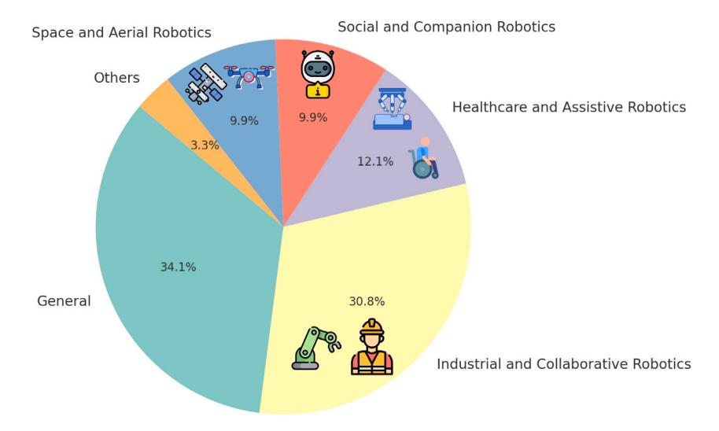

**Fig. 11.** Distribution of the reviewed papers across the different application areas.

#### **5. Applications in HRI**

Hand detection, segmentation, and gesture recognition have been deployed across various domains in HRI and serve as critical enablers for intuitive, safe, and effective interaction between humans and robots in both controlled and real-world environments. Our review identified the following categories as the main areas of application: Industrial and Collaborative Robotics, Healthcare and Assistive Robotics, Social and Companion Robotics, Aerial and Space Robots, General Domains and Other. The proportion of each category is represented in [Fig.](#page-22-6) [11.](#page-22-6)

# *5.1. Industrial and collaborative robotics*

Among the reviewed works, the most explored domain is industrial and collaborative robotics, accounting for 28 out of 91 papers. [Table](#page-23-1) [6](#page-23-1) summarizes these works based on their focus, i.e. hand detection (HD), hand segmentation (HS), and hand gesture recognition (HGR), and briefly describes each implementation.

These implementations highlight various objectives in industrial HRI. In several studies, HD [[52,](#page-28-8)[79\]](#page-28-35) and HS [\[20](#page-27-22),[72,](#page-28-28)[73\]](#page-28-29) were the focus to ensure operator safety by identifying hands near robotic arms or within constrained environments. Other works integrated the detection of operator hand with additional modalities such as voice commands, whole body posture analysis, and object detection to enhance the robustness of multi-modal interfaces [[24](#page-27-25),[54,](#page-28-10)[55](#page-28-11)[,80](#page-28-36)]. A majority of studies focused on hand gesture recognition to improve productivity and enable natural robot control. These include pick-and-place operations [[153](#page-30-8),[159](#page-30-14)], tool handovers [[56,](#page-28-12)[145](#page-30-0)], and support in assembly tasks [[55,](#page-28-11)[175](#page-30-30),[197](#page-31-1)]. Both static and dynamic gestures were explored, reflecting the need for expressive and context-aware control mechanisms in industrial environments.

### *5.2. Healthcare and assistive robotics*

As illustrated in [Fig.](#page-22-6) [11](#page-22-6), healthcare and assistive robotics constitute the second most represented domain in this review, with 11 relevant studies. [Table](#page-23-2) [7](#page-23-2) summarizes these works along with their implementation details.

Across these studies, hand gesture recognition was the predominant method for enabling intuitive interaction, with only one study [\[34](#page-27-35)] focusing solely on hand detection for object handover to visually impaired people. Some works target domain-specific contexts. For instance, [[140](#page-29-43)] detects ''request assistance'' gestures in crowded and noisy environments, while [\[97](#page-29-1)] explored gesture-based interaction to assist users in a library setting. Surgical gesture control was examined in [\[160\]](#page-30-15), where a Da Vinci robot was guided through dynamic hand gestures. In most cases, the goal was to assist elderly individuals or patients in commanding service robots. These ranged from basic directional commands [\[130\]](#page-29-33) to more complex activities such as bed bathing [\[169\]](#page-30-24) or like pouring juice by pointing to the juice glass [[182](#page-30-37)]. The latter also implemented a multi-modal interaction strategy combining gesture recognition and voice commands for a more robust and context-aware interface.

#### *5.3. Social and companion robotics*

Among the reviewed papers, 9 studies applied their models in the context of social and companion robots. These works are summarized in [Table](#page-24-2) [8.](#page-24-2)

Most of these studies focused on hand gesture recognition as a primary means of communication with social robots. In particular, sign language recognition was used to enhance accessibility and natural interaction, as seen in [[166](#page-30-21)[,178\]](#page-30-33). Gesture recognition also supported playful interactions, such as the rock–paper–scissors game explored in [\[161\]](#page-30-16). While hand detection alone was less common, it was effectively used by Docekal et al. [\[47](#page-28-3)] to prevent collisions during closeproximity human–robot interaction. In another case, Almeida et al. [\[64](#page-28-20)] focused on detecting and segmenting the robot's own hands to enhance its self-perception and environmental awareness. Additionally, some studies implemented multi-modal interaction by integrating gesture recognition with other sensory cues such as facial expressions [\[21](#page-27-21)] or object detection [[133](#page-29-36)], contributing to a more context-aware and socially intelligent robotic behavior.

# *5.4. Space and aerial robotics*

Hand detection and gesture recognition have been actively explored in the context of space and aerial robotics, particularly for remote control of drones and human–robot interaction in space. Among the reviewed literature, 9 papers fall into this category, as detailed in [Table](#page-24-3) [9](#page-24-3).

As shown in [Table](#page-24-3) [9,](#page-24-3) several studies focused on astronaut-robot interaction through hand detection and recognition of American Sign Language (ASL) gestures [\[25](#page-27-26)[,27](#page-27-28),[30,](#page-27-31)[95,](#page-28-51)[184\]](#page-30-43). The primary objective in these works was ensuring robust and fast hand detection of astronauts, such that the space robot could detect astronaut hands effectively. In parallel, hand gesture-based UAV control emerged as another research direction. This includes intuitive drone operation using hand

**Table 6** Summary of reviewed papers in industrial and collaborative robotics. HD stands for Hand Detection, HS for Hand Segmentation, HGR for Hand Gesture Recognition.

| Paper | Year | Focus    | Implementation                                                                                                                                              |
|-------|------|----------|-------------------------------------------------------------------------------------------------------------------------------------------------------------|
| [197] | 2016 | HGR      | Recognizing operator hand gestures to control a dual-arm robot during assembly of vehicle dashboard.                                                     |
| [24]  | 2018 | HD       | Integrating hand detection, body posture, and voice recognition for robot interaction.                                                                   |
| [145] | 2018 | HGR      | Recognizing gestures for tool handover with an industrial robot (BAZAR).                                                                                    |
| [159] | 2019 | HGR      | Classifying dynamic gestures for pick-and-place tasks with a robot arm.                                                                                     |
| [44]  | 2019 | HD + HGR | Detecting hands and recognizing gestures for safe and smooth collaboration with BAZAR robot.                                                             |
| [128] | 2019 | HGR      | Gesture recognition in task execution with KUKA iiwa collaborative robot.                                                                                   |
| [131] | 2019 | HGR      | Command-based interaction system using gestures for cobot collaboration.                                                                                    |
| [31]  | 2019 | HD + HS  | Voting-based hand tracking and 3D estimation during interaction with Franka Emika.                                                                       |
| [105] | 2021 | HD       | Creating an industrial dataset for detecting hands in assembly tasks.                                                                                       |
| [151] | 2021 | HGR      | Developing MEGURU software for gesture-based collaboration with industrial robots.                                                                       |
| [137] | 2021 | HGR      | Controlling an industrial robotic arm through static hand gestures.                                                                                         |
| [88]  | 2022 | HS       | Hand segmentation during disassembly tasks using a UR5e co-robot.                                                                                           |
| [72]  | 2022 | HS       | Segmenting hands interacting with UR3e collaborative robot.                                                                                                 |
| [56]  | 2023 | HD + HGR | Detecting hands and gestures for tool handover tasks using a Franka Panda arm.                                                                           |
| [175] | 2023 | HGR      | Static and dynamic hand gesture recognition to collaborate with an industrial robot in assembly tasks.                                                   |
| [153] | 2023 | HGR      | Hand gesture-based controlling robotic arms in pick-and-place tasks.                                                                                        |
| [156] | 2023 | HGR      | Hand gesture-based interaction (by ASL gestures) with an industrial robot.                                                                                  |
| [79]  | 2023 | HD       | Hand detection to ensure safe human–robot distance (Igus arm).                                                                                              |
| [67]  | 2023 | HS       | Creating a hand segmentation dataset with robot arms in industrial settings.                                                                             |
| [49]  | 2023 | HD       | Hand detection for motion generation in teleoperation across various robotic tasks.                                                                      |
| [58]  | 2024 | HD + HGR | Real-time hand detection and gesture classification to control a spatial 3D-printing robot.                                                              |
| [73]  | 2024 | HS       | Segmenting gloved hands interacting with UR3e in industrial glovebox assembly environment.                                                               |
| [80]  | 2024 | HS       | Intent recognition via hand segmentation and object detection in collaborative tasks (UR10e robot).                                                      |
| [52]  | 2024 | HD       | Proximity-based hand detection to stop SCARA robot for safe interaction.                                                                                    |
| [54]  | 2024 | HD       | Multi-modal system combining hand detection and voice commands to                                                                                           |
| [43]  | 2025 | HD + HGR | interact with UR5e robot in assembly tasks. Multi-view hand detection and hand gesture classification during cobot                                       |
| [20]  | 2025 | HS       | interaction. Evaluating hand segmentation in interaction with industrial FANUC LR                                                                        |
| [55]  | 2025 | HD + HGR | Mate arm in diverse backgrounds. Framework including hand detection, action recognition, object detection, and gesture recognition in assembly tasks. |

**Table 7** Summary of reviewed papers in healthcare and assistive robotics. HD stands for Hand Detection, HGR for Hand Gesture Recognition.

| Paper | Year | Focus    | Implementation                                                                                            |
|-------|------|----------|-----------------------------------------------------------------------------------------------------------|
| [97]  | 2015 | HD + HGR | Hand gesture classification to interact with a mobile assistive robot in a                                |
| [34]  | 2020 | HD       | library. Hand detection for object handover tasks assisting blind and disabled individuals.         |
| [160] | 2021 | HGR      | Control of a Da Vinci surgical robot through dynamic hand gestures.                                       |
| [150] | 2021 | HGR      | Hand gesture interface enabling elderly users to operate home automation and robot tasks.              |
| [76]  | 2022 | HD + HGR | Development of a 3D pointing gesture recognition system for assistive robots.                             |
| [51]  | 2022 | HD + HGR | Hand gesture-based interaction with the IVO assistive robot.                                              |
| [140] | 2023 | HGR      | Hand gesture recognition for an assistive robot to detect ''request assistance'' signals in a crowd.   |
| [169] | 2024 | HGR      | Recognition of hand gestures for assistive robot task execution (in simulation).                          |
| [165] | 2024 | HGR      | Controlling an assistive humanoid robot (ARI) by hand gestures.                                           |
| [130] | 2024 | HGR      | Controlling a NAO humanoid robot by hand gestures in elderly care scenarios.                              |
| [182] | 2025 | HGR      | Multi-modal interface by hand gestures and voice to control a UR3e robot to assist elders or patients. |

detection and motion recognition [[138](#page-29-41)] or gesture classification for specific tasks such as start and stopping the video recording [\[32](#page-27-33)], operating controls by takeoff and landing gesture commands (binary classification) [\[48](#page-28-4)], or more detailed motion controlling commands, e.g., ascending, descending, pitch, roll, and yaw [\[53](#page-28-9)].

# *5.5. General domains and other*

In addition to the domains previously discussed, some studies implemented hand detection and gesture recognition in a specific domain in HRI. One noteworthy domain is underwater robotics, where

**Table 8** Summary of reviewed papers in social and companion robotics. HD stands for Hand Detection, HS for Hand Segmentation, HGR for Hand Gesture Recognition.

| Paper | Year | Focus   | Implementation                                                                                                          |
|-------|------|---------|-------------------------------------------------------------------------------------------------------------------------|
| [127] | 2014 | HGR     | Recognize static hand gestures for social commands with NAO humanoid robot.                                             |
| [21]  | 2015 | HGR     | Multi-modal framework (hand gesture and facial expression classification) in interaction with a social mobile robot. |
| [198] | 2015 | HGR     | Hand gesture-based interactions with NAO humanoid robot.                                                                |
| [133] | 2020 | HGR     | Performing both object detection and hand gesture recognition to socially communicate with robots.                   |
| [166] | 2021 | HGR     | Designed Bengali Sign Language-based gesture interface to interact with a humanoid robot.                            |
| [64]  | 2021 | HD + HS | Implementing hand detection and segmentation on humanoid robot hands.                                                   |
| [161] | 2022 | HGR     | Recognized dynamic gestures (e.g., rock–paper–scissors) for playful human–robot interaction.                         |
| [47]  | 2022 | HD      | Applied hand detection to avoid accidents in close-proximity HRI using a humanoid robot.                             |
| [178] | 2023 | HGR     | Hand gesture recognition based on sign language (ASL) in a social interaction with Pepper humanoid robot.            |

**Table 9** Summary of reviewed papers in space and aerial robotics. HD stands for Hand Detection, HGR for Hand Gesture Recognition.

| Paper | Year | Focus    | Implementation                                                                                             |
|-------|------|----------|------------------------------------------------------------------------------------------------------------|
| [184] | 2017 | HGR      | Recognized static ASL alphabet gestures to control robotic systems in space-related applications.       |
| [25]  | 2018 | HD       | Detecting astronaut hands in different ASL hand gestures in space human–robot interaction.              |
| [27]  | 2019 | HD       | Dual-hand detection of astronaut performing ASL hand gestures in interaction with a space robot.        |
| [30]  | 2020 | HD       | Fast hand detection in diverse conditions in astronauts-space robot interaction with ASL hand gestures. |
| [32]  | 2020 | HD       | Controlling drones by hand detection and hand motion recognition.                                          |
| [95]  | 2021 | HD       | Detecting and identification of multiple human hands in space human–robot interaction.                     |
| [138] | 2022 | HGR      | Implemented hand gesture-based control to record videos by drones.                                         |
| [48]  | 2022 | HD + HGR | Operator hand detection and operating drone (take off and landing) through hand gesture classification. |
| [53]  | 2024 | HD + HGR | Operator hand detection and controlling a drone in a farm through hand gesture commands.                |

communication with robots via hand gestures is an effective way because of the environmental constraints. In two studies [[134](#page-29-37),[146](#page-30-1)], hand gestures were used to enable diver-robot communication using the CADDY dataset [\[135\]](#page-29-38), which was specifically developed for underwater gesture-based interaction. Agriculture is another application area that has benefited from hand gesture-based HRI. Moysiadis et al. [[124](#page-29-27)] developed a hand gesture-based interface to control field robots, eliminating the need for physical controllers in open and potentially harsh environments.

Some studies adopted a more general approach while addressing specific robot characteristics such as mobility and long-range interaction. For instance, Nagi et al. [\[126\]](#page-29-29) examined hand gesture recognition across varying distances between a human operator and a mobile robot. More recently, Beeri et al. [\[170\]](#page-30-25) extended this concept to gestures performed up to 20 m away, and Bamani et al. [[176](#page-30-31)] conducted gesturebased control experiments at distances up to 25 m, commanding a quadruped robot, highlighting the importance of robust perception for long-range HRI. Teleoperation through hand gestures has also received growing interest. Gao et al. [[77\]](#page-28-33) developed a real-time gesture-based teleoperation system that enables a robot to perform complex manipulation tasks such as pick-and-place, stacking, and insertion. Zhang et al. [[181](#page-30-36)] proposed a multi-modal system integrating gestures with voice commands to improve teleoperation intuitiveness and reliability. Shaw et al. [\[45](#page-28-1)] introduced an innovative approach that learns manipulation skills by observing human hand movements from internet videos. This vision-based imitation learning strategy opens new possibilities for training dexterous robots in a wide range of tasks, with potential applications in industrial, service, and assistive robotics.

# **6. Future avenues**

While deep learning has significantly advanced vision-based hand analysis in HRI, several challenges and underexplored areas remain across hand detection, segmentation, and gesture recognition. Addressing these limitations is essential for developing robust, scalable, and context-aware human–robot interaction systems. Based on this review, we outline the following future research directions.

**Multi-hand, multi-person, and multi-view scenarios:** Current studies largely focus on single-hand and single-user setups. However, real-world HRI often involves multiple users and two-handed gestures. Future DL models should address the complexity of detecting, segmenting, and interpreting multiple hands, potentially belonging to different users, in cluttered and dynamic environments. Moreover, multi-view learning, as initiated in [\[43](#page-27-44)], is critical for accurate 3D perception in spatially distributed robotic systems and should be further expanded with standardized datasets.

**Context-aware and task-oriented modeling:** While hand gesture recognition has progressed rapidly, the semantic meaning of a gesture is often context-dependent. DL models for all three tasks, hand detection, segmentation, and gesture recognition, should incorporate task-specific information, understanding the objects and scene of interaction to better infer human intent. Recent approaches leveraging foundation models (LLMs and VLMs) or scene context embeddings [\[56](#page-28-12),[69,](#page-28-25)[181](#page-30-36)] show promise for achieving more intelligent and adaptive behavior in robots.

**Robustness under challenging conditions:** Many DL models still struggle with occlusion, motion blur, unusual camera angles, fardistance interactions, and poor lighting, conditions frequently encountered in industrial, outdoor, and mobile HRI. Hand detection and segmentation, in particular, remain vulnerable to these variations, which can cascade into gesture recognition errors. Future research should focus on training and evaluating models under such conditions using diverse datasets, and consider domain adaptation, synthetic data generation, or contrastive learning for improved generalization.

**Real-time performance and lightweight models:** Real-time interaction is crucial in hand analysis HRI. It is vital in hand detection and segmentation to localize human hands fast enough to avoid risking human safety, as well as hand gesture recognition to allow fluid robot reactions by quickly understanding and reacting to hand gestures. While some DL models achieve high accuracy, they are often computationally intensive and unsuitable for on-device deployment. Future work should emphasize the development of lightweight DL architectures that can run on edge devices or embedded systems, without sacrificing accuracy or robustness.

**Data diversity, standardization and transfer learning:** Dataset limitations remain a bottleneck for hand detection, segmentation, and gesture recognition tasks. Many models are trained and validated on narrow, domain-specific datasets, limiting cross-domain applicability. Few-shot and transfer learning strategies can help adapt pre-trained models to new users, environments, or robot platforms with minimal labeled data. Additionally, future datasets should reflect real-world diversity in hand size, skin tone, gloves, occlusion, and cultural variations in gestures. Standardized evaluation protocols and benchmarks across detection, segmentation, and recognition would facilitate reproducibility and fair comparison.

**Multi-modal and cross-sensory fusion:** While RGB and RGBD inputs dominate current research, integrating other modalities, such as audio, facial expression, eye gaze, and wearable sensors data, significantly enhances the robustness of hand-related perception. As we observed, recent works combined voice recognition or object-detection with hand analysis [[54,](#page-28-10)[56](#page-28-12)[,80](#page-28-36)[,181](#page-30-36)[,182\]](#page-30-37) in order to reach a reliable and human-like interaction with robots. multi-modal fusion offers a promising avenue to reduce ambiguity, disambiguate gestures, and improve interaction naturalness.

**Underexplored domains:** Although some domains, such as industrial and assistive robotics, have seen frequent adoption of handbased interaction techniques, other domains remain underexplored. For instance, underwater robotics, agricultural robotics, and educational robots present unique environmental and interaction challenges where implementing DL models for hand detection, segmentation, and gestures could be transformative. We encourage researchers to expand the scope of application-driven research, validating hand-based DL models in underexplored HRI contexts to unlock novel use cases.

In summary, advancing DL models for hand detection, segmentation, and gesture recognition in HRI requires a shift toward more context-aware, robust, efficient, and generalizable systems. By addressing these future directions, researchers can enable the next generation of human–robot interaction that is safer, more intuitive, and scalable across domains and users.

# **7. Conclusions**

This review explored the landscape of vision-based deep learning (DL) methods for hand detection, segmentation, and gesture recognition in human–robot interaction (HRI). Analyzing 91 studies from 2014 to 2025, we observed a notable shift toward DL-driven approaches that have significantly advanced the capabilities of robots to perceive and interpret human hands across diverse environments.

DL models, particularly convolutional neural networks (CNNs), recurrent neural networks (RNNs), and transformer-based architectures, have become central to achieving robust, real-time hand analysis. These models enable robots to detect hands with higher accuracy, segment hands from complex backgrounds, and recognize both static and dynamic gestures with improved generalization. Recent works also leverage multi-modal deep learning, integrating visual data with audio, object context, or language models to improve situational awareness and intent recognition.

Applications span a wide spectrum, with industrial and collaborative robotics emerging as the most studied domain, followed by healthcare, social and companion robots, aerial/space platforms, and niche use cases like underwater and agricultural robotics. Across all domains, hand gesture recognition was the most prevalent, but hand detection and segmentation have proven equally critical for safety, precision, and interaction robustness.

Despite the advances, several challenges remain. DL models often lack generalization across unseen environments, struggle under occlusion, far-distance, or poor lighting, and frequently fall short in multi-person or multi-hand scenarios. Additionally, real-time performance and deployment on edge devices remain underexplored in many works, even though latency is vital in interactive systems. To address these gaps, future research should prioritize: (i) building largescale, diverse, and annotated datasets in hand detection, segmentation and gesture recognition for HRI; (ii) improving DL model architectures for being lightweight, context-aware and robust enough in challenging real-world applications; (iii) embracing multi-view and multimodal approaches; and (iv) establishing standardized benchmarks for fair comparison and reproducibility. Moreover, the emerging synergy between vision-based hand analysis in HRI and foundation models, such as Vision-Language Models and Large Language Models, offers a compelling path toward building general-purpose interaction systems.

In conclusion, vision-based deep learning in hand-related interaction with robots has become the center of many HRI studies. By addressing current limitations and aligning model development with real-world constraints, the field shows strong potential to enable more natural, safe, and intelligent human–robot collaboration across various domains.

### **CRediT authorship contribution statement**

**Reza Jalayer:** Writing – review & editing, Writing – original draft, Visualization, Validation, Methodology, Investigation, Formal analysis, Data curation, Conceptualization. **Masoud Jalayer:** Writing – review & editing, Writing – original draft, Visualization, Methodology, Investigation, Formal analysis, Conceptualization. **Carlotta Orsenigo:** Writing – review & editing, Visualization, Supervision, Project administration, Investigation. **Masayoshi Tomizuka:** Supervision, Project administration.

#### **Declaration of competing interest**

The authors declare that they have no known competing financial interests or personal relationships that could have appeared to influence the work reported in this paper.

#### **Acknowledgments**

The present study has been developed within the HumanTech Project, which is financed by the Italian Ministry of University and Research (MUR) for the 2023–2027 period as part of the ministerial initiative ''Departments of Excellence'' (L. 232/2016).

# **Appendix. Other datasets**

The large datasets that have not been used in HRI studies are reported here to be better known for future research studies to use them. The [Table](#page-26-0) [A.1](#page-26-0) details the datasets regarding the hand detection and segmentation and [Table](#page-26-1) [A.2](#page-26-1) lists the hand gesture recognition datasets that have not been exploited in HRI studies. In tables, we only report the datasets generated after 2014 to emphasize more on recent datasets, and since there are a lot of datasets, only large ones (more than 4000 annotated data) are included.

**Table A.1** Summary of other datasets in hand detection and hand segmentation collected after 2014. HD, HS, HGR stand for Hand Detection, Hand Segmentation, and Hand Gesture Recognition and Ego and Exo stand for Egocentric and Exocentric.

| Dataset name         | Year | HD/HS    | Annotation                     | Domain                                       | Real/ Synthetic  | Vision Modality | #Annotated data | Camera perspectives |
|----------------------|------|----------|--------------------------------|----------------------------------------------|---------------------|--------------------|--------------------|------------------------|
| GUN-71 [199]         | 2015 | HD + HS  | Key-points + Pixel             | Daily life (object                           | Real                | RGBD               | 12K                | Ego                    |
|                      |      |          |                                | grasping)                                    |                     |                    |                    |                        |
| Ego-Finger [200]     | 2016 | HD       | Bounding box +                 | Daily life                                   | Real                | RGB                | 93 729             | Ego                    |
|                      |      |          | Key-points                     |                                              |                     |                    |                    |                        |
| GestureAR [201]      | 2017 | HS + HGR | Pixel + Gesture                | AR/VR                                        | Real                | RGB                | 51K                | Ego                    |
|                      |      |          | classes                        |                                              |                     |                    |                    |                        |
| BigHand2.2M [202]    | 2017 | HD       | Key-points                     | General                                      | Real                | RGBD               | 290K               | Ego                    |
| FPHA [203]           | 2018 | HD       | Key-points + Action classes | Daily life (action recognition)           | Real                | RGBD               | 105 459            | Ego                    |
| EYTH [204]           | 2018 | HS       | Pixel                          | Daily life                                   | Real                | RGB                | 1290               | Ego                    |
| FreiHAND [205]       | 2019 | HD       | Key-points                     | General                                      | Real                | RGBD               | 130 240            | Exo                    |
| EgoDaily [206]       | 2019 | HD       | Bounding box                   | Daily life                                   | Real                | RGB                | 50K                | Ego                    |
| ANS SCI [207]        | 2019 | HD + HS  | Bounding box + Pixel        | Daily life (patients in home)             | Real                | RGB                | 33 256             | Ego                    |
| KBH [208]            | 2019 | HS       | Pixel                          | Daily life (keyboard typing)              | Real                | RGB                | 12 536             | Ego                    |
| WorkingHands [209]   | 2019 | HS       | Pixel                          | Working with hand tools                   | Real + Synthetic | RGBD               | 7865               | Ego                    |
| ContactPose [210]    | 2020 | HD       | Key-points                     | Daily life (object grasping)              | Real                | RGBD               | 2.9M               | Exo                    |
| HO-3D [211]          | 2020 | HD       | Key-points                     | Daily life (object                           | Real                | RGB                | 77 558             | Exo                    |
| YCB-Affordance [212] | 2020 | HD       | Key-points                     | grasping) Daily life (object grasping) | Synthetic           | RGB                | 133 936            | Exo                    |
| InterHand2.6M [213]  | 2020 | HD       | Key-points                     | General                                      | Real                | RGB                | 2.6M               | Exo                    |
| DexYCB [214]         | 2021 | HD       | Key-points                     | Daily life (object                           | Real                | RGBD               | 582K               | Exo                    |
| HOI4D [215]          | 2022 | HD       | Key-points                     | grasping) Daily life (object              | Real                | RGBD               | 2.4M               | Ego                    |
| EgoHOS [216]         | 2022 | HS       | Pixel                          | grasping) Daily life (object              | Real                | RGB                | 11 243             | Ego                    |
| OakInk [217]         | 2022 | HD       | Key-points                     | grasping) Daily life (object              | Real                | RGBD               | 230 064            | Exo                    |
|                      |      |          |                                | grasping)                                    |                     |                    |                    |                        |
| POV-Surgery [218]    | 2023 | HD + HS  | Key-points + Pixel             | Surgery                                      | Real                | RGBD               | 88 329             | Ego                    |
| Hands23 [219]        | 2023 | HD + HS  | Bounding box + Pixel        | General                                      | Real                | RGB                | 257K               | Ego + Exo              |
| SHaF [220]           | 2024 | HD       | Key-points                     | General                                      | Synthetic           | RGB                | 720K               | Exo                    |
| HOGraspNet [221]     | 2024 | HD       | Key-points                     | Daily life (object grasping)              | Real                | RGBD               | 1.5M               | Exo                    |
| HOT3D [222]          | 2025 | HD       | Key-points                     | Daily life (object grasping)              | Real                | Grayscale + RGB | 1.16M              | Ego                    |

**Table A.2** Summary of other datasets in hand gesture recognition datasets used collected after 2014. St and Dy stand for Static and Dynamic hand gesture and Ego and Exo stand for Egocentric and Exocentric.

| Dataset name       | Year | St/Dy   | Hand gesture classes                | Domain               | Real/ Synthetic | Vision modality | #Annotated data | Camera perspectives |
|--------------------|------|---------|-------------------------------------|----------------------|--------------------|--------------------|--------------------|------------------------|
| LaRED [223]        | 2014 | St      | 81 (Sign languages + others)     | General              | Real               | RGBD               | 243 000            | Exo                    |
| DEVISIGN [224]     | 2015 | Dy      | 2000 (Chinese sign language)     | General              | Real               | RGBD               | 24 000             | Exo                    |
| ChaLearn LAP [225] | 2016 | St + Dy | 249 (Sign languages + others)    | General              | Real               | RGBD               | 47 933             | Exo                    |
| CSL [226]          | 2018 | Dy      | 500 (Chinese sign language)      | General              | Real               | RGBD               | 125 000            | Exo                    |
| MS-ASL [227]       | 2019 | Dy      | 1000 (American sign language)    | General              | Real               | RGB                | 25 513             | Exo                    |
| WLASL [228]        | 2020 | Dy      | 2000 (American sign language)    | General              | Real               | RGB                | 21 083             | Exo                    |
| HGM-4 [229]        | 2020 | St      | 26 (Vietnamese sign language)    | General              | Real               | RGB                | 4160               | Exo                    |
| AUTSL [230]        | 2020 | Dy      | 224 (Turkish sign language)      | General              | Real               | RGBD               | 38 336             | Exo                    |
| IPN Hand [231]     | 2021 | St + Dy | 13 (screen interaction gestures) | Computer interaction | Real               | RGB                | 4218               | Exo                    |
| SHAPE [232]        | 2022 | St      | 32 (Asian culture gestures)      | General              | Real               | RGB                | 34 471             | Exo                    |
| DHGR [233]         | 2022 | Dy      | 27 (command gestures)               | Computer interaction | Real               | RGB                | 204 120            | Exo                    |

(*continued on next page*)

**Table A.2** (*continued*).

| Dataset name             | Year | St/Dy | Hand gesture classes               | Domain  | Real/ Synthetic | Vision modality | #Annotated data | Camera perspectives |
|--------------------------|------|-------|------------------------------------|---------|--------------------|--------------------|--------------------|------------------------|
| Slovo [234]              | 2023 | Dy    | 1000 (Russian sign language)    | General | Real               | RGB                | 20 000             | Exo                    |
| PopSign ASL [235]        | 2023 | Dy    | 250 (American sign language)    | General | Real               | RGB                | 214 326            | Exo                    |
| ASL Citizen [236]        | 2023 | Dy    | 2731 (American sign language)   | General | Real               | RGB                | 83 399             | Exo                    |
| DiverseHandGesture [237] | 2024 | St    | 8 (communication gestures)      | General | Real               | RGB                | 7990               | Exo                    |
| Multi-VSL [238]          | 2025 | Dy    | 1000 (Vietnamese sign language) | General | Real               | RGB                | 84 764             | Exo                    |

#### **Data availability**

No data was used for the research described in the article.

#### **References**

- [1] P.K. Pisharady, M. Saerbeck, Recent methods and databases in [vision-based](http://refhub.elsevier.com/S0736-5845(25)00164-4/sb1) hand gesture [recognition:](http://refhub.elsevier.com/S0736-5845(25)00164-4/sb1) A review, Comput. Vis. Image Underst. 141 (2015) [152–165.](http://refhub.elsevier.com/S0736-5845(25)00164-4/sb1)
- [2] A. Grau, M. Indri, L.L. Bello, T. Sauter, Robots in [industry:](http://refhub.elsevier.com/S0736-5845(25)00164-4/sb2) The past, present, and future of a growing [collaboration](http://refhub.elsevier.com/S0736-5845(25)00164-4/sb2) with humans, IEEE Ind. Electron. Mag. 15 (1) (2020) [50–61.](http://refhub.elsevier.com/S0736-5845(25)00164-4/sb2)
- [3] M. Kyrarini, F. Lygerakis, A. [Rajavenkatanarayanan,](http://refhub.elsevier.com/S0736-5845(25)00164-4/sb3) C. Sevastopoulos, H.R. [Nambiappan,](http://refhub.elsevier.com/S0736-5845(25)00164-4/sb3) K.K. Chaitanya, A.R. Babu, J. Mathew, F. Makedon, A survey of robots in healthcare, [Technologies](http://refhub.elsevier.com/S0736-5845(25)00164-4/sb3) 9 (1) (2021) 8.
- [4] M.J. Matarić, B. [Scassellati,](http://refhub.elsevier.com/S0736-5845(25)00164-4/sb4) Socially assistive robotics, Springer Handb. Robot. (2016) [1973–1994.](http://refhub.elsevier.com/S0736-5845(25)00164-4/sb4)
- [5] J. Qi, L. Ma, Z. Cui, Y. Yu, Computer [vision-based](http://refhub.elsevier.com/S0736-5845(25)00164-4/sb5) hand gesture recognition for [human-robot](http://refhub.elsevier.com/S0736-5845(25)00164-4/sb5) interaction: a review, Complex Intell. Syst. 10 (1) (2024) [1581–1606.](http://refhub.elsevier.com/S0736-5845(25)00164-4/sb5)
- [6] L. Guo, Z. Lu, L. Yao, [Human-machine](http://refhub.elsevier.com/S0736-5845(25)00164-4/sb6) interaction sensing technology based on hand gesture recognition: A review, IEEE Trans. [Hum.-Mach.](http://refhub.elsevier.com/S0736-5845(25)00164-4/sb6) Syst. 51 (4) (2021) [300–309.](http://refhub.elsevier.com/S0736-5845(25)00164-4/sb6)
- [7] B. Fang, F. Sun, H. Liu, C. Liu, 3D human gesture capturing and [recognition](http://refhub.elsevier.com/S0736-5845(25)00164-4/sb7) by the IMMU-based data glove, [Neurocomputing](http://refhub.elsevier.com/S0736-5845(25)00164-4/sb7) 277 (2018) 198–207.
- [8] J. Shin, A.S.M. Miah, M.H. Kabir, M.A. Rahim, A. Al Shiam, A [methodological](http://refhub.elsevier.com/S0736-5845(25)00164-4/sb8) and structural review of hand gesture [recognition](http://refhub.elsevier.com/S0736-5845(25)00164-4/sb8) across diverse data modalities, IEEE Access [\(2024\).](http://refhub.elsevier.com/S0736-5845(25)00164-4/sb8)
- [9] T. [Benmessabih,](http://refhub.elsevier.com/S0736-5845(25)00164-4/sb9) R. Slama, V. Havard, D. Baudry, Online human motion analysis in [industrial](http://refhub.elsevier.com/S0736-5845(25)00164-4/sb9) context: A review, Eng. Appl. Artif. Intell. 131 (2024) 107850.
- [10] A.O. Hashi, S.Z.M. Hashim, A.B. Asamah, A [systematic](http://refhub.elsevier.com/S0736-5845(25)00164-4/sb10) review of hand gesture [recognition:](http://refhub.elsevier.com/S0736-5845(25)00164-4/sb10) An update from 2018 to 2024, IEEE Access (2024).
- [11] P. Rawat, L. Kane, M. Goswami, A. Jindal, S. Sehgal, A review on [vision-based](http://refhub.elsevier.com/S0736-5845(25)00164-4/sb11) hand gesture [recognition](http://refhub.elsevier.com/S0736-5845(25)00164-4/sb11) targeting RGB-Depth sensors, Int. J. Inf. Technol. Decis. Mak. 22 (01) (2023) [115–156.](http://refhub.elsevier.com/S0736-5845(25)00164-4/sb11)
- [12] F. Al Farid, N. Hashim, J. [Abdullah,](http://refhub.elsevier.com/S0736-5845(25)00164-4/sb12) M.R. Bhuiyan, W.N. Shahida Mohd Isa, J. Uddin, M.A. Haque, M.N. Husen, A structured and [methodological](http://refhub.elsevier.com/S0736-5845(25)00164-4/sb12) review on [vision-based](http://refhub.elsevier.com/S0736-5845(25)00164-4/sb12) hand gesture recognition system, J. Imaging 8 (6) (2022) 153.
- [13] R. Jain, R.K. Karsh, A.A. Barbhuiya, Literature review of [vision-based](http://refhub.elsevier.com/S0736-5845(25)00164-4/sb13) dynamic gesture [recognition](http://refhub.elsevier.com/S0736-5845(25)00164-4/sb13) using deep learning techniques, Concurr. Comput.: Pr. Exp. 34 (22) (2022) [e7159.](http://refhub.elsevier.com/S0736-5845(25)00164-4/sb13)
- [14] S. Jiang, P. Kang, X. Song, B.P. Lo, P.B. Shull, Emerging wearable [interfaces](http://refhub.elsevier.com/S0736-5845(25)00164-4/sb14) and algorithms for hand gesture [recognition:](http://refhub.elsevier.com/S0736-5845(25)00164-4/sb14) A survey, IEEE Rev. Biomed. Eng.
- 15 (2021) [85–102.](http://refhub.elsevier.com/S0736-5845(25)00164-4/sb14) [15] D. Sarma, M.K. Bhuyan, Methods, databases and recent [advancement](http://refhub.elsevier.com/S0736-5845(25)00164-4/sb15) of visionbased hand gesture [recognition](http://refhub.elsevier.com/S0736-5845(25)00164-4/sb15) for HCI systems: A review, SN Comput. Sci. 2
- [16] B. van [Amsterdam,](http://refhub.elsevier.com/S0736-5845(25)00164-4/sb16) M.J. Clarkson, D. Stoyanov, Gesture recognition in robotic surgery: a review, IEEE Trans. [Biomed.](http://refhub.elsevier.com/S0736-5845(25)00164-4/sb16) Eng. 68 (6) (2021).

(6) [\(2021\)](http://refhub.elsevier.com/S0736-5845(25)00164-4/sb15) 436.

- [17] S. [Yuanyuan,](http://refhub.elsevier.com/S0736-5845(25)00164-4/sb17) L. Yunan, F. Xiaolong, M. Kaibin, M. Qiguang, Review of dynamic
- gesture [recognition,](http://refhub.elsevier.com/S0736-5845(25)00164-4/sb17) Virtual Real. Intell. Hardw. 3 (3) (2021) 183–206. [18] A. Bandini, J. Zariffa, Analysis of the hands in [egocentric](http://refhub.elsevier.com/S0736-5845(25)00164-4/sb18) vision: A survey, IEEE
- Trans. Pattern Anal. Mach. Intell. 45 (6) (2020) [6846–6866.](http://refhub.elsevier.com/S0736-5845(25)00164-4/sb18) [19] M. Oudah, A. Al-Naji, J. Chahl, Hand gesture [recognition](http://refhub.elsevier.com/S0736-5845(25)00164-4/sb19) based on computer vision: a review of [techniques,](http://refhub.elsevier.com/S0736-5845(25)00164-4/sb19) J. Imaging 6 (8) (2020) 73.
- [20] R. Jalayer, Y. Chen, M. Jalayer, C. Orsenigo, M. Tomizuka, Testing [human-hand](http://refhub.elsevier.com/S0736-5845(25)00164-4/sb20) segmentation on in-distribution and [out-of-distribution](http://refhub.elsevier.com/S0736-5845(25)00164-4/sb20) data in human–robot interactions using a deep ensemble model, [Mechatronics](http://refhub.elsevier.com/S0736-5845(25)00164-4/sb20) 110 (2025) 103365.
- [21] R.C. Luo, Y.-C. Wu, P.H. Lin, Multimodal information fusion for [human-robot](http://refhub.elsevier.com/S0736-5845(25)00164-4/sb21) interaction, in: 2015 IEEE 10th Jubilee [International](http://refhub.elsevier.com/S0736-5845(25)00164-4/sb21) Symposium on Applied [Computational](http://refhub.elsevier.com/S0736-5845(25)00164-4/sb21) Intelligence and Informatics, IEEE, 2015, pp. 535–540.
- [22] Y. LeCun, Y. Bengio, G. Hinton, Deep [learning,](http://refhub.elsevier.com/S0736-5845(25)00164-4/sb22) Nature 521 (7553) (2015) [436–444.](http://refhub.elsevier.com/S0736-5845(25)00164-4/sb22)

- [23] G.H. Lim, E. Pedrosa, F. Amaral, N. Lau, A. Pereira, P. Dias, J.L. [Azevedo,](http://refhub.elsevier.com/S0736-5845(25)00164-4/sb23) B. Cunha, L.P. Reis, Rich and robust [human-robot](http://refhub.elsevier.com/S0736-5845(25)00164-4/sb23) interaction on gesture recognition for assembly tasks, in: 2017 IEEE [International](http://refhub.elsevier.com/S0736-5845(25)00164-4/sb23) Conference on Autonomous Robot Systems and [Competitions,](http://refhub.elsevier.com/S0736-5845(25)00164-4/sb23) ICARSC, IEEE, 2017, pp. 159–164.
- [24] H. Liu, T. Fang, T. Zhou, Y. Wang, L. Wang, Deep [learning-based](http://refhub.elsevier.com/S0736-5845(25)00164-4/sb24) multimodal control interface for human-robot [collaboration,](http://refhub.elsevier.com/S0736-5845(25)00164-4/sb24) Procedia Cirp 72 (2018) 3–8.
- [25] Q. Gao, J. Liu, Z. Ju, L. Zhang, Y. Li, Y. Liu, Hand [detection](http://refhub.elsevier.com/S0736-5845(25)00164-4/sb25) and location based on improved SSDfor space [human-robot](http://refhub.elsevier.com/S0736-5845(25)00164-4/sb25) interaction, in: Intelligent Robotics and [Applications:](http://refhub.elsevier.com/S0736-5845(25)00164-4/sb25) 11th International Conference, ICIRA 2018, Newcastle, NSW, Australia, August 9–11, 2018, [Proceedings,](http://refhub.elsevier.com/S0736-5845(25)00164-4/sb25) Part I 11, Springer, 2018, pp. [164–175.](http://refhub.elsevier.com/S0736-5845(25)00164-4/sb25)
- [26] W. Liu, D. [Anguelov,](http://refhub.elsevier.com/S0736-5845(25)00164-4/sb26) D. Erhan, C. Szegedy, S. Reed, C.-Y. Fu, A.C. Berg, SSD: Single shot multibox detector, in: Computer [Vision–ECCV](http://refhub.elsevier.com/S0736-5845(25)00164-4/sb26) 2016: 14th European Conference, Amsterdam, the [Netherlands,](http://refhub.elsevier.com/S0736-5845(25)00164-4/sb26) October 11–14, 2016, Proceedings, Part I 14, [Springer,](http://refhub.elsevier.com/S0736-5845(25)00164-4/sb26) 2016, pp. 21–37.
- [27] Q. Gao, J. Liu, Z. Ju, X. Zhang, Dual-hand detection for [human–robot](http://refhub.elsevier.com/S0736-5845(25)00164-4/sb27) interaction by a parallel network based on hand detection and body pose [estimation,](http://refhub.elsevier.com/S0736-5845(25)00164-4/sb27) IEEE Trans. Ind. Electron. 66 (12) (2019) [9663–9672.](http://refhub.elsevier.com/S0736-5845(25)00164-4/sb27)
- [28] K. He, X. Zhang, S. Ren, J. Sun, Deep residual learning for image [recognition,](http://refhub.elsevier.com/S0736-5845(25)00164-4/sb28) in: [Proceedings](http://refhub.elsevier.com/S0736-5845(25)00164-4/sb28) of the IEEE Conference on Computer Vision and Pattern [Recognition,](http://refhub.elsevier.com/S0736-5845(25)00164-4/sb28) 2016, pp. 770–778.
- [29] Y. Lee, H. Kim, E. Park, X. Cui, H. Kim, [Wide-residual-inception](http://refhub.elsevier.com/S0736-5845(25)00164-4/sb29) networks for real-time object detection, in: 2017 IEEE Intelligent Vehicles [Symposium,](http://refhub.elsevier.com/S0736-5845(25)00164-4/sb29) IV, IEEE, 2017, pp. [758–764.](http://refhub.elsevier.com/S0736-5845(25)00164-4/sb29)
- [30] Q. Gao, J. Liu, Z. Ju, Robust real-time hand detection and [localization](http://refhub.elsevier.com/S0736-5845(25)00164-4/sb30) for space human–robot interaction based on deep learning, [Neurocomputing](http://refhub.elsevier.com/S0736-5845(25)00164-4/sb30) 390 (2020) [198–206.](http://refhub.elsevier.com/S0736-5845(25)00164-4/sb30)
- [31] M. Asif, A. Daasch, H. Unger, M. [Schultalbers,](http://refhub.elsevier.com/S0736-5845(25)00164-4/sb31) Voting based system for robust 3D hand pose estimation and tracking, in: 2019 19th [International](http://refhub.elsevier.com/S0736-5845(25)00164-4/sb31) Conference on [Advanced](http://refhub.elsevier.com/S0736-5845(25)00164-4/sb31) Robotics, ICAR, IEEE, 2019, pp. 248–253.
- [32] H. Ghasemi, A. [Mirfakhar,](http://refhub.elsevier.com/S0736-5845(25)00164-4/sb32) M.T. Masouleh, A. Kalhor, Control a drone using hand [movement](http://refhub.elsevier.com/S0736-5845(25)00164-4/sb32) in ROS based on single shot detector approach, in: 2020 28th Iranian Conference on Electrical [Engineering,](http://refhub.elsevier.com/S0736-5845(25)00164-4/sb32) ICEE, IEEE, 2020, pp. 1–5.
- [33] M. Quigley, K. Conley, B. Gerkey, J. Faust, T. Foote, J. Leibs, R. [Wheeler,](http://refhub.elsevier.com/S0736-5845(25)00164-4/sb33) A.Y. Ng, et al., ROS: an [open-source](http://refhub.elsevier.com/S0736-5845(25)00164-4/sb33) robot operating system, in: ICRA Workshop on Open Source [Software,](http://refhub.elsevier.com/S0736-5845(25)00164-4/sb33) Vol. 3, Kobe, 2009, p. 5.
- [34] S. [Chumkamon,](http://refhub.elsevier.com/S0736-5845(25)00164-4/sb34) K. Kawamoto, U. Yokkampon, E. Hayashi, Robot motion and grasping for blindfold [handover,](http://refhub.elsevier.com/S0736-5845(25)00164-4/sb34) J. Adv. Artif. Life Robot. 1 (1) (2020) 2–6.
- [35] J. Redmon, You Only Look Once: Unified, real-time object [detection,](http://refhub.elsevier.com/S0736-5845(25)00164-4/sb35) in: Proceedings of the IEEE Conference on Computer Vision and Pattern [Recognition,](http://refhub.elsevier.com/S0736-5845(25)00164-4/sb35) [2016.](http://refhub.elsevier.com/S0736-5845(25)00164-4/sb35)
- [36] Y. Chen, W. Wei, W. Xiao, [Human-computer](http://refhub.elsevier.com/S0736-5845(25)00164-4/sb36) interaction control of snakelike robot based on gesture [recognition,](http://refhub.elsevier.com/S0736-5845(25)00164-4/sb36) in: Proceedings of the 2019 4th [International](http://refhub.elsevier.com/S0736-5845(25)00164-4/sb36) Conference on Automation, Control and Robotics Engineering, [2019,](http://refhub.elsevier.com/S0736-5845(25)00164-4/sb36) pp. 1–6.
- [37] J. Redmon, YOLOv3: An incremental improvement, 2018, arXiv preprint [arXiv:](http://arxiv.org/abs/1804.02767) [1804.02767](http://arxiv.org/abs/1804.02767).
- [38] P. Panteleris, I. [Oikonomidis,](http://refhub.elsevier.com/S0736-5845(25)00164-4/sb38) A. Argyros, Using a single RGB frame for real time 3D hand pose estimation in the wild, in: 2018 IEEE Winter [Conference](http://refhub.elsevier.com/S0736-5845(25)00164-4/sb38) on [Applications](http://refhub.elsevier.com/S0736-5845(25)00164-4/sb38) of Computer Vision, WACV, IEEE, 2018, pp. 436–445.
- [39] J. Redmon, A. Farhadi, YOLO9000: better, faster, stronger, in: [Proceedings](http://refhub.elsevier.com/S0736-5845(25)00164-4/sb39) of the IEEE Conference on Computer Vision and Pattern [Recognition,](http://refhub.elsevier.com/S0736-5845(25)00164-4/sb39) 2017, pp. [7263–7271.](http://refhub.elsevier.com/S0736-5845(25)00164-4/sb39)
- [40] Z. Cao, T. Simon, S.-E. Wei, Y. Sheikh, Realtime [multi-person](http://refhub.elsevier.com/S0736-5845(25)00164-4/sb40) 2D pose estimation using part affinity fields, in: [Proceedings](http://refhub.elsevier.com/S0736-5845(25)00164-4/sb40) of the IEEE Conference on Computer Vision and Pattern [Recognition,](http://refhub.elsevier.com/S0736-5845(25)00164-4/sb40) 2017, pp. 7291–7299.
- [41] H. Park, S. Joo, B. An, M.Y. Kim, J. Seo, [Grasping](http://refhub.elsevier.com/S0736-5845(25)00164-4/sb41) control using 2D and 3D visual [integration](http://refhub.elsevier.com/S0736-5845(25)00164-4/sb41) for robotic prosthetic hand, Intell. Serv. Robot. (2025) 1–10.
- [42] G. Jocher, A. Chaurasia, J. Qiu, Ultralytics yolov8. 2023, 2023, URL [https:](https://github.com/ultralytics/ultralytics) [//github.com/ultralytics/ultralytics](https://github.com/ultralytics/ultralytics).
- [43] C. Hubert, N. Odic, M. Noel, S. Gharib, S.H. [Zargarbashi,](http://refhub.elsevier.com/S0736-5845(25)00164-4/sb43) L. Séoud, MuViH: Multi-view hand gesture dataset and recognition pipeline for [human–robot](http://refhub.elsevier.com/S0736-5845(25)00164-4/sb43) interaction in a collaborative robotic finishing platform, Robot. [Comput.-Integr.](http://refhub.elsevier.com/S0736-5845(25)00164-4/sb43) Manuf. 94 (2025) [102957.](http://refhub.elsevier.com/S0736-5845(25)00164-4/sb43)

- [44] O. Mazhar, B. Navarro, S. Ramdani, R. Passama, A. [Cherubini,](http://refhub.elsevier.com/S0736-5845(25)00164-4/sb44) A real-time [human-robot](http://refhub.elsevier.com/S0736-5845(25)00164-4/sb44) interaction framework with robust background invariant hand gesture detection, Robot. [Comput.-Integr.](http://refhub.elsevier.com/S0736-5845(25)00164-4/sb44) Manuf. 60 (2019) 34–48.
- [45] K. Shaw, S. Bahl, A. [Sivakumar,](http://refhub.elsevier.com/S0736-5845(25)00164-4/sb45) A. Kannan, D. Pathak, Learning dexterity from human hand motion in [internet](http://refhub.elsevier.com/S0736-5845(25)00164-4/sb45) videos, Int. J. Robot. Res. 43 (4) (2024) [513–532.](http://refhub.elsevier.com/S0736-5845(25)00164-4/sb45)
- [46] F. Zhang, V. Bazarevsky, A. Vakunov, A. Tkachenka, G. Sung, C.-L. Chang, M. Grundmann, MediaPipe Hands: On-device real-time hand tracking, 2020, arXiv preprint [arXiv:2006.10214.](http://arxiv.org/abs/2006.10214)
- [47] J. Docekal, J. Rozlivek, J. Matas, M. [Hoffmann,](http://refhub.elsevier.com/S0736-5845(25)00164-4/sb47) Human keypoint detection for close proximity [human-robot](http://refhub.elsevier.com/S0736-5845(25)00164-4/sb47) interaction, in: 2022 IEEE-RAS 21st International Conference on Humanoid Robots [\(Humanoids\),](http://refhub.elsevier.com/S0736-5845(25)00164-4/sb47) IEEE, 2022, pp. 450–457.
- [48] F. Naseer, G. Ullah, M.A. [Siddiqui,](http://refhub.elsevier.com/S0736-5845(25)00164-4/sb48) M.J. Khan, K.-S. Hong, N. Naseer, Deep [learning-based](http://refhub.elsevier.com/S0736-5845(25)00164-4/sb48) unmanned aerial vehicle control with hand gesture and computer vision, in: 2022 13th Asian Control [Conference,](http://refhub.elsevier.com/S0736-5845(25)00164-4/sb48) ASCC, IEEE, 2022, pp. [1–6.](http://refhub.elsevier.com/S0736-5845(25)00164-4/sb48)
- [49] Y. Qin, W. Yang, B. Huang, K. Van Wyk, H. Su, X. Wang, Y.-W. Chao, D. Fox, AnyTeleop: A general vision-based dexterous robot arm-hand teleoperation system, 2023, arXiv preprint [arXiv:2307.04577.](http://arxiv.org/abs/2307.04577)
- [50] M. Bensaadallah, N. Ghoggali, L. Saidi, W. Ghoggali, Deep [learning-based](http://refhub.elsevier.com/S0736-5845(25)00164-4/sb50) realtime hand landmark [recognition](http://refhub.elsevier.com/S0736-5845(25)00164-4/sb50) with MediaPipe for R12 robot control, in: 2023 [International](http://refhub.elsevier.com/S0736-5845(25)00164-4/sb50) Conference on Electrical Engineering and Advanced Technology, [ICEEAT,](http://refhub.elsevier.com/S0736-5845(25)00164-4/sb50) Vol. 1, IEEE, 2023, pp. 1–6.
- [51] M. Peral, A. Sanfeliu, A. Garrell, Efficient hand gesture [recognition](http://refhub.elsevier.com/S0736-5845(25)00164-4/sb51) for human-robot interaction, IEEE Robot. Autom. Lett. 7 (4) (2022) [10272–10279.](http://refhub.elsevier.com/S0736-5845(25)00164-4/sb51)
- [52] L.H. Phuong, V.D. Cong, Control the robot arm through [vision-based](http://refhub.elsevier.com/S0736-5845(25)00164-4/sb52) human hand [tracking,](http://refhub.elsevier.com/S0736-5845(25)00164-4/sb52) FME Trans. 52 (1) (2024) 37–44.
- [53] P. Srinil, P. Thongnim, Deep learning enhanced hand gesture [recognition](http://refhub.elsevier.com/S0736-5845(25)00164-4/sb53) for efficient drone use in [agriculture,](http://refhub.elsevier.com/S0736-5845(25)00164-4/sb53) Int. J. Adv. Comput. Sci. Appl. 15 (5) (2024).
- [54] E. Mendez, O. Ochoa, D. [Olivera-Guzman,](http://refhub.elsevier.com/S0736-5845(25)00164-4/sb54) V.H. Soto-Herrera, J.A. Luna-Sánchez, C. Lucas-Dophe, E. Lugo-del Real, I.N. [Ayala-Garcia,](http://refhub.elsevier.com/S0736-5845(25)00164-4/sb54) M. Alvarado Perez, A. González, Integration of deep learning and [collaborative](http://refhub.elsevier.com/S0736-5845(25)00164-4/sb54) robot for assembly tasks, Appl. Sci. 14 (2) [\(2024\)](http://refhub.elsevier.com/S0736-5845(25)00164-4/sb54) 839.
- [55] Z. Wang, J. Yan, G. Yan, B. Yu, Multi-scale control and action [recognition](http://refhub.elsevier.com/S0736-5845(25)00164-4/sb55) based human-robot [collaboration](http://refhub.elsevier.com/S0736-5845(25)00164-4/sb55) framework facing new generation intelligent manufacturing, Robot. [Comput.-Integr.](http://refhub.elsevier.com/S0736-5845(25)00164-4/sb55) Manuf. 91 (2025) 102847.
- [56] L.-H. Lin, Y. Cui, Y. Hao, F. Xia, D. Sadigh, [Gesture-informed](http://refhub.elsevier.com/S0736-5845(25)00164-4/sb56) robot assistance via foundation models, in: 7th Annual [Conference](http://refhub.elsevier.com/S0736-5845(25)00164-4/sb56) on Robot Learning, 2023.
- [57] O. Kobzarev, A. Lykov, D. [Tsetserukou,](http://refhub.elsevier.com/S0736-5845(25)00164-4/sb57) GestLLM: Advanced hand gesture [interpretation](http://refhub.elsevier.com/S0736-5845(25)00164-4/sb57) via large language models for human-robot interaction, in: 2025 20th ACM/IEEE International Conference on [Human-Robot](http://refhub.elsevier.com/S0736-5845(25)00164-4/sb57) Interaction, HRI, IEEE, 2025, pp. [1413–1417.](http://refhub.elsevier.com/S0736-5845(25)00164-4/sb57)
- [58] X. Shi, C. Wang, L. Shi, H. Zhou, T.K. [Phillips,](http://refhub.elsevier.com/S0736-5845(25)00164-4/sb58) K. Bi, W. Cui, C. Sun, D. Wan, Research on [human-robot](http://refhub.elsevier.com/S0736-5845(25)00164-4/sb58) interaction for robotic spatial 3D printing based on real-time hand gesture control, Robot. [Comput.-Integr.](http://refhub.elsevier.com/S0736-5845(25)00164-4/sb58) Manuf. 89 (2024) [102788.](http://refhub.elsevier.com/S0736-5845(25)00164-4/sb58)
- [59] G. Csonka, M. Khalid, H. Rafiq, Y. Ali, AI-based hand gesture [recognition](http://refhub.elsevier.com/S0736-5845(25)00164-4/sb59) through camera on robot, in: 2023 [International](http://refhub.elsevier.com/S0736-5845(25)00164-4/sb59) Conference on Frontiers of Information [Technology,](http://refhub.elsevier.com/S0736-5845(25)00164-4/sb59) FIT, IEEE, 2023, pp. 256–261.
- [60] A.G. Howard, MobileNets: Efficient convolutional neural networks for mobile vision applications, 2017, arXiv preprint [arXiv:1704.04861](http://arxiv.org/abs/1704.04861).
- [61] K. Simonyan, Very deep convolutional networks for large-scale image recognition, 2014, arXiv preprint [arXiv:1409.1556](http://arxiv.org/abs/1409.1556).
- [62] K. He, G. Gkioxari, P. Dollár, R. Girshick, Mask R-CNN, in: [Proceedings](http://refhub.elsevier.com/S0736-5845(25)00164-4/sb62) of the IEEE [International](http://refhub.elsevier.com/S0736-5845(25)00164-4/sb62) Conference on Computer Vision, 2017, pp. 2961–2969.
- [63] T.D. Le, D.T. Huynh, H.V. Pham, Efficient [human-robot](http://refhub.elsevier.com/S0736-5845(25)00164-4/sb63) interaction using deep learning with mask R-CNN: Detection, recognition, tracking and [segmentation,](http://refhub.elsevier.com/S0736-5845(25)00164-4/sb63) in: 2018 15th [International](http://refhub.elsevier.com/S0736-5845(25)00164-4/sb63) Conference on Control, Automation, Robotics and Vision, ICARCV, IEEE, 2018, pp. [162–167.](http://refhub.elsevier.com/S0736-5845(25)00164-4/sb63)
- [64] A. Almeida, P. Vicente, A. [Bernardino,](http://refhub.elsevier.com/S0736-5845(25)00164-4/sb64) Where is my hand? Deep hand segmentation for visual [self-recognition](http://refhub.elsevier.com/S0736-5845(25)00164-4/sb64) in humanoid robots, Robot. Auton. Syst. 145 (2021) [103857.](http://refhub.elsevier.com/S0736-5845(25)00164-4/sb64)
- [65] Unity Technologies, Unity3D game engine, 2022, URL: <https://unity.com/>.
- [66] J. Tobin, R. Fong, A. Ray, J. [Schneider,](http://refhub.elsevier.com/S0736-5845(25)00164-4/sb66) W. Zaremba, P. Abbeel, Domain [randomization](http://refhub.elsevier.com/S0736-5845(25)00164-4/sb66) for transferring deep neural networks from simulation to the real world, in: 2017 IEEE/RSJ [International](http://refhub.elsevier.com/S0736-5845(25)00164-4/sb66) Conference on Intelligent Robots and [Systems,](http://refhub.elsevier.com/S0736-5845(25)00164-4/sb66) IROS, IEEE, 2017, pp. 23–30.
- [67] S. Grushko, A. Vysocky,` J. Chlebek, P. Prokop, HaDR: Applying domain randomization for generating synthetic multimodal dataset for hand instance segmentation in cluttered industrial environments, 2023, arXiv preprint [arXiv:](http://arxiv.org/abs/2304.05826) [2304.05826](http://arxiv.org/abs/2304.05826).
- [68] S. Ren, Faster R-CNN: Towards real-time object detection with region proposal networks, 2015, arXiv preprint [arXiv:1506.01497](http://arxiv.org/abs/1506.01497).
- [69] C. Bao, J. Xu, X. Wang, A. Gupta, H. Bharadhwaj, HandsOnVLM: Visionlanguage models for hand-object interaction prediction, 2024, arXiv preprint [arXiv:2412.13187](http://arxiv.org/abs/2412.13187).
- [70] D. Shan, J. Geng, M. Shu, D.F. Fouhey, [Understanding](http://refhub.elsevier.com/S0736-5845(25)00164-4/sb70) human hands in contact at internet scale, in: [Proceedings](http://refhub.elsevier.com/S0736-5845(25)00164-4/sb70) of the IEEE/CVF Conference on Computer Vision and Pattern [Recognition,](http://refhub.elsevier.com/S0736-5845(25)00164-4/sb70) 2020, pp. 9869–9878.

- [71] O. Ronneberger, P. Fischer, T. Brox, U-Net: [Convolutional](http://refhub.elsevier.com/S0736-5845(25)00164-4/sb71) networks for biomedical image segmentation, in: Medical Image Computing and [Computer-Assisted](http://refhub.elsevier.com/S0736-5845(25)00164-4/sb71) [Intervention–MICCAI](http://refhub.elsevier.com/S0736-5845(25)00164-4/sb71) 2015: 18th International Conference, Munich, Germany, October 5-9, 2015, [Proceedings,](http://refhub.elsevier.com/S0736-5845(25)00164-4/sb71) Part III 18, Springer, 2015, pp. 234–241.
- [72] A. Vysocky, S. Grushko, T. Spurny, R. Pastor, T. Kot, [Generating](http://refhub.elsevier.com/S0736-5845(25)00164-4/sb72) synthetic depth image dataset for industrial applications of hand [localization,](http://refhub.elsevier.com/S0736-5845(25)00164-4/sb72) IEEE Access 10 (2022) [99734–99744.](http://refhub.elsevier.com/S0736-5845(25)00164-4/sb72)
- [73] S. Sharma, M. Huang, S. Nair, A. Wen, C. Petlowany, J. Moore, S. Wanna, M. Pryor, The collection of a human robot collaboration dataset for cooperative assembly in glovebox environments, 2024, arXiv preprint [arXiv:2407.14649.](http://arxiv.org/abs/2407.14649)
- [74] G. Lin, A. Milan, C. Shen, I. Reid, RefineNet: Multi-path [refinement](http://refhub.elsevier.com/S0736-5845(25)00164-4/sb74) networks for [high-resolution](http://refhub.elsevier.com/S0736-5845(25)00164-4/sb74) semantic segmentation, in: Proceedings of the IEEE Conference on Computer Vision and Pattern [Recognition,](http://refhub.elsevier.com/S0736-5845(25)00164-4/sb74) 2017, pp. 1925–1934.
- [75] Q. Gao, U.E. Ogenyi, J. Liu, Z. Ju, H. Liu, A [two-stream](http://refhub.elsevier.com/S0736-5845(25)00164-4/sb75) CNN framework for American sign language recognition based on [multimodal](http://refhub.elsevier.com/S0736-5845(25)00164-4/sb75) data fusion, in: Advances in [Computational](http://refhub.elsevier.com/S0736-5845(25)00164-4/sb75) Intelligence Systems: Contributions Presented at the 19th UK Workshop on [Computational](http://refhub.elsevier.com/S0736-5845(25)00164-4/sb75) Intelligence, September 4-6, 2019, [Portsmouth,](http://refhub.elsevier.com/S0736-5845(25)00164-4/sb75) UK 19, Springer, 2020, pp. 107–118.
- [76] M. Ürkmez, H.I. Bozma, [Detecting](http://refhub.elsevier.com/S0736-5845(25)00164-4/sb76) 3D hand pointing direction from RGB-D data in [wide-ranging](http://refhub.elsevier.com/S0736-5845(25)00164-4/sb76) HRI scenarios, in: 2022 17th ACM/IEEE International Conference on [Human-Robot](http://refhub.elsevier.com/S0736-5845(25)00164-4/sb76) Interaction, HRI, IEEE, 2022, pp. 441–450.
- [77] Q. Gao, Z. Ju, Y. Chen, Q. Wang, C. Chi, An [efficient](http://refhub.elsevier.com/S0736-5845(25)00164-4/sb77) RGB-D hand gesture detection framework for dexterous robot hand-arm [teleoperation](http://refhub.elsevier.com/S0736-5845(25)00164-4/sb77) system, IEEE Trans. [Hum.-Mach.](http://refhub.elsevier.com/S0736-5845(25)00164-4/sb77) Syst. 53 (1) (2022) 13–23.
- [78] S. Hochreiter, Long Short-term Memory, Neural [Computation](http://refhub.elsevier.com/S0736-5845(25)00164-4/sb78) MIT-Press, 1997.
- [79] E. Pozo, B. Gerges, M. Nafea, F. Schrödel, Next level of [human-robot](http://refhub.elsevier.com/S0736-5845(25)00164-4/sb79) collaboration by utilizing AIpose [estimation](http://refhub.elsevier.com/S0736-5845(25)00164-4/sb79) and model predictive motion planning technologies, [IFAC-PapersOnLine](http://refhub.elsevier.com/S0736-5845(25)00164-4/sb79) 56 (2) (2023) 5313–5319.
- [80] K. Rekik, N. Gajjar, G. Silva, R. Müller, Predictive intention [recognition](http://refhub.elsevier.com/S0736-5845(25)00164-4/sb80) using deep learning for [collaborative](http://refhub.elsevier.com/S0736-5845(25)00164-4/sb80) assembly, in: 2024 10th International Conference on Control, Decision and Information [Technologies,](http://refhub.elsevier.com/S0736-5845(25)00164-4/sb80) CoDIT, IEEE, 2024, pp. [1153–1158.](http://refhub.elsevier.com/S0736-5845(25)00164-4/sb80)
- [81] D. Bolya, C. Zhou, F. Xiao, Y.J. Lee, YOLACT: Real-time instance [segmentation,](http://refhub.elsevier.com/S0736-5845(25)00164-4/sb81) in: Proceedings of the IEEE/CVF [International](http://refhub.elsevier.com/S0736-5845(25)00164-4/sb81) Conference on Computer Vision, 2019, pp. [9157–9166.](http://refhub.elsevier.com/S0736-5845(25)00164-4/sb81)
- [82] M. Schuster, K.K. Paliwal, [Bidirectional](http://refhub.elsevier.com/S0736-5845(25)00164-4/sb82) recurrent neural networks, IEEE Trans. Signal Process. 45 (11) (1997) [2673–2681.](http://refhub.elsevier.com/S0736-5845(25)00164-4/sb82)
- [83] A. Graves, J. [Schmidhuber,](http://refhub.elsevier.com/S0736-5845(25)00164-4/sb83) Framewise phoneme classification with bidirectional LSTM networks, in: Proceedings. 2005 IEEE [International](http://refhub.elsevier.com/S0736-5845(25)00164-4/sb83) Joint Conference on Neural Networks, 2005, Vol. 4, IEEE, 2005, pp. [2047–2052.](http://refhub.elsevier.com/S0736-5845(25)00164-4/sb83)
- [84] Y. Ovadia, E. Fertig, J. Ren, Z. Nado, D. Sculley, S. [Nowozin,](http://refhub.elsevier.com/S0736-5845(25)00164-4/sb84) J. Dillon, B. [Lakshminarayanan,](http://refhub.elsevier.com/S0736-5845(25)00164-4/sb84) J. Snoek, Can you trust your model's uncertainty? evaluating predictive [uncertainty](http://refhub.elsevier.com/S0736-5845(25)00164-4/sb84) under dataset shift, Adv. Neural Inf. Process. Syst. 32 [\(2019\).](http://refhub.elsevier.com/S0736-5845(25)00164-4/sb84)
- [85] M. Abdar, F. Pourpanah, S. Hussain, D. Rezazadegan, L. Liu, M. [Ghavamzadeh,](http://refhub.elsevier.com/S0736-5845(25)00164-4/sb85) P. Fieguth, X. Cao, A. Khosravi, U.R. Acharya, et al., A review of [uncertainty](http://refhub.elsevier.com/S0736-5845(25)00164-4/sb85) [quantification](http://refhub.elsevier.com/S0736-5845(25)00164-4/sb85) in deep learning: Techniques, applications and challenges, Inf. Fusion 76 (2021) [243–297.](http://refhub.elsevier.com/S0736-5845(25)00164-4/sb85)
- [86] M. Cai, F. Lu, Y. Sato, Generalizing hand [segmentation](http://refhub.elsevier.com/S0736-5845(25)00164-4/sb86) in egocentric videos with [uncertainty-guided](http://refhub.elsevier.com/S0736-5845(25)00164-4/sb86) model adaptation, in: Proceedings of the Ieee/Cvf Conference on Computer Vision and Pattern [Recognition,](http://refhub.elsevier.com/S0736-5845(25)00164-4/sb86) 2020, pp. [14392–14401.](http://refhub.elsevier.com/S0736-5845(25)00164-4/sb86)
- [87] O. Chapelle, B. Scholkopf, A. Zien, [Semi-supervised](http://refhub.elsevier.com/S0736-5845(25)00164-4/sb87) learning (chapelle, o. et al., eds.; [2006\)\[book](http://refhub.elsevier.com/S0736-5845(25)00164-4/sb87) reviews], IEEE Trans. Neural Netw. 20 (3) (2009) 542–542.
- [88] S. Sajedi, W. Liu, K. Eltouny, S. Behdad, M. Zheng, X. Liang, [Uncertainty](http://refhub.elsevier.com/S0736-5845(25)00164-4/sb88)assisted [image-processing](http://refhub.elsevier.com/S0736-5845(25)00164-4/sb88) for human-robot close collaboration, IEEE Robot. Autom. Lett. 7 (2) (2022) [4236–4243.](http://refhub.elsevier.com/S0736-5845(25)00164-4/sb88)
- [89] C. Zhang, D. Han, Y. Qiao, J.U. Kim, S.-H. Bae, S. Lee, C.S. Hong, Faster Segment Anything: Towards lightweight SAM for mobile applications, 2023, arXiv preprint [arXiv:2306.14289](http://arxiv.org/abs/2306.14289).
- [90] C. Yu, C. Gao, J. Wang, G. Yu, C. Shen, N. Sang, Bisenet v2: [Bilateral](http://refhub.elsevier.com/S0736-5845(25)00164-4/sb90) network with guided aggregation for real-time semantic [segmentation,](http://refhub.elsevier.com/S0736-5845(25)00164-4/sb90) Int. J. Comput. Vis. 129 (2021) [3051–3068.](http://refhub.elsevier.com/S0736-5845(25)00164-4/sb90)
- [91] Z. Niu, G. Zhong, H. Yu, A review on the attention [mechanism](http://refhub.elsevier.com/S0736-5845(25)00164-4/sb91) of deep learning, [Neurocomputing](http://refhub.elsevier.com/S0736-5845(25)00164-4/sb91) 452 (2021) 48–62.
- [92] T. Zhang, Z. Su, J. Cheng, F. Xue, S. Liu, Machine [vision-based](http://refhub.elsevier.com/S0736-5845(25)00164-4/sb92) testing action recognition method for robotic testing of mobile [application,](http://refhub.elsevier.com/S0736-5845(25)00164-4/sb92) Int. J. Distrib. Sens. Netw. 18 (8) (2022) [15501329221115375.](http://refhub.elsevier.com/S0736-5845(25)00164-4/sb92)
- [93] Q. Gao, Y. Chen, Z. Ju, Y. Liang, Dynamic hand gesture [recognition](http://refhub.elsevier.com/S0736-5845(25)00164-4/sb93) based on 3D hand pose estimation for [human–robot](http://refhub.elsevier.com/S0736-5845(25)00164-4/sb93) interaction, IEEE Sens. J. 22 (18) (2021) [17421–17430.](http://refhub.elsevier.com/S0736-5845(25)00164-4/sb93)
- [94] S. Woo, J. Park, J.-Y. Lee, I.S. Kweon, CBAM: [Convolutional](http://refhub.elsevier.com/S0736-5845(25)00164-4/sb94) block attention module, in: [Proceedings](http://refhub.elsevier.com/S0736-5845(25)00164-4/sb94) of the European Conference on Computer Vision, ECCV, [2018,](http://refhub.elsevier.com/S0736-5845(25)00164-4/sb94) pp. 3–19.
- [95] J. Yu, H. Gao, D. Zhou, J. Liu, Q. Gao, Z. Ju, Deep temporal [model-based](http://refhub.elsevier.com/S0736-5845(25)00164-4/sb95) [identity-aware](http://refhub.elsevier.com/S0736-5845(25)00164-4/sb95) hand detection for space human–robot interaction, IEEE Trans. Cybern. 52 (12) (2021) [13738–13751.](http://refhub.elsevier.com/S0736-5845(25)00164-4/sb95)
- [96] Z. Lin, M. Feng, C.N.d. Santos, M. Yu, B. Xiang, B. Zhou, Y. Bengio, A structured self-attentive sentence embedding, 2017, arXiv preprint [arXiv:1703.03130](http://arxiv.org/abs/1703.03130).

- [97] V.-T. Nguyen, T.-H. Tran, T.-L. Le, R. Mullot, V. [Courboulay,](http://refhub.elsevier.com/S0736-5845(25)00164-4/sb97) Using hand postures for [interacting](http://refhub.elsevier.com/S0736-5845(25)00164-4/sb97) with assistant robot in library, in: 2015 Seventh [International](http://refhub.elsevier.com/S0736-5845(25)00164-4/sb97) Conference on Knowledge and Systems Engineering, KSE, IEEE, 2015, pp. [354–359.](http://refhub.elsevier.com/S0736-5845(25)00164-4/sb97)
- [98] G. Zhou, Z. Cui, J. Qi, FGDSNet: A [lightweight](http://refhub.elsevier.com/S0736-5845(25)00164-4/sb98) hand gesture recognition network for human robot [interaction,](http://refhub.elsevier.com/S0736-5845(25)00164-4/sb98) IEEE Robot. Autom. Lett. 9 (4) (2024) [3076–3083.](http://refhub.elsevier.com/S0736-5845(25)00164-4/sb98)
- [99] OpenNI Project, OpenNI tracker, 2014, URL: [https://wiki.ros.org/openni\\_](https://wiki.ros.org/openni_tracker) [tracker](https://wiki.ros.org/openni_tracker).
- [100] A. Mittal, A. [Zisserman,](http://refhub.elsevier.com/S0736-5845(25)00164-4/sb100) P.H. Torr, Hand detection using multiple proposals, in: Bmvc, Vol. 2, [Citeseer,](http://refhub.elsevier.com/S0736-5845(25)00164-4/sb100) 2011, p. 5.
- [101] S. [Narasimhaswamy,](http://refhub.elsevier.com/S0736-5845(25)00164-4/sb101) Z. Wei, Y. Wang, J. Zhang, M. Hoai, Contextual attention for hand detection in the wild, in: Proceedings of the IEEE/CVF [International](http://refhub.elsevier.com/S0736-5845(25)00164-4/sb101) Conference on Computer Vision, 2019, pp. [9567–9576.](http://refhub.elsevier.com/S0736-5845(25)00164-4/sb101)
- [102] D. Damen, H. Doughty, G.M. [Farinella,](http://refhub.elsevier.com/S0736-5845(25)00164-4/sb102) S. Fidler, A. Furnari, E. Kazakos, D. Moltisanti, J. Munro, T. Perrett, W. Price, et al., The [EPIC-KITCHENS](http://refhub.elsevier.com/S0736-5845(25)00164-4/sb102) dataset: [Collection,](http://refhub.elsevier.com/S0736-5845(25)00164-4/sb102) challenges and baselines, IEEE Trans. Pattern Anal. Mach. Intell. 43 (11) (2020) [4125–4141.](http://refhub.elsevier.com/S0736-5845(25)00164-4/sb102)
- [103] S. Jin, L. Xu, J. Xu, C. Wang, W. Liu, C. Qian, W. [Ouyang,](http://refhub.elsevier.com/S0736-5845(25)00164-4/sb103) P. Luo, Wholebody human pose estimation in the wild, in: Computer [Vision–ECCV](http://refhub.elsevier.com/S0736-5845(25)00164-4/sb103) 2020: 16th European Conference, Glasgow, UK, August 23–28, 2020, [Proceedings,](http://refhub.elsevier.com/S0736-5845(25)00164-4/sb103) Part IX 16, Springer, 2020, pp. [196–214.](http://refhub.elsevier.com/S0736-5845(25)00164-4/sb103)
- [104] T. Kwon, B. Tekin, J. Stühmer, F. Bogo, M. [Pollefeys,](http://refhub.elsevier.com/S0736-5845(25)00164-4/sb104) H2o: Two hands [manipulating](http://refhub.elsevier.com/S0736-5845(25)00164-4/sb104) objects for first person interaction recognition, in: Proceedings of the IEEE/CVF [International](http://refhub.elsevier.com/S0736-5845(25)00164-4/sb104) Conference on Computer Vision, 2021, pp. [10138–10148.](http://refhub.elsevier.com/S0736-5845(25)00164-4/sb104)
- [105] F. Ragusa, A. Furnari, S. Livatino, G.M. Farinella, The [MECCANO](http://refhub.elsevier.com/S0736-5845(25)00164-4/sb105) dataset: [Understanding](http://refhub.elsevier.com/S0736-5845(25)00164-4/sb105) human-object interactions from egocentric videos in an [industrial-like](http://refhub.elsevier.com/S0736-5845(25)00164-4/sb105) domain, in: Proceedings of the IEEE/CVF Winter Conference on [Applications](http://refhub.elsevier.com/S0736-5845(25)00164-4/sb105) of Computer Vision, 2021, pp. 1569–1578.
- [106] H.-S. Fang, J. Li, H. Tang, C. Xu, H. Zhu, Y. Xiu, Y.-L. Li, C. Lu, [Alphapose:](http://refhub.elsevier.com/S0736-5845(25)00164-4/sb106) Whole-body regional [multi-person](http://refhub.elsevier.com/S0736-5845(25)00164-4/sb106) pose estimation and tracking in real-time, IEEE Trans. Pattern Anal. Mach. Intell. 45 (6) (2022) [7157–7173.](http://refhub.elsevier.com/S0736-5845(25)00164-4/sb106)
- [107] S. [Bambach,](http://refhub.elsevier.com/S0736-5845(25)00164-4/sb107) S. Lee, D.J. Crandall, C. Yu, Lending a hand: Detecting hands and recognizing activities in complex egocentric [interactions,](http://refhub.elsevier.com/S0736-5845(25)00164-4/sb107) in: Proceedings of the IEEE [International](http://refhub.elsevier.com/S0736-5845(25)00164-4/sb107) Conference on Computer Vision, 2015, pp. 1949–1957.
- [108] Y. Hasson, G. Varol, D. Tzionas, I. [Kalevatykh,](http://refhub.elsevier.com/S0736-5845(25)00164-4/sb108) M.J. Black, I. Laptev, C. Schmid, Learning joint [reconstruction](http://refhub.elsevier.com/S0736-5845(25)00164-4/sb108) of hands and manipulated objects, in: Proceedings of the IEEE/CVF Conference on Computer Vision and Pattern [Recognition,](http://refhub.elsevier.com/S0736-5845(25)00164-4/sb108) 2019, pp. [11807–11816.](http://refhub.elsevier.com/S0736-5845(25)00164-4/sb108)
- [109] A.K. Bojja, F. Mueller, S.R. Malireddi, M. [Oberweger,](http://refhub.elsevier.com/S0736-5845(25)00164-4/sb109) V. Lepetit, C. Theobalt, K.M. Yi, A. Tagliasacchi, HandSeg: An [automatically](http://refhub.elsevier.com/S0736-5845(25)00164-4/sb109) labeled dataset for hand [segmentation](http://refhub.elsevier.com/S0736-5845(25)00164-4/sb109) from depth images, in: 2019 16th Conference on Computer and Robot Vision, CRV, IEEE, 2019, pp. [151–158.](http://refhub.elsevier.com/S0736-5845(25)00164-4/sb109)
- [110] F. Lin, B. Price, T. Martinez, Ego2hands: A dataset for egocentric two-hand segmentation and detection, 2020, arXiv preprint [arXiv:2011.07252](http://arxiv.org/abs/2011.07252).
- [111] T.-Y. Lin, M. Maire, S. Belongie, J. Hays, P. Perona, D. [Ramanan,](http://refhub.elsevier.com/S0736-5845(25)00164-4/sb111) P. Dollár, C.L. Zitnick, Microsoft COCO: Common objects in context, in: [Computer](http://refhub.elsevier.com/S0736-5845(25)00164-4/sb111) Vision– ECCV 2014: 13th European Conference, Zurich, [Switzerland,](http://refhub.elsevier.com/S0736-5845(25)00164-4/sb111) September 6-12, 2014, [Proceedings,](http://refhub.elsevier.com/S0736-5845(25)00164-4/sb111) Part V 13, Springer, 2014, pp. 740–755.
- [112] R. Padilla, W.L. Passos, T.L. Dias, S.L. Netto, E.A. Da Silva, A [comparative](http://refhub.elsevier.com/S0736-5845(25)00164-4/sb112) analysis of object detection metrics with a companion [open-source](http://refhub.elsevier.com/S0736-5845(25)00164-4/sb112) toolkit, [Electronics](http://refhub.elsevier.com/S0736-5845(25)00164-4/sb112) 10 (3) (2021) 279.
- [113] M. Ruggero Ronchi, P. Perona, [Benchmarking](http://refhub.elsevier.com/S0736-5845(25)00164-4/sb113) and error diagnosis in multiinstance pose estimation, in: Proceedings of the IEEE [International](http://refhub.elsevier.com/S0736-5845(25)00164-4/sb113) Conference on [Computer](http://refhub.elsevier.com/S0736-5845(25)00164-4/sb113) Vision, 2017, pp. 369–378.
- [114] C. Zhang, J. Chen, J. Li, Y. Peng, Z. Mao, Large [language](http://refhub.elsevier.com/S0736-5845(25)00164-4/sb114) models for [human-robot](http://refhub.elsevier.com/S0736-5845(25)00164-4/sb114) interaction: A review, Biomim. Intell. Robot. (2023) 100131.
- [115] J. Wang, E. Shi, H. Hu, C. Ma, Y. Liu, X. Wang, Y. Yao, X. Liu, B. Ge, S. [Zhang,](http://refhub.elsevier.com/S0736-5845(25)00164-4/sb115) Large language models for robotics: [Opportunities,](http://refhub.elsevier.com/S0736-5845(25)00164-4/sb115) challenges, and perspectives, J. [Autom.](http://refhub.elsevier.com/S0736-5845(25)00164-4/sb115) Intell. 4 (1) (2025) 52–64.
- [116] B. Wang, J. Zhang, S. Dong, I. Fang, C. Feng, VLMsee, robot do: Human demo video to robot action plan via vision language model, 2024, arXiv preprint [arXiv:2410.08792](http://arxiv.org/abs/2410.08792).
- [117] A. Kirillov, E. Mintun, N. Ravi, H. Mao, C. Rolland, L. [Gustafson,](http://refhub.elsevier.com/S0736-5845(25)00164-4/sb117) T. Xiao, S. Whitehead, A.C. Berg, W.-Y. Lo, et al., Segment Anything, in: [Proceedings](http://refhub.elsevier.com/S0736-5845(25)00164-4/sb117) of the IEEE/CVF [International](http://refhub.elsevier.com/S0736-5845(25)00164-4/sb117) Conference on Computer Vision, 2023, pp. 4015–4026.
- [118] Y. Wu, Y. Liu, J. Wang, Real-time [hand-object](http://refhub.elsevier.com/S0736-5845(25)00164-4/sb118) occlusion for augmented reality using hand [segmentation](http://refhub.elsevier.com/S0736-5845(25)00164-4/sb118) and depth correction, in: 2023 IEEE Conference on Virtual Reality and 3D User Interfaces Abstracts and [Workshops,](http://refhub.elsevier.com/S0736-5845(25)00164-4/sb118) VRW, IEEE, 2023, pp. [631–632.](http://refhub.elsevier.com/S0736-5845(25)00164-4/sb118)
- [119] D. [Mukherjee,](http://refhub.elsevier.com/S0736-5845(25)00164-4/sb119) K. Gupta, L.H. Chang, H. Najjaran, A survey of robot learning strategies for human-robot [collaboration](http://refhub.elsevier.com/S0736-5845(25)00164-4/sb119) in industrial settings, Robot. [Comput.-Integr.](http://refhub.elsevier.com/S0736-5845(25)00164-4/sb119) Manuf. 73 (2022) 102231.
- [120] T. Wang, P. Zheng, S. Li, L. Wang, Multimodal [human–robot](http://refhub.elsevier.com/S0736-5845(25)00164-4/sb120) interaction for human-centric smart [manufacturing:](http://refhub.elsevier.com/S0736-5845(25)00164-4/sb120) A survey, Adv. Intell. Syst. 6 (3) (2024) [2300359.](http://refhub.elsevier.com/S0736-5845(25)00164-4/sb120)
- [121] M. Wang, W.-Y. Chen, X.D. Li, Hand gesture [recognition](http://refhub.elsevier.com/S0736-5845(25)00164-4/sb121) using valley circle feature and Hu's moments technique for robot movement control, [Measurement](http://refhub.elsevier.com/S0736-5845(25)00164-4/sb121) 94 (2016) [734–744.](http://refhub.elsevier.com/S0736-5845(25)00164-4/sb121)

- [122] A.A. [Almarzuqi,](http://refhub.elsevier.com/S0736-5845(25)00164-4/sb122) S.M. Buhari, Enhance robotics ability in hand gesture recognition by using leap motion controller, in: Advances on [Broad-Band](http://refhub.elsevier.com/S0736-5845(25)00164-4/sb122) Wireless Computing, [Communication](http://refhub.elsevier.com/S0736-5845(25)00164-4/sb122) and Applications: Proceedings of the 11th International Conference on Broad-Band Wireless Computing, [Communication](http://refhub.elsevier.com/S0736-5845(25)00164-4/sb122) and Applications [\(BWCCA–2016\)](http://refhub.elsevier.com/S0736-5845(25)00164-4/sb122) November 5–7, 2016, Korea, Springer, 2017, pp. [513–523.](http://refhub.elsevier.com/S0736-5845(25)00164-4/sb122)
- [123] D. Zhi, T.E.A. de Oliveira, V.P. da Fonseca, E.M. Petriu, [Teaching](http://refhub.elsevier.com/S0736-5845(25)00164-4/sb123) a robot sign language using [vision-based](http://refhub.elsevier.com/S0736-5845(25)00164-4/sb123) hand gesture recognition, in: 2018 IEEE International Conference on [Computational](http://refhub.elsevier.com/S0736-5845(25)00164-4/sb123) Intelligence and Virtual Environments for [Measurement](http://refhub.elsevier.com/S0736-5845(25)00164-4/sb123) Systems and Applications, CIVEMSA, IEEE, 2018, pp. 1–6.
- [124] V. Moysiadis, D. Katikaridis, L. Benos, P. Busato, A. [Anagnostis,](http://refhub.elsevier.com/S0736-5845(25)00164-4/sb124) D. Kateris, S. Pearson, D. Bochtis, An integrated real-time hand gesture [recognition](http://refhub.elsevier.com/S0736-5845(25)00164-4/sb124) framework for [human–robot](http://refhub.elsevier.com/S0736-5845(25)00164-4/sb124) interaction in agriculture, Appl. Sci. 12 (16) (2022) [8160.](http://refhub.elsevier.com/S0736-5845(25)00164-4/sb124)
- [125] M.R. Abid, P.E. [Meszaros,](http://refhub.elsevier.com/S0736-5845(25)00164-4/sb125) R.F. d Silva, E.M. Petriu, Dynamic hand gesture recognition for human-robot and inter-robot [communication,](http://refhub.elsevier.com/S0736-5845(25)00164-4/sb125) in: 2014 IEEE International Conference on [Computational](http://refhub.elsevier.com/S0736-5845(25)00164-4/sb125) Intelligence and Virtual Environments for [Measurement](http://refhub.elsevier.com/S0736-5845(25)00164-4/sb125) Systems and Applications, CIVEMSA, IEEE, 2014, pp. 12–17.
- [126] J. Nagi, F. [Ducatelle,](http://refhub.elsevier.com/S0736-5845(25)00164-4/sb126) G.A. Di Caro, D. Cireşan, U. Meier, A. Giusti, F. Nagi, J. [Schmidhuber,](http://refhub.elsevier.com/S0736-5845(25)00164-4/sb126) L.M. Gambardella, Max-pooling convolutional neural networks for vision-based hand gesture recognition, in: 2011 IEEE [International](http://refhub.elsevier.com/S0736-5845(25)00164-4/sb126) Conference on Signal and Image Processing [Applications,](http://refhub.elsevier.com/S0736-5845(25)00164-4/sb126) ICSIPA, IEEE, 2011, pp. [342–347.](http://refhub.elsevier.com/S0736-5845(25)00164-4/sb126)
- [127] P. Barros, S. Magg, C. Weber, S. Wermter, A multichannel [convolutional](http://refhub.elsevier.com/S0736-5845(25)00164-4/sb127) neural network for hand posture [recognition,](http://refhub.elsevier.com/S0736-5845(25)00164-4/sb127) in: Artificial Neural Networks and Machine [Learning–ICANN](http://refhub.elsevier.com/S0736-5845(25)00164-4/sb127) 2014: 24th International Conference on Artificial Neural Networks, Hamburg, Germany, September 15-19, 2014. [Proceedings](http://refhub.elsevier.com/S0736-5845(25)00164-4/sb127) 24, Springer, 2014, pp. [403–410.](http://refhub.elsevier.com/S0736-5845(25)00164-4/sb127)
- [128] M.A. Simao, O. Gibaru, P. Neto, Online [recognition](http://refhub.elsevier.com/S0736-5845(25)00164-4/sb128) of incomplete gesture data to interface [collaborative](http://refhub.elsevier.com/S0736-5845(25)00164-4/sb128) robots, IEEE Trans. Ind. Electron. 66 (12) (2019) [9372–9382.](http://refhub.elsevier.com/S0736-5845(25)00164-4/sb128)
- [129] J.A. Castro-Vargas, B.S. Zapata-Impata, P. Gil, J. [Garcia-Rodriguez,](http://refhub.elsevier.com/S0736-5845(25)00164-4/sb129) F. Torres, et al., 3DCNN [performance](http://refhub.elsevier.com/S0736-5845(25)00164-4/sb129) in hand gesture recognition applied to robot arm [interaction,](http://refhub.elsevier.com/S0736-5845(25)00164-4/sb129) 2019.
- [130] H.S. Veena, P. Supriya, Hand gesture [recognition](http://refhub.elsevier.com/S0736-5845(25)00164-4/sb130) for assisting the elderly, in: 2024 3rd [International](http://refhub.elsevier.com/S0736-5845(25)00164-4/sb130) Conference on Artificial Intelligence for Internet of [Things,](http://refhub.elsevier.com/S0736-5845(25)00164-4/sb130) AIIoT, IEEE, 2024, pp. 1–6.
- [131] C. Nuzzi, S. [Pasinetti,](http://refhub.elsevier.com/S0736-5845(25)00164-4/sb131) R. Pagani, F. Docchio, G. Sansoni, Hand gesture recognition for collaborative [workstations:](http://refhub.elsevier.com/S0736-5845(25)00164-4/sb131) A smart command system prototype, in: [International](http://refhub.elsevier.com/S0736-5845(25)00164-4/sb131) Conference on Image Analysis and Processing, Springer, 2019, pp. [332–342.](http://refhub.elsevier.com/S0736-5845(25)00164-4/sb131)
- [132] A. Tellaeche Iglesias, I. Fidalgo [Astorquia,](http://refhub.elsevier.com/S0736-5845(25)00164-4/sb132) J.I. Vázquez Gómez, S. Saikia, [Gesture-based](http://refhub.elsevier.com/S0736-5845(25)00164-4/sb132) human machine interaction using RCNNs in limited computation power [devices,](http://refhub.elsevier.com/S0736-5845(25)00164-4/sb132) Sensors 21 (24) (2021) 8202.
- [133] W.B. Dou, W.H. Chin, N. Kubota, Hand gesture [communication](http://refhub.elsevier.com/S0736-5845(25)00164-4/sb133) using deep learning based on relevance theory, in: 2020 Joint 11th [International](http://refhub.elsevier.com/S0736-5845(25)00164-4/sb133) Conference on Soft Computing and Intelligent Systems and 21st [International](http://refhub.elsevier.com/S0736-5845(25)00164-4/sb133) [Symposium](http://refhub.elsevier.com/S0736-5845(25)00164-4/sb133) on Advanced Intelligent Systems, SCIS-ISIS, IEEE, 2020, pp. 1–5.
- [134] Y. Jiang, M. Zhao, C. Wang, F. Wei, K. Wang, H. Qi, Diver's hand [gesture](http://refhub.elsevier.com/S0736-5845(25)00164-4/sb134) recognition and segmentation for [human–robot](http://refhub.elsevier.com/S0736-5845(25)00164-4/sb134) interaction on AUV, Signal Image Video Process. 15 (8) (2021) [1899–1906.](http://refhub.elsevier.com/S0736-5845(25)00164-4/sb134)
- [135] A. Gomez Chavez, A. Ranieri, D. [Chiarella,](http://refhub.elsevier.com/S0736-5845(25)00164-4/sb135) E. Zereik, A. Babić, A. Birk, CADDY underwater stereo-vision dataset for [human–robot](http://refhub.elsevier.com/S0736-5845(25)00164-4/sb135) interaction (HRI) in the context of diver [activities,](http://refhub.elsevier.com/S0736-5845(25)00164-4/sb135) J. Mar. Sci. Eng. 7 (1) (2019) 16.
- [136] A. Radford, Unsupervised representation learning with deep convolutional generative adversarial networks, 2015, arXiv preprint [arXiv:1511.06434.](http://arxiv.org/abs/1511.06434)
- [137] C. [Shang-Liang,](http://refhub.elsevier.com/S0736-5845(25)00164-4/sb137) H. Li-Wu, Using deep learning technology to realize the automatic control program of robot arm based on hand gesture [recognition,](http://refhub.elsevier.com/S0736-5845(25)00164-4/sb137) Int. J. Eng. [Technol.](http://refhub.elsevier.com/S0736-5845(25)00164-4/sb137) Innov. 11 (4) (2021) 241.
- [138] K. Belattar, A. Mehadjbia, A. Bala, A. Kechida, An embedded [system-based](http://refhub.elsevier.com/S0736-5845(25)00164-4/sb138) hand-gesture recognition for [human-drone](http://refhub.elsevier.com/S0736-5845(25)00164-4/sb138) interaction, Int. J. Embed. Syst. 15 (4) (2022) [333–343.](http://refhub.elsevier.com/S0736-5845(25)00164-4/sb138)
- [139] J. Xu, J. Li, S. Zhang, C. Xie, J. Dong, Skeleton guided [conflict-free](http://refhub.elsevier.com/S0736-5845(25)00164-4/sb139) hand gesture recognition for robot control, in: 2020 11th [International](http://refhub.elsevier.com/S0736-5845(25)00164-4/sb139) Conference on Awareness Science and [Technology,](http://refhub.elsevier.com/S0736-5845(25)00164-4/sb139) ICAST, IEEE, 2020, pp. 1–6.
- [140] T. Lindner, D. Wyrwał, A. Milecki, An [autonomous](http://refhub.elsevier.com/S0736-5845(25)00164-4/sb140) humanoid robot designed to assist a human with a gesture [recognition](http://refhub.elsevier.com/S0736-5845(25)00164-4/sb140) system, Electronics 12 (12) (2023) [2652.](http://refhub.elsevier.com/S0736-5845(25)00164-4/sb140)
- [141] S. Hozyn, Hand gesture recognition for [human-robot](http://refhub.elsevier.com/S0736-5845(25)00164-4/sb141) cooperation in [manufacturing](http://refhub.elsevier.com/S0736-5845(25)00164-4/sb141) applications, in: ECMS, 2023, pp. 373–379.
- [142] C. Szegedy, V. [Vanhoucke,](http://refhub.elsevier.com/S0736-5845(25)00164-4/sb142) S. Ioffe, J. Shlens, Z. Wojna, Rethinking the inception [architecture](http://refhub.elsevier.com/S0736-5845(25)00164-4/sb142) for computer vision, in: Proceedings of the IEEE Conference on Computer Vision and Pattern [Recognition,](http://refhub.elsevier.com/S0736-5845(25)00164-4/sb142) 2016, pp. 2818–2826.
- [143] C. Nuzzi, S. [Pasinetti,](http://refhub.elsevier.com/S0736-5845(25)00164-4/sb143) R. Pagani, G. Coffetti, G. Sansoni, HANDS: an RGB-D dataset of static [hand-gestures](http://refhub.elsevier.com/S0736-5845(25)00164-4/sb143) for human-robot interaction, Data Brief 35 (2021) [106791.](http://refhub.elsevier.com/S0736-5845(25)00164-4/sb143)
- [144] M. Tan, Q. Le, Efficientnet: Rethinking model scaling for [convolutional](http://refhub.elsevier.com/S0736-5845(25)00164-4/sb144) neural networks, in: [International](http://refhub.elsevier.com/S0736-5845(25)00164-4/sb144) Conference on Machine Learning, PMLR, 2019, pp. [6105–6114.](http://refhub.elsevier.com/S0736-5845(25)00164-4/sb144)

- [145] O. Mazhar, S. Ramdani, B. Navarro, R. Passama, A. [Cherubini,](http://refhub.elsevier.com/S0736-5845(25)00164-4/sb145) Towards realtime physical [human-robot](http://refhub.elsevier.com/S0736-5845(25)00164-4/sb145) interaction using skeleton information and hand gestures, in: 2018 IEEE/RSJ [International](http://refhub.elsevier.com/S0736-5845(25)00164-4/sb145) Conference on Intelligent Robots and [Systems,](http://refhub.elsevier.com/S0736-5845(25)00164-4/sb145) IROS, IEEE, 2018, pp. 1–6.
- [146] J. Yang, J.P. Wilson, S. Gupta, Diver gesture [recognition](http://refhub.elsevier.com/S0736-5845(25)00164-4/sb146) using deep learning for underwater [human-robot](http://refhub.elsevier.com/S0736-5845(25)00164-4/sb146) interaction, in: Oceans 2019 MTS/IEEE Seattle, IEEE, [2019,](http://refhub.elsevier.com/S0736-5845(25)00164-4/sb146) pp. 1–5.
- [147] A. Krizhevsky, I. Sutskever, G.E. Hinton, ImageNet [classification](http://refhub.elsevier.com/S0736-5845(25)00164-4/sb147) with deep [convolutional](http://refhub.elsevier.com/S0736-5845(25)00164-4/sb147) neural networks, Adv. Neural Inf. Process. Syst. 25 (2012).
- [148] C. Szegedy, W. Liu, Y. Jia, P. Sermanet, S. Reed, D. [Anguelov,](http://refhub.elsevier.com/S0736-5845(25)00164-4/sb148) D. Erhan, V. Vanhoucke, A. Rabinovich, Going deeper with [convolutions,](http://refhub.elsevier.com/S0736-5845(25)00164-4/sb148) in: Proceedings of the IEEE Conference on Computer Vision and Pattern [Recognition,](http://refhub.elsevier.com/S0736-5845(25)00164-4/sb148) 2015, pp. [1–9.](http://refhub.elsevier.com/S0736-5845(25)00164-4/sb148)
- [149] C. Dong, M.C. Leu, Z. Yin, American sign language alphabet [recognition](http://refhub.elsevier.com/S0736-5845(25)00164-4/sb149) using Microsoft Kinect, in: [Proceedings](http://refhub.elsevier.com/S0736-5845(25)00164-4/sb149) of the IEEE Conference on Computer Vision and Pattern [Recognition](http://refhub.elsevier.com/S0736-5845(25)00164-4/sb149) Workshops, 2015, pp. 44–52.
- [150] A. Amirtha Varshini, G. Bhavani, Vithya, R. [Thilagavathy,](http://refhub.elsevier.com/S0736-5845(25)00164-4/sb150) Real-time hand gesture recognition for robotic arm and home automation, in: 2021 [International](http://refhub.elsevier.com/S0736-5845(25)00164-4/sb150) Symposium on Electrical, Electronics and Information [Engineering,](http://refhub.elsevier.com/S0736-5845(25)00164-4/sb150) 2021, pp. [218–223.](http://refhub.elsevier.com/S0736-5845(25)00164-4/sb150)
- [151] C. Nuzzi, S. [Pasinetti,](http://refhub.elsevier.com/S0736-5845(25)00164-4/sb151) R. Pagani, S. Ghidini, M. Beschi, G. Coffetti, G. Sansoni, MEGURU: a gesture-based robot program builder for [meta-collaborative](http://refhub.elsevier.com/S0736-5845(25)00164-4/sb151) workstations, Robot. [Comput.-Integr.](http://refhub.elsevier.com/S0736-5845(25)00164-4/sb151) Manuf. 68 (2021) 102085.
- [152] J. Dai, Y. Li, K. He, J. Sun, R-FCN: Object detection via [region-based](http://refhub.elsevier.com/S0736-5845(25)00164-4/sb152) fully [convolutional](http://refhub.elsevier.com/S0736-5845(25)00164-4/sb152) networks, Adv. Neural Inf. Process. Syst. 29 (2016).
- [153] S.R. Bose, V.S. Kumar, C. Sreekar, In-situ enhanced [anchor-free](http://refhub.elsevier.com/S0736-5845(25)00164-4/sb153) deep CNN framework for a high-speed [human-machine](http://refhub.elsevier.com/S0736-5845(25)00164-4/sb153) interaction, Eng. Appl. Artif. Intell. 126 (2023) [106980.](http://refhub.elsevier.com/S0736-5845(25)00164-4/sb153)
- [154] K. Duan, S. Bai, L. Xie, H. Qi, Q. Huang, Q. Tian, [CenterNet:](http://refhub.elsevier.com/S0736-5845(25)00164-4/sb154) Keypoint triplets for object detection, in: Proceedings of the IEEE/CVF [International](http://refhub.elsevier.com/S0736-5845(25)00164-4/sb154) Conference on Computer Vision, 2019, pp. [6569–6578.](http://refhub.elsevier.com/S0736-5845(25)00164-4/sb154)
- [155] C. Sreekar, V. Sindhu, S. [Bhuvaneshwaran,](http://refhub.elsevier.com/S0736-5845(25)00164-4/sb155) S.R. Bose, V.S. Kumar, Positioning the 5-DOF robotic arm using single stage deep CNN model, in: 2021 [Seventh](http://refhub.elsevier.com/S0736-5845(25)00164-4/sb155) International Conference on Bio Signals, Images, and [Instrumentation,](http://refhub.elsevier.com/S0736-5845(25)00164-4/sb155) ICBSII, IEEE, [2021,](http://refhub.elsevier.com/S0736-5845(25)00164-4/sb155) pp. 1–6.
- [156] J. Baptista, V. Santos, F. Silva, D. Pinho, Domain adaptation with [contrastive](http://refhub.elsevier.com/S0736-5845(25)00164-4/sb156) [simultaneous](http://refhub.elsevier.com/S0736-5845(25)00164-4/sb156) multi-loss training for hand gesture recognition, Sensors 23 (6) [\(2023\)](http://refhub.elsevier.com/S0736-5845(25)00164-4/sb156) 3332.
- [157] P. Khosla, P. Teterwak, C. Wang, A. Sarna, Y. Tian, P. Isola, A. [Maschinot,](http://refhub.elsevier.com/S0736-5845(25)00164-4/sb157) C. Liu, D. Krishnan, Supervised [contrastive](http://refhub.elsevier.com/S0736-5845(25)00164-4/sb157) learning, Adv. Neural Inf. Process. Syst. 33 (2020) [18661–18673.](http://refhub.elsevier.com/S0736-5845(25)00164-4/sb157)
- [158] E. Tsironi, P.V. Barros, S. Wermter, Gesture recognition with a [convolutional](http://refhub.elsevier.com/S0736-5845(25)00164-4/sb158) long [short-term](http://refhub.elsevier.com/S0736-5845(25)00164-4/sb158) memory recurrent neural network, in: ESANN, 2016.
- [159] K. Luan, T. [Matsumaru,](http://refhub.elsevier.com/S0736-5845(25)00164-4/sb159) Dynamic hand gesture recognition for robot ARM teaching based on improved LRCN model, in: 2019 IEEE [International](http://refhub.elsevier.com/S0736-5845(25)00164-4/sb159) Conference on Robotics and [Biomimetics,](http://refhub.elsevier.com/S0736-5845(25)00164-4/sb159) ROBIO, IEEE, 2019, pp. 1269–1274.
- [160] W. Qi, S.E. Ovur, Z. Li, A. Marzullo, R. Song, [Multi-sensor](http://refhub.elsevier.com/S0736-5845(25)00164-4/sb160) guided hand gesture recognition for a [teleoperated](http://refhub.elsevier.com/S0736-5845(25)00164-4/sb160) robot using a recurrent neural network, IEEE Robot. Autom. Lett. 6 (3) (2021) [6039–6045.](http://refhub.elsevier.com/S0736-5845(25)00164-4/sb160)
- [161] B.-X. Wu, J. Zhong, C. Yang, A [visual-based](http://refhub.elsevier.com/S0736-5845(25)00164-4/sb161) gesture prediction framework applied in social robots, IEEE CAA J. Autom. Sin. 9 (3) (2022) [510–519.](http://refhub.elsevier.com/S0736-5845(25)00164-4/sb161)
- [162] H. Ali, D. Jirak, S. Wermter, [Snapture—a](http://refhub.elsevier.com/S0736-5845(25)00164-4/sb162) novel neural architecture for combined static and dynamic hand gesture [recognition,](http://refhub.elsevier.com/S0736-5845(25)00164-4/sb162) Cogn. Comput. 15 (6) (2023) [2014–2033.](http://refhub.elsevier.com/S0736-5845(25)00164-4/sb162)
- [163] E. Tsironi, P. Barros, C. Weber, S. Wermter, An analysis of [convolutional](http://refhub.elsevier.com/S0736-5845(25)00164-4/sb163) long short-term memory recurrent neural networks for gesture [recognition,](http://refhub.elsevier.com/S0736-5845(25)00164-4/sb163) [Neurocomputing](http://refhub.elsevier.com/S0736-5845(25)00164-4/sb163) 268 (2017) 76–86.
- [164] S. Escalera, X. Baró, J. [Gonzalez,](http://refhub.elsevier.com/S0736-5845(25)00164-4/sb164) M.A. Bautista, M. Madadi, M. Reyes, V. [Ponce-López,](http://refhub.elsevier.com/S0736-5845(25)00164-4/sb164) H.J. Escalante, J. Shotton, I. Guyon, ChaLearn looking at people challenge 2014: Dataset and results, in: Computer [Vision-ECCV](http://refhub.elsevier.com/S0736-5845(25)00164-4/sb164) 2014 Workshops: Zurich, Switzerland, September 6-7 and 12, 2014, [Proceedings,](http://refhub.elsevier.com/S0736-5845(25)00164-4/sb164) Part I 13, Springer, 2015, pp. [459–473.](http://refhub.elsevier.com/S0736-5845(25)00164-4/sb164)
- [165] M. Aitsam, S. Davies, A. Di Nuovo, Event [camera-based](http://refhub.elsevier.com/S0736-5845(25)00164-4/sb165) real-time gesture recognition for improved robotic guidance, in: 2024 [International](http://refhub.elsevier.com/S0736-5845(25)00164-4/sb165) Joint Conference on Neural [Networks,](http://refhub.elsevier.com/S0736-5845(25)00164-4/sb165) IJCNN, IEEE, 2024, pp. 1–8.
- [166] R.A. Nihal, N.M. Broti, S.A. Deowan, S. Rahman, Design and [development](http://refhub.elsevier.com/S0736-5845(25)00164-4/sb166) of a humanoid robot for sign language [interpretation,](http://refhub.elsevier.com/S0736-5845(25)00164-4/sb166) SN Comput. Sci. 2 (2021) [1–17.](http://refhub.elsevier.com/S0736-5845(25)00164-4/sb166)
- [167] A. Vaswani, [Attention](http://refhub.elsevier.com/S0736-5845(25)00164-4/sb167) is all you need, Adv. Neural Inf. Process. Syst. (2017).
- [168] A. Dosovitskiy, L. Beyer, A. Kolesnikov, D. Weissenborn, X. Zhai, T. Unterthiner, M. Dehghani, M. Minderer, G. Heigold, S. Gelly, et al., An image is worth 16x16 words: Transformers for image recognition at scale, 2020, arXiv preprint [arXiv:2010.11929](http://arxiv.org/abs/2010.11929).
- [169] X. Cheng, F. Lu, Y. Liu, Lightweight hybrid model based on [MobileNet-v2](http://refhub.elsevier.com/S0736-5845(25)00164-4/sb169) and vision transformer for [human–robot](http://refhub.elsevier.com/S0736-5845(25)00164-4/sb169) interaction, Eng. Appl. Artif. Intell. 127 (2024) [107288.](http://refhub.elsevier.com/S0736-5845(25)00164-4/sb169)
- [170] E.B. Beeri, E. Nissinman, A. Sintov, Recognition of dynamic hand gestures in long distance using a web-camera for robot guidance, 2024, arXiv preprint [arXiv:2406.12424](http://arxiv.org/abs/2406.12424).

- [171] S. Biswas, R. Saw, A. Nandy, A.K. Naskar, [Attention-enabled](http://refhub.elsevier.com/S0736-5845(25)00164-4/sb171) hybrid convolutional neural network for enhancing [human–robot](http://refhub.elsevier.com/S0736-5845(25)00164-4/sb171) collaboration through hand gesture [recognition,](http://refhub.elsevier.com/S0736-5845(25)00164-4/sb171) Comput. Electr. Eng. 123 (2025) 110020.
- [172] Z. Wu, S. Pan, F. Chen, G. Long, C. Zhang, S.Y. Philip, A [comprehensive](http://refhub.elsevier.com/S0736-5845(25)00164-4/sb172) survey on graph neural [networks,](http://refhub.elsevier.com/S0736-5845(25)00164-4/sb172) IEEE Trans. Neural Netw. Learn. Syst. 32 (1) (2020) [4–24.](http://refhub.elsevier.com/S0736-5845(25)00164-4/sb172)
- [173] S. Yan, Y. Xiong, D. Lin, Spatial temporal graph [convolutional](http://refhub.elsevier.com/S0736-5845(25)00164-4/sb173) networks for [skeleton-based](http://refhub.elsevier.com/S0736-5845(25)00164-4/sb173) action recognition, in: Proceedings of the AAAI Conference on Artificial [Intelligence,](http://refhub.elsevier.com/S0736-5845(25)00164-4/sb173) Vol. 32, 2018.
- [174] Y. Li, Z. He, X. Ye, Z. He, K. Han, Spatial temporal graph [convolutional](http://refhub.elsevier.com/S0736-5845(25)00164-4/sb174) networks for [skeleton-based](http://refhub.elsevier.com/S0736-5845(25)00164-4/sb174) dynamic hand gesture recognition, EURASIP J. Image Video [Process.](http://refhub.elsevier.com/S0736-5845(25)00164-4/sb174) 2019 (2019) 1–7.
- [175] R. Slama, I. Slama, P. Slangen, O. Ben-Ammar, Advancing [human-robot](http://refhub.elsevier.com/S0736-5845(25)00164-4/sb175) interaction in a [manufacturing](http://refhub.elsevier.com/S0736-5845(25)00164-4/sb175) environment by incorporating hand movements for remote control, in: 2023 [International](http://refhub.elsevier.com/S0736-5845(25)00164-4/sb175) Conference on Networking, Sensing and [Control,](http://refhub.elsevier.com/S0736-5845(25)00164-4/sb175) ICNSC, Vol. 1, IEEE, 2023, pp. 1–6.
- [176] E. Bamani, E. Nissinman, I. Meir, L. [Koenigsberg,](http://refhub.elsevier.com/S0736-5845(25)00164-4/sb176) A. Sintov, Ultra-range gesture recognition using a web-camera in [human–robot](http://refhub.elsevier.com/S0736-5845(25)00164-4/sb176) interaction, Eng. Appl. Artif. Intell. 132 (2024) [108443.](http://refhub.elsevier.com/S0736-5845(25)00164-4/sb176)
- [177] K. [Kawaharazuka,](http://refhub.elsevier.com/S0736-5845(25)00164-4/sb177) T. Matsushima, A. Gambardella, J. Guo, C. Paxton, A. Zeng, Real-world robot [applications](http://refhub.elsevier.com/S0736-5845(25)00164-4/sb177) of foundation models: A review, Adv. Robot. 38 (18) (2024) [1232–1254.](http://refhub.elsevier.com/S0736-5845(25)00164-4/sb177)
- [178] J. Lim, I. Sa, B. MacDonald, H.S. Ahn, A sign language recognition system with pepper, lightweight-transformer, and LLM, 2023, arXiv preprint [arXiv:](http://arxiv.org/abs/2309.16898) [2309.16898](http://arxiv.org/abs/2309.16898).
- [179] J. Achiam, S. Adler, S. Agarwal, L. Ahmad, I. Akkaya, F.L. Aleman, D. Almeida, J. Altenschmidt, S. Altman, S. Anadkat, et al., GPT-4 technical report, 2023, arXiv preprint [arXiv:2303.08774](http://arxiv.org/abs/2303.08774).
- [180] A. Jaech, A. Kalai, A. Lerer, A. Richardson, A. El-Kishky, A. Low, A. Helyar, A. Madry, A. Beutel, A. Carney, et al., OpenAI o1 system card, 2024, arXiv preprint [arXiv:2412.16720.](http://arxiv.org/abs/2412.16720)
- [181] Y. Zhang, B. [Orthmann,](http://refhub.elsevier.com/S0736-5845(25)00164-4/sb181) M.C. Welle, J. Van Haastregt, D. Kragic, LLMdriven augmented reality puppeteer: Controller-free [voice-commanded](http://refhub.elsevier.com/S0736-5845(25)00164-4/sb181) robot teleoperation, in: International Conference on [Human-Computer](http://refhub.elsevier.com/S0736-5845(25)00164-4/sb181) Interaction, [Springer,](http://refhub.elsevier.com/S0736-5845(25)00164-4/sb181) 2025, pp. 97–112.
- [182] Y. Lai, S. Yuan, Y. Nassar, M. Fan, A. Gopal, A. Yorita, N. [Kubota,](http://refhub.elsevier.com/S0736-5845(25)00164-4/sb182) M. Rätsch, Natural multimodal fusion-based [human–robot](http://refhub.elsevier.com/S0736-5845(25)00164-4/sb182) interaction: Application with voice and deictic posture via large [language](http://refhub.elsevier.com/S0736-5845(25)00164-4/sb182) model, IEEE Robot. Autom. Mag. [\(2025\).](http://refhub.elsevier.com/S0736-5845(25)00164-4/sb182)
- [183] S. [Constantin,](http://refhub.elsevier.com/S0736-5845(25)00164-4/sb183) F.I. Eyiokur, D. Yaman, L. Bärmann, A. Waibel, Interactive multimodal robot dialog using pointing gesture [recognition,](http://refhub.elsevier.com/S0736-5845(25)00164-4/sb183) in: European [Conference](http://refhub.elsevier.com/S0736-5845(25)00164-4/sb183) on Computer Vision, Springer, 2022, pp. 640–657.
- [184] Q. Gao, J. Liu, Z. Ju, Y. Li, T. Zhang, L. Zhang, Static hand gesture [recognition](http://refhub.elsevier.com/S0736-5845(25)00164-4/sb184) with parallel CNNs for space [human-robot](http://refhub.elsevier.com/S0736-5845(25)00164-4/sb184) interaction, in: Intelligent Robotics and [Applications:](http://refhub.elsevier.com/S0736-5845(25)00164-4/sb184) 10th International Conference, ICIRA 2017, Wuhan, China, August 16–18, 2017, [Proceedings,](http://refhub.elsevier.com/S0736-5845(25)00164-4/sb184) Part I 10, Springer, 2017, pp. 462–473.
- [185] C. Nuzzi, S. [Pasinetti,](http://refhub.elsevier.com/S0736-5845(25)00164-4/sb185) M. Lancini, F. Docchio, G. Sansoni, Deep learning based machine vision: first steps towards a hand gesture [recognition](http://refhub.elsevier.com/S0736-5845(25)00164-4/sb185) set up for [collaborative](http://refhub.elsevier.com/S0736-5845(25)00164-4/sb185) robots, in: 2018 Workshop on Metrology for Industry 4.0 and IoT, IEEE, 2018, pp. [28–33.](http://refhub.elsevier.com/S0736-5845(25)00164-4/sb185)
- [186] J. Triesch, C. Von Der Malsburg, Robust [classification](http://refhub.elsevier.com/S0736-5845(25)00164-4/sb186) of hand postures against complex [backgrounds,](http://refhub.elsevier.com/S0736-5845(25)00164-4/sb186) in: Proceedings of the Second International Conference on Automatic Face and Gesture [Recognition,](http://refhub.elsevier.com/S0736-5845(25)00164-4/sb186) IEEE, 1996, pp. 170–175.
- [187] A. Memo, L. Minto, P. Zanuttigh, et al., Exploiting silhouette [descriptors](http://refhub.elsevier.com/S0736-5845(25)00164-4/sb187) and synthetic data for hand gesture [recognition,](http://refhub.elsevier.com/S0736-5845(25)00164-4/sb187) in: Smart Tools and Apps for [Graphics-Eurographics](http://refhub.elsevier.com/S0736-5845(25)00164-4/sb187) Italian Chapter Conference, Eurographics, 2015, pp. [15–23.](http://refhub.elsevier.com/S0736-5845(25)00164-4/sb187)
- [188] P. Pramod Kumar, P. [Vadakkepat,](http://refhub.elsevier.com/S0736-5845(25)00164-4/sb188) L.A. Poh, The NUS hand posture datasets II, [2017.](http://refhub.elsevier.com/S0736-5845(25)00164-4/sb188)
- [189] A. Nagaraj, ASL Alphabet, 2018, [http://dx.doi.org/10.34740/KAGGLE/DSV/](http://dx.doi.org/10.34740/KAGGLE/DSV/29550) [29550](http://dx.doi.org/10.34740/KAGGLE/DSV/29550), URL: [https://www.kaggle.com/dsv/29550.](https://www.kaggle.com/dsv/29550)
- [190] A.M. Rafi, N. Nawal, N.S.N. Bayev, L. Nima, C. [Shahnaz,](http://refhub.elsevier.com/S0736-5845(25)00164-4/sb190) S.A. Fattah, [Image-based](http://refhub.elsevier.com/S0736-5845(25)00164-4/sb190) Bengali sign language alphabet recognition for deaf and dumb community, in: 2019 IEEE Global [Humanitarian](http://refhub.elsevier.com/S0736-5845(25)00164-4/sb190) Technology Conference, GHTC, IEEE, [2019,](http://refhub.elsevier.com/S0736-5845(25)00164-4/sb190) pp. 1–7.
- [191] P. Arikeri, Indian Sign Language (ISL), 2021, Kaggle [https://www.kaggle.com/](https://www.kaggle.com/datasets/prathumarikeri/indian-sign-language-isl) [datasets/prathumarikeri/indian-sign-language-isl](https://www.kaggle.com/datasets/prathumarikeri/indian-sign-language-isl).
- [192] A. Kapitanov, K. Kvanchiani, A. Nagaev, R. Kraynov, A. [Makhliarchuk,](http://refhub.elsevier.com/S0736-5845(25)00164-4/sb192) HaGRID– HAnd gesture recognition image dataset, in: [Proceedings](http://refhub.elsevier.com/S0736-5845(25)00164-4/sb192) of the IEEE/CVF Winter Conference on [Applications](http://refhub.elsevier.com/S0736-5845(25)00164-4/sb192) of Computer Vision, 2024, pp. 4572–4581.
- [193] Y. Zhang, C. Cao, J. Cheng, H. Lu, [EgoGesture:](http://refhub.elsevier.com/S0736-5845(25)00164-4/sb193) a new dataset and benchmark for egocentric hand gesture [recognition,](http://refhub.elsevier.com/S0736-5845(25)00164-4/sb193) IEEE Trans. Multimed. 20 (5) (2018) [1038–1050.](http://refhub.elsevier.com/S0736-5845(25)00164-4/sb193)
- [194] J. [Materzynska,](http://refhub.elsevier.com/S0736-5845(25)00164-4/sb194) G. Berger, I. Bax, R. Memisevic, The Jester dataset: A large-scale video dataset of human gestures, in: Proceedings of the IEEE/CVF [International](http://refhub.elsevier.com/S0736-5845(25)00164-4/sb194) Conference on Computer Vision [Workshops,](http://refhub.elsevier.com/S0736-5845(25)00164-4/sb194) 2019.
- [195] S. Escalera, J. [Gonzàlez,](http://refhub.elsevier.com/S0736-5845(25)00164-4/sb195) X. Baró, M. Reyes, O. Lopes, I. Guyon, V. Athitsos, H. Escalante, [Multi-modal](http://refhub.elsevier.com/S0736-5845(25)00164-4/sb195) gesture recognition challenge 2013: Dataset and results, in: Proceedings of the 15th ACM on [International](http://refhub.elsevier.com/S0736-5845(25)00164-4/sb195) Conference on Multimodal [Interaction,](http://refhub.elsevier.com/S0736-5845(25)00164-4/sb195) 2013, pp. 445–452.

- [196] P.K. Pisharady, P. [Vadakkepat,](http://refhub.elsevier.com/S0736-5845(25)00164-4/sb196) A.P. Loh, Attention based detection and recognition of hand postures against complex [backgrounds,](http://refhub.elsevier.com/S0736-5845(25)00164-4/sb196) Int. J. Comput. Vis. 101 (2013) [403–419.](http://refhub.elsevier.com/S0736-5845(25)00164-4/sb196)
- [197] P. Tsarouchi, A. Athanasatos, S. Makris, X. [Chatzigeorgiou,](http://refhub.elsevier.com/S0736-5845(25)00164-4/sb197) G. Chryssolouris, High level robot [programming](http://refhub.elsevier.com/S0736-5845(25)00164-4/sb197) using body and hand gestures, Procedia Cirp 55 [\(2016\)](http://refhub.elsevier.com/S0736-5845(25)00164-4/sb197) 1–5.
- [198] Z. Ju, X. Ji, J. Li, H. Liu, An integrative [framework](http://refhub.elsevier.com/S0736-5845(25)00164-4/sb198) of human hand gesture segmentation for [human–robot](http://refhub.elsevier.com/S0736-5845(25)00164-4/sb198) interaction, IEEE Syst. J. 11 (3) (2015) [1326–1336.](http://refhub.elsevier.com/S0736-5845(25)00164-4/sb198)
- [199] G. Rogez, J.S. Supancic, D. Ramanan, [Understanding](http://refhub.elsevier.com/S0736-5845(25)00164-4/sb199) everyday hands in action from RGB-D images, in: Proceedings of the IEEE [International](http://refhub.elsevier.com/S0736-5845(25)00164-4/sb199) Conference on Computer Vision, 2015, pp. [3889–3897.](http://refhub.elsevier.com/S0736-5845(25)00164-4/sb199)
- [200] Y. Huang, X. Liu, X. Zhang, L. Jin, A pointing gesture based [egocentric](http://refhub.elsevier.com/S0736-5845(25)00164-4/sb200) interaction system: Dataset, approach and application, in: [Proceedings](http://refhub.elsevier.com/S0736-5845(25)00164-4/sb200) of the IEEE Conference on Computer Vision and Pattern [Recognition](http://refhub.elsevier.com/S0736-5845(25)00164-4/sb200) Workshops, 2016, pp. [16–23.](http://refhub.elsevier.com/S0736-5845(25)00164-4/sb200)
- [201] S. Mohatta, R. Perla, G. Gupta, E. Hassan, R. [Hebbalaguppe,](http://refhub.elsevier.com/S0736-5845(25)00164-4/sb201) Robust hand gestural interaction for smartphone based AR/VR [applications,](http://refhub.elsevier.com/S0736-5845(25)00164-4/sb201) in: 2017 IEEE Winter Conference on [Applications](http://refhub.elsevier.com/S0736-5845(25)00164-4/sb201) of Computer Vision, WACV, IEEE, 2017, pp. [330–335.](http://refhub.elsevier.com/S0736-5845(25)00164-4/sb201)
- [202] S. Yuan, Q. Ye, B. Stenger, S. Jain, T.-K. Kim, [BigHand2.2M](http://refhub.elsevier.com/S0736-5845(25)00164-4/sb202) benchmark: Hand pose dataset and state of the art analysis, in: [Proceedings](http://refhub.elsevier.com/S0736-5845(25)00164-4/sb202) of the IEEE Conference on Computer Vision and Pattern [Recognition,](http://refhub.elsevier.com/S0736-5845(25)00164-4/sb202) 2017, pp. 4866–4874.
- [203] G. [Garcia-Hernando,](http://refhub.elsevier.com/S0736-5845(25)00164-4/sb203) S. Yuan, S. Baek, T.-K. Kim, First-person hand action benchmark with RGB-D videos and 3D hand pose [annotations,](http://refhub.elsevier.com/S0736-5845(25)00164-4/sb203) in: Proceedings of the IEEE Conference on Computer Vision and Pattern [Recognition,](http://refhub.elsevier.com/S0736-5845(25)00164-4/sb203) 2018, pp. [409–419.](http://refhub.elsevier.com/S0736-5845(25)00164-4/sb203)
- [204] A. Urooj, A. Borji, Analysis of hand [segmentation](http://refhub.elsevier.com/S0736-5845(25)00164-4/sb204) in the wild, in: Proceedings of the IEEE Conference on Computer Vision and Pattern [Recognition,](http://refhub.elsevier.com/S0736-5845(25)00164-4/sb204) 2018, pp. [4710–4719.](http://refhub.elsevier.com/S0736-5845(25)00164-4/sb204)
- [205] C. [Zimmermann,](http://refhub.elsevier.com/S0736-5845(25)00164-4/sb205) D. Ceylan, J. Yang, B. Russell, M. Argus, T. Brox, FreiHAND: A dataset for [markerless](http://refhub.elsevier.com/S0736-5845(25)00164-4/sb205) capture of hand pose and shape from single RGB images, in: Proceedings of the IEEE/CVF [International](http://refhub.elsevier.com/S0736-5845(25)00164-4/sb205) Conference on Computer Vision, 2019, pp. [813–822.](http://refhub.elsevier.com/S0736-5845(25)00164-4/sb205)
- [206] S. Cruz, A. Chan, Is that my hand? An [egocentric](http://refhub.elsevier.com/S0736-5845(25)00164-4/sb206) dataset for hand [disambiguation,](http://refhub.elsevier.com/S0736-5845(25)00164-4/sb206) Image Vis. Comput. 89 (2019) 131–143.
- [207] J. [Likitlersuang,](http://refhub.elsevier.com/S0736-5845(25)00164-4/sb207) E.R. Sumitro, T. Cao, R.J. Visée, S. Kalsi-Ryan, J. Zariffa, Egocentric video: a new tool for capturing hand use of [individuals](http://refhub.elsevier.com/S0736-5845(25)00164-4/sb207) with spinal cord injury at home, J. [Neuroeng.](http://refhub.elsevier.com/S0736-5845(25)00164-4/sb207) Rehabil. 16 (2019) 1–11.
- [208] W. Wang, K. Yu, J. Hugonot, P. Fua, M. [Salzmann,](http://refhub.elsevier.com/S0736-5845(25)00164-4/sb208) Recurrent U-Net for resourceconstrained [segmentation,](http://refhub.elsevier.com/S0736-5845(25)00164-4/sb208) in: Proceedings of the IEEE/CVF International Conference on Computer Vision, 2019, pp. [2142–2151.](http://refhub.elsevier.com/S0736-5845(25)00164-4/sb208)
- [209] R. Shilkrot13, S. [Narasimhaswamy,](http://refhub.elsevier.com/S0736-5845(25)00164-4/sb209) S. Vazir, M. Hoai12, WorkingHands: A hand-tool assembly dataset for image [segmentation](http://refhub.elsevier.com/S0736-5845(25)00164-4/sb209) and activity mining, 2019.
- [210] S. Brahmbhatt, C. Tang, C.D. Twigg, C.C. Kemp, J. Hays, [ContactPose:](http://refhub.elsevier.com/S0736-5845(25)00164-4/sb210) A dataset of grasps with object contact and hand pose, in: Computer [Vision–ECCV](http://refhub.elsevier.com/S0736-5845(25)00164-4/sb210) 2020: 16th European Conference, Glasgow, UK, August 23–28, 2020, [Proceedings,](http://refhub.elsevier.com/S0736-5845(25)00164-4/sb210) Part XIII 16, Springer, 2020, pp. [361–378.](http://refhub.elsevier.com/S0736-5845(25)00164-4/sb210)
- [211] S. Hampali, M. Rad, M. [Oberweger,](http://refhub.elsevier.com/S0736-5845(25)00164-4/sb211) V. Lepetit, HOnnotate: A method for 3D annotation of hand and object poses, in: [Proceedings](http://refhub.elsevier.com/S0736-5845(25)00164-4/sb211) of the IEEE/CVF Conference on Computer Vision and Pattern [Recognition,](http://refhub.elsevier.com/S0736-5845(25)00164-4/sb211) 2020, pp. 3196–3206.
- [212] E. Corona, A. Pumarola, G. Alenya, F. [Moreno-Noguer,](http://refhub.elsevier.com/S0736-5845(25)00164-4/sb212) G. Rogez, GanHand: Predicting human grasp affordances in [multi-object](http://refhub.elsevier.com/S0736-5845(25)00164-4/sb212) scenes, in: Proceedings of the IEEE/CVF Conference on Computer Vision and Pattern [Recognition,](http://refhub.elsevier.com/S0736-5845(25)00164-4/sb212) 2020, pp. [5031–5041.](http://refhub.elsevier.com/S0736-5845(25)00164-4/sb212)
- [213] G. Moon, S.-I. Yu, H. Wen, T. Shiratori, K.M. Lee, [InterHand2.6M:](http://refhub.elsevier.com/S0736-5845(25)00164-4/sb213) A dataset and baseline for 3D [interacting](http://refhub.elsevier.com/S0736-5845(25)00164-4/sb213) hand pose estimation from a single RGB image, in: Computer [Vision–ECCV](http://refhub.elsevier.com/S0736-5845(25)00164-4/sb213) 2020: 16th European Conference, Glasgow, UK, August 23–28, 2020, [Proceedings,](http://refhub.elsevier.com/S0736-5845(25)00164-4/sb213) Part XX 16, Springer, 2020, pp. 548–564.
- [214] Y.-W. Chao, W. Yang, Y. Xiang, P. [Molchanov,](http://refhub.elsevier.com/S0736-5845(25)00164-4/sb214) A. Handa, J. Tremblay, Y.S. Narang, K. Van Wyk, U. Iqbal, S. Birchfield, et al., DexYCB: A [benchmark](http://refhub.elsevier.com/S0736-5845(25)00164-4/sb214) for capturing hand grasping of objects, in: [Proceedings](http://refhub.elsevier.com/S0736-5845(25)00164-4/sb214) of the IEEE/CVF Conference on Computer Vision and Pattern [Recognition,](http://refhub.elsevier.com/S0736-5845(25)00164-4/sb214) 2021, pp. 9044–9053.
- [215] Y. Liu, Y. Liu, C. Jiang, K. Lyu, W. Wan, H. Shen, B. Liang, Z. Fu, H. [Wang,](http://refhub.elsevier.com/S0736-5845(25)00164-4/sb215) L. Yi, HOI4D: A 4D egocentric dataset for [category-level](http://refhub.elsevier.com/S0736-5845(25)00164-4/sb215) human-object interaction, in: [Proceedings](http://refhub.elsevier.com/S0736-5845(25)00164-4/sb215) of the IEEE/CVF Conference on Computer Vision and Pattern Recognition, 2022, pp. [21013–21022.](http://refhub.elsevier.com/S0736-5845(25)00164-4/sb215)
- [216] L. Zhang, S. Zhou, S. Stent, J. Shi, [Fine-grained](http://refhub.elsevier.com/S0736-5845(25)00164-4/sb216) egocentric hand-object segmentation: Dataset, model, and [applications,](http://refhub.elsevier.com/S0736-5845(25)00164-4/sb216) in: European Conference on Computer Vision, Springer, 2022, pp. [127–145.](http://refhub.elsevier.com/S0736-5845(25)00164-4/sb216)

- [217] L. Yang, K. Li, X. Zhan, F. Wu, A. Xu, L. Liu, C. Lu, OakInk: A [large-scale](http://refhub.elsevier.com/S0736-5845(25)00164-4/sb217) knowledge repository for [understanding](http://refhub.elsevier.com/S0736-5845(25)00164-4/sb217) hand-object interaction, in: Proceedings of the IEEE/CVF Conference on Computer Vision and Pattern [Recognition,](http://refhub.elsevier.com/S0736-5845(25)00164-4/sb217) 2022, pp. [20953–20962.](http://refhub.elsevier.com/S0736-5845(25)00164-4/sb217)
- [218] R. Wang, S. Ktistakis, S. Zhang, M. Meboldt, Q. Lohmeyer, [POV-Surgery:](http://refhub.elsevier.com/S0736-5845(25)00164-4/sb218) A dataset for egocentric hand and tool pose [estimation](http://refhub.elsevier.com/S0736-5845(25)00164-4/sb218) during surgical activities, in: [International](http://refhub.elsevier.com/S0736-5845(25)00164-4/sb218) Conference on Medical Image Computing and [Computer-Assisted](http://refhub.elsevier.com/S0736-5845(25)00164-4/sb218) Intervention, Springer, 2023, pp. 440–450.
- [219] T. Cheng, D. Shan, A. Hassen, R. Higgins, D. Fouhey, [Towards](http://refhub.elsevier.com/S0736-5845(25)00164-4/sb219) a richer 2D [understanding](http://refhub.elsevier.com/S0736-5845(25)00164-4/sb219) of hands at scale, Adv. Neural Inf. Process. Syst. 36 (2023) [30453–30465.](http://refhub.elsevier.com/S0736-5845(25)00164-4/sb219)
- [220] J. Lee, J. Kim, S.H. Kim, S.-I. Choi, [Enhancing](http://refhub.elsevier.com/S0736-5845(25)00164-4/sb220) 3D hand pose estimation using SHaF: synthetic hand dataset [including](http://refhub.elsevier.com/S0736-5845(25)00164-4/sb220) a forearm, Appl. Intell. 54 (20) (2024) [9565–9578.](http://refhub.elsevier.com/S0736-5845(25)00164-4/sb220)
- [221] W. Cho, J. Lee, M. Yi, M. Kim, T. [Woo,](http://refhub.elsevier.com/S0736-5845(25)00164-4/sb221) D. Kim, T. Ha, H. Lee, J.-H. Ryu, W. Woo, et al., Dense [Hand-Object](http://refhub.elsevier.com/S0736-5845(25)00164-4/sb221) (HO) GraspNet with full grasping taxonomy and dynamics, in: European [Conference](http://refhub.elsevier.com/S0736-5845(25)00164-4/sb221) on Computer Vision, Springer, 2024, pp. [284–303.](http://refhub.elsevier.com/S0736-5845(25)00164-4/sb221)
- [222] P. Banerjee, S. [Shkodrani,](http://refhub.elsevier.com/S0736-5845(25)00164-4/sb222) P. Moulon, S. Hampali, S. Han, F. Zhang, L. Zhang, J. [Fountain,](http://refhub.elsevier.com/S0736-5845(25)00164-4/sb222) E. Miller, S. Basol, et al., HOT3D: Hand and object tracking in 3D from egocentric multi-view videos, in: [Proceedings](http://refhub.elsevier.com/S0736-5845(25)00164-4/sb222) of the Computer Vision and Pattern [Recognition](http://refhub.elsevier.com/S0736-5845(25)00164-4/sb222) Conference, 2025, pp. 7061–7071.
- [223] Y.-S. Hsiao, J. [Sanchez-Riera,](http://refhub.elsevier.com/S0736-5845(25)00164-4/sb223) T. Lim, K.-L. Hua, W.-H. Cheng, LaRED: A large RGB-D extensible hand gesture dataset, in: [Proceedings](http://refhub.elsevier.com/S0736-5845(25)00164-4/sb223) of the 5th ACM Multimedia Systems [Conference,](http://refhub.elsevier.com/S0736-5845(25)00164-4/sb223) 2014, pp. 53–58.
- [224] X. Chai, H. Wanga, M. Zhoub, G. Wub, H. Lic, X. Chena, [DEVISIGN:](http://refhub.elsevier.com/S0736-5845(25)00164-4/sb224) Dataset and Evaluation for 3D Sign Language [Recognition,](http://refhub.elsevier.com/S0736-5845(25)00164-4/sb224) Technical Report, Beijing, Tech. Rep., [2015.](http://refhub.elsevier.com/S0736-5845(25)00164-4/sb224)
- [225] J. Wan, Y. Zhao, S. Zhou, I. Guyon, S. Escalera, S.Z. Li, [ChaLearn](http://refhub.elsevier.com/S0736-5845(25)00164-4/sb225) looking at people RGB-D isolated and continuous datasets for gesture [recognition,](http://refhub.elsevier.com/S0736-5845(25)00164-4/sb225) in: [Proceedings](http://refhub.elsevier.com/S0736-5845(25)00164-4/sb225) of the IEEE Conference on Computer Vision and Pattern [Recognition](http://refhub.elsevier.com/S0736-5845(25)00164-4/sb225) Workshops, 2016, pp. 56–64.
- [226] J. Huang, W. Zhou, H. Li, W. Li, Attention-based 3D-CNNs for [large-vocabulary](http://refhub.elsevier.com/S0736-5845(25)00164-4/sb226) sign language [recognition,](http://refhub.elsevier.com/S0736-5845(25)00164-4/sb226) IEEE Trans. Circuits Syst. Video Technol. 29 (9) (2018) [2822–2832.](http://refhub.elsevier.com/S0736-5845(25)00164-4/sb226)
- [227] H.R.V. Joze, O. Koller, MS-ASL: A large-scale data set and benchmark for understanding American sign language, 2018, arXiv preprint [arXiv:1812.01053.](http://arxiv.org/abs/1812.01053)
- [228] D. Li, C. Rodriguez, X. Yu, H. Li, Word-level deep sign language [recognition](http://refhub.elsevier.com/S0736-5845(25)00164-4/sb228) from video: A new large-scale dataset and methods [comparison,](http://refhub.elsevier.com/S0736-5845(25)00164-4/sb228) in: Proceedings of the IEEE/CVF Winter Conference on [Applications](http://refhub.elsevier.com/S0736-5845(25)00164-4/sb228) of Computer Vision, 2020, pp. [1459–1469.](http://refhub.elsevier.com/S0736-5845(25)00164-4/sb228)
- [229] V.T. Hoang, HGM-4: A new [multi-cameras](http://refhub.elsevier.com/S0736-5845(25)00164-4/sb229) dataset for hand gesture recognition, Data Brief 30 (2020) [105676.](http://refhub.elsevier.com/S0736-5845(25)00164-4/sb229)
- [230] O.M. Sincan, H.Y. Keles, AUTSL: A large scale [multi-modal](http://refhub.elsevier.com/S0736-5845(25)00164-4/sb230) Turkish sign language dataset and baseline methods, IEEE Access 8 (2020) [181340–181355.](http://refhub.elsevier.com/S0736-5845(25)00164-4/sb230)
- [231] G. Benitez-Garcia, J. [Olivares-Mercado,](http://refhub.elsevier.com/S0736-5845(25)00164-4/sb231) G. Sanchez-Perez, K. Yanai, IPN Hand: A video dataset and benchmark for real-time continuous hand gesture [recognition,](http://refhub.elsevier.com/S0736-5845(25)00164-4/sb231) in: 2020 25th [International](http://refhub.elsevier.com/S0736-5845(25)00164-4/sb231) Conference on Pattern Recognition, ICPR, IEEE, 2021, pp. [4340–4347.](http://refhub.elsevier.com/S0736-5845(25)00164-4/sb231)
- [232] T.L. Dang, H.T. [Nguyen,](http://refhub.elsevier.com/S0736-5845(25)00164-4/sb232) D.M. Dao, H.V. Nguyen, D.L. Luong, B.T. Nguyen, S. Kim, N. Monet, SHAPE: a dataset for hand gesture [recognition,](http://refhub.elsevier.com/S0736-5845(25)00164-4/sb232) Neural Comput. Appl. 34 (24) (2022) [21849–21862.](http://refhub.elsevier.com/S0736-5845(25)00164-4/sb232)
- [233] G. Fronteddu, S. Porcu, A. Floris, L. Atzori, A dynamic hand gesture [recognition](http://refhub.elsevier.com/S0736-5845(25)00164-4/sb233) dataset for [human-computer](http://refhub.elsevier.com/S0736-5845(25)00164-4/sb233) interfaces, Comput. Netw. 205 (2022) 108781.
- [234] A. [Kapitanov,](http://refhub.elsevier.com/S0736-5845(25)00164-4/sb234) K. Karina, A. Nagaev, P. Elizaveta, Slovo: Russian sign language dataset, in: [International](http://refhub.elsevier.com/S0736-5845(25)00164-4/sb234) Conference on Computer Vision Systems, Springer, 2023, pp. [63–73.](http://refhub.elsevier.com/S0736-5845(25)00164-4/sb234)
- [235] T. Starner, S. Forbes, M. So, D. Martin, R. Sridhar, G. [Deshpande,](http://refhub.elsevier.com/S0736-5845(25)00164-4/sb235) S. Sepah, S. Shahryar, K. [Bhardwaj,](http://refhub.elsevier.com/S0736-5845(25)00164-4/sb235) T. Kwok, et al., PopSign ASL v1.0: An isolated American sign language dataset collected via [smartphones,](http://refhub.elsevier.com/S0736-5845(25)00164-4/sb235) Adv. Neural Inf. Process. Syst. 36 (2023) [184–196.](http://refhub.elsevier.com/S0736-5845(25)00164-4/sb235)
- [236] A. Desai, L. Berger, F. Minakov, N. Milano, C. Singh, K. [Pumphrey,](http://refhub.elsevier.com/S0736-5845(25)00164-4/sb236) R. Ladner, H. Daumé III, A.X. Lu, N. Caselli, et al., ASL citizen: a [community-sourced](http://refhub.elsevier.com/S0736-5845(25)00164-4/sb236) dataset for advancing isolated sign language [recognition,](http://refhub.elsevier.com/S0736-5845(25)00164-4/sb236) Adv. Neural Inf. Process. Syst. 36 (2023) [76893–76907.](http://refhub.elsevier.com/S0736-5845(25)00164-4/sb236)
- [237] Z. Mohammadi, A. [Akhavanpour,](http://refhub.elsevier.com/S0736-5845(25)00164-4/sb237) R. Rastgoo, M. Sabokrou, Diverse hand gesture recognition dataset, [Multimedia](http://refhub.elsevier.com/S0736-5845(25)00164-4/sb237) Tools Appl. 83 (17) (2024) [50245–50267.](http://refhub.elsevier.com/S0736-5845(25)00164-4/sb237)
- [238] N.S. Dinh, T.D. [Nguyen,](http://refhub.elsevier.com/S0736-5845(25)00164-4/sb238) D.T. Tran, N.D.H. Pham, T.H. Tran, N.A. Tong, Q.H. Hoang, P. Le Nguyen, Sign language [recognition:](http://refhub.elsevier.com/S0736-5845(25)00164-4/sb238) A large-scale multi-view dataset and [comprehensive](http://refhub.elsevier.com/S0736-5845(25)00164-4/sb238) evaluation, in: 2025 IEEE/CVF Winter Conference on [Applications](http://refhub.elsevier.com/S0736-5845(25)00164-4/sb238) of Computer Vision, WACV, IEEE, 2025, pp. 7887–7897.