# **An overview of learning-based dexterous grasping: recent advances and future directions**

**Xu Song1 · Yongyao Li2 · Yunfan Zhang3 · Yufei Liu2 · Lei Jiang2**

Accepted: 12 May 2025 / Published online: 5 July 2025 © The Author(s) 2025

### **Abstract**

Recently, the practical implications of dexterous grasping technology have become a key point of research in robotics and artificial intelligence. At its core, this technology aims to empower robots to achieve human-level grasping capabilities. To help researchers quickly acquire the latest advancements, we have conducted a comprehensive review of the recent research developments, focusing on learning-based approaches, from two perspectives: Grasp Generation (GG) and Grasp Execution (GE). Specifically, GG refers to generating appropriate grasping poses for the target object. GE refers to executing grasp poses by motion planning and motion control. Afterwards, we introduce recent benchmark datasets and evaluation metrics. Based on these extensive benchmarks, we offer a comparative analysis of the state-of-the-art solutions. Lastly, we highlight several research directions that need to be further addressed, which will greatly facilitate the practical deployment of dexterous grasping technology in industrial manufacturing, household services, medical rehabilitation, *etc*. We believe it is a crucial area of research for future progress in robotic manipulation.

**Keywords** Dexterous grasping · Grasp generation · Grasp execution · Robotics · Artificial intelligence

# **1 Introduction**

The development of embodied intelligence enables humanoid robots to perform mobility and manipulation tasks more autonomously, while improving dexterous grasping capabilities is crucial for robots to complete complex manipulation tasks (Kannan et al. [2023;](#page-37-0) Shaw et al. [2024](#page-40-0)). Specifically, dexterous grasping refers to the process of achieving tight and stable coupling between the robotic hand with multiple degrees of freedom (DoF) and the object through precise planning and control techniques (Huber et al. [2024\)](#page-37-1). It is one of the most fundamental tasks and endows robots with the capability to manipulate objects like

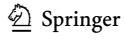

Xu Song and Yongyao Li have contributed equally to this work.

Extended author information available on the last page of the article

X. Song et al. **300** Page 2 of 44

humans (Hodson [2018](#page-36-0); Billard and Kragic [2019;](#page-34-0) Wu et al. [2022;](#page-41-0) Petrenko et al. [2023](#page-39-0); Qin et al. [2023](#page-39-1); Li et al. [2022](#page-38-0)). This represents an initial step in the interaction between the dexterous hand and the real world, forming the foundation for the research and application of human-like robots (Liu et al. [2024](#page-38-1)).

It is well-established that humans exhibit extraordinary dexterity when operating objects, and this skill is of great interest in humanoid robotics. In recent years, the rapid advancements in embodied intelligence and humanoid robotics have propelled dexterous grasping technology into the spotlight of academic research. Compared to conventional parallel grasping executed with standard parallel grippers, which typically have 7 DoF (Fang et al. [2020,](#page-35-0) [2022](#page-36-1); Dai et al. [2023](#page-35-1)), dexterous grasping leverages five-fingered dexterous hands with over 20 DoF to more precisely mimic the structure and movement of human hands. This sophistication not only improves their capacity to adapt to human-centered environments but also gives them the crucial ability to perform precise and functional manipulations of objects (Liu et al. [2024](#page-38-1); Chen et al. [2024](#page-35-2)). As shown in Fig. [1](#page-1-0), by offering a diversified approach to object manipulation (Cini et al. [2019](#page-35-3)), dexterous grasping enables robots to master advanced manipulation techniques (Xu et al. [2023a](#page-42-0)), such as handling complex tools. Furthermore, robots that emulate human appearance and behavior are often more readily accepted and understood by people, giving them a particular advantage in sectors such as service and healthcare (Liu et al. [2024](#page-38-1)). In general, due to its high flexibility and multi-DoF characteristics, dexterous grasping technology has demonstrated immense application potential and significant advantages in various fields, including automated manufacturing, precision assembly, and service robotics.

Dexterous grasping utilizes high DoF dexterous hands for manipulation, which not only requires robust visual perception capabilities but also necessitates precise planning and control abilities. However, it presents significant challenges due to the numerous degrees of freedom and complexity of modeling grasp interactions. With the remarkable advancements of deep learning models in fields such as image processing and natural language processing, numerous innovative solutions have emerged, significantly enhancing the grasping capabilities of dexterous systems. However, there is still a notable gap between research scenarios and practical applications, which hinders the effective implementation of this technology in real-world applications. *Therefore, a comprehensive and in-depth survey is urgently needed to summarize the recent advancements in the field and to effectively guide and facilitate future research.*

Several reviews (Du et al. [2021](#page-35-4); Newbury et al. [2023](#page-39-2); Li et al. [2024d;](#page-38-2) Bohg et al. [2014;](#page-34-1) Sahbani et al. [2012](#page-40-1); Bicchi and Kumar [2000](#page-34-2); Shimoga [1996\)](#page-40-2) have been published addressing pertinent research topics, including parallel grasping tasks (Du et al. [2021](#page-35-4)), universal grasping (Newbury et al. [2023](#page-39-2)), and tactile perception techniques (Li et al. [2024d](#page-38-2)), yet there

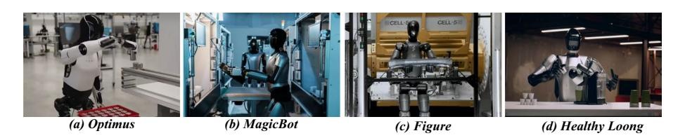

**Fig. 1** Examples of humanoid robot operation. **a** Optimus robot is sorting battery cells. **b** MagicBot robot is assisting in product quality inspection. **c** Figure robot is engaged in automobile production. **d** Healthy Loong robot is operating the coffee machine

remains a notable gap in research exclusively focusing on dexterous grasping tasks. Notably, dexterous grasping differs significantly from the aforementioned tasks. Firstly, compared to parallel grasp generation, dexterous grasp generation requires more refined and complex modeling of the hand and object due to the dexterous hand with high DoF, thus potentially posing greater challenges. Secondly, in terms of task execution, dexterous grasping necessitates controlling more degrees of freedom, which demands careful consideration of the coupling issues among joints and how to achieve grasping in a natural and smooth manner. In light of this observation, we are motivated to conduct a comprehensive and up-to-date survey, with the aim of summarizing the recent advancements in learning-based dexterous grasping, analyzing its underlying challenges, and discussing the possible future directions for facilitating the widespread application of this task.

Based on the aforementioned content, we conducted an extensive literature review on Google Scholar and Web of Science, and manually screened out papers inconsistent with our research objectives. A summary of the search criteria is presented in Table [1](#page-2-0). We filtered papers based on their titles, abstracts, and the search/review criteria outlined in Table [1](#page-2-0), ultimately identifying 124 papers related to the field of dexterous grasping published between 2020 and 2024. Figure [2](#page-3-0) presents the analysis results of the selected literature. Specifically, Fig. [2](#page-3-0)a shows the annual growth in the number of sampled papers, while Fig. [2](#page-3-0)b indicates that the sampled literature includes 91 conference papers and 33 journal articles. These results demonstrate that dexterous grasping remains a relatively active research domain. Furthermore, Fig. [2c](#page-3-0) displays the top 6 institutions mentioned in the papers, with most researchers concentrated in China, the United States, Germany, the United Kingdom, Italy, and Austria. Figure [2d](#page-3-0) highlights the keywords most frequently mentioned in these samples.

In the upper section of Fig. [3,](#page-3-1) we provide a concise outline of this investigation. The processing of typical dexterous grasping solutions is categorized into two parts: Grasp Generation (GG) and Grasp Execution (GE). We then summarize and compare the primary contributions of various solutions from these two perspectives. Specifically, the GG part generates effective grasp patterns, which can be broadly divided into classification-based, regression-based and generation-based. The GE part performs grasping based on the generated grasp pose, integrated with visual and tactile information, and it mainly consists of motion planing and motion control. Detailed perspectives of these two components are depicted in the middle of Fig. [3](#page-3-1).

Subsequently, we elaborate on the currently related benchmark datasets (Xu et al. [2023a;](#page-42-0) Chao et al. [2021;](#page-35-5) Hasson et al. [2019](#page-36-2)) and the testing protocols used to evaluate the retrieval performance for dexterous grasping. Through comprehensive comparisons and analyses of

**Table 1** Search criteria for the literature review

| Search criteria    | Description                                                  |
|--------------------|--------------------------------------------------------------|
| Search terms       | Dexterous grasping or anthropomorphic hand grasping or    |
|                    | Grasp generation or grasp synthesis or                       |
|                    | Grasp motion planning or grasp motion control                |
| Time period        | 2020-2024                                                    |
| Publication type   | Journal articles or conference articles                      |
| Research areas     | Robotics, artificial intelligence,                           |
|                    | Computer science, engineering, automation control systems |
| Exclusion Criteria | Parallel grasping, 6D pose estimation                        |
| Contextual         | Algorithm-centric                                            |

**300** Page 4 of 44 X. Song et al.

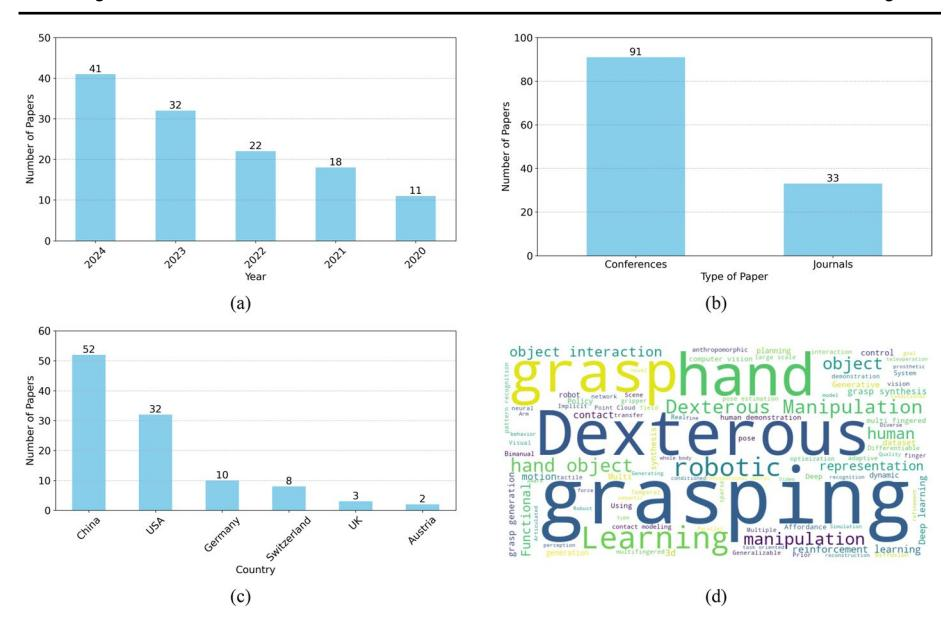

Fig. 2 Literature analysis. a The distribution of the number of sampled papers across different types. b The distribution of the number of sampled papers across different years. c The distribution of the number of sampled papers across different countries. d The wordcloud based on the titles and keywords of sampled papers

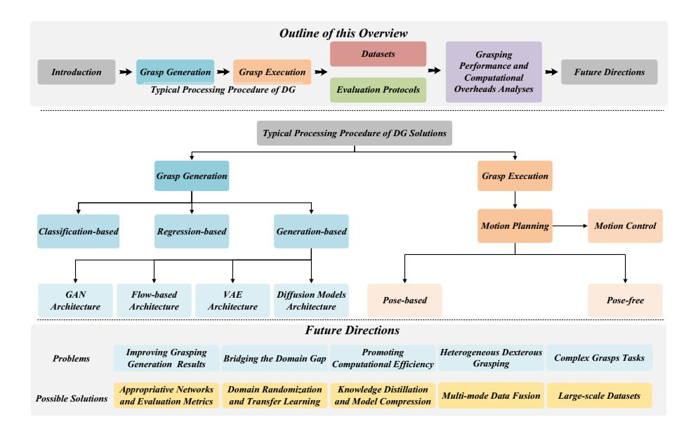

**Fig. 3** The outline of our overview for the dexterous grasping task. DG represents dexterous grasping. The briefing of sections in this survey is provided in the upper part. In the middle part, the detailed contents inside each typical processing procedure of grasp generation and grasp execution are summarized, respectively. At the bottom, five unresolved problems and also corresponding possible countermeasures are shown for future developments (best viewed in colors)

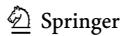

the current state-of-the-art (SOTA) solutions, we are able to provide valuable insights to researchers in related fields. Finally, we carefully outline potential future research directions for dexterous grasping, as illustrated at the bottom of Fig. [3.](#page-3-1)

In Fig. [4,](#page-4-0) we provide a detailed overview of the development trends and future directions for dexterous grasping. Specifically, these benchmarks conducted between 2020 and 2024 are listed in the orange boxes below, categorized by the year they were introduced. We also summarize the development trends observed in recent years and point out potential future research directions. In brief, this comprehensive overview can greatly assist researchers in quickly grasping the latest advancements and future prospects of dexterous grasping.

The main contributions can be summarized as follows:

- To our knowledge, we make one of the first attempts towards learning-based dexterous grasping and conduct a comprehensive survey of the current advancements in this technology.
- By discussing the strengths and limitations of existing solutions, we have conducted an in-depth analysis and comprehensively compared the grasping performance of SOTA methods on widely used large-scale benchmark tests.
- Furthermore, we have analyzed several potential future directions for dexterous grasping to address existing challenges, which will facilitate the widespread application of this technology in real-world scenarios.

# **2 Grasp generation**

Grasp Generation refers to generating appropriate grasp postures based on the size, topology, geometry and other characteristics of the target object (Hidalgo-Carvajal et al. [2023](#page-36-3)). Grasp quality and diversity are critical points in dexterous grasp tasks. On these foundations, there is a preference for precise grasping and targeting specific parts of objects.

Early researches primarily focus on analytical methods (Ponce et al. [1993](#page-39-3); Shimoga [1996;](#page-40-2) Buss et al. [1996](#page-34-3); Ponce et al. [1997](#page-39-4); Li et al. [2003;](#page-37-2) Zheng and Qian [2005;](#page-43-0) Rodriguez et al. [2012;](#page-39-5) Prattichizzo et al. [2012](#page-39-6); Rosales et al. [2012](#page-40-3); Li et al. [2015;](#page-37-3) Murray et al. [2017;](#page-39-7) Xu et al. [2024c\)](#page-41-1), optimizing grasping poses of dexterous hands by considering kinematic and physical constraints, to form force closure that can resist wrench disturbances, such as

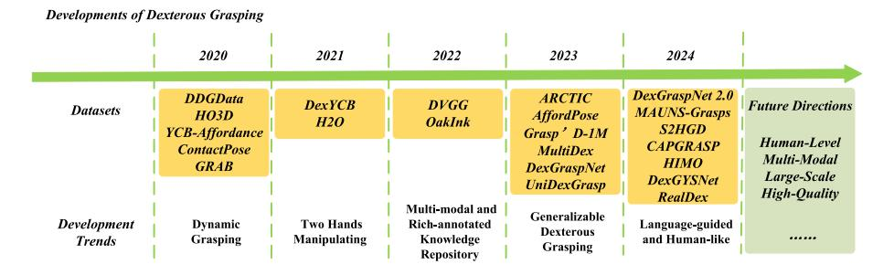

**Fig. 4** The development trends of dexterous grasping benchmarks. Specifically, these benchmarks (highlighted with orange boxes) are listed according to the years they were proposed. In addition, we summarize the development trends in recent years and point out possible future research directions (best viewed in color)

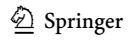

external forces and torques. Due to the complexity and high cost of computing hand kinematics and testing force closure, some works are devoted to simplifying the search space (Ponce et al. [1993,](#page-39-3) [1997;](#page-39-4) Li et al. [2003;](#page-37-2) Zheng and Qian [2005\)](#page-43-0), or simplifying the optimization process with an auxiliary function (Liu [1999;](#page-38-3) Zheng and Chew [2009;](#page-43-1) Li et al. [2015;](#page-37-3) Dai et al. [2018;](#page-35-6) Li et al. [2023](#page-37-4)).

In recent years, learning-based approaches have aroused widespread attention from researchers, due to direct and efficient characteristics (Jiang et al. [2021;](#page-37-5) Corona et al. [2020;](#page-35-7) Lundell et al. [2021](#page-38-4); Yang et al. [2021;](#page-42-1) Lundell et al. [2021](#page-39-8)). By training on a large amount of grasp data, these methods enable the model to learn how to generate appropriate grasp postures based on different object properties and grasping intents. Compared to most analytical approaches, learning-based approaches typically have higher inference speeds and can generate more diverse grasp postures, thereby adapting to more varied grasping scenarios. Accordingly, we mainly focus on discussing the current research status of learning-based methods in this paper.

Based on the differences in output results and input data, learning-based approaches can be further subdivided into **classification-based methods**, **regression-based methods**, and **generation-based methods**. Classification-based methods (Lu and Hermans [2019;](#page-38-5) Shi et al. [2020;](#page-40-4) Ghazaei et al. [2017](#page-36-4); Zhang et al. [2022;](#page-42-2) Li et al. [2020](#page-38-6); Hidalgo-Carvajal et al. [2023;](#page-36-3) Ficuciello et al. [2019](#page-36-5)) refer to those that directly output a corresponding grasp type, such as tripod and lateral, based on input object data (e.g., point cloud or image). These grasp types are usually manually annotated. Regression-based methods (Xu et al. [2024b;](#page-41-2) Zhou et al. [2024;](#page-43-2) Li et al. [2022](#page-38-0)) predict grasp parameters, such as finger joint angles, rotation, and translation positions, based on the input object data. Generation-based methods (Lu et al. [2024](#page-38-7); Zhao et al. [2024\)](#page-43-3), are capable of generating a wider variety of grasping strategies based on input object data and random distributions.

### **2.1 Classification-based**

Classification-based methods, also known as grasp pattern recognition, enable anthropomorphic grasping capabilities by learning the grasping patterns that humans adopt for different objects. Similar to image classification tasks, each object corresponds to a specific grasp type, such as an enveloping grasp for a cup and a pinch grasp for a pen. Based on this assumption, some researchers annotate the grasp types for grasping targets and train deep learning networks for classification. Specifically, the classification-based method takes images or point clouds of the grasping target captured by cameras as input. The data is input into a deep neural network for feature extraction. Then, the extracted features are fed into a classifier to predict the probabilities of grasping types. The grasping type corresponding to the highest probability is selected, and its associated posture is executed. The flowchart for the classification-based methods is shown in Fig. [5.](#page-6-0) This process involves data annotation, extracting and classifying object grasping features. The core of these methods lies in labeling appropriate grasp types for different objects, and using deep neural networks to learn the object grasping features for subsequent classification of grasp types.

For data annotation, given the diversity of human hand grasping patterns, establishing a suitable classification principle is crucial for achieving efficient grasp pattern recognition. Researchers (Feix et al. [2016](#page-36-6); Cini et al. [2019](#page-35-3)) have primarily classified grasp patterns into two major categories: power (security and stability) grasp and precision (dexterity and sen-

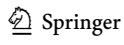

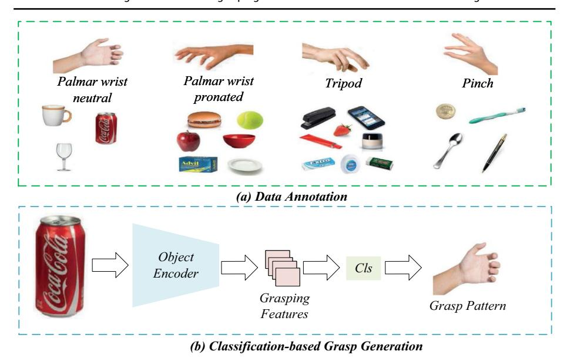

**Fig. 5** The typical flowchart of classification-based methods. Cls represents classification head. The figure is modified based on the figure from (Ghazaei et al. [2017](#page-36-4))

sitivity) grasp, further subdivided into 33 categories based on grasping stability and dexterity to better understand and simulate human grasping behavior, with specific grasp patterns shown in Fig. [6.](#page-7-0) However, it is worth noting that some recent methods (Lu and Hermans [2019;](#page-38-5) Shi et al. [2020;](#page-40-4) Ghazaei et al. [2017;](#page-36-4) Deng et al. [2021;](#page-35-8) Zhang et al. [2022\)](#page-42-2) use 4 or 6 grasp types to verify grasping stability and dexterity. For example, in (Ghazaei et al. [2017;](#page-36-4) Zhang et al. [2022](#page-42-2)), grasp patterns are summarized into four types, including pinch, tripod, palmar wrist neutral, and palmar wrist pronated, as illustrated. In (Li et al. [2020](#page-38-6)), six most used grasping poses (power: circular, heavy warp, prismatic, thin; precision: circular, prismatic) is selected, while may limit the dexterity of high DoF hands.

For classification, most of these methods (Ghazaei et al. [2017;](#page-36-4) Zhang et al. [2022\)](#page-42-2) employ convolutional neural networks (CNNs) as the backbone network to extract grasping features from images or point clouds. For instance, as the pioneering work based on CNNs, Ghazaei et al. [\(2017](#page-36-4)) propose a simple CNN structure for grasp pattern recognition. Inspired by this, a series of CNN-based grasp pattern recognition methods emerged (Ghazaei et al. [2019;](#page-36-7) Hundhausen et al. [2019\)](#page-37-6). However, these methods perform poorly on unknown objects, and issues such as size confusion and structure confusion have a significant drawback on model performance. To overcome these challenges, Zhang et al. ([2022\)](#page-42-2) propose a new deep learning architecture, a dual-branch convolutional neural network (DcnnGrasp), for effective grasp pattern recognition. DcnnGrasp has two branches: an object category classification branch and a grasp pattern recognition branch. The former can help achieve better grasp pattern recognition accuracy. Since the recognition tasks are highly correlated, it is natural to jointly learn object category information and object grasp type information. Similarly, Li et al. [\(2020](#page-38-6)) recognize the material at the molecular level of the target object by perceiving its near-infrared spectrum and collect RGB-D images to estimate the object's size, allowing their system to determine the most suitable grasping strategy based on the object's

X. Song et al. **300** Page 8 of 44

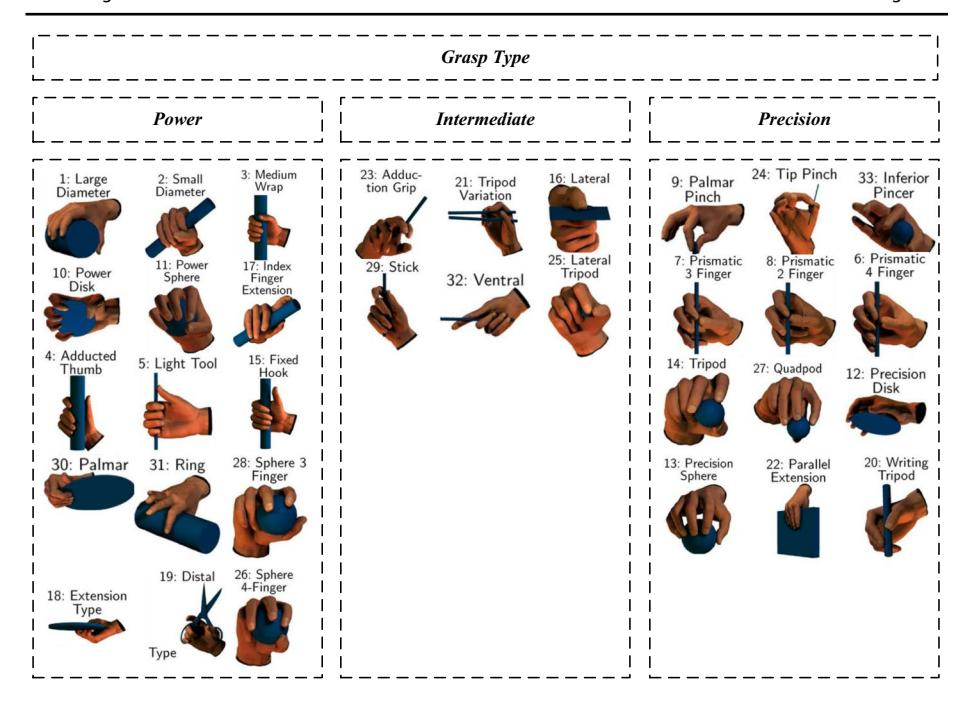

**Fig. 6** Taxonomy used to classify grasps in the experiment. The figure is modified based on the figure from (Feix et al. [2016\)](#page-36-6)

characteristics. Further, Hidalgo-Carvajal et al. [\(2023](#page-36-3)) propose an end-to-end method that integrates object shape completion, grasping posture prediction, and a robotic arm-hand anthropomorphic grasping strategy to grasp unseen objects in a real-world setup. It can automatically reconstruct and infer complete 3D models of unseen objects from a single static view under occlusions. Then, it can predict grasping poses related to the entire geometry of the object in a highly label-efficient manner.

Nevertheless, an object can be grasped thought varied gestures. These methods also introduce a new problem, namely the limited flexibility of grasp pattern recognition. Besides, annotating large-scale datasets for grasp pattern recognition technology is a significant challenge. It not only requires substantial time and resource investment but also involves issues of data quality and accuracy, making this task difficult and costly.

### **2.2 Regression-based**

Regression-based methods (Romero et al. [2017](#page-40-5); Liu et al. [2019](#page-38-8), [2020;](#page-38-9) Xu et al. [2024b;](#page-41-2) Zhou et al. [2024](#page-43-2)) directly predict the grasp parameters (e.g., joint angles) given the object as input. Specifically, the regression-based method takes depth images or point clouds as input, which are then input into a deep neural network for feature extraction. The extracted features are subsequently fed into a predictor to directly output joint angles. The flowchart for the regression-based methods is shown in Fig. [7.](#page-8-0) Generating grasp poses for a high DoF gripper is more challenging than for low DoF grippers due to the existence of pose ambiguity, i.e., there exists a large number of equally effective grasp poses for a given target object,

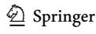

as shown in Fig. [7](#page-8-0)b. As a result, it is difficult to find grasp poses for many objects that can be represented by a single neural network. Liu et al. [\(2019](#page-38-8)) resolve this ambiguity by generating an augmented dataset that covers many possible grasps for each target object and train their neural networks using a consistency loss function to identify a one-to-one mapping from objects to grasp poses. Furthermore, they enhance the quality of neural network-predicted grasp poses using an additional collision loss function to avoid penetrations. However, the predicted gripper pose is not directly usable and needs to be post-processed. To address it, Liu et al. [\(2020](#page-38-9)) propose deep differentiable grasp planner (DDG), an end-to-end algorithm for training deep neural networks to grasp novel objects. DDG designs a differentiable *Q*1 metric, which generalizes the standard *Q*1 metric to the case when the gripper is not in contact with objects. With this generalized *Q*1 metric, they are able to supervise the neural network to predict fine grasp end-to-end. Their network takes 5 depth images of the object as input and directly regresses 6D pose and joint angles of the ShadowHand. To ease learning, they divide the training process into two stages. In the first stage, they only use the loss of the grasp poses, and in the second stage, they fine-tune the network with differentiable *Q*1 loss and other losses to avoid penetration and pull the hand closer to the object.

However, these methods seldom consider the scenario of cluttered environments. Grasping in clutters with multiple objects is significantly harder because of the limited space to access the object and occlusions. Li et al. ([2022\)](#page-38-0) propose HGC-Net, a single-shot network that learns to predict dense hand grasp configurations in clutter from single-view point cloud input. In addition, according to the grasping part of an object, humans can select the appropriate grasping postures of their fingers. When humans grasp the same part of an object, different poses of the palm will cause them to select different grasping postures. Inspired by

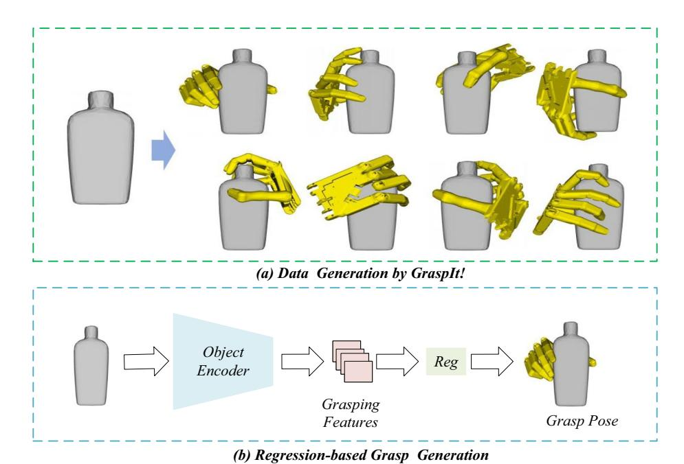

**Fig. 7** The typical flowchart of regression-based methods. Reg represents regression head. The figure is modified based on the figure from (Liu et al. [2019\)](#page-38-8)

X. Song et al. **300** Page 10 of 44

these human skills, Shang et al. ([2022\)](#page-40-6) propose new grasp posture prediction networks with multiple inputs, which acquire information from the object image and the palm pose of the dexterous hand to predict appropriate grasp postures.

Nevertheless, these methods struggle to generate feasible and diverse grasps given the same input point cloud. They are prone to mode collapse, which can harm diversity. Additionally, they may also suffer from mode averaging, which can reduce regression accuracy and thus impact the success rate. Inspired by the success of detection transformers, Xu et al. ([2024b](#page-41-2)) design a transformer-based framework specifically for dexterous grasp generation, named Dexterous Grasp TRansformer (DGTR), to learn to predict multiple grasps of an object at one time. Besides, to address model collapse and object penetration, DGTR adopts a phased progressive training strategy and adversarial loss, achieving high-quality and highly diverse grasp pose generation. However, there are relatively few schemes specifically designed for capturing feature extraction network design.

Although regression-based methods have made some progress in object grasping applications, they still face issues such as mode collapse, mode averaging, dependence on input information, and inadequacies in feature extraction network design. Future research should focus more on optimizing these methods to improve their accuracy, diversity, and robustness in practical applications. Additionally, there is a need to explore new algorithms and frameworks to better address grasping tasks in complex scenarios.

### **2.3 Generation-based**

In recent years, compared with classification-based and regression-based methods, generation-based methods have garnered more extensive attention (Lu et al. [2024;](#page-38-7) Li et al. [2024b](#page-38-10)). The generative-based method is similar to the regression-based method. The difference lies in the input process. In addition to taking depth images or point clouds as input, the generative-based method also inputs a random variable, and different random variables will cause the generative model to produce different grasping poses. Generation-based methods can create diverse grasping postures, enabling flexible, stable grasping and dynamic manipulation. As shown in Fig. [8](#page-9-0), the general process for generating grasping includes grasp pose estimation, contact map generation, and grasp pose optimization. These methods can be further classified into GANs-based, VAE-based, flow-based and DM-based categories based on the type of generative model architecture. Different visual generative models are shown in Fig. [9.](#page-10-0)

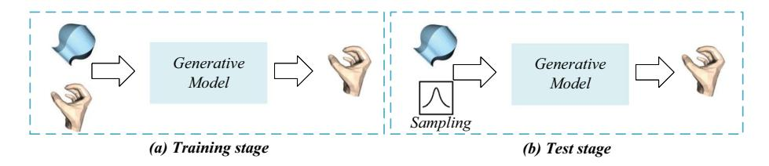

**Fig. 8** The typical flowchart of generation-based methods (Jiang et al. [2021](#page-37-5)). The figure is modified based on the figure from (Jiang et al. [2021\)](#page-37-5)

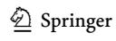

#### 2.3.1 GANs-based

Generative Adversarial Networks (GANs) have gained popularity in the field of image generation research. GANs consist of two parts, a generator and a discriminator. The generator attempts to learn the distribution of real examples in order to generate new data, while the discriminator determines whether the input is from the real data space or not. For example, Corona et al. (2020) address the problem of predicting realistic human grasping actions for one or multiple objects from a single RGB image by proposing a generative model (named GanHand) based on GANs that jointly reasons about image semantics, geometric structure, and hand-object interactions, and is trained on a large annotated dataset to robustly predict grasps in cluttered scenes. In addition, GANs-based grasping generation methods Corona et al. (2020); Patzelt et al. (2021); Lundell et al. (2021) are relatively rare. The possible limitations include the low interpretability of GANs models and the unstable training process.

#### 2.3.2 VAF-based

Following variational bayes inference, Variational Autoencoders (VAE) are generative models that attempt to reflect data to a probabilistic distribution and learn reconstruction that is close to its original input. For example, inspired by the recent advancements in learning-based implicit representations for 3D object reconstruction, Karunratanakul et al. (2020) take into account the degrees of freedom of the hand, the conformity with the object's surface, semantic, and physical plausibility. They propose an implicit representation method based on a standard VAE model, named the Grasping Field. This method employs a 3D-to-2D mapping to represent the hand, the object, and the contact area using implicit surfaces in a common space, thereby effectively and expressively generating human grasping actions. To address the challenge of synthesizing physically plausible and natural human hand grasps that align with object contact regions, Jiang et al. (2021) propose a unified framework combining a Conditional Variational Auto-Encoder (CVAE) (Sohn et al. 2015) for grasp synthesis and a ContactNet for contact map estimation, named GraspTTA, leveraging novel contact consistency constraints and a self-supervised task for both training and test-time adaptation.

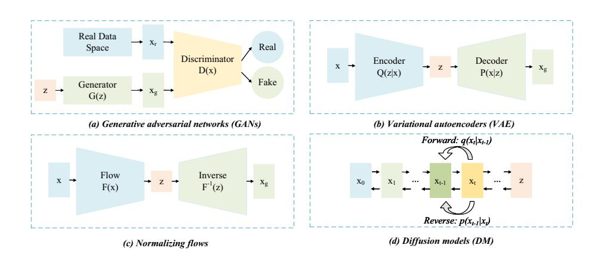

Fig. 9 Categories of vision generative models. The figure is reproduced from (Cao et al. 2023)

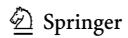

The majority of research employs an architecture similar to GraspTTA and utilizes it as a baseline model. Specifically, to address the issues of inadequate contact details and uncertainty representation in modeling hand-object interactions, Liu et al. [\(2023](#page-38-11)) propose ContactGen, a novel contact representation method, and combined it with a hierarchical CVAE model to achieve precise, diverse, and realistic modeling of hand-object interactions in object space. Li et al. ([2023a](#page-38-12)) address the challenge of generating precise, diverse, and generalizable grasping poses for unseen robotic hands by proposing GenDexGrasp, which leverages a conditional variational autoencoder to generate hand-agnostic contact maps and an efficient optimization scheme to refine grasping poses, thereby achieving a balance between speed, diversity, and generalizability. Zhao et al. [\(2024](#page-43-3)) address the problem of delicate manipulation and precise adjustment of grasping poses for varied shapes and sizes of objects by proposing GrainGrasp, a novel dexterous grasp generation scheme that leverages a generative model to predict fine-grained contact maps for each fingertip, enabling precise and determinable grasping strategies without requiring complete mesh information.

A limitation of their work is that there is no explicit modeling of the object functionality and human action in the current grasping representation (Karunratanakul et al. [2020\)](#page-37-7). In reality, a person holds an object differently according to different intentions. For instance, using a knife or passing it to someone else result in completely different human grasps. One promising future research direction is to incorporate human intention and object affordances into the grasping field for action specific grasps generation. Without modeling human motion priors, current methods face notable challenges in replicating human-like grasping motions for robotic dexterous hands. To overcome the challenges, Liu et al. [\(2024](#page-38-1)) propose a RealDex benchmark. RealDex encompasses two stages: grasp pose generation (Hasson et al. [2019](#page-36-2); Jiang et al. [2021](#page-37-5)) and motion synthesis (Taheri et al. [2022;](#page-40-8) Zhang et al. [2021](#page-42-3)), utilizing real point cloud data as input. The model is capable of learning human behavior patterns and integrates a selection module of multimodal large language models (MLLMs) to enhance performance, ensuring effective performance on unseen objects.

To summarize, CVAE model utilizes an encoder-decoder structure to learn the posterior distribution and relies on the learned latent variables to sample. Although CVAE is easy to train and sample due to its simple architecture and one-step sampling procedure, it suffers from the posterior collapse problem; the learned latent variable is ignored by a strong decoder, leading to limited generation diversity from these collapsed modes. Such collapse is further magnified in 3D tasks with stronger 3D decoders and more complex and noisy input conditions, e.g., the natural 3D scans.

### **2.3.3 Flow-based**

A normalizing flow (Dinh et al. [2014](#page-35-9), [2016](#page-35-10); Falorsi et al. [2019](#page-35-11); Kingma and Dhariwal [2018;](#page-37-8) Papamakarios et al. [2019\)](#page-39-10) is a distribution transformation from simple to complex by a sequence of invertible and differentiable mappings. For example, to address the challenges of grasp pose generation and execution trajectory planning in general dexterous hand grasping tasks, Xu et al. [\(2023a](#page-42-0)) propose a two-stage method, UniDexGrasp. Firstly, due to the limited expressive power of CVAE, which leads to mode collapse issues, they decomposes the conditional generation model into two separate models: GraspIPDF, which utilizes Implicit Probability Density Functions (IPDF) for conditional rotation generation, and GraspGlow, which employs Glow for conditional normalizing flows. By combining these

two modules, diverse grasp poses can be sampled, and the desired pose can be selected based on linguistic descriptions. Then, a target-conditioned policy is utilized for grasp execution. Additionally, the generalizability of the policy is enhanced through a teacher-student learning framework and key technological innovations, addressing the limitations of existing generative models in terms of grasp pose diversity and the difficulty of policy learning.

# **2.3.4 DM-based**

The generative diffusion model (DM) (Ho et al. [2020;](#page-36-8) Batzolis et al. [2021;](#page-34-5) Rombach et al. [2022;](#page-40-9) Saharia et al. [2022\)](#page-40-10) is a cutting-edge class of generative models based on probability, which demonstrates SOTA results in the field of computer vision. It works by progressively corrupting data with multiple-level noise perturbations and then learning to reverse this process for sample generation.

To overcome posterior collapse and a lack of unified framework, SceneDiffuser (Huang et al. [2023](#page-37-9)) is proposed, a conditional generative model based on the diffusion process. SceneDiffuser eliminates the discrepancies and provides a single home for scene-conditioned generation, optimization, and planning. Specifically, with a denoising process, it learns a diffusion model for scene-conditioned generation during training. In inference, SceneDiffuser jointly solves the scene-aware generation, physics-based optimization, and goal-oriented planning through a unified iterative guided-sampling framework. Wang et al. ([2024b\)](#page-41-3) propose S2HGrasp, a framework for generating human grasps on incomplete single-view scene point clouds, which incorporates a Global Perception module for global understanding and a DiffuGrasp module for high-quality grasp generation, addressing the challenge of incompleteness in object point clouds. To balance diversity and quality, Lu et al. [\(2024](#page-38-7)) introduce a unified diffusion-based dexterous grasp generation model, dubbed the name UGG, which operates within the object point cloud and hand parameter spaces. Their all-transformer architecture unifies the information from the object, the hand, and the contacts, introducing a novel representation of contact points for improved contact modeling. The flexibility and quality of their model enable the integration of a lightweight discriminator, benefiting from simulated discriminative data, which pushes for a high success rate while preserving high diversity. Beyond grasp generation, their model can also generate objects based on hand information, offering valuable insights into object design and studying how the generative model perceives objects. Current method requires category information as input which may prevent the model from further scaling up; there is no explicit mechanism to guarantee contact; and the model is still not at a scale comparable to generative models in other domains due to limited training data.

In addition, to fully utilize the potential of dexterous hands for intentional, human-like grasping, Wei et al. [\(2024](#page-41-4)) propose a DexGYSGrasp, designed with a progressive strategy, decomposes complex learning tasks into two sequential goals managed by progressive components. Firstly, the first component learns a grasping distribution, focusing on the consistency and diversity of intentions, and optimizes effectively without the constraint of penetration loss. Subsequently, the second component refines the initial coarse grasp into a high-quality grasp with the same intention and diversity. Their framework allows each component to concentrate on specific and manageable optimization objectives, significantly enhancing the overall performance of the generated grasps. Ye et al. ([2024\)](#page-42-4) propose G-HOP, a denoising diffusion-based generative model that jointly synthesizes plausible 3D object

shapes and corresponding hand configurations for hand-object interactions (HOI), conditioned on object categories, by utilizing a homogeneous HOI representation to overcome the challenge of modeling disparate representations separately. To address the issue of limited generalization in interaction types and object categories in existing datasets, which makes it difficult to model diverse 3D hand-object interactions with correct physical implications (such as contacts and semantics) from text prompts, Text2HOI (Cha et al. [2024](#page-35-12)) is proposed. It decomposes the interaction generation task into two subtasks: hand-object contact generation and hand-object motion generation, and learns a universal geometric representation, significantly enhancing the generalization and physical plausibility of the process.

In Table [2,](#page-14-0) we enumerate the algorithms and network architectures utilized in recent literatures. Among them, the Variational AutoEncoder (VAE) and Diffusion Model have been widely adopted. The Conditional Variational AutoEncoder (cVAE) is a model that integrates conditional information with the characteristics of the Variational AutoEncoder, enabling the generation of images or data that meet specific conditions. Additionally, the Diffusion Model is a model that generates data through gradual denoising, and it has found extensive application in fields such as image generation and audio synthesis. Notably, in research on image and video generation tasks, the Diffusion Model has been extensively studied due to its powerful generative capabilities and interpretability.

It is noteworthy that contact information has received extensive attention and application in grasp gesture generation (Grady et al. [2021](#page-36-9); Yu et al. [2021;](#page-42-5) Zhou et al. [2022\)](#page-43-4). For example, Zhou et al. ([2022\)](#page-43-4) propose an object-centric TOCH (Zhou et al. [2022](#page-43-4)) field by encoding contact locations and hand correspondences on the object aimed for temporal hand pose denoising. Significant progress has been made in estimating hand and object separately with deep learning methods, simultaneous (hand-object) HO pose estimation and contact modeling has not yet been fully explored. An explicit contact representation namely Contact Potential Field (CPF) (Yang et al. [2024](#page-42-6)) is presented, and a learning-fitting hybrid framework namely MIHO to Modeling the Interaction of Hand and Object. In CPF, treat each contacting HO vertex pair as a spring-mass system. Hence the whole system forms a potential field with minimal elastic energy at the grasp position. However, these methods also face many challenges. A key issue is that physical contact is sensitive to small changes in pose. For example, less than a millimeter change in the pose of a fingertip normal to the surface of an object can make the difference between the object being held or dropped on the floor. In addition to physical implausibility, lack of contact and other small-scale phenomena can reduce the perceptual realism of rendered poses. Grady et al. [\(2021](#page-36-9)) present ContactOpt, an algorithm that improves the quality of hand-object contact by refining hand pose. When given a hand mesh and an object mesh, ContactOpt infers where contact is likely to occur and then optimizes the hand pose to achieve this contact.

While previous approaches focus on the grasp stability, they have not fully utilized the potential of dexterous hands for intentional, human-like grasping. Recent studies, known as task-oriented (Li et al. [2021](#page-38-13); Chen et al. [2024\)](#page-35-13) and functional dexterous grasping (Zhu et al. [2023;](#page-43-5) Zhang et al. [2023](#page-42-7); Agarwal et al. [2023](#page-34-6); Wei et al. [2023\)](#page-41-5), aim to generate grasps based on specific tasks or functionality of objects. However, these approaches often rely on predefined, fixed and limited tasks or functions, restricting their flexibility and hindering natural human-robot interactions.

Ultimately, various algorithms and network architectures, particularly VAE and Diffusion Model, have been widely adopted in recent research, with contact information and

| Publication | Table 2 Dexterous grasp generation methods Method | Input            | GG model               | Contact-based | Type                 |
|-------------|------------------------------------------------------|------------------|------------------------|---------------|----------------------|
| CoRL        | DexGraspNet2.0 (Zhang et al. 2024)             | Point Cloud      | Diffusion model        | ×             | Genera tion-based |
| ICRA        | GrainGrasp (Zhao et al. 2024)                  | Point Cloud      | Optimization, VAE      | ✔             | Genera tion-based |
| CVPR        | DGTR (Xu et al. 2024b)                            | Point Cloud      | Transformer            | ×             | Regres sion-based |
| CVPR        | S2HGrasp (Wang et al. 2024b)                   | Point Cloud      | Diffusion Model        | ×             | Genera tion-based |
| CVPR        | G-HOP (Ye et al. 2024)                            | Point Cloud      | Diffusion Model        | ×             | Genera tion-based |
| CVPR        | Text2HOI (Cha et al. 2024)                        | Point Cloud,Text | Diffusion Model,VAE | ✔             | Genera tion-based |
| CVPR        | GEARS (Zhou et al. 2024)                          | Mesh,Trajectory  | Transformer            | ×             | Regres sion-based |
| ECCV        | SEMGRASP (Li et al. 2024b)                        | Point Cloud,Text | VAE                    | ×             | Genera tion-based |
| ECCV        | UGG (Lu et al. 2024)                              | Point Cloud      | Diffusion Model        | ✔             | Genera tion-based |
| NeurIPS     | DexGYSGrasp (Wei et al. 2024)                     | Point Cloud,Text | Diffusion Model        | ×             | Genera tion-based |
| IJCAI       | RealDex (Liu et al. 2024)                         | RGB-D            | VAE                    | ✔             | Genera tion-based |
| RAL         | DexDiffuser (Weng et al. 2024)                 | Point Cloud      | Diffusion Model        | ×             | Genera tion-based |
| RAL         | BimanGrasp DDPM (Shao and Xiao 2024)           | Point Cloud      | Diffusion Model        | ×             | Genera tion-based |
| CoRL        | DEFT (Kannan et al. 2023)                         | RGB              | DNN                    | ✔             | Regres sion-based |
| ICRA        | GenDexGrasp (Li et al. 2023a)                     | Point Cloud      | Optimization,VAE       | ✔             | Genera tion-based |
| ICRA        | UniDexGrasp (Xu et al. 2023a)                  | Point Cloud      | Flow                   | ✔             | Genera tion-based |
| CVPR        | SceneDiffuser (Huang et al. 2023)              | Point Cloud      | Diffusion Model        | ×             | Genera tion-based |
| ICCV        | ContactGen (Liu et al. 2023)                      | Point Cloud      | Optimization, VAE      | ✔             | Genera tion-based |
| IJCAI       | Contact2Grasp (Li et al. 2023b)                   | Point Cloud      | VAE, Optimization      | ✔             | Genera tion-based |
| CoRL        | NeuralGrasps (Khargonkar et al. 2022)          | Point Cloud      | VAE                    | ✔             | Genera tion-based |
| CoRL        | ISAGrasp (Chen et al. 2022)                       | Point Cloud      | DNN                    | ×             | Regres sion-based |
| ICRA        | HGC-Net (Li et al. 2022)                          | Point Cloud      | DNN                    | ×             | Regres sion-based |

**Table 2** (continued)

| Publication | Method                                            | Input              | GG model          | Contact-based | Type                 |
|-------------|---------------------------------------------------|--------------------|-------------------|---------------|----------------------|
| CVPR        | D-Grasp (Chris ten et al. 2022)                | Static Grasp Label | DNN               | ×             | Regres sion-based |
| TCYBER      | GCNNs (Shang et al. 2022)                      | Point Cloud        | DNN               | ×             | Regres sion-based |
| ICRA        | BCGPLVM (Dimou et al. 2021)                 | Object shape, size | VAE               | ×             | Genera tion-based |
| CVPR        | ContactOpt (Grady et al. 2021)              | RGB, Mesh          | DNN, Optimization | ✔             | Genera tion-based |
| ICCV        | CPF (Yang et al. 2021)                         | RGB, Mesh          | DNN               | ✔             | Genera tion-based |
| ICCV        | GraspTTA (Jiang et al. 2021)                | Point Cloud        | VAE               | ✔             | Genera tion-based |
| RSS         | DDG (Liu et al. 2020)                          | Depth Images       | DNN               | ×             | Regres sion-based |
| CVPR        | GanHand (Corona et al. 2020)                | RGB                | GAN               | ×             | Genera tion-based |
| ECCV        | GrabNet (Taheri et al. 2020)                   | Point Cloud        | VAE               | ✔             | Genera tion-based |
| 3DV         | Grasping Field (Karunratanakul et al. 2020) | Point Cloud        | VAE               | ✔             | Genera tion-based |

task-oriented grasping receiving significant attention but still facing challenges in terms of stability and diversity.

# **3 Grasp execution**

In dexterous grasping tasks, the grasping execution process is typically divided into two core steps: motion planning and motion control (Li et al. [2024d](#page-38-2)). During the motion planning stage, the system plans reasonable motion trajectories based on key information such as the position and orientation of the grasping object. Early researchers predominantly adapt analytical methods, optimizing and determining the control trajectories for robots to execute grasping actions through precise simulations of the kinematics and dynamics of the hand and the object. This approach typically relies on a profound understanding of the physical world to ensure that the planned trajectories are both efficient and accurate. Recent research has shifted towards learning-based methods, which allow robots to learn from vast amounts of data and subsequently predict and generate effective control trajectories without the need for prior construction of precise models. These methods often demonstrate greater flexibility and adaptability when dealing with complex and varied environments.

During the motion control stage, the system precisely executes the planned motion trajectories, including the control of motion parameters such as position, velocity, and acceleration, to ensure that the robot can stably and accurately follow the planned trajectories to perform grasping operations.

# **3.1 Motion planing**

As shown in Fig. [10,](#page-16-0) grasp execution requires the agent to move along a complete trajectory. Motion planning for robot grasping aims to find a feasible motion trajectory in the configuration space that enables the robot to successfully grasp a target object. Although optimizing grasp motion with two- or three-fingered grippers has been well studied, the study of natural grasp motion planning with a dexterous hand remains a challenging problem due to the high-dimensional working space. On the other hand, grasp motion planning aims to generate a collision-free path towards grasping an object. The problem has been studied for decades in robotics and most existing grasping motion planning problems mainly focus on robotic arms with grippers. In recent years, humanoid robots have gained increasing interest in both the academic and industrial community, and grasping motion planning for dexterous hands with high DoF has become an important research problem.

Early research was primarily based on analytical methods, which can be further categorized into two types: sampling-based and trajectory optimization-based. Samplingbased grasp planning involves repeatedly sampling configurations from a space, expanding a search graph to cover this space, and then finding a collision-free path from a start to a goal configuration (Kavraki et al. [1996;](#page-37-11) Janson and Pavone [2016](#page-37-12); Lowrey et al. [2019;](#page-38-15) Vahrenkamp et al. [2010;](#page-41-7) Zhou et al. [2023\)](#page-43-6). Previous research rely on single manipulation primitives that could not handle complex tasks and lack a unified model and effective optimization methods. However, despite these advancements, the full dexterity of high DoF robotic hands was not fully utilized. Trajectory optimization methods begin with an initial, potentially unrealistic trajectory and refine it by minimizing a cost function. However, these methods (Wang et al. [2019](#page-41-8); Schulman et al. [2013](#page-40-13)) typically require simplifications such as using simple finger and object geometries to make planning tractable. Some works (Mukadam et al. [2018](#page-39-11); Zhou et al. [2023](#page-43-7)) attempt to integrate deep learning with optimization algorithms to address trajectory optimization problems.

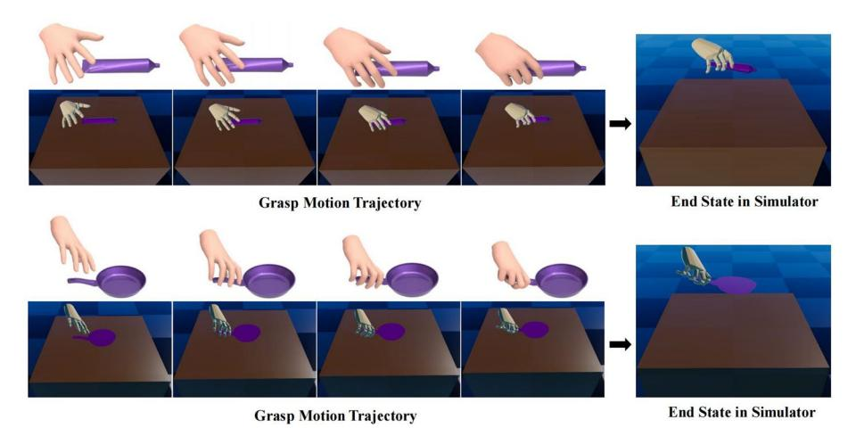

**Fig. 10** The visualizations of grasp motion trajectory in the simulator. Firstly, given a grasping target input, the target grasping pose is obtained through an existing grasping generator. Then, the starting pose is initialized, and an optimized grasping motion sequence is formed based on the target grasping pose. Finally, the motion sequence is executed in a simulation environment. The figure is reproduced from (Li et al. [2024c\)](#page-38-16)

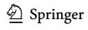

As the field of deep learning continues to evolve, researchers are actively exploring learning-based methods to generate plausible grasp trajectories or provide rich prior knowledge for the optimization of grasp trajectories. Table [3](#page-17-0) summarizes recent grasping planning algorithms. In particular, reinforcement and imitation learning techniques have shown promise for dexterous grasping Christen et al. ([2022\)](#page-35-15); Qin et al. [\(2022](#page-39-12)); She et al. ([2022\)](#page-40-14); Wu et al. ([2022\)](#page-41-0). These methods can be further subdivided into pose-based and pose-free, depending on whether the pre-defined grasping configuration is required.

**Pose-based** grasp planning refers to predefining a suitable grasping pose (such as position, joint angle, *etc.*) at the beginning of the grasping task. For example, Mandikal and Grauman ([2021](#page-39-13)) propose a deep reinforcement learning approach (GRAFF) based on object-centric visual affordances, which achieves dexterous robotic grasping by learning the regions of objects most suitable for human interaction, thereby improving learning efficiency and generalization capability. Furthermore, Mandikal and Grauman ([2022\)](#page-39-14) propose DexVIP, which learns human pose priors from videos and imposes these priors into deep reinforcement learning (DRL) by incorporating auxiliary reward functions favoring robot poses similar to the human ones in videos. Li et al. ([2021\)](#page-38-13) propose a task-oriented dexterous grasping method. This method learns human grasping skills from a task-oriented object grasping database, and utilizes a reinforcement learning mechanism to deploy selected

**Table 3** Dexterous grasp execution methods

| Publication | Method                                 | Way | Type       |
|-------------|----------------------------------------|-----|------------|
| RSS         | DP3 (Ze et al. 2024)                   | IL  | Pose-free  |
| ICRA        | TPGA (Li et al. 2024c)                 | DL  | Pose-based |
| ICRA        | InterRep (Cui et al. 2024)             | RL  | Pose-free  |
| CVPR        | CyberDemo (Wang et al. 2024)           | IL  | Pose-free  |
| ECCV        | GraspXL (Zhang et al. 2025)            | RL  | Pose-based |
| IJCAI       | RealDex (Liu et al. 2024)              | DL  | Pose-based |
| 3DV         | ArtiGrasp (Zhang et al. 2024)          | RL  | Pose-free  |
| RAL         | RESPRECT (Ceola et al. 2024)           | RL  | Pose-based |
| Arxiv       | FunGrasp (Huang et al. 2024)           | RL  | Pose-based |
| Arxiv       | UniGraspTransformer (Wang              | RL  | Pose-free  |
|             | et al. 2024a)                          |     |            |
| CORL        | ILDA (Wu et al. 2022)                  | RL  | Pose-based |
| ICRA        | HMS (Zhou et al. 2023)                 | N/A | Pose-free  |
| ICRA        | PGDM (Dasari et al. 2023)              | RL  | Pose-based |
| IROS        | DexRepNet (Liu et al. 2023)            | RL  | Pose-free  |
| IROS        | G-PAYN (Ceola et al. 2023)             | RL  | Pose-based |
| CVPR        | UniDexGrasp (Xu et al. 2023a)          | RL  | Pose-based |
| ICCV        | UniDexGrasp++ (Wan et al. 2023)     | RL  | Pose-free  |
| NeurIPS     | GraspGF (Wu et al. 2023)               | RL  | Pose-based |
| RAL         | CGF (Ye et al. 2023)                   | DL  | Pose-free  |
| CoRL        | DexPoint (Qin et al. 2022)             | RL  | Pose-free  |
| CoRL        | DexVIP (Mandikal and Grau man 2022) | RL  | Pose-based |
| CVPR        | GOAL (Taheri et al. 2022)              | DL  | Pose-based |
| CVPR        | D-Grasp (Christen et al. 2022)         | RL  | Pose-based |
| ICRA        | GRAFF (Mandikal and Grau man 2021)  | RL  | Pose-based |
| ICRA        | / (Li et al. 2021)                     | RL  | Pose-based |

RL represents reinforcement learning, IL represents imitation learning, DL represents deep learning

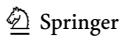

grasping strategies, demonstrating the feasibility and effectiveness of dexterous grasping. Christen et al. ([2022\)](#page-35-15) propose D-Grasp, a RL-based method that leverages physics simulations to generate smooth and stable grasping motions with only a single grasp reference as input, demonstrating its effectiveness in synthesizing dynamic grasping sequences.

Unlike the aforementioned methods that employ reinforcement learning, Taheri et al. ([2022\)](#page-40-8) utilizes autoregression to achieve motion planning. They aim to address the issue of the lack of natural whole-body movements and object interactions for virtual characters in movies, games, AR/VR, and the metaverse. They point out that previous work often focused on isolated aspects such as the body, hands, or body-scene interactions, neglecting the integrated consideration of the body, head, feet, hands, and objects. To this end, Taheri et al. [\(2022](#page-40-8)) propose the GOAL method, which is capable of generating natural motions for whole-body virtual characters grasping unknown objects. Wu et al. ([2022](#page-41-0)) propose ILAD, which trains a generator to synthesize grasping trajectories with large scale demonstrations instead of using human demonstrations directly. Dasari et al. ([2023\)](#page-35-18) propose the Pre-Grasp informed Dexterous Manipulation (PGDM) framework. This framework embeds pre-grasp poses as exploration primitives into existing learning pipelines, enabling the synthesis of behaviors across diverse tasks without the need for task engineering or hyper-parameter tuning. Ceola et al. [\(2024](#page-34-7)) address the challenge of learning dexterous manipulation tasks, particularly grasping, for multi-fingered robotic hands with numerous degrees of freedom, highlighting the limitations of previous model-free DRL approaches in terms of long training times and the sim-to-real gap. To overcome these limitations, they propose the RESPRECT method, which leverages a pre-trained base policy to learn a residual additive policy for grasping new objects more efficiently. This is the first Residual Reinforcement Learning (RRL) approach that learns a residual policy on top of another policy pre-trained with DRL. Differently from the SOTA G-PAYN (Ceola et al. [2023](#page-35-19)), RESPRECT does not require any task demonstration, while being trained much faster.

Recent works explore using raw visual inputs like RGB images (Mandikal and Grauman [2022\)](#page-39-14) and 3D point clouds (Qin et al. [2022\)](#page-39-15), but generalization to diverse objects remained challenging. Xu et al. [\(2023a\)](#page-42-0) propose a goal-conditioned policy for grasp execution using point cloud observations and proprioception, employing a teacher-student learning framework with canonicalization and an object curriculum to enhance generalization. However, UniDexGrasp (Xu et al. [2023a](#page-42-0)) face limitations in its teacher policy and curriculum learning. Wan et al. ([2023\)](#page-41-11) introduce UniDexGrasp++, improving performance through Geometry-aware Task Curriculum Learning (GeoCurriculum) and Geometry-aware iterative Generalist-Specialist Learning (GiGSL), thus enhancing generalization and task-handling capabilities.

To better apply for real-world scenarios, some methods have begun leveraging raw visual data, like images or point clouds, to train dexterous hand grasping motions. Yet, the reward functions in RL are artificially designed and fail to model human motion patterns, making RL-based method challenging to achieve human-like grasping motions. Because RealDex (Liu et al. [2024](#page-38-1)) provides accurate ground truth of human-like dexterous grasping motions, inspired by human motion generation methods, it is more appropriate to utilize supervised methods to guide the learning process. Li et al. [\(2024c](#page-38-16)) tackle the motion planning challenge for high DoF dexterous hand grasping, highlighting the limitations of prior methods in computational complexity and natural pose generation. They propose a temporal-parametric optimization approach incorporating hand priors to overcome these issues. By reducing

optimization dimensions and enhancing naturalness through a temporal-parametric function and a hand pose prior network, they improved the efficiency and feasibility of grasping motions.

**Pose-free** grasp planning refers to a method that directly proceeds with grasp planning without the need for pre-grasp initialization. For example, Liu et al. [\(2023](#page-38-17)) propose a novel compound geometric and spatial hand-object representation called DexRep, and a dexterous deep reinforcement learning method DexRepNet based on this representation to learn a generalizable grasping policy. Cui et al. ([2024\)](#page-35-17) identify a shortcoming in applying pre-trained models to robotic grasping, specifically in using visual representations. Prior work mainly rely on latent representations of entire images, neglecting more effective alternatives. To address this, they propose InterRep, a novel method combining the strengths of pre-trained models with the ability to capture dynamic interaction and local geometric features. Based on InterRep, they introduced a deep reinforcement learning approach to learn generalizable grasping policies. Their work validates the effectiveness of InterRep in close-range grasping tasks with limited visibility.

Recently, imitation learning has attracted widespread attention in gripper-based manipulation tasks, and some research has extended its application to dexterous hand grasping. For example, Ze et al. [\(2024](#page-42-9)) introduce the 3D Diffusion Policy (DP3) method to address the challenge of requiring extensive human demonstrations for robust and generalizable learning of complex skills in visual imitation learning. This approach integrates the powerful capabilities of 3D visual representations into diffusion policies (a class of conditional action generation models), achieving an effective algorithm for visual imitation learning. Wang et al. [\(2024](#page-41-9)) introduces CyberDemo, a novel robotic imitation learning approach that addresses the challenge of requiring extensive high-quality human demonstrations for complex manipulation tasks by leveraging simulated human demonstrations augmented with extensive data in a simulated environment. CyberDemo enhances robustness and generalizability of the trained policy against various physical and visual conditions, enabling successful transfer to real-world tasks with minimal real-world demonstration data and outperforming baseline methods.

In summary, researchers are advancing deep learning-based methods for generating plausible grasping trajectories and enhancing generalization capabilities, addressing limitations through innovative approaches like reinforcement learning, imitation learning, and leveraging human-like grasping motion data.

# **3.2 Motion control**

During the motion control stage, the system precisely executes the planned motion trajectories, including the control of motion parameters such as position, velocity, and acceleration, to ensure that the robot can stably and accurately follow the planned trajectories to perform grasping operations.

Conventional grasping controllers are designed using analytic models based on the feedback of actuator torques and positions (Pfanne et al. [2020;](#page-39-16) Wimböck et al. [2012](#page-41-13); Pfanne et al. [2018\)](#page-39-17), but subject to limited adaptive ability, especially in grasping objects with various physical properties. Pfanne et al. [\(2020](#page-39-16)) propose an object-level impedance controller for dexterous in-hand manipulation capable of handling dynamic changes in the grasp configuration. The proposed algorithm in (Takahashi et al. [2008](#page-40-15)) switches between force and

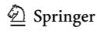

position control according to the external force. Romano et al. [\(2011\)](#page-39-18) introduced a framework that divided the grasping process into discrete phases based on the tactile information. Most of this paradigm of solutions is based on human ingenuity and handcraft of control rules (Kaboli et al. [2016\)](#page-37-14).

Recent advancements in robotic grasping have been significantly influenced by learningbased approaches (Bohg et al. [2014](#page-34-1); Kopicki et al. [2016](#page-37-15); Merzic et al. [2019](#page-39-19)). Various studies have employed self-supervised learning (Lee et al. [2019](#page-37-16)), deep reinforcement learning (DRL) (Shahid et al. [2020](#page-40-16)), and human demonstrations to achieve adaptive and dexterous grasping. For instance, multimodal sensory fusion and anthropomorphic robotic hands (Wang et al. [2022](#page-41-14)) have been used to generate adaptive grasping forces and policies for reaching, grasping, and lifting objects. Additionally, the Functional Division-based Manipulation Synergy (FDMS) method (Higashi et al. [2020\)](#page-36-10) has been proposed to address the challenges of controlling multi-fingered hands, enabling the execution of multiple sequential tasks.

Moreover, research has focused on endowing robots with human-like dexterity and compliance, particularly by combining vision-based teleoperation systems (Zeng et al. [2021](#page-42-13)) with adaptive force control. The temporal dynamics of grasp force patterns have also been addressed through the development of static and dynamic synergy models (Starke et al. [2021\)](#page-40-17), providing more accurate and human-like grasp force generation. Innovative designs and control methods for robotic hands have been explored (Lepora et al. [2021\)](#page-37-17), such as the integration of soft actuation, underactuation, and tactile feedback. These approaches have demonstrated the potential to maintain delicate closure and accurately perceive the pose of edge features of objects during autonomous grasping and manipulation. Furthermore, methods have been proposed to learn natural object interactions (Ye et al. [2023\)](#page-42-14) and generate a diverse range of grasps by conditioning on desired contact points and hand poses (Ye et al. [2023\)](#page-42-12). Human demonstrations have been utilized to transfer grasping skills to robotic manipulators through modeling and learning methods, such as Dynamic Motion Primitives (DMPs) (Hu et al. [2022](#page-37-18)). Continuous grasping trajectories have also been learned using the Continuous Grasping Function (CGF) model (Ye et al. [2023](#page-42-12)), overcoming the limitations of previous approaches that rely on finite discrete time steps. To address the challenge of picking up previously unseen daily objects, a learning-guided and geometry-informed grasp controller has been proposed (Matak and Hermans [2023](#page-39-20)), utilizing both visual and tactile sensing to generate precision grasps. Additionally, a Proximity-based Grasping Intelligence (P2GI) method (Heo and Park [2024](#page-36-11)) has been developed for intuitive and seamless control of highly functional prosthetic hands, utilizing an embedded sensor system to collect point cloud data and enable rapid decision-making.

In summary, these research efforts have contributed to significant advancements in the field of robotic grasping, paving the way for more intuitive, adaptable, and human-like robotic hands.

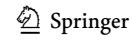

X. Song et al. **300** Page 22 of 44

# **4 Datasets and evaluation protocols**

### **4.1 Datasets**

The significance of datasets in advancing research on learning-based dexterous grasping cannot be overlooked (Wang et al. [2023\)](#page-41-15). Consequently, with the goal of fostering further progress in this field, we have compiled the datasets proposed in recent years in Table [4](#page-23-0) and proceeded to analyze the current status of dataset development as follows. As indicated in Table [4](#page-23-0), these datasets can be classified into synthetic datasets (marked in gray) and real datasets.

**Synthetic datasets** (Liu et al. [2020](#page-38-9); Goldfeder et al. [2009](#page-36-12)) rely on programmatically synthesized grasping poses generated using planners like *GraspIt!* (Miller and Allen [2004](#page-39-21)). For instance, the Obman dataset (Hasson et al. [2019\)](#page-36-2) and DDGdata Liu et al. [\(2020](#page-38-9)) comprise a series of hand-object mesh pairs generated by a non-learning based method *GraspIt!*. However, due to its naive search strategy (Wang et al. [2023](#page-41-15)), this approach often results in a narrow distribution of data that fails to capture the full dexterity of multi-finger hands.

To improve the quality and diversity of the grasp poses, Turpin et al. [\(2023](#page-41-16)) recently have proposed a novel differentiable grasping simulator called Fast-Grasp'D. By making grasping simulation differentiable and contact dynamics amenable to gradient-based optimization, Fast-Grasp'D accelerates the search for high-quality grasps with fewer limiting assumptions. Grasp synthesis with Fast-Grasp'D is 10x faster than *GraspIt!* (Miller and Allen [2004](#page-39-21)) and 20x faster than the previous Grasp'D differentiable simulator (Turpin et al. [2022\)](#page-41-17). The generated grasps are more stable and contact-rich than those produced by *GraspIt!*, regardless of the distance threshold used for contact generation. Based on Fast-Grasp'D, they have established a large-scale dataset called Grasp'D-1M for multi-finger robotic grasping, which contains one million training examples for three robotic hands (three-fingered, four-fingered, and five-fingered), each with multimodal visual inputs (RGB + depth + segmentation, available in both mono and stereo versions). On the other hand, DexGraspNet (Wang et al. [2023\)](#page-41-15), UniDexGrasp (Xu et al. [2023a\)](#page-42-0) and DexGraspNet 2.0 (Zhang et al. [2024](#page-42-8)) leverage a deeply accelerated differentiable force closure estimator and synthesize stable and diverse grasp poses on a large scale. It is noted that these datasets only contain the static grasp poses and without any dynamic grasping motion sequences. In addition, researchers have proposed methods such as ArtiBoost (Yang et al. [2022a](#page-42-15)), which diverse synthetic data through online sampling in a Composited hand-object Configuration and Viewpoint space, and HandBooster (Xu et al. [2024a](#page-42-16)), which boosts data diversity and 3D hand-mesh reconstruction by training a conditional generative space on hand-object interactions.

The methods of synthesizing datasets can generate large-scale, high-quality, and diverse grasping poses for different grippers. For example, MultiDex (Li et al. [2023a](#page-38-12)) synthesizes versatile dexterous grasp poses across 5 different robot hands. MultiGripperGrasp (Casas et al. [2024](#page-34-8)) synthesizes versatile dexterous grasp poses across 11 different robot hands. However, the difference between simulation and reality (reality gap) is well-known as a major challenge in robotics (Huber et al. [2024\)](#page-37-1). Currently, method for transferring dexterous grasping from simulation to reality is very scarce. This will undoubtedly become one of the future research directions.

**Real datasets** are obtained by capturing the poses of human hands grasping objects through various sensors. For example, FPHA (Garcia-Hernando et al. [2018](#page-36-13)) uses an RGB-D camera to record visual data and magnetic sensors to capture hand poses. Optical motion capture systems (Taheri et al. [2020,](#page-40-12) [2022](#page-40-8); Fan et al. [2022](#page-36-14)) are also employed to track hand and object shapes during interactions, producing natural and smooth demonstrations. However, these methods are limited to humanoid hand structures and everyday poses. Additionally, ContactDB (Brahmbhatt et al. [2019\)](#page-34-9) and ContactPose (Brahmbhatt et al. [2020](#page-34-10)) use IR cameras to collect contact maps on object surfaces. Methods like HO3D (Hampali et al. [2020,](#page-36-15) [2022](#page-36-16)), DexYCB (Chao et al. [2021](#page-35-5)), and ContactPose (Brahmbhatt et al. [2020\)](#page-34-10) use various techniques, including physics constraints and multi-view RGBD camera recordings, to solve the 3D hand shape from multi-view RGBD camera recordings, to compute ground truth 3D hand poses and shapes. Specifically, HO3D computes the ground truth 3D hand pose for images from 2D hand keypoint annotations. The method resolves ambiguities by considering physics constraints in hand-object interactions and hand-hand interactions. DexYCB (Chao et al. [2021\)](#page-35-5) is an unlabeled dataset of real hand-object interactions, where the pose annotation process involves manual labeling. GRAB (Taheri et al. [2020](#page-40-12)) contains detailed human-object interaction but no images. GRAB captures the whole-body grasps for different interactions (e.g., eating a banana, drinking from a bowl, *etc*), which are classified into 4 different intents, i.e. use, pass, lift, and off-hand pass. Similarly, OakInk (Yang et al. [2022b](#page-42-17)) collects affordance-aware and intent-oriented hand-object interactions. That is, the captured hand-object interactions are performed based on the semantic meaning of objects and the specified intents, including use, hold, liftup, hand-out and receive. H2O (Kwon et al. [2021](#page-37-19)) provides a particular benchmark for the human-human object handover analysis. ARCTIC (Fan et al. [2023\)](#page-36-17), a dataset of two hands that dexterously manipulate objects, containing 2.1M video frames paired with accurate 3D hand and object meshes and detailed, dynamic contact information. It contains bi-manual articulation of objects such as scissors or laptops, where hand poses and object states evolve jointly in time. MANUS-Grasps (Pokhariya et al. [2024](#page-39-22)) proposed a method for Markerless Hand-Object Grasp Capture using Articulated 3D Gaussians, and build a novel articulated 3D Gaussians representation that extends 3D Gaussian splatting for high-fidelity representation of articulating hands. They uses Gaussian primitives optimized from the multi-view pixel-aligned losses, and efficiently and accurately estimate contacts between the hand and the object. They current focus has been on modeling single-hand grasping with static objects, without delving into the pose-dependent non-linear deformation caused by skin stretching.

However, these approaches often lack the specific semantic context or corresponding language guidance necessary for constructing language-guided dexterous task. Recently, to achieve human-level dexterous grasping, as shown in Table [4](#page-23-0), real data and semantic annotations (text data) (Wang et al. [2024b;](#page-41-3) Li et al. [2024b;](#page-38-10) Wei et al. [2024](#page-41-4); Hang et al. [2024](#page-36-18)) have been extensively studied. However, most of these newly proposed multimodal datasets are improvements based on the OakInk dataset (Yang et al. [2022b](#page-42-17)), and the establishment of new, large-scale, multimodal datasets still requires further development.

In summary, various methods and datasets have been proposed to improve the quality, diversity, and realism of grasping poses for dexterous hands, but challenges remain in data collection, annotation, and accurate representation of hand-object interactions.

| Table 4 | Dexterous grasping datasets comparison  |                      |           |            |               |                 |              |                       |
|---------|-----------------------------------------|----------------------|-----------|------------|---------------|-----------------|--------------|-----------------------|
| Pub.    | Dataset                                 | Hand                 | Sim./Real | #Obj./Sub. | Grasps/Frames | Method          | Data Type    | Others                |
| IROS    | MultiGripperGrasp (Casas et al. 2024)   | Multiple Types       | Sim       | 345/–      | M/– 30.4   | GraspIt!        | –            |                       |
| CoRL    | DexGraspNet 2.0 (Zhang et al. 2024)     | LEAP Hand            | Sim.      | 1319/–     | M/– 426.6  | Optimization    | Point Cloud  | 8270 Scenes           |
| CVPR    | MANUS-Grasps (Pokhariya et al. 2024) | MANUS-Hand           | Real      | 30+/3      | M –/7      | Optimization    | RGB          | 50+ Views             |
| CVPR    | Wang et al. 2024b) *S2HGD (          | MANO                 | Real      | 1668/–     | 99K/–         | Capture         | RGBD         | 36 Views              |
| ECCV    | *CAPGRASP (Li et al. 2024b)             | MANO                 | Real      | 1800/–     | 50K/–         | Capture         | RGBD, Text   | –                     |
| ECCV    | MO (Lv et al. 2025) HI               | MANO                 | Real      | 34/53      | M –/4.08   | MoCap           | Mesh, Text   | 3376 Seq.             |
| NeurIPS | Wei et al. 2024) *DexGYSNet (        | MANO, Shadow Hand | Real      | 1800/–     | 50K/–         | Capture         | RGBD, Text   | –                     |
| IJCAI   | RealDex (Liu et al. 2024)               | Shadow Hand          | Real      | 52/–       | –/59K         | Human Operation | RGBD         | 2630 Seq. 4 Views, |
| AAAI    | DexFuncGrasp(Hang et al. 2024)          | Shadow Hand          | Real      | 559/–      | 14k/–         | Real-Simulation | Point Cloud  | –                     |
| ICRA    | M (Turpin et al. 2023) Grasp'D-1     | Multiple Types       | Sim.      | –/–        | M/– 1      | Fast-Grasp'D    | RGBD         | –                     |
| ICRA    | MultiDex (Li et al. 2023a)              | Multiple Types       | Sim.      | 58/–       | 436k/–        | Optimization    | Point Cloud  | –                     |
| ICRA    | Wang et al. 2023) DexGraspNet (      | Shadow Hand          | Sim.      | 5355/–     | M/– 1.32   | Optimization    | Point Cloud  | –                     |
| CVPR    | UniDexGrasp (Xu et al. 2023a)           | Shadow Hand          | Sim.      | 5519/–     | M/– 1.12   | Optimization    | Point Cloud  | –                     |
| CVPR    | ARCTIC (Fan et al. 2023)                | MANO                 | Real      | 11/10      | M 456K/1.7 | MoCap           | RGB          | 9 Views, 339 Seq.  |
| ICCV    | AffordPose (Jian et al. 2023)           | MANO                 | Sim.      | 641/–      | 26.7K/–       | Manual          | Mesh         | –                     |
| CVPR    | OakInk-Image (Yang et al. 2022b)        | Human Hand           | Real      | 100/12     | K/230K 1   | Capture         | RGBD         | 4 Views               |
| CVPR    | OakInk-Shape (Yang et al. 2022b)        | MANO                 | Real      | 1700/12    | 49K/–         | Capture         | Mesh         | –                     |
| RAL     | Wei et al. 2022) DVGG (              | HIT-DLR II Hand   | Sim       | 300/–      | M/– 1.5    | Optimization    | Point Cloud  | –                     |
| CVPR    | DexYCB (Chao et al. 2021)               | MANO                 | Real      | 20/10      | –/582K        | Manual          | RGBD         | 1000 Seq. 8 Views, |
| ICCV    | H2O (Kwon et al. 2021)                  | Human Hand           | Real      | 8/4        | K –/571    | Capture         | RGBD         | 5 Views               |
| RSS     | DDGdata (Liu et al. 2020)               | Shadow Hand          | Sim.      | 565/–      | 6.9K/–        | GraspIt!        | Point Cloud  | –                     |
| CVPR    | HO3D (Hampali et al. 2020)              | MANO                 | Real      | 10/10      | –/78K         | Capture         | RGBD         | 1-5 Views, 68 Seq. |
| CVPR    | YCB-Affordance (Corona et al. 2020)     | MANO                 | Sim.      | –/21       | M/133k 28  | GraspIt!        | Mesh RGB, | –                     |

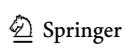

| Table 4 (continued) |                                                                                                                    |          |           |            |               |                                     |                  |                  |
|---------------------|--------------------------------------------------------------------------------------------------------------------|----------|-----------|------------|---------------|-------------------------------------|------------------|------------------|
| Pub.                | Dataset                                                                                                            | Hand     | Sim./Real | #Obj./Sub. | Grasps/Frames | Method                              | Data Type        | Others           |
| ECCV                | ContactPose (Brahmbhatt et al. 2020)                                                                               | MANO     | Real      | 25/50      | M 2306/2.9 | Capture                             | RGBD             | –                |
| ECCV                | GRAB (Taheri et al. 2020)                                                                                          | MANO     | Real      | 51/10      | –/1624K       | MoCap                               | Mesh             | 1334 Seq.        |
| CVPR                | ContactDB (Brahmbhatt et al. 2019)                                                                                 | MANO     | Real      | 50/50      | 3750/375K     | Capture                             | RGBD, thermal | 9 Views          |
| CVPR                | Man (Hasson et al. 2019) Ob                                                                                     | MANO     | Sim.      | 2772/–     | K/– 21     | GraspIt!                            | RGBD             | –                |
| CVPR                | FPHA (Garcia-Hernando et al. 2018)                                                                                 | Skeleton | Real      | 26/6       | –/105K        | Magnetic) Capture(               | RGBD             | 1175 Seq.        |
|                     | Sim represents Simulation, Obj represents objects, Sub represents subjects, Seq represents sequences               |          |           |            |               |                                     |                  |                  |
| (2004)              | * represents that the raw data of this dataset come from OakInk (Yang et al. 2022b). LEAP Hand (Shaw et al. 2023). |          |           |            |               | MANO (Romero et al. 2017). GraspIt! |                  | Miller and Allen |

**300** Page 26 of 44 X. Song et al.

#### 4.2 Evaluation criterion

Based on recent benchmarks, we have categorized the evaluation metrics for dexterous grasping methods into three aspects: grasp quality, grasp diversity, and intent consistency. In Table 5, we have listed most relevant evaluation metrics found in recent literature. It can be observed that the assessment of dexterous grasping typically involves multiple dimensions to ensure the comprehensiveness and accuracy of the evaluation. Specifically, we will introduce the metrics in detail according to the three aspects of grasp quality, grasp diversity, and intent consistency.

**Table 5** Dexterous grasping evaluation criteria

| Publication | Benchmark                                      | Grasp                         | Grasp                                                              | Intent                               |
|-------------|------------------------------------------------|-------------------------------|--------------------------------------------------------------------|--------------------------------------|
|             |                                                | quality                       | diversity                                                          | consistency                          |
| CoRL        | DexGraspNet 2.0 (Zhang et al. 2024)      | SR                            | _                                                                  | _                                    |
| CVPR        | MANUS- Grasps (Pokhariya et al. 2024) | CA                            | _                                                                  | IoU/F1-score/ PSNR/SSIM/ LPIPS |
| CVPR        | S2HGD (Wang et al. 2024b)                | PD/PV (IV)/CR/ GD (SD)  | $\begin{matrix} \sigma_{axis}^2 \\ /\sigma_{angle}^2 \end{matrix}$ | PS                                   |
| ECCV        | GAPGRASP (Li et al. 2024b)               | PD/SIV (IV)/SD             | -                                                                  | MPVPE/ GPT-4/P-FID/ PS         |
| NeurIPS     | DexGYS- Grasp (Wei et al. 2024)          | $Q_1/\mathrm{PD}$             | $\delta_t/\delta_r/\delta_q$                                       | CD/Con.                              |
| IJCAI       | RealDex (Liu et al. 2024)                      | PD/IV/SD                      | -                                                                  | US (PS)                              |
| ICRA        | Grasp'D-1M (Turpin et al. 2023)          | CA/IV/ε/ Vol/SD            | -                                                                  | -                                    |
| ICRA        | MultiDex (Li et al. 2023a)                     | SR                            | $\delta_q$                                                         | _                                    |
| ICRA        | DexGraspNet (Wang et al. 2023)                 | $Q_1/\mathrm{PD}/\mathrm{SR}$ | $H_{mean}$ $/H_{std}$                                              | _                                    |
| CVPR        | UniDexGrasp (Xu et al. 2023a)            | $Q_1/\mathrm{PD}/\mathrm{SR}$ | $\sigma_R/\sigma_k \ /\sigma_{T R} \ /\sigma_{\theta R}$           | _                                    |
| RAL         | DVGG (Wei et al. 2022)                         | PD/PV (IV)/SR              | Coverage Rate                                                   | _                                    |
| ICCV        | GraspTTA (Jiang et al. 2021)                   | PD/PV (IV)/GD (SD)/CR   | -                                                                  | PS                                   |
| RSS         | DDGdata (Liu et al. 2020)                      | $Q_1/\mathrm{PD}/\mathrm{SR}$ | -                                                                  | _                                    |

PD is penetration depth, PV is penetration volume, GD is grasp displacement, CR is Contact Ratio, SR is Success Rate, PS is perceptual score, CA is contact area,  $\epsilon$  is epsilon metric, Vol is grasp wrench space volume metric, SD is simulation displacement, CD is Chamfer distance, Con is Contact distance, MPVPE is Mean Per-Vertex Position Error, IoU is intersection over union, PSNR is peak signal-tonoise ratio, SSIM is structural similarity index, LPIPS is learned perceptual image patch similarity, P-FID calculates the Fréchet Inception Distance between the point clouds of the predicted hand mesh and the ground truth, using the pretrained feature extractor

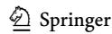

### 4.2.1 Grasp quality

 $Q_1$  (Ferrari and Canny 1992; Xu et al. 2023a) serves as a metric to evaluate the stability of a grasp, defined as the minimal wrench required to disrupt the stability of grasp. This metric is well-defined when the grasp maintains precise contact without penetrating the surface of an object, a criterion that poses significant challenges for vision-based approaches. Consequently, the acceptable contact distance is commonly relaxed to within 1 cm to accommodate practical limitations. Furthermore, if a grasp penetrates the supporting surface (e.g., a table) by more than 1 cm or exceeds an object penetration depth of 5 mm, it is deemed invalid, prompting a manual assignment of its  $Q_1$  value to zero (Wei et al. 2024; Xu et al. 2023a; Wang et al. 2023). Penetration Depth (PD) measures the maximum penetration depth of hand vertices into the object, indicating surface penetration. Penetration Volume (PV) or Intersection Volume (IV) measures the intersection volume of the hand and object. Grasp displacement (GD) or Simulation Displacement (SD) is used to measure the stability of the grasp. The object and generated grasp is put in a simulator, and the simulator calculates the motion of the object under the grasp. The grasp stability is measured by the displacement of the object's center of mass during a period in the simulation. In this period, the pose and location of hands are fixed. The mean and variance of the simulation displacement for all test samples are measured, and examples with smaller simulation displacement have better grasp stability. Contact Ratio (CR) is calculated between the hand and the objects, to demonstrate the contact between the generated hand and the object. Success rate (SR) is a metric used to measure the stability and quality of the generated grasps, commonly utilized in grasping tasks. Others, Contact Area (CA), epsilon metric  $\epsilon$ , and grasp wrench space volume metric (Vol) depend on the distance threshold used for contact generation.

#### 4.2.2 Grasp diversity

Grasping poses typically consist of translation, rotation, and joint angles. Therefore, various metrics such as standard deviations of translation, rotation, and joint angles, mean entropy of joint motion distributions, variance of rotation axes and angles, and variance of keypoints and rotations with fixed conditions are employed to evaluate the diversity of grasping poses generated by different algorithms. For example, Wei et al. (2024) employ the standard deviation of translation  $\delta_t$ , rotation  $\delta_r$  and joint angle  $\delta_q$  of eight samples within same condition to evaluate grasp diversity. Wang et al. (2023) use the mean entropy to model the diversity quantitatively. To evaluate this metric, they first discretize each joint's motion range into 100 bins, then use samples from each dataset to estimate a probability distribution, calculate the entropy of these distributions, and take the mean  $H_{mean}$  and standard deviation  $H_{std}$  over all joints. Xu et al. (2023a) employ the variance of rotation  $\sigma_R$ , keypoints  $\sigma_k$ , translation  $\sigma_{T|R}$  and joint angles with fixed rotation  $\sigma_{\theta|R}$ . Wang et al. (2024b) calculate the variance of the rotation axes  $\sigma_{axis}^2$  and angles  $\sigma_{angle}^2$  for 15 joints, excluding the wrist joint, across all grasp samples.

In addition, Coverage Rate is employed to measure the diversity of the generated grasps and how well they cover the space of positive grasps (Wei et al. 2022). A grasp is considered covered if it is no further than 2 cm away from any grasp in terms of translation distance (Wei et al. 2022).

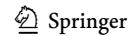

X. Song et al. **300** Page 28 of 44

### **4.2.3 Intent consistency**

Intent consistency refers to the difference between predicted values and true values, and it is often used as a measure of dexterity. In dexterous grasping, the following metrics are commonly used to measure intent consistency. *Chamfer Distance* (CD) is used to measure the distance between predicted hand point clouds and targets. *Contact distance (Con.)* is used to measure the *L*2 distance of object contact map between the prediction and targets. Similarly, *Mean Per-Vertex Position Error* (MPVPE) calculates the average *L*2 distance per vertex between the predicted hand mesh and the ground truth. *GPT-4 assisted evaluation* (GPT-4) is used GPT-4v to score the semantic consistency of the grasp images based on input captions. *P-FID* calculates the Fréchet Inception Distance between the point clouds of the predicted hand mesh and the ground truth, using the pre-trained feature extractor. In addition, *Intersection over Union* (IoU), *F1-score*, Peak Signal-to-Noise Ratio (PSNR), *Structural Similarity Index* (SSIM) and *Learned Perceptual Image Patch Similarity* (LPIPS), widely applied in image generation tasks, are also assessed the quality of grasps estimated. *Perceptual Score* (PS) or *User Score* (US) also assesses the naturalness of grasps and semantic consistency, with 5 (or others) volunteers rating the generated grasps on a 5-point Likert scale (or others). The final score is the mean Likert score.

Last but not least, *Time cost (or inference speed)* (Wei et al. [2022;](#page-41-18) Turpin et al. [2023](#page-41-16); Li et al. [2023a;](#page-38-12) Pokhariya et al. [2024](#page-39-22)) is an important metric for measuring the efficiency of algorithms.

# **5 Results comparisons and analyses**

Currently, research on grasping algorithms has made significant progress. Based on different types of evaluation metrics, we have presented experimental results for grasping quality, grasping diversity, and intention consistency in Tables [6](#page-28-0), [7,](#page-30-0) and [8,](#page-30-1) respectively. In terms of grasping quality, most new algorithms, when compared to GraspTTA, demonstrate notable improvements in Penetration Depth (PD) optimization. This indicates that significant breakthroughs have been made in optimizing grasping poses to reduce penetration into objects. Meanwhile, algorithms proposed in recent years have also made remarkable progress in generating diverse grasping poses, which is crucial for enhancing robots' adaptability in complex environments. However, the field of intention consistency is still in its preliminary stages of exploration and requires further in-depth research. In addition, due to the variations in evaluation metrics and datasets used by different algorithms, it is challenging to provide a unified assessment. Therefore, it is necessary to propose a unified evaluation standard, dataset, and metrics for assessing the effectiveness of algorithms in the future.

Despite the significant achievements made in current research, the study of grasping algorithms still faces numerous challenges. In the future, we need to continue exploring more advanced algorithms and models to improve the success rate and efficiency of grasping tasks. On one hand, we should delve deeper into how to better integrate advanced artificial intelligence technologies such as deep learning and reinforcement learning, in order to enhance the adaptability and robustness of the algorithms. On the other hand, we also need to focus on how to better handle grasping tasks in complex scenarios, such as dealing with objects of different shapes, materials, and weights, as well as achieving stable grasp-

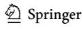

**Table 6** Quality (*Q*1*↑*/PD(*cm*)*↓*/IV(*cm*3)*↓*/SD(*cm*)*↓*) results on different datasets Method/dataset DexGYSNet CAPGRASP View-S2HGD UniDexGrasp DexGraspNet Obman GRAB GraspCVAE (Jiang et al. [2021](#page-37-5)) 0.054/0.551/–/– –/–/–/– –/0.23/13.54/3.10 –/–/–/– –/–/–/– –/–/–/– –/–/–/– GrabNet (Taheri et al. [2020](#page-40-12)) –/–/–/– –/0.49/2.16/1.35 –/–/–/– –/–/–/– –/–/–/– –/–/–/– –/–/–/– DDG (Liu et al. [2020\)](#page-38-9) –/–/–/– –/–/–/– –/–/–/– 0.0223/0.338/–/– 0.0582/0.173/–/– –/–/–/– –/–/–/– Grasping Field (Karunratanakul et al. [2020\)](#page-37-7) –/–/–/– –/–/–/– –/–/–/– –/–/–/– –/–/–/– –/0.94/2.38/0.89 –/–/–/– GraspTTA (Jiang et al. [2021\)](#page-37-5) 0.071/0.188/–/– –/0.58/2.78/1.36 –/–/–/– 0.0239/0.363/–/– 0.0271/0.678/–/– –/0.75/3.65/0.80 –/–/–/– TOCH (Zhou et al. [2022\)](#page-43-4) –/–/–/– –/–/–/– –/–/–/– –/–/–/– –/–/–/– –/–/–/– –/0.537/2.72/– UniDexGrasp (Xu et al. [2023a](#page-42-0)) –/–/–/– –/–/–/– –/–/–/–- 0.0322/0.220/–/– 0.0462/0.121/–/– –/–/–/– –/–/–/– SceneDiffuser (Huang et al. [2023](#page-37-9)) 0.083/0.253/–/– –/–/–/– –/–/–/–- –/–/–/–- 0.0129/0.107/–/– –/–/–/– –/–/–/– DGTR (Xu et al. [2024b\)](#page-41-2) 0.078/0.163/–/– –/–/–/– –/–/–/– –/–/–/–- 0.0515/0.421/–/– –/–/–/– –/–/–/– DexGYSNet (Wei et al. [2024\)](#page-41-4) 0.083/0.223/–/– –/–/–/– –/–/–/– –/–/–/–- –/–/–/– –/–/–/– –/–/–/– SEMGRASP (Li et al. [2024b](#page-38-10)) –/–/–/– –/0.37/1.27/1.90 –/–/–/– –/–/–/–- –/–/–/– –/–/–/– –/–/–/– S2HGrasp (Wang et al. [2024b](#page-41-3)) –/–/–/– –/–/–/– –/0.21/6.58/2.73 –/–/–/–- –/–/–/– –/–/–/– –/–/–/– UGG (Lu et al. [2024](#page-38-7)) –/–/–/– –/–/–/– –/0.21/6.58/2.73 –/–/–/–- 0.063/0.14/–/– –/–/–/– –/–/–/– GrainGrasp (Zhao et al. [2024](#page-43-3)) –/–/–/– –/–/–/– –/–/–/– –/–/–/– –/–/–/– –/0.48/1.79/0.89 –/–/–/– GEARS (Li et al. [2024b\)](#page-38-10) –/–/–/– –/–/–/– –/–/–/– –/–/–/– –/–/–/– –/–/–/– –/0.436/2.24/–

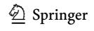

ing under varying lighting and noise conditions. Furthermore, there is a need to strengthen the testing and validation of algorithms in practical applications. By conducting extensive experiments and tests in real-world environments, we can more accurately assess the performance and reliability of the algorithms, providing strong support for their further optimization and improvement.

# **6 Challenges and future directions**

Currently, gripper-based grasping and manipulation tasks are widely applied in the real world, while dexterous hand grasping technologies that are oriented towards reality are relatively rare. The reason lies in the fact that grippers have a simple structure, making algorithm design straightforward, and control strategies among different grippers are alike, with relatively mature data acquisition and synthesis schemes. In contrast, dexterous hands have complex structures, posing challenges for algorithm development, and there are significant differences in degrees of freedom and configurations among different hands, making data acquisition and synthesis challenging. Achieving dexterous grasping in the real world remains an unresolved issue.

### **6.1 Improving grasp generation results**

Although significant progress has been made in dexterous grasp generation methods, the results of the generated grasping poses still leaves room for improvement. Firstly, in terms of encoding structure, most current dexterous grasping methods employ general architectures like PointNet or PointNet++ for visual encoding. These architectures are not specifically designed for solving dexterous grasping problems, leaving room for improvement in incorporating prior knowledge specific to the domain (such as object structure, auxiliary information, *etc.*). Secondly, when evaluating the quality of grasp generation, human rating is the most suitable method. However, it is impractical to manually review all the dexterous grasping poses generated by different methods. While human ratings provide qualitative insights, other commonly used quantitative evaluation metrics may not intuitively reflect the generation effectiveness. Developing appropriate evaluation metrics is not only crucial for the evaluation process but also essential for designing effective loss functions to enhance the model's generative capabilities. Therefore, proposing suitable and specific evaluation metrics for each task is vital for advancing research in human-like image generation. Furthermore, improving dexterity relies on real dexterous grasping datasets. Currently, largescale dexterous grasping data is primarily synthetic, and there is an urgent need to establish more large-scale, high-quality datasets tailored to specific grasping pose generation tasks.

Additionally, as discussed in Sect. [4.2](#page-25-1), evaluating the results of grasp generation encompasses three main metrics: quality, diversity, and intent consistency. Currently, most methods primarily focus on grasp quality, failing to fully leverage the potential of dexterous hands, similar to human hands. Some researches (Wu et al. [2023;](#page-41-19) Zhang et al. [2023](#page-42-7); Agarwal et al. [2023](#page-34-6); Hang et al. [2024](#page-36-18)) have focused on the dexterity of grasping, to generate grasps based on specific tasks or object functionalities. Task-oriented or functional grasping is an important research direction in robotics, requiring robots to not only grasp objects accurately but also to execute grasping operations with specific functions or purposes. How-

**Table 7** Diversity ( *σR↑*/*σk↑*/*δt↑*/*δr↑*/ *δq↑*) results on different datasets

| Method/dataset                | DexGYSNet       | View-S2HGD      | UniDexGrasp      | DexGraspNet     |
|-------------------------------|-----------------|-----------------|------------------|-----------------|
| GraspCVAE (Jiang et al. 2021) | –/–             | 0.85/3.29/–/–/– | –/–/–/–/–        | –/–/–/–/–       |
|                               | /0.18/1.76/0.18 |                 |                  |                 |
| DDG (Liu et al. 2020)         | –/–/–/–/–       | –/–/–/–/–       | 0.00/0.00/–/–/–  | –/–             |
|                               |                 |                 |                  | /6.25/6.25/6.25 |
| GraspTTA (Jiang et al. 2021)  | –/–             | –/–/–/–/–       | 4.90/2.91/–/–/–  | –/–             |
|                               | /2.11/6.15/3.87 |                 |                  | /8.09/7.53/7.90 |
| UniDexGrasp (Xu et al. 2023a) | –/–/–/–/–       | –/–/–/–/–       | 127.6/6.39/–/–/– | –/–             |
|                               |                 |                 |                  | /9.64/7.49/29.3 |
| SceneDiffuser (Huang et al.   | –/–             | –/–/–/–/–       | –/–/–/–/–        | –/–             |
| 2023)                         | /0.36/3.46/0.39 |                 |                  | /54.8/52.3/39.8 |
| DGTR (Xu et al. 2024b)        | –/–             | –/–/–/–/–       | –/–/–/–/–        | –/–             |
|                               | /2.04/14.0/4.30 |                 |                  | /47.8/51.7/27.8 |
| DexGYSNet (Wei et al. 2024)   | –/–             | –/–/–/–/–       | –/–/–/–/–        | –/–/–/–/–       |
|                               | /6.12/55.7/6.12 |                 |                  |                 |
| S2HGrasp (Wang et al. 2024b)  | –/–/–/–/–       | 1.03/4.51/–/–/– | –/–/–/–/–        | –/–/–/–/–       |

**Table 8** Intent consistency (MPVPE*↓*/CD*↓*/*Con. ↓*) results on different datasets

| Method/dataset                          | DexGYSNet   | CAPGRASP | RealDex  | GRAB         |
|-----------------------------------------|-------------|----------|----------|--------------|
| GraspCVAE (Jiang et al. 2021)     | –/3.14/0.10 | –/–/–    | –/–/–    | –/–/–        |
| GrabNet(Taheri et al. 2020)          | –/–/–       | 27.2/–/– | –/–/–    | –/–/–        |
| GraspTTA (Jiang et al. 2021)      | –/12.2/0.11 | 33.8/–/– | –/–/–    | –/–/–        |
| SAGA (Wu et al. 2022)                | –/–/–       | –/–/–    | 1.84/–/– | 1.07/– /– |
| GOAL (Taheri et al. 2022)            | –/–/–       | –/–/–    | 0.72/–/– | 0.68/– /– |
| TOCH (Zhou et al. 2022)              | –/–/–       | –/–/–    | –/–/–    | 0.82/– /– |
| SceneDiffuser (Huang et al. 2023) | –/1.68/0.05 | –/–/–    | –/–/–    | –/–/–        |
| DGTR (Xu et al. 2024b)               | –/2.90/0.08 | –/–/–    | –/–/–    | –/–/–        |
| DexGYSNet (Wei et al. 2024)       | –/1.20/0.04 | –/–/–    | –/–/–    | –/–/–        |
| SEMGRASP (Li et al. 2024b)           | –/–/–       | 23.6/–/– | –/–/–    | –/–/–        |
| RealDex (Liu et al. 2024)            | –/–/–       | –/–/–    | 0.72/–/– | 0.67/– /– |
| GEARS (Li et al. 2024b)              | –/–/–       | –/–/–    | –/–/–    | 0.72/– /– |

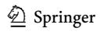

ever, these methods often rely on predefined, fixed, and limited tasks or functions, which restricts their flexibility and hinders natural human-robot interaction. To address this, recent methods (Wei et al. [2024](#page-41-4); Li et al. [2024b](#page-38-10), [2025\)](#page-38-18) can produce dexterous grasps based on human language, enhancing natural human-robot interaction. The datasets with good alignment between language and grasping are very scarce, thus it is necessary to establish a human-level, multi-modal, large-scale, high-quality dataset.

# **6.2 Bridging the domain gap**

Domain Shift is prevalent in the real-world application of data-driven methods, including dexterous grasping technologies (Huber et al. [2024\)](#page-37-1). It means the trained model cannot perform satisfactorily when encountering the testing data with totally different domains from the ones in training. Therefore, learning to bridge the huge domain gap among different data has become one of the key problems to be solved for facilitating its applications.

Recent work has relied on a physics engine to simulate grasping interactions, but these efforts have primarily focused on a specific type of gripper and lack extensive experimental analysis for sim2real transfer. For example, Huber et al. [\(2023](#page-37-21)) demonstrate that the Quality-Diversity method can generate diverse and efficient datasets of grasping trajectories for different types of grippers. Huber et al. ([2024\)](#page-37-1) further validate that domain randomization can be leveraged to make the generated grasping more robust for sim2real transfer. The data used for training and testing consistently exhibited the same distribution characteristics, i.e., within the same domain, ensuring consistent performance when testing the trained model in application. One the other hand, pre-trained vision-and-language models (Wang et al. [2023](#page-41-21)) have attracted much attention in recent years since they have seen enormous data domains and had better generalization capacities by containing general knowledge, which could help deal with the domain shift problem. Some solutions have incorporated these pre-trained models by simple full fine-tuning, which may incur heavy training costs and influence the knowledge contained in pre-trained weights. In the future, the prompt learning strategy (Baidoo-Anu and Ansah [2023](#page-34-11)) presents a promising research direction for effectively transferring knowledge from pre-trained domains to pedestrian-related domains without significantly undermining the general knowledge. By introducing lightweight learnable prompts for better adaptation, this strategy can achieve effective transfer while requiring minimal additional computational costs.

### **6.3 Promoting computational efficiency**

Current solutions for dexterous grasping primarily focus on improving stability and precision (Liu et al. [2024;](#page-38-1) Wang et al. [2023](#page-41-15)), yet they somewhat overlook the significance of computational efficiency. However, as technology continues to advance, dexterous grasping will play a pivotal role in various practical scenarios such as industrial manufacturing and warehousing logistics. At that point, computational efficiency will emerge as a crucial factor limiting the application of the technology. When confronted with large-scale image or video data, the slow generation and execution of grasps, coupled with significant storage requirements, will severely hinder the efficient operation of the system, thereby affecting its practical utility.

To address this challenge, we can draw inspiration from research findings in related fields. In the fields of computer vision, knowledge distillation (Gou et al. [2021](#page-36-20); Wang and Yoon [2021](#page-41-22)) and model compression (Choudhary et al. [2020\)](#page-35-20) techniques have demonstrated remarkable results. Knowledge distillation involves extracting key information from a large model (the teacher model) and transferring it to a smaller model (the student model), thereby reducing computational complexity while maintaining performance. Model compression, on the other hand, further enhances computational efficiency by decreasing model parameters and complexity. For dexterous grasping tasks, we could attempt to apply knowledge distillation techniques to optimize the grasping model. By training a lightweight student model to imitate the grasping strategies of a complex teacher model, we can potentially maintain a certain level of grasping performance while significantly reducing computational costs. Furthermore, model compression techniques are also applicable to dexterous grasping, enabling reductions in storage requirements and computational burdens, making it more suitable for resource-constrained environments. Additionally, the embodied cerebellar model holds significant potential in enhancing the execution efficiency of dexterous grasping. Through ensemble learning methods (Dong et al. [2020](#page-35-21)), such as multi-model voting, combined with the robot's body structure and environmental characteristics, a reasonable model control algorithm can be selected. The embodied cerebellar model ensures that the robot can complete high-dynamic, high-frequency, and robust planning and control actions while understanding its own body constraints, thereby meeting the demands for fine manipulation and real-time control of intelligent robots in real-world scenarios.

In summary, enhancing computational efficiency and reducing storage expenses are critical issues currently facing dexterous grasping technology. By learning from research achievements in related fields and combining the characteristics of dexterous grasping tasks, we can explore more efficient and practical solutions. This will not only helps propel dexterous grasping technology towards broader application areas but also provide powerful support for the intelligent transformation of industries.

### **6.4 Heterogeneous dexterous grasping**

Efficiently integrating data input from both visual and tactile sensors to significantly enhance the precision and stability of grasping, especially when dealing with objects of complex shapes and diverse materials, has emerged as a critical challenge in technological advancement (Li et al. [2024d](#page-38-2); Suresh et al. [2024](#page-40-19)). This issue not only focuses on optimizing algorithm performance and real-time processing capabilities in complex environments but also places stringent requirements on the stability and reliability of grasping outcomes. Therefore, deeply exploring and developing algorithms capable of effectively fusing visual and tactile information is of great significance in advancing the practical application of dexterous grasping technology (Mao et al. [2024;](#page-39-24) Xu et al. [2023b\)](#page-42-18). Especially in situations where objects are obstructed or in dynamic change, tactile sensing Zhang et al. ([2022\)](#page-42-19); Do et al. [\(2024](#page-35-22)), as a means of close-range perception, can compensate for the deficiencies of visual information. For instance, the DelTact sensor, introduced in (Zhang et al. [2022\)](#page-42-19), achieves the integration of visual and tactile data through the utilization of dense color patterns, thereby providing robots with a more comprehensive perception dimension. The PoseFusion method, as described in (Tu et al. [2023](#page-40-20)), amalgamates visual and tactile information to generate multiple candidate poses for objects and employs the SelectLSTM

X. Song et al. **300** Page 34 of 44

network to filter and identify the optimal pose. This innovation not only transcends the constraints of single modalities but also substantially enhances the precision and robustness of pose estimation. Moreover, the research presented in (Tu et al. [2023\)](#page-40-20) elucidates the methodology for leveraging graph convolutional networks and distributed tactile sensors to accomplish multi-finger dexterous manipulation, thereby further augmenting robots' proficiency in manipulating intricate objects. These research accomplishments not only propel the advancement of tactile sensing technology but also forge new pathways in the domains of robot dexterous grasping and object manipulation.

Overall, the fusion of vision and touch has brought revolutionary progress to robot dexterous grasping technology. By integrating information from different perception channels, robots can perceive and manipulate objects more accurately, achieving efficient and stable grasping tasks in complex and ever-changing environments. The continuous exploration and innovation in this field will inject new vitality into the development of robot technology and promote its application and popularization in more practical scenarios.

### **6.5 Exploring complex grasping tasks**

Currently, the majority of research on dexterous grasping has been directed towards single-target rigid object grasping (Newbury et al. [2023\)](#page-39-2). However, in real-world scenarios, grasping tasks are far more diverse and complex, encompassing various challenges such as handling lager objects (Shao and Xiao [2024](#page-40-11)), soft or deformable objects (Sun et al. [2024](#page-40-21)), living objects (Hu et al. [2023,](#page-36-21) [2021\)](#page-36-22), multi-object grasping (Li et al. [2024a;](#page-38-19) Chen and Sun [2024;](#page-35-23) Sun et al. [2022\)](#page-40-22) where interactions between objects must be considered, and dynamic grasping in unpredictable environments. The investigation of these complex grasping tasks is imperative, as they hold immense potential and significant research value for advancing humanoid robotics.

However, a critical shortage of relevant datasets and methodologies poses a significant obstacle. The lack of comprehensive datasets that represent the diversity and complexity of real-world grasping tasks hinders the development and validation of advanced algorithms. Similarly, the scarcity of effective methodologies for addressing these complex grasping challenges further slows down the pace of innovation. Therefore, to drive the progress of humanoid robotics technology, it is essential to intensify research efforts on complex grasping tasks and develop new datasets and methodologies to tackle these challenges. This will significantly boost the development of dexterous grasping technology, enabling humanoid robots to perform a broader range of tasks with greater proficiency and flexibility.

# **7 Conclusion**

In this paper, we have comprehensively summarized the recent research advancements in learning-based dexterous grasping tasks. Firstly, we briefly categorize the typical field into two perspectives: grasp generation and grasp execution, and conduct detailed comparisons and analysis of the research focuses with these two categories. Subsequently, we elaborate on the recently proposed benchmarks and criteria, and conduct a comparative analysis of the current SOTA solutions based on these benchmarks. Lastly, we have presented several possible future research directions to facilitate the practical applications of dexterous grasping.

Overall, this paper could greatly assist researchers in quickly understanding recent progress and future developments in learning-based dexterous grasping technology.

**Acknowledgements** This work is jointly supported by National Key Research and Development Program of China (2024YFB4711100) and the National Natural Science Foundation of China (52205035).

**Author contributions** Xu Song and Yongyao Li wrote the mian manuscript text. All authors reviewed the manuscript.

**Data availability** No datasets were generated or analysed during the current study.

### **Declarations**

**Competing interests** The authors declare no competing interests.

**Open Access** This article is licensed under a Creative Commons Attribution-NonCommercial-NoDerivatives 4.0 International License, which permits any non-commercial use, sharing, distribution and reproduction in any medium or format, as long as you give appropriate credit to the original author(s) and the source, provide a link to the Creative Commons licence, and indicate if you modified the licensed material. You do not have permission under this licence to share adapted material derived from this article or parts of it. The images or other third party material in this article are included in the article's Creative Commons licence, unless indicated otherwise in a credit line to the material. If material is not included in the article's Creative Commons licence and your intended use is not permitted by statutory regulation or exceeds the permitted use, you will need to obtain permission directly from the copyright holder. To view a copy of this licence, visit [h](http://creativecommons.org/licenses/by-nc-nd/4.0/) [ttp://creativecommons.org/licenses/by-nc-nd/4.0/.](http://creativecommons.org/licenses/by-nc-nd/4.0/)

# **References**

- Agarwal A, Uppal S, Shaw K, Pathak D (2023) Dexterous functional grasping. [https://arxiv.org/abs/2312.0](https://arxiv.org/abs/2312.02975) [2975](https://arxiv.org/abs/2312.02975)
- Baidoo-Anu D, Ansah LO (2023) Education in the era of generative artificial intelligence (ai): understanding the potential benefits of chatgpt in promoting teaching and learning. J AI 7(1):52–62
- Batzolis G, Stanczuk J, Schonlieb C-B, Etmann C (2021) Conditional image generation with score-based diffusion models. ArXiv **abs/2111.13606**
- Bicchi A, Kumar V (2000) Robotic grasping and contact: a review. In: Proceedings 2000 ICRA. Millennium Conference. IEEE International conference on robotics and automation. Symposia Proceedings (Cat. No.00CH37065), 1, 348–3531.<https://doi.org/10.1109/ROBOT.2000.844081>
- Billard A, Kragic D (2019) Trends and challenges in robot manipulation. Science 364:1149. [https://doi.org/](https://doi.org/10.1126/science.aat8414) [10.1126/science.aat8414](https://doi.org/10.1126/science.aat8414)
- Bohg J, Morales A, Asfour T, Kragic D (2014) Data-driven grasp synthesis-a survey. IEEE Trans Rob 30(2):289–309.<https://doi.org/10.1109/TRO.2013.2289018>
- Brahmbhatt S, Ham C, Kemp CC, Hays J (2019) Contactdb: analyzing and predicting grasp contact via thermal imaging. In: Proceedings of the IEEE/CVF conference on computer vision and pattern recognition (CVPR)
- Brahmbhatt S, Tang C, Twigg CD, Kemp CC, Hays J (2020) Contactpose: a dataset of grasps with object contact and hand pose. In: Computer vision – ECCV 2020. Springer, Cham, pp. 361–378
- Buss M, Hashimoto H, Moore JB (1996) Dextrous hand grasping force optimization. IEEE Trans Robot Autom 12(3):406–418. <https://doi.org/10.1109/70.499823>
- Cao Y, Li S, Liu Y, Yan Z, Dai Y, Yu PS, Sun L (2023) A comprehensive survey of ai-generated content (aigc): a history of generative ai from gan to chatgpt. ArXiv **abs/2303.04226**
- Casas LF, Khargonkar N, Prabhakaran B, Xiang Y (2024) Multigrippergrasp: a dataset for robotic grasping from parallel jaw grippers to dexterous hands. In: 2024 IEEE/RSJ international conference on intelligent robots and systems (IROS), pp. 2978–2984.<https://doi.org/10.1109/IROS58592.2024.10801708>
- Ceola F, Rosasco L, Natale L (2024) Resprect: speeding-up multi-fingered grasping with residual reinforcement learning. IEEE Robot Autom Lett 9(4):3045–3052.<https://doi.org/10.1109/LRA.2024.3363532>

X. Song et al. **300** Page 36 of 44

Ceola F, Maiettini E, Rosasco L, Natale L (2023) A grasp pose is all you need: learning multi-fingered grasping with deep reinforcement learning from vision and touch. In: 2023 IEEE/RSJ international conference on intelligent robots and systems (IROS), pp. 2985–2992. [https://doi.org/10.1109/IROS55552.20](https://doi.org/10.1109/IROS55552.2023.10341776) [23.10341776](https://doi.org/10.1109/IROS55552.2023.10341776)

- Cha J, Kim J, Yoon JS, Baek S (2024) Text2hoi: text-guided 3d motion generation for hand-object interaction. In: 2024 IEEE/CVF conference on computer vision and pattern recognition (CVPR), pp. 1577– 1585. <https://doi.org/10.1109/CVPR52733.2024.00156>
- Chao Y-W, Yang W, Xiang Y, Molchanov P, Handa A, Tremblay J, Narang YS, Van Wyk K, Iqbal U, Birchfield S, Kautz J, Fox D (2021) Dexycb: a benchmark for capturing hand grasping of objects. In: Proceedings of the IEEE/CVF conference on computer vision and pattern recognition (CVPR), pp. 9044–9053
- Chen T, Sun Y (2024) Multi-object grasping-experience forest for robotic finger movement strategies. IEEE Robot Autom Lett 9(6):5222–5229. <https://doi.org/10.1109/LRA.2024.3389815>
- Chen J, Chen Y, Zhang J, Wang H (2020) Task-oriented dexterous hand pose synthesis using differentiable grasp wrench boundary estimator. In: 2024 IEEE/RSJ International conference on intelligent robots and systems (IROS), pp. 5281–5288. <https://doi.org/10.1109/IROS58592.2024.10802652>
- Chen Y, Wang C, Yang Y, Liu K (2024) Object-centric dexterous manipulation from human motion data. In: 8th Conference on robot learning (CoRL)
- Chen Q, Wyk KV, Chao Y-W, Yang W, Mousavian A, Gupta A, Fox D (2022) Learning robust real-world dexterous grasping policies via implicit shape augmentation. In: 6th Conference on robot learning
- Choudhary T, Mishra V, Goswami A, Sarangapani J (2020) A comprehensive survey on model compression and acceleration. Artif Intell Rev 53:5113–5155
- Christen S, Kocabas M, Aksan E, Hwangbo J, Song J, Hilliges O (2022) D-grasp: Physically plausible dynamic grasp synthesis for hand-object interactions. In: Proceedings of the IEEE/CVF conference on computer vision and pattern recognition, pp. 20577–20586
- Cini F, Ortenzi V, Corke P, Controzzi M (2019) On the choice of grasp type and location when handing over an object. Sci Robot 4(27):9757.<https://doi.org/10.1126/scirobotics.aau9757>
- Corona E, Pumarola A, Alenyà G, Moreno-Noguer F, Rogez G (2020) Ganhand: Predicting human grasp affordances in multi-object scenes. In: 2020 IEEE/CVF conference on computer vision and pattern recognition (CVPR), pp. 5030–5040.<https://doi.org/10.1109/CVPR42600.2020.00508>
- Cui Y, Ye Q, Liu Q, Chen A, Li G, Chen J (2024) Interrep: a visual interaction representation for robotic grasping. In: 2024 IEEE international conference on robotics and automation (ICRA), pp. 6448–6454. <https://doi.org/10.1109/ICRA57147.2024.10610870>
- Dai H, Majumdar A, Tedrake R (2018) Synthesis and optimization of force closure grasps via sequential semidefinite programming. Robot Res 1:285–305
- Dai Q, Zhu Y, Geng Y, Ruan C, Zhang J, Wang H (2023) Graspnerf: Multiview-based 6-dof grasp detection for transparent and specular objects using generalizable nerf. In: 2023 IEEE international conference on robotics and automation (ICRA), pp. 1757–1763. <https://doi.org/10.1109/ICRA48891.2023.10160842>
- Dasari S, Gupta A, Kumar V (2023) Learning dexterous manipulation from exemplar object trajectories and pre-grasps. In: 2023 IEEE international conference on robotics and automation (ICRA), pp. 3889–3896. <https://doi.org/10.1109/ICRA48891.2023.10161147>
- Deng Z, Fang B, He B, Zhang J (2021) An adaptive planning framework for dexterous robotic grasping with grasp type detection. Robot Auton Syst 140:103727. <https://doi.org/10.1016/j.robot.2021.103727>
- Dimou D, Santos-Victor J, Moreno P (2021) Learning conditional postural synergies for dexterous hands: a generative approach based on variational auto-encoders and conditioned on object size and category. In: 2021 IEEE international conference on robotics and automation (ICRA), pp. 4710–4716. [https://doi.or](https://doi.org/10.1109/ICRA48506.2021.9560818) [g/10.1109/ICRA48506.2021.9560818](https://doi.org/10.1109/ICRA48506.2021.9560818)
- Dinh L, Krueger D, Bengio Y (2014) Nice: Non-linear independent components estimation. [arXiv: Learning](http://arxiv.org/abs/Learning) Dinh L, Sohl-Dickstein JN, Bengio S (2016) Density estimation using real nvp. ArXiv **abs/1605.08803**
- Do WK, Kundan Dhawan A, Kitzmann M, Kennedy M (2024) Densetact-mini: an optical tactile sensor for grasping multi-scale objects from flat surfaces. In: 2024 IEEE international conference on robotics and automation (ICRA), pp. 6928–6934.<https://doi.org/10.1109/ICRA57147.2024.10610583>
- Dong X, Yu Z, Cao W, Shi Y, Ma Q (2020) A survey on ensemble learning. Front Comp Sci 14:241–258
- Du G, Wang K, Lian S, Zhao K (2021) Vision-based robotic grasping from object localization, object pose estimation to grasp estimation for parallel grippers: a review. Artif Intell Rev 54(3):1677–1734. [https://](https://doi.org/10.1007/s10462-020-09888-5) [doi.org/10.1007/s10462-020-09888-5](https://doi.org/10.1007/s10462-020-09888-5)
- Falorsi L, Haan P, Davidson TR, Forré P (2019) Reparameterizing distributions on lie groups. In: International conference on artificial intelligence and statistics
- Fang H-S, Wang C, Gou M, Lu C (2020) Graspnet-1billion: a large-scale benchmark for general object grasping. In: 2020 IEEE/CVF conference on computer vision and pattern recognition (CVPR), pp. 11441–11450. <https://doi.org/10.1109/CVPR42600.2020.01146>

- Fang H, Fang H-S, Xu S, Lu C (2022) Transcg: a large-scale real-world dataset for transparent object depth completion and a grasping baseline. IEEE Robot Autom Lett 7(3):7383–7390. [https://doi.org/10.1109](https://doi.org/10.1109/LRA.2022.3183256) [/LRA.2022.3183256](https://doi.org/10.1109/LRA.2022.3183256)
- Fan Z, Taheri O, Tzionas D, Kocabas M, Kaufmann M, Black MJ, Hilliges O (2022) Articulated objects in free-form hand interaction. ArXiv **abs/2204.13662**
- Fan Z, Taheri O, Tzionas D, Kocabas M, Kaufmann M, Black MJ, Hilliges O (2023) Arctic: a dataset for dexterous bimanual hand-object manipulation. In: 2023 IEEE/CVF conference on computer vision and pattern recognition (CVPR), pp. 12943–12954. <https://doi.org/10.1109/CVPR52729.2023.01244>
- Feix T, Romero J, Schmiedmayer H-B, Dollar AM, Kragic D (2016) The grasp taxonomy of human grasp types. IEEE Trans Human-Mach Syst 46(1):66–77. <https://doi.org/10.1109/THMS.2015.2470657>
- Ferrari C, Canny J (1992) Planning optimal grasps. In: Proceedings 1992 IEEE international conference on robotics and automation, pp. 2290–22953.<https://doi.org/10.1109/ROBOT.1992.219918>
- Ficuciello F, Migliozzi A, Laudante G, Falco P, Siciliano B (2019) Vision-based grasp learning of an anthropomorphic hand-arm system in a synergy-based control framework. Sci Robot 4(26):4900. [https://doi.](https://doi.org/10.1126/scirobotics.aao4900) [org/10.1126/scirobotics.aao4900](https://doi.org/10.1126/scirobotics.aao4900)
- Garcia-Hernando G, Yuan S, Baek S, Kim T-K (2018) First-person hand action benchmark with rgb-d videos and 3d hand pose annotations. In: 2018 IEEE/CVF conference on computer vision and pattern recognition, pp. 409–419. <https://doi.org/10.1109/CVPR.2018.00050>
- Ghazaei G, Alameer A, Degenaar P, Morgan G, Nazarpour K (2017) Deep learning-based artificial vision for grasp classification in myoelectric hands. J Neural Eng 14(3):036025. [https://doi.org/10.1088/174](https://doi.org/10.1088/1741-2552/aa6802) [1-2552/aa6802](https://doi.org/10.1088/1741-2552/aa6802)
- Ghazaei G, Tombari F, Navab N, Nazarpour K (2019) Grasp type estimation for myoelectric prostheses using point cloud feature learning. arXiv preprint [arXiv:1908.02564](http://arxiv.org/abs/1908.02564)
- Goldfeder C, Ciocarlie M, Dang H, Allen PK (2009) The columbia grasp database. In: 2009 IEEE international conference on robotics and automation, pp. 1710–1716.<https://doi.org/10.1109/ROBOT.2009.5152709>
- Gou J, Yu B, Maybank SJ, Tao D (2021) Knowledge distillation: a survey. Int J Comput Vis 129(6):1789–1819 Grady P, Tang C, Twigg CD, Vo M, Brahmbhatt S, Kemp CC (2021) Contactopt: optimizing contact to improve grasps. In: 2021 IEEE/CVF conference on computer vision and pattern recognition (CVPR), pp. 1471–1481. <https://doi.org/10.1109/CVPR46437.2021.00152>
- Hampali S, Rad M, Oberweger M, Lepetit V (2020) Honnotate: A method for 3d annotation of hand and object poses. In: Proceedings of the IEEE/CVF conference on computer vision and pattern recognition (CVPR)
- Hampali S, Sarkar SD, Rad M, Lepetit V (2022) Keypoint transformer: solving joint identification in challenging hands and object interactions for accurate 3d pose estimation. 2022 IEEE/CVF conference on computer vision and pattern recognition (CVPR), 11080–11090
- Hang J, Lin X, Zhu T, Li X, Wu R, Ma X, Sun Y (2024) Dexfuncgrasp: A robotic dexterous functional grasp dataset constructed from a cost-effective real-simulation annotation system. Proc AAAI Conf Artif Intell 38:10306–10313
- Hasson Y, Varol G, Tzionas D, Kalevatykh I, Black MJ, Laptev I, Schmid C (2019) Learning joint reconstruction of hands and manipulated objects. In: 2019 IEEE/cvf conference on computer vision and pattern recognition (CVPR), pp. 11799–11808. <https://doi.org/10.1109/CVPR.2019.01208>
- Heo S-H, Park H-S (2024) Proximity perception-based grasping intelligence: toward the seamless control of a dexterous prosthetic hand. IEEE/ASME Trans Mechatron 29(3):2079–2090. [https://doi.org/10.1109/](https://doi.org/10.1109/TMECH.2023.3324051) [TMECH.2023.3324051](https://doi.org/10.1109/TMECH.2023.3324051)
- Hidalgo-Carvajal D, Chen H, Bettelani GC, Jung J, Zavaglia M, Busse L, Naceri A, Leutenegger S, Haddadin S (2023) Anthropomorphic grasping with neural object shape completion. IEEE Robot Autom Lett 8(12):8034–8041. <https://doi.org/10.1109/LRA.2023.3322086>
- Higashi K, Koyama K, Ozawa R, Nagata K, Wan W, Harada K (2020) Functionally divided manipulation synergy for controlling multi-fingered hands. In: 2020 IEEE/RSJ international conference on intelligent robots and systems (IROS), pp. 9190–9197.<https://doi.org/10.1109/IROS45743.2020.9341766>
- Hodson R (2018) A gripping problem: designing machines that can grasp and manipulate objects with anything approaching human levels of dexterity is first on the to-do list for robotics. Nature
- Ho J, Jain A, Abbeel P (2020) Denoising diffusion probabilistic models. In: Proceedings of the 34th international conference on neural information processing systems. NIPS '20. Curran Associates Inc., Red Hook, NY, USA
- Hu Z, Zheng Y, Pan J (2021) Living object grasping using two-stage graph reinforcement learning. IEEE Robot Autom Lett 6(2):1950–1957. <https://doi.org/10.1109/LRA.2021.3060636>
- Hu Z, Zheng Y, Pan J (2023) Grasping living objects with adversarial behaviors using inverse reinforcement learning. IEEE Trans Rob 39(2):1151–1163.<https://doi.org/10.1109/TRO.2022.3226108>

X. Song et al. **300** Page 38 of 44

Huang S, Wang Z, Li P, Jia B, Liu T, Zhu Y, Liang W, Zhu S-C (2023) Diffusion-based generation, optimization, and planning in 3d scenes. In: 2023 IEEE/CVF conference on computer vision and pattern recognition (CVPR), pp. 16750–16761.<https://doi.org/10.1109/CVPR52729.2023.01607>

- Huang L, Zhang H, Wu Z, Christen S, Song J (2024) FunGrasp: functional grasping for diverse dexterous hands. arXiv preprint [arXiv:2411.16755](http://arxiv.org/abs/2411.16755)
- Huber J, Hélénon F, Coninx M, Amar FB, Doncieux S (2023) Quality diversity under sparse reward and sparse interaction: Application to grasping in robotics. arXiv preprint [arXiv:2308.05483](http://arxiv.org/abs/2308.05483)
- Huber J, Hélénon F, Watrelot H, Amar FB, Doncieux S (2024) Domain randomization for sim2real transfer of automatically generated grasping datasets. In: 2024 IEEE international conference on robotics and automation (ICRA), pp. 4112–4118. <https://doi.org/10.1109/ICRA57147.2024.10610677>
- Hu Y, Li K, Wei N (2022) Learn to grasp objects with dexterous robot manipulator from human demonstration. In: 2022 International conference on advanced robotics and mechatronics (ICARM), pp. 1062– 1067. <https://doi.org/10.1109/ICARM54641.2022.9959710>
- Hundhausen F, Megerle D, Asfour T (2019) Resource-aware object classification and segmentation for semiautonomous grasping with prosthetic hands. In: 2019 IEEE-RAS 19th international conference on humanoid robots (Humanoids), pp. 215–221. <https://doi.org/10.1109/Humanoids43949.2019.9035054>
- Janson L, Pavone M (2016) In: Inaba, M., Corke, P. (eds.) Fast Marching trees: a fast marching samplingbased method for optimal motion planning in many dimensions, pp. 667–684. Springer, Cham. [https://](https://doi.org/10.1007/978-3-319-28872-7_38) [doi.org/10.1007/978-3-319-28872-7\\_38](https://doi.org/10.1007/978-3-319-28872-7_38)
- Jiang H, Liu S, Wang J, Wang X (2021) Hand-object contact consistency reasoning for human grasps generation. In: Proceedings of the IEEE/CVF international conference on computer vision, pp. 11107–11116
- Jian J, Liu X, Li M, Hu R, Liu J (2023) Affordpose: A large-scale dataset of hand-object interactions with affordance-driven hand pose. In: 2023 IEEE/CVF international conference on computer vision (ICCV), pp. 14667–14678. <https://doi.org/10.1109/ICCV51070.2023.01352>
- Kaboli M, Yao K, Cheng G (2016) Tactile-based manipulation of deformable objects with dynamic center of mass. In: 2016 IEEE-RAS 16th international conference on humanoid robots (Humanoids), pp. 752–757. <https://doi.org/10.1109/HUMANOIDS.2016.7803358>
- Kannan A, Shaw K, Bahl S, Mannam P, Pathak D (2023) Deft: dexterous fine-tuning for real-world hand policies. In: 7th Conference on robot learning (CoRL)
- Karunratanakul K, Yang J, Zhang Y, Black MJ, Muandet K, Tang S (2020) Grasping field: learning implicit representations for human grasps. In: 2020 International conference on 3D vision (3DV), pp. 333–344. <https://doi.org/10.1109/3DV50981.2020.00043>
- Kavraki LE, Svestka P, Latombe J-C, Overmars MH (1996) Probabilistic roadmaps for path planning in high-dimensional configuration spaces. IEEE Trans Robot Autom 12(4):566–580. [https://doi.org/10.1](https://doi.org/10.1109/70.508439) [109/70.508439](https://doi.org/10.1109/70.508439)
- Khargonkar N, Song N, Xu Z, Prabhakaran B, Xiang Y (2022) Neuralgrasps: Learning implicit representations for grasps of multiple robotic hands. In: Conference on robot learning
- Kingma DP, Dhariwal P (2018) Glow: generative flow with invertible 1*×*1 convolutions. In: Proceedings of the 32nd international conference on neural information processing systems. NIPS'18, pp. 10236– 10245. Curran Associates Inc., Red Hook, NY, USA
- Kopicki M, Detry R, Adjigble M, Stolkin R, Leonardis A, Wyatt JL (2016) One-shot learning and generation of dexterous grasps for novel objects. Int J Rob Res 35(8):959–976. [https://doi.org/10.1177/02783649](https://doi.org/10.1177/0278364915594244) [15594244](https://doi.org/10.1177/0278364915594244)
- Kwon T, Tekin B, Stühmer J, Bogo F, Pollefeys M (2021) H2o: Two hands manipulating objects for first person interaction recognition. In: 2021 IEEE/CVF international conference on computer vision (ICCV), pp. 10118–10128. <https://doi.org/10.1109/ICCV48922.2021.00998>
- Lee MA, Zhu Y, Srinivasan K, Shah P, Savarese S, Fei-Fei L, Garg A, Bohg J (2019) Making sense of vision and touch: self-supervised learning of multimodal representations for contact-rich tasks. In: 2019 International conference on robotics and automation (ICRA), pp. 8943–8950. [https://doi.org/10.1109/ICR](https://doi.org/10.1109/ICRA.2019.8793485) [A.2019.8793485](https://doi.org/10.1109/ICRA.2019.8793485)
- Lepora NF, Ford C, Stinchcombe A, Brown A, Lloyd J, Catalano MG, Bianchi M, Ward-Cherrier B (2021) Towards integrated tactile sensorimotor control in anthropomorphic soft robotic hands. In: 2021 IEEE international conference on robotics and automation (ICRA), pp. 1622–1628. [https://doi.org/10.1109/I](https://doi.org/10.1109/ICRA48506.2021.9561350) [CRA48506.2021.9561350](https://doi.org/10.1109/ICRA48506.2021.9561350)
- Li AH, Culbertson P, Burdick JW, Ames AD (2023) Frogger: fast robust grasp generation via the min-weight metric. In: 2023 IEEE/RSJ international conference on intelligent robots and systems (IROS), pp. 6809–6816. <https://doi.org/10.1109/IROS55552.2023.10341806>
- Li J-W, Liu H, Cai H-G (2003) On computing three-finger force-closure grasps of 2-d and 3-d objects. IEEE Trans Robot Autom 19(1):155–161
- Li Y, Saut J-P, Pettré J, Sahbani A, Multon F (2015) Fast grasp planning using cord geometry. IEEE Trans Rob 31(6):1393–1403. <https://doi.org/10.1109/TRO.2015.2492863>

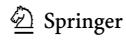

- Li T, Yan Y, Yu C, An J, Wang Y, Chen G (2024) A comprehensive review of robot intelligent grasping based on tactile perception. Robot Comput-Integr Manuf 90:102792.<https://doi.org/10.1016/j.rcim.2024.102792>
- Li Y, Liu B, Geng Y, Li P, Yang Y, Zhu Y, Liu T, Huang S (2024) Grasp multiple objects with one hand. IEEE Robot Autom Lett 9(5):4027–4034. <https://doi.org/10.1109/LRA.2024.3374190>
- Li H, Lin X, Zhou Y, Li X, Huo Y, Chen J, Ye Q (2023) Contact2grasp: 3d grasp synthesis via hand-object contact constraint. In: Elkind, E. (ed.) Proceedings of the thirty-second international joint conference on artificial intelligence, IJCAI 2023, pp. 1053–1061. Int Joint Conf Artifical Intelligence. 32nd International Joint Conference on Artificial Intelligence (IJCAI), Macao, PEOPLES R CHINA, AUG 19-25, 2023
- Li Z, Liu J, Li Z, Dong Z, Teng T, Ou Y, Caldwell D, Chen F (2025) Language-guided dexterous functional grasping by llm generated grasp functionality and synergy for humanoid manipulation. IEEE Trans Autom Sci Eng.<https://doi.org/10.1109/TASE.2024.3524426>
- Li P, Liu T, Li Y, Geng Y, Zhu Y, Yang Y, Huang S (2023) Gendexgrasp: generalizable dexterous grasping. In: 2023 IEEE international conference on robotics and automation (ICRA), pp. 8068–8074. [https://doi.or](https://doi.org/10.1109/ICRA48891.2023.10160667) [g/10.1109/ICRA48891.2023.10160667](https://doi.org/10.1109/ICRA48891.2023.10160667)
- Li H, Tan J, He H (2020) Magichand: Context-aware dexterous grasping using an anthropomorphic robotic hand. In: 2020 IEEE international conference on robotics and automation (ICRA), pp. 9895–9901. [http](https://doi.org/10.1109/ICRA40945.2020.9196538) [s://doi.org/10.1109/ICRA40945.2020.9196538](https://doi.org/10.1109/ICRA40945.2020.9196538)
- Liu Y-H (1999) Qualitative test and force optimization of 3-d frictional form-closure grasps using linear programming. IEEE Trans Robot Autom 15(1):163–173
- Liu Q, Cui Y, Ye Q, Sun Z, Li H, Li G, Shao L, Chen J (2023) Dexrepnet: Learning dexterous robotic grasping network with geometric and spatial hand-object representations. In: 2023 IEEE/RSJ international conference on intelligent robots and systems (IROS), pp. 3153–3160. [https://doi.org/10.1109/IROS55](https://doi.org/10.1109/IROS55552.2023.10342334) [552.2023.10342334](https://doi.org/10.1109/IROS55552.2023.10342334)
- Liu M, Pan Z, Xu K, Ganguly K, Manocha D (2019) Generating grasp poses for a high-dof gripper using neural networks. In: 2019 IEEE/RSJ international conference on intelligent robots and systems (IROS), pp. 1518–1525. <https://doi.org/10.1109/IROS40897.2019.8968115>
- Liu M, Pan Z, Xu K, Ganguly K, Manocha D (2020) Deep differentiable grasp planner for high-dof grippers. In: Toussaint, M., Bicchi, A., Hermans, T. (eds.) Robotics: science and systems XVI (2020). 16th Conference on Robotics - Science and Systems (RSS), Electr Network, JUL 12-16
- Liu Y, Yang Y, Wang Y, Wu X, Wang J, Yao Y, Schwertfeger S, Yang S, Wang W, Yu J, He X, Ma Y (2024) Realdex: Towards human-like grasping for robotic dexterous hand. In: Larson, K. (ed.) Proceedings of the thirty-third international joint conference on artificial intelligence, IJCAI-24, pp. 6859–6867. <https://doi.org/10.24963/ijcai.2024/758>. Main Track
- Liu S, Zhou Y, Yang J, Gupta S, Wang S (2023) Contactgen: Generative contact modeling for grasp generation. In: 2023 IEEE/CVF international conference on computer vision (ICCV), pp. 20552–20563. <https://doi.org/10.1109/ICCV51070.2023.01884>
- Li K, Wang J, Yang L, Lu C, Dai B (2024) Semgrasp: Semantic grasp generation via language aligned discretization. In: Leonardis A, Ricci E, Roth S, Russakovsky O, Sattler T, Varol G (eds) Computer vision - ECCV 2024. Springer, Cham, pp 109–127
- Li Y, Wei W, Li D, Wang P, Li W, Zhong J (2022) Hgc-net: Deep anthropomorphic hand grasping in clutter. In: 2022 International conference on robotics and automation (ICRA), pp. 714–720. [https://doi.org/10.](https://doi.org/10.1109/ICRA46639.2022.9811756) [1109/ICRA46639.2022.9811756](https://doi.org/10.1109/ICRA46639.2022.9811756)
- Li H, Ye Q, Huo Y, Liu Q, Jiang S, Zhou T, Li X, Zhou Y, Chen J (2024) Tpgp: Temporal-parametric optimization with deep grasp prior for dexterous motion planning. In: 2024 IEEE international conference on robotics and automation (ICRA), pp. 18106–18112. [https://doi.org/10.1109/ICRA57147.2024.106](https://doi.org/10.1109/ICRA57147.2024.10610408) [10408](https://doi.org/10.1109/ICRA57147.2024.10610408)
- Li H, Zhang Y, Li Y, He H (2021) Learning task-oriented dexterous grasping from human knowledge. In: 2021 IEEE International conference on robotics and automation (ICRA), pp. 6192–6198. [https://doi.or](https://doi.org/10.1109/ICRA48506.2021.9562073) [g/10.1109/ICRA48506.2021.9562073](https://doi.org/10.1109/ICRA48506.2021.9562073)
- Lowrey K, Rajeswaran A, Kakade SM, Todorov E, Mordatch I (2019) Plan online, learn offline: efficient learning and exploration via model-based control. In: 7th International conference on learning representations, ICLR 2019, New Orleans, LA, USA, May 6-9, 2019
- Lu Q, Hermans T (2019) Modeling grasp type improves learning-based grasp planning. IEEE Robot Autom Lett 4(2):784–791. <https://doi.org/10.1109/LRA.2019.2893410>
- Lu J, Kang H, Li H, Liu B, Yang Y, Huang Q, Hua G (2024) Ugg: Unified generative grasping. In: Leonardis A, Ricci E, Roth S, Russakovsky O, Sattler T, Varol G (eds) Computer vision - ECCV 2024. Springer, Cham, pp 414–433
- Lundell J, Verdoja F, Kyrki V (2021) Ddgc: Generative deep dexterous grasping in clutter. IEEE Robot Autom Lett 6(4):6899–6906

X. Song et al. **300** Page 40 of 44

Lundell J, Corona E, Nguyen Le T, Verdoja F, Weinzaepfel P, Rogez G, Moreno-Noguer F, Kyrki V (2021) Multi-fingan: generative coarse-to-fine sampling of multi-finger grasps. In: 2021 IEEE international conference on robotics and automation (ICRA), pp. 4495–4501. [https://doi.org/10.1109/ICRA48506.](https://doi.org/10.1109/ICRA48506.2021.9561228) [2021.9561228](https://doi.org/10.1109/ICRA48506.2021.9561228)

- Lv X, Xu L, Yan Y, Jin X, Xu C, Wu S, Liu Y, Li L, Bi M, Zeng W, Yang X (2025) Himo: A new benchmark for full-body human interacting with multiple objects. In: Leonardis A, Ricci E, Roth S, Russakovsky O, Sattler T, Varol G (eds) Computer vision - ECCV 2024. Springer, Cham, pp 300–318
- Mandikal P, Grauman K (2021) Learning dexterous grasping with object-centric visual affordances. In: 2021 IEEE international conference on robotics and automation (ICRA), pp. 6169–6176. [https://doi.org/10.](https://doi.org/10.1109/ICRA48506.2021.9561802) [1109/ICRA48506.2021.9561802](https://doi.org/10.1109/ICRA48506.2021.9561802)
- Mandikal P, Grauman K (2022) Dexvip: Learning dexterous grasping with human hand pose priors from video. In: 6th Conference on robot learning (CoRL), pp. 651–661. PMLR
- Mao Q, Liao Z, Yuan J, Zhu R (2024) Multimodal tactile sensing fused with vision for dexterous robotic housekeeping. Nat Commun 15(1):6871
- Matak M, Hermans T (2023) Planning visual-tactile precision grasps via complementary use of vision and touch. IEEE Robot Autom Lett 8(2):768–775. <https://doi.org/10.1109/LRA.2022.3231520>
- Merzic H, Bogdanovic M, Kappler D, Righetti L, Bohg J (2019) Leveraging contact forces for learning to grasp. In: 2019 International conference on robotics and automation (ICRA), pp. 3615–3621. [https://d](https://doi.org/10.1109/ICRA.2019.8793733) [oi.org/10.1109/ICRA.2019.8793733](https://doi.org/10.1109/ICRA.2019.8793733)
- Miller AT, Allen PK (2004) Graspit! A versatile simulator for robotic grasping. IEEE Robot Autom Mag 11(4):110–122. <https://doi.org/10.1109/MRA.2004.1371616>
- Mukadam M, Dong J, Yan X, Dellaert F, Boots B (2018) Continuous-time gaussian process motion planning via probabilistic inference. Int J Rob Res 37(11):1319–1340.<https://doi.org/10.1177/0278364918790369> Murray RM, Li Z, Sastry SS (2017) A mathematical introduction to robotic manipulation
- Newbury R, Gu M, Chumbley L, Mousavian A, Eppner C, Leitner J, Bohg J, Morales A, Asfour T, Kragic D et al (2023) Deep learning approaches to grasp synthesis: a review. IEEE Trans Rob 39(5):3994–4015
- Papamakarios G, Nalisnick ET, Rezende DJ, Mohamed S, Lakshminarayanan B (2019) Normalizing flows for probabilistic modeling and inference. J Mach Learn Res 22:57–15764
- Patzelt F, Haschke R, Ritter H (2021) Conditional stylegan for grasp generation. In: 2021 IEEE international conference on robotics and automation (ICRA), pp. 4481–4487. [https://doi.org/10.1109/ICRA48506.2](https://doi.org/10.1109/ICRA48506.2021.9561751) [021.9561751](https://doi.org/10.1109/ICRA48506.2021.9561751)
- Petrenko A, Allshire A, State G, Handa A, Makoviychuk V (2023) DexPBT: scaling up dexterous manipulation for hand-arm systems with population based training. In: Proceedings of robotics: science and systems, Daegu, Republic of Korea.<https://doi.org/10.15607/RSS.2023.XIX.037>
- Pfanne M, Chalon M, Stulp F, Albu-Schäffer A (2018) Fusing joint measurements and visual features for in-hand object pose estimation. IEEE Robot Autom Lett 3(4):3497–3504. [https://doi.org/10.1109/LR](https://doi.org/10.1109/LRA.2018.2853652) [A.2018.2853652](https://doi.org/10.1109/LRA.2018.2853652)
- Pfanne M, Chalon M, Stulp F, Ritter H, Albu-Schäffer A (2020) Object-level impedance control for dexterous in-hand manipulation. IEEE Robot Autom Lett 5(2):2987–2994. [https://doi.org/10.1109/LRA.202](https://doi.org/10.1109/LRA.2020.2974702) [0.2974702](https://doi.org/10.1109/LRA.2020.2974702)
- Pokhariya C, Shah IN, Xing A, Li Z, Chen K, Sharma A, Sridhar S (2024) Manus: Markerless grasp capture using articulated 3d gaussians. In: 2024 IEEE/CVF conference on computer vision and pattern recognition (CVPR), pp. 2197–2208.<https://doi.org/10.1109/CVPR52733.2024.00214>
- Ponce J, Sullivan S, Sudsang A, Boissonnat J-D, Merlet J-P (1997) On computing four-finger equilibrium and force-closure grasps of polyhedral objects. The Int J Robot Res 16(1):11–35
- Ponce J, Sullivan S, Boissonnat J-D, Merlet J-P (1993) On characterizing and computing three-and fourfinger force-closure grasps of polyhedral objects. In: [1993] Proceedings IEEE international conference on robotics and automation. IEEE, pp. 821–827
- Prattichizzo D, Malvezzi M, Gabiccini M, Bicchi A (2012) On the manipulability ellipsoids of underactuated robotic hands with compliance. Robot Auton Syst 60(3):337–346
- Qin Y, Wu Y-H, Liu S, Jiang H, Yang R, Fu Y, Wang X (2022) Dexmv: Imitation learning for dexterous manipulation from human videos. In: Avidan S, Brostow G, Cissé M, Farinella GM, Hassner T (eds) Computer vision - ECCV 2022. Springer, Cham, pp 570–587
- Qin Y, Huang B, Yin Z-H, Su H, Wang X (2022) Dexpoint: Generalizable point cloud reinforcement learning for sim-to-real dexterous manipulation. 6th Conference on robot learning (CoRL)
- Qin Y, Yang W, Huang B, Wyk KV, Su H, Wang X, Chao Y-W, Fox D (2023) AnyTeleop: a general visionbased dexterous robot arm-hand teleoperation system. In: Proceedings of robotics: science and systems, Daegu, Republic of Korea. <https://doi.org/10.15607/RSS.2023.XIX.015>
- Rodriguez A, Mason MT, Ferry S (2012) From caging to grasping. Int J Robot Res 31(7):886–900
- Romano JM, Hsiao K, Niemeyer G, Chitta S, Kuchenbecker KJ (2011) Human-inspired robotic grasp control with tactile sensing. IEEE Trans Rob 27(6):1067–1079.<https://doi.org/10.1109/TRO.2011.2162271>

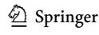

- Rombach R, Blattmann A, Lorenz D, Esser P, Ommer B (2022) High-resolution image synthesis with latent diffusion models. 2022 IEEE/CVF conference on computer vision and pattern recognition (CVPR), 10674–10685
- Romero J, Tzionas D, Black MJ (2017) Embodied hands: modeling and capturing hands and bodies together. ACM Trans Graph (TOG) 36:1–17
- Rosales C, Suárez R, Gabiccini M, Bicchi A (2012) On the synthesis of feasible and prehensile robotic grasps. In: 2012 IEEE international conference on robotics and automation. IEEE, pp. 550–556
- Saharia C, Chan W, Saxena S, Li L, Whang J, Denton EL, Ghasemipour SKS, Ayan BK, Mahdavi SS, Lopes RG, Salimans T, Ho J, Fleet DJ, Norouzi M (2022) Photorealistic text-to-image diffusion models with deep language understanding. ArXiv **abs/2205.11487**
- Sahbani A, El-Khoury S, Bidaud P (2012) An overview of 3d object grasp synthesis algorithms. Robot Auton Syst 60(3):326–336.<https://doi.org/10.1016/j.robot.2011.07.016>
- Schulman J, Ho J, Lee AX, Awwal I, Bradlow H, Abbeel P (2013) Finding locally optimal, collision-free trajectories with sequential convex optimization. Science and Systems IX, Robotics
- Shahid AA, Roveda L, Piga D, Braghin F (2020) Learning continuous control actions for robotic grasping with reinforcement learning. In: 2020 IEEE international conference on systems, man, and cybernetics (SMC), pp. 4066–4072.<https://doi.org/10.1109/SMC42975.2020.9282951>
- Shang W, Song F, Zhao Z, Gao H, Cong S, Li Z (2022) Deep learning method for grasping novel objects using dexterous hands. IEEE Trans Cybernet 52(5):2750–2762.<https://doi.org/10.1109/TCYB.2020.3022175>
- Shao Y, Xiao C (2024) Bimanual grasp synthesis for dexterous robot hands. IEEE Robot Autom Lett 9(12):11377–11384. <https://doi.org/10.1109/LRA.2024.3490393>
- Shaw K, Agarwal A, Pathak D (2023) LEAP hand: low-cost, efficient, and anthropomorphic hand for robot learning. In: Proceedings of robotics: science and systems, Daegu, Republic of Korea. [https://doi.org/1](https://doi.org/10.15607/RSS.2023.XIX.089) [0.15607/RSS.2023.XIX.089](https://doi.org/10.15607/RSS.2023.XIX.089)
- Shaw K, Li Y, Yang J, Srirama MK, Liu R, Xiong H, Mendonca R, Pathak D (2024) Bimanual dexterity for complex tasks. In: 8th Conference on robot learning (CoRL)
- She Q, Hu R, Xu J, Liu M, Xu K, Huang H (2022) Learning high-dof reaching-and-grasping via dynamic representation of gripper-object interaction. ACM Trans Graph 10(1145/3528223):3530091
- Shi C, Yang D, Zhao J, Liu H (2020) Computer vision-based grasp pattern recognition with application to myoelectric control of dexterous hand prosthesis. IEEE Trans Neural Syst Rehabil Eng 28(9):2090– 2099. <https://doi.org/10.1109/TNSRE.2020.3007625>
- Shimoga KB (1996) Robot grasp synthesis algorithms: a survey. Int J Robot Res 15(3):230–266. [https://doi.](https://doi.org/10.1177/027836499601500302) [org/10.1177/027836499601500302](https://doi.org/10.1177/027836499601500302)
- Sohn K, Yan X, Lee H (2015) Learning structured output representation using deep conditional generative models. In: Proceedings of the 28th international conference on neural information processing systems - Volume 2. NIPS'15, pp. 3483–3491. MIT Press, Cambridge, MA, USA
- Starke J, Keller M, Asfour A (2021) Temporal force synergies in human grasping. In: 2021 IEEE/RSJ international conference on intelligent robots and systems (IROS), pp. 3963–3970. [https://doi.org/10.1109/](https://doi.org/10.1109/IROS51168.2021.9636223) [IROS51168.2021.9636223](https://doi.org/10.1109/IROS51168.2021.9636223)
- Sun Y, Amatova E, Chen T (2022) Multi-object grasping - types and taxonomy. In: 2022 International conference on robotics and automation (ICRA), pp. 777–783. [https://doi.org/10.1109/ICRA46639.2022.981](https://doi.org/10.1109/ICRA46639.2022.9812388) [2388](https://doi.org/10.1109/ICRA46639.2022.9812388)
- Sun Z, Zhu J, Fisher RB (2024) Dexdlo: Learning goal-conditioned dexterous policy for dynamic manipulation of deformable linear objects. In: 2024 IEEE international conference on robotics and automation (ICRA), pp. 16009–16015.<https://doi.org/10.1109/ICRA57147.2024.10610754>
- Suresh S, Qi H, Wu T, Fan T, Pineda L, Lambeta M, Malik J, Kalakrishnan M, Calandra R, Kaess M, Ortiz J, Mukadam M (2024) Neuralfeels with neural fields: visuotactile perception for in-hand manipulation. Sci Robot 9(96):0628.<https://doi.org/10.1126/scirobotics.adl0628>
- Taheri O, Ghorbani N, Black MJ, Tzionas D (2020) Grab: A dataset of whole-body human grasping of objects. In: Vedaldi A, Bischof H, Brox T, Frahm J-M (eds) Computer Vision - ECCV 2020. Springer, Cham, pp 581–600
- Taheri O, Choutas V, Black MJ, Tzionas D (2022) Goal: Generating 4d whole-body motion for hand-object grasping. In: 2022 IEEE/CVF conference on computer vision and pattern recognition (CVPR), pp. 13253–13263. <https://doi.org/10.1109/CVPR52688.2022.01291>
- Takahashi T, Tsuboi T, Kishida T, Kawanami Y, Shimizu S, Iribe M, Fukushima T, Fujita M (2008) Adaptive grasping by multi fingered hand with tactile sensor based on robust force and position control. In: 2008 IEEE international conference on robotics and automation, pp. 264–271. [https://doi.org/10.1109/ROB](https://doi.org/10.1109/ROBOT.2008.4543219) [OT.2008.4543219](https://doi.org/10.1109/ROBOT.2008.4543219)
- Tu Y, Jiang J, Li S, Hendrich N, Li., Zhang J (2023) Posefusion: Robust object-in-hand pose estimation with selectlstm. In: 2023 IEEE/RSJ international conference on intelligent robots and systems (IROS), pp. 6839–6846. <https://doi.org/10.1109/IROS55552.2023.10341688>

Turpin D, Wang L, Heiden E, Chen Y-C, Macklin M, Tsogkas S, Dickinson S, Garg A (2022) Grasp'd: Differentiable contact-rich grasp synthesis for multi-fingered hands. In: Avidan S, Brostow G, Cissé M, Farinella GM, Hassner T (eds) Computer vision - ECCV 2022. Springer, Cham, pp 201–221

- Turpin D, Zhong T, Zhang S, Zhu G, Heiden E, Macklin M, Tsogkas S, Dickinson S, Garg A (2023) Fastgrasp'd: Dexterous multi-finger grasp generation through differentiable simulation. In: 2023 IEEE international conference on robotics and automation (ICRA), pp. 8082–8089. [https://doi.org/10.1109/ICRA](https://doi.org/10.1109/ICRA48891.2023.10160314) [48891.2023.10160314](https://doi.org/10.1109/ICRA48891.2023.10160314)
- Vahrenkamp N, Do M, Asfour T, Dillmann R (2010) Integrated grasp and motion planning. In: 2010 IEEE international conference on robotics and automation, pp. 2883–2888. [https://doi.org/10.1109/ROBOT](https://doi.org/10.1109/ROBOT.2010.5509377) [.2010.5509377](https://doi.org/10.1109/ROBOT.2010.5509377)
- Wang Y-K, Xing C, Wei Y-L, Wu X-M, Zheng W-S (2024) Single-view scene point cloud human grasp generation. In: 2024 IEEE/CVF conference on computer vision and pattern recognition (CVPR), pp. 831–841. <https://doi.org/10.1109/CVPR52733.2024.00085>
- Wang L, Yoon K-J (2021) Knowledge distillation and student-teacher learning for visual intelligence: a review and new outlooks. IEEE Trans Pattern Anal Mach Intell 44(6):3048–3068
- Wang S, Hu W, Sun L, Wang X, Li Z (2022) Learning adaptive grasping from human demonstrations. IEEE/ ASME Trans Mechatron 27(5):3865–3873. <https://doi.org/10.1109/TMECH.2021.3132465>
- Wang X, Chen G, Qian G, Gao P, Wei X-Y, Wang Y, Tian Y, Gao W (2023) Large-scale multi-modal pretrained models: a comprehensive survey. Mach Intell Res 20(4):447–482
- Wan W, Geng H, Liu Y, Shan Z, Yang Y, Yi L, Wang H (2023) Unidexgrasp++: Improving dexterous grasping policy learning via geometry-aware curriculum and iterative generalist-specialist learning. In: Proceedings of the IEEE/CVF international conference on computer vision, pp. 3891–3902
- Wang J, Qin Y, Kuang K, Korkmaz Y, Gurumoorthy A, Su H, Wang X (2024) Cyberdemo: Augmenting simulated human demonstration for real-world dexterous manipulation. In: 2024 IEEE/CVF conference on computer vision and pattern recognition (CVPR), pp. 17952–17963. [https://doi.org/10.1109/CVPR](https://doi.org/10.1109/CVPR52733.2024.01700) [52733.2024.01700](https://doi.org/10.1109/CVPR52733.2024.01700)
- Wang W, Wei F, Zhou L, Chen X, Luo L, Yi X, Zhang Y, Liang Y, Xu C, Lu Y, et al (2024) Unigrasptransformer: Simplified policy distillation for scalable dexterous robotic grasping. arXiv preprint [arXiv:2412.02699](http://arxiv.org/abs/2412.02699)
- Wang L, Xiang Y, Fox D (2019) Manipulation trajectory optimization with online grasp synthesis and selection. ArXiv **abs/1911.10280**
- Wang R, Zhang J, Chen J, Xu Y, Li P, Liu T, Wang H (2023) Dexgraspnet: A large-scale robotic dexterous grasp dataset for general objects based on simulation. In: 2023 IEEE international conference on robotics and automation (ICRA), pp. 11359–11366.<https://doi.org/10.1109/ICRA48891.2023.10160982>
- Wei Y-L, Jiang J-J, Xing C, Tan X, Wu X-M, Li H, Cutkosky MR, Zheng W-S (2024) Grasp as you say: language-guided dexterous grasp generation. ArXiv **abs/2405.19291**
- Wei W, Li D, Wang P, Li Y, Li W, Luo Y, Zhong J (2022) Dvgg: Deep variational grasp generation for dextrous manipulation. IEEE Robot Autom Lett 7(2):1659–1666.<https://doi.org/10.1109/LRA.2022.3140424>
- Wei W, Wang P, Wang SA (2023) Generalized anthropomorphic functional grasping with minimal demonstrations. ArXiv **abs/2303.17808**
- Weng Z, Lu H, Kragic D, Lundell J (2024) Dexdiffuser: Generating dexterous grasps with diffusion models. IEEE Robot Autom Lett 9(12):11834–11840.<https://doi.org/10.1109/LRA.2024.3498776>
- Wimböck T, Ott C, Albu-Schäffer AO, Hirzinger G (2012) Comparison of object-level grasp controllers for dynamic dexterous manipulation. Int J Robot Res 31:23–3
- Wu Y-H, Wang J, Wang X (2022) Learning generalizable dexterous manipulation from human grasp affordance. In: 6th Conference on robot learning (CoRL)
- Wu Y, Wang J, Zhang Y, Zhang S, Hilliges O, Yu F, Tang S (2022) Saga: Stochastic whole-body grasping with contact. In: Avidan S, Brostow G, Cissé M, Farinella GM, Hassner T (eds) Computer vision - ECCV 2022. Springer, Cham, pp 257–274
- Wu R, Zhu T, Peng W, Hang J, Sun Y (2023) Functional grasp transfer across a category of objects from only one labeled instance. IEEE Robot Autom Lett 8(5):2748–2755. [https://doi.org/10.1109/LRA.202](https://doi.org/10.1109/LRA.2023.3260725) [3.3260725](https://doi.org/10.1109/LRA.2023.3260725)
- Wu T, Wu M, Zhang J, Gan Y, Dong H (2023) Graspgf: learning score-based grasping primitive for humanassisting dexterous grasping. In: Proceedings of the 37th international conference on neural information processing systems, p. 22
- Xu G-H, Wei Y-L, Zheng D, Wu X-M, Zheng W-S (2024) Dexterous grasp transformer. In: 2024 IEEE/CVF conference on computer vision and pattern recognition (CVPR), pp. 17933–17942. [https://doi.org/10.1](https://doi.org/10.1109/CVPR52733.2024.01698) [109/CVPR52733.2024.01698](https://doi.org/10.1109/CVPR52733.2024.01698)
- Xu W, Zhang J, Tang T, Yu Z, Li Y, Lu C (2024) Dipgrasp: Parallel local searching for efficient differentiable grasp planning. IEEE Robot Autom Lett 9(10):8314–8321.<https://doi.org/10.1109/LRA.2024.3443593>

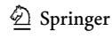

- Xu H, Li H, Wang Y, Liu S, Fu C-W (2024) Handbooster: Boosting 3d hand-mesh reconstruction by conditional synthesis and sampling of hand-object interactions. In: 2024 IEEE/CVF conference on computer vision and pattern recognition (CVPR), pp. 10159–10169.<https://doi.org/10.1109/CVPR52733.2024.00968>
- Xu Y, Wan W, Zhang J, Liu H, Shan Z, Shen H, Wang R, Geng H, Weng Y, Chen J, Liu T, Yi L, Wang H (2023) Unidexgrasp: Universal robotic dexterous grasping via learning diverse proposal generation and goal-conditioned policy. In: Proceedings of the IEEE/CVF conference on computer vision and pattern recognition (CVPR), pp. 4737–4746
- Xu W, Yu Z, Xue H, Ye R, Yao S, Lu C (2023) Visual-tactile sensing for in-hand object reconstruction. In: 2023 IEEE/CVF conference on computer vision and pattern recognition (CVPR), pp. 8803–8812. <https://doi.org/10.1109/CVPR52729.2023.00850>
- Yang L, Zhan X, Li K, Xu W, Zhang J, Li J, Lu C (2024) Learning a contact potential field for modeling the hand-object interaction. IEEE Trans Pattern Anal Mach Intell 46(8):5645–5662. [https://doi.org/10.110](https://doi.org/10.1109/TPAMI.2024.3372102) [9/TPAMI.2024.3372102](https://doi.org/10.1109/TPAMI.2024.3372102)
- Yang L, Li K, Zhan X, Lv J, Xu W, Li J, Lu C (2022) Artiboost: Boosting articulated 3d hand-object pose estimation via online exploration and synthesis. In: 2022 IEEE/CVF conference on computer vision and pattern recognition (CVPR), pp. 2740–2750. <https://doi.org/10.1109/CVPR52688.2022.00277>
- Yang L, Li K, Zhan X, Wu F, Xu A, Liu L, Lu C (2022) Oakink: A large-scale knowledge repository for understanding hand-object interaction. In: 2022 IEEE/CVF conference on computer vision and pattern recognition (CVPR), pp. 20921–20930.<https://doi.org/10.1109/CVPR52688.2022.02028>
- Yang L, Zhan X, Li K, Xu W, Li J, Lu C (2021) Cpf: Learning a contact potential field to model the handobject interaction. In: Proceedings of the IEEE/CVF international conference on computer vision, pp. 11097–11106
- Ye J, Wang J, Huang B, Qin Y, Wang X (2023) Learning continuous grasping function with a dexterous hand from human demonstrations. IEEE Robot Autom Lett 8(5):2882–2889. [https://doi.org/10.1109/LRA.2](https://doi.org/10.1109/LRA.2023.3261745) [023.3261745](https://doi.org/10.1109/LRA.2023.3261745)
- Ye Y, Gupta A, Kitani K, Tulsiani S (2024) G-hop: Generative hand-object prior for interaction reconstruction and grasp synthesis. In: 2024 IEEE/CVF conference on computer vision and pattern recognition (CVPR), pp. 1911–1920. <https://doi.org/10.1109/CVPR52733.2024.00187>
- Ye Y, Li X, Gupta A, De Mellon S, Birchfield S, Song J, Tulsiani S, Liu S (2023) Affordance diffusion: synthesizing hand-object interactions. In: 2023 IEEE/CVF conference on computer vision and pattern recognition (CVPR), pp. 22479–22489.<https://doi.org/10.1109/CVPR52729.2023.02153>
- Yu Q, Shang W, Zhao Z, Cong S, Li Z (2021) Robotic grasping of unknown objects using novel multilevel convolutional neural networks: from parallel gripper to dexterous hand. IEEE Trans Autom Sci Eng 18(4):1730–1741. <https://doi.org/10.1109/TASE.2020.3017022>
- Zeng C, Li S, Jiang Y, Li Q, Chen Z, Yang C, Zhang J (2021) Learning compliant grasping and manipulation by teleoperation with adaptive force control. In: 2021 IEEE/RSJ international conference on intelligent robots and systems (IROS), pp. 717–724.<https://doi.org/10.1109/IROS51168.2021.9636832>
- Ze Y, Zhang G, Zhang K, Hu C, Wang M, Xu H (2024) 3D diffusion policy: generalizable visuomotor policy learning via simple 3D representations. In: Proceedings of robotics: science and systems, Delft, Netherlands. <https://doi.org/10.15607/RSS.2024.XX.067>
- Zhang G, Du Y, Yu H, Wang MY (2022) Deltact: A vision-based tactile sensor using a dense color pattern. IEEE Robot Autom Lett 7(4):10778–10785. <https://doi.org/10.1109/LRA.2022.3196141>
- Zhang Y, Hang J, Zhu T, Lin X, Wu R, Peng W, Tian D, Sun Y (2023) Functionalgrasp: Learning functional grasp for robots via semantic hand-object representation. IEEE Robot Autom Lett 8(5):3094–3101. <https://doi.org/10.1109/LRA.2023.3264760>
- Zhang H, Christen S, Fan Z, Hilliges O, Song J (2025) Graspxl: Generating grasping motions for diverse objects at scale. In: Leonardis A, Ricci E, Roth S, Russakovsky O, Sattler T, Varol G (eds) Computer vision - ECCV 2024. Springer, Cham, pp 386–403
- Zhang H, Christen S, Fan Z, Zheng L, Hwangbo J, Song J, Hilliges O (2024) Artigrasp: Physically plausible synthesis of bi-manual dexterous grasping and articulation. In: 2024 International conference in 3D vision, 3DV 2024. International conference on 3D vision, pp. 235–246. [https://doi.org/10.1109/3DV62](https://doi.org/10.1109/3DV62453.2024.00016) [453.2024.00016](https://doi.org/10.1109/3DV62453.2024.00016). IEEE. International Conference in 3D Vision (3DV), Davos, SWITZERLAND, MAR 18-21, 2024
- Zhang X, Huang Z, Zheng J, Wang S, Jiang X (2022) Dcnngrasp: Towards accurate grasp pattern recognition with adaptive regularizer learning. ArXiv **abs/2205.05218**
- Zhang J, Liu H, Li D, Yu X, Geng H, Ding Y, Chen J, Wang H (2024) Dexgraspnet 2.0: Learning generative dexterous grasping in large-scale synthetic cluttered scenes. In: 8th Conference on robot learning (CoRL)
- Zhang H, Ye Y, Shiratori T, Komura T (2021) Manipnet: neural manipulation synthesis with a hand-object spatial representation. ACM Trans Graph 10(1145/3450626):3459830

X. Song et al. **300** Page 44 of 44

Zhao F, Tsetserukou D, Liu Q (2024) Graingrasp: Dexterous grasp generation with fine-grained contact guidance. In: 2024 IEEE international conference on robotics and automation (ICRA), pp. 6470–6476. [http](https://doi.org/10.1109/ICRA57147.2024.10610035) [s://doi.org/10.1109/ICRA57147.2024.10610035](https://doi.org/10.1109/ICRA57147.2024.10610035)

- Zheng Y, Chew C-M (2009) Distance between a point and a convex cone in n-dimensional space: computation and applications. IEEE Trans Rob 25(6):1397–1412
- Zheng Y, Qian W-H (2005) Dynamic force distribution in multifingered grasping by decomposition and positive combination. IEEE Trans Rob 21(4):718–726. <https://doi.org/10.1109/TRO.2005.847609>
- Zhou K, Bhatnagar BL, Lenssen JE, Pons-Moll G (2022) Toch: Spatio-temporal object-to-hand correspondence for motion refinement. In: Avidan S, Brostow G, Cissé M, Farinella GM, Hassner T (eds) Computer vision - ECCV 2022. Springer, Cham, pp 1–19
- Zhou K, Bhatnagar BL, Lenssen JE, Pons-Moll G (2024) Gears: Local geometry-aware hand-object interaction synthesis. In: 2024 IEEE/CVF conference on computer vision and pattern recognition (CVPR), pp. 20634–20643. <https://doi.org/10.1109/CVPR52733.2024.01950>
- Zhou C, Gao W, Lu W, Long., Yang S, Zhao L, Huang B, Zheng Y (2023) A unified trajectory generation algorithm for dynamic dexterous manipulation. In: 2023 IEEE/RSJ international conference on intelligent robots and systems (IROS), pp. 8712–8719.<https://doi.org/10.1109/IROS55552.2023.10342095>
- Zhou C, Long Y, Shi L, Zhao., Zheng Y (2023) Differential dynamic programming based hybrid manipulation strategy for dynamic grasping. In: 2023 IEEE international conference on robotics and automation (ICRA), pp. 8040–8046.<https://doi.org/10.1109/ICRA48891.2023.10160817>
- Zhu T, Wu R, Hang J, Lin X, Sun Y (2023) Toward human-like grasp: functional grasp by dexterous robotic hand via object-hand semantic representation. IEEE Trans Pattern Anal Mach Intell 45(10):12521– 12534. <https://doi.org/10.1109/TPAMI.2023.3272571>

**Publisher's Note** Springer Nature remains neutral with regard to jurisdictional claims in published maps and institutional affiliations.

# **Authors and Affiliations**

#### **Xu Song1 · Yongyao Li2 · Yunfan Zhang3 · Yufei Liu2 · Lei Jiang2**

 Yufei Liu liuyufei\_hit@163.com

Xu Song

songxu@openloong.net Yongyao Li

yongyao.li@openloong.net

Yunfan Zhang 221170128@st.usst.edu.cn

Lei Jiang feist201@qq.com

- 1 The National and Local Co-Build Humanoid Robotics Innovation Center, Shanghai 201203, China
- 2 Unmanned Vehicle Research Center, China North Vehicle Research Institute, Beijing 100072, China
- 3 School of Mechanical Engineering, University of Shanghai for Science and Technology, Shanghai 200093, China

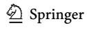