# **Towards a Unified Understanding of Robot Manipulation: A Comprehensive Survey**

**Shuanghao Bai**1∗† **Wenxuan Song**2∗ **Jiayi Chen**2∗ **Yuheng Ji**3∗ **Zhide Zhong**2∗ **Jin Yang**1∗ **Han Zhao**4,5∗ **Wanqi Zhou**1∗ **Wei Zhao**4,5∗ **Zhe Li**6∗ **Pengxiang Ding**4,5 **Cheng Chi**7 **Haoang Li**2 **Chang Xu**6 **Xiaolong Zheng**3 **Donglin Wang**4 **Shanghang Zhang**7,8 **Badong Chen**1

# chenbd@mail.xjtu.edu.cn § [Awesome-Robotics-Manipulation](https://github.com/BaiShuanghao/Awesome-Robotics-Manipulation)

**Abstract** | Embodied intelligence has witnessed remarkable progress in recent years, driven by advances in computer vision, natural language processing, and the rise of large-scale multimodal models. Among its core challenges, robot manipulation stands out as a fundamental yet intricate problem, requiring the seamless integration of perception, planning, and control to enable interaction within diverse and unstructured environments. This survey presents a comprehensive overview of robotic manipulation, encompassing foundational background, task-organized benchmarks and datasets, and a unified taxonomy of existing methods. We extend the classical division between high-level planning and low-level control by broadening high-level planning to include language, code, motion, affordance, and 3D representations, while introducing a new taxonomy of low-level learning-based control grounded in training paradigms such as input modeling, latent learning, and policy learning. Furthermore, we provide the first dedicated taxonomy of key bottlenecks, focusing on data collection, utilization, and generalization, and conclude with an extensive review of real-world applications. Compared with prior surveys, our work offers both a broader scope and deeper insight, serving as an accessible roadmap for newcomers and a structured reference for experienced researchers.

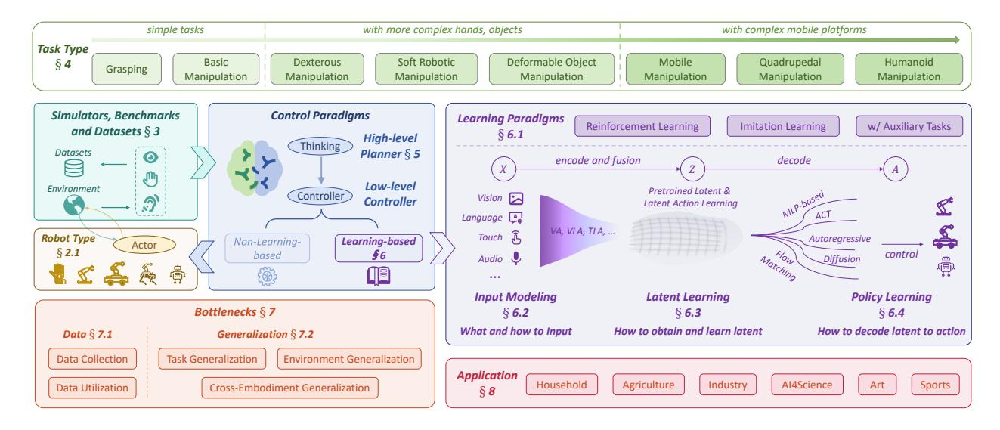

**Figure 1** | Overview of the survey. We provide a broad introduction to benchmarks, datasets, and manipulation tasks, followed by an extensive review of methods with a particular focus on learningbased control. We further highlight two central bottlenecks—data and generalization—and conclude with a discussion of their wide-ranging applications.

1 Xi'an Jiaotong Univeristy, 2 Hong Kong University of Science and Technology (Guangzhou), 3 Chinese Academy of Sciences,

4 Westlake University, 5 Zhejiang University, 6 University of Sydney, 7 BAAI, 8 Peking University

† **Project Lead** ∗ **Core Contributors Corresponding Authors**

# **Contents**

| 1 |     | Introduction                                                                   | 5  |
|---|-----|--------------------------------------------------------------------------------|----|
|   | 1.1 | Survey Scope and Key Research Questions                                     | 5  |
|   | 1.2 | Comparison with Previous Surveys and Contributions                          | 6  |
| 2 |     | Background                                                                     | 6  |
|   | 2.1 | Hardware Platforms for Manipulation                                            | 7  |
|   | 2.2 | Non-Learning vs. Learning-based Control Paradigms for Robotic Manipulation  | 8  |
|   |     | 2.2.1 Non-Learning-based Control                                            | 8  |
|   |     | 2.2.2 Learning-based Control                                             | 9  |
|   | 2.3 | Robotics Models                                                                | 10 |
|   | 2.4 | Evaluation                                                                     | 11 |
| 3 |     | Simulators, Benchmarks and Datasets                                            | 12 |
|   | 3.1 | Grasping Datasets                                                              | 12 |
|   | 3.2 | Single-Embodiment Manipulation Simulators and Benchmarks                       | 13 |
|   | 3.3 | Cross-Embodiment Manipulation Simulators and Benchmarks                     | 15 |
|   | 3.4 | Trajectory Datasets                                                         | 15 |
|   | 3.5 | Embodied QA and Affordance Datasets                                         | 16 |
| 4 |     | Manipulation Tasks                                                             | 16 |
|   | 4.1 | Grasping                                                                       | 17 |
|   | 4.2 | Basic Manipulation                                                          | 19 |
|   | 4.3 | Dexterous Manipulation                                                      | 19 |
|   | 4.4 | Soft Robotic Manipulation                                                   | 21 |
|   | 4.5 | Deformable Object Manipulation                                              | 22 |
|   | 4.6 | Mobile Manipulation                                                         | 23 |
|   | 4.7 | Quadrupedal Manipulation                                                    | 24 |
|   | 4.8 | Humanoid Manipulation                                                          | 26 |
| 5 |     | High-level Planner                                                             | 27 |
|   | 5.1 | LLM-based Task Planning                                                     | 28 |
|   | 5.2 | MLLM-based Task Planning                                                    | 29 |
|   | 5.3 | Code Generation                                                             | 30 |
|   | 5.4 | Motion Planning                                                             | 30 |
|   | 5.5 | Affordance as Planner                                                       | 31 |
|   | 5.6 | 3D Representation as Planner                                                | 32 |
| 6 |     | Low-level Learning-based Control                                               | 33 |
|   | 6.1 | Learning Strategy                                                              | 33 |
|   |     | 6.1.1 Reinforcement Learning                                             | 33 |

|   |     | 6.1.2 Imitation Learning                             | 36       |
|---|-----|------------------------------------------------------------|----------|
|   |     | 6.1.3 Bridging Reinforcement and Imitation Learning  | 40       |
|   |     | 6.1.4 Learning with Auxiliary Tasks                  | 41       |
|   | 6.2 | Input Modeling                                          | 47       |
|   |     | 6.2.1 Vison Action Models                            | 48       |
|   |     | 6.2.2 Vision-Language-Action Models                  | 48       |
|   |     | 6.2.3 Tactile-based Action Models                    | 53       |
|   |     | 6.2.4 Extra Modalities as Input                         | 54       |
|   | 6.3 | Latent Learning                                            | 55       |
|   |     | 6.3.1 Pretrained Latent Learning                     | 55       |
|   |     | 6.3.2 Latent Action Learning                            | 57       |
|   | 6.4 | Policy Learning                                         | 58       |
|   |     | 6.4.1 MLP-based Policy                                  | 58       |
|   |     | 6.4.2 Transformer-based Policy                       | 59       |
|   |     | 6.4.3 Diffusion Policy                                  | 60       |
|   |     | 6.4.4 Flow Matching Policy                              | 61       |
|   |     | 6.4.5 SSM-based Policy                                  | 62       |
|   |     | 6.4.6 SNN-based Policy                                  | 63       |
|   |     | 6.4.7 Frequency-based Policy                         | 63       |
| 7 |     | Approaches to the Key Bottlenecks                          | 63       |
|   | 7.1 | Data Collection and Utilization                         | 64       |
|   |     | 7.1.1 Data Collection                                | 64       |
|   |     | 7.1.2 Data Utilization                                  | 68       |
|   | 7.2 | Generalization                                          | 70       |
|   |     | 7.2.1 Environment Generalization                        | 70       |
|   |     | 7.2.2 Task Generalization                               | 72       |
|   |     | 7.2.3 Cross-Embodiment Generalization                | 74       |
|   |     |                                                            |          |
| 8 | 8.1 | Applications Household Assistance                       | 75 76 |
|   | 8.2 | Agriculture                                             | 76       |
|   | 8.3 | Industry                                                | 77       |
|   | 8.4 | AI4Science                                                 | 77       |
|   | 8.5 | Art                                                     | 77       |
|   | 8.6 | Sports                                                  | 78       |
|   |     |                                                            |          |
| 9 |     | Prospective Future Research Directions                     | 78       |
|   | 9.1 | Building a True Robot Brain                             | 78       |
|   | 9.2 | Data Bottleneck and Sim-to-Real Gap                        | 79       |
|   | 9.3 | Multimodal Physical Interaction                         | 80       |
|   |     |                                                            |          |

|   | 9.4 | Safety and Collaboration                                                 | 80  |
|---|-----|--------------------------------------------------------------------------|-----|
|   |     | 10 Conclusion                                                            | 81  |
|   |     | Author Contributions                                                     | 82  |
| A |     | Appendix of Simulators, Benchmarks, and Datasets                         | 173 |
|   | A.1 | Details of Grasping Datasets 173                                      |     |
|   | A.2 | Details of Single-Embodiment Manipulation Simulator and Benchmarks 173   |     |
|   | A.3 | Details of Cross-Embodiment Manipulation Simulator and Benchmarks 177 |     |
|   | A.4 | Details of Trajectory Datasets 179                                    |     |
|   | A.5 | Details of Embodied QA and Affordance Datasets                        | 181 |

# **1. Introduction**

In recent years, embodied intelligence has attracted increasing attention, largely driven by advances in computer vision and natural language processing, particularly the success of large-scale models. These developments have not only showcased remarkable machine intelligence but also offered a glimpse of artificial general intelligence (AGI). Leveraging this progress, large-scale language and multimodal models [\[1](#page-82-0)[–3\]](#page-82-1) have accelerated the deployment of robotics by enhancing perceptual and semantic understanding, enabling operation in unstructured environments, and supporting natural language task specifications. Their zero- and few-shot generalization capabilities empower robotic systems, while multimodal interaction improves usability, collectively enhancing adaptability and reducing deployment barriers in real-world scenarios.

Robot manipulation is a core and extensively studied task in embodied intelligence, defined as a robot's ability to perceive, plan, and control its effectors to physically interact with and modify the environment, such as grasping, moving, or using objects. Its evolution spans from classical rule-based and non-learning control methods [\[4](#page-82-2)[–7\]](#page-82-3) in the late 20th century through the 2010s, to deep learning–based approaches [\[8,](#page-82-4) [9\]](#page-82-5), followed by the widespread adoption of imitation learning (IL) and reinforcement learning (RL) [\[10,](#page-82-6) [11\]](#page-82-7), and most recently the integration of large language and vision-language models into IL and RL frameworks [\[12,](#page-82-8) [13\]](#page-83-0). In this survey, most non-learning methods are introduced only as background, while the majority of discussion focuses on data-driven, learning-based approaches.

### **1.1. Survey Scope and Key Research Questions**

In this survey, we aim to provide beginners with a concise roadmap of the development and methods of robot manipulation for quick entry into the field, while offering experienced readers a fresh perspective and a more comprehensive index of knowledge to facilitate deeper understanding. To this end, we organize our discussion around the following questions:

- **1. What benchmarks and task categories define robot manipulation today?** We review the current landscape of benchmarks (Section [3\)](#page-10-1) and manipulation tasks (Section [4\)](#page-15-1).
- **2. What methods have been proposed to address these manipulation tasks?** Beyond basic manipulation, Section [4](#page-15-1) reviews representative approaches for dexterous, deformable, mobile, quadrupedal, and humanoid manipulation. For these categories, we briefly cover non-learning-based methods and place greater emphasis on learning-based approaches, including RL, IL, VLA frameworks, and strategy-augmented methods, while highlighting the key challenges in each domain.

Basic manipulation, in contrast, is the most extensively studied task, supported by a rich body of literature. We therefore provide a dedicated analysis in Section [5](#page-26-0) and Section [6,](#page-32-0) examining methods at two levels: high-level planners that structure task execution and low-level learning-based control strategies that enable precise actions. While this taxonomy is developed in the context of basic manipulation, it is equally applicable to other manipulation tasks.

- **3. What are the current bottlenecks in robot manipulation?** We identify data collection and utilization, as well as generalization, as the central challenges. Section [7.1](#page-62-3) reviews the evolution of data collection methods and strategies for efficient and effective data utilization in training, while Section [7.2](#page-69-0) analyzes the diverse generalization tasks in robot manipulation and the corresponding solution strategies.
- **4. What are the practical applications of manipulation techniques beyond research?** We survey how advances in manipulation are being deployed across industries (Section [8\)](#page-74-0).

### **1.2. Comparison with Previous Surveys and Contributions**

**First, compared with prior surveys that are limited in scope, our work offers a comprehensive and systematic overview of robot manipulation.** Existing surveys typically adopt narrower perspectives. Some focus on specific task domains, such as Dexterous Manipulation [\[14,](#page-83-1) [15\]](#page-83-2), Deformable Object Manipulation [\[16\]](#page-83-3), Mobile Manipulation [\[17\]](#page-83-4), or Humanoid Manipulation [\[18\]](#page-83-5). Others highlight common methodological paradigms across tasks, for example Vision-Language-Action (VLA) models [\[19–](#page-83-6)[22\]](#page-83-7), diffusion models [\[23\]](#page-83-8), or generative approaches [\[24\]](#page-83-9). Still others emphasize sub-concepts, such as language-conditioned learning [\[25\]](#page-83-10) or object-centric representations [\[26\]](#page-84-0). A few works cover a broad range of topics but treat manipulation only as a subsection, providing insufficient depth for a systematic understanding of the field [\[27,](#page-84-1) [28\]](#page-84-2).

**Second, our survey introduces a novel taxonomy that spans robot manipulation more extensively than existing categorizations.** It offers an accessible blueprint for beginners while providing new perspectives for experienced researchers.

Specifically, we provide a more fundamental background (Section [2\)](#page-5-0) covering hardware, control paradigms, and robotic models. We introduce comprehensive benchmarks and datasets (Section [3\)](#page-10-1) organized by task categories, present a systematic overview of manipulation tasks, and develop a refined framework for methods (Section [5](#page-26-0) and Section [6\)](#page-32-0). While prior surveys also differentiate between high-level planners and low-level controllers, we broaden the scope of high-level planning (Section [5\)](#page-26-0) to encompass language, code, motion, affordances, and 3D representations. For low-level learning-based control (Section [6\)](#page-32-0), we propose a novel taxonomy grounded in training paradigms, further decomposed into learning strategy, input modeling, latent learning, and policy learning.

In addition, we provide a detailed discussion of current bottlenecks in robot manipulation (Section [7\)](#page-62-2) and, for the first time, introduce a dedicated taxonomy of data collection and utilization as well as generalization. Finally, we conclude with a more comprehensive summary of applications (Section [8\)](#page-74-0) than previous surveys.

**Finally, based on these contributions and the latest developments in the field, we identify emerging research trends and outline four promising directions for future work.** The first concerns building a true robot brain, that is, developing a genuinely general-purpose architecture together with broad cognitive and control capabilities. The second addresses the data bottleneck, as current robot learning still falls short of a true scaling law due to the high cost of data acquisition and the limitations of simulation. The third highlights the perception challenge, particularly the need for richer multimodal sensing and reliable interaction with deformable or otherwise complex objects. The fourth emphasizes the safety of human–robot coexistence, which is essential for ensuring the real-world applicability of robotic systems.

# **2. Background**

In this section, we first introduce the hardware types commonly used in robotic manipulation (Section [2.1\)](#page-5-1). We then outline the main categories of control strategies, namely non-learning-based and learning-based approaches (Section [2.2\)](#page-7-0). Next, we review the robotic models widely adopted for learning-based control (Section [2.3\)](#page-9-0) and discuss the evaluation protocols used to assess the robotic models within these frameworks (Section [2.4\)](#page-10-0).

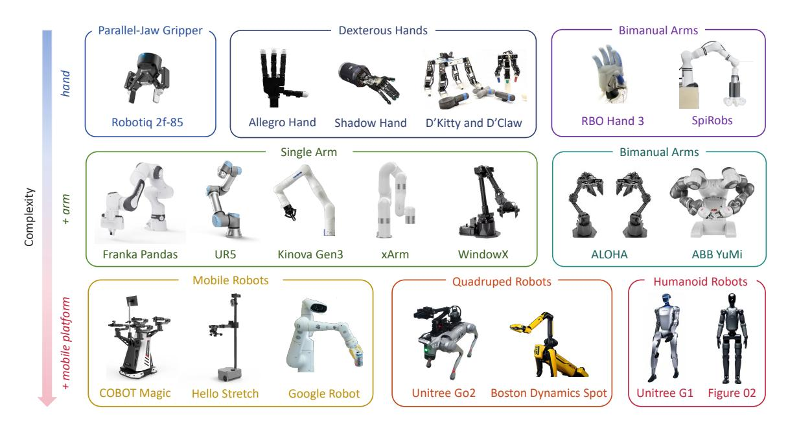

**Figure 2** | Overview of hardware platforms.

### **2.1. Hardware Platforms for Manipulation**

Before introducing manipulation tasks and their corresponding methodologies, it is important to first understand the hardware systems that enable these operations. Robotic manipulation can be achieved through various embodiments composed of fundamental components such as hands, arms, and mobile platforms. Different combinations of these components define specific embodiments and their functional capabilities. For example, pairing a parallel-jaw gripper with a Franka Panda arm enables basic manipulation tasks such as pick-and-place or insertion, while integrating a Unitree G1 humanoid platform with a dexterous hand allows for humanoid-level manipulation that demands greater dexterity and coordination. We summarize the commonly used robotic hardware types in current research in Figure [2.](#page-6-0)

**Single Arm.** Commonly used 6-DoF or 7-DoF single-arm robots include the KUKA LBR iiwa[1](https://www.kuka.com/) , Franka Emika Panda [\[29\]](#page-84-3) [2](https://franka.de/) , UR5/UR10[3](https://www.universal-robots.com/) , Kinova Gen3[4](https://www.kinovarobotics.com/) , and xArm6/xArm7[5](https://www.ufactory.us/) . These are typically equipped with 2-DoF grippers such as the Robotiq 2F[6](https://robotiq.com/) . There are also some specialized 2-DoF grippers like the DexWrist [\[30\]](#page-84-4). Recently, there has been a growing interest in compact robotic arms to facilitate academic research, with platforms such as LeRobot[7](https://github.com/huggingface/lerobot) gaining popularity for their accessibility and ease of use.

**Bimanual Arms.** Common bimanual robotic systems primarily include the Franka Panda Dual Arm[2](https://franka.de/) , ALOHA [\[31\]](#page-84-5), and ABB YuMi[8](https://new.abb.com/) . These systems enable coordinated dual-arm manipulation, making them suitable for complex tasks such as bi-manual assembly, handovers, and tool usage that require greater dexterity than single-arm setups.

**Dexterous Hands.** Dexterous hands commonly used in robotic manipulation research include the Robotiq Dexterous Gripper, Allegro Hand[9](https://www.allegrohand.com/) , Shadow Hand[10](https://shadowrobot.com/), D'Kitty and D'Claw [\[32\]](#page-84-6), and others [\[33,](#page-84-7) [34\]](#page-84-8). These robotic hands vary in complexity and degrees of freedom, enabling a range of manipulation tasks from simple grasping to highly intricate dexterous operations.

**Soft Hands.** Soft hands commonly studied in robotic manipulation research include the RBO Hand 3 [\[35\]](#page-84-9), Festo BionicSoft Hand[11](https://github.com/Festo-se/festo-bionicsofthand-main), and SpiRobs [\[36\]](#page-84-10). These soft robotic hands leverage compliant

materials and innovative actuation mechanisms, such as pneumatic networks and tendon-driven designs, to achieve adaptable and safe grasping of diverse objects.

**Mobile Robots.** Mobile manipulators, which combine a mobile base with an articulated arm, are widely adopted in research as versatile testbeds for real-world robotics. Representative platforms include the Hello Robot Stretch 3[12](https://hello-robot.com/), PR2[13](https://github.com/pr2), and TIAGo[14](https://pal-robotics.com/robot/tiago/). By integrating mobility with manipulation, these robots can operate in unstructured environments and carry out complex tasks, such as navigation, object fetching, and human–robot interaction.

**Quadruped Robots.** Representative quadruped robots commonly used in research include the Unitree GO2, B1, and Aliengo[15](https://www.unitree.com/), as well as the Boston Dynamics Spot[16](https://bostondynamics.com/). These platforms offer agile locomotion and can be equipped with robotic arms, enabling them to perform mobile manipulation tasks in unstructured or dynamic environments.

**Humanoid Robots.** Representative humanoid robots include Optimus Gen 2[17](https://www.tesla.com/en_eu/AI), Atlas[16](https://bostondynamics.com/), Figure 02[18](https://www.figure.ai/) , Neo[19](https://www.1x.tech/neo), and Unitree G1[15](https://www.unitree.com/). These platforms are designed with bipedal locomotion and human-like morphology, aiming to perform complex tasks in environments originally built for humans.

### **2.2. Non-Learning vs. Learning-based Control Paradigms for Robotic Manipulation**

Similar to how humans rely on explicit rules (e.g., stopping at red lights) or acquire adaptive skills through repeated practice (e.g., learning to ride a bicycle), robotic control paradigms span from classical, non-learning, model-based planning to learning-based policies. The former offers interpretability and safety in well-defined settings, while the latter provides flexible generalization in complex or uncertain environments.

### *2.2.1. Non-Learning-based Control*

Non-learning-based control methods generate robot motions using classical control and optimization techniques without relying on data-driven or learning algorithms. We include them here for completeness, as some studies employ such methods for low-level control within deep learning frameworks. However, they are not the focus of our method section.

**Interpolation-based Planning.** Classical manipulators often employ interpolation-based planning [\[37,](#page-84-11) [38\]](#page-84-12), where smooth joint-space trajectories are generated, typically offline, by fitting polynomial curves (e.g., cubic splines) between predefined start and goal states. These methods are computationally lightweight and straightforward to deploy, which makes them prevalent in repetitive, well-structured industrial tasks. However, they provide limited adaptability to dynamic or uncertain environments, constraining their applicability in unstructured settings.

**Sampling-based Planning.** Sampling-based planners [\[39](#page-84-13)[–42\]](#page-85-0) construct feasible paths by sampling the configuration space and incrementally building a graph or tree of collision-free states, rather than explicitly computing the free space or solving large global optimizations. Canonical algorithms include Rapidly-exploring Random Trees (RRT) [\[40,](#page-84-14) [42\]](#page-85-0) and Probabilistic Roadmaps (PRM) [\[41\]](#page-85-1), with asymptotically optimal variants such as RRT\*. They scale well to high-dimensional problems, but often yield suboptimal or non-smooth paths that require post-processing.

**Optimization-based Planning.** Optimization-based planners cast manipulation as a constrained optimization problem over trajectories or control sequences, minimizing a task-specific cost while enforcing dynamics, kinematics, and collision-avoidance constraints.

*Offline optimization-based planners* solve the trajectory planning problem prior to execution. They optimize the entire motion path as a batch process, often using gradient-based or stochastic optimiza-

tion techniques. Representative methods include CHOMP (Covariant Hamiltonian Optimization for Motion Planning) [\[43\]](#page-85-2), TrajOpt (Trajectory Optimization) [\[44\]](#page-85-3), and STOMP (Stochastic Trajectory Optimization for Motion Planning) [\[7\]](#page-82-3). These approaches generate smooth, collision-free trajectories, but typically require substantial computation time and do not adapt to unexpected changes during execution.

*Online optimization-based planners*, such as Model Predictive Control (MPC) [\[45,](#page-85-4) [46\]](#page-85-5), repeatedly solve a finite-horizon optimization problem at each control step using the current state as the initial condition. MPC leverages predictive models to anticipate future states and compute optimal control actions in a receding horizon manner. This real-time re-optimization enables adaptation to disturbances and dynamic environments, making MPC a popular choice for robust and precise robot manipulation control.

### *2.2.2. Learning-based Control*

The motion of robotic manipulators is typically formulated as a Markov Decision Process (MDP), a formal framework that models sequential decision-making under uncertainty. An MDP is typically formulated as a five-tuple:

$$\mathcal{M} = \langle \mathcal{S}, \mathcal{A}, \mathcal{P}, \mathcal{R}, \gamma \rangle, \tag{1}$$

where

- S: state space, the set of all possible environment states;
- A: action space, the set of all possible actions available to the agent;
- P ( ′ | , ): state transition probability, the probability of moving to state ′ when the agent takes action in state ;
- R : S × A → ℝ: reward function, the expected immediate reward obtained by executing action in state ;
- ∈ [0, 1]: discount factor, which trades off short-term and long-term rewards.

This formulation enables the design and evaluation of control policies that map states to actions with the objective of maximizing expected cumulative rewards. It serves as the foundation for a wide range of learning-based approaches in robot manipulation, including reinforcement learning and imitation learning.

**Reinforcement Learning (RL).** The goal of reinforcement learning is to learn an optimal policy ∗ : → that maximizes the expected cumulative discounted reward (also known as return) [\[47\]](#page-85-6):

$$\pi^* = \arg\max_{\pi} \mathbb{E}_{\pi} \left[ \sum_{t=0}^{\infty} \gamma^t R\left(s_t, a_t\right) \right], \quad \text{where } a_t \sim \pi\left(\cdot | s_t\right). \tag{2}$$

This formalism provides the theoretical foundation for reinforcement learning and serves as a unifying framework for various algorithms, including Q-learning [\[48,](#page-85-7) [49\]](#page-85-8), policy gradient methods [\[50,](#page-85-9) [51\]](#page-85-10), and actor-critic approaches [\[52,](#page-85-11) [53\]](#page-85-12). Unlike supervised learning/behavioral cloning in imitation learning, RL methods can be categorized based on data sources into: Offline RL [\[54,](#page-85-13) [55\]](#page-85-14), which is trained entirely on pre-collected static datasets; Online RL [\[53,](#page-85-12) [56\]](#page-86-0), which requires continuous interaction with the environment to explore new data distributions; and Offline-to-Online approaches [\[57,](#page-86-1) [58\]](#page-86-2) that combine both paradigms.

**Imitation Learning (IL).** Imitation Learning is typically divided into three categories: Behavior Cloning (BC), Inverse Reinforcement Learning (IRL), and Generative Adversarial Imitation Learning (GAIL).

BC can be formulated as the MDP framework, which is often defined without an explicitly specified reward function, to model sequential action mapping/generation problems [59, 60]. The concept of rewards is replaced with supervised learning, and the agent learns by mimicking expert actions. Formally,  $s_t$  denotes the overall system state at timestep t, which generally comprises the robot's proprioceptive state and, optionally, visual observations and language instructions. The policy  $\pi$  maps a sequence of states to an action. The optimization process can be formulated as:

$$\pi^* = \arg\min_{\pi} \mathbb{E}_{(s_t, \hat{a}_t) \sim \mathcal{D}_e} \left[ \mathcal{L} \left( \pi \left( s_t \right), \hat{a}_t \right) \right], \tag{3}$$

where  $\mathcal{D}_e$  is expert trajectory dataset and  $\hat{a}_t$  is action labels. In vanilla BC,  $\mathcal{L}$  is typically the cross-entropy (CE) for discrete action spaces, and either mean squared error (MSE) or  $L_1$  loss for continuous action spaces.

IRL aims to recover the underlying reward function that explains the expert's behavior, rather than directly mimicking actions. By inferring this reward function, the agent can learn a policy that generalizes better to unseen states and tasks [61, 62]. Formally, IRL assumes the expert acts optimally with respect to an unknown reward function R(s, a) within the MDP framework. Given expert demonstrations  $\mathcal{D}_e$ , the goal is to find a reward function  $R^*$  such that the expert policy  $\pi_e$  maximizes the expected cumulative reward:

$$R^* = \arg\max_{R} \mathbb{E}_{\pi_e} \left[ \sum_{t=0}^{\infty} \gamma^t R(s_t, a_t) \right] - \mathbb{E}_{\pi} \left[ \sum_{t=0}^{\infty} \gamma^t R(s_t, a_t) \right], \tag{4}$$

where  $\pi$  is the policy induced by the learned reward R, and  $\gamma \in [0, 1)$  is the discount factor. After estimating  $R^*$ , the agent solves a reinforcement learning problem to find the optimal policy  $\pi^*$  that maximizes the expected return under  $R^*$ . This two-step process allows the agent to infer intentions behind expert behaviors, potentially improving robustness and adaptability in complex manipulation tasks.

GAIL frames imitation as distribution matching between the learner's and the expert's discounted occupancy measures, thereby bypassing explicit reward modeling. Define the discounted occupancy measure (i.e., the discounted state–action visitation distribution) induced by a policy  $\pi$  as

$$\rho_{\pi}(s, a) = (1 - \gamma) \sum_{t=0}^{\infty} \gamma^{t} P(s_{t} = s, a_{t} = a \mid \pi, \mathcal{P}), \qquad (5)$$

where  $\gamma \in [0, 1)$  is the discount factor;  $\mathcal{P}$  denotes the MDP transition kernel  $\mathcal{P}(s' \mid s, a)$ ;  $P(\cdot)$  denotes probability under the trajectory distribution induced by  $(\pi, \mathcal{P})$ ; and the prefactor  $(1 - \gamma)$  normalizes  $\rho_{\pi}$  on the infinite horizon. Then, a standard adversarial objective is

$$\min_{\pi} \max_{D: \mathcal{S} \times \mathcal{A} \to (0,1)} \left\{ \mathbb{E}_{(s,a) \sim \rho_E} \left[ \log D(s,a) \right] + \mathbb{E}_{(s,a) \sim \rho_{\pi}} \left[ \log \left( 1 - D(s,a) \right) \right] \right\} - \lambda \mathcal{H}(\pi) \tag{6}$$

where D is a discriminator over state–action pairs,  $\rho_{\pi}$  and  $\rho_{E}$  are the learner's and expert's discounted occupancy measures,  $\mathcal{H}(\pi) = \mathbb{E}_{(s,a)\sim \rho_{\pi}}[-\log \pi(a\mid s)]$  is the policy entropy, and  $\lambda \geq 0$  its weight. At the discriminator optimum, Eq. (6) amounts to minimizing the divergence between  $\rho_{E}$  and  $\rho_{\pi}$ . In practice,  $\pi$  is optimized by policy-gradient updates using a discriminator-induced pseudo-reward, i.e., without relying on an environment-defined task reward.

#### 2.3. Robotics Models

**Vision Models.** To perceive the environment, robotic models typically incorporate vision models to extract informative visual features. Common choices for visual encoders include models trained purely

on visual data, such as the ResNet family [\[63\]](#page-86-7), Vision Transformers (ViT) [\[64\]](#page-86-8), and self-supervised models like DINO [\[65\]](#page-86-9). For 3D perception tasks, point cloud-based encoders such as PointNet [\[66\]](#page-86-10) and PointTransformer [\[67\]](#page-86-11) are widely used. Additionally, vision-language pre-trained encoders, such as the image encoders of CLIP [\[68\]](#page-86-12) or SigLIP [\[69\]](#page-86-13), are employed to obtain semantically enriched representations that align visual observations with linguistic inputs. Some models leverage additional visual information, including object detection results (such as bounding boxes) [\[70\]](#page-87-0), visual tracking outputs [\[71\]](#page-87-1), to improve perception and support downstream tasks more effectively.

**Language Models.** In recent years, especially since around 2020, language has emerged as a more natural and human-friendly modality, leading to a growing integration of language models into robotics. To understand human instructions, language embedding models are commonly employed for extracting textual features, such as BERT [\[72\]](#page-87-2) and the language encoder of CLIP. With the leap from autoregressive models like GPT-2 [\[73\]](#page-87-3) to GPT-3 [\[1\]](#page-82-0), large language models (LLMs) have demonstrated remarkable advances in text understanding and generalization. To further leverage the powerful generalization capabilities of LLMs [\[2,](#page-82-9) [74\]](#page-87-4), many recent robotic models adopt LLMs as backbones, where textual inputs are processed through tokenization.

**Text-conditioned Vision Models and Vision-Language Models (VLMs).** Robotic models also adopt VLMs such as LLaVA [\[3\]](#page-82-1), PaLM-E [\[75\]](#page-87-5), and Prism [\[76\]](#page-87-6) as backbones, building upon their architectures to enhance multimodal understanding and control. In addition, some works leverage text-conditioned image editing [\[77\]](#page-87-7) and video generation models [\[78\]](#page-87-8) to guide action generation through visual imagination and goal specification.

**Vision-Action Models and Vision-Language-Action Models.** Early approaches relied on visual servoing for control [\[6\]](#page-82-10) and gradually incorporated RL or IL methods that map states or images to actions [\[79,](#page-87-9) [80\]](#page-87-10), giving rise to vision–action (VA) models. Over time, VA architectures have evolved from simple MLPs to more advanced diffusion-based frameworks [\[80\]](#page-87-10), accompanied by diverse policy designs. The concept of VLA models was introduced by RT-2 [\[12\]](#page-82-8). In the narrow sense, VLAs refer to models that are fine-tuned from foundation VLMs using robotic trajectory data, enabling them to take human instructions and visual observations as input and directly generate robot actions in an end-to-end manner. In a broader sense, any model that takes both visual and language inputs and outputs robot actions through an end-to-end pipeline can be considered a VLA model.

### **2.4. Evaluation**

**Evaluation Metrics.** The most commonly used metric for evaluating robotic performance is the success rate, which measures whether a given task is completed successfully. For long-horizon tasks [\[81\]](#page-87-11), this has been extended to metrics such as average success length, which captures the average number of consecutive tasks completed within a sequence of up to tasks. Beyond success-based measures, efficiency metrics such as task completion time and action frequency are also employed to assess how quickly and effectively a robot accomplishes a task. In RL settings, return is also widely used as an overall measure of performance.

**Model Selection.** Evaluation strategies vary depending on the experimental setting. A common approach is to evaluate the model every epochs and select the checkpoint with the highest success rate. Alternatively, for more stable comparisons, one can average the results of the top- checkpoints from the final training phase. These strategies are frequently employed in single-task settings. In contrast, multi-task settings often adopt a simpler approach by reporting performance at the final training epoch or step, which enables more straightforward and consistent cross-task comparisons. Another widely used strategy is to select the checkpoint that achieves the highest validation performance for subsequent testing.

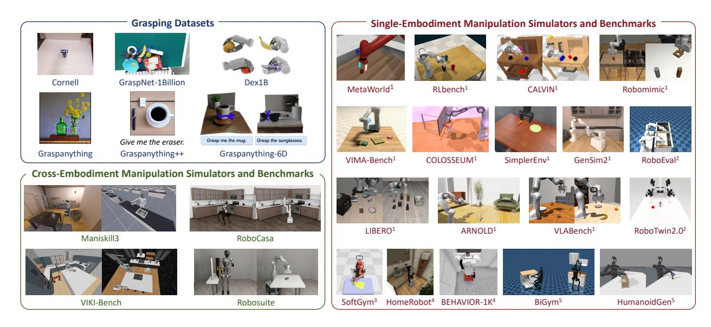

**Figure 3** | Overview of simulators and benchmarks. 1Basic Manipulation with Single Arm, 2Basic Manipulation with Bimanual Arms, 3Deformable Object Manipulation, 4Mobile Manipulation, 5Humanoid Manipulation.

**Table 1** | Summary of grasping datasets.

| Dataset                | Year      | Grasp Type    | Scene         | #Objects | Domain     | Size                            | Visual Modality | w/ Language |
|------------------------|-----------|---------------|---------------|----------|------------|---------------------------------|-----------------|-------------|
| Cornell [82]           | ICRA 2011 | rect.         | single object | 240      | real       | 1035 images, 8019 grasps        | RGB-D           | ×           |
| Jacquard [83]          | IROS 2018 | rect.         | single object | 11k      | sim        | 54k images, 1.1M grasps         | RGB-D           | ×           |
| GraspNet [84]          | CVPR 2020 | 6-DoF         | cluttered     | 88       | real       | 97,280 images, ~1.2B grasps     | RGB-D           | ×           |
| ACRONYM [85]           | ICRA 2021 | 6-DoF         | multi-object  | 8872     | sim        | 17.7M grasps                    | RGB-D           | ×           |
| Regrad [86]            | RA-L 2022 | rect. & 6-DoF | multi-object  | 50K      | sim        | 1.02K images, 100M grasps       | RGB-D           | ×           |
| MetaGraspNet [87]      | CASE 2022 | 6-DoF         | cluttered     | -        | sim + real | 217k (sim) + 2.3k (real) images | RGB-D           | ×           |
| Dexgraspnet [88]       | ICRA 2023 | 6-DoF         | single-object | 5355     | sim        | 1.32M grasps                    | -               | ×           |
| MetaGraspNet-V2 [89]   | TASE 2023 | 6-DoF         | cluttered     | -        | sim + real | 296k (sim) + 3.2k (real) images | RGB-D           | ×           |
| Grasp-Anything [90]    | ICRA 2024 | rect.         | multi-object  | 3M       | syn        | 1M images, ~600M grasps         | RGB             | ✓           |
| Grasp-Anything++ [91]  | CVPR 2024 | rect.         | multi-object  | 3M       | syn        | 1M images, 10M grasps           | RGB             | ✓           |
| Grasp-Anything-6D [92] | ECCV 2024 | 6-DoF         | multi-object  | 3M       | syn        | 1M images, 200M grasps          | RGB-D           | ✓           |
| Dex1B [93]             | RSS 2025  | dexterous     | single object | 1B       | sim        | 1B grasps                       | PC              | ×           |
| GraspClutter6D [92]    | 2025      | 6-DoF         | cluttered     | 200      | real       | 52K images, 9.3B grasps         | RGB-D           | ×           |

### 3. Simulators, Benchmarks and Datasets

Simulators, Benchmarks, and Datasets provide the empirical foundation for advancing robotic manipulation, enabling standardized evaluation, reproducibility, and fair comparison across methods. They are crucial for assessing generalization, robustness, and scalability in data-driven models. This section reviews key resources across five major areas: **grasping datasets** that support perception–action learning, **single-embodiment manipulation simulators and benchmarks** that focus on a single type of robotic embodiment, **cross-embodiment simulators and benchmarks** that evaluate generalization across morphologies, **trajectory datasets** capturing multimodal interaction sequences, and **embodied QA and affordance datasets** that connect perception with functional understanding.

### 3.1. Grasping Datasets

This paper primarily focuses on grasp detection and generation tasks, where the goal is to predict viable grasp configurations directly from sensory inputs. While some works explore grasping as a downstream outcome of broader manipulation objectives, our discussion is centered on methods that explicitly target grasp prediction rather than those that infer grasps from manipulation trajectories or task goals. Data annotations are typically categorized into two formats: rectangle-based and 6-DoF-based.

The rectangle-based format labels each grasp using a 5-dimensional grasp rectangle representation, defined by the center position (, ), the gripper's width and height, and the orientation angle relative to the horizontal axis. In contrast, the 6-DoF format directly annotates the end-effector's six-degreeof-freedom pose, including position (, , ), orientation (e.g., Euler angles or quaternions), and may also include additional information such as the approach direction and a grasp quality score. We provide a comprehensive summary of existing grasping datasets in Table [1.](#page-11-1)

Grasping datasets have undergone significant evolution along several dimensions, each contributing to the advancement of the field. First, annotation has shifted from manual labeling to model-based automation, greatly reducing human effort and enabling scalable data generation. Second, the amount of annotated data has increased from small to large-scale datasets, allowing for more robust and datadriven learning. Third, grasp representations have evolved from simple 2D rectangles [\[82,](#page-87-12) [83,](#page-88-0) [86,](#page-88-3) [90,](#page-88-7) [91\]](#page-88-8) to full 6-DoF [\[84,](#page-88-1) [85,](#page-88-2) [87,](#page-88-4) [89,](#page-88-6) [92\]](#page-88-9) and dexterous hand [\[88,](#page-88-5) [93\]](#page-88-10) poses, enabling a more accurate modeling of the complexity inherent in real-world grasping. Fourth, task settings have expanded from single-object scenarios to multi-object and cluttered environments, offering more realistic and challenging conditions. Lastly, the input modalities have progressed from purely vision-based inputs to language-conditioned instructions, facilitating more flexible and semantically rich manipulation. These changes collectively support the development of generalizable and intelligent grasping systems.

### **3.2. Single-Embodiment Manipulation Simulators and Benchmarks**

Single-embodiment manipulation benchmarks focus on a specific type of robotic platform, typically represented by single-arm manipulators or humanoids equipped with manipulators. For consistency in categorization, we group single-arm and dual-arm systems under the same embodiment type. Building on the task taxonomy introduced in Section [4,](#page-15-1) we provide a comprehensive overview of existing single-embodiment manipulation simulators and benchmarks in Table [2.](#page-13-0)

**Basic Manipulation Benchmarks.** These benchmarks primarily focus on relatively simple tabletop tasks performed using single- or dual-arm manipulators, such as pick-and-place, sorting, pushing, inserting, opening, closing, and pouring. Early benchmarks primarily focused on learning trajectories for single-task settings using RL or IL [\[94,](#page-88-11) [95\]](#page-88-12). More recent efforts have shifted toward evaluating models under increasingly complex scenarios. These include supporting long-horizon tasks that require robots to complete multi-step operations sequentially [\[81,](#page-87-11) [112\]](#page-90-0), incorporating language prompts to guide trajectory generation [\[99,](#page-89-0) [101,](#page-89-1) [103\]](#page-89-2), testing generalization under visual distractions [\[105,](#page-89-3) [108\]](#page-89-4), or unseen tasks [\[116\]](#page-90-1), proposing fairer evaluation protocols tailored to VLAs [\[106,](#page-89-5) [112\]](#page-90-0), and expanding from single-arm to more capable dual-arm manipulation settings [\[109,](#page-90-2) [114,](#page-90-3) [130\]](#page-91-0). Recent benchmarks have also started placing greater emphasis on tactile feedback to enhance policy learning in contact-rich manipulation scenarios [\[117,](#page-90-4) [118,](#page-90-5) [131\]](#page-91-1).

**Dexterous Manipulation Benchmarks.** Benchmarks for dexterous manipulation advance both algorithmic methods and hardware platforms. On the algorithmic side, learning frameworks that integrate deep reinforcement learning with demonstrations enable high-dimensional hands to acquire complex skills more efficiently [\[11\]](#page-82-7). On the hardware side, open-source platforms such as TriFinger provide low-cost, reproducible, and community-driven testbeds for dexterity research [\[119\]](#page-90-6). Together, these benchmarks facilitate systematic evaluation and have accelerated progress in learning-based dexterous manipulation.

**Deformable Object Manipulation Benchmarks.** Benchmarks for deformable object manipulation provide structured environments for evaluating robotic systems on tasks involving non-rigid objects such as cloth, rope, and fluids [\[120,](#page-90-7) [121\]](#page-90-8). They are essential for developing algorithms capable of reasoning over high-dimensional, continuous, and underactuated dynamics. By offering reproducible

**Table 2** | Summary of robot manipulation simulators and benchmarks. All benchmarks provide proprioceptive or pose observations by default, and most include additional modalities.

| Name                | Year         | Simulator           | #Objects | #Tasks | #Demos    | Observation | Robot Type                 | Mani. Type      |
|---------------------|--------------|---------------------|----------|--------|-----------|-------------|----------------------------|-----------------|
| MetaWorld [94]      | CoRL 2019    | MuJoCo              | 80       | 50     | -         | Pose        | Sawyer                     | Ba, Uni         |
| Franka Kitchen [95] | CoRL 2020    | MuJoCo              | 10       | 7      | 513       | Pose        | Franka Panda               | Ba, Uni         |
| RLBench [96]        | RA-L 2020    | CoppeliaSim         | 28       | 100    | -         | RGB, D, S   | Franka Panda               | Ba, Uni         |
| CALVIN [81]         | RA-L 2021    | Pybullet            | 28       | 34     | 40M       | RGB, D      | Franka Panda               | Ba, Uni         |
| Robomimic [97]      | CoRL 2021    | MuJoCo              | 15       | 8      | 6K        | RGB, D      | Franka Panda               | Ba, Uni         |
| Maniskill [98]      | NeurIPS 2021 | SAPIEN              | 100+     | 4      | 30K+      | RGB, D, S   | Franka Panda               | Ba, Uni         |
| VLMbench [99]       | NeurIPS 2022 | CoppeliaSim/[96]    | 22       | 8      | 6K+       | RGB, D, S   | Franka Panda               | Ba, Uni         |
| Maniskill2 [100]    | ICLR 2023    | SAPIEN              | 2144     | 20     | 30K+      | RGB, D, S   | Franka Panda               | Ba, Mo, Uni, Bi |
| VIMA-Bench [101]    | ICML 2023    | Pybullet/Ravens     | 100+     | 17     | 600K+     | RGB, D, S   | UR5                        | Ba, Uni         |
| ARNOLD [102]        | ICCV 2023    | Isaac Sim           | 40       | 8      | 10K+      | RGB, D, S   | Franka Panda               | Ba, Uni         |
| LIBERO [103]        | NeurIPS 2023 | MuJoCo/[104]        | 67       | 130    | 6.5K      | RGB, D      | Franka Panda               | Ba, Uni         |
| COLOSSEUM [105]     | RSS 2024     | CoppeliaSim/[96]    | -        | 20     | 2K        | RGB, D      | Franka Panda               | Ba, Uni         |
| SimplerEnv [106]    | CoRL 2024    | SAPIEN              | -        | 10     | Bridge v2 | RGB, D      | Google Robot, WidowX       | Ba, Uni         |
| GenSim2 [107]       | CoRL 2024    | SAPIEN              | 200      | 100    | -         | RGB, D      | Franka Panda               | Ba, Uni         |
| GemBench [108]      | ICRA 2025    | CoppeliaSim         | 20+      | 60     | -         | RGB, D      | Franka Panda               | Ba, Uni         |
| RoboTwin [109]      | CVPR 2025    | SAPIEN/[110]        | 10+      | -      | 320       | RGB, D, S   | Aloha-AgileX               | Ba, Bi          |
| GENMANIP [111]      | CVPR 2025    | Isaac Sim           | 10       | 200    | -         | RGB, D, S   | Franka Panda               | Ba, Uni         |
| VLABench [112]      | 2024         | MuJoCo              | 2000+    | 100    | 5K        | RGB, D      | Franka Panda               | Ba, Uni         |
| AGNOSTOS [113]      | 2025         | CoppeliaSim/[96]    | -        | 41     | 3.6K      | RGB, D, S   | Franka Panda               | Ba, Uni         |
| RoboTwin 2 [114]    | 2025         | SAPIEN/[110]        | 731      | 50     | 100K      | RGB, D, S   | Aloha, UR5, Franka, ARX-X5 | Ba, Uni, Bi     |
| ROBOEVAL [115]      | 2025         | -                   | -        | 8      | 3K+       | RGB, D      | Franka Panda               | Ba, Bi          |
| INT-ACT [116]       | 2025         | SAPIEN/[106]        | -        | 50     | Bridge v2 | RGB, D      | Franka Panda               | Ba, Uni         |
| TacSL [117]         | T-RO 2025    | Isaac Gym           | -        | 3      | -         | RGB, D, T   | Franka Panda               | Ba, Uni         |
| ManiFeel [118]      | 2025         | Isaac Gym/[117]     | -        | 6      | -         | RGB, D, T   | Franka Panda               | Ba, Uni         |
| [11]                | RSS 2018     | MuJoCo              | -        | 4      | 100       | RGB, D, T   | ADROIT Hand                | Dex, Uni        |
| TriFinger [119]     | CoRL 2021    | PyBullet            | -        | 2      | -         | RGB         | 3-DoF Hand                 | Dex, Uni        |
| PlasticineLab [120] | ICLR 2021    | Taichi + DiffTaichi | 1        | 10     | -         | RGB, D, P   | Rigid End-Effector         | De              |
| SoftGym [121]       | CoRL 2021    | NVIDIA FleX         | 4        | 10     | -         | RGB, D, P   | Sawyer, Franka             | De, Uni         |
| DaXBench [122]      | ICLR 2023    | DaX                 | 4        | 9      | -         | RGB, D, P   | -                          | De              |
| ManipulaTHOR [123]  | CVPR 2021    | Unity/AI2-THOR      | 2.6K+    | -      | -         | RGB, D, N   | Kinova Gen3 on Mobile Base | Mo, Uni         |
| HomeRobot [124]     | CoRL 2023    | AI Habitat          | 7892     | -      | -         | RGB, D      | Hello Robot Stretch        | Mo, Uni         |
| BEHAVIOR-1K [125]   | CoRL 2023    | OmniGibson          | 5215     | 1K     | -         | RGB, D      | Mobile Manipulator         | Mo, Uni         |
| ODYSSEY [126]       | 2025         | Isaac Sim           | 105      | 12     | -         | RGB         | 3-DoF Hand                 | Quad, Uni       |
| BiGym [127]         | CoRL 2024    | MuJoCo              | 10+      | 40     | 2K        | RGB, D      | Unitree H1                 | Hu, Bi          |
| HumanoidBench [128] | 2024         | MuJoCo              | 15       | 27     | -         | RGB, LiDAR  | Unitree H1 + Shadow-Hand   | Hu, Bi, Dex     |
| HumanoidGen [129]   | 2025         | SAPIEN              | -        | 20     | -         | RGB, D      | Unitree                    | Hu, Bi, Dex     |

 $D=depth,\,S=segmentation,\,T=tactile\,sensing,\,P=particle-based\,state\,representations,\,N=normals\,Ba=basic,\,De=deformable\,object,\,Dex=dexterous,\,Mo=mobile,\,Quad=quadrupedal,\,Hu=humanoid\,manipulation\,Uni=single\,arm,\,Bi=bimanual\,arms$ 

settings, diverse tasks, and well-defined evaluation metrics, these benchmarks enable systematic comparison of methods and foster progress in visuo-tactile perception, planning, and control under complex physical interactions.

**Mobile Manipulation Benchmarks.** Mobile manipulation benchmarks evaluate systems that integrate locomotion and manipulation [123–125]. Typical tasks involve coordinating a mobile base (wheeled or legged) with an onboard manipulator to transport objects, navigate to target locations, and interact within cluttered or spatially extended environments. These benchmarks are critical for studying perception, planning, and control challenges faced by embodied agents operating in dynamic and unstructured settings.

**Quadrupedal Manipulation Benchmarks.** Wang et al. introduced ODYSSEY [126], a benchmark and framework for open-world quadruped robots that unifies exploration and manipulation in long-horizon tasks. By integrating vision-language planning with whole-body control, ODYSSEY addresses key challenges in instruction decomposition, locomotion–manipulation coordination, and generalization across diverse open-world scenarios, with validation in both simulation and the real world.

**Humanoid Manipulation Benchmarks.** Humanoid manipulation benchmarks evaluate the capabilities of robots with human-like body structures such as arms, hands, and legs [127–129]. Tasks

**Table 3** | Summary of cross-embodiment Robotic manipulation benchmarks. S = segmentation, T = tactile sensing, and A = audio.

| Name                  | Year         | Simulator      | #Objects | #Tasks       | #Demos    | Observation  | #Robot | Manip. Type                    |
|-----------------------|--------------|----------------|----------|--------------|-----------|--------------|--------|--------------------------------|
| RoboSuite [104]       | 2020         | MuJoCo         | 20       | 9 tasks      | -         | RGB, D       | 10     | Ba, Mo, Hu, Quad, Uni, Bi, Dex |
| CortexBench [132]     | NeurIPS 2023 | Multiple       | -        | 17 tasks     | 850+      | RGB, D       | 6      | Ba, Mo, Uni                    |
| RoboHive [133]        | NeurIPS 2023 | Multiple       | -        | 17 tasks     | 850+      | RGB, D       | 10+    | Ba, Mo, Quad, Hu, Uni, Bi, Dex |
| ORBIT/Isaac Lab [135] | RA-L 2023    | Isaac Sim      | -        | 5 types      | -         | RGB, D, S    | 16     | Ba, Mo, Hu, Uni, Bi, Dex       |
| RoboCasa [136]        | RSS 2024     | MuJoCo/[104]   | 2509     | 100 tasks    | 100K+     | RGB, D       | 4+     | Ba, Mo, Hu, Quad, Uni, Bi, Dex |
| Genesis [137]         | 2024         | Genesis Engine | -        | -            | -         | RGB, D, T, A | 6      | Ba, Mo, Hu, Uni, Bi, Dex       |
| ManiSkill3 [110]      | RSS 2025     | SAPIEN         | 10K+     | 12 types     | 1M frames | RGB, D, S    | 20+    | Ba, Mo, Hu, Uni, Bi, Dex       |
| AgentWorld [138]      | CoRL 2025    | Isaac Sim      | 9K       | -            | 1000+     | RGB, D       | 4      | Mo, Hu, Uni, Bi, Dex           |
| RoboVerse [134]       | 2025         | MetaSim        | 5.5K     | 276 tasks    | 500K      | RGB, D       | 5      | Ba, Mo, Hu, Uni, Bi, Dex       |
| VIKI-Bench [139]      | 2025         | [110, 136]     | -        | 23,737 tasks | -         | RGB, D       | 6      | Ba, Mo, Hu, Uni, Bi, Dex       |

**Table 4** | Summary of trajectory datasets.

| Dataset                    | Year      | Domain                 | #Demos | #Verb | Robot Type                           | Observation  |
|----------------------------|-----------|------------------------|--------|-------|--------------------------------------|--------------|
| MINE [140]                 | CoRL 2018 | real                   | 8.3k   | 20    | Baxter Robot                         | RGB, D       |
| BridgeData [141]           | 2021      | real                   | 7.2k   | 4     | WidowX250                            | RGB, D       |
| BC-Z [142]                 | CoRL 2021 | real                   | 26k    | 3     | Google Robot                         | RGB          |
| RT-1 [143]                 | RSS 2023  | real                   | 130k   | 2     | Google Robot                         | RGB, D       |
| RH20T [144]                | RSSW 2023 | real                   | 110k   | 33    | Flexiv, UR5, Franka                  | RGB, D, T    |
| BridgeData V2 [145]        | CoRL 2023 | real                   | 60.1k  | 24    | WidowX 250                           | RGB, D       |
| RoboSet [146]              | ICRA 2024 | real                   | 98.5k  | 11    | Franka Panda                         | RGB, D       |
| Open X-Embodiment [147]    | ICRA 2024 | real                   | 1.4M   | 217   | 22 Embodiments                       | RGB, D       |
| DROID [148]                | RSS 2024  | real                   | 76k    | 86    | Franka Panda                         | RGB, D       |
| AgiBot World Dataset [149] | IROS 2025 | real                   | 1M+    | 87    | Agibot                               | RGB, D, T    |
| ARIO [150]                 | 2024      | real + sim             | 3M     | 20    | AgileX, UR5, Cloud Ginger XR-1       | RGB, D, T, A |
| RoboMind [151]             | 2024      | real                   | 107k   | 38    | Franka Panda, Tien Kung, AgileX, UR5 | RGB, D       |
| RoboFAC [152]              | 2025      | sim (SAPIEN/ManiSkill) | 9.44k  | 12    | Franka Panda                         | RGB, D       |

typically involve upper-body operations including grasping, lifting, assembling, or tool use, and may also extend to full-body motions such as bending or balancing. These benchmarks aim to assess dexterity, stability, and coordination in executing human-relevant manipulation tasks across structured and unstructured environments.

#### 3.3. Cross-Embodiment Manipulation Simulators and Benchmarks

Cross-embodiment manipulation benchmarks support a diverse range of robotic platforms, including single-arm, dual-arm, mobile, quadrupedal, and humanoid robots. These settings are designed to evaluate whether a single model can consistently perform similar tasks across robots with varying morphologies, degrees of freedom, and control constraints. Some benchmarks integrate multiple embodiment-specific benchmarks, each with different simulator backends and without a unified interface [132]. Others consolidate various simulator backends and provide a unified API for consistent interaction [133, 134]. Additionally, there are benchmarks that rely on a single simulator backend, within which different embodiments are supported through carefully designed environments [104, 110, 135–138]. We present a comprehensive overview of existing cross-embodiment simulators and benchmarks in Table 3.

#### 3.4. Trajectory Datasets

Trajectory datasets are structured collections of time-ordered data that capture the sequential states, actions, and sensory observations of an agent interacting with an environment. In the context of robotics and embodied AI, these datasets typically include robot joint states, end-effector poses, control inputs, and multimodal observations (e.g., RGB images, depth maps, force-torque readings) collected during the execution of specific tasks. In addition to trajectory datasets included in benchmarks, some works focus on building dedicated datasets that vary in scale, quality, and diversity. These datasets

**Table 5** | Summary of embodied QA and affordance datasets.

| Dataset          | Year         | Domain     | Size  | Visual Perception Tasks                           | Spatial Reasoning Tasks                                   | Functional and Commonsense Reasoning Tasks        |
|------------------|--------------|------------|-------|------------------------------------------------------|--------------------------------------------------------------|---------------------------------------------------------|
| OpenEQA [153]    | CVPR 2024    | real       | 1.6K  | Object, Attribute and Object State Recognition | Object Localization, Spatial Reasoning                    | Functional Reasoning, World Knowledge                |
| ManipVQA [154]   | IROS 2024    | real + sim | 84K   | Physically Grounded Understanding                 | Object Detection                                             | _                                                       |
| RefSpatial [155] | NeurIPS 2025 | real       | 20M   | -                                                    | Object Location, Orientation and Topological Reasoning | -                                                       |
| ManipBench [156] | 2025         | real + sim | 12K+  | Keypoint Selection, Trajectory Understanding   | Fabric Manipulation, Tool & Drawer Contact                | -                                                       |
| PointArena [157] | 2025         | real       | 982   | Pointing                                             | Pointing                                                     | -                                                       |
| Robo2VLM [158]   | 2025         | real       | 684K+ | Scene Understanding, Multiple View                | Object State, Spatial Relationship                        | Goal-conditioned Reasoning, Interaction Reasoning |
| PAC Bench [159]  | 2025         | real + sim | 30K+  | Properties                                           | Constraints                                                  | Affordance                                              |

range from small collections to large-scale repositories with millions of samples, and from low-fidelity teleoperated data to high-quality expert demonstrations. They also differ in embodiment types, control modes, and data sources such as human teleoperation, scripted agents, or learned policies. Many high-quality datasets include semantic labels, task definitions, and multimodal observations, making them valuable for learning general manipulation policies across tasks and robot types. We provide a comprehensive summary of existing trajectory datasets in Table 4.

#### 3.5. Embodied QA and Affordance Datasets

While EQA and affordance understanding both require visual-semantic and spatial reasoning, EQA emphasizes high-level question answering based on environmental context, whereas affordance understanding targets low-level functional interaction with objects, such as grasping or tool use. These datasets empower robotic models with the ability to perceive and understand the physical world, and we categorize their capabilities into three core task types. First, Visual Perception Tasks focus on the static recognition of visual information, enabling robots to identify what an object is, what color or material it has, and what state it is in (e.g., open or closed). This includes object recognition, attribute recognition, object state recognition [153], and keypoint selection to determine actionable locations for manipulation [156]. Second, Spatial Reasoning Tasks involve understanding object positions, spatial relationships, and reachability. They encompass 2D/3D object detection [154], object localization [153], and reasoning about spatial relations between the robot and its environment [155, 158], such as determining the relative direction between a gripper and a target object. Finally, Functional and Commonsense Reasoning Tasks address the robot's understanding of affordances [159] and functional uses [153] of objects—for instance, recognizing that a dish wand is used for cleaning utensils or that a knife should be grasped by its handle. These tasks bridge perception with actionable, context-aware behavior grounded in physical interaction knowledge. Table 5 offers detailed descriptions of representative datasets.

### 4. Manipulation Tasks

Early grasping methods primarily focused on identifying stable grasp configurations through geometric analysis, force closure conditions, or task-specific heuristics. Candidate grasp poses were analytically

**Table 6** | Comparison between non-learning and learning-based methods for grasping and manipulation. Here, grasping specifically refers to grasp detection and generation.

| Mani. Type   | Control Type | Pose Generation                                     | Trajectory Generation         | Generalization | Interpretability & Stability |
|--------------|--------------|-----------------------------------------------------|-------------------------------|----------------|---------------------------------|
| Grasping     | Non-learning | Analytical: geometric rules, force-closure analysis | IK + motion planning          | Low            | High                            |
|              | Learning     | Learned from data                                   | IK + motion planning          | High           | Low                             |
| Manipulation | Non-learning | Task-specific or predefined goal pose               | IK + motion planning          | Low            | High                            |
|              | Learning     | Learned implicitly via RL or IL                  | Learned policies via RL or IL | High           | Low                             |

generated from object geometry, contact normals, or predefined grasp templates, and then executed using inverse kinematics (IK) and motion planning. Building on such established grasps, early approaches to dexterous, deformable, mobile, quadrupedal, and humanoid manipulation typically assumed a known target pose or a task-specific goal. The emphasis was on optimizing motion trajectories or control commands to achieve these goals under physical and kinematic constraints, rather than learning end-to-end action generation from raw sensory input as in modern RL or IL methods. The comparison is summarized in Table 6.

Among these, basic manipulation is by far the most extensively studied, supported by a rich body of literature that enables fine-grained categorization of methods. We therefore dedicate Sections 5 and 6 to a detailed discussion of high-level planners and low-level learning-based control in the context of basic manipulation, while for other task categories we summarize representative methods within their respective subsections. Beyond the tasks covered in this survey, niche domains such as aerial manipulation [160-162] and underwater manipulation [163-165] will be incorporated in future updates.

#### 4.1. Grasping

In the narrow sense considered in this work, grasping specifically refers to the tasks of grasp detection and grasp generation. These tasks involve identifying feasible grasp configurations from sensor inputs such as images or point clouds, allowing robotic end-effectors to securely pick up objects. The primary focus is on predicting the position and orientation of the gripper to ensure stable and reliable grasps, even in the presence of diverse object shapes, varying poses, and cluttered environments.

**Non-Learning-based Grasp.** Early methods generate grasp poses by explicitly analyzing object geometry [166], performing contact-driven force analysis [167], or applying task-specific rules [168], in combination with the gripper model. However, due to their limited generalization ability in handling complex shapes, occlusions, and unseen objects, these approaches have gradually been replaced by data-driven, learning-based methods, as discussed below. The taxonomy of learning-based grasping approaches is illustrated in Figure 4.

Rectangle-based Grasp. Grasping rectangles were first introduced by Jiang et al. [82]. While they are visually similar to bounding boxes, their representational semantics are fundamentally different. A grasping rectangle is defined as a 5-dimensional representation, as previously described in Section 3.1. Subsequent methods have progressively incorporated deep learning techniques, ranging from basic convolutional neural networks (CNNs) [169–171] to more advanced architectures such as ResNet [70], GR-ConvNet [172] and Transformer [173], and further to CLIP-based models that integrate textual information through feature fusion methods [174]. More recently, diffusion models have also been employed [91]. Over time, the models have evolved from simple to complex, and the modalities have

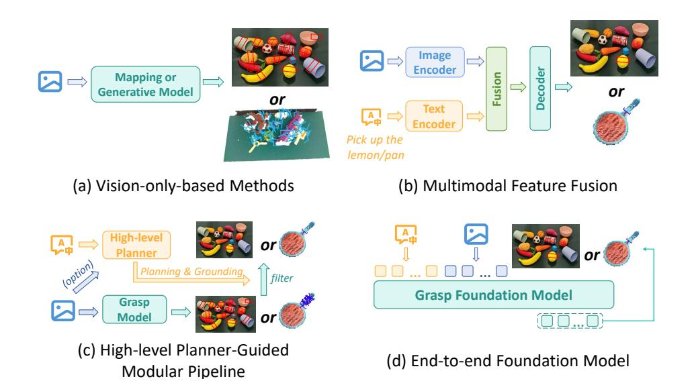

**Figure 4** | Comparison of different grasping methods. (a) Vision-only approaches, which map visual inputs to grasp poses using CNNs or spatial transformers, or generate poses via VAEs or diffusion models. With the introduction of language, three main categories emerge: (b) fusion of language and visual features through mechanisms such as cross-attention; (c) generation of multiple grasp candidates using pretrained grasp models, followed by selection with high-level planners (e.g., LLMs, VLMs, or 3D representations); and (d) end-to-end fine-tuning of grasp foundation models on largescale grasping datasets. Figure adapted from [\[175\]](#page-95-3).

shifted from unimodal to increasingly multimodal.

**6-DoF Grasp.** Two-dimensional rectangle-based representations, which typically assume parallel-jaw grippers executing top-down grasps, are limited to 2 or 3 degrees of freedom (DoF). This restricts the gripper's orientation and reduces applicability in unstructured or complex environments. To address these limitations, researchers have proposed 6-DoF grasp representations [\[176\]](#page-95-4) that define a grasp as a complete 6-dimensional pose in 3D space. This formulation enables the robot to grasp objects from arbitrary orientations, significantly improving flexibility and robustness. The 6-DoF representation is especially beneficial in cluttered scenes, non-planar object poses, and scenarios involving complex geometries.

Apart from a few early 2D-based approaches [\[177\]](#page-95-5), the majority of recent methods adopt 3D representations. In particular, methods based on point cloud inputs have explored a wide range of architectures, ranging from mapping convolutional networks [\[178\]](#page-95-6) and transformer-based models [\[179\]](#page-95-7), to generative autoencoders [\[176\]](#page-95-4), variational autoencoders [\[180,](#page-95-8) [181\]](#page-95-9), and UNet-style frameworks [\[182\]](#page-95-10). To improve efficiency, various methods have been proposed, including applying instance segmentation or heatmap to focus on task-relevant manipulation regions [\[183,](#page-95-11) [184\]](#page-96-0), reducing the grasp search space by representing grasp poses with contact points on the object surface [\[185\]](#page-96-1), incorporating graph neural networks for geometric reasoning on point cloud data [\[186\]](#page-96-2), and adopting an economic supervision paradigm that selects key annotations and leverages focal representation to reduce training cost and improve performance [\[187\]](#page-96-3). Some works further address structural distortions commonly found in real-world point cloud data by introducing completion or denoising modules to convert the input into a clean and consistent style [\[188,](#page-96-4) [189\]](#page-96-5). Several methods also address the SE(3)-equivariance problem [\[190,](#page-96-6) [191\]](#page-96-7) by modeling grasp generation as a continuous normalizing flow over SE(3) with equivariant vector fields, or by predicting per-point grasp quality over the orientation sphere using spherical harmonic basis functions. Meanwhile, several methods

also leverage 3D representations such as SDF [\[192–](#page-96-8)[194\]](#page-96-9), NeRF [\[195,](#page-96-10) [196\]](#page-96-11), and 3DGS [\[197](#page-97-0)[–199\]](#page-97-1) to extract geometric features or to sample grasp points for downstream prediction.

**Language-driven Grasp.** In recent years, language-driven grasping has gained increasing attention, aiming to achieve object-specific and instruction-guided manipulation. Existing approaches can be broadly categorized into three groups. The first adopts multimodal feature fusion [\[200,](#page-97-2) [201\]](#page-97-3), where textual and visual modalities are jointly encoded, often via cross-attention mechanisms. The second leverages existing grasp models to generate large numbers of grasp candidates, followed by ranking or scoring with LLMs or VLMs to select the most confident grasps. For instance, LLMs can generate taskspecific descriptions [\[202\]](#page-97-4), while VLMs are used for visual grounding to compute grasp confidence scores [\[203,](#page-97-5) [204\]](#page-97-6). Representative methods include VL-Grasp, which employs VLMs to attend to the target object and generate grasps [\[205\]](#page-97-7); OWG, which leverages VLM-based semantic priors for planning under occlusion [\[206\]](#page-97-8); and Reasoning-Grasping, which integrates visual-linguistic inference for improved object-level understanding [\[207\]](#page-97-9). Other efforts adapt MLLMs for environment-aware error correction [\[208\]](#page-97-10), or learn object-centric attributes to enable rapid grasp adaptation across tasks [\[209\]](#page-97-11). Affordance-driven approaches also ground grasp generation in language and vision cues [\[210](#page-97-12)[–212\]](#page-98-0). The third line of work directly fine-tunes MLLMs on grasp foundation models with large-scale grasp datasets [\[213\]](#page-98-1).

**Challenges.** Firstly, the aforementioned grasp detection and generation methods were originally designed for 2-DoF parallel-jaw grippers. However, with the increasing use of dexterous hands, research has shifted toward dexterous grasping, which requires more complex annotations such as hand joint angles and contact force maps. To handle the high dimensionality of this task, various generative approaches—including diffusion-based models—have been proposed [\[214](#page-98-2)[–216\]](#page-98-3). Some approaches represent grasp configurations via contact points or maps [\[217\]](#page-98-4), or leverage interaction-based representations like D(R, O) [\[218\]](#page-98-5) to infer grasps from geometric relationships. Second, traditional grasping strategies typically rely on a single end-effector (e.g., suction or parallel grippers), which limits adaptability to diverse object geometries. To address this, several works have explored bimanual grasping using dual-arm or dual-gripper configurations [\[219,](#page-98-6) [220\]](#page-98-7). Lastly, grasping transparent objects also remains a significant challenge, as depth sensors often fail to detect or localize such materials accurately. Recent efforts address this limitation by incorporating alternative modalities, such as LiDAR [\[221\]](#page-98-8) or 3D reconstruction [\[222–](#page-98-9)[224\]](#page-98-10), to infer the geometry of transparent or reflective objects.

### **4.2. Basic Manipulation**

Basic manipulation refers to relatively simple tabletop tasks performed by single- or dual-arm manipulators, such as pick-and-place, sorting, pushing, inserting, opening, closing, and pouring. Most current research remains focused on this category, as illustrated in Figure [11](#page-26-2) and further discussed in Sections [5](#page-26-0)[–6,](#page-32-0) where the majority of methods and benchmarks are developed around object-centric interactions in structured environments. While these sections classify approaches within the scope of basic manipulation, the proposed taxonomy is general in nature and can be readily extended to other categories of manipulation tasks.

### **4.3. Dexterous Manipulation**

Dexterous manipulation refers to the capability of robotic systems equipped with multi-fingered or anthropomorphic hands to achieve precise and coordinated object control through complex contact interactions. It involves in-hand reorientation, fine force modulation, and multi-point contact, enabling actions such as twisting, grasping, and rotating, as illustrated in Figure [5.](#page-19-0) This capability is critical for

| Mani. Type        | RL           | IL                        | RL+IL                | VLA                  |
|-------------------|--------------|---------------------------|----------------------|----------------------|
| Basic             | See Table 8  | See Figure 14             | See Table 9          | See Figure 16        |
| Dexterous         | PDDM [225],  | DexHandDiff [227],        | REBOOT [229],        | OFA [231], LBM [232] |
|                   | [11], [226]  | CordViP [228]             | ViViDex [230]        |                      |
| Soft Robotics     | [233], [234] | Soft DAgger [235],        | SS-ILKC [237]        | _                    |
|                   |              | KineSoft [236]            |                      |                      |
| Deformable Object | [238]        | DeformerNet [239],        | DMfD [241]           | _                    |
|                   |              | DexDeform [240]           |                      |                      |
| Mobile            | [242],       | MOMA-Force [244], Skill   | [246]                | MoManipVLA [247]     |
|                   | MoMa [243]   | Transformer [245]         |                      |                      |
| Quadrupedal       | VBC [248],   | Human2LocoMan [250]       | [251], WildLMa [252] | QUAR-VLA [253],      |
| •                 | GAMMA [249]  |                           |                      | GeRM [254]           |
| Humanoid          | [255],       | OmniH2O [257], iDP3 [258] | [259]                | GR00T N1 [260],      |
|                   | FLAM [256]   |                           |                      | Humanoid-VLA [261]   |

**Table 7** | Representative methods across manipulation types and learning paradigms.

tasks requiring high precision and adaptability, such as tool use, assembly, and manipulation of small or irregular objects. Human hand models typically include 20–25 DoF, with each finger modeled by 4 DoF, the thumb by 4–5 DoF, and additional DoF from the palm and wrist for enhanced realism [262].

Non-Learning-based Methods. Early work on dexterous manipulation predominantly employed non-learning approaches, including optimization- and control-based techniques such as heuristic search and constrained optimization [266]. These methods typically assume access to known dynamics and object models, and focus on trajectory planning under physical constraints.

Learning-based Methods. With the advent of RL, both model-based and model-free paradigms have been applied to dexterous manipulation. Model-based methods such as PDDM [225] exploit learned dynamics for efficient planning and control, while model-free approaches directly optimize policies from interaction [11], sometimes

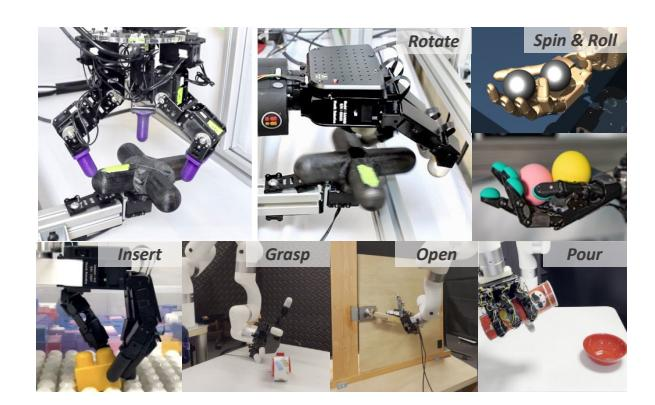

**Figure 5** | Tasks in dexterous manipulation, figure adapted from [225, 226, 263–265].

enhanced with few-shot imitation to accelerate learning on real hands [226]. More recently, human-in-the-loop frameworks such as HIL-SERL [267] combine demonstrations, online corrections, and reinforcement learning to achieve sample-efficient training of precise and dexterous skills directly on real robots. IL has gained attention for its data efficiency, exemplified by DexMV [268], which employs kinematic retargeting from human videos to robot hands. Extensions incorporate auxiliary tasks such as contact prediction [227, 228] and inverse dynamics modeling [269], enabling better generalization and action consistency. Hybrid IL–RL approaches aim to combine these strengths, typically using IL for policy initialization followed by RL refinement [270, 271]. Integration can vary: DexMV applies IL first and fine-tunes with RL, whereas ViViDex [230] performs RL in a privileged state space before distilling policies via IL.

Recent advances in VLA models further expand generalization. DexGraspVLA [272] integrates semantic reasoning with diffusion-based policies for grasping in cluttered scenes, while OFA [231], LBM [232], and Being-H0 [273] leverage multimodal prompts and human videos to generate dexterous motions and follow language instructions.

Human guidance provides another supervision source: Chen et al. [274] use object and wrist trajectories from videos to guide RL, and Mandi et al. [275] introduce functional retargeting to

transition from demonstrations to autonomous control. Affordance reasoning further supports graspspecific strategies [\[276,](#page-102-11) [277\]](#page-102-12), guiding object selection under semantic constraints. Finally, recent works emphasize robustness and autonomy. Task decomposition reduces complexity by structuring subtasks [\[278\]](#page-103-0), while recovery mechanisms such as REBOOT [\[229\]](#page-99-4) introduce IL-trained reset policies to handle failures in long-horizon settings.

**Challenges.** Beyond high-dimensional control and contact dynamics, dexterous manipulation faces broader challenges. First, many real-world tasks are long-horizon and compositional, requiring sequential execution of fine-grained skills. Chen et al. [\[264\]](#page-102-13) address this by decomposing tasks into discrete skills trained with RL and linking them via a high-level policy. Second, sim-to-real transfer remains a bottleneck due to discrepancies in perception, dynamics, and actuation. CyberDemo [\[265\]](#page-102-0) mitigates this through data augmentation, improving robustness under domain shift. Third, accurate perception is difficult in cluttered or partially observed scenes, where occlusion hampers object tracking. DexPoint [\[263\]](#page-101-12) leverages point cloud completion to recover missing geometry and enhance spatial awareness.

### **4.4. Soft Robotic Manipulation**

Soft manipulators, built with compliant materials or structures, are well-suited for human–robot collaboration, operation in uncertain environments, and safe, adaptive grasping, as illustrated in Figure [6.](#page-20-1) They overcome the limitations of rigid manipulators when handling delicate or deformable objects [\[279\]](#page-103-1). To this end, a wide range of designs have been developed to support diverse applications [\[35,](#page-84-9) [36,](#page-84-10) [280](#page-103-2)[–282\]](#page-103-3).

**Non-Learning-based Methods.** For soft manipulator control, analytical kinematic models based on the constant-curvature assumption map shape parameters to end-effector poses via virtual rigidlink chains and Denavit–Hartenberg transformations [\[284\]](#page-103-5). Similarly, three-dimensional continuum manipulators can be approximated as rigid-jointed robots, with computed-torque control achieving closed-loop dynamics [\[285\]](#page-103-6). Other approaches employ model predictive control with Koopman operators [\[286,](#page-103-7) [287\]](#page-103-8), or rely on accurate Lagrangian models combined with adaptive dynamic sliding mode control to enhance robustness [\[288\]](#page-103-9). Hybrid schemes also integrate learn-

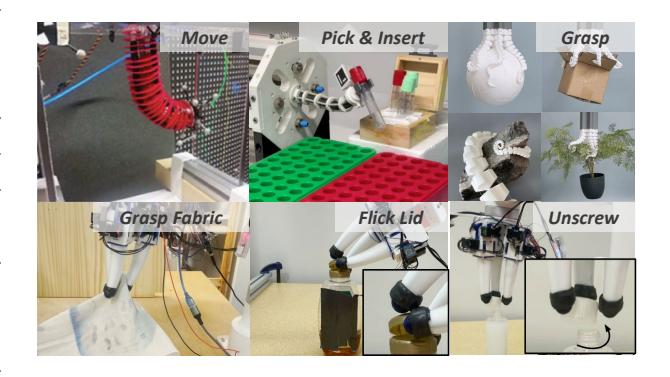

**Figure 6** | Tasks in soft robotic manipulation, figure adapted from [\[36,](#page-84-10) [236,](#page-99-11) [283\]](#page-103-4).

ing into non-learning frameworks: forward dynamics can be approximated with machine learning and combined with trajectory optimization for open-loop control [\[289\]](#page-103-10), while feedback-driven strategies exploit learned models to stabilize and restore system states [\[281\]](#page-103-11).

**Learning-based Methods.** RL and IL have been widely applied to soft manipulator control. Modelfree RL avoids explicit physical modeling by training policies in simulation for closed-loop endpoint control [\[283\]](#page-103-4). Forward dynamics learned with recurrent networks can be integrated into trajectory optimization to generate samples and train predictive controllers [\[233\]](#page-99-8), while LSTM-based dynamics models enable feedback policy learning [\[290\]](#page-103-12). Domain randomization combined with incremental offline training has improved task-space accuracy and adaptability [\[234\]](#page-99-9), and wavelet-based dynamics approximations paired with LSTM and TD3 controllers further enhance generalization under variability [\[291\]](#page-104-0). IL approaches include Soft DAgger [\[235\]](#page-99-10), which employs dynamic behavior mapping for online expert-like action generation, and KineSoft [\[236\]](#page-99-11), which integrates kinesthetic

teaching with diffusion-based policy learning. Hybrid methods also emerge, such as SS-ILKC [\[237\]](#page-99-12), which combines multi-objective RL with adversarial IL to learn goal-directed control strategies in sensor space, supported by sim-to-real pre-calibration for zero-shot transfer.

**Challenges.** Soft-hand-based manipulation faces several challenges, including modeling highly nonlinear and underactuated dynamics, achieving precise force and pose control with deformable or fragile objects, ensuring robustness under environmental uncertainty and sensor noise, and lowering the cost and complexity of data collection and teleoperation for policy training. To improve sample efficiency, Soft DAgger [\[235\]](#page-99-10) enables online imitation learning from limited demonstrations through dynamic behavior mapping. To reduce hardware complexity in teleoperation, Liu et al. [\[282\]](#page-103-3) propose a flexible bimodal sensory interface that combines vision-based perception with wearable sensors, enabling intuitive and low-cost control without bulky equipment.

### **4.5. Deformable Object Manipulation**

Deformable object manipulation (DOM) requires robots to perceive and control non-rigid objects whose shapes vary under applied forces. Unlike rigid-body manipulation, it demands reasoning over high-dimensional, continuous state spaces, coping with uncertain deformation dynamics, and interpreting subtle visual or tactile cues. As illustrated in Figure [7,](#page-21-1) tasks such as cloth folding, rope and cable tying, and food handling involve diverse deformations—including tension, compression, and bending—making DOM a complex yet crucial challenge in robotic manipulation [\[16,](#page-83-3) [296,](#page-104-3) [297\]](#page-104-4).

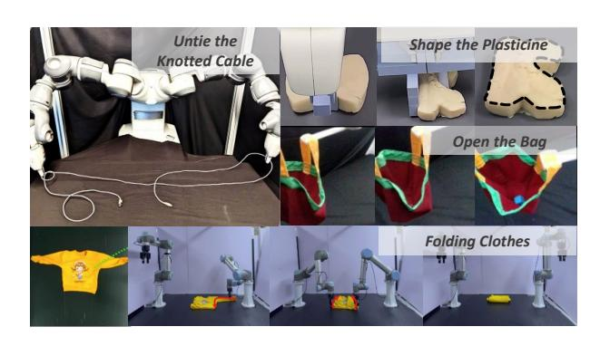

**Figure 7** | Tasks in deformable object manipulation, figure adapted from [\[292](#page-104-1)[–295\]](#page-104-2).

**Non-Learning-based Methods.** Traditional approaches to DOM, such as path planning [\[298\]](#page-104-5)

and model-based control [\[299\]](#page-104-6), often rely on simplified physical models or analytical solutions. However, these methods typically struggle with generalization and real-time adaptability in complex environments, leading to a shift toward data-driven techniques such as RL, IL, and hybrid learning-control frameworks.

**Learning-based Methods.** Jan et al. [\[238\]](#page-100-0) propose a deep RL method based on a modified DDPG algorithm that learns from visual and robot state inputs and achieves zero-shot sim-to-real transfer via domain randomization. In contrast, IL methods directly exploit demonstrations: DexDeform [\[240\]](#page-100-2) extracts latent skills from human demonstrations and fine-tunes them with limited robot data, DefGoalNet [\[300\]](#page-104-7) predicts goal configurations from few-shot demonstrations conditioned on state and context, and MPD [\[301\]](#page-104-8) generates movement primitives with diffusion models. To combine both paradigms, DMfD [\[241\]](#page-100-3) incorporates expert data into RL through advantage-weighted BC loss, expert-initialized replay buffers, and reset-to-state initialization, achieving stable and efficient policy optimization.

Beyond learning paradigms, DOM has explored diverse strategies spanning geometric modeling, affordance prediction, and structure-aware perception. DeformGS [\[302\]](#page-104-9) represents deformable objects with canonical Gaussians and learns a time-conditioned deformation field for temporally consistent 3D pose tracking. Affordance-based approaches include DeformerNet [\[239\]](#page-100-1), which predicts end-effector displacements from partial point clouds, Foresightful Affordance [\[303\]](#page-104-10), which integrates dense perpixel affordances with long-horizon value estimation, and APS-Net [\[295\]](#page-104-2), which ranks standardized

folding and flattening trajectories guided by affordance heatmaps. Language-conditioned affordance prediction has also been explored [\[304\]](#page-105-0). Finally, estimating object-specific physical properties has emerged as a complementary direction [\[305,](#page-105-1) [306\]](#page-105-2). GenDOM [\[306\]](#page-105-2) learns a parameter-conditioned policy and leverages a single human demonstration with differentiable simulation to infer unseen object properties, enabling generalization to novel deformable instances.

**Challenges.** Deformable objects lack a fixed pose, and key deformation regions are often occluded during manipulation. To improve visibility and perception, recent work jointly optimizes camera and manipulator motion, guided by structure-of-interest cues [\[294\]](#page-104-11). Deformation dynamics also exhibit delayed responses, complicating real-time control; this is addressed by encoding states into latent spaces and predicting their dynamics. For example, DeformNet [\[307\]](#page-105-3) encodes object geometry with PointNet and a conditional NeRF, and models temporal evolution with a recurrent state-space model for latent-level MPC. An even greater challenge is modeling topological changes. DoughNet [\[308\]](#page-105-4) extends latent-space modeling to jointly capture geometric and topological variations from point clouds, enabling long-horizon planning with CEM for tool selection and manipulation.

### **4.6. Mobile Manipulation**

Mobile manipulation is a robotic paradigm that combines navigation and manipulation capabilities within a single system. It allows robots to physically interact with objects beyond a fixed workspace by actively navigating the environment. This integration poses significant challenges in perception, planning, and control, as it requires coordinating whole-body motion, handling longhorizon tasks, and dealing with dynamic, partially observable scenes. Several studies have focused on designing robots specifically for mobile manipulation [\[31,](#page-84-5) [311,](#page-105-7) [312\]](#page-105-8). As illustrated in Figure [8,](#page-22-1) mobile manipulation is critical for realworld applications such as household assistance, warehouse automation, and service robotics [\[17\]](#page-83-4).

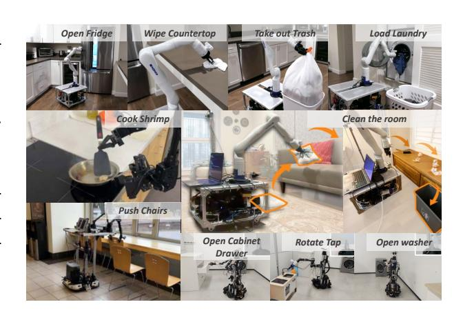

**Figure 8** | Tasks in mobile manipulation, figure adapted from [\[31,](#page-84-5) [244,](#page-100-6) [309,](#page-105-5) [310\]](#page-105-6).

**Non-Learning-based Methods.** Traditionally, mobile manipulation is decomposed into two separate problems: navigation and manipulation. Navigation is typically handled by classic path planners, such as grid-based methods (e.g., Dijkstra) and sampling-based planners (e.g., RRT). Manipulation is often addressed using grasp models, motion primitives, or trajectory planning based on point clouds. Some control methods perform joint optimization of navigation and manipulation. For example, Berenson et al. [\[313\]](#page-105-9) optimize full-body configurations and grasp poses simultaneously, then plan motions via sampling. Chitta et al. [\[314\]](#page-105-10) coordinate base-arm planning with ROS-based navigation and point cloud grasping. Others embed manipulation goals directly into MPC cost functions [\[315\]](#page-105-11).

**Learning-based Methods.** These methods have emerged to learn policies for whole-body control. For RL, Wang et al. [\[316\]](#page-105-12) use RGB-D inputs to estimate object pose and train a policy that jointly predicts base velocity, arm trajectories, and gripper actions. HarmonicMM [\[317\]](#page-106-0) extends this by integrating visual and pose information into a unified RL framework, while Wu et al. [\[242\]](#page-100-4) propose spatial Q-value learning at the map level for navigation guidance. To improve reward signals, Honerkamp et al. [\[318\]](#page-106-1) design dense rewards based on end-effector reachability, and Causal MoMa [\[243\]](#page-100-5) introduces causality-aware modeling of control–reward relations to stabilize policy optimization. For IL, MOMA-Force [\[244\]](#page-100-6) learns motion and force policies from visual-force demonstrations, while HoMeR [\[310\]](#page-105-6)

decomposes tasks into global keypose prediction and local refinement to map end-effector targets to whole-body actions. Wang et al. [\[319\]](#page-106-2) leverage SAM2-based perception for object-centric IL, and Skill Transformer [\[245\]](#page-100-7) treats manipulation as a skill prediction problem, learning both skill categories and corresponding low-level actions. Hybrid methods combine IL with RL to enhance generalization. For example, Xiong et al. [\[246\]](#page-100-8) initialize policies via behavior cloning and refine them through online RL to handle unseen articulated objects.

Beyond learning paradigms, recent work integrates high-level reasoning and multimodal representations. VLA-based methods such as MoManipVLA [\[247\]](#page-100-9) process multimodal instructions to predict end-effector waypoints while delegating base motion to a trajectory optimizer. LLM-driven frameworks, including MoMa-LLM [\[320\]](#page-106-3) and SayPlan [\[321\]](#page-106-4), combine open-vocabulary language, scene graphs, and reasoning for object search and high-level task planning. Complementary efforts in *3D scene modeling* guide manipulation through active perception: ActPerMoMa [\[322\]](#page-106-5) optimizes viewpoint selection and grasp reachability via incremental TSDF mapping, while TaMMa [\[323\]](#page-106-6) employs sparse Gaussian localization and depth completion to generate accurate target poses.

**Challenges.** In addition to perception–action coordination, dynamic obstacles, and long-horizon decision-making, mobile manipulation faces several additional challenges. A first challenge is enabling effective human–robot collaboration. Ciocarlie et al. [\[324\]](#page-106-7) developed an assistive system that combines user interfaces, shared control, and autonomy to transform a PR2 robot into an in-home assistant. Extending this line of work, Robi Butler [\[325\]](#page-106-8) introduces a closed-loop household control framework that supports multimodal interaction, where high-level planners such as LLMs and VLMs enable natural language and gesture-based commands for intuitive and remote collaboration. A second challenge is real-time manipulation during navigation, where robots must coordinate mobility and manipulation under environmental constraints. Whole-body motion control frameworks [\[326,](#page-106-9) [327\]](#page-106-10) address this problem by enabling reactive planning and execution for on-the-move manipulation.

### **4.7. Quadrupedal Manipulation**

Quadrupedal manipulation is an emerging paradigm that combines the agile mobility of quadruped robots with the ability to physically interact with objects. Unlike traditional manipulators or mobile bases, quadrupeds can traverse complex and unstructured terrains while maintaining dynamic stability, making them particularly suitable for applications such as search and rescue, field robotics, and autonomous exploration. Representative tasks are illustrated in Figure [8.](#page-22-1) Manipulation can be realized through several embodiments: whole-body loco-

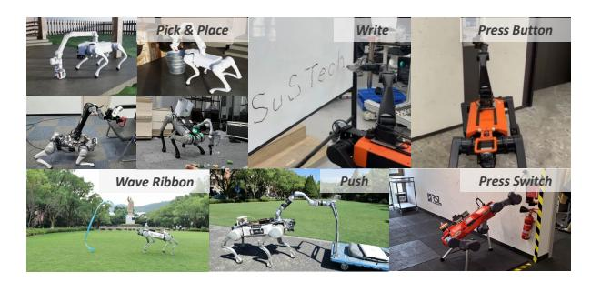

**Figure 9** | Tasks in quadrupedal manipulation, figure adapted from [\[126,](#page-91-6) [328–](#page-106-11)[331\]](#page-107-0).

manipulation [\[253,](#page-101-2) [254,](#page-101-3) [332–](#page-107-1)[335\]](#page-107-2); leg-as-manipulator designs that repurpose one or more legs for interaction [\[251,](#page-101-0) [329,](#page-106-12) [336\]](#page-107-3); back-mounted arms [\[248,](#page-100-10) [249,](#page-100-11) [328,](#page-106-11) [330,](#page-106-13) [331,](#page-107-0) [337](#page-107-4)[–345\]](#page-108-0); and grippers integrated into front legs for simultaneous locomotion and manipulation [\[346\]](#page-108-1). Each embodiment introduces unique challenges in whole-body coordination, dynamic control, and perception-driven planning.

**Non-Learning-based Methods.** Recent advances in quadrupedal manipulation have explored diverse control strategies, ranging from model-based optimization to learning-based approaches. Optimization-based methods provide interpretable and physically grounded control with strong task generalization. For example, Arcari et al. [\[339\]](#page-107-5) combine MPC with Bayesian multi-task error

learning for real-time dynamics adaptation. Wolfslag et al. [\[337\]](#page-107-4) incorporate SUF stability metrics and contact constraints into a quadratic programming framework for robust, support-leg-aware planning, a concept further extended by RoLoMa [\[340\]](#page-107-6) to improve trajectory robustness. LocoMan [\[346\]](#page-108-1) demonstrates a hardware–control co-design approach, equipping quadrupeds with lightweight front-leg manipulators and employing unified WBC to achieve agile locomotion and precise manipulation.

**Learning-based Methods.** In the realm of RL, recent research has focused on developing structured and informative control representations. Jeon et al. [\[332\]](#page-107-1) introduce a hierarchical RL framework that encodes interaction experience, robot morphology, and action history into latent representations to facilitate effective policy learning. Fu et al. [\[338\]](#page-107-7) decouple leg and arm rewards in the policy gradient formulation to enhance coordination between locomotion and manipulation, while Zhi et al. [\[345\]](#page-108-0) present a unified force–position controller that estimates forces from perception instead of sensors. Hou et al. [\[330\]](#page-106-13) incorporate explicit arm kinematics and feasibility-based rewards to promote physically plausible behaviors. Two-stage training schemes have also been explored: Robo-Duet [\[344\]](#page-108-2) sequentially trains locomotion and arm policies with reward adaptation for coordination. GAMMA [\[249\]](#page-100-11) improves grasp precision by conditioning policies on grasp poses, while Wang et al. [\[331\]](#page-107-0) propose GORM, a metric for grasp reachability under varying base poses, guiding base movements for optimal grasping. Teacher–student frameworks have further advanced base–arm coordination, as in VBC [\[248\]](#page-100-10) and Jiang et al. [\[328\]](#page-106-11), where visual or pose-tracking guidance is distilled into student policies. Other works combine hierarchical and hybrid designs, such as HiLMa-Res [\[333\]](#page-107-8), which uses high-level RL to control Bézier parameters and base motion while relying on hybrid CPG–Bézier controllers for leg movements, and Pedipulate [\[329\]](#page-106-12), which demonstrates end-to-end RL for single-foot manipulation. In the IL domain, Human2LocoMan [\[250\]](#page-100-12) enables cross-embodiment transfer from XR-driven human demonstrations using a modular Transformer policy, effectively transferring human manipulation skills to quadrupeds. Hybrid IL–RL frameworks further improve efficiency and generalization. He et al. [\[251\]](#page-101-0) employ BC to train a high-level planner for grasp trajectories, while a low-level RL controller coordinates leg and single-leg manipulation. WildLMa [\[252\]](#page-101-1) builds an IL-based skill library from VR demonstrations, sequencing and composing tasks under LLM guidance.

VLA-based frameworks have also emerged for high-level semantic reasoning. QUAR-VLA [\[253\]](#page-101-2) pioneers the application of VLA models to quadrupeds, while GeRM [\[254\]](#page-101-3) and MoRE [\[335\]](#page-107-2) integrate mixture-of-experts architectures with offline RL to learn generalist visuomotor policies and Q-functions with enhanced generalization and decision quality. QUART-Online [\[347\]](#page-108-3) advances this line by introducing action-chunk discretization and semantic alignment training, enabling latency-free inference for quadrupedal VLA tasks.

Finally, advances in 3D semantic perception and high-level planning extend quadrupedal capabilities. GeFF [\[342\]](#page-107-9) performs real-time NeRF-based reconstruction with semantic relevance fields to guide locomotion, while manipulation is executed via learned grasp models. At the task level, LLMs have been combined with policy libraries: Ouyang et al. [\[334\]](#page-107-10) propose a hierarchical framework where LLMs parse long-horizon, multi-skill instructions into structured subgoals executed by RL-based skills, bridging symbolic reasoning and continuous control.

**Challenges.** In addition to common challenges such as balance–manipulation coupling, terrain adaptability, and perception delays, real-world deployment remains difficult due to the sim-to-real gap caused by modeling inaccuracies and sensor noise. To mitigate this, fully autonomous RL pipelines have been developed. Mendonca et al. [\[343\]](#page-107-11) propose a framework that integrates on-policy data collection with continuous training, while ASC [\[341\]](#page-107-12) addresses long-horizon tasks by decomposing them into modular skills trained via RL, coordinating them through a skill-switching policy jointly trained with IL and RL, and introducing a corrective policy to improve robustness during deployment.

Long-horizon task execution itself poses another significant challenge. Cheng et al. [\[336\]](#page-107-3) propose a stage-wise RL framework that independently learns locomotion and single-leg manipulation skills, which are later composed via a behavior tree to accomplish temporally extended tasks.

### **4.8. Humanoid Manipulation**

Humanoid manipulation involves robotic platforms with human-like morphology, typically including a torso, two arms, and either simplified 2-DoF or fully dexterous hands, with the lower body implemented as either a mobile base or bipedal legs. These systems are designed to perform object interaction tasks in human environments. These systems seek to replicate or extend human manipulation capabilities, enabling actions such as grasping, lifting, tool use, and coordinated bimanual operations, as illustrated in Figure [10.](#page-25-1) While the humanoid form offers natural compatibility with tools and environments built for humans, it also introduces challenges in balance control, whole-body coordination, and fine motor skills, making humanoid manipulation a central research focus in robotics and embodied intelligence.

**Non-Learning-based Methods.** Early humanoid control primarily relied on traditional approaches such as rule-based and analytical controllers [\[352,](#page-108-8) [353\]](#page-108-9). Some works also explored the integration of learning-based models into control frameworks. For example, OKAMI [\[354\]](#page-108-10) leverages 3D human pose estimation from a single human video to infer joint positions and derive executable actions for humanoid robots via inverse kinematics.

**Learning-based Methods.** The recent trend in humanoid manipulation has shifted from handtuned controllers toward fully learning-based models. As highlighted in [\[18\]](#page-83-5), the field remains underexplored, with existing methods falling broadly into RL, IL, and VLA frameworks.

For RL-based approaches, FLAM [\[256\]](#page-101-5) leverages a pre-trained human motion foundation model to score the stability of humanoid poses, using this score as an auxiliary reward to encourage

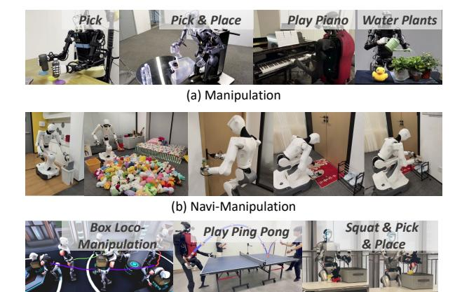

**Figure 10** | Tasks in humanoid manipulation, categorized into manipulation [\[255,](#page-101-4) [258,](#page-101-7) [348\]](#page-108-4), navi-manipulation [\[349\]](#page-108-5), and locomanipulation [\[348,](#page-108-4) [350,](#page-108-6) [351\]](#page-108-7).

(c) Loco-Manipulation

balanced behaviors. Xie et al. [\[255\]](#page-101-4) combine diffusion-based motion generation with reinforcement learning to achieve whole-body humanoid manipulation. In the domain of IL, TRILL [\[355\]](#page-108-11) directly maps RGB images to pose commands, while OmniH2O [\[257\]](#page-101-6) abstracts unified motion goals from diverse modalities (e.g., language, RGB, MoCap, VR) using a diffusion policy. iDP3 [\[258\]](#page-101-7) adapts the classic DP3 diffusion policy from third-person to egocentric views, enabling teleoperation of the head, torso, and arms. Qiu et al. [\[350\]](#page-108-6) leverage large-scale egocentric demonstrations to align human and robot actions in a shared representation space, and TACT [\[356\]](#page-108-12) incorporates tactile feedback to improve manipulation robustness. Hybrid RL+IL strategies have also been proposed. For example, André et al. [\[259\]](#page-101-8) decouple locomotion and manipulation by training a mid-level trajectory generator with IL to specify motion goals, while using RL to optimize a low-level tracking policy for accurate execution.

Finally, VLA methods aim to develop end-to-end language-conditioned policies for joint locomotion and manipulation. HumanVLA [\[357\]](#page-109-0) encodes images and language separately, concatenates features,

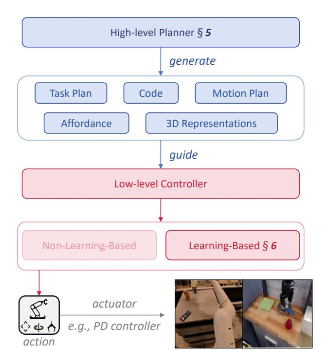

**Figure 11** | Method taxonomy for basic manipulation, which provides a unified framework that can be extended to other manipulation tasks.

and decodes actions through an MLP. GR00T N1 [\[260\]](#page-101-9) further integrates visual and tokenized language features via a VLM before feeding them into a diffusion-based head. Humanoid-VLA [\[261\]](#page-101-10) aligns language and action spaces using cross-attention to fuse visual features, while TrajBooster [\[351\]](#page-108-7) introduces a loco-manipulation VLA trained with retargeted data from real-world to simulation.

**Challenges.** In addition to challenges such as multimodal perception, balance–manipulation coupling, and high degrees of freedom, humanoid manipulation also struggles with enabling multi-agent collaboration. For instance, CooHOI [\[358\]](#page-109-1) exploits object dynamics as an implicit communication channel to achieve coordinated manipulation across multiple agents. To further address the sim-to-real gap, Lin et al. [\[359\]](#page-109-2) introduce a generalizable reward formulation and a decoupled RL architecture, which improve sample efficiency through staged training.

# **5. High-level Planner**

High-level planning in robot manipulation provides structured guidance for low-level execution by deciding what actions to perform, in which order, and which parts of the environment to attend to. LLMs and multimodal LLMs (MLLMs) are increasingly used for **task planning**, **code generation**, and even **motion planning**, enabling task decomposition, skill sequencing, and adaptive reasoning grounded in both language and perception. Meanwhile, **affordance learning** and **3D scene representations** contribute actionable mid-level cues that highlight relevant regions and guide decision-making. Together, these approaches establish high-level planning as a flexible guidance layer that integrates reasoning, attention, and scene understanding to support reliable execution across diverse manipulation tasks. We summarize this taxonomy in Figure [12](#page-27-1) and provide a visualization in Figure [13.](#page-28-0)

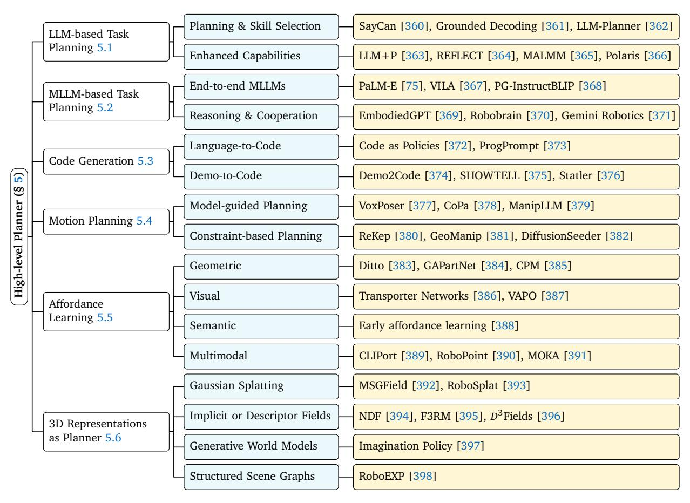

**Figure 12** | Taxonomy of high-level planner approaches, organized by main directions (LLM-based and MLLM-based task planning, code generation, and motion planning) and supporting capabilities (affordance learning and 3D Representations).

### **5.1. LLM-based Task Planning**

Early work adopted a symbolic planning and grounding paradigm, where neural networks mapped demonstrations and observations into symbolic states and goals represented as predicate truth values [\[399\]](#page-112-6). With the advent of LLMs, this approach has largely been supplanted. SayCan [\[360\]](#page-109-3) pioneered the use of LLMs as global planners by combining a learnable affordance function, estimating skill success probabilities, with language-model–based task relevance, thereby selecting the most promising skill for execution. Grounded Decoding [\[361\]](#page-109-4) further removes the fixed skill set, enabling token-level joint decoding between the LLM and grounding model to support open-vocabulary planning. A remaining limitation of both methods is the absence of feedback. To address this, Inner Monologue [\[400\]](#page-112-7) introduces a closed-loop framework that incorporates real-time feedback from task success, scene descriptions, and human interaction into the LLM reasoning process, allowing dynamic plan adjustment in unstructured environments. Similar feedback-driven planning has also been explored in LLM-Planner [\[362\]](#page-109-5). In addition, several studies address broader limitations of using LLMs as planners. LLM+P [\[363\]](#page-109-6) enhances long-horizon reasoning and planning capabilities. REFLECT [\[364\]](#page-109-7) introduces a failure-aware mechanism that reviews unsuccessful interactions and generates corrective plans. MALMM [\[365\]](#page-109-8) explores multi-LLM collaboration to improve decisionmaking. Polaris [\[366\]](#page-109-9) and Matcha [\[401\]](#page-112-8) tackle more open-ended task interactions, while RoCo [\[402\]](#page-112-9) extends LLM planning to multi-robot collaboration, further contributing RoCoBench, a benchmark specifically designed for multi-robot manipulation tasks.

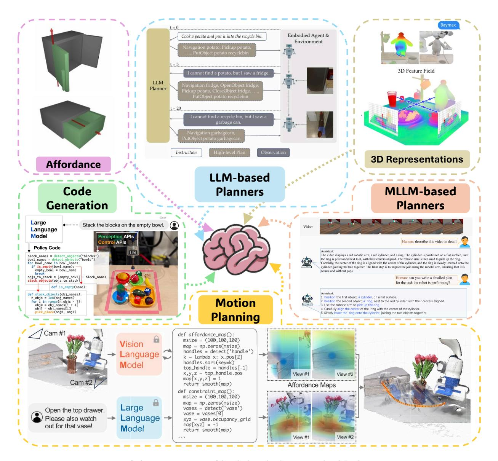

**Figure 13** | Overview of the taxonomy of high-level planners, highlighting six core components: LLM-based task planning, MLLM-based task planning, code generation, motion planning, affordance learning, and 3D scene representations. Figure adapted from [\[362,](#page-109-5) [369,](#page-110-0) [372,](#page-110-3) [377,](#page-110-8) [383,](#page-111-3) [395\]](#page-112-2).

### **5.2. MLLM-based Task Planning**

Traditional LLMs are inherently unimodal, processing only textual information. Other modalities, such as visual inputs, are typically handled by separate models, with their outputs converted into text before MLLMs [\[3,](#page-82-1) [76,](#page-87-6) [403\]](#page-112-10), an increasing number of studies now leverage these models to enhance robot manipulation, aiming to improve performance while reducing system complexity.

Among the most influential works, PaLM-E [\[75\]](#page-87-5) fine-tunes a visual–language model on a curated embodiment dataset and co-trains it with traditional vision–language tasks to preserve PaLM's [\[74\]](#page-87-4) general capabilities. This enables PaLM-E to act as an end-to-end decision maker, though at the cost of massive data requirements and high computational demand. In contrast, VILA [\[367\]](#page-109-10) directly employs GPT-4V without fine-tuning, leveraging its strong visual grounding and language reasoning to achieve state-of-the-art results. A more lightweight approach is PG-InstructBLIP [\[404\]](#page-112-11), which

fine-tunes InstructBLIP [\[368\]](#page-109-11) on an object-centric dataset annotated with physical concepts, thereby enhancing the model's physical reasoning capabilities for robotic control.

Beyond model design, several works investigate techniques to further boost MLLM-based planning. EmbodiedGPT [\[369\]](#page-110-0) adapts chain-of-thought (CoT) reasoning [\[405\]](#page-113-0) to robotics by prefix fine-tuning BLIP-2 [\[403\]](#page-112-10) on EgoCOT and EgoVQA datasets, while Zhang et al. [\[406\]](#page-113-1) introduce fine-grained rewardguided CoT. Scene graph integration is also explored, as in SoFar [\[407\]](#page-113-2) and EmbodiedVSR [\[408\]](#page-113-3), to improve spatial reasoning. Multi-agent collaboration is pursued in Socratic Models [\[409\]](#page-113-4) and Socratic Planner [\[410\]](#page-113-5), enabling zero-shot control through coordinated LLM/MLLM agents. Other works target failure handling, such as AHA [\[411\]](#page-113-6), which improves planning by teaching VLMs to detect and explain failures.

Finally, specialized MLLMs have been developed to meet the specific requirements of robotics. Models such as RoboBrain [\[370\]](#page-110-1), RoboBrain 2 [\[412\]](#page-113-7), Gemini Robotics [\[371\]](#page-110-2), and RynnEC [\[413\]](#page-113-8) are trained on large-scale, robot-centric datasets and provide dedicated benchmarks, consistently surpassing general-purpose MLLMs in manipulation planning. These models exhibit strong capabilities in reasoning, task planning, and affordance recognition, and can also be discussed in the context of affordance learning.

### **5.3. Code Generation**

Although employing LLMs or MLLMs for task decomposition has shown strong potential in robot manipulation, these approaches may still face limitations in providing sufficiently fine-grained control for diverse environments. To complement task planning, recent studies explore directly generating code via LLMs and MLLMs, offering a more flexible mechanism for bridging high-level reasoning and low-level execution. Venkatesh et al. [\[414\]](#page-113-9) may be one of the earliest works to map natural language instructions into programming code, though without leveraging modern foundation models. Code as Policies [\[372\]](#page-110-3) extends this idea by introducing perception and control programming interfaces as prompts for an LLM, enabling the direct generation of executable code to govern robot behavior. ProgPrompt [\[373\]](#page-110-4) presents a similar approach, demonstrating the flexibility of code-driven control in manipulation. In addition, Vemprala et al. [\[415\]](#page-113-10) propose a reusable engineering pipeline that integrates ChatGPT into robotic systems for online code-based control. Collectively, these studies highlight code generation as a promising complement to task planning, enabling finer-grained and more adaptive control.

Building on these studies, a variety of code-driven policies have been proposed for robot manipulation. Instruct2Act [\[416\]](#page-113-11) improves multimodal instruction following and zero-shot generalization by leveraging state-of-the-art visual foundation models such as SAM and CLIP. Demo2Code [\[374\]](#page-110-5) extends the chain-of-thought framework by summarizing long-horizon demonstrations into executable code, while SHOWTELL [\[375\]](#page-110-6) directly translates raw visual demonstrations into policy code without relying on textual intermediates. Statler [\[376\]](#page-110-7) addresses the context-length limitation of LLMs by maintaining an explicit world state, significantly outperforming Code as Policies [\[372\]](#page-110-3). To enhance robustness in closed-loop control, HyCodePolicy [\[417\]](#page-113-12) integrates symbolic logs with perceptual feedback from vision-language models, enabling more reliable execution in dynamic environments.

### **5.4. Motion Planning**

In contrast to previous research, another line of work aims to leverage LLMs and VLMs to directly plan robot motion trajectories. As a representative study, VoxPoser [\[377\]](#page-110-8) introduces a 3D value map, based on both the VLM and LLM, to guide the motion of the robot's end-effector. This 3D value map is then used as the target function for the motion planner, generating a smooth and dense motion trajectory

for the controller. CoPa [\[378\]](#page-110-9) proposes leveraging more concrete knowledge from the VLM to assist the planner in generating physically feasible motion trajectories. Building on a similar perspective, ManipLLM [\[379\]](#page-110-10) introduces an object-centric manipulation framework that interacts with various objects at the most appropriate contact points. It creates a contact-rich manipulation dataset to fine-tune an adapter for the VLM, thereby optimizing performance. Moreover, ReKep [\[380\]](#page-111-0) introduces relational keypoint constraints to enhance the spatial feasibility of motion planning. This method autonomously generates the optimized trajectory using only the LLM and VLM, without requiring any human annotations. GeoManip [\[381\]](#page-111-1) also presents an approach that leverages geometric constraints to generate motion trajectories with improved interpretability. Particularly, in addition to the use of LLMs and VLMs, there are studies that explore the application of visual-based foundation models or diffusion models for motion planning, as seen in [\[382,](#page-111-2) [418\]](#page-114-0).

### **5.5. Affordance as Planner**

A unified understanding of robot manipulation requires moving beyond asking *what* things are to discerning *what can be done* with them. The concept of affordance, originating from psychologist J.J. Gibson, provides a powerful framework for this shift [\[419\]](#page-114-1). In robotics, an affordance represents the potential for interaction an object or environment offers relative to an agent's capabilities—a door affords opening, a surface affords placing. By intrinsically linking perception to action, affordances serve as a foundational bridge for building more general and intelligent manipulation systems.

The study of affordances has evolved from early model-based geometric reasoning to modern data-driven paradigms. The rise of deep learning, in particular, now enables robots to learn functional properties directly from raw sensory data, often through self-supervised interaction or by leveraging the vast knowledge embedded in foundation models. This chapter explores the central role of affordance in this modern context, dissecting the concept from four critical perspectives based on the primary source of information: geometric, visual, semantic, and multimodal.

**Geometric Affordance.** Geometric affordance theory holds that an object's functional possibilities are determined by its three-dimensional shape, structure, and kinematics. Research in this area often focuses on inferring kinematic models, including parts, joints, and movement constraints, directly from geometry [\[383,](#page-111-3) [384,](#page-111-4) [420\]](#page-114-2). For instance, Ditto [\[383\]](#page-111-3) acquires articulation models by physically probing objects and observing their responses. A central principle for generalizing geometric affordances is *compositionality*, which interprets the function of a complex object as the combination of its functional parts [\[384,](#page-111-4) [385,](#page-111-5) [420\]](#page-114-2). GAPartNet [\[384\]](#page-111-4) established cross-category part taxonomies that enable policies to generalize skills across object instances, such as learning to manipulate "any handle" rather than only "a specific mug's handle." Building on this idea, CPM [\[385\]](#page-111-5) represents complex actions as structured compositions of geometric constraints between object parts rather than as monolithic skills.

**Visual Affordance.** Visual affordance focuses on directly learning interaction possibilities from 2D visual data, such as RGB or RGB-D images. This paradigm typically formulates manipulation as a visual correspondence problem, learning to produce dense, pixel-wise affordance maps that indicate where an action can be performed [\[386,](#page-111-6) [387,](#page-111-7) [421–](#page-114-3)[423\]](#page-114-4). The seminal Transporter Networks [\[386\]](#page-111-6) established this approach by using a spatially equivariant architecture to predict pick-and-place heatmaps via feature matching. This powerful "where" pathway grounds manipulation directly in the pixel space without needing explicit object models. The scalability of this idea was later enhanced by methods like VAPO [\[387\]](#page-111-7), which demonstrated that such visual affordance maps could be learned in a self-supervised manner from unstructured "play" data, significantly reducing the reliance on expert demonstrations.

**Semantic Affordance.** Semantic affordance investigates the relationship between high-level symbolic concepts and robotic actions. Prior to the advent of modern foundation models, research in this area primarily examined how human-defined semantic labels, such as object categories or part names, could inform robot behavior. This perspective marked an early attempt to connect symbolic reasoning with physical interaction, laying the groundwork for today's multimodal approaches. For instance, early work on affordance-based imitation learning [\[388\]](#page-111-8) explored how robots could acquire manipulation skills by associating semantic properties with observed human actions. By linking object parts such as "handles" or "lids" to specific manipulation trajectories, robots were able to generalize learned behaviors to novel objects with similar semantic attributes. Although constrained by the reliance on pre-defined semantic categories, this line of research demonstrated the value of abstract, human-interpretable knowledge as a strong prior for guiding robot learning.

**Multimodal Affordance.** The frontier of affordance learning is shifting toward multimodal fusion, powered by the reasoning and grounding capabilities of MLLMs. By jointly leveraging visual appearance, linguistic instruction, spatial context, and geometric structure, these approaches move beyond unimodal cues to build a holistic understanding of interaction potential. A major line of work combines language with vision to ground high-level instructions in scenes. CLIPort [\[389\]](#page-111-9), for example, introduced a two-stream architecture with a semantic "what" pathway for interpreting language and a spatial "where" pathway for action localization, a principle later extended to object parts [\[424,](#page-114-5) [425\]](#page-114-6). Another direction focuses on explicit 3D spatial reasoning, enabling models to capture metric properties such as distance, orientation, and layout [\[390,](#page-111-10) [426–](#page-114-7)[428\]](#page-114-8); RoboPoint [\[390\]](#page-111-10), for instance, translates spatial language into concrete pixel-level affordance points. At the same time, interaction is evolving into multimodal dialogue, where visual prompting [\[391\]](#page-111-11) and interactive correction frameworks [\[429\]](#page-114-9) allow models to disambiguate intent and recover from failure. Finally, a key goal is to learn unified and transferable affordance representations across object types and tasks [\[430](#page-114-10)[–432\]](#page-115-0), advancing toward general-purpose affordance reasoning for robust manipulation in open-world environments.

### **5.6. 3D Representation as Planner**

Although 3D representations such as Gaussian Splatting and Neural Descriptor Fields do not directly generate control signals, they act as mid-level planning modules by producing structured action proposals (e.g., 6-DoF grasps, relational rearrangements, or optimization costs). In this sense, they bridge perception and action, and are therefore included under the category of high-level planning. Recent research on manipulation has increasingly converged on 3D scene representations that transform perception into actionable proposals rather than complete task plans. Two main trends drive this direction: (1) editable, real-time Gaussian Splatting (GS) variants that integrate geometry with semantics and motion to enable scene editing, and (2) implicit or descriptor fields that distill features from 2D foundation models into 3D for correspondence and language grounding.

**Gaussian-splatting Scene Representations and Editing.** Splat-MOVER builds a modular stack (ASK/SEE/Grasp-Splat) for open-vocabulary manipulation by distilling semantics or affordances into a 3DGS "digital twin", then proposing grasp candidates for planning [\[433\]](#page-115-1). Object-Aware GS adds object-centric, 30 Hz dynamic reconstruction with semantics [\[434\]](#page-115-2). Physically Embodied GS couples particles (physics) to 3DGS (vision) for a real-time, visually-correctable world model [\[435\]](#page-115-3). MSGField uses 2DGS with attached motion/semantic attributes for language-guided manipulation in dynamic scenes [\[392\]](#page-111-12). RoboSplat directly edits 3DGS reconstructions to synthesize diverse demonstrations (objects, poses, views, lighting, embodiments), substantially boosting one-shot visuomotor policy generalization [\[393\]](#page-112-0).

**Implicit or Descriptor Fields.** NDF learns SE(3)-equivariant descriptors for few-shot pose trans-

fer [\[394\]](#page-112-1); R-NDF extends to relational rearrangement across objects [\[436\]](#page-115-4); F3RM distills CLIP features into 3D fields for few-shot, language-conditioned grasp and place [\[395\]](#page-112-2); 3Fields builds dynamic 3D descriptor fields that support zero-shot rearrangement via image-specified goals [\[396\]](#page-112-3).

**Generative World Models.** Imagination Policy "imagines" target point clouds and converts them to keyframe actions via rigid registration, effectively casting action inference as a local generative task and achieving strong results on real robots [\[397\]](#page-112-4).

**Structured Scene Graphs.** RoboEXP incrementally constructs an action-conditioned scene graph via interactive exploration, enriching the state with action-relevant relations for downstream manipulation [\[398\]](#page-112-5).

# **6. Low-level Learning-based Control**

Low-level learning-based control focuses on how robots transform perception into executable actions, serving as the foundation that grounds high-level planning into physical execution. While high-level planning determines what to do and in what order, such as task decomposition, skill sequencing, or goal reasoning, low-level control determines how to act by learning precise visuomotor mappings that enable robust manipulation in dynamic environments. The two are inherently complementary: high-level planners provide structured intent and semantic context, whereas low-level controllers translate these plans into continuous, dynamically stable motor commands. Within this framework, learning strategies such as imitation and reinforcement learning define the overarching paradigm of how to learn. Building on this foundation, we propose a new taxonomy that decomposes low-level learning-based control into three core and interdependent components: input modeling, which determines what sensory modalities to use and how to encode them; latent learning, which focuses on how to represent perception into compact and transferable embeddings; and policy learning, which defines how to decode latent representations into executable actions. Together, this new perspective provides a unified view of low-level control, integrating perception, representation, and decision-making, and bridging high-level reasoning with real-world robotic execution.

### **6.1. Learning Strategy**

### *6.1.1. Reinforcement Learning*

In robotic manipulation, reinforcement learning (RL) has emerged as a central paradigm for acquiring complex skills. By leveraging high-dimensional perceptual inputs (e.g., vision or proprioception) and reward signals as feedback, RL enables agents to learn control policies through trial-and-error interaction with the environment. This section reviews RL methods for robotic manipulation from both theoretical and application perspectives. We categorize existing approaches into two main classes: model-free and model-based algorithms, depending on whether the agent exploits an explicit or learned dynamics model to guide the learning process. Representative methods across these categories are summarized in Table [8.](#page-33-0)

### **i) Model-free Methods**

In robotic manipulation, model-free methods refer to RL algorithms that do not rely on explicit models of the environment dynamics. Instead, they learn policies directly through trial-and-error interactions with the environment, guided by perceptual inputs and reward signals. The main advantage of model-free approaches is their ability to handle high-dimensional, nonlinear tasks without requiring accurate system modeling, making them well suited for complex manipulation scenarios. However, these methods typically suffer from low sample efficiency and high data requirements,

**Table 8** | Representative RL methods for manipulation tasks.

| Category       | Subcategory                                                        | Representative Methods                                                                                                                                  |
|----------------|--------------------------------------------------------------------|---------------------------------------------------------------------------------------------------------------------------------------------------------|
| Model-Free RL  | Pre-Training Fine-Tuning VLA-RL                              | QT-Opt [437], PTR [438], V-PTR [439] Residual RL [440], RLDG [441], V-GPS [442], PA-RL [443] iRe-VLA [444], RIPT [445], VLA-RL [446], PA-RL [447] |
| Model-Based RL | Imagination Trajectory Generation Planning Differentiable RL | Dreamer [448], MWM [449] GPS [450], TD-MPC [451] SAPO [452], SAM-RL [453], DiffTORI [454]                                                         |

which has motivated research on pre-training, imitation learning, and hybrid paradigms to improve their scalability and practicality. We categorize these methods into three groups.

**RL in Pre-Training.** Benefiting from advances in foundation model research, the pre-training paradigm has also demonstrated significant potential in the field of robotic reinforcement learning, offering new solutions to overcome the limitations of traditional RL methods in terms of sample efficiency [\[438,](#page-115-6) [455,](#page-116-11) [456\]](#page-116-12), generalization [\[457,](#page-117-0) [458\]](#page-117-1), and scalability [\[437,](#page-115-5) [439,](#page-115-7) [459\]](#page-117-2). QT-Opt [\[437\]](#page-115-5) provides a scalable self-supervised reinforcement learning framework for vision-based robotic grasping. PTR [\[438\]](#page-115-6) introduces a framework that enables robots to quickly adapt to unseen environments and tasks with a small number of new demonstrations by leveraging offline RL pre-training on a large-scale dataset. V-PTR [\[439\]](#page-115-7) goes a step further by taking advantage of a massive scale of human demonstration data available on the internet. Trains a value function to extract robust, manipulationrelevant visual representations, which are then fine-tuned for downstream tasks. Beyond pretraining strategies and value functions, training speed on new tasks can also be accelerated by pretraining reward functions. ReWiND [\[456\]](#page-116-12) pretrains a language-conditioned reward function on a small number of demonstrations and a subset of the Open-X dataset [\[147\]](#page-93-0) through automated augmentation of language and video data, which is then used to optimize the policy further. Overall, RL-based pre-training frameworks can substantially enhance both the generalization capability and learning efficiency of robots deployed in real-world environments. These approaches also aim to scale up various components of the RL algorithm from multiple dimensions.

**RL in Fine-Tuning.** Building on the strengths of pre-training, efficient fine-tuning for downstream tasks has become a critical research direction. Recent studies aim to design versatile post-training frameworks that offer plug-and-play compatibility across diverse pre-trained policy architectures. Residual RL [\[440,](#page-115-8) [460,](#page-117-3) [461\]](#page-117-4) learns a residual policy whose outputs are added to those of the base policy to form the final actions. RLDG [\[441\]](#page-115-9) introduces policy distillation, using specialist singletask policies to generate high-quality data for training generalist policies. V-GPS [\[442\]](#page-115-10) provides a non-invasive approach that requires neither fine-tuning nor access to policy weights; instead, it re-ranks action candidates during inference with a learned value network. Similarly, PA-RL [\[443\]](#page-115-11) generalizes across policy architectures by sampling multiple candidate actions from a base policy, applying Q-function-based global re-ranking, and refining individual actions through local gradient ascent.

**RL for VLA Models.** VLA, as a special class of generalist models, has attracted significant research attention in the field, with numerous studies focusing on designing efficient reinforcement learning post-training schemes for VLA models [\[444–](#page-116-0)[447,](#page-116-3) [462](#page-117-5)[–466\]](#page-117-6). iRe-VLA [\[444\]](#page-116-0) proposed a robust posttraining pipeline that iteratively executes online RL for efficient exploration and IL on both expert and collected online data. RIPT [\[445\]](#page-116-1) introduces a simple and critic-free VLA-RL framework that extends the Leave-One-Out PPO (LOOP [\[467\]](#page-117-7)) algorithm to estimate advantage functions for each sampled trajectory, allowing significant performance improvements over supervised fine-tuning with minimal demonstrations through online RL. ConRFT [\[447\]](#page-116-3) proposes a comprehensive post-training

pipeline that employs a unified consistency-based training objective that combines RL and IL in both the offline and online phases.

### **ii) Model-based Methods**

In robotic manipulation, model-based methods refer to RL approaches that exploit explicit or learned models of environment dynamics to facilitate policy learning. By predicting state transitions and rewards, these methods enable planning, sample-efficient policy optimization, and reasoning over long-horizon tasks. Compared to model-free approaches, model-based methods often achieve higher data efficiency and better interpretability, but their performance is limited by the accuracy of the dynamics model, which can be difficult to obtain in high-dimensional or contact-rich manipulation scenarios. We also categorize these methods into three groups.

**Imagination Trajectory Generation.** In model-based RL algorithms, the most straightforward approach is the Dyna-style method [\[468\]](#page-117-8), which utilizes the model to generate additional transition data for training model-free RL algorithms. Several recent related research approaches [\[449,](#page-116-5) [469–](#page-117-9) [472\]](#page-118-0) are largely built upon the theoretical framework of the Dreamer series [\[448,](#page-116-4) [473,](#page-118-1) [474\]](#page-118-2), which learns task-relevant visual representations by training a latent-space world model through supervised learning with data, and generates virtual data by performing imaginary rollouts in the latent space, which is then added to the RL training data pool. DayDreamer [\[470\]](#page-117-10) extends this algorithm to real-world robotic training scenarios, achieving human-level performance in both UR5 multi-object visual pick-and-place and XArm visual pick-and-place tasks in under 10 hours of autonomous learning in wall-clock time. MWM [\[449\]](#page-116-5) employs a masked autoencoder [\[475\]](#page-118-3) paradigm to train more robust visual representations, demonstrating significantly improved training efficiency compared to the Dreamer baseline on both the Meta-World and RL-Bench benchmarks for simulated robotic manipulation tasks.

**Planning.** Sample efficiency in RL can also be improved by utilizing it in a planning capacity, where the policy leverages a model to generate improved trajectories and foster policy improvement. The GPS series [\[8,](#page-82-4) [450,](#page-116-6) [476–](#page-118-4)[478\]](#page-118-5) parameterizes a linearized local model and employs algorithms such as the iterative linear quadratic regulator (iLQR) to derive an analytical solution for actions, which serves as the target for supervised learning on the policy. TD-MPC series [\[451,](#page-116-7) [479\]](#page-118-6) learns an RL policy, a value function, and a dynamics model simultaneously. It uses trajectories generated by the RL policy as starting points and optimizes cumulative rewards through the cross-entropy method. VLAPS [\[480\]](#page-118-7) uses VLA-derived action priors and uses Monte Carlo tree search (MCTS) to select the action sequence executed in the simulator.

**Differentiable RL.** Differentiable RL applies when environmental dynamics and reward functions are differentiable, allowing policy parameters to be optimized directly through the differentiable expected return. While real-world data lacks this property, it can be realized using differentiable physics simulators or neural network-based dynamics models for trajectory generation. Consequently, differentiable RL can be viewed as a generalized variant of model-based algorithms. SAPO [\[452\]](#page-116-8) is an RL algorithm based on analytic simulation gradients, integrated with a self-developed differentiable physics simulation platform, enabling efficient policy optimization in a variety of dexterous manipulation tasks. Compared to non-differentiable RL methods, this framework demonstrates significant improvements in sample efficiency. SAM-RL [\[453\]](#page-116-9) leverages differentiable simulation and rendering to automatically update the real-to-sim model through rendered-real image comparison and generate policies, and efficiently learns the policy in simulation. DiffTORI [\[454\]](#page-116-10) enhances TD-MPC by incorporating first-order model-based optimization to refine the actions generated by the RL policy through gradient guidance.

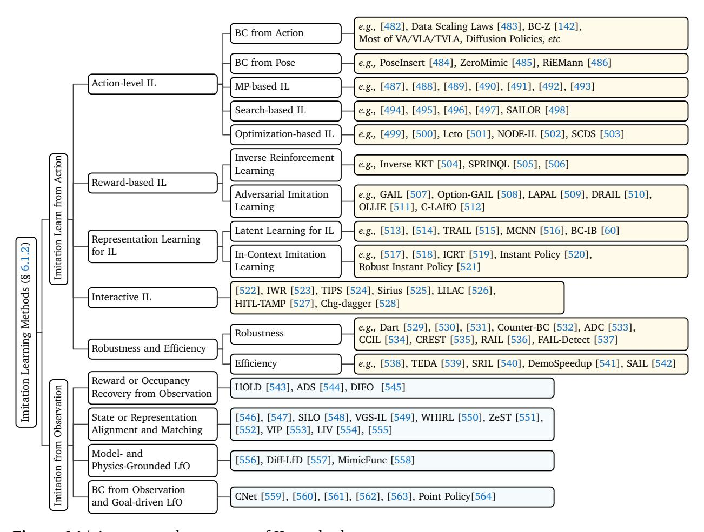

**Figure 14** | A structured taxonomy of IL methods.

### *6.1.2. Imitation Learning*

In 1999, Schaal et al. [\[481\]](#page-118-13) proposed imitation learning (IL) as a key pathway for enabling robots to acquire efficient motor skills, visuomotor coordination, and modular control. Since then, IL has evolved into a central paradigm for learning complex manipulation behaviors. Compared to RL, IL avoids the need for costly reward design and extensive environment interaction.

Early studies were grounded in control-theoretic formulations with limited perception–action integration. Over time, the field has embraced deep architectures such as ResNets and Transformers, later incorporating large-scale visual and multimodal pretraining, and most recently integrating large language and vision models. Current advances emphasize multimodal fusion, efficient and robust policy learning, scalable data utilization, and generative modeling. Looking forward, promising directions include: foundation-model-driven IL that combines VLA models and LLMs with robotics; causal IL grounded in do-calculus and counterfactual reasoning; generalization and transfer across tasks and embodiments; safe and reliable deployment through certification and runtime monitoring; and more efficient human–robot interaction to reduce dependence on human feedback during learning. In this subsection, we primarily focus on state-based and visual imitation learning, as summarized in Figure [14.](#page-35-0) For a discussion of language-related approaches, readers may refer to Section [6.2.2.](#page-47-1)

### i) **Imitation from Action**

Imitation Learning from Action assumes access to expert demonstrations in the form of state–action

pairs, where both the sensory states (e.g., robot configurations and environment observations) and the corresponding expert control commands (e.g., end-effector actions and poses) are available.

**Action-level IL.** Action-level IL focuses on directly learning control policies from expert demonstrations at the action or trajectory level. Rather than inferring high-level goals or task abstractions, these methods map observed states to executable actions, poses, or motion primitives, thereby emphasizing precise motor control, trajectory generation, and stability in manipulation.

• **Behavior Cloning (BC).** *BC from Action* learns a direct mapping from states to low-level control commands based on expert state–action pairs. Early studies relied on non-parametric or regression-based methods [\[565\]](#page-124-8), later expanding into hierarchical architectures [\[482,](#page-118-8) [566,](#page-124-9) [567\]](#page-124-10), multimodal generalization [\[568\]](#page-124-11), stability-constrained training [\[536,](#page-122-6) [569\]](#page-124-12), cross-embodiment transfer, human–robot collaboration [\[570\]](#page-125-0), and the integration of structural priors [\[571](#page-125-1)[–574\]](#page-125-2). More recently, efficient Transformer-based multi-task policies have improved scalability and reusability under limited data conditions [\[575\]](#page-125-3). Additional studies investigate fine-tuning strategies for model components [\[576\]](#page-125-4), architectural comparisons [\[577\]](#page-125-5), and scaling laws [\[483\]](#page-118-9), while others propose end-to-end frameworks encompassing data collection, training, and deployment [\[578,](#page-125-6) [579\]](#page-125-7). Overall, BC from action has evolved beyond supervised imitation into a paradigm emphasizing efficiency, robustness, structural priors, and adaptability, with growing emphasis on language-integrated interaction that advances action-level supervision toward general-purpose manipulation.

*BC from Pose* abstracts away low-level control by predicting end-effector poses in SE(3), leaving tracking to IK or force controllers. This geometry-aware formulation improves precision, transferability, and robustness. Representative works include PoseInsert [\[484\]](#page-118-10), which leverages relative SE(3) as a core representation to learn pose-guided policies for sub-millimeter insertion, optionally fusing RGB-D cues; ZeroMimic [\[485\]](#page-118-11), which distills skills from in-the-wild human videos into deployable, imagegoal–conditioned policies via pose and geometry alignment; and RiEMann [\[486\]](#page-118-12), which develops an SE(3)-equivariant pipeline to predict 6-DoF target poses in real time without explicit segmentation. Collectively, these approaches highlight the strengths of pose-level cloning for high-precision tasks and generalization across scenes and embodiments.

- **MP-based IL.** Movement primitives (MPs) encode demonstrations as parameterized trajectories or dynamical systems, providing a compact and generalizable skill representation. Dynamic Movement Primitives (DMPs) introduced the idea of using stable attractor systems to reproduce and adapt demonstrated motions [\[487,](#page-119-0) [488\]](#page-119-1). This was later extended to Probabilistic Movement Primitives (ProMPs), which model a distribution over trajectories for uncertainty handling and skill blending [\[489\]](#page-119-2). To further capture temporal variability, Hidden Semi-Markov Models (HSMMs) were incorporated for segmenting and sequencing skills [\[490\]](#page-119-3). Beyond trajectory modeling, MPs have been integrated with task constraints for safe and flexible execution [\[491\]](#page-119-4), and extended to hybrid force or motion primitives to support compliant manipulation [\[492\]](#page-119-5). More recent efforts adapt MPs to broader contexts, such as dynamical system-based IL for visual servoing [\[493\]](#page-119-6). Overall, MP-based IL has evolved from trajectory reproduction toward probabilistic, temporal, constraint-aware, and task-specific extensions, demonstrating its versatility in robotic manipulation.
- **Search-based IL.** It views imitation learning as a search problem in the space of trajectories or policies. Early works pioneered imitation learning by modeling it as a search for optimal strategies [\[494\]](#page-119-7). This approach was subsequently formalized within the Learning to Search (L2S) framework, utilizing functional gradient optimization [\[495\]](#page-119-8) or incorporating world models [\[498\]](#page-119-11). Building on this foundation, planner-in-the-loop methods use task-and-motion planning (TAMP) for subgoal sequences and trajectories and then distill planner rollouts into hierarchical policies [\[496\]](#page-119-9)—closing a "learn-to-search" loop in which the learned policy also accelerates or prunes subsequent planning [\[497\]](#page-119-10). Overall, Search-based IL has evolved from early search heuristics toward principled

optimization frameworks and structured prediction, highlighting its role in mitigating covariate shift and improving long-horizon policy learning.

• **Optimization-based IL.** It formulates imitation learning as an optimization problem, typically integrating trajectory optimization, constraint satisfaction, or differentiable planning. Policies are obtained by optimizing an objective that combines imitation loss with task-specific constraints. Early works combined IL with task constraints and control optimization [\[499\]](#page-119-12), followed by methods that incorporate temporal logic to ensure safe and interpretable execution [\[500\]](#page-119-13). More recent efforts leverage differentiable trajectory optimization for end-to-end visuomotor policy learning [\[501\]](#page-119-14), and continuous-time dynamical formulations such as Neural ODEs for long-horizon, multi-skill manipulation [\[502\]](#page-120-0). The latest advances further highlight stability and robustness, exemplified by contractive dynamical policies that guarantee efficient recovery in out-of-distribution scenarios [\[503\]](#page-120-1). Overall, Optimization-based IL has evolved from trajectory optimization to differentiable, constraint-aware, and stability-driven formulations, underscoring its potential for reliable and scalable robotic imitation.

**Reward-based IL.** Reward-based IL aims to recover an underlying reward or cost function that explains expert demonstrations and subsequently optimize a policy under this learned objective. Unlike direct behavior cloning, which fits action mappings in a supervised manner, reward-based IL infers why an expert acts optimally—enabling more generalizable, interpretable, and adaptable policies through reinforcement-based optimization.

- **Inverse Reinforcement Learning (IRL).** It seeks a reward or cost under which expert trajectories are nearly optimal, then derives a policy by planning or RL on the learned objective. In manipulation, Inverse KKT instantiates IRL as inverse optimal control by enforcing the KKT conditions on offline demonstrations to recover task costs and active constraints, and then plans with the recovered objective, a formulation well suited to contact-rich skills [\[504\]](#page-120-2). SPRINQL adopts a Q-function formulation, solving an inverse soft Q objective offline on mixed-quality demonstrations to upweight expert data while avoiding adversarial training and online interaction [\[505\]](#page-120-3). A divergenceminimization perspective further unifies BC, GAIL, AIRL, and related methods as instances of fdivergence minimization and introduces f-MAX as a generalization of AIRL, providing a rationale based on state-marginal matching for why IRL often outperforms pure behavior cloning [\[506\]](#page-120-4).
- **Adversarial Imitation Learning (AIL).** has progressed from GAN-based occupancy measure matching to more sample-efficient, vision-robust, and scalable formulations. The paradigm was established by GAIL [\[507\]](#page-120-5). Subsequent work improves perception and representation robustness by learning contrastive or world model latent spaces for video-only and cross-domain observations [\[512,](#page-120-10) [580\]](#page-125-8). Research on reward modeling and discriminator design replaces brittle discriminators with smoother and more informative surrogates such as diffusion-based objectives and integrates human preference signals [\[510,](#page-120-8) [581\]](#page-125-9). Efficiency is increased through offline pretraining followed by lightweight online finetuning, discriminator-guided model-based offline learning, and trajectory-level augmentation with correction [\[511,](#page-120-9) [582,](#page-125-10) [583\]](#page-125-11). Structured policies and latent spaces address long-horizon and high-dimensional control by introducing options and hierarchical organization and by optimizing in low-dimensional latent action spaces [\[508,](#page-120-6) [509\]](#page-120-7). Exploration and stability are strengthened with auxiliary task scheduling and differentiable reward actor-critic formulations, while large-scale empirical audits systematize effective design choices [\[584](#page-126-0)[–586\]](#page-126-1). The methods mentioned above are categorized as IL, since they do not incorporate an inner loop of RL policy optimization during training, whereas those that do are classified under RL+IL.

**Representation Learning for IL.** Representation learning for IL focuses on extracting structured, task-relevant, and generalizable representations from demonstrations to improve policy efficiency, robustness, and adaptability. Rather than directly fitting input–action mappings, these approaches aim to uncover latent factors, temporal dependencies, and contextual cues that underlie expert behavior,

enabling more scalable and transferable manipulation learning.

- **Latent Learning for IL.** Recent advances on latent structure and generalization in imitation learning for manipulation coalesce into three strands. First, latent representation shaping reduces redundancy and enforces task relevance [\[60,](#page-86-4) [515\]](#page-120-13): an information-bottleneck view of behavior cloning compresses inputs to task-sufficient latents, task-relevant adversarial IL constrains the discriminator to avoid spurious cues, multi-intention models capture behavioral multimodality, and Riemannian formulations provide geometry-aware representations for poses and orientations. Second, distribution-level generalization is clarified by information-theoretic and PAC-Bayes analyses that yield explicit generalization bounds and training guidance, while system studies on contact-rich bimanual manipulation highlight the value of force or torque signals for robustness under disturbances and multi-contact regimes [\[513,](#page-120-11) [514,](#page-120-12) [587–](#page-126-2)[589\]](#page-126-3). Third, temporal and memory augmentation improves stability from limited demonstrations [\[516,](#page-121-0) [590,](#page-126-4) [591\]](#page-126-5): demonstration-policy and single-view vision pipelines broaden supervision sources, and memory-consistent neural networks impose hard constraints around prototypical memories to mitigate compounding error with provable sub-optimality bounds.
- **In-Context Imitation Learning (ICIL).** replaces parameter updates with demonstration-asprompt execution: a policy reads a few demonstrations at inference and acts immediately. Current systems instantiate this idea via graph-structured generation that conditions on demonstration graphs to generalize across tasks [\[520\]](#page-121-4), autoregressive next-token prediction over sensorimotor streams that runs zero-shot on real robots [\[517,](#page-121-1) [519\]](#page-121-3), and implicit graph alignment that recovers task-relevant object relations from a handful of examples [\[518\]](#page-121-2). Robustness is improved by Student's-t–based aggregation of multiple candidate trajectories to suppress outliers from instant policies [\[521\]](#page-121-5). Together these works move ICIL from a simple "prompt-and-act" heuristic toward graph-aware, sequence-model, and robust aggregation formulations that execute new manipulation tasks without finetuning.

**Interactive Imitation Learning (IIL).** IIL in manipulation has coalesced around three themes. First, human-in-the-loop corrections delivered via visual teleoperation or language improve data efficiency and robustness, while LLM-based teachers begin to substitute costly human supervision by generating and critiquing policies during training [\[522](#page-121-6)[–524,](#page-121-8) [526,](#page-121-10) [527,](#page-121-11) [592–](#page-126-6)[594\]](#page-126-7). Second, intervention budgeting and control switching reduce supervision load by querying at novel or risky states, minimizing context switches, coordinating human–policy collaboration after failures, and shifting guidance to statespace feedback [\[528,](#page-121-12) [595](#page-126-8)[–597\]](#page-126-9). Third, deployment-time learning and safety close the loop between autonomy and oversight. Sirius couples human–robot division of labor with weighted behavioral cloning for continual improvement, and model-based runtime monitoring anticipates failures and triggers interaction for safe execution [\[525,](#page-121-9) [598\]](#page-126-10). Together, these directions move IIL from lab-style episodic teaching toward low-burden, on-the-job learning with safety guards, while opening the door to AI-in-the-loop supervision at scale.

**Robustness and Efficiency.** Robustness and efficiency in IL address two critical requirements for deploying manipulation policies in real-world environments: reliability under uncertainty and scalability under resource constraints. Robustness focuses on ensuring safe and stable execution in the presence of imperfect data, sensor noise, and distribution shifts, while efficiency emphasizes accelerating learning and inference to achieve real-time performance and practical deployment.

• **Robustness.** Recent work on robust and safe imitation learning for manipulation consolidates three threads. First, robustness to imperfect data is advanced along three lines. Methods either clean and reweight demonstrations via counterfactual consistency and uncertainty-aware handling of label conflicts [\[530,](#page-122-0) [532\]](#page-122-2), augment and stress-test policies through adversarial human-in-the-loop collection [\[533\]](#page-122-3), continuity-based corrective augmentation [\[534\]](#page-122-4), and Bayesian or classical noise injection [\[529,](#page-121-13) [531\]](#page-122-1), or exploit causal interventions [\[535\]](#page-122-5) to isolate task-relevant state variables.

Second, safety and constraints are enforced via reachability-based safety filters that wrap IL policies and provably reduce collisions without sacrificing task success [\[536\]](#page-122-6). Third, failure handling under distribution shift combines object-centric inverse-policy recovery to drive states back toward the training manifold and failure detection without failure data via sequential OOD tests with uncertainty quantification and conformal guarantees [\[537,](#page-122-7) [599\]](#page-127-0). Collectively, these advances move IL toward data-efficient, safety-aware, and deployment-ready manipulation.

• **Efficiency.** A recent line of work pushes imitation learning for manipulation toward faster execution and practical deployment. Current techniques chiefly accelerate training and inference through accelerated or resampled demonstrations, model slimming via parameter reduction, quantization, pruning and distillation, action scheduling, and asynchronous parallelism, thereby improving both throughput and latency [\[538](#page-122-8)[–542\]](#page-122-12).

### **ii) Imitation from Observation**

Imitation Learning from Observation (LfO) assumes access to expert demonstrations only in the form of state or visual trajectories, without the corresponding expert action labels. In this setting, the robot must infer a policy solely from observed state transitions (e.g., videos, motion capture), often without knowing what control commands were executed.

**Reward or Occupancy Recovery from Observation**. LfO methods in this line infer a reward, soft-Q, or occupancy measure directly from video or state trajectories, then optimize a policy with RL or planning. This avoids action labels, tolerates temporal misalignment and sub-optimal demonstrations, and supports cross-domain transfer. Representative works include automatic discount scheduling for observation-only IRL [\[543\]](#page-123-0), human-video–based reward learning for manipulation [\[544\]](#page-123-1), diffusionbased adversarial LfO, and hindsight GAN formulations [\[545\]](#page-123-2).

**State or Representation Alignment and Matching.** A second strand dispenses with explicit rewards and instead matches states or latent representations across viewpoints and embodiments, often leveraging value or semantic pretraining or structural cues [\[546](#page-123-3)[–555,](#page-123-12) [600\]](#page-127-1). Examples include dual formulations for offline LfO [\[555\]](#page-123-12), value-implicit and language-image pretraining that supply transferable visual priors [\[551,](#page-123-8) [553,](#page-123-10) [554\]](#page-123-11), interaction-field templates for object manipulation [\[552\]](#page-123-9), selective or ergodic matching that filters what to imitate [\[548,](#page-123-5) [600\]](#page-127-1), graph-structured visual imitation [\[547\]](#page-123-4), and large-scale in-the-wild alignment studies [\[550\]](#page-123-7).

**Model- and Physics-Grounded LfO.** This line ties visual demonstrations to dynamics and contact via differentiable simulators or model identification, projecting videos into physically consistent trajectories before control optimization. Differentiable-physics LfO and contact-aware learning from visual demonstration exemplify how physics priors improve sample efficiency and reliability in contactrich manipulation [\[556,](#page-123-13) [557\]](#page-124-0).

**BC from Observation and Goal-driven LfO.** Policies are derived directly from videos by extracting keypoints, poses, goals, or command sequences and training or conditioning an executable controller without action labels [\[559\]](#page-124-2). Recent systems unify observations and actions via keypoints [\[564\]](#page-124-7), use eye-in-hand human videos for generalizable control [\[563\]](#page-124-6), perform zero-shot manipulation from passive human videos [\[562\]](#page-124-5), learn sensorimotor primitives from visual sequences [\[561\]](#page-124-4), and reason over goals to issue commands from vision [\[560\]](#page-124-3).

### *6.1.3. Bridging Reinforcement and Imitation Learning*

The integration of reinforcement learning (RL) and imitation learning (IL) for robotic manipulation can be systematically organized into six categories, as summarized in Table [9.](#page-40-1) First, unified frameworks establish a shared optimization substrate that allows principled switching and combination of super-

**Table 9** | Representative methods combining RL and IL for manipulation tasks.

| Category                         | Representative Methods                                                                                                                                                        |
|----------------------------------|-------------------------------------------------------------------------------------------------------------------------------------------------------------------------------|
| Methods support for RL and IL    | Frame Mining [601], Dual RL [629]                                                                                                                                             |
| IL Pre-training + RL Fine-tuning | SkiLD [603], FERM [604], Q-attention [605], CSIL [606], [602], PLANRL [607], HIL-SERL [267], Sketch-to-Skill [608]                                 |
| RL Pre-training + IL Fine-tuning | MoPA-PD [609], [610]                                                                                                                                                          |
| Reward Shaping from IL           | MaxEnt IOC [611], [612], [614], LbW [615], [616], [617], Robo CLIP [618], IRIS [619], ORIL [620], [621], ResiP [622], ORCA [623], Concept2Robot [630] |
| Joint Optimization               | [624], AW-Opt [625], [626], IN-RIL [627]                                                                                                                                      |
| In-Context RL                    | DCRL [628]                                                                                                                                                                    |

vision sources [\[555,](#page-123-12) [601\]](#page-127-2). Second, pretraining followed by finetuning accelerates learning in both directions: IL pretraining followed by RL finetuning enables rapid policy initialization and surpasses demonstrator performance [\[267,](#page-102-2) [602–](#page-127-3)[608\]](#page-127-9), while RL pretraining followed by IL finetuning aligns general skills with specific downstream tasks or real-world robots [\[609,](#page-127-10) [610\]](#page-127-11). Third, reward and goal shaping from IL transforms demonstrations or videos into optimizable objectives, including rewards inferred through inverse optimal control or preference learning [\[611,](#page-127-12) [612\]](#page-127-13), perceptual or semantic signals obtained via representation matching or goal proximity [\[613–](#page-128-13)[618\]](#page-128-4), and implicit rewards or values derived from demonstrations and unlabeled experiences [\[619](#page-128-5)[–621\]](#page-128-7). IL-derived objectives can also initialize RL refinement pipelines for fine-grained or temporally misaligned settings [\[622,](#page-128-8) [623\]](#page-128-9). Fourth, joint optimization of RL and IL integrates imitation losses as regularizers within RL training or alternates them during optimization, improving both sample efficiency and stability [\[624](#page-128-10)[–627\]](#page-129-2). Finally, in-context RL treats demonstrations as contextual inputs while optimizing purely for return, enabling strong few-shot generalization without explicit imitation loss [\[628\]](#page-129-3). This six-category taxonomy eliminates redundancy and clarifies dominant methodological trends, providing a coherent framework for analyzing and organizing representative works in RL–IL integration.

### *6.1.4. Learning with Auxiliary Tasks*

Learning with auxiliary tasks refers to training paradigms that enhance policy learning by introducing additional self-supervised or weakly supervised objectives beyond the primary manipulation goal. These auxiliary objectives encourage the model to capture structured representations of the environment, actions, and goals, thereby improving sample efficiency, generalization, and robustness. As illustrated in Figure [15,](#page-43-0) we summarize the most commonly used auxiliary tasks in current robotic learning frameworks.

### **i) World Model**

World models (WMs) have become a central paradigm in robotic manipulation, supporting predictive planning, policy generalization, and data-efficient control. Formally, a WM learns an internal representation of environment dynamics, typically parameterizing the conditional distribution (+1 | , ), where ∈ denotes the state (or observation) at time and ∈ the agent's action. By modeling such transitions, WMs enable agents to anticipate the outcomes of actions and perform rollouts in latent space, thereby reducing reliance on costly real-world interaction. This capability is especially critical in robotic manipulation, where physical contact, safety constraints, and limited data render direct trial-and-error learning impractical. Beyond the following research directions, WM-related approaches also overlap with the model-based RL methods discussed in Section [6.1.1.](#page-32-2)

**Generative Visual WMs.** Generative visual world models learn to represent environment dynamics

by synthesizing future visual observations conditioned on past states and actions. By treating video or image generators as interactive environments, such models enable rollouts in visual or latent space that can be queried for planning and policy learning. Recent advances span video–action diffusion pretraining on large robotic datasets [\[631,](#page-129-4) [632\]](#page-129-5), transforming generic video diffusion into interactive predictive models [\[633\]](#page-129-6), leveraging world models for trajectory generation in one-shot imitation [\[634\]](#page-129-7), and compositional imagination for skill generalization [\[635\]](#page-129-8). VLMPC further demonstrates how action-conditioned video prediction can be integrated with vision–language constraints and modelpredictive control to enable closed-loop manipulation [\[636\]](#page-129-9). Structured WMs from human videos also highlight how large-scale visual modeling can support manipulation via transfer and representation learning [\[637\]](#page-129-10). Collectively, these works establish generative visual WMs as a promising route toward scalable, data-driven predictive control.

**3D or Physics-consistent WMs.** Unlike purely visual world models, 3D or physics-consistent approaches explicitly embed geometry and dynamics into the predictive process, thereby enabling physically plausible simulation and control. A central line of work builds upon Gaussian-based representations, where dynamic Gaussian splatting is extended from rendering to manipulation: Physically Embodied Gaussian Splatting introduces real-time correctable geometry with physical grounding [\[435\]](#page-115-3), ManiGaussian generalizes this to multi-task robotic manipulation [\[638\]](#page-129-11), and Mani-Gaussian++ further scales to bimanual settings via hierarchical modeling [\[639\]](#page-129-12). Similarly, GWM formulates a scalable Gaussian world model for complex manipulation tasks [\[471\]](#page-118-14). Beyond Gaussians, other paradigms incorporate particle- and flow-based dynamics. ParticleFormer leverages a transformer over 3D point clouds to capture interactions across multiple objects and materials [\[640\]](#page-130-0), while GAF encodes actions as continuous Gaussian fields to model object dynamics [\[641\]](#page-130-1). 3DFlowAction introduces a flow-based world model to support cross-embodiment manipulation transfer [\[642\]](#page-130-2). Collectively, these methods highlight a trend toward unifying explicit geometry with learnable dynamics, aiming to bridge the gap between visual prediction and physically consistent control.

**Policy Learning with WMs.** World models not only serve as predictive environments but also provide structured interfaces for policy learning and long-horizon control. A key direction lies in offline-toonline adaptation, where methods such as MOTO and FOWM pretrain on large offline datasets and then finetune policies in the real world [\[643,](#page-130-3) [644\]](#page-130-4). Diffusion-policy adaptation has also been integrated into world models, as in DiWA, enabling efficient policy transfer across tasks [\[645\]](#page-130-5). Robustness to language variation and viewpoint shifts is pursued in works such as LUMOS and ReViWo [\[646,](#page-130-6) [647\]](#page-130-7). Another line of research focuses on generalist pretraining or multi-stage learning pipelines that couple reward, policy, and world model optimization [\[648](#page-130-8)[–652\]](#page-130-9). Beyond architecture, several methods exploit the latent dynamics of world models: Coupled distillation approaches design stable online imitation rewards directly in the latent space [\[653\]](#page-130-10), while WoMAP explicitly models (+1 | , ) and a reward predictor, using rollouts with MPC to guide latent-space action selection [\[654\]](#page-131-0). Residual Plan further refines this by searching for corrective residuals within latent rollouts [\[498\]](#page-119-11). Together, these approaches demonstrate how structured WM interfaces can transform policy learning from raw trial-and-error into efficient, robust, and generalizable control.

**Systemization and Deployment.** Beyond single-robot settings, recent efforts focus on scaling world models to fleet- and platform-level deployments, making them more practical and accessible in real-world robotics. Sirius-Fleet demonstrates multi-task fleet learning with shared visual world models across distributed robots [\[655\]](#page-131-1), highlighting collaborative scalability. Cosmos proposes a foundation platform for physical AI, integrating modular world models to support diverse robotic systems [\[656\]](#page-131-2). Similarly, Genie Envisioner introduces a unified world foundation platform for robotic manipulation, aiming at standardized pretraining and deployment pipelines [\[657\]](#page-131-3). Together, these system-level initiatives emphasize robustness, interoperability, and scalability, pushing WMs beyond isolated benchmarks toward large-scale embodied AI platforms.

### **ii) Image or Video Prediction**

Pure image or video prediction methods for robotics synthesize future visual signals or goal imagery without learning explicit action-conditioned forward dynamics. At deployment, generators may serve as control surrogates by providing visual plans, subgoals, or trajectories that controllers or inverse dynamics can follow, or as data and representation engines for pretraining, augmentation, and evaluation. Recent work includes video-as-policy and latent video planning [\[367,](#page-109-10) [658,](#page-131-4) [659\]](#page-131-5), foundation-model pretraining with generative video [\[660](#page-131-6)[–662\]](#page-131-7), human-to-robot transfer through generated demonstrations [\[567,](#page-124-10) [663](#page-131-8)[–665\]](#page-131-9), policy or inverse-dynamics learning ( | , + 1) from predictive visual representations [\[666](#page-131-10)[–668\]](#page-132-0), controllable editing and goal imagery for data and goal synthesis[\[669,](#page-132-1) [670\]](#page-132-2), visual planning for robust control with goal-expressive plans and subgoal filtering [\[671–](#page-132-3)[674\]](#page-132-4), self-improving or interpolation-based video supervision [\[675,](#page-132-5) [676\]](#page-132-6), and mining implicit dynamics in diffusion generators to support manipulation [\[677\]](#page-132-7). Collectively, these approaches use generative models as visual surrogates or data engines rather than explicit world models, yet they improve generalization and sample efficiency by providing structured goals, broad visual coverage, and reusable predictive representations.

### **iii) Vision-Grounded Goal Extraction**

Vision-grounded goal extraction refers to deriving task-relevant information directly from visual inputs to support manipulation tasks. Examples include object detection and segmentation, visual tracking, and optical flow, all of which provide structured cues that guide the robot's actions.

**Detection and Segmentation.** These methods transform raw pixels into goal-bearing symbols, such as sparse object proposals that indicate what or where to act, and dense masks that capture precise geometry. Proposal-centric policies [\[692\]](#page-133-0) leverage pre-trained object proposals and transformer reasoning to focus control on task-relevant entities. Segmentation-centric approaches ground actions with language-conditioned masks or incorporate fine-grained semantic cues through diffusion, enabling precise localization of task-critical regions even in cluttered scenes [\[693,](#page-133-1) [694\]](#page-134-0). For open-world generalization, open-vocabulary detectors (e.g., Grounding-DINO [\[695\]](#page-134-1)) and promptable segmenters (e.g., SAM [\[696\]](#page-134-2)) provide zero- or few-shot category grounding, which can be seamlessly integrated into policy learning pipelines.

**Gaze.** Human gaze, either measured or predicted, serves as a compact attention prior with little supervision that tells policies what to look at and when. First, foveated perception crops or reweights features around fixations to enable high precision control and better sample efficiency in manipulation [\[684,](#page-133-2) [697\]](#page-134-3). Second, gaze acts as a robustness and few-shot prior, suppressing distractors and improving generalization under limited demonstrations [\[698,](#page-134-4) [699\]](#page-134-5). When eye trackers are unavailable, video-based gaze prediction can supply similar priors during learning or inference [\[700\]](#page-134-6). Beyond attention shaping, gaze also structures behavior, revealing subtask boundaries and reusable skill bottlenecks that facilitate modular policies [\[701,](#page-134-7) [702\]](#page-134-8). Related hand and eye action spaces offer spatial invariance that complements gaze-driven attention [\[703\]](#page-134-9). Recent systems further integrate gaze with foveated and vision transformers, scaling these benefits to cluttered scenes with improved data and compute efficiency [\[684,](#page-133-2) [704\]](#page-134-10).

**Keypoint.** Keypoint-based goal extraction encodes task-relevant landmarks in image or 3D space into compact, object-relative representations that policies can consume directly. Compared with raw pixels, keypoints provide geometric structure, interpretability, and improved generalization across viewpoints and scenes. Recent work falls into several directions: supervised or semantic keypoints that align with task semantics and affordances, enabling data-efficient manipulation and even bimanual settings [\[705](#page-134-11)[–707\]](#page-135-0); automatic discovery or task-driven selection that chooses a small set of informative landmarks for robust policy learning [\[708\]](#page-135-1); large model-guided abstraction that infers object-relative

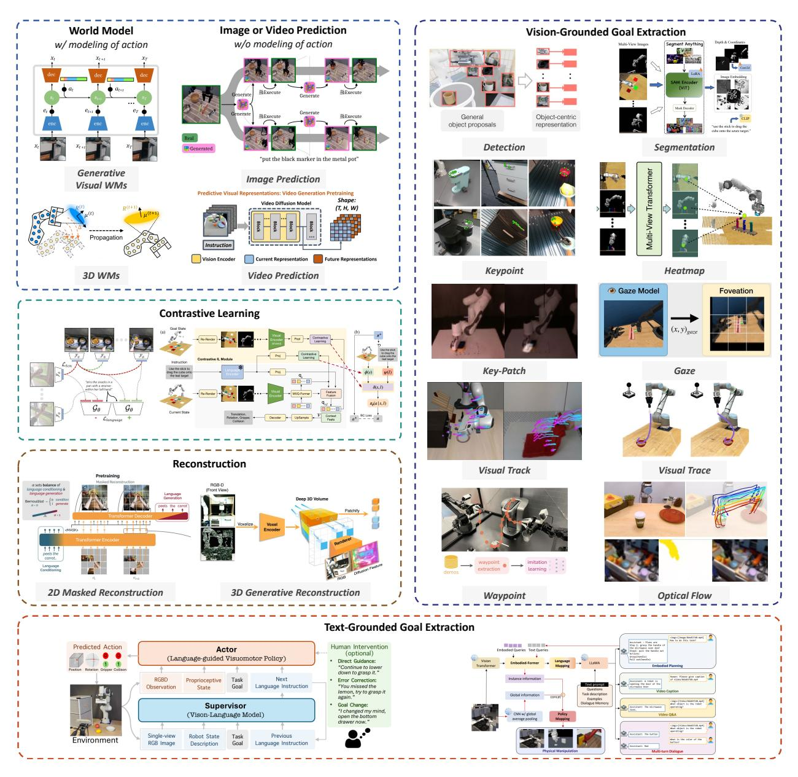

**Figure 15** | Overview of the taxonomy of methods for learning with auxiliary tasks, highlighting six core components: world models [\[637,](#page-129-10) [638\]](#page-129-11), image or video prediction [\[667,](#page-132-8) [669\]](#page-132-1), contrastive learning [\[678,](#page-132-9) [679\]](#page-132-10), masking reconstruction [\[680,](#page-133-3) [681\]](#page-133-4), text-Grounded goal extraction [\[369,](#page-110-0) [682\]](#page-133-5), and vision-grounded goal extraction [\[683](#page-133-6)[–691\]](#page-133-7).

frames and stable anchors from language and vision [\[685\]](#page-133-8); tokenizing actions through keypoint sequences to enable in-context imitation and rapid adaptation [\[709\]](#page-135-2); and hierarchical or open-world frameworks that use keypoints as an interface for composing reusable skills [\[710\]](#page-135-3). Knowledge-guided pipelines further stabilize keypoint definitions under distribution shifts by injecting priors about parts, constraints, and contact patterns [\[711\]](#page-135-4). In practice, keypoints serve as inputs, conditioning variables, or attention anchors for predicting poses, waypoints, and action parameters, offering a clean bridge from perception to control.

**Key-Patch.** CALAMARI [\[686\]](#page-133-9) formulates action as contact itself by predicting language-conditioned contact formation maps in the image plane, so the policy decides where on a surface to make contact

rather than selecting a single point. The architecture factorizes perception and control at the natural boundary of contact. A multimodal spatial action module aligns per-pixel action predictions with observations, and a low-level controller then optimizes motion to maintain contact while avoiding penetration. By leveraging visual language pretraining for spatial features, CALAMARI improves grounding and sim to real transfer and demonstrates strong performance on contact-rich tasks such as sweeping, wiping, and erasing, providing a clean key patch interface from instruction to control.

**Keypose.** Keypose-based goal extraction selects a small set of SE(3) anchor states that summarize task progress and provide precise geometric targets for control. Compared with pixel features or sparse keypoints, keyposes carry subgoal semantics, mark completion events, and reduce compounding error in multi-stage manipulation. Two representative directions illustrate this interface. KOI accelerates online imitation by deriving hybrid key states from demonstrations, where semantic key states from a vision language pipeline describe what to do and motion key states from optical flow describe how to do it, yielding task-aware rewards that improve exploration efficiency in simulation and real-world settings [\[712\]](#page-135-5). BiKC targets bimanual manipulation with a hierarchical policy in which a high-level keypose predictor segments stages and conditions a low-level consistency model that generates trajectories with fast inference and improved success and efficiency [\[687\]](#page-133-10).

**Waypoint.** Waypoint-based goal extraction summarizes manipulation into a short sequence of executable subgoals in task space, typically a handful of SE(3) poses that bridge perception and control. By decoupling "what to achieve" from "how to move," waypoints reduce covariate shift, ease long-horizon planning, and provide a stable interface to motion controllers and consistency policies. Two representative lines illustrate this interface. AWE learns to predict object-centric pick and place waypoints directly from demonstrations, then delegates time parameterization and smoothing to a low-level controller, yielding strong sample efficiency and robustness in cluttered scenes [\[688\]](#page-133-11). VIEW further systematizes the perception to waypoint pipeline with object relative frames and consistency regularization so that the predicted subgoals remain geometrically coherent across views and instances, improving generalization while retaining simple downstream control [\[713\]](#page-135-6).

**Visual Trace.** Visual trace methods encode human intent as drawable primitives such as sketches, contours, and reticles that are aligned to the scene and consumed by policies as lightweight goal carriers. Compared with keypoints or discrete waypoints, traces provide higher bandwidth semantic guidance at low annotation cost and can act both as training time auxiliary supervision and as inference time conditioning. Two complementary patterns have emerged. First, sketch-guided path specification maps freehand drawings to object-relative motion plans so that the policy follows userspecified shapes or routes, improving controllability and sample efficiency [\[689\]](#page-133-12). Second, minimal visual cues introduce simple reticles or marks that bias attention and spatial priors in clutter, yielding robust gains without redesigning the policy backbone and working with off-the-shelf visuomotor stacks [\[714\]](#page-135-7).

**Visual Track.** Visual track methods encode identity-consistent trajectories of scene points across time and use them as an action or guidance space that bridges perception and control with low supervision cost. Tracks can directly serve as actions for cross-embodiment transfer from human videos, with 2D motion tracks predicted from multiple views and then lifted to 6 DoF robot trajectories, yielding strong few-shot performance in the real world [\[715\]](#page-135-8). Web videos can supervise track prediction to produce an open-loop plan that is subsequently refined by a residual closed-loop policy, improving generalization to novel objects and scenes [\[716\]](#page-135-9). Pre-training a trajectory model to predict future paths of arbitrary points further supplies dense correspondence priors that boost visuomotor learning with minimal action labels and enable transfer across morphologies [\[690\]](#page-133-13). Diffusion-generated trajectories can guide policy optimization at the sequence level, reducing compounding error in long-horizon tasks [\[717\]](#page-135-10). Complementary work prescribes a small set of semantically meaningful

points and propagates them through data with off-the-shelf vision models, creating stable anchors that improve out-of-distribution generalization and can be tracked to condition policies [\[718\]](#page-135-11).

**Flow.** Flow-based goal extraction treats motion fields as the interface between perception and control, specifying how objects should move rather than only where they are. Under this lens, it is useful to separate four flavors. Optical flow uses dense 2D correspondences from videos without action labels to supervise policies or provide priors for planning and control, exemplified by the actionfrom-video pipeline [\[719,](#page-135-12) [720\]](#page-135-13). Action flow encodes policy- or task-conditioned motion fields in time and space, which can be fused with memory or generated by diffusion to coordinate multi-arm behaviors and improve precision, as in ActionSink [\[721\]](#page-136-0) and VLM-SFD [\[722\]](#page-136-1). Object-centric flow defines motion on manipulated objects or parts, enabling cross-embodiment transfer and even reward shaping [\[691,](#page-133-7) [723,](#page-136-2) [724\]](#page-136-3), for example, Im2Flow2Act's object-flow interface [\[691\]](#page-133-7) and GenFlowRL's generative object-centric flow [\[724\]](#page-136-3). 3D flow lifts signals to scene flow, voxels, or point clouds and often augments them with semantics, serving as pose-aware priors or world-model latents; representative systems include G3Flow [\[725\]](#page-136-4), 3DFlowAction [\[642\]](#page-130-2), and ManiTrend [\[726\]](#page-136-5), while VIP [\[727\]](#page-136-6) uses sparse point flows during pre-training and ToolFlowNet [\[728\]](#page-136-7) predicts per-point tool flow to ground contact-rich skills.

### **iv) Text-Grounded Goal Extraction**

Recent advances in text-grounded goal extraction highlight the shift from simple language conditioning toward explicitly parsing instructions into actionable goals, recovery strategies, or reasoning steps. RACER introduces rich language-guided recovery policies that allow imitation learning agents to adapt when failures occur, demonstrating how natural language can serve as a corrective signal rather than only a task specifier [\[682\]](#page-133-5). EmbodiedGPT extends this idea to large-scale pretraining by incorporating embodied chain-of-thought, enabling policies to follow multi-step reasoning trajectories derived from textual instructions [\[369\]](#page-110-0). Along similar lines, CoTPC formulates chain-of-thought predictive control, translating instructions into structured predictive sub-goals that can be optimized in control loops [\[729\]](#page-136-8). Complementing these reasoning-oriented approaches, OCI leverages objectcentric instruction augmentation to link linguistic references more directly to specific entities in the environment, thereby reducing ambiguity and improving manipulation precision [\[730\]](#page-136-9). Together, these works demonstrate that grounding language into structured goals—whether through recovery cues, reasoning chains, or object-level references—substantially improves robustness, generalization, and interpretability in robotic manipulation.

### **v) Contrastive Learning**

The integration of contrastive learning into robotic manipulation can be organized into five categories. First, universal representation learning employs large-scale contrastive pretraining on internet or egocentric videos to obtain transferable embeddings that accelerate downstream robot learning. R3M demonstrates how time-contrastive objectives yield general-purpose features for control and language grounding [\[678\]](#page-132-9). Second, language-conditioned alignment applies contrastive objectives to couple visual states, natural language instructions, and robot actions. This line includes BC-Z [\[142\]](#page-92-8) and HULC [\[731\]](#page-136-10), which align multimodal representations for zero-shot task generalization and robust imitation over unstructured datasets. Third, video-to-action alignment maps human demonstration videos to robot policies via cross-modal contrastive learning. Vid2Robot [\[732\]](#page-136-11) leverages cross-attention transformers with video-conditioned contrastive losses to bridge video-torobot execution. Fourth, contrastive imitation learning directly integrates contrastive losses into imitation pipelines, supervising alignment of embeddings with action trajectories or policy heads. Σ-agent [\[679\]](#page-132-10) exemplifies this by combining contrastive imitation with multi-task, language-guided manipulation. Finally, action-sequence contrastive supervision contrasts correct and incorrect action trajectories to shape representations tailored for policy optimization, as in CLASS [\[733\]](#page-136-12). This

five-category taxonomy disentangles overlapping use cases—representation pretraining, multimodal alignment, video-conditioned imitation, contrastive IL, and trajectory-level supervision—providing a clear structure for surveying contrastive methods in manipulation.

### **vi) Reconstruction**

Reconstruction has emerged as a powerful self-supervised pretraining strategy for robot manipulation, encompassing both masked modeling and generative reconstruction paradigms. The central idea is to recover or predict missing or novel observations such as masked pixels, tokens, or 3D representations from partial inputs. By compelling the model to infer the underlying structure of the environment and action space, reconstruction-based pretraining promotes the learning of rich and structured representations. These representations can then be transferred to downstream imitation or reinforcement learning tasks, improving sample efficiency, robustness, and cross-task generalization. Existing works can be broadly categorized into two groups: (1) 2D masked reconstruction, which focuses on reconstructing intentionally occluded or masked inputs, and (2) 3D reconstruction, which encompasses both 3D masked reconstruction and generative reconstruction approaches that predict unseen views, 3D feature fields, or future observations.

**2D Masked Reconstruction.** Early methods focused on reconstructing masked pixels or spatiotemporal tokens from egocentric robot data. MVP introduced masked visual pretraining for real-world robotic control, showing strong transfer across manipulation tasks [\[734\]](#page-137-0). STP extended this to spatiotemporal predictive pretraining for motor control [\[735\]](#page-137-1), while sensorimotor pretraining methods coupled visual masking with proprioceptive prediction to learn multimodal embeddings [\[736\]](#page-137-2). MUTEX [\[737\]](#page-137-3) and Voltron [\[681\]](#page-133-4) further demonstrated how masked reconstruction can be combined with multimodal task specifications and language grounding.

**3D Reconstruction.** Beyond pixel masking, 3D reconstruction approaches leverage multiview images, point clouds, or implicit feature fields to learn spatially consistent representations, often in SE(3) equivariant forms [\[638,](#page-129-11) [680,](#page-133-3) [738–](#page-137-4)[746\]](#page-137-5). 3D-MVP performed masked multiview pretraining for robust manipulation policies [\[742\]](#page-137-6), while SPA introduced spatial-awareness masking to enhance embodied representations [\[741\]](#page-137-7). Lift3D demonstrated how to "lift" 2D pretrained models into 3D spaces [\[743\]](#page-137-8), and CL3R combined 3D reconstruction with contrastive learning for enhanced manipulation features [\[745\]](#page-137-9). Perceiver-actor models such as PerAct [\[747\]](#page-137-10), M2T2 [\[748\]](#page-138-0), and RVT-2 [\[749\]](#page-138-1) integrate masked pretraining into transformer-based architectures for multi-task pick-andplace. Recent generative 3D methods extend this trend: GNFactor [\[680\]](#page-133-3) employs neural feature fields for volumetric reconstruction, while NeRF-style formulations explore corrective augmentation and novel-view synthesis for manipulation [\[750\]](#page-138-2).

Reconstruction thus serves as a unifying self-supervised scaffold across modalities. 2D masked methods emphasize scalable pretraining from large-scale egocentric video and multimodal signals, while 3D reconstruction approaches—whether masked or generative—focus on spatial consistency, equivariance, and viewpoint robustness. Together, these methods establish reconstruction-based pretraining as a key enabler of sample-efficient and generalizable manipulation policies.

### **6.2. Input Modeling**

Input modeling defines how robots perceive and represent the world through various sensory modalities, determining what inputs are used and how they are processed before being fed into control or policy models. It encompasses the selection and encoding of multimodal observations—such as vision, language, touch, force, or audio—and the transformation of these raw signals into structured representations suitable for learning and decision-making. Effective input modeling ensures that sensory data are aligned, fused, and abstracted in a way that preserves essential spatial, temporal,

and semantic information, thereby enabling robust perception, reasoning, and control across diverse manipulation tasks.

### *6.2.1. Vison Action Models*

Vision Action Models aim to directly couple visual perception with action generation, enabling agents to reason about complex environments and execute goal-directed behaviors. Recent advances in deep learning have significantly pushed this area forward, from early convolution-based architectures to modern transformer-based frameworks that integrate multimodal information. In this section, we review representative approaches, highlighting their design principles, strengths, and limitations, with a particular focus on how they bridge the gap between visual understanding and action execution.

**2D Vision as Input.** The development of Vision Action models is largely centered on using 2D visual data [\[79,](#page-87-9) [80,](#page-87-10) [751–](#page-138-3)[757\]](#page-138-4), often from multi-view RGB cameras, as the foundational perceptual input. Model architectures in this domain can be broadly categorized into three paradigms: Conv-based, Transformer-based, and Diffusion-based. Vi-PRoM [\[79\]](#page-87-9) employs ResNet-50 [\[63\]](#page-86-7) as the backbone to extract visual features for guiding robot manipulation, though it does not address the gap between simulation and reality. HDP [\[751\]](#page-138-3) introduces a hierarchical structure for efficient visual manipulation, achieving state-of-the-art performance and underscoring the importance of kinematic awareness, but its effectiveness diminishes in long-horizon tasks. HPT [\[752\]](#page-138-5) adopts a Transformer backbone and proposes an alignment framework that integrates proprioception and vision across different embodiments. Diffusion Policy [\[80\]](#page-87-10) represents a landmark shift by modeling visuomotor control as a conditional denoising diffusion process for robot behavior generation. Despite their dominance, 2D visual-action models remain fundamentally constrained by the absence of 3D grounding, limiting their physical reasoning and generalization compared to emerging 3D-aware models that explicitly align actions with the geometric structure of the world.

**3D Vision as Input.** To improve the 3D awareness of models, more and more Vision Action models focus on the 3D visual information of the real world [\[749,](#page-138-1) [758–](#page-138-6)[767\]](#page-139-0). By leveraging multi-view transformations, RVT [\[758\]](#page-138-6) and RVT-2 [\[749\]](#page-138-1) explicitly enhanced task execution efficiency and generalization, thereby improving performance in real-world applications. GenDP [\[759\]](#page-138-7) significantly improved success rates on unseen instances and enables category-level generalization by addressing the generalization limitations of diffusion policies through 3D semantic fields derived from multi-view RGBD observations. DP3 [\[760\]](#page-138-8) injected 3D point cloud representation and robot states into the diffusion model as a condition, efficiently executed complex manipulations of deformable objects using the Allegro hand. 3D-FDP [\[761\]](#page-138-9) leveraged scene-level 3D flow as a structured intermediate representation to capture fine-grained local motion cues. However, while these models provide 3Daware capabilities lacking in 2D Vision-Action models, their absence of textual semantic information ultimately limits their generalization and robustness in the real world.

### *6.2.2. Vision-Language-Action Models*

Recent progress in Vision–Language–Action (VLA) models has created a unified paradigm for mapping multimodal perception into executable robotic behaviors. Compared with earlier vision-only or language-conditioned controllers, VLAs integrate semantic grounding, spatial reasoning, and sequential action generation within a single architecture. To provide a systematic overview, we summarize the landscape in a taxonomy (Figure [16\)](#page-48-0) that organizes existing work by input modality (2D and 3D) and by methodological orientation, distinguishing **model-oriented** approaches (architectural innovations) from **model-agnostic** ones (inference, training, or efficiency enhancements). This taxonomy clarifies technical differences, shared design trade-offs, and the evolution of VLAs toward scalable, robust, and general-purpose robotic intelligence.

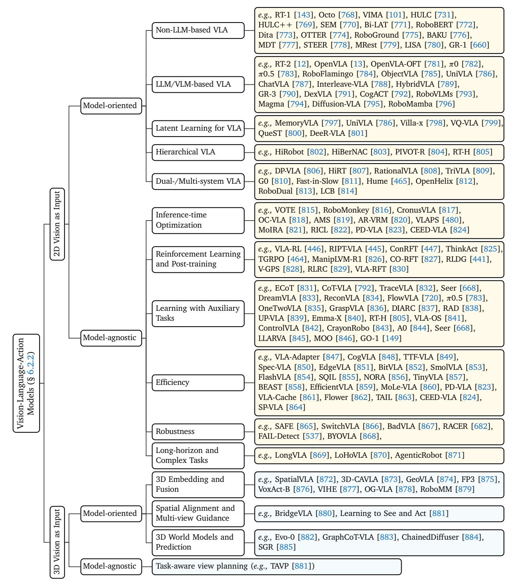

**Figure 16** | A structured taxonomy of VLA models organized by input modality (2D vs. 3D) and methodological orientation (model-oriented architectures vs. model-agnostic strategies). The figure highlights representative approaches in each category, showcasing both architectural innovations and training or inference enhancements.

#### i) 2D Vision as Input

Most VLAs rely on 2D images from RGB cameras, sometimes with multi-view setups, as the primary perceptual stream. Within this setting, a diverse set of methods has emerged, which can

be broadly divided into **model-oriented** approaches that redesign the policy architecture itself, and **model-agnostic strategies** that improve inference or training without altering the core model.

**Model-oriented Approaches.** Model-oriented approaches focus on advancing the architecture and internal structure of VLA models to improve their representation learning, reasoning ability, and task adaptability. Instead of modifying training schemes or inference strategies, these methods emphasize redesigning the policy backbone, integrating multimodal modules, and structuring control hierarchies to better align perception, reasoning, and action.

- **Non-LLM-based VLA.** Early approaches directly mapped visual observations and textual commands into low-level actions through sequence modeling or language-conditioned policies. RT-1 [\[143\]](#page-92-9) pioneered the transformer-based discretized action policy that scaled to thousands of demonstrations, enabling diverse manipulation skills at scale. Follow-ups such as VIMA [\[101\]](#page-89-1) and HULC [\[731\]](#page-136-10) extended this paradigm to more compositional instructions and multimodal imitation learning, showing that language-conditioned policies can indeed ground symbolic input in low-level control. These methods, however, were limited by the lack of large-scale semantic priors, leading to poor crossdomain transfer and limited generalization. Overall, non-LLM-based VLAs highlight the feasibility of end-to-end training from paired robot data, but also motivate the need for stronger priors to handle open-world instructions.
- **LLM/VLM-based VLA.** With the rise of LLMs and VLMs, researchers began embedding them into robotic control pipelines. RT-2 [\[12\]](#page-82-8) co-trained on web-scale vision-language data and robot trajectories, showcasing cross-embodiment generalization and zero-shot skill transfer. RoboFlamingo [\[784\]](#page-140-8) and OpenVLA [\[13\]](#page-83-0) demonstrated that frozen or lightly tuned VLMs could serve as perceptual front-ends, while lightweight policy heads were sufficient to generate actions. 0 [\[782\]](#page-140-6) and 0.5 [\[783\]](#page-140-7) pushed this paradigm further by introducing flow-matching action decoders and scaling prompting strategies, showing robust generalization across unseen objects and tasks. Together, these works highlight the benefits of leveraging broad web-scale priors for robotic learning, but they also expose alignment gaps between symbolic reasoning (text/vision grounding) and continuous motor execution. Thus, while powerful, LLM/VLM-based VLAs require additional mechanisms to bridge the semantic-to-motor gap.
- **Latent Learning for VLA.** Another line of work compresses trajectories into latent variables or discrete tokens, thereby reducing action-space complexity and stabilizing policy training. For instance, VQ-VLA [\[799\]](#page-141-10) introduced quantized codebooks of motor primitives, while QueST [\[800\]](#page-141-11) and DeeR-VLA [\[801\]](#page-141-12) employed memory or latent slots to preserve temporal dependencies. These latent action spaces act as interfaces between high-level instructions and continuous execution, enabling data-efficient learning and policy transfer across robots. The main challenge, however, lies in preventing codebook collapse and ensuring that the latent tokens remain semantically meaningful. Overall, latent representation learning offers a promising route for scalable training by decoupling symbolic intent from motor details.
- **Hierarchical VLA.** Long-horizon and compositional tasks motivated hierarchical designs, where control is explicitly structured into primitives, waypoints, or higher-level skills. Examples include HiRobot [\[802\]](#page-142-0), HiBerNAC [\[803\]](#page-142-1), and PIVOT-R [\[804\]](#page-142-2), which factor task execution into interpretable layers, and RT-H [\[805\]](#page-142-3), which extended transformer-based policies with hierarchical abstractions. Such designs increase interpretability, support modular reuse, and mitigate compounding errors in long sequences. However, they also introduce the difficulty of subgoal specification and arbitration, as errors in high-level planning can cascade into downstream failures. Thus, hierarchical VLAs embody the trade-off between interpretability and the complexity of learning consistent task abstractions.
- **Dual- and Multi-System VLA.** Inspired by cognitive theories of fast and slow systems, several works propose dual-process VLAs. Typically, it includes a fast system (System 1) and a slow system

(System 2). System 2 is slow, deliberate, effortful, and conscious, analogous to the human brain. It is typically represented by a large vision-language model capable of performing complex multimodal understanding and reasoning. On the other hand, System 1 is fast, automatic, intuitive, and unconscious, analogous to the human cerebellum. It is usually represented by a policy with fewer parameters but strong action modeling capabilities. LCB [\[814\]](#page-142-12), DP-VLA [\[806\]](#page-142-4), HiRT [\[807\]](#page-142-5), RationalVLA [\[808\]](#page-142-6), and OpenHelix [\[812\]](#page-142-10) allocate reactive control to a fast stream while reserving deliberative planning and memory management for a slower stream. TriVLA [\[809\]](#page-142-7) and Galaxea [\[810\]](#page-142-8) extend this further into multi-system coordination, where multiple modules jointly arbitrate between precision, safety, and long-horizon reasoning. These hybrid designs demonstrate robustness under uncertainty and enable flexible decision-making, but also introduce new challenges in arbitration, credit assignment, and maintaining memory consistency across systems. Overall, dual-/multi-system approaches signal a shift toward architectures that explicitly model cognitive diversity within robotic agents.

**Model-agnostic Strategies.** Model-agnostic strategies aim to enhance the performance, reliability, and efficiency of VLA models without modifying their underlying architecture. Rather than redesigning model structures, these approaches operate at the inference, training, or auxiliary supervision level to improve decision quality, generalization, and deployment practicality.

- **Inference-Time Optimization.** Methods such as VOTE [\[815\]](#page-143-0), RoboMonkey [\[816\]](#page-143-1), and CronusVLA [\[817\]](#page-143-2) refine action selection at inference through strategies like voting, sampling, or calibration. These approaches are particularly appealing as they enhance robustness without requiring retraining and can be seamlessly integrated with diverse model backbones.
- **Reinforcement Learning and Post-training.** Approaches such as SimpleVLA-RL [\[886\]](#page-148-4), VLA-RL [\[446\]](#page-116-2), RIPT-VLA [\[445\]](#page-116-1), and RFT variants [\[447,](#page-116-3) [464,](#page-117-12) [825,](#page-143-10) [826,](#page-143-11) [830\]](#page-144-1) adapt pretrained VLAs through interactive fine-tuning. By leveraging feedback from simulated or real-world rollouts, these methods enhance robustness under distribution shift and align pretrained models with task-specific execution requirements.
- **Learning with Auxiliary Tasks.** Auxiliary tasks provide additional supervision to enrich reasoning. Examples include chain-of-thought modules (ECoT [\[831\]](#page-144-2), CoT-VLA [\[792\]](#page-141-3)), goal extraction from demonstrations (TraceVLA [\[832\]](#page-144-3), Seer [\[668\]](#page-132-0)), and reconstruction or world priors (DreamVLA [\[833\]](#page-144-4), Reconvla [\[834\]](#page-144-5)). These designs extend the reasoning horizon and enhance transparency in intermediate decision steps, thereby improving the interpretability of execution.
- **Efficiency.** Recent studies have devoted increasing attention to improving the computational efficiency of VLA models by reducing both inference cost and memory footprint. A dominant trend is to compress visual and action representations, for example, through lightweight architectures such as SmolVLA [\[853\]](#page-145-11), TinyVLA [\[857\]](#page-146-2), and BitVLA [\[852\]](#page-145-10), which demonstrate that compact models can sustain competitive performance while enabling deployment on resource-constrained devices. Another line of work focuses on adaptive computation: methods such as VLA-Cache [\[861\]](#page-146-6), MoLe-VLA [\[860\]](#page-146-5), and FlashVLA [\[854\]](#page-145-12) exploit token reuse, dynamic layer skipping, or information-guided pruning to cut redundant operations while preserving task success. Parallel decoding and architectural refinements, as in EfficientVLA [\[859\]](#page-146-4), RACER [\[682\]](#page-133-5), and CEED-VLA [\[824\]](#page-143-9), further shorten decision horizons and accelerate inference. In addition, action compression techniques such as BEAST [\[858\]](#page-146-3) or Flower [\[862\]](#page-146-7) reformulate trajectories into more compact tokenized forms, reducing autoregressive steps. Collectively, these approaches demonstrate that multi-level compression—spanning model design, representation, and action space—can substantially lower FLOPs and latency, bringing realtime VLA deployment closer to practice.
- **Robustness.** Beyond efficiency, robustness has emerged as a central requirement for safe and reliable deployment of VLAs. Safety-aligned objectives such as SAFE [\[865\]](#page-146-10) integrate constraints into

policy learning, yielding measurable improvements in safe execution across tasks. Failure detection is another key theme: FAIL-Detect [\[537\]](#page-122-7) introduces sequence-level out-of-distribution detection without requiring explicit failure data, while auxiliary monitoring modules as in SwitchVLA [\[866\]](#page-146-11) provide dynamic adjustment under task transitions. Complementary approaches like BYOVLA [\[868\]](#page-147-0) enhance resilience to environmental clutter by suppressing spurious visual cues at test time. Meanwhile, adversarial analysis such as BadVLA [\[867\]](#page-146-12) exposes the susceptibility of current models to backdoor triggers, underscoring the importance of defense strategies. Together, these efforts highlight that robustness encompasses safety constraints, failure awareness, environmental resilience, and adversarial resistance. Although progress has been made, existing VLAs remain vulnerable to distribution shift and noise, suggesting that robustness is a crucial frontier for advancing embodied intelligence.

• **Long-horizon Generalization.** Methods designed for long-horizon and complex tasks (e.g., Long-VLA [\[869\]](#page-147-1), AgenticRobot [\[871\]](#page-147-3)) focus on enhancing stability and memory to support reasoning over extended sequences. These studies underscore that the primary challenge for practical deployment lies not in achieving single-step success, but in sustaining reliable task execution over long durations.

Together, the 2D VLA landscape illustrates a clear trajectory: starting from direct end-to-end policies, evolving into architectures that leverage semantic priors from LLMs/VLMs, and further into modular, hierarchical, or multi-system designs. Complemented by model-agnostic techniques for optimization, reinforcement, and robustness, these developments collectively point toward a new generation of VLAs that balance efficiency, interpretability, and scalability.

### **ii) 3D Vision as Input**

Compared with 2D inputs, 3D representations provide richer spatial grounding for contact-rich manipulation and long-horizon planning. However, because most VLM backbones are pre-trained on 2D image–text data, they lack intrinsic 3D understanding. This has motivated research into how VLAs can incorporate explicit 3D perception, which can be broadly divided into **Model-oriented** approaches that redesign architectures to integrate 3D information, and **Model-agnostic** strategies that introduce auxiliary mechanisms without altering the backbone.

**Model-oriented Approaches.** 3D model-oriented approaches extend VLA architectures by incorporating explicit 3D perception, spatial reasoning, and predictive modeling to bridge the gap between visual understanding and physical interaction. Unlike 2D vision–language policies that operate on planar or image-based inputs, these methods embed geometry-aware representations such as point clouds, voxels, and depth features to capture fine-grained spatial structures essential for manipulation.

- **3D Embedding and Fusion.** A key direction is to fuse 3D perception (e.g., point clouds, depth, voxels) with 2D vision–language features. SpatialVLA [\[872\]](#page-147-4) proposes 3D position encodings and adaptive action grids to capture transferable spatial knowledge. 3D-CAVLA [\[873\]](#page-147-5) leverages depth and 3D context to generalize to unseen tasks, while GeoVLA [\[874\]](#page-147-6) introduces point-based geometric embeddings to enhance manipulation precision. Other works expand representation forms: VoxAct-B [\[876\]](#page-147-8) employs voxel-based encoding for bimanual control, VIHE [\[877\]](#page-147-9) uses in-hand eye transformers for fine-grained geometry, OG-VLA [\[878\]](#page-147-10) generates orthographic projections for spatial reasoning, FP3 [\[875\]](#page-147-7) provides a foundation policy trained with large-scale 3D data, and RoboMM [\[879\]](#page-147-11) integrates multimodal pretraining with 3D inputs. These approaches collectively demonstrate that richer 3D embeddings improve spatial awareness and robustness, albeit with higher data and computational costs.
- **Spatial Alignment and Multi-View Guidance.** Another line addresses occlusion and viewpoint ambiguity by explicit spatial alignment. BridgeVLA [\[880\]](#page-147-12) aligns point clouds across views by predicting heatmaps from different perspectives, while Learning to See and Act [\[881\]](#page-147-13) optimizes task-aware

view planning. By reasoning over viewpoints, these approaches reduce pose ambiguity and improve grounding, though they highlight the trade-off between accuracy and efficiency in viewpoint selection.

• **3D World Models and Prediction.** Some works integrate predictive modeling into 3D VLAs to support long-horizon reasoning. 3D-VLA [\[887\]](#page-148-5) employs point-cloud diffusion guided by language to forecast future states, while Evo-0 [\[882\]](#page-148-0) performs implicit spatial rollouts to anticipate feasible actions. GraphCoT-VLA [\[883\]](#page-148-1) combines graph-based reasoning with chain-of-thought in 3D, linking intermediate spatial states to action generation. Earlier works such as ChainedDiffuser [\[884\]](#page-148-2) and SGR [\[885\]](#page-148-3) demonstrate that generative 3D world models can amortize planning into predictive priors. These methods show how world modeling reduces error accumulation in extended horizons.

**Model-agnostic Strategies.** Unlike their 2D counterparts, model-agnostic enhancements for 3D VLAs remain limited. Existing explorations focus primarily on task-aware view planning during inference (e.g., Learning to See and Act [\[881\]](#page-147-13)) or feasibility checks on candidate actions. However, systematic advances in areas such as calibration, consensus decoding, caching, or lightweight reasoning for 3D settings are still scarce. This gap underscores both the challenges and opportunities: while 3D inputs provide essential spatial grounding, efficient inference-time and post-training strategies remain largely underexplored.

Across both 2D and 3D modalities, VLA research shows converging trends. Model-oriented approaches aim to strengthen representational capacity by incorporating LLM and VLM priors, latent structures, and hierarchical reasoning in 2D, and by leveraging embeddings, alignment mechanisms, and world models in 3D. Complementing these, model-agnostic strategies emphasize improving inference robustness and efficiency with minimal retraining. Looking ahead, key directions include the standardization of 3D representations in VLAs, the development of hybrid frameworks that integrate reactive control with deliberative planning through safety-aware dual systems, and cotraining across 2D and 3D modalities to couple large-scale priors with spatial grounding. Together, these advances move beyond scaling backbone models toward architectures that explicitly integrate perception, memory, planning, and control, evaluated under long-horizon, cross-embodiment, and real-world deployment challenges.

### *6.2.3. Tactile-based Action Models*

Tactile sensing is a critical channel for enabling robots to interact with the physical world, providing fine-grained perception capabilities similar to those of humans, such as recognizing an object's shape and material. With recent advances, an increasing number of action models have begun to incorporate tactile information to enhance the accuracy and robustness of manipulation.

**Tactile Latent Learning.** CLTP [\[888\]](#page-148-6) introduces contrastive language-tactile pretraining to align tactile geometry with natural language for 3D contact understanding. Sparsh [\[889\]](#page-148-7) learns selfsupervised tactile representations from large-scale visuotactile data to improve generalizable touch perception.

**Tactile-Action Models.** Feel the Force [\[890\]](#page-148-8) leverages tactile glove demonstrations capturing human contact forces to train transferable tactile-aware manipulation policies. Seq2Seq Imitation [\[891\]](#page-148-9) formulates tactile feedback as sequential input in a Seq2Seq model to guide manipulation under partial observability. RoboPack [\[892\]](#page-148-10) integrates tactile feedback into dynamics models for MPC, enabling precise control in dense packing tasks. MimicTouch [\[893\]](#page-148-11) uses multimodal human tactile demonstrations to teach robots contact-rich manipulation strategies.

**Tactile-Vision-Action Models.** T-DEX [\[894\]](#page-148-12) pre-trains tactile representations with robot play to support dexterous manipulation learning. RotateIt [\[895\]](#page-148-13) combines vision and touch to generalize

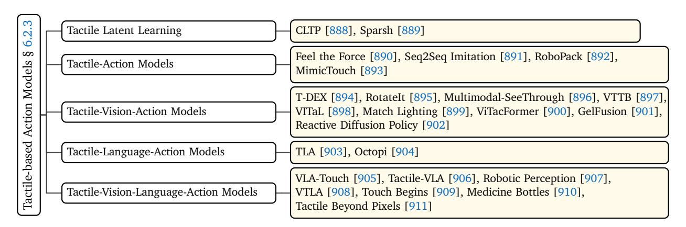

Figure 17 | A structured overview of tactile-based action models.

in-hand object rotation policies. Multimodal-SeeThrough [896] employs a transparent visuotactile sensor with force-matched demonstrations to improve imitation learning. VTTB [897] integrates tactile and visual sensing for adaptive robot-assisted bed bathing. VITaL [898] introduces visuo-tactile pretraining to improve both tactile-based and vision-only manipulation policies. Match Lighting [899] demonstrates the necessity of tactile sensing for imitation learning in fine-grained contact tasks. ViTacFormer [900] employs cross-modal Transformers to fuse visual and tactile signals for dexterous control with tactile prediction. GelFusion [901] combines high-resolution tactile images with vision to enhance manipulation under visual occlusion. Reactive Diffusion Policy [902] fuses tactile and vision in a slow-fast diffusion policy to improve responsiveness in contact-rich tasks.

**Tactile-Language-Action Models.** TLA [903] aligns tactile sequences with language to learn tactile-language-action mappings for contact-rich tasks. Octopi [904] leverages tactile signals with large tactile-language models to reason about object physical properties.

Tactile-Vision-Language-Action Models. VLA-Touch [905] enhances VLA models with dual-level tactile feedback for high-level planning and low-level execution. Tactile-VLA [906] integrates tactile sensing into VLA models to enable tactile generalization in physical tasks. Robotic Perception [907] develops a large tactile-vision-language model to infer object physical properties from tactile interactions. VTLA [908] fuses tactile and vision with language-action preference learning to achieve robust insertion manipulation. Touch Begins [909] proposes a two-stage policy that localizes with vision-language models and executes with tactile-guided strategies. Medicine Bottles [910] integrates tactile force and pose from human demonstrations to enable robots to learn compliant force tasks like opening safety bottles. Tactile Beyond Pixels [911] learns multisensory tactile representations beyond pixels, combining force, motion, and sound for richer manipulation.

#### 6.2.4. Extra Modalities as Input

Additional modalities such as audio, haptics, and thermal sensing can be integrated with vision and language to provide robots with richer and more comprehensive perception for downstream tasks.

**Force.** Early research investigated incorporating haptic information into imitation learning for force-sensitive manipulation. For instance, AR-Haptic [912] jointly learned positional and force profiles from kinesthetic and haptic demonstrations, enabling robots to reproduce tasks requiring fine-grained force control. Bilateral [913] leveraged bilateral control to capture position and force simultaneously, achieving precise imitation of human manipulation. More recent efforts have extended these ideas: Wang et al. [914] combined trajectory demonstrations with force profiles for contact-sensitive assembly; ImmersiveDemo [915] showed that immersive demonstrations with force feedback

provide higher-quality training data and safer manipulation policies; and FoAR [\[916\]](#page-150-6) introduced a force-aware reactive policy that fuses real-time force sensing with vision for adaptive control in contact-rich scenarios. Building on these directions, ForceVLA [\[917\]](#page-150-7) integrates force sensing into VLA models, enabling manipulation that is more physically grounded, precise, and stable.

**Audio.** Play It By Ear [\[918\]](#page-150-8) attaches a microphone to the robot's gripper to capture audio feedback from contact events during imitation learning, enabling the robot to detect interactions through sound and succeed in tasks where visual-only policies fail due to occlusion. See, Hear, and Feel [\[919\]](#page-150-9) fuses visual, tactile, and auditory signals with a self-attention model, where the audio channel provides immediate feedback on otherwise hidden events, such as the sound of liquid pouring, thereby complementing vision and touch. ManiWAV [\[920\]](#page-150-10) leverages in-the-wild audio-visual demonstrations to train manipulation policies, allowing robots to integrate contact sound feedback with visual cues for contact-rich tasks. MS-Bot [\[921\]](#page-150-11) incorporates auditory input alongside vision and touch, adopting a stage-guided fusion strategy that dynamically adjusts the contribution of sound cues at different sub-goals to improve task performance. Finally, VLAS [\[922\]](#page-150-12) directly integrates speech recognition into the policy model, enabling robots to understand spoken commands through inner speech–text alignment and execute corresponding actions to accomplish the task.

### **6.3. Latent Learning**

Latent learning investigates how robots acquire and leverage compact, structured, and transferable representations that bridge perception and control. It focuses on discovering intermediate representations that capture task-relevant semantics, dynamics, and affordances, thereby improving generalization and sample efficiency. Existing approaches can be broadly categorized into two complementary directions. **Pretrained latent learning** aims to learn general-purpose visual or multimodal representations through large-scale pre-training, typically using self-supervised or multimodal objectives to distill task-relevant structure from human egocentric videos or robotic demonstrations. These pretrained encoders provide robust perceptual embeddings that serve as transferable inputs for downstream control across diverse tasks and embodiments. **Latent action learning**, in contrast, goes beyond representation acquisition to explore how latent spaces can be effectively utilized for control. It jointly models latent representations and their temporal or causal mappings to actions, often through quantized tokens, continuous latent dynamics, or implicit world models. In this paradigm, the latent space not only encodes environmental and task information but also serves as an internal interface for reasoning, planning, and action generation, offering a unified perspective on representation and policy learning. We summarize these two paradigms in Figure [18.](#page-55-0)

### *6.3.1. Pretrained Latent Learning*

Learning encoder-grounded, generalizable visual representations, referred to as robotic representations, is essential for real-world visuomotor control. Pre-training such representations on large-scale, domain-relevant data has emerged as a promising strategy for robotics, inspired by the success of pre-training in computer vision [\[475\]](#page-118-3) and natural language processing [\[72\]](#page-87-2). Depending on the source of training data, robotic representations can be broadly categorized into three types: those trained on general-purpose datasets (*e.g.*, ImageNet [\[923\]](#page-151-0)), human egocentric datasets (*e.g.*, Ego4D [\[924\]](#page-151-1)), and robotic datasets (*e.g.*, BridgeV2 [\[145\]](#page-92-11)).

**Training on General Datasets.** [\[925\]](#page-151-2) introduces a variant of MoCo-v2 that fuses features from multiple convolutional layers of a pre-trained vision model to form a unified pre-trained visual representation (PVR) optimized for control. Through multi-layer feature fusion, PVR achieves representation quality comparable to or surpassing ground-truth state features across diverse robotic

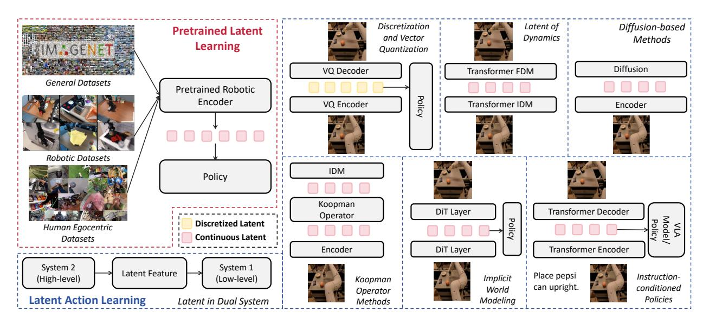

**Figure 18** | Overview of Latent Learning. Left Top: Robotic encoders are pretrained on general datasets, human egocentric datasets, and robotic datasets to produce latents for policies. Left Bottom: In the dual system, system 2 outputs latent to guide system 1 to generate action. Right: Latent action learning is conducted through discretized (yellow) or continuous latents (pink).

control tasks, demonstrating that well-adapted visual pre-training can rival hand-crafted state inputs. Theia [\[926\]](#page-151-3) further advances this direction by proposing a distillation-based vision model for robotics that integrates knowledge from multiple vision foundation models, each trained on distinct vision tasks, into a single compact representation. By consolidating the "skills" of different pre-trained models, Theia generates rich, high-entropy feature embeddings that significantly enhance robot learning, outperforming both its individual teacher models and prior robotic vision backbones, while requiring less training data and a smaller model footprint.

**Training on Human Egocentric Datasets.** [\[734\]](#page-137-0) introduces Masked Visual Pre-training for motor control, leveraging a masked autoencoder trained on large-scale egocentric images and freezing the encoder for downstream policy learning. It achieves significant visuomotor gains, approaching oracle state-based performance on several manipulation tasks. VC-1 [\[132\]](#page-91-10), a large-scale masked autoencoder trained on 4,000+ hours of egocentric video and ImageNet, establishes a general visual backbone for Embodied AI, outperforming prior pre-trained models on CortexBench and narrowing the gap to task-specific policies with fine-tuning. R3M [\[678\]](#page-132-9) pre-trains on Ego4D using time-contrastive learning, video–language alignment, and sparsity constraints to produce a robust universal encoder, enabling few-shot real-robot learning. Voltron [\[681\]](#page-133-4) advances language-driven representation learning by jointly training on language-conditioned visual reconstruction and visually grounded language generation, capturing both low-level patterns and high-level semantics. Vi-PRoM [\[79\]](#page-87-9) combines contrastive self-supervised and supervised learning, and builds the EgoNet dataset of human–object interactions, leading to improved manipulation performance. MPI [\[927\]](#page-151-4) models interaction dynamics by predicting intermediate transitions and active objects from goal keyframes and instructions, grounding manipulation in causal structure. HRP [\[928\]](#page-151-5) injects affordance priors mined from human videos, such as hand positions and contact points, to improve generalization across views and robot morphologies. VIP [\[553\]](#page-123-10) frames representation learning as goal-conditioned value pre-training, yielding dense, transferable reward signals that enable zero-shot policy learning without task-specific reward engineering. Together, these approaches illustrate how large-scale self-supervised and multimodal pre-training can endow robots with transferable visual representations that support efficient, robust

manipulation.

**Training on Robotic Datasets.** With the growth of large-scale open-source robot datasets, several approaches pre-train directly on robotic data, endowing models with prior knowledge of robotic actions. RPT [\[929\]](#page-151-6) is a sensorimotor pre-training framework that trains transformers on full robot trajectories by masking segments of visual observations, proprioceptive states, and actions, and predicting the missing portions. Leveraging over 20,000 real-world trajectories, RPT learns a transferable world model that generalizes effectively to downstream tasks. Premier-TACO [\[930\]](#page-151-7) advances temporal action contrastive learning for multitask representation learning, introducing a novel negative sampling strategy that improves pre-training efficiency and significantly boosts few-shot policy learning with minimal expert data across continuous control tasks. Jiang et al. [\[931\]](#page-151-8) further propose manipulation centricity, a metric measuring the alignment between pre-trained visual representations and manipulation performance, and introduce Manipulation-Centric Representation (MCR), which enhances this alignment through large-scale robotic pre-training.

### *6.3.2. Latent Action Learning*

Recent advances in latent action learning have introduced diverse paradigms that connect video representation, world modeling, and policy generation, allowing robots to acquire action abstractions beyond explicit supervision. In addition to the methods discussed in Section [6.1.2](#page-34-0) on latent learning and in Section [6.2.2](#page-47-1) on dual-/multi-system VLA with intermediate latent structures, latent learning for VLAs can also be grouped under this category. Broadly, latent actions can be categorized into two forms: discrete representations, often obtained through quantization, and continuous vector representations. The following sections review these two classes in detail.

### **i) Discretization and Vector Quantization**

Discretization and vector quantization map continuous action or representation spaces into a finite set of discrete tokens, providing compact, reusable action primitives that simplify policy learning. ILPO [\[932\]](#page-151-9) pioneered the idea of latent action variables to imitate policies from observation-only demonstrations, LAPO [\[933\]](#page-151-10) reconstructed action space structure from unlabeled videos using a latent inverse dynamics model, Behavior Generation with Latent Actions [\[934\]](#page-151-11) discretized continuous control into latent tokens via VQ for efficient generative policies, Discrete Policy [\[935\]](#page-151-12) disentangled latent action codes to scale multi-task visuomotor control, STAR [\[936\]](#page-151-13) introduced rotation-augmented VQ to learn orientation-invariant skill abstractions, and MOTO [\[937\]](#page-152-0) formulated motion tokens as a language to pre-train policies on large-scale video. LAPA [\[938\]](#page-152-1) first learns latent action representations by predicting transitions between current and future frames, then pretrains a VLM to infer such representations from visual inputs. The VLM is subsequently fine-tuned on action-labeled data, where its predicted latent actions are mapped to executable robot controls. DreamGen [\[939\]](#page-152-2) extends the paradigm of LAPA to large-scale robotic datasets. It constructs a data flywheel that generates synthetic robotic data from video world models and leverages an inverse dynamics model to obtain the corresponding action labels.

### **ii) Continuous Latent Action Representations**

Continuous latent action representations encode actions as vectors in a continuous space, allowing robots to capture fine-grained variations in motion and enabling smooth interpolation and generalization across behaviors.

**Latent of Dynamics.** Some methods represent variations in robot observations as latent variables, embedding dynamics information into the latent space to guide action generation. MimicPlay [\[940\]](#page-152-3) learned long-horizon imitation by conditioning latent actions on goal images from human play.

CLAM [\[941\]](#page-152-4) inferred continuous latent actions grounded to motor commands for learning from unlabeled demonstrations, while CoMo [\[328\]](#page-106-11) scaled continuous latent motion embeddings from internet videos to achieve robust cross-domain generalization.

**Implicit World Modeling.** Some methods exploit the predictive ability of world models by using intermediate latent states in forward rollouts to guide action prediction. VPP [\[667\]](#page-132-8) first fine-tunes a video foundation model into a text-guided video prediction model using manipulation data, then aggregates its representations via Video-Former to guide a diffusion policy for action generation. FLARE [\[942\]](#page-152-5) aligned future latent predictions with implicit world models to improve generalization from human video demonstrations. Genie Envisioner [\[657\]](#page-131-3) aligns latent space features in the video diffusion model with action features in diffusion policies to maintain layer-wise features.

**Diffusion-based Methods.** Some approaches encode visual observations into robotic latent variables, which are then input into diffusion policies. LAD [\[943\]](#page-152-6) trained a diffusion policy in a shared latent action space to enable cross-embodiment skill transfer, and KOAP [\[944\]](#page-152-7) combined diffusion planners with Koopman-based controllers to compose limited latent actions with stable long-horizon planning. LaDi-WM [\[945\]](#page-152-8) trains a latent diffusion world model to predict latent semantics and geometric dynamics, which serve as conditions for diffusion policies to generate refined actions.

**Koopman Operator Methods.** Some methods leverage Koopman operators to transform robot observations into latent dynamics representations. KoDex [\[946\]](#page-152-9) investigated the utility of Koopman theory for modeling dexterous manipulation dynamics, and KOROL [\[947\]](#page-152-10) learned visualizable object features via Koopman rollouts to support interpretable latent dynamics.

**Goal- or Instruction-conditioned Policies.** Some methods jointly encode instructions and visual inputs into latent variables that correspond to specific task representations. Procedure Cloning [\[948\]](#page-152-11) incorporated chain-of-thought style latent procedures to improve long-horizon task reasoning. GRIF [\[949\]](#page-152-12) introduced a semi-supervised latent goal space aligning language and visual goals, IGOR [\[950\]](#page-152-13) developed atomic control units as a unified latent action space to bridge vision-language models with robot control. By deriving task-centric latent actions in an unsupervised manner, UniVLA [\[786\]](#page-140-10) can leverage data from arbitrary embodiments and perspectives without action labels. UniVLA learns task-centric latent actions from cross-embodiments and different perspectives in an unsupervised manner. Then, a VLA is trained to predict the latent action tokens.

### **6.4. Policy Learning**

Policy learning defines how a robot transforms internal representations, such as latent features or encoded observations, into executable actions that interact with the physical world. It focuses on decoding perceptual and latent information into control outputs (for example, end-effector poses) through learned mappings rather than manually designed rules. In essence, policy learning establishes the computational mechanism that connects perception and decision-making with motor execution. We summarize these methods in Figure [19.](#page-58-0)

### *6.4.1. MLP-based Policy*

In the early stage, MLP-based policies [\[132,](#page-91-10) [678,](#page-132-9) [929,](#page-151-6) [951,](#page-153-0) [952\]](#page-153-1) play a basic role as visuomotor control models, relying on multilayer perceptrons to directly map observations to actions. They provide simplicity and efficiency but depend on latent actions or other discriminative representations.

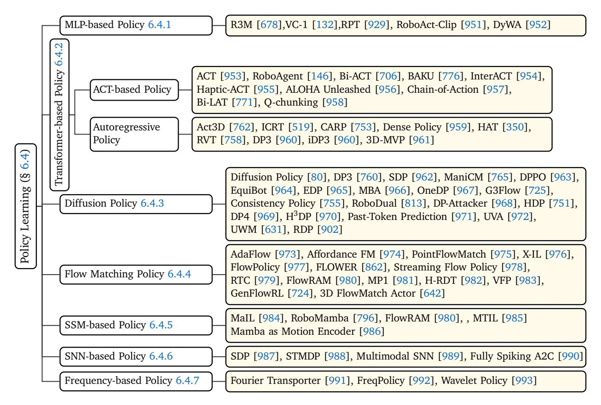

**Figure 19** | A structured overview of policy learning for visuomotor control, organized by modeling paradigm.

#### 6.4.2. Transformer-based Policy

Transformer-based policies use attention to adaptively weight information across tokens from observation and action histories. Causal self-attention models temporal dependencies without a fixed receptive field, and cross-attention conditions action generation on goals, language, or perceptual tokens. This design supports variable-length context, multimodal fusion, and sequence-to-sequence control, which has proven effective in visuomotor manipulation and longer tasks where past context matters.

ACT-based Policy. The Action Chunking Transformer (ACT) [953] first demonstrated that predicting short sequences of actions with a CVAE-based Transformer can mitigate error accumulation and enable fine-grained bimanual manipulation on low-cost hardware. Building on this, RoboAgent [146] incorporated semantic augmentations and a multi-task ACT to acquire diverse skills and generalize effectively to unseen tasks. Bi-ACT [994] extended the framework by integrating bilateral force-feedback into action chunking for more robust teleoperated imitation. BAKU [776] further advanced the architecture with an efficient multi-task Transformer that fuses multi-modal inputs and predicts chunked actions at scale. InterACT [954] enhanced bimanual manipulation through hierarchical-attention Transformers that capture interdependencies across arms and decode synchronized action chunks. Haptic-ACT [955] introduced immersive VR with haptic feedback to collect higher-quality demonstrations and train compliant policies. ALOHA Unleashed [956] validated that combining large-scale bimanual teleoperation with diffusion policies provides a simple yet effective recipe for dexterity. Bi-LAT [771] added natural language conditioning to bilateral action chunking, enabling nuanced control of contact forces. Chain-of-Action [957] framed trajectory prediction as autoregres-

sive modeling that reasons backward from goals to ensure consistent action plans. Q-chunking [\[958\]](#page-153-7) embedded action chunking into reinforcement learning by extending the action space, thereby improving exploration and efficiency in sparse-reward settings. Most recently, Causal-ACT addressed causal confusion in observations by modeling true causal relationships, leading to stronger generalization across environments.

**Autoregressive Policy.** Act3D [\[762\]](#page-139-9) introduces a policy Transformer that builds an adaptive-resolution 3D feature field from multi-view 2D features and uses coarse-to-fine relative attention on sampled 3D points. ICRT [\[519\]](#page-121-3) develops a robot foundation Transformer that treats demonstrations as prompts and learns to predict next action tokens in context, enabling few-shot imitation learning. CARP [\[753\]](#page-138-10) proposes a two-stage approach where an action autoencoder learns multi-scale action embeddings and a GPT-style Transformer then refines the sequence from coarse to fine. Dense Policy [\[959\]](#page-153-8) proposes a bidirectional autoregressive learning paradigm using a BERT-style encoder-only model to unfold an action sequence from a single start frame in a coarse-to-fine iterative manner. HAT [\[350\]](#page-108-6) leverages egocentric human demonstration data to train a Human-Action Transformer that shares a unified state–action space for human and humanoid. Robotic View Transformer (RVT) [\[758\]](#page-138-6) re-projects the input RGB-D image to alternative image views, featurizes those, and lifts the predictions to 3D to infer 3D locations for the robot's end-effector. RoboAct-CLIP [\[951\]](#page-153-0) pre-trains a vision-language model for robotics by segmenting raw robot videos into single atomic-action clips and fine-tuning CLIP with a temporal-decoupling strategy that disentangles action dynamics from object features. FACTR [\[995\]](#page-156-1) integrates force sensing into policy learning via a curriculum that gradually removes visual input noise during training, preventing a transformer policy from overfitting vision and forcing it to attend to force feedback. 3D-MVP [\[961\]](#page-153-10) first pretrains a multiview 3D Transformer using masked autoencoder on multiview RGB-D images and then uses this encoder to generate high-quality feature for action generation. BEHAVIOR Robot Suite (BRS) [\[996\]](#page-156-2) provides an integrated whole-body manipulation framework coupling a custom bimanual mobile robot with an intuitive teleoperation interface and a new visuomotor learning algorithm, enabling robots to master bimanual coordination, stable navigation, and extended reach in complex household tasks.

### *6.4.3. Diffusion Policy*

Diffusion Policies (DP) [\[80\]](#page-87-10) reformulate action generation as a denoising process, enabling multimodal trajectory sampling and demonstrating strong generalization across diverse manipulation tasks. Specifically, DP firstly formulates robot visuomotor control as a denoising diffusion process and learns action-score gradients via stochastic Langevin dynamics, enabling robust handling of multimodal actions and introducing receding-horizon control, visual conditioning, and a time-series diffusion transformer to achieve strong gains on robot manipulation tasks.

**3D DP.** To overcome the limitations of 2D observations, some methods extend DP to the 3D dimension. DP3 [\[760\]](#page-138-8) incorporates compact 3D point-cloud representations into a diffusion policy, allowing imitation learning of complex skills with very few demos. iDP3 [\[960\]](#page-153-9) extends DP3 with egocentric visual input to deploy in the wild. G3Flow [\[725\]](#page-136-4) augments diffusion policies with real-time semantic 3D flow by combining reconstruction and foundation models to maintain a dynamic object-centric field. CordViP [\[228\]](#page-99-3) explicitly builds spatial correspondences between a dexterous hand and the object by leveraging 6-DoF pose estimation. DP4 [\[969\]](#page-154-4) incorporates explicit 3D spatial and 4D temporal awareness into a diffusion policy by leveraging a dynamic Gaussian world model. H3DP [\[970\]](#page-154-5) fuses vision and action across three hierarchies – depth-layered inputs, multi-scale visual features, and coarse-to-fine diffusion-based actions.

**Accelerated DP.** To overcome the latency introduced by the iterative denoising process, some methods focus on improving the efficiency of DP. OneDP [\[967\]](#page-154-2) distills a full diffusion policy into a single-step

model by minimizing KL divergence across the diffusion chain, preserving policy expressiveness while improving inference speed. Consistency Policy [\[755\]](#page-138-11) enforces self-consistency across diffusion trajectories to distill a one-step policy with minimal performance drop and significantly faster inference. ManiCM [\[765\]](#page-139-10) achieves one-step action generation by imposing a consistency constraint on the diffusion process, running 10× faster than standard diffusion policies while maintaining comparable success in manipulation tasks.

**MoE DP.** Some methods extend the multitask learning capability of DP through Mixture-of-Experts structures. SDP [\[962\]](#page-153-11) utilizes a Mixture-of-Experts within a Transformer-based diffusion policy to sparsely activate task-specific experts, enabling multitask learning with minimal extra parameters and preventing forgetting. MoDE [\[997\]](#page-156-3) introduces a diffusion-policy architecture with sparse expert denoisers and noise-conditioned routing.

**Equivariant DP.** Some methods investigate the application of equivariance in DP. EquiBot [\[964\]](#page-153-13) integrates SIM(3)-equivariant networks into diffusion policy learning to ensure actions are invariant to scale, rotation, and translation, improving generalization and sample efficiency. EDP [\[965\]](#page-154-0) leverages SO(2)/SE(3) symmetry in the policy network to boost sample efficiency and generalization in 6-DoF manipulation.

**DP with Video Prediction.** Some methods jointly learn video generation tasks and action tasks. UniPi [\[998\]](#page-156-4) formulates planning as text-conditioned video generation, where future task execution is imagined via video models and parsed into actions. UVA [\[972\]](#page-154-7) jointly optimizes video prediction and action generation via a shared latent space and decoupled decoding. UWM [\[631\]](#page-129-4) enables pretraining on large unlabeled videos plus action datasets, yielding more general and robust policies than imitation learning alone and even learning from action-free videos to further improve performance after fine-tuning.

**DP with Other Techniques.** Other methods explore the integration of adversarial robustness, hierarchical design, reinforcement learning, low-level perception, tactile sensing, and historical information into DP. DP-Attacker [\[968\]](#page-154-3) crafts adversarial examples that exploit the iterative denoising process of diffusion policies, significantly degrading manipulation performance. HDP [\[751\]](#page-138-3) decomposes control into a high-level key-pose planner and a low-level diffusion policy for trajectory generation. DPPO [\[963\]](#page-153-12) presents a reinforcement learning fine-tuning framework for diffusion policies, showing that policy gradients can effectively adapt pretrained diffusion models to outperform other RL methods. FTL-IGM [\[999\]](#page-156-5) enables few-shot imitation by backpropagating through a pretrained invertible generative diffusion model, allowing rapid task adaptation without weight updates. MBA [\[966\]](#page-154-1) cascades two diffusion stages: one for object motion prediction, and another for robot action generation conditioned on predicted motion. Past-Token Prediction [\[971\]](#page-154-6) regularizes long-horizon diffusion policies by having the model predict past action tokens along with future ones, forcing it to retain historical context. RDP [\[902\]](#page-149-6) is a slow-fast visual-tactile imitation learner, a high-level latent diffusion policy generates coarse action chunks at low frequency, while a fast low-level controller uses asymmetrically encoded tactile feedback at high frequency for instant reaction. YOTO [\[1000\]](#page-156-6) learns bimanual coordination from a single human video, synthesizes diverse demonstrations, and trains a custom bimanual diffusion policy that executes long-horizon two-arm tasks with state-of-the-art accuracy and efficiency.

### *6.4.4. Flow Matching Policy*

Flow matching (FM) policies extend diffusion-based approaches by directly learning continuous trajectories through flow-based dynamics. Unlike diffusion models that rely on iterative denoising, FM learns deterministic transport mappings between data and noise distributions, offering improved

training stability, faster inference, and smoother trajectory generation. This makes FM a promising and scalable direction for efficient robot policy learning.

**2D FM Policy.** X-IL [\[976\]](#page-154-11) systematically explored the design space of imitation learning, comparing architectures, feature encodings in diffusion and flow matching policies, and providing guidelines for building effective flow-based policies. FLOWER [\[862\]](#page-146-7) combined vision and language inputs in a compact 1-billion-parameter Vision-Language-Action flow policy, achieving state-of-the-art multi-task manipulation performance with far less training data and compute than prior giant VLA models. Streaming Flow Policy [\[978\]](#page-154-13) reframed the flow policy paradigm by treating the action sequence itself as a continuous flow trajectory, allowing actions to be generated iteratively and streamed in real time, reducing distribution shift by starting each generated trajectory near the last executed action. Real-Time Action Chunking (RTC) [\[979\]](#page-155-0) introduced an "action inpainting" approach for flow-based policies, which predicts upcoming actions while the robot is executing current ones, enabling overlapping of planning and execution that yields smoother, faster task completion. H-RDT [\[982\]](#page-155-3) leveraged human demonstration data by pre-training a large diffusion transformer on egocentric human manipulation videos and then fine-tuning with flow matching, successfully transferring complex bimanual skills from human to robot while modeling the multimodal action distribution. VFP [\[983\]](#page-155-4) introduced a variational flow-matching approach for multi-modal robot manipulation, enabling a single policy to adapt its generated trajectories flexibly across diverse tasks and scenarios. GenFlowRL [\[724\]](#page-136-3) bridged generative modeling and reinforcement learning by training an object-centric flow generator (using easily collected cross-embodiment data) to imagine plausible motion trajectories, and then using these generated flows as adaptive reward signals to greatly accelerate visual task learning. VITA [\[1001\]](#page-156-7) introduces a vision-to-action flow matching framework that learns a direct latent mapping from visual observations to actions via an MLP, achieving state-of-the-art bimanual manipulation performance with reduced inference latency.

**3D FM Policy.** FlowPolicy [\[977\]](#page-154-12) proposed a consistency-based flow matching framework conditioned on 3D point cloud input, enabling faster and more robust policy generation in complex manipulation tasks. PointFlowMatch [\[975\]](#page-154-10) leveraged 3D point cloud observations (encoded by a PointNet) and proprioceptive state to condition a flow-matching model for end-to-end learning of manipulation trajectories. FlowRAM [\[980\]](#page-155-1) grounded flow-matching policies in region-aware 3D perception, using an efficient Mamba architecture to encode RGB-D scene regions and a dynamic radius scheduling mechanism to handle occlusions, ultimately improving multi-task manipulation success rates. MP1 [\[981\]](#page-155-2) applied a Mean Flow technique to 3D point cloud conditioned policies, collapsing the multi-step generative process into a single network evaluation (1-NFE) that produces an entire action trajectory in one shot. 3D FlowMatch Actor [\[642\]](#page-130-2) leverages flow matching with pretrained 3D scene representations to unify single- and dual-arm manipulation. AdaFlow [\[973\]](#page-154-8) introduced a flow-based imitation learning policy using state-conditioned ODE integration that adapts its inference steps to achieve fast multi-modal action generation. Subsequently, Affordance-based Flow Matching [\[974\]](#page-154-9) integrated visual affordance cues from RGB-D observations – via prompt-tuned vision transformers – with flow matching to learn robot action trajectories for multi-task daily living scenarios.

### *6.4.5. SSM-based Policy*

SSM-based policies leverage state space models such as Mamba to efficiently capture long-range dependencies, combining recurrent dynamics with scalability to balance expressiveness and computational efficiency. MaIL [\[984\]](#page-155-5) demonstrates the benefits of integrating Mamba into imitation learning by exploiting its long-sequence modeling capability, yielding superior policy performance compared to conventional sequence models. For multimodal reasoning, RoboMamba [\[796\]](#page-141-7) unifies vision, language, and proprioceptive inputs within a single Mamba framework, achieving efficient

fusion for manipulation and decision-making. In vision-based manipulation, FlowRAM [\[980\]](#page-155-1) integrates flow-matching with a region-aware Mamba to process RGB-D inputs, improving generalization across multi-task scenarios. As a motion encoder, Mamba modules have been shown to replace Transformers for more efficient temporal representation learning in imitation settings. Extending this line, MTIL [\[985\]](#page-155-6) introduces a Mamba-based architecture that encodes complete observation histories to capture long-term dependencies, significantly enhancing policy performance on temporally complex tasks.

### *6.4.6. SNN-based Policy*

SNN-based policies leverage spiking neural networks inspired by brain-like computation, aiming to achieve energy-efficient, temporally precise, and biologically plausible control in robotic manipulation. SDP [\[987\]](#page-155-8) introduces a spiking diffusion policy with learnable channel-wise membrane thresholds, enabling adaptive spiking behavior across modalities and tasks, which improves both sample efficiency and generalization. STMDP [\[988\]](#page-155-9) combines spiking computation with a transformer-based diffusion policy, yielding biologically plausible temporal dynamics while preserving the generative capacity of diffusion. Extending this paradigm to space robotics, the Multimodal Spiking Neural Network [\[989\]](#page-155-10) integrates visual, proprioceptive, and task-specific inputs into a unified spiking framework, demonstrating robustness in high-redundancy action spaces. Fully Spiking Actor-Critic [\[990\]](#page-155-11) further advances this line by introducing an end-to-end spiking neural architecture for continuous control, leveraging spike-based computation to achieve energy-efficient reinforcement learning.

### *6.4.7. Frequency-based Policy*

Frequency-based policies represent actions in the frequency domain, leveraging Fourier, wavelet, or spectral consistency methods to capture long-horizon dynamics and improve the efficiency of policy learning. Fourier Transporter [\[991\]](#page-155-12) introduces a bi-equivariant manipulation framework that encodes object interactions in the Fourier domain, enhancing generalization and equivariance in 3D robotic manipulation. FreqPolicy [\[992\]](#page-155-13) employs frequency consistency to constrain action trajectories in the spectral space, improving efficiency and robustness in continuous manipulation, while its autoregressive variant models visuomotor policies with continuous tokens in the frequency domain, enabling smooth long-term action prediction. Wavelet Policy [\[993\]](#page-155-14) further explores hierarchical signal representation through wavelet decomposition, providing stable and scalable learning for long-horizon robotic tasks.

# **7. Approaches to the Key Bottlenecks**

Despite the remarkable progress of robot manipulation in recent years, achieving general-purpose, real-world deployment in unstructured environments remains constrained by fundamental bottlenecks. Among these, two stand out as the most critical. The first lies in data, since the quality, diversity, and utilization of data directly determine the scalability of imitation and reinforcement learning methods. The second is generalization, which is essential for transferring skills across unseen environments, novel tasks, and diverse embodiments. Addressing these two dimensions—data and generalization—represents a central challenge for advancing robot manipulation toward robust and adaptable real-world performance.

### **7.1. Data Collection and Utilization**

Data serves as the cornerstone of learning-based and data-driven approaches in embodied intelligence, as its quality, diversity, and scale fundamentally determine the effectiveness and generalization of learned policies. Unlike conventional machine learning, robotic learning depends on data that capture both perception and action within specific embodiments, making data simultaneously the most critical resource and the principal bottleneck for progress in the field. This section focuses on two key dimensions. **Data collection** addresses how demonstrations and interaction experiences are acquired, encompassing human teleoperation, human-in-the-loop refinement, synthetic generation, and crowdsourced acquisition. **Data utilization** examines how collected data are exploited through selection, retrieval, augmentation, expansion, and reweighting to improve robustness and efficiency. Together, these two dimensions form the foundation for training, evaluating, and scaling imitation learning toward real-world embodied intelligence. We summarize representative data collection paradigms in Figure [20](#page-64-0) and illustrate their specific forms in Figure [21.](#page-66-1)

### *7.1.1. Data Collection*

Data collection for robot learning spans multiple paradigms that differ in cost, scalability, embodiment alignment, and reliance on humans. Broadly, existing approaches can be grouped into four categories. First, **human teleoperation and demonstration** systems provide direct supervision through diverse interfaces. Second, **human-in-the-loop** methods allow selective correction or guidance to improve efficiency and robustness. Third, **synthetic or automatic** data generation leverages models or simulation to scale beyond human effort. Finally, **crowdsourcing frameworks** distribute the collection process across a wide base of contributors, lowering cost and broadening coverage. The following paragraphs summarize representative efforts within each category.

### **i) Human Teleoperation and Demonstration**

Human teleoperation remains the most direct and widely used paradigm for robot data collection. Existing systems can be broadly categorized by their interface design and embodiment alignment, each offering different trade–offs in scalability, fidelity, and ease of deployment.

**Cost–Effective and Scalable Teleoperation.** Several systems [\[1002–](#page-156-8)[1006\]](#page-156-9) target low cost and ease of deployment to scale data collection across platforms. Young et al. [\[1002\]](#page-156-8) use everyday reacher–grabber tools to build a simple interface that acquires large visual imitation datasets and transfers to real robots. AnyTeleop [\[1003\]](#page-156-10) offers a unified, modular vision–based stack that supports diverse robots, hands, and cameras in simulation and the real world. GELLO [\[1004\]](#page-156-11) provides a low–cost replica–arm framework that makes human control intuitive and scalable. UMI [\[1005\]](#page-156-12) supplies a portable framework that collects dexterous bimanual demonstrations and unifies data collection with policy learning for cross–platform deployment. OPEN TEACH [\[1006\]](#page-156-9) further leverages consumer VR headsets to gather natural hand–gesture demonstrations across morphologies.

**Feedback–Rich Teleoperation for Contact and Dexterity.** Other work [\[902,](#page-149-6) [1007](#page-157-0)[–1009\]](#page-157-1) augments interfaces with force, tactile, or haptics to capture contact–rich behavior. M2R [\[1007\]](#page-157-0) introduces a master–to–robot controller with force or torque sensing so that demonstrations encode interaction forces without expensive bilateral rigs. ALPHA–BiACT [\[1008\]](#page-157-2) combines bilateral force and position control for richer bimanual data. RDP [\[902\]](#page-149-6) integrates tactile–feedback teleoperation with slow–fast policy learning to improve contact–heavy manipulation. Bunny–VisionPro [\[1009\]](#page-157-1) adds real–time VR hand tracking with low–cost haptics to enable fine dexterous demonstrations.

**Egocentric and XR Interfaces Aligning Viewpoints.** XR and egocentric capture align human and robot observations to reduce the sim–to–human gap. Zhang et al. [\[1010\]](#page-157-3) use consumer VR with

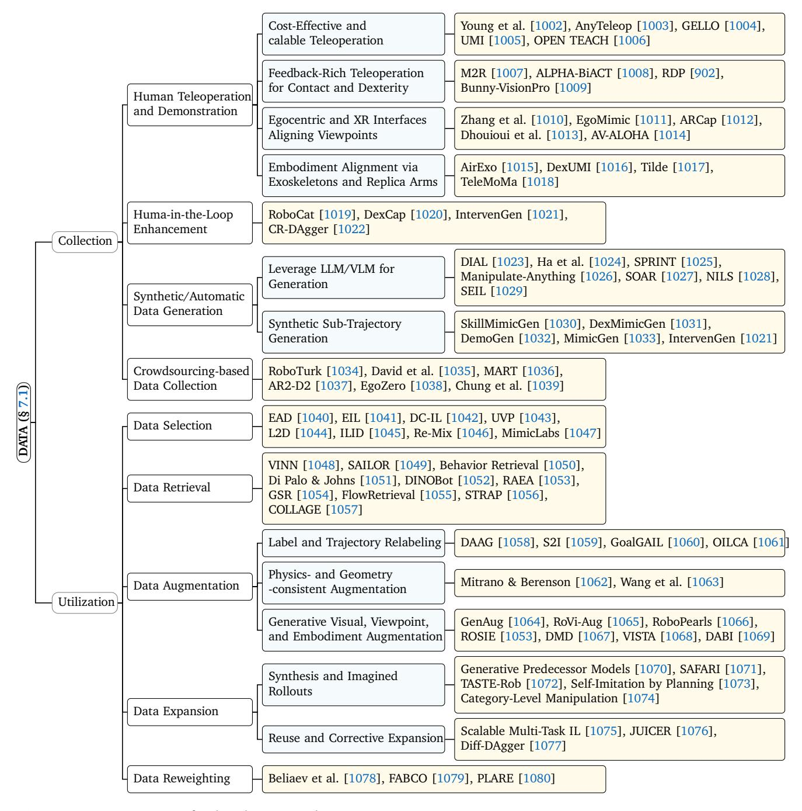

**Figure 20** | Overview of robot learning data taxonomy.

motion controllers to place operators in the robot observation–action space on PR2. EgoMimic [\[1011\]](#page-157-4) records egocentric AR video and hand motion for viewpoint–aligned teleoperation. ARCap [\[1012\]](#page-157-5) overlays AR guidance and haptics so non–experts can record robot–feasible demonstrations. Dhouioui et al. [\[1013\]](#page-157-6) apply immersive VR to collect expert–quality demonstrations for molecular manipulation tasks. In addition, active perception has been used to improve visibility in cluttered scenes, exemplified by AV-ALOHA [\[1014\]](#page-157-7), which adds an auxiliary camera arm to reduce occlusion and yield cleaner demonstrations.

**Embodiment Alignment via Exoskeletons and Replica Arms.** A complementary line aligns human kinematics with robot embodiment to simplify mapping and increase precision. AirExo [\[1015\]](#page-157-8)

presents an affordable dual–arm exoskeleton that bridges human–robot kinematic differences and travels easily for in–the–wild collection. DexUMI [\[1016\]](#page-157-9) combines a wearable exoskeleton for motion alignment with a software pipeline for visual domain adaptation, yielding high–fidelity dexterous data. Tilde [\[1017\]](#page-157-10) introduces a TeleHand–DeltaHand pair for precise one–to–one in–hand teleoperation and data capture. TeleMoMa [\[1018\]](#page-157-11) extends to whole–body mobile manipulation with a modular multimodal teleoperation stack.

Together, these teleoperation systems illustrate a spectrum of design choices that balance scalability, fidelity, and embodiment alignment, forming the foundation for large-scale robot data collection.

### **ii) Human-in-the-Loop Enhancement**

Human-in-the-loop approaches introduce targeted interventions and multi-round checks. By allowing humans to retrospectively verify outcomes or correct trajectories in real time, these methods improve data reliability. RoboCat [\[1019\]](#page-158-0) introduces a self-improving generalist agent that finetunes on a small set of human demonstrations and then self-generates new trajectories, which are retrospectively labeled for success by humans, enabling automated evaluation and continual learning with minimal direct supervision. DexCap[\[1020\]](#page-158-1) introduces a human-in-the-loop motion correction mechanism that combines residual correction and teleoperation, allowing real-time human intervention during policy execution. IntervenGen[\[1021\]](#page-158-2) introduces a novel data generation system that can autonomously produce a large set of corrective interventions with rich coverage of the state space from a small number of human interventions. CR-DAgger[\[1022\]](#page-158-3) introduces a compliant intervention interface and residual policy design that enable efficient use of minimal human corrections.

### **iii) Synthetic and Automatic Data Generation**

Human demonstrations are costly and limited in coverage. Synthetic and automatic methods address this by reducing annotation effort and scaling data diversity through multi-round generation.

**Leverage LLM/VLM for Generation.** A recent branch of research [\[1023](#page-158-4)[–1029\]](#page-158-10) attempts to leverage LLMs for task decomposition, followed by planning or reinforcement learning to parse subtasks and generate demonstrations. DIAL [\[1023\]](#page-158-4) augments unlabeled demonstrations with automatically generated language instructions from pretrained vision–language models, enabling efficient training of language-conditioned policies and generalization without costly annotation. Ha et al. [\[1024\]](#page-158-5) use LLM-guided planning and sampling to scale language-annotated data generation, then distill it into a robust multitask visuomotor policy with language-conditioned diffusion models, supporting retry-aware learning. SPRINT [\[1025\]](#page-158-6) relabels and composes instructions with large language models and applies language-conditioned offline reinforcement learning to chain skills across trajectories, improving downstream efficiency. Manipulate-Anything [\[1026\]](#page-158-7) generates self-correcting demonstrations with vision–language models without privileged information or hand-crafted skills, enabling zero-shot execution and robust policy training. Other work advances autonomous improvement with foundation models (SOAR [\[1027\]](#page-158-8)), zero-shot natural-language annotation of long-horizon videos (NILS [\[1028\]](#page-158-9)), and symmetry-aware augmentation that mixes expert trajectories with simulated transitions (SEIL [\[1029\]](#page-158-10)).

**Synthetic Sub-Trajectory Generation.** Another research direction is represented by MimicGen [\[1033\]](#page-159-1) and its extensions[\[1021,](#page-158-2) [1030,](#page-158-11) [1031,](#page-158-12) [1031\]](#page-158-12). MimicGen[\[1033\]](#page-159-1) adapts a set of human-collected source demonstrations to novel object configurations by synthesizing corresponding execution plans. In principle, this approach is applicable to a wide range of manipulation skills and object types. For example, DexMimicGen [\[1031\]](#page-158-12) extends the MimicGen strategy to support bimanual platforms equipped with dexterous hand end-effectors. However, the execution plans generated by MimicGen and its extensions [\[1021,](#page-158-2) [1030,](#page-158-11) [1031\]](#page-158-12) rely on costly physical robot deployments. To address this, DemoGen [\[1032\]](#page-159-0) replaces expensive robot-collected demonstrations with an efficient, fully synthetic

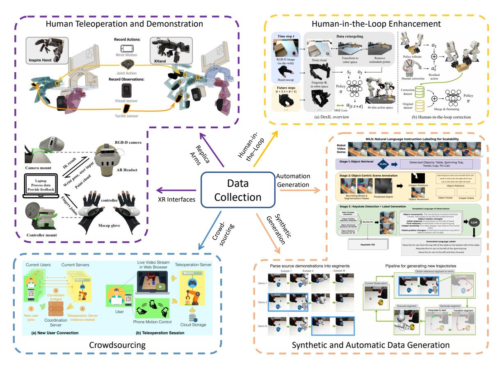

**Figure 21** | Overview of Data Collection. DEXUMI [\[1016\]](#page-157-9) employs Replica arms, and ARCAP [\[1012\]](#page-157-5) uses XR Interfaces to represent the data collection methods for Human Teleoperation and Demonstration. DexCap [\[1020\]](#page-158-1) stands for Human-in-the-Loop Enhancement, NILS [\[1028\]](#page-158-9) represents Automatic Data Generation, MimicGen [\[1033\]](#page-159-1) refers to Synthetic Data Generation, and RoboTur represents Crowdsourcing-based Data Collection.

generation process, which leverages TAMP-based trajectory adaptation and 3D point cloud editing to produce diverse demonstrations.

### **iv) Crowdsourcing-based Data Collection**

Crowdsourcing reduces the cost and expertise barriers of robot demonstration collection, enabling large-scale and diverse data acquisition beyond what expert operators alone can provide. A growing line of work leverages crowdsourcing to scale robot demonstration collection and reduce cost [\[1034–](#page-159-2) [1039\]](#page-159-7). RoboTurk [\[1034\]](#page-159-2) builds a smartphone teleoperation platform with a cloud backend. The design lowers entry barriers for remote workers, standardizes task setup and logging, and supports rapid collection of diverse manipulation trajectories at scale. David et al. [\[1035\]](#page-159-3) extend crowdsourced teleoperation from simulation to physical robots. The system addresses latency, safety, and reset logistics so that large numbers of real-robot demonstrations can be collected remotely across varied tasks. AR2-D2 [\[1037\]](#page-159-5) removes the need for real robots during collection by using an iOS AR application to capture human–object interactions and scene geometry, which are later retargeted to robots to reduce hardware and supervision requirements. Other work established the feasibility of platformbased collection [\[1039\]](#page-159-7), scaled to multi-arm settings by assigning one arm per worker [\[1036\]](#page-159-4), and enabled in-the-wild egocentric demonstrations with lightweight smart glasses [\[1038\]](#page-159-6).

### *7.1.2. Data Utilization*

Effectively utilizing existing data is essential for improving robot policy performance, especially under constraints of limited data collection budgets. Recent research has explored various strategies for selecting, retrieving, augmenting, expanding, and reweighing data to maximize its utility in training generalizable and robust manipulation policies.

### **i) Data Selection**

Raw robot datasets often contain noise, redundancy, or domain imbalance. To address this issue, recent work [\[1040](#page-159-8)[–1047\]](#page-160-2) studies how to select, filter, and adjust data for robot learning, including trajectory filtering, preference-based pruning, domain-mixture curation, and the choice of pretraining sources. EIL [\[1041\]](#page-159-9) filters extraneous segments by learning action-conditioned embeddings with temporal cycle consistency and applying an unsupervised voting-based alignment procedure. This yields cleaner demonstration sets that better match task intent. L2D [\[1044\]](#page-159-12) evaluates heterogeneous human demonstrations with latent trajectory representations and preference learning, then selects higher-quality examples for offline imitation learning, improving robustness under mixed-quality data. Re-Mix [\[1046\]](#page-160-1) formulates dataset curation as minimax reweighting over domain mixtures using excess behavior-cloning loss, automatically upweighting helpful domains while downweighting harmful ones to boost generalist policy performance. Other work, EAD [\[1040\]](#page-159-8) elicits aligned demonstrations via compatibility signals; DC-IL [\[1042\]](#page-159-10) defines action divergence and transition diversity as data-quality metrics to curb distribution shift; UVP [\[1043\]](#page-159-11) shows pretraining image distribution can matter more than dataset size; ILID [\[1045\]](#page-160-0) selects state–action pairs by scoring resultant states with a state-only discriminator; and MimicLabs [\[1047\]](#page-160-2) finds composition and retrieval that prioritize camera-pose and spatial diversity can outperform full-dataset training.

### **ii) Data Retrieval**

Retrieval-based approaches address the data bottleneck in robot learning by mining task-relevant demonstrations or sub-trajectories from large prior corpora, thereby reducing sample complexity and improving transferability [\[1048](#page-160-3)[–1057\]](#page-160-12).

A first line of work couples representation learning with non-parametric retrieval. VINN [\[1048\]](#page-160-3) learns a self-supervised visual encoder and performs nearest-neighbor search in the latent space, yielding a strong policy without gradient-based fine-tuning. SAILOR [\[1049\]](#page-160-4) organizes prior experience into a latent space of short-horizon skills and retrieves high-similarity sub-trajectories as reusable motion primitives, accelerating few-shot adaptation. Behavior Retrieval [\[1050\]](#page-160-5) further introduces a variational encoder to score state–action similarity, seeding queries with limited expert rollouts and jointly training on both expert and retrieved data to reduce reliance on labeled trajectories.

Beyond representation-driven methods, more recent studies emphasize adaptation and integration. Di Palo and Johns [\[1051\]](#page-160-6) retrieve and replay demonstrations through a three-stage decide–align–execute framework. DINOBot [\[1052\]](#page-160-7) adapts demonstrations to novel objects via pixel-level alignment on DINO-ViT features. RAEA [\[1053\]](#page-160-8) integrates trajectories from a multimodal memory directly into action prediction. GSR [\[1054\]](#page-160-9) organizes prior interactions as a graph over pretrained embeddings to imitate high-value behaviors identified by search. FlowRetrieval [\[1055\]](#page-160-10) leverages optical flow to mine cross-task motion segments, while STRAP [\[1056\]](#page-160-11) retrieves sub-trajectories with visual foundation models and time-invariant alignment. COLLAGE [\[1057\]](#page-160-12) fuses multiple similarity signals with adaptive weighting to curate high-quality training subsets from large datasets. Together, these approaches demonstrate that effective retrieval, whether through robust representation spaces or advanced adaptation mechanisms, can serve as a powerful alternative or complement to direct policy learning, enabling efficient few-shot learning and improved generalization across tasks.

### **iii) Data Augmentation**

We categorize augmentation strategies into three families: label and trajectory relabeling, physicsand geometry-consistent augmentation, and generative augmentation across visuals, viewpoints, and embodiments. These categories capture complementary aspects of how demonstrations can be reinterpreted, physically transformed, or perceptually diversified to improve learning.

**Label and Trajectory Relabeling.** This family focuses on reinterpreting existing demonstrations by modifying goals, segmenting sequences, or generating counterfactuals. DAAG [\[1058\]](#page-160-13) relabels trajectories in a temporally and geometrically consistent way using diffusion models, aligning them with new instructions to improve sample efficiency and transfer. S2I [\[1059\]](#page-161-0) segments demonstrations, applies contrastive selection, and optimizes trajectories to better leverage mixed-quality data. Related efforts include goal relabeling in GoalGAIL [\[1060\]](#page-161-1) and counterfactual sample generation with variational inference in OILCA [\[1061\]](#page-161-2).

**Physics- and Geometry-consistent Augmentation.** This emphasis is on creating physically valid demonstrations through transformations consistent with real-world dynamics. Mitrano and Berenson [\[1062\]](#page-161-3) treat augmentation as an optimization problem, applying rigid-body transformations to generate diverse but valid manipulation examples. Wang et al. [\[1063\]](#page-161-4) first isolate high-quality rollouts, then exploit environmental symmetries to construct principled augmentations.

**Generative Visual, Viewpoint, and Embodiment Augmentation.** This category uses generative models to expand perceptual diversity and embodiment coverage. GenAug [\[1064\]](#page-161-5) applies pretrained generative models for semantic scene edits that preserve behavior while enhancing visual variation. RoVi-Aug [\[1065\]](#page-161-6) employs diffusion-based image-to-image translation to synthesize demonstrations across robots and camera viewpoints, enabling zero-shot transfer to unseen embodiments. Robo-Pearls [\[1066\]](#page-161-7) leverages 3D Gaussian Splatting to create editable, photorealistic reconstructions for language-guided demonstration synthesis. Additional efforts include text-guided masking in ROSIE [\[1053\]](#page-160-8), deformable-eye novel view synthesis in DMD [\[1067\]](#page-161-8), single-image 3D-aware view generation in VISTA [\[1068\]](#page-161-9), and multi-rate sensory alignment in DABI [\[1069\]](#page-161-10).

### **iv) Data Expansion**

We categorize expansion methods into two complementary families. The first focuses on synthesis and imagination, where generative models, planners, or simulators create new experiences beyond the collected data. The second emphasizes reuse and correction, where existing demonstrations are transformed, recombined, or augmented with targeted corrective data to enrich training.

**Synthesis and Imagined Rollouts.** Generative Predecessor Models [\[1070\]](#page-161-11) learn distributions over predecessor states and sample synthetic state–action pairs that converge into expert trajectories, thereby densifying the space of successful behaviors and improving reachability. Self-Imitation by Planning [\[1073\]](#page-162-0) leverages planners to produce higher-quality rollouts from the same tasks and appends them to the dataset, forming an iterative improve–add–imitate loop that bootstraps policy performance. Category-Level Manipulation [\[1074\]](#page-162-1) applies adversarial self-imitation to generate novel category-level trajectories, augmenting raw demonstrations and strengthening generalization across object categories. SAFARI [\[1071\]](#page-161-12) synthesizes imagined rollouts that respect safety constraints and corrective intent, creating counterfactual demonstrations that are otherwise costly or infeasible to collect. TASTE-Rob [\[1072\]](#page-161-13) produces task-oriented hand–object interaction videos as demonstrations, enriching both visual and interaction diversity without requiring privileged labels.

**Reuse and Corrective Expansion.** Scalable Multi-Task Imitation Learning [\[1075\]](#page-162-2) relabels collected trajectories across tasks so that each demonstration supervises multiple goals, enabling large-scale cross-task reuse. JUICER [\[1076\]](#page-162-3) decomposes demonstrations into reusable motion segments and

recomposes them into new task sequences, achieving combinatorial growth of training data from a limited skill library. Diff-DAgger [\[1077\]](#page-162-4) estimates policy uncertainty with diffusion models and selectively collects or synthesizes corrective demonstrations only in uncertain regions, focusing supervision where failures are most likely.

### **v) Data Reweighting**

Data reweighting methods assign different importance to demonstrations based on quality, feasibility, or preference signals, rather than treating all data equally. This strategy mitigates the negative impact of suboptimal or inconsistent demonstrations and enhances policy learning by emphasizing high-value samples. Beliaev [\[1078\]](#page-162-5) et al. propose an imitation learning approach that estimates each demonstrator's expertise and uses it to weight the demonstration data. FABCO [\[1079\]](#page-162-6) presents a feasibility-aware imitation learning framework that assesses each human demonstration's feasibility via the robot's dynamics models and uses the estimated feasibility as a weight during policy learning. PLARE [\[1080\]](#page-162-7) introduces a method that dispenses with explicit reward modeling by querying a large vision-language model for preference labels on pairs of trajectory segments and then training the policy directly on these preference signals using a contrastive learning objective. Together, these methods highlight how reweighting demonstrations based on expertise, feasibility, or preference signals can enhance policy learning by emphasizing high-quality data and mitigating the impact of suboptimal examples.

### **7.2. Generalization**

Robotic manipulation generalization can be broadly categorized into three dimensions: **environment generalization**, **task generalization**, and **cross-embodiment generalization**. Environment generalization concerns robustness to variations in conditions such as Sim2Real transfer, spatial transformations, lighting, and background or distractor changes. Task generalization emphasizes maintaining performance across different task configurations, including long-horizon tasks, few-shot or meta-learning, continual learning, and skill composition. Cross-embodiment generalization focuses on transferring skills across robots with diverse morphologies, kinematics, dynamics, or sensing modalities, which is crucial for building general-purpose embodied agents. In what follows, we structure our survey along these three perspectives.

### *7.2.1. Environment Generalization*

Environment generalization in robotic manipulation refers to the ability of policies trained under specific conditions to maintain performance across varying environments, scenes, and physical settings. It addresses the discrepancy between simulated and real-world domains, as well as variations in geometry, viewpoint, lighting, and context that often degrade policy transferability.

### **i) Sim2Real and Real2Sim2Real Generalization**

Simulation offers a scalable alternative for training and evaluating manipulation policies, alleviating the high cost, operational risks, and safety concerns of large-scale real-world data collection. However, discrepancies in dynamics, sensing, and environmental complexity often result in poor transferability, commonly referred to as the sim-to-real gap [\[1088\]](#page-163-0). We categorize existing approaches into three paradigms based on how simulation and real-world data are leveraged to improve policy generalization: Simulation-Only Training, Real-World Adaptation, and Sim–Real Interaction.

**Simulation-Only Training.** This paradigm assumes that policies trained with sufficient variability in simulation can directly transfer to the real world without further tuning. A common technique is domain randomization, where physical parameters (e.g., mass, friction, damping) [\[1089\]](#page-163-1) and percep-

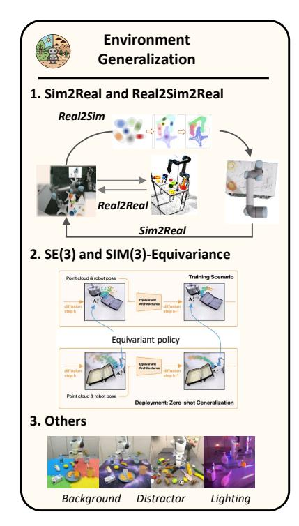

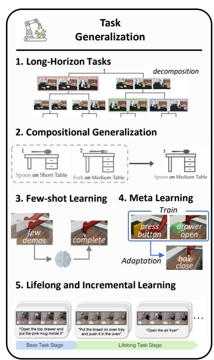

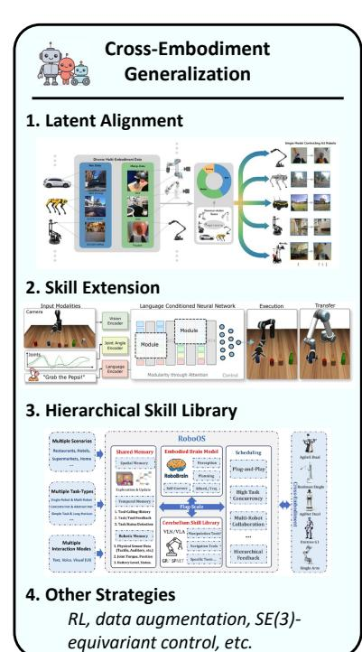

**Figure 22** | Overview of generalization. The figure is adapted from representative studies in environment generalization [836, 1081, 1082], task generalization [1083, 1084], and cross-embodiment generalization [1085–1087].

tual cues (e.g., textures [1090], lighting [1091], object pose [1092]) are systematically perturbed to promote robustness. Peng et al. [1093] showed that randomized dynamics improve sim-to-real transfer, while more recent efforts such as DexScale [1094] scale up augmentation and randomization to further boost generalization. However, these approaches rely on the assumption that simulated variability adequately captures real-world complexity, which often fails for tasks requiring fine-grained sensing or multimodal interaction.

**Real-World Adaptation.** This paradigm refines simulation-trained policies using real-world data, typically through fine-tuning, imitation, or online reinforcement learning. For instance, Josifovski et al. [1095] introduced safe continual adaptation under deployment constraints, whereas alternative methods employ pseudo-labeling or distillation to exploit real sensory streams with minimal annotation. Such methods offer greater robustness than simulation-only approaches but are limited by the cost and risk of real-world interaction, which constrains scalability in high-stakes domains.

**Sim–Real Interaction.** Rather than treating adaptation as a post hoc correction, this paradigm reconstructs simulation directly from real-world data to close the sim-to-real loop [1096–1098]. Advances such as 3D scanning enable the creation of high-fidelity digital twins. For example, RialTo [1096] builds task-specific scenes from minimal sensing and uses inverse distillation to learn transferable policies. Although requiring more infrastructure, this approach combines realism and scalability, enabling safer and more efficient learning in complex tasks where direct trial-and-error in the real world is impractical.

### ii) SE(3) and SIM(3)-Equivariance Generalization

A complementary strategy for environment generalization is to embed geometric equivariance into policy architectures. These methods enforce SE(3) or SIM(3)-equivariance so that representations stay

consistent under viewpoint, pose, or scale changes. By doing so, policies can adapt to new perspectives and scene layouts without large amounts of retraining. Representative works include EquiBot [\[1082\]](#page-162-9) and ET-SEED [\[1099\]](#page-164-0), which design equivariant diffusion policies for robust manipulation. Adapt3R [\[767\]](#page-139-0) extends this idea with adaptive 3D scene representations. Recent work on active viewpoint control [\[1100\]](#page-164-1) also shows that imitation learning with neck motion can push manipulation beyond the initial field of view. Together, these works highlight geometric equivariance as a powerful inductive bias that complements sim2real pipelines.

### **iii) Others**

Lighting, background, and distractor variations also present fundamental challenges for visual generalization in robotic manipulation, as policies often overfit to training conditions. Recent work tackles this issue through augmentation, representation learning, and context-robust imitation. Physicallybased augmentation methods explicitly perturb lighting to improve robustness under illumination shifts [\[1101\]](#page-164-2). Object-centric and factorized representations aim to disentangle task-relevant features from background clutter, thereby narrowing the generalization gap [\[1102,](#page-164-3) [1103\]](#page-164-4). Other approaches emphasize cross-context imitation, either by regularizing position-invariant features [\[1104\]](#page-164-5) or by learning from demonstrations collected under inconsistent or varying contexts [\[1105,](#page-164-6) [1106\]](#page-164-7). At scale, foundation-model-based policies such as SwitchVLA [\[866\]](#page-146-11) and Diffusion-VLA [\[795\]](#page-141-6) demonstrate improved resilience to distractors by leveraging large multimodal priors. Collectively, these studies highlight that addressing visual shifts is crucial for bridging the gap between controlled training settings and deployment in cluttered, dynamic environments.

### *7.2.2. Task Generalization*

Task generalization in robotic manipulation refers to the ability of learned policies to adapt to new, complex, or unseen tasks without extensive retraining. It encompasses the generalization of learned skills, structures, and adaptation mechanisms across variations in task composition, semantics, and temporal scope. Robust task generalization requires policies not only to execute individual skills but also to compose, transfer, and refine them under new configurations and objectives.

### **i) Generalization for Long-horizon Tasks**

Long-horizon robotic manipulation represents a core challenge for embodied intelligence. Unlike short-horizon tasks that typically involve single-skill execution, long-horizon problems demand the coordination of multiple sub-skills, hierarchical reasoning, and temporally abstract decision-making. Robust generalization requires agents not only to plan and execute extended action sequences but also to adapt across variations in task structure, object arrangement, and dynamic environments. Recent advances approach this challenge along three interconnected axes: skill compositionality, semantic task decomposition, and structure-aware representation learning.

**Skill Compositionality.** At the foundation lies the ability to compose and reuse modular skills [\[1107–](#page-164-8) [1113\]](#page-165-0). STAP [\[1111\]](#page-164-9) addresses sequencing by optimizing the feasibility of action chains. Generative frameworks such as BOSS [\[1112\]](#page-164-10) and BLADE [\[1113\]](#page-165-0) leverage large language models to autonomously expand skill libraries and incorporate semantic grounding into action spaces, thereby enabling flexible skill reuse and extension.

**Semantic Task Decomposition.** Beyond static skill composition, multimodal semantics have been introduced to parse and decompose tasks into modular components [\[1114–](#page-165-1)[1119\]](#page-165-2). PALO [\[1115\]](#page-165-3) employs vision-language models to translate high-level task descriptions into reusable sub-tasks, enabling rapid adaptation with minimal supervision. ManipGen [\[1116\]](#page-165-4) integrates local policies that encode invariances in pose, skill order, and scene layout, combining them with foundational models

in vision and motion planning to generalize across unseen long-horizon sequences.

**Structure-aware Representation Learning.** A finer level of generalization is achieved through task-level abstraction and representation learning [\[1120–](#page-165-5)[1125\]](#page-165-6). TBBF [\[1123\]](#page-165-7) decomposes complex tasks into primitive therbligs, facilitating efficient action-object mappings and trajectory synthesis. RoboHorizon [\[1124\]](#page-165-8) formalizes a Recognize-Sense-Plan-Act pipeline by fusing LLMs with multi-view world models, addressing sparse reward supervision and perceptual complexity. HD-Space [\[1125\]](#page-165-6) identifies atomic sub-task boundaries from demonstrations, improving sample efficiency and policy robustness with limited data.

### **ii) Compositional Generalization**

Compositional generalization in robotic manipulation emphasizes the ability to solve novel tasks by systematically recombining known skills, objects, and instructions. Recent research explores diverse strategies to achieve this capability. One line of work focuses on data-driven efficiency, where targeted data collection strategies are designed to maximize coverage of compositional variations with minimal demonstrations, enabling scalable policy training [\[1083\]](#page-162-10). Another approach grounds policies in programmatic or symbolic structures, allowing robots to leverage modular task representations for systematic recomposition and generalization to unseen task combinations [\[1126\]](#page-166-0). Complementary efforts investigate policy architectures that explicitly factorize control into entities or modules, facilitating the recombination of learned components to improve adaptability in complex environments [\[1127\]](#page-166-1). Together, these methods illustrate a growing effort to move beyond rote memorization of tasks toward systematic generalization, enabling robots to flexibly adapt to combinatorial task spaces.

### **iii) Few-shot Learning**

Few-shot learning enables robots to acquire skills from only a handful of demonstrations [\[1128–](#page-166-2) [1132\]](#page-166-3), alleviating the high cost of large-scale data collection. Research in this area can be broadly grouped into two directions: embedding structured priors and leveraging semantic transfer. One line of work embeds structured inductive biases into perception and control to maximize the utility of limited demonstrations. Domain-invariant constraints, including spatial equivariance, 3D geometry, or action continuity, are incorporated to reduce data requirements and improve generalization. For example, Ren et al. [\[1133\]](#page-166-4) combine point cloud representations with a diffusion-based policy, achieving robust generalization from as few as ten demonstrations. A complementary line of research emphasizes semantic transfer and compositional generalization. These methods extract transferable knowledge from alternative sources, such as human demonstrations or previously solved tasks, and adapt it to new objectives. For instance, YOTO [\[1000\]](#page-156-6) maps human hand motions from video to dual-arm robotic skills, while TOPIC [\[1134\]](#page-166-5) constructs task prompts and a dynamic relation graph to systematically reuse prior experience for new policy learning.

### **iv) Meta Learning**

While closely related to few-shot learning, meta learning distinguishes itself by focusing on the ability to *amortize* task adaptation. Instead of relying directly on structural priors or semantic transfer to generalize from a handful of demonstrations, meta learning trains over a distribution of tasks so that the model acquires a generic adaptation procedure. This paradigm equips robots with rapid adaptability to unseen tasks, even under extremely limited supervision [\[10,](#page-82-6) [1135–](#page-166-6)[1140\]](#page-167-0).

**Task-Conditioned Meta-Representations.** One direction focuses on learning task-conditioned embeddings that serve as meta-representations. Early approaches such as Duan et al. [\[10\]](#page-82-6) and TecNets [\[1135\]](#page-166-6) encode demonstrations into low-dimensional vectors for policy conditioning. Later works extend this idea with relational graph networks [\[1136\]](#page-166-7) or invariance-based objectives [\[1137\]](#page-166-8), enforcing

structural consistency across tasks. These embedding-based approaches highlight the importance of compact task representations in accelerating policy adaptation.

**Cross-Modal and Instruction-Driven Adaptation.** Another direction emphasizes the integration of additional modalities and task instructions into the adaptation process. MILLION [\[1138\]](#page-166-9) incorporates natural language into the meta-learning loop, enabling semantically guided adaptation. FISH [\[1139\]](#page-166-10) demonstrates versatile skill acquisition from just one minute of demonstrations, while interaction-warping [\[1140\]](#page-167-0) aligns novel trajectories with past interaction structures to facilitate transfer. Collectively, these works establish meta learning as a principled framework for scalable and data-efficient generalization.

### **v) Lifelong, Continual and Incremental Learning**

Endowing robots with the ability to learn continuously is a key milestone toward building adaptive and autonomous embodied agents. This capability requires retaining previously acquired skills without forgetting while avoiding the need for complete retraining. In robotic manipulation, two closely related paradigms have emerged to address this challenge: lifelong learning (continual learning) and incremental learning. Although they differ in focus, both aim to support sustained performance in real-world scenarios.

**Lifelong and Continual Learning.** This paradigm emphasizes the retention and reuse of knowledge across sequential tasks [\[1141–](#page-167-1)[1144\]](#page-167-2). For instance, PPL [\[1141\]](#page-167-1) encodes reusable motion primitives as prompts, while DMPEL [\[1144\]](#page-167-2) employs a modular ensemble of experts with coefficient replay. These approaches show that structured modularity, through either prompt-based reuse or expert specialization, facilitates forward transfer of knowledge while alleviating catastrophic forgetting.

**Incremental Learning.** In contrast, incremental learning addresses settings where robots acquire new atomic skills one task at a time. iManip [\[1145\]](#page-167-3) formalizes this problem with a benchmark built on RLBench [\[96\]](#page-89-6) and introduces an extendable PerceiverIO model that adapts action prompts for new primitives. By combining incremental model expansion with replay-based training, it supports effective skill accumulation while avoiding catastrophic forgetting. This paradigm underscores the importance of modular architectures and continual update mechanisms in enabling long-term learning for robotic manipulation.

### *7.2.3. Cross-Embodiment Generalization*

Cross-embodiment generalization refers to the ability of robotic policies or representations to transfer across embodiments with different morphologies, kinematics, dynamics, or sensing modalities. This capability is critical for developing general-purpose embodied agents that operate seamlessly across diverse platforms, including arms, mobile manipulators, and humanoid robots.

**Latent Alignment.** The latent alignment paradigm aims to achieve cross-embodiment generalization by mapping heterogeneous robot morphologies into a shared latent representation space, enabling policy transfer without explicit correspondence in state or action dimensions. Early work such as XSkill [\[1146\]](#page-167-4) introduces an unsupervised framework that discovers embodiment-agnostic skills by disentangling latent motion factors, enabling reusable skill primitives across robots. Wang et al. [\[1147\]](#page-167-5) extend this idea via latent space alignment, jointly optimizing a shared embedding to preserve action equivalence between morphologies and support transfer under mismatched kinematics. Latent Action Diffusion [\[943\]](#page-152-6) advances this direction by employing diffusion-based generative modeling to interpolate and align latent actions across embodiments, achieving smooth and consistent transfer in high-dimensional manipulation tasks. Large-scale frameworks such as OmniMimic [\[1085\]](#page-162-12) and CrossFormer [\[1148\]](#page-167-6) demonstrate that training on diverse embodiments within a unified latent

action space produces scalable, general-purpose controllers capable of zero-shot transfer across manipulation, navigation, and locomotion. Similarly, HPT [\[752\]](#page-138-5) integrates heterogeneous pre-trained visual and proprioceptive Transformers into a shared latent fusion module, improving robustness and coordination across embodiments. Together, these works position latent alignment as a scalable and principled foundation for bridging morphology-specific policies toward unified embodied intelligence.

**Skill Extension.** The skill extension paradigm focuses on scaling and transferring manipulation abilities across embodiments, such as adapting single-arm policies to bimanual coordination or transferring skills between morphologically distinct manipulators. AnyBimanual [\[1149\]](#page-167-7) enables unimanual-to-bimanual transfer through shared latent representations and motion consistency constraints, decomposing dual-arm actions into coordinated single-arm primitives for flexible adaptation. Modularity through Attention [\[1086\]](#page-163-11) employs an attention-based modular policy architecture that learns composable, language-conditioned skill representations, supporting efficient reuse across embodiments and tasks. These works collectively show that modular and structured representations provide a scalable foundation for skill extension and cross-embodiment transfer.

**Hierarchical Skill Library.** The hierarchical skill library paradigm focuses on scalable frameworks that organize and coordinate manipulation skills across diverse embodiments through structured abstraction and modular design. RoboOS [\[1087\]](#page-163-2) introduces a hierarchical embodied framework that unifies cross-embodiment and multi-agent collaboration within an operating system–like architecture, abstracting perception, control, and communication into standardized APIs for shared skill reuse and adaptability. By integrating high-level task orchestration with low-level motion primitives, this hierarchical organization bridges engineering infrastructure and embodied intelligence, enabling large-scale, interoperable skill reuse across diverse robotic platforms.

**Other Strategies.** Recent research on cross-embodiment learning explores complementary paradigms such as data augmentation, reinforcement learning, and SE(3)-equivariant control to address distinct transfer challenges. Mirage [\[1150\]](#page-167-8) uses cross-painting to re-render source observations for zero-shot transfer between robots. In RL, Human2Sim2Robot [\[1151\]](#page-167-9) bridges the human–robot gap with a single demonstration, while X-Sim [\[1097\]](#page-163-12) reconstructs high-fidelity simulations for real-to-sim-to-real policy reuse. LEGATO [\[1152\]](#page-167-10) introduces an SE(3)-equivariant imitation framework that unifies perception and control using a shared grasping tool, enabling consistent transfer across morphologies. Collectively, these approaches advance robust cross-embodiment generalization through perceptual adaptation, RL-based alignment, and geometric consistency.

# **8. Applications**

Robotics research plays a central role in advancing intelligent systems with tangible real-world impact. Over the past decades, robots have evolved from rigid, hard-coded tools executing predefined routines into perceptive agents capable of interpreting and interacting with their environments, with vision as a primary modality. Today, empowered by large language models and multimodal foundation models, the field is rapidly progressing toward embodied intelligence, where robots integrate perception, planning, and control to accomplish complex tasks in dynamic and uncertain settings [\[1153,](#page-167-11) [1154\]](#page-168-0). This paradigm shift requires not only precise mechanical design but also robust and generalizable decision-making that enables robots to adapt flexibly across diverse tasks and user instructions. These advances are fueling applications in domestic, healthcare, industrial, and scientific domains. To illustrate these developments, Figure [23](#page-75-1) presents representative application domains and typical tasks across sectors. The remainder of this section focuses on these application scenarios, outlining how robots are being deployed in practice across different fields.

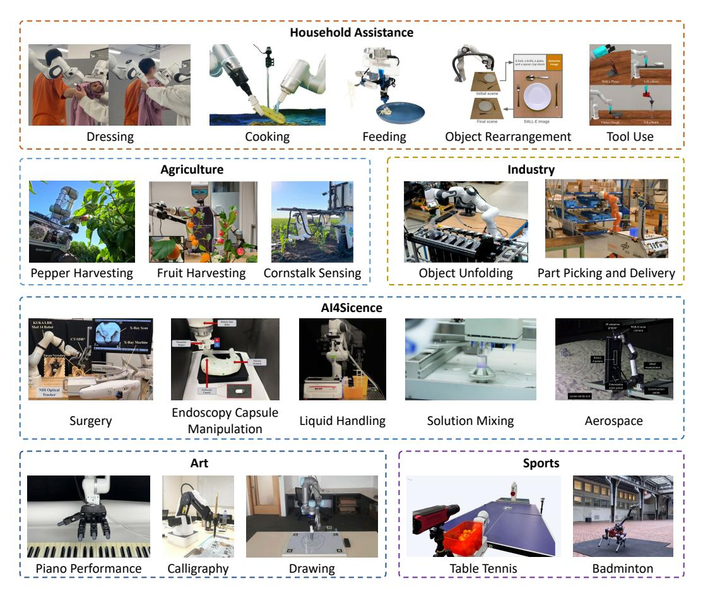

**Figure 23** | Overview of robotic manipulation applications across diverse domains. The figure is adapted from representative works in household assistance [422, 1155–1159], agriculture [1160–1162], industry [1163–1165], AI4Science [1166–1169], art [1170–1172], and sports [1173, 1174].

### 8.1. Household Assistance

Robotic manipulation in household environments targets essential daily activities such as dressing, cooking, feeding, assisting, stowing, object rearrangement, and tool use. Dressing assistance has been studied through bimanual strategies and safe human-robot interaction with deformable garments [1155, 1156, 1175]. Cooking and feeding tasks emphasize contact-rich manipulation and adaptive policies for varied food types and configurations [1157, 1176, 1177]. Assistive care applications explore shared control and soft manipulators for elderly support [280, 1178]. Stowing and object rearrangement tasks leverage behavior primitives, language-guided planning, and vision-language models to enable flexible scene organization [1158, 1159, 1179–1181]. Finally, tool manipulation has emerged as a critical subdomain, where function-centric imitation, language grounding, and generative design support skill transfer across diverse household tasks [422, 1182–1184].

#### 8.2. Agriculture

Agriculture is an important yet highly challenging application domain for robotic manipulation, where robots must operate in unstructured environments characterized by dense canopies, variable lighting, irregular crop shapes, and the need for delicate handling. Recent works demonstrate progress across multiple crop types and farming conditions. For instance, robotic systems have been deployed for fruit and pepper harvesting in outdoor fields, showing the feasibility of autonomous harvesting

under occlusion and cluttered backgrounds [\[1160,](#page-168-3) [1161,](#page-168-11) [1185,](#page-170-3) [1186\]](#page-170-4). Other efforts address the safe manipulation of fragile bio-products, such as irregular poultry carcasses, by integrating customized grippers with learned control strategies [\[1187\]](#page-170-5). Beyond harvesting, new controllers have been designed for navigating dense plant canopies and adapting to complex interactions with foliage [\[1188\]](#page-170-6). Together, these studies highlight the potential of robotics to enhance productivity, safety, and precision in agriculture, paving the way toward scalable automation in one of the most labor-intensive sectors.

### **8.3. Industry**

In industrial contexts, robotic manipulation plays a crucial role in automating complex and large-scale processes such as assembly, logistics, and material handling. Early efforts emphasized enabling autonomous mobile manipulation in structured factory settings, laying the foundation for robots to navigate and interact in dynamic production environments [\[1164\]](#page-168-12). To support system design and deployment, modeling frameworks such as RobotML have been developed for simulating and validating industrial manipulation scenarios [\[1189\]](#page-170-7). More recent advances demonstrate how intelligent systems can enhance manufacturing flexibility, with reinforcement learning enabling adaptive assembly strategies that improve efficiency and reduce manual intervention [\[1190\]](#page-170-8). At the same time, specialized applications have emerged to address challenging settings, such as vision-based manipulation of transparent plastic bags, which are common in industrial packaging and logistics but difficult for traditional perception systems [\[1163\]](#page-168-5). Collectively, these applications illustrate how robotic manipulation is transitioning from fixed, rigid automation pipelines toward more adaptive, perception-driven systems capable of handling diverse tasks in real-world industrial environments. It should be noted, however, that most learning-driven approaches are still evaluated in simulation or laboratory setups rather than on fully deployed factory lines, as industrial deployment demands strict reliability and safety, where rule-based systems remain the prevailing choice.

### **8.4. AI4Science**

Robotic manipulation is increasingly being applied as a powerful enabler for scientific discovery, where precision, repeatability, and autonomy are critical. In medical science, robotic systems are advancing surgical assistance and minimally invasive procedures, ranging from autonomous intubation [\[1191\]](#page-170-9), capsule robot navigation [\[1167\]](#page-168-13), and robotic spinal fixation [\[1166\]](#page-168-7), to language-conditioned surgical planning [\[1192,](#page-170-10) [1193\]](#page-170-11) and high-fidelity training simulators such as SonoGym for ultrasound-guided surgery [\[1194\]](#page-171-0). Beyond medicine, robotics also supports biology and life sciences, with platforms like RoboCulture [\[1168\]](#page-169-10) enabling automated biological experimentation and robotic micromanipulation systems providing real-time spatiotemporal assistance in microscopy [\[1195\]](#page-171-1). In chemistry, the recently proposed robotic AI chemist [\[1196\]](#page-171-2) demonstrates how multi-agent robotic systems can autonomously conduct chemical experiments on demand, accelerating discovery by integrating automation with intelligent decision-making. In aerospace, manipulation technologies extend to high-stakes environments, such as space assembly and in-orbit trajectory learning for robotic arms [\[1169,](#page-169-0) [1197\]](#page-171-3). More broadly, simulation frameworks like LabUtopia [\[1198\]](#page-171-4) establish standardized environments for training and benchmarking embodied scientific agents. Collectively, these applications highlight how robotics is becoming an essential tool in AI4Science, accelerating progress in medicine, biology, aerospace, and beyond.

### **8.5. Art**

Robotic manipulation has also found applications in the artistic domain, where tasks such as music performance, calligraphy, drawing, and co-creative design showcase the expressive and demonstrative

potential of embodied agents. In music, RP1M provides a large-scale motion dataset enabling robots to perform piano playing with bi-manual dexterous hands, highlighting how robotic systems can be trained to execute highly coordinated and nuanced actions beyond traditional industrial tasks [\[1199\]](#page-171-5). In visual art, robotic calligraphy demonstrates how imitation learning can support the reproduction of culturally significant practices by planning precise brush trajectories in threedimensional space [\[1170,](#page-169-1) [1200\]](#page-171-6), while RoboCoDraw integrates GAN-based style transfer with timeefficient path optimization to allow robots to generate stylized portrait drawings [\[1172\]](#page-169-2). Beyond performance, robotics has also been integrated into design and architecture through co-intelligent processes, where robots learn to translate design intent into executable construction paths, expanding their role as creative collaborators [\[1165\]](#page-168-6). Together, these studies illustrate how robotics can extend from functional manipulation to artistic expression, providing both a testbed for fine-grained motor control and a platform for human–robot collaboration in creative fields.

### **8.6. Sports**

Robotic manipulation has also entered the domain of sports, where dynamic, high-speed interactions demand precise perception–action coordination. Recent advances demonstrate robots learning to perform complex athletic skills, such as legged manipulators executing coordinated badminton movements that couple locomotion with dexterous striking [\[1173\]](#page-169-3). In table tennis, robots have been trained to handle fast-paced rallies, from early efforts in sample-efficient reinforcement learning for controlled ball exchanges [\[1201\]](#page-171-7) to more recent systems like SpikePingpong, which leverages spike-based vision sensors for real-time, high-frequency striking with enhanced precision [\[1174\]](#page-169-4). These applications not only showcase robotics as a platform for pushing the limits of real-time control and multimodal perception but also offer new opportunities for human–robot interaction, training, and performance augmentation in competitive sports.

# **9. Prospective Future Research Directions**

To advance robotic manipulation from controlled laboratory settings to open, dynamic, real-world environments, our ultimate goal is to construct agent-centric robotic systems. Such systems must possess the capacity for autonomous perception, understanding, decision-making, and execution, capable of learning and growing through continuous interaction with the environment. To realize this grand vision, we must confront and overcome a series of profound challenges across the dimensions of data, models, physical interaction, and system safety.

### **9.1. Building a True Robot Brain**

*– Core Challenge 1: Building a Foundation Model for "One Brain, Multiple Embodiments."*

The field of robotics is currently shifting from the paradigm of "one model per task" towards the creation of a unified, general-purpose foundation model. This concept, often termed "One Brain, Multiple Embodiments," aims to develop a single "brain" capable of driving a wide array of robots. This includes seamlessly controlling diverse morphologies, from desktop manipulators to mobile manipulation platforms such as wheeled or bipedal robots, enabling them to perform a variety of tasks in larger, more complex spaces. The realization of this vision hinges on breakthroughs in several core areas.

**General-Purpose Architecture and Continual Learning.** A universal robotic model must be capable of operating across heterogeneous observation and action spaces, ranging from vision sensors with

different resolutions to embodiments with or without tactile feedback, and from joint-level control in a 7-DOF manipulator to whole-body balance control in bipedal systems. Addressing this diversity requires architectures with exceptional flexibility, scalability, and adaptability.

**Active Exploration and Lifelong Learning.** Equally critical is the capacity for continual learning. Beyond avoiding catastrophic forgetting when acquiring new skills (for example, transitioning from "opening a door" to "unscrewing a cap"), robots should achieve positive forward transfer, where mastering a new capability deepens physical understanding and enhances performance on previously learned tasks. Realizing this vision necessitates advances in dynamic network architectures, memory and replay mechanisms, and efficient representation learning. Moreover, policies should continue to evolve after deployment, actively exploring and accumulating experience from the environment. Strategies such as active learning, large-scale parallel exploration, and autonomous skill discovery will be key to enabling robots that continuously adapt and improve over time.

**Robustness in Long-Horizon Tasks.** Everyday activities, such as "making a cup of coffee," may span dozens of steps and unfold over several minutes, during which minor execution errors can accumulate into unrecoverable failures. To succeed in such settings, policies must go beyond generating action sequences and instead actively maintain execution within a feasible "funnel of success." This requires a causal understanding of tasks, the ability to anticipate long-term consequences of current actions, and proactive micro-adjustments to correct deviations. Achieving this robustness will likely depend on tighter integration between high-level planning, such as task decomposition guided by large language models, and low-level closed-loop feedback control.

**Stable and Smooth Motion Control.** The quality of motion generation directly determines both effectiveness and safety in robotic manipulation. Rather than producing stiff or discrete commands, advanced models should generate smooth, dynamically consistent trajectories that support stable and compliant interaction. Control-theoretic strategies, such as impedance control, allow robots to function as programmable spring-damper systems, exerting appropriate forces while safely yielding to unexpected contact. Such capabilities not only improve the precision required for delicate tasks such as polishing or wiping but also form a fundamental prerequisite for ensuring physical safety in human–robot collaboration.

### **9.2. Data Bottleneck and Sim-to-Real Gap**

*– Core Challenge 2: Overcoming the Data Bottleneck and the Sim-to-Real Gap.*

Data and simulation are the two cornerstones of the modern robot learning paradigm, yet they are also its most fragile components. Building an efficient "data flywheel" and bridging the simulationto-reality gap are urgent priorities.

**The Multi-Faceted Challenge of Real-World Data.** We face a multi-faceted "data dilemma": a lack of standardization prevents the integration of data from different sources, creating data silos; data quality is inconsistent, with vast amounts of low-efficiency or erroneous data (e.g., failed exploratory trajectories) contaminating datasets, and we still lack effective, automated evaluation metrics; the growth in data quantity pales in comparison to the trillions of tokens required by large-scale models. Future research must focus on establishing a virtuous "data flywheel": using existing models to drive robots to perform large-scale autonomous exploration and data collection, then using this new data to train more capable models. The critical link in this cycle is the development of efficient mechanisms for data filtering, annotation, and value assessment, ensuring that models can distill high-value signals from massive, noisy, self-collected datasets.

**High-Fidelity and Differentiable Simulation.** Simulation is a vital pathway to mitigating data

scarcity, but the "fidelity gap" severely hinders its application. In robotic manipulation especially, current simulators offer crude approximations of contact physics, failing to accurately model critical phenomena like friction, collision, and deformation. This causes policies that excel in simulation to fail catastrophically in the real world. One future direction is the development of higher-fidelity simulators, particularly for scenarios involving deformable objects and complex multi-body interactions. A more revolutionary direction is Differentiable Simulation. By rendering the entire physics simulation as a differentiable computational graph, it allows gradients to be backpropagated from a task objective (e.g., "move the block to the target") directly to the control policy. Compared to the thousands of trial-and-error episodes in reinforcement learning, this method promises to increase the efficiency of policy optimization by several orders of magnitude.

### **9.3. Multimodal Physical Interaction**

*– Core Challenge 3: Towards Multimodal Deep Physical Interaction.*

Robots interact with the world through a complete perception-action loop encompassing vision, hearing, touch, and proprioception. To endow robots with true physical intelligence, we must equip them with similarly rich, multimodal sensory and interactive capabilities.

**Fusing a Broader Spectrum of Sensory Modalities.** The current vision-centric paradigm is approaching its limits. Consider how a human can find a key and unlock a door in complete darkness using only touch. Future robots urgently need to incorporate more modalities beyond vision to deepen their understanding of the physical world. High-resolution electronic skin (tactile sensing) can allow robots to perceive texture, hardness, temperature, and slip; microphones (audition) can enable them to judge if a part is correctly assembled by its sound or to detect equipment anomalies; inertial measurement units (proprioception) provide an intrinsic sense of their own posture and motion. The true challenge lies in designing neural architectures that can effectively fuse these heterogeneous, asynchronous, and multi-rate signals into a unified, cross-modal representation that serves action-making.

**Interaction with Deformable and Complex Objects.** The manipulation of deformable objects (e.g., folding clothes, organizing cables) and complex materials like fluids or granular matter (e.g., pouring water, scooping rice) remains one of the most significant weaknesses of modern robotics. The fundamental difficulty is that the state space of these objects is effectively infinite-dimensional and cannot be described by a few simple parameters like a rigid body. Future research must explore new representations, such as using Graph Neural Networks (GNNs) to model a piece of cloth as a dynamic network of nodes and edges. This would allow the model to reason about force propagation, wrinkling, and folding. This not only places extreme demands on simulation technology but also requires models with powerful spatial reasoning and physics-informed inference capabilities.

### **9.4. Safety and Collaboration**

*– Core Challenge 4: Ensuring Safety and Collaboration in Internal, Inter-Robot, and Human-Robot Coexistence.*

As robots move beyond factory cages and into our homes, offices, and public spaces, safety and interaction transform from technical features into non-negotiable prerequisites.

**Intrinsic Safety and Self-Constrained Control.** Future robots must not only protect humans and the environment but also ensure their own operational safety. As robots become faster, stronger, and more dexterous, excessive joint velocities, abrupt accelerations, or unstable force outputs can lead

to self-inflicted damage or emergency stops that disrupt task execution. Next-generation control architectures should therefore embed intrinsic safety constraints that regulate motion smoothness, energy output, and mechanical stress in real time. By continuously monitoring kinematic and dynamic limits, robots could adaptively modulate their movements to prevent excessive strain while maintaining task efficiency. Such self-regulating mechanisms will allow robots to operate more safely and autonomously in unstructured or long-duration deployments.

**Inter-Robot Safety and Cooperative Coordination.** As multi-robot systems become increasingly common in industrial, domestic, and service environments, ensuring safe and efficient collaboration among robots will be as critical as human–robot safety. Beyond avoiding physical collisions, future research must address behavioral coordination and task-level negotiation—how multiple robots share workspace, anticipate each other's trajectories, and dynamically adjust their actions to prevent interference. This requires the development of shared safety protocols, predictive coordination frameworks, and communication mechanisms that enable mutual awareness and adaptive cooperation. Ultimately, achieving reliable inter-robot safety will be essential for large-scale, distributed robotic ecosystems where many agents act concurrently toward shared goals.

**Natural and Efficient Human-Robot Interaction (HRI).** The robot of the future should not be a passive tool awaiting commands but an active partner capable of understanding human intent and collaborating proactively. This requires us to build more natural and efficient Human-Robot Interaction interfaces. This goes far beyond simple voice commands to achieve true intent inference. For example, if a user picks up a screw and looks at a wooden board, the robot should infer the user's intent to fasten the screw and proactively offer a screwdriver or help stabilize the board. This involves a holistic understanding of human posture, gaze, language, and even emotion, building a "Theory of Mind" for the robot. On this basis, we can achieve fluid Shared Autonomy, where humans and robots seamlessly collaborate on tasks, each contributing their unique strengths.

**Autonomous Fault Detection and Recovery.** Safety is the absolute baseline for any robotic application. Future robots must function like an organism with an "immune system," capable of continuous selfmonitoring. This includes detecting internal hardware faults (e.g., motor overheating, sensor failure), software anomalies (e.g., a planning module stuck in a loop), and unexpected external events (e.g., a person suddenly entering the workspace). Furthermore, the system must not only detect a fault but also autonomously execute a safe recovery policy—be it an emergency stop, a retreat to a safe position, or a request for human assistance. This requires the deep integration of technologies such as anomaly detection, causal inference, and robust planning.

**Enhancing Safety with Non-Learning-Based Paradigms.** Current learning-based models for robotic manipulation often achieve limited success rates, and in out-of-distribution scenarios their performance may even fall to zero. In contrast, non-learning-based approaches such as rule-based systems or classical control algorithms like MPC provide the stability and reliability required in safety-critical environments such as industrial settings. An important future direction is therefore the development of hybrid paradigms that integrate the adaptability of learning-based methods with the robustness of non-learning approaches, ensuring both generalization and stability for real-world deployment.

# **10. Conclusion**

This survey provides a comprehensive and systematic overview of robot manipulation, covering fundamental background knowledge, task-specific benchmarks, representative methods, critical bottlenecks, and real-world applications. Despite substantial progress, robotic manipulation remains far from achieving human-level versatility. Major open challenges persist, including the development of a unified "robot brain," the resolution of data and perception bottlenecks, and the assurance of

safety in human–robot collaboration. Bridging these gaps is essential for enabling learning-based robotic systems to move beyond controlled laboratory environments and into everyday life and diverse industries. We hope this survey will serve as both a roadmap for newcomers and a comprehensive reference for experienced researchers, fostering a unified understanding of robotic manipulation and inspiring future advances in embodied intelligence.

# **Acknowledgments**

This work was supported by the National Natural Science Foundation of China (Grant No. U21A20485).

# **Author Contributions**

The contributions of all participating authors are summarized below, indicating the primary author responsible for each section and the supporting contributors. The detailed roles of each author are as follows:

- **Corresponding Author:** Shanghang Zhang, Badong Chen
- **Project Lead:** Shuanghao Bai
- **Background:** Shuanghao Bai, Han Zhao
- **Benchmarks and Datasets:** Shuanghao Bai
- **Manipulation Tasks:** Shuanghao Bai
- **High-level Planner:** Zhide Zhong, Wei Zhao
- **Low-level Learning-based Control:**
  - **–** Learning Strategy:
    - ∗ Reinforcement Learning: Han Zhao ∗ All other subsections: Shuanghao Bai
  - **–** Input Learning:
    - ∗ Vision Action Models: Zhe Li
    - ∗ Vision-Language-Action Models: Yuheng Ji, Wenxuan Song, Jiayi Chen
    - ∗ Tactile-based Action Models: Wenxuan Song
  - **–** Latent Learning: Wenxuan Song
  - **–** Policy Learning: Wenxuan Song, Jiayi Chen
- **Challenges and Bottlenecks:** Jiayi Chen, Jin Yang
- **Applications:** Wanqi Zhou
- **Prospective Future Research Directions:** Pengxiang Ding, Shuanghao Bai
- **Other Contributions:**
  - **–** Figures: Shuanghao Bai, Wenxuan Song, Jiayi Chen, Yuheng Ji, Zhide Zhong, Jin Yang, Wanqi Zhou
  - **–** Review and Editing: Cheng Chi, Haoang Li, Chang Xu, Xiaolong Zheng, Donglin Wang, Shanghang Zhang, Badong Chen

We also welcome the broader research community to provide constructive feedback and supervision, whose insights and suggestions will help us further improve this work and make it a more valuable resource for the field.

# **References**

- [1] Tom Brown, Benjamin Mann, Nick Ryder, Melanie Subbiah, Jared D Kaplan, Prafulla Dhariwal, Arvind Neelakantan, Pranav Shyam, Girish Sastry, Amanda Askell, et al. Language models are few-shot learners. *Advances in neural information processing systems*, 33:1877–1901, 2020.
- [2] Hugo Touvron, Thibaut Lavril, Gautier Izacard, Xavier Martinet, Marie-Anne Lachaux, Timothée Lacroix, Baptiste Rozière, Naman Goyal, Eric Hambro, Faisal Azhar, et al. Llama: Open and efficient foundation language models. *arXiv preprint arXiv:2302.13971*, 2023.
- [3] Haotian Liu, Chunyuan Li, Qingyang Wu, and Yong Jae Lee. Visual instruction tuning. *Advances in neural information processing systems*, 36:34892–34916, 2023.
- [4] Bernard Espiau, François Chaumette, and Patrick Rives. A new approach to visual servoing in robotics. In *Workshop on Geometric Reasoning for Perception and Action*, pages 106–136. Springer, 1991.
- [5] Steven LaValle. Rapidly-exploring random trees: A new tool for path planning. *Research Report 9811*, 1998.
- [6] Seth Hutchinson, Gregory D Hager, and Peter I Corke. A tutorial on visual servo control. *IEEE transactions on robotics and automation*, 12(5):651–670, 2002.
- [7] Mrinal Kalakrishnan, Sachin Chitta, Evangelos Theodorou, Peter Pastor, and Stefan Schaal. Stomp: Stochastic trajectory optimization for motion planning. In *2011 IEEE international conference on robotics and automation*, pages 4569–4574. IEEE, 2011.
- [8] Sergey Levine, Chelsea Finn, Trevor Darrell, and Pieter Abbeel. End-to-end training of deep visuomotor policies. *Journal of Machine Learning Research*, 17(39):1–40, 2016.
- [9] Lerrel Pinto and Abhinav Gupta. Supersizing self-supervision: Learning to grasp from 50k tries and 700 robot hours. In *2016 IEEE international conference on robotics and automation (ICRA)*, pages 3406–3413. IEEE, 2016.
- [10] Yan Duan, Marcin Andrychowicz, Bradly Stadie, OpenAI Jonathan Ho, Jonas Schneider, Ilya Sutskever, Pieter Abbeel, and Wojciech Zaremba. One-shot imitation learning. *Advances in neural information processing systems*, 30, 2017.
- [11] Aravind Rajeswaran, Vikash Kumar, Abhishek Gupta, Giulia Vezzani, John Schulman, Emanuel Todorov, and Sergey Levine. Learning complex dexterous manipulation with deep reinforcement learning and demonstrations. In *Robotics: Science and Systems*, 2018.
- [12] Brianna Zitkovich, Tianhe Yu, Sichun Xu, Peng Xu, Ted Xiao, Fei Xia, Jialin Wu, Paul Wohlhart, Stefan Welker, Ayzaan Wahid, et al. Rt-2: Vision-language-action models transfer web knowledge to robotic control. In *Conference on Robot Learning*, pages 2165–2183. PMLR, 2023.

- [13] Moo Jin Kim, Karl Pertsch, Siddharth Karamcheti, Ted Xiao, Ashwin Balakrishna, Suraj Nair, Rafael Rafailov, Ethan P Foster, Pannag R Sanketi, Quan Vuong, et al. Openvla: An opensource vision-language-action model. In *Conference on Robot Learning*, pages 2679–2713. PMLR, 2025.
- [14] Shan An, Ziyu Meng, Chao Tang, Yuning Zhou, Tengyu Liu, Fangqiang Ding, Shufang Zhang, Yao Mu, Ran Song, Wei Zhang, et al. Dexterous manipulation through imitation learning: A survey. *arXiv preprint arXiv:2504.03515*, 2025.
- [15] Gaofeng Li, Ruize Wang, Peisen Xu, Qi Ye, and Jiming Chen. The developments and challenges towards dexterous and embodied robotic manipulation: A survey. *arXiv preprint arXiv:2507.11840*, 2025.
- [16] David Blanco-Mulero, Yifei Dong, Julia Borras, Florian T Pokorny, and Carme Torras. T-dom: A taxonomy for robotic manipulation of deformable objects. *arXiv preprint arXiv:2412.20998*, 2024.
- [17] Shantanu Thakar, Srivatsan Srinivasan, Sarah Al-Hussaini, Prahar M Bhatt, Pradeep Rajendran, Yeo Jung Yoon, Neel Dhanaraj, Rishi K Malhan, Matthias Schmid, Venkat N Krovi, et al. A survey of wheeled mobile manipulation: A decision-making perspective. *Journal of Mechanisms and Robotics*, 15(2):020801, 2023.
- [18] Zhaoyuan Gu, Junheng Li, Wenlan Shen, Wenhao Yu, Zhaoming Xie, Stephen McCrory, Xianyi Cheng, Abdulaziz Shamsah, Robert Griffin, C Karen Liu, et al. Humanoid locomotion and manipulation: Current progress and challenges in control, planning, and learning. *arXiv preprint arXiv:2501.02116*, 2025.
- [19] Yueen Ma, Zixing Song, Yuzheng Zhuang, Jianye Hao, and Irwin King. A survey on visionlanguage-action models for embodied ai. *arXiv preprint arXiv:2405.14093*, 2024.
- [20] Yifan Zhong, Fengshuo Bai, Shaofei Cai, Xuchuan Huang, Zhang Chen, Xiaowei Zhang, Yuanfei Wang, Shaoyang Guo, Tianrui Guan, Ka Nam Lui, et al. A survey on vision-languageaction models: An action tokenization perspective. *arXiv preprint arXiv:2507.01925*, 2025.
- [21] Tian-Yu Xiang, Ao-Qun Jin, Xiao-Hu Zhou, Mei-Jiang Gui, Xiao-Liang Xie, Shi-Qi Liu, Shuang-Yi Wang, Sheng-Bin Duan, Fu-Chao Xie, Wen-Kai Wang, et al. Parallels between vla model post-training and human motor learning: Progress, challenges, and trends. *arXiv preprint arXiv:2506.20966*, 2025.
- [22] Haoran Li, Yuhui Chen, Wenbo Cui, Weiheng Liu, Kai Liu, Mingcai Zhou, Zhengtao Zhang, and Dongbin Zhao. Survey of vision-language-action models for embodied manipulation. *arXiv preprint arXiv:2508.15201*, 2025.
- [23] Rosa Petra Wolf, Yitian Shi, Sheng Liu, and Rania Rayyes. Diffusion models for robotic manipulation: A survey. *Frontiers in Robotics and AI*, 12:1606247, 2025.
- [24] Kun Zhang, Peng Yun, Jun Cen, Junhao Cai, Didi Zhu, Hangjie Yuan, Chao Zhao, Tao Feng, Michael Yu Wang, Qifeng Chen, et al. Generative artificial intelligence in robotic manipulation: A survey. *arXiv preprint arXiv:2503.03464*, 2025.
- [25] Hongkuan Zhou, Xiangtong Yao, Yuan Meng, Siming Sun, Zhenshan Bing, Kai Huang, and Alois Knoll. Language-conditioned learning for robotic manipulation: A survey. *arXiv preprint arXiv:2312.10807*, 2023.

- [26] Ying Zheng, Lei Yao, Yuejiao Su, Yi Zhang, Yi Wang, Sicheng Zhao, Yiyi Zhang, and Lap-Pui Chau. A survey of embodied learning for object-centric robotic manipulation. *Machine Intelligence Research*, pages 1–39, 2025.
- [27] Yang Liu, Weixing Chen, Yongjie Bai, Xiaodan Liang, Guanbin Li, Wen Gao, and Liang Lin. Aligning cyber space with physical world: A comprehensive survey on embodied ai. *IEEE/ASME Transactions on Mechatronics*, 2025.
- [28] Lik Hang Kenny Wong, Xueyang Kang, Kaixin Bai, and Jianwei Zhang. A survey of robotic navigation and manipulation with physics simulators in the era of embodied ai. *arXiv preprint arXiv:2505.01458*, 2025.
- [29] Sami Haddadin. The franka emika robot: A standard platform in robotics research. *IEEE Robotics & Automation Magazine*, 2024.
- [30] Martin Peticco, Gabriella E Ulloa, John Marangola, and Pulkit Agrawal. Dexwrist: A robotic wrist for constrained and dynamic manipulation. In *3rd RSS Workshop on Dexterous Manipulation: Learning and Control with Diverse Data*, 2025.
- [31] Zipeng Fu, Tony Z Zhao, and Chelsea Finn. Mobile aloha: Learning bimanual mobile manipulation using low-cost whole-body teleoperation. In *Conference on Robot Learning*, pages 4066–4083. PMLR, 2025.
- [32] Michael Ahn, Henry Zhu, Kristian Hartikainen, Hugo Ponte, Abhishek Gupta, Sergey Levine, and Vikash Kumar. Robel: Robotics benchmarks for learning with low-cost robots. In *Conference on robot learning*, pages 1300–1313. PMLR, 2020.
- [33] Kenneth Shaw, Ananye Agarwal, Shikhar Bahl, Mohan Kumar Srirama, Alexandre Kirchmeyer, Aditya Kannan, Aravind Sivakumar, and Deepak Pathak. Demonstrating learning from humans on open-source dexterous robot hands. In *Robotics: Science and Systems*, 2024.
- [34] Zhaoliang Wan, Zetong Bi, Zida Zhou, Hao Ren, Yiming Zeng, Yihan Li, Lu Qi, Xu Yang, Ming-Hsuan Yang, and Hui Cheng. Rapid hand: A robust, affordable, perception-integrated, dexterous manipulation platform for generalist robot autonomy. *arXiv preprint arXiv:2506.07490*, 2025.
- [35] Steffen Puhlmann, Jason Harris, and Oliver Brock. Rbo hand 3: A platform for soft dexterous manipulation. *IEEE Transactions on Robotics*, 38(6):3434–3449, 2022.
- [36] Zhanchi Wang, Nikolaos M Freris, and Xi Wei. Spirobs: Logarithmic spiral-shaped robots for versatile grasping across scales. *Device*, 3(4), 2025.
- [37] Pierre Duysinx, Olivier Bruls, and Michel Géradin. An introduction to robotics-mechanical aspects. *Lecture notes*, 2006.
- [38] Lianfang Tian and Curtis Collins. An effective robot trajectory planning method using a genetic algorithm. *Mechatronics*, 14(5):455–470, 2004.
- [39] Mohamed Elbanhawi and Milan Simic. Sampling-based robot motion planning: A review. *Ieee access*, 2:56–77, 2014.
- [40] Jongwoo Kim, Joel M Esposito, and Vijay Kumar. Sampling-based algorithm for testing and validating robot controllers. *The International Journal of Robotics Research*, 25(12): 1257–1272, 2006.

- [41] Philipp S Schmitt, Werner Neubauer, Wendelin Feiten, Kai M Wurm, Georg V Wichert, and Wolfram Burgard. Optimal, sampling-based manipulation planning. In *2017 IEEE International Conference on Robotics and Automation (ICRA)*, pages 3426–3432. IEEE, 2017.
- [42] Jinwook Huh, Bhoram Lee, and Daniel D Lee. Constrained sampling-based planning for grasping and manipulation. In *2018 IEEE International Conference on Robotics and Automation (ICRA)*, pages 223–230. IEEE, 2018.
- [43] Matt Zucker, Nathan Ratliff, Anca D Dragan, Mihail Pivtoraiko, Matthew Klingensmith, Christopher M Dellin, J Andrew Bagnell, and Siddhartha S Srinivasa. Chomp: Covariant hamiltonian optimization for motion planning. *The International journal of robotics research*, 32(9-10):1164–1193, 2013.
- [44] Siyu Dai, Matthew Orton, Shawn Schaffert, Andreas Hofmann, and Brian Williams. Improving trajectory optimization using a roadmap framework. In *2018 IEEE/RSJ International Conference on Intelligent Robots and Systems (IROS)*, pages 8674–8681. IEEE, 2018.
- [45] Basil Kouvaritakis and Mark Cannon. Model predictive control. *Switzerland: Springer International Publishing*, 38(13-56):7, 2016.
- [46] Mohak Bhardwaj, Balakumar Sundaralingam, Arsalan Mousavian, Nathan D Ratliff, Dieter Fox, Fabio Ramos, and Byron Boots. Storm: An integrated framework for fast joint-space model-predictive control for reactive manipulation. In *Conference on Robot Learning*, pages 750–759. PMLR, 2022.
- [47] Dong Han, Beni Mulyana, Vladimir Stankovic, and Samuel Cheng. A survey on deep reinforcement learning algorithms for robotic manipulation. *Sensors*, 23(7):3762, 2023.
- [48] Christopher JCH Watkins and Peter Dayan. Q-learning. *Machine learning*, 8:279–292, 1992.
- [49] Tuomas Haarnoja, Vitchyr Pong, Aurick Zhou, Murtaza Dalal, Pieter Abbeel, and Sergey Levine. Composable deep reinforcement learning for robotic manipulation. In *2018 IEEE international conference on robotics and automation (ICRA)*, pages 6244–6251. IEEE, 2018.
- [50] Richard S Sutton, David McAllester, Satinder Singh, and Yishay Mansour. Policy gradient methods for reinforcement learning with function approximation. *Advances in neural information processing systems*, 12, 1999.
- [51] Jan Peters and Stefan Schaal. Policy gradient methods for robotics. In *2006 IEEE/RSJ international conference on intelligent robots and systems*, pages 2219–2225. IEEE, 2006.
- [52] Ivo Grondman, Lucian Busoniu, Gabriel AD Lopes, and Robert Babuska. A survey of actorcritic reinforcement learning: Standard and natural policy gradients. *IEEE Transactions on Systems, Man, and Cybernetics, part C (applications and reviews)*, 42(6):1291–1307, 2012.
- [53] Tuomas Haarnoja, Aurick Zhou, Kristian Hartikainen, George Tucker, Sehoon Ha, Jie Tan, Vikash Kumar, Henry Zhu, Abhishek Gupta, Pieter Abbeel, et al. Soft actor-critic algorithms and applications. *arXiv preprint arXiv:1812.05905*, 2018.
- [54] Sergey Levine, Aviral Kumar, George Tucker, and Justin Fu. Offline reinforcement learning: Tutorial, review, and perspectives on open problems. *arXiv preprint arXiv:2005.01643*, 2020.
- [55] Lili Chen, Kevin Lu, Aravind Rajeswaran, Kimin Lee, Aditya Grover, Misha Laskin, Pieter Abbeel, Aravind Srinivas, and Igor Mordatch. Decision transformer: Reinforcement learning via sequence modeling. *Advances in neural information processing systems*, 34:15084–15097, 2021.

- [56] John Schulman, Filip Wolski, Prafulla Dhariwal, Alec Radford, and Oleg Klimov. Proximal policy optimization algorithms. *arXiv preprint arXiv:1707.06347*, 2017.
- [57] Seunghyun Lee, Younggyo Seo, Kimin Lee, Pieter Abbeel, and Jinwoo Shin. Offline-to-online reinforcement learning via balanced replay and pessimistic q-ensemble. In *Conference on Robot Learning*, pages 1702–1712. PMLR, 2022.
- [58] Mitsuhiko Nakamoto, Simon Zhai, Anikait Singh, Max Sobol Mark, Yi Ma, Chelsea Finn, Aviral Kumar, and Sergey Levine. Cal-ql: Calibrated offline rl pre-training for efficient online finetuning. In *Advances in Neural Information Processing Systems*, volume 36, pages 62244–62269, 2023.
- [59] Faraz Torabi, Garrett Warnell, and Peter Stone. Behavioral cloning from observation. In *Proceedings of the 27th International Joint Conference on Artificial Intelligence*, pages 4950– 4957, 2018.
- [60] Shuanghao Bai, Wanqi Zhou, Pengxiang Ding, Wei Zhao, Donglin Wang, and Badong Chen. Rethinking latent redundancy in behavior cloning: An information bottleneck approach for robot manipulation. In *Forty-second International Conference on Machine Learning*, 2025.
- [61] Saurabh Arora and Prashant Doshi. A survey of inverse reinforcement learning: Challenges, methods and progress. *Artificial Intelligence*, 297:103500, 2021.
- [62] Neha Das, Sarah Bechtle, Todor Davchev, Dinesh Jayaraman, Akshara Rai, and Franziska Meier. Model-based inverse reinforcement learning from visual demonstrations. In *Conference on Robot Learning*, pages 1930–1942. PMLR, 2021.
- [63] Kaiming He, Xiangyu Zhang, Shaoqing Ren, and Jian Sun. Deep residual learning for image recognition. In *Proceedings of the IEEE conference on computer vision and pattern recognition*, pages 770–778, 2016.
- [64] Ashish Vaswani, Noam Shazeer, Niki Parmar, Jakob Uszkoreit, Llion Jones, Aidan N Gomez, Łukasz Kaiser, and Illia Polosukhin. Attention is all you need. *Advances in neural information processing systems*, 30, 2017.
- [65] Hao Zhang, Feng Li, Shilong Liu, Lei Zhang, Hang Su, Jun Zhu, Lionel Ni, and Heung-Yeung Shum. Dino: Detr with improved denoising anchor boxes for end-to-end object detection. In *The Eleventh International Conference on Learning Representations*, 2023.
- [66] Charles R Qi, Hao Su, Kaichun Mo, and Leonidas J Guibas. Pointnet: Deep learning on point sets for 3d classification and segmentation. In *Proceedings of the IEEE conference on computer vision and pattern recognition*, pages 652–660, 2017.
- [67] Hengshuang Zhao, Li Jiang, Jiaya Jia, Philip HS Torr, and Vladlen Koltun. Point transformer. In *Proceedings of the IEEE/CVF international conference on computer vision*, pages 16259–16268, 2021.
- [68] Alec Radford, Jong Wook Kim, Chris Hallacy, Aditya Ramesh, Gabriel Goh, Sandhini Agarwal, Girish Sastry, Amanda Askell, Pamela Mishkin, Jack Clark, et al. Learning transferable visual models from natural language supervision. In *International conference on machine learning*, pages 8748–8763. PmLR, 2021.
- [69] Xiaohua Zhai, Basil Mustafa, Alexander Kolesnikov, and Lucas Beyer. Sigmoid loss for language image pre-training. In *Proceedings of the IEEE/CVF international conference on computer vision*, pages 11975–11986, 2023.

- [70] Nicolas Carion, Francisco Massa, Gabriel Synnaeve, Nicolas Usunier, Alexander Kirillov, and Sergey Zagoruyko. End-to-end object detection with transformers. In *European conference on computer vision*, pages 213–229. Springer, 2020.
- [71] Nikita Karaev, Ignacio Rocco, Benjamin Graham, Natalia Neverova, Andrea Vedaldi, and Christian Rupprecht. Cotracker: It is better to track together. In *European Conference on Computer Vision*, pages 18–35. Springer, 2024.
- [72] Jacob Devlin, Ming-Wei Chang, Kenton Lee, and Kristina Toutanova. Bert: Pre-training of deep bidirectional transformers for language understanding. In *Proceedings of the 2019 conference of the North American chapter of the association for computational linguistics: human language technologies, volume 1 (long and short papers)*, pages 4171–4186, 2019.
- [73] Alec Radford, Jeffrey Wu, Rewon Child, David Luan, Dario Amodei, Ilya Sutskever, et al. Language models are unsupervised multitask learners. *OpenAI blog*, 1(8):9, 2019.
- [74] Aakanksha Chowdhery, Sharan Narang, Jacob Devlin, Maarten Bosma, Gaurav Mishra, Adam Roberts, Paul Barham, Hyung Won Chung, Charles Sutton, Sebastian Gehrmann, et al. Palm: Scaling language modeling with pathways. *Journal of Machine Learning Research*, 24(240): 1–113, 2023.
- [75] Danny Driess, Fei Xia, Mehdi SM Sajjadi, Corey Lynch, Aakanksha Chowdhery, Brian Ichter, Ayzaan Wahid, Jonathan Tompson, Quan Vuong, Tianhe Yu, et al. Palm-e: An embodied multimodal language model. In *International Conference on Machine Learning*, pages 8469– 8488. PMLR, 2023.
- [76] Siddharth Karamcheti, Suraj Nair, Ashwin Balakrishna, Percy Liang, Thomas Kollar, and Dorsa Sadigh. Prismatic vlms: Investigating the design space of visually-conditioned language models. In *Forty-first International Conference on Machine Learning*, 2024.
- [77] Tim Brooks, Aleksander Holynski, and Alexei A Efros. Instructpix2pix: Learning to follow image editing instructions. In *Proceedings of the IEEE/CVF conference on computer vision and pattern recognition*, pages 18392–18402, 2023.
- [78] Yixin Liu, Kai Zhang, Yuan Li, Zhiling Yan, Chujie Gao, Ruoxi Chen, Zhengqing Yuan, Yue Huang, Hanchi Sun, Jianfeng Gao, et al. Sora: A review on background, technology, limitations, and opportunities of large vision models. *arXiv preprint arXiv:2402.17177*, 2024.
- [79] Ya Jing, Xuelin Zhu, Xingbin Liu, Qie Sima, Taozheng Yang, Yunhai Feng, and Tao Kong. Exploring visual pre-training for robot manipulation: Datasets, models and methods. In *2023 IEEE/RSJ International Conference on Intelligent Robots and Systems (IROS)*, pages 11390–11395. IEEE, 2023.
- [80] Cheng Chi, Zhenjia Xu, Siyuan Feng, Eric Cousineau, Yilun Du, Benjamin Burchfiel, Russ Tedrake, and Shuran Song. Diffusion policy: Visuomotor policy learning via action diffusion. *The International Journal of Robotics Research*, page 02783649241273668, 2023.
- [81] Oier Mees, Lukas Hermann, Erick Rosete-Beas, and Wolfram Burgard. Calvin: A benchmark for language-conditioned policy learning for long-horizon robot manipulation tasks. *IEEE Robotics and Automation Letters*, 7(3):7327–7334, 2022.
- [82] Yun Jiang, Stephen Moseson, and Ashutosh Saxena. Efficient grasping from rgbd images: Learning using a new rectangle representation. In *2011 IEEE International conference on robotics and automation*, pages 3304–3311. IEEE, 2011.

- [83] Amaury Depierre, Emmanuel Dellandréa, and Liming Chen. Jacquard: A large scale dataset for robotic grasp detection. In *2018 IEEE/RSJ International Conference on Intelligent Robots and Systems (IROS)*, pages 3511–3516. IEEE, 2018.
- [84] Hao-Shu Fang, Chenxi Wang, Minghao Gou, and Cewu Lu. Graspnet-1billion: A large-scale benchmark for general object grasping. In *Proceedings of the IEEE/CVF conference on computer vision and pattern recognition*, pages 11444–11453, 2020.
- [85] Clemens Eppner, Arsalan Mousavian, and Dieter Fox. Acronym: A large-scale grasp dataset based on simulation. In *2021 IEEE International Conference on Robotics and Automation (ICRA)*, pages 6222–6227. IEEE, 2021.
- [86] Hanbo Zhang, Deyu Yang, Han Wang, Binglei Zhao, Xuguang Lan, Jishiyu Ding, and Nanning Zheng. Regrad: A large-scale relational grasp dataset for safe and object-specific robotic grasping in clutter. *IEEE Robotics and Automation Letters*, 7(2):2929–2936, 2022.
- [87] Maximilian Gilles, Yuhao Chen, Tim Robin Winter, E Zhixuan Zeng, and Alexander Wong. Metagraspnet: A large-scale benchmark dataset for scene-aware ambidextrous bin picking via physics-based metaverse synthesis. In *2022 IEEE 18th international conference on automation science and engineering (CASE)*, pages 220–227. IEEE, 2022.
- [88] Ruicheng Wang, Jialiang Zhang, Jiayi Chen, Yinzhen Xu, Puhao Li, Tengyu Liu, and He Wang. Dexgraspnet: A large-scale robotic dexterous grasp dataset for general objects based on simulation. In *2023 IEEE International Conference on Robotics and Automation (ICRA)*, pages 11359–11366. IEEE, 2023.
- [89] Maximilian Gilles, Yuhao Chen, Emily Zhixuan Zeng, Yifan Wu, Kai Furmans, Alexander Wong, and Rania Rayyes. Metagraspnetv2: All-in-one dataset enabling fast and reliable robotic bin picking via object relationship reasoning and dexterous grasping. *IEEE Transactions on Automation Science and Engineering*, 21(3):2302–2320, 2023.
- [90] An Dinh Vuong, Minh Nhat Vu, Hieu Le, Baoru Huang, Huynh Thi Thanh Binh, Thieu Vo, Andreas Kugi, and Anh Nguyen. Grasp-anything: Large-scale grasp dataset from foundation models. In *2024 IEEE International Conference on Robotics and Automation (ICRA)*, pages 14030–14037. IEEE, 2024.
- [91] An Dinh Vuong, Minh Nhat Vu, Baoru Huang, Nghia Nguyen, Hieu Le, Thieu Vo, and Anh Nguyen. Language-driven grasp detection. In *Proceedings of the IEEE/CVF Conference on Computer Vision and Pattern Recognition*, pages 17902–17912, 2024.
- [92] Toan Nguyen, Minh Nhat Vu, Baoru Huang, An Vuong, Quan Vuong, Ngan Le, Thieu Vo, and Anh Nguyen. Language-driven 6-dof grasp detection using negative prompt guidance. In *European Conference on Computer Vision*, pages 363–381. Springer, 2024.
- [93] Jianglong Ye, Keyi Wang, Chengjing Yuan, Ruihan Yang, Yiquan Li, Jiyue Zhu, Yuzhe Qin, Xueyan Zou, and Xiaolong Wang. Dex1b: Learning with 1b demonstrations for dexterous manipulation. In *Robotics: Science and Systems*, 2025.
- [94] Tianhe Yu, Deirdre Quillen, Zhanpeng He, Ryan Julian, Karol Hausman, Chelsea Finn, and Sergey Levine. Meta-world: A benchmark and evaluation for multi-task and meta reinforcement learning. In *Conference on robot learning*, pages 1094–1100. PMLR, 2020.
- [95] Abhishek Gupta, Vikash Kumar, Corey Lynch, Sergey Levine, and Karol Hausman. Relay policy learning: Solving long-horizon tasks via imitation and reinforcement learning. In *Conference on Robot Learning*, pages 1025–1037. PMLR, 2020.

- [96] Stephen James, Zicong Ma, David Rovick Arrojo, and Andrew J Davison. Rlbench: The robot learning benchmark & learning environment. *IEEE Robotics and Automation Letters*, 5(2): 3019–3026, 2020.
- [97] Ajay Mandlekar, Danfei Xu, Josiah Wong, Soroush Nasiriany, Chen Wang, Rohun Kulkarni, Li Fei-Fei, Silvio Savarese, Yuke Zhu, and Roberto Martín-Martín. What matters in learning from offline human demonstrations for robot manipulation. In *Conference on Robot Learning*, pages 1678–1690. PMLR, 2022.
- [98] Tongzhou Mu, Zhan Ling, Fanbo Xiang, Derek Cathera Yang, Xuanlin Li, Stone Tao, Zhiao Huang, Zhiwei Jia, and Hao Su. Maniskill: Generalizable manipulation skill benchmark with large-scale demonstrations. In *Thirty-fifth Conference on Neural Information Processing Systems Datasets and Benchmarks Track (Round 2)*, 2021.
- [99] Kaizhi Zheng, Xiaotong Chen, Odest Chadwicke Jenkins, and Xin Wang. Vlmbench: A compositional benchmark for vision-and-language manipulation. *Advances in Neural Information Processing Systems*, 35:665–678, 2022.
- [100] Jiayuan Gu, Fanbo Xiang, Xuanlin Li, Zhan Ling, Xiqiang Liu, Tongzhou Mu, Yihe Tang, Stone Tao, Xinyue Wei, Yunchao Yao, et al. Maniskill2: A unified benchmark for generalizable manipulation skills. In *The Eleventh International Conference on Learning Representations*, 2023.
- [101] Yunfan Jiang, Agrim Gupta, Zichen Zhang, Guanzhi Wang, Yongqiang Dou, Yanjun Chen, Li Fei-Fei, Anima Anandkumar, Yuke Zhu, and Linxi Fan. Vima: General robot manipulation with multimodal prompts. In *International Conference on Machine Learning*, 2023.
- [102] Ran Gong, Jiangyong Huang, Yizhou Zhao, Haoran Geng, Xiaofeng Gao, Qingyang Wu, Wensi Ai, Ziheng Zhou, Demetri Terzopoulos, Song-Chun Zhu, et al. Arnold: A benchmark for language-grounded task learning with continuous states in realistic 3d scenes. In *Proceedings of the IEEE/CVF International Conference on Computer Vision*, pages 20483–20495, 2023.
- [103] Bo Liu, Yifeng Zhu, Chongkai Gao, Yihao Feng, Qiang Liu, Yuke Zhu, and Peter Stone. Libero: Benchmarking knowledge transfer for lifelong robot learning. In *Advances in Neural Information Processing Systems*, volume 36, pages 44776–44791, 2023.
- [104] Yuke Zhu, Josiah Wong, Ajay Mandlekar, Roberto Martín-Martín, Abhishek Joshi, Soroush Nasiriany, and Yifeng Zhu. robosuite: A modular simulation framework and benchmark for robot learning. *arXiv preprint arXiv:2009.12293*, 2020.
- [105] Wilbert Pumacay, Ishika Singh, Jiafei Duan, Ranjay Krishna, Jesse Thomason, and Dieter Fox. The colosseum: A benchmark for evaluating generalization for robotic manipulation. In *RSS 2024 Workshop: Data Generation for Robotics*, 2024.
- [106] Xuanlin Li, Kyle Hsu, Jiayuan Gu, Oier Mees, Karl Pertsch, Homer Rich Walke, Chuyuan Fu, Ishikaa Lunawat, Isabel Sieh, Sean Kirmani, et al. Evaluating real-world robot manipulation policies in simulation. In *Conference on Robot Learning*, pages 3705–3728. PMLR, 2025.
- [107] Pu Hua, Minghuan Liu, Annabella Macaluso, Yunfeng Lin, Weinan Zhang, Huazhe Xu, and Lirui Wang. Gensim2: Scaling robot data generation with multi-modal and reasoning llms. In *Conference on Robot Learning*, pages 5030–5066. PMLR, 2025.
- [108] Ricardo Garcia, Shizhe Chen, and Cordelia Schmid. Towards generalizable vision-language robotic manipulation: A benchmark and llm-guided 3d policy. In *2025 IEEE International Conference on Robotics and Automation (ICRA)*, pages 8996–9002. IEEE, 2025.

- [109] Yao Mu, Tianxing Chen, Zanxin Chen, Shijia Peng, Zhiqian Lan, Zeyu Gao, Zhixuan Liang, Qiaojun Yu, Yude Zou, Mingkun Xu, et al. Robotwin: Dual-arm robot benchmark with generative digital twins. In *Proceedings of the Computer Vision and Pattern Recognition Conference*, pages 27649–27660, 2025.
- [110] Stone Tao, Fanbo Xiang, Arth Shukla, Yuzhe Qin, Xander Hinrichsen, Xiaodi Yuan, Chen Bao, Xinsong Lin, Yulin Liu, Tse-kai Chan, et al. Maniskill3: Gpu parallelized robotics simulation and rendering for generalizable embodied ai. In *Robotics: Science and Systems*, 2025.
- [111] Ning Gao, Yilun Chen, Shuai Yang, Xinyi Chen, Yang Tian, Hao Li, Haifeng Huang, Hanqing Wang, Tai Wang, and Jiangmiao Pang. Genmanip: Llm-driven simulation for generalizable instruction-following manipulation. In *Proceedings of the Computer Vision and Pattern Recognition Conference*, pages 12187–12198, 2025.
- [112] Shiduo Zhang, Zhe Xu, Peiju Liu, Xiaopeng Yu, Yuan Li, Qinghui Gao, Zhaoye Fei, Zhangyue Yin, Zuxuan Wu, Yu-Gang Jiang, et al. Vlabench: A large-scale benchmark for languageconditioned robotics manipulation with long-horizon reasoning tasks. *arXiv preprint arXiv:2412.18194*, 2024.
- [113] Jiaming Zhou, Ke Ye, Jiayi Liu, Teli Ma, Zifang Wang, Ronghe Qiu, Kun-Yu Lin, Zhilin Zhao, and Junwei Liang. Exploring the limits of vision-language-action manipulations in cross-task generalization. *arXiv preprint arXiv:2505.15660*, 2025.
- [114] Tianxing Chen, Zanxin Chen, Baijun Chen, Zijian Cai, Yibin Liu, Qiwei Liang, Zixuan Li, Xianliang Lin, Yiheng Ge, Zhenyu Gu, et al. Robotwin 2.0: A scalable data generator and benchmark with strong domain randomization for robust bimanual robotic manipulation. *arXiv preprint arXiv:2506.18088*, 2025.
- [115] Yi Ru Wang, Carter Ung, Grant Tannert, Jiafei Duan, Josephine Li, Amy Le, Rishabh Oswal, Markus Grotz, Wilbert Pumacay, Yuquan Deng, et al. Roboeval: Where robotic manipulation meets structured and scalable evaluation. *arXiv preprint arXiv:2507.00435*, 2025.
- [116] Irving Fang, Juexiao Zhang, Shengbang Tong, and Chen Feng. From intention to execution: Probing the generalization boundaries of vision-language-action models. *arXiv preprint arXiv:2506.09930*, 2025.
- [117] Iretiayo Akinola, Jie Xu, Jan Carius, Dieter Fox, and Yashraj Narang. Tacsl: A library for visuotactile sensor simulation and learning. *IEEE Transactions on Robotics*, 2025.
- [118] Quan Khanh Luu, Pokuang Zhou, Zhengtong Xu, Zhiyuan Zhang, Qiang Qiu, and Yu She. Manifeel: Benchmarking and understanding visuotactile manipulation policy learning. *arXiv preprint arXiv:2505.18472*, 2025.
- [119] Manuel Wuthrich, Felix Widmaier, Felix Grimminger, Shruti Joshi, Vaibhav Agrawal, Bilal Hammoud, Majid Khadiv, Miroslav Bogdanovic, Vincent Berenz, Julian Viereck, et al. Trifinger: An open-source robot for learning dexterity. In *Conference on Robot Learning*, pages 1871– 1882. PMLR, 2021.
- [120] Zhiao Huang, Yuanming Hu, Tao Du, Siyuan Zhou, Hao Su, Joshua B Tenenbaum, and Chuang Gan. Plasticinelab: A soft-body manipulation benchmark with differentiable physics. In *International Conference on Learning Representations*, 2021.
- [121] Xingyu Lin, Yufei Wang, Jake Olkin, and David Held. Softgym: Benchmarking deep reinforcement learning for deformable object manipulation. In *Conference on Robot Learning*, pages 432–448. PMLR, 2021.

- [122] Siwei Chen, Yiqing Xu, Cunjun Yu, Linfeng Li, Xiao Ma, Zhongwen Xu, and David Hsu. Daxbench: Benchmarking deformable object manipulation with differentiable physics. In *The Eleventh International Conference on Learning Representations*, 2023.
- [123] Kiana Ehsani, Winson Han, Alvaro Herrasti, Eli VanderBilt, Luca Weihs, Eric Kolve, Aniruddha Kembhavi, and Roozbeh Mottaghi. Manipulathor: A framework for visual object manipulation. In *Proceedings of the IEEE/CVF conference on computer vision and pattern recognition*, pages 4497–4506, 2021.
- [124] Sriram Yenamandra, Arun Ramachandran, Karmesh Yadav, Austin S Wang, Mukul Khanna, Theophile Gervet, Tsung-Yen Yang, Vidhi Jain, Alexander Clegg, John M Turner, et al. Homerobot: Open-vocabulary mobile manipulation. In *Conference on Robot Learning*, pages 1975– 2011. PMLR, 2023.
- [125] Chengshu Li, Ruohan Zhang, Josiah Wong, Cem Gokmen, Sanjana Srivastava, Roberto Martín-Martín, Chen Wang, Gabrael Levine, Michael Lingelbach, Jiankai Sun, et al. Behavior-1k: A benchmark for embodied ai with 1,000 everyday activities and realistic simulation. In *Conference on Robot Learning*, pages 80–93. PMLR, 2023.
- [126] Kaijun Wang, Liqin Lu, Mingyu Liu, Jianuo Jiang, Zeju Li, Bolin Zhang, Wancai Zheng, Xinyi Yu, Hao Chen, and Chunhua Shen. Odyssey: Open-world quadrupeds exploration and manipulation for long-horizon tasks. *arXiv preprint arXiv:2508.08240*, 2025.
- [127] Nikita Chernyadev, Nicholas Backshall, Xiao Ma, Yunfan Lu, Younggyo Seo, and Stephen James. Bigym: A demo-driven mobile bi-manual manipulation benchmark. In *Conference on Robot Learning*, pages 4201–4217. PMLR, 2025.
- [128] Carmelo Sferrazza, Dun-Ming Huang, Xingyu Lin, Youngwoon Lee, and Pieter Abbeel. Humanoidbench: Simulated humanoid benchmark for whole-body locomotion and manipulation. *arXiv preprint arXiv:2403.10506*, 2024.
- [129] Zhi Jing, Siyuan Yang, Jicong Ao, Ting Xiao, Yugang Jiang, and Chenjia Bai. Humanoidgen: Data generation for bimanual dexterous manipulation via llm reasoning. *arXiv preprint arXiv:2507.00833*, 2025.
- [130] Markus Grotz, Mohit Shridhar, Yu-Wei Chao, Tamim Asfour, and Dieter Fox. Peract2: Benchmarking and learning for robotic bimanual manipulation tasks. In *CoRL 2024 Workshop on Whole-body Control and Bimanual Manipulation: Applications in Humanoids and Beyond*, 2024.
- [131] Jie Xu, Sangwoon Kim, Tao Chen, Alberto Rodriguez Garcia, Pulkit Agrawal, Wojciech Matusik, and Shinjiro Sueda. Efficient tactile simulation with differentiability for robotic manipulation. In *Conference on Robot Learning*, pages 1488–1498. PMLR, 2023.
- [132] Arjun Majumdar, Karmesh Yadav, Sergio Arnaud, Jason Ma, Claire Chen, Sneha Silwal, Aryan Jain, Vincent-Pierre Berges, Tingfan Wu, Jay Vakil, et al. Where are we in the search for an artificial visual cortex for embodied intelligence? In *Advances in Neural Information Processing Systems*, volume 36, pages 655–677, 2023.
- [133] Vikash Kumar, Rutav Shah, Gaoyue Zhou, Vincent Moens, Vittorio Caggiano, Abhishek Gupta, and Aravind Rajeswaran. Robohive: A unified framework for robot learning. In *Advances in Neural Information Processing Systems*, volume 36, pages 44323–44340, 2023.

- [134] Haoran Geng, Feishi Wang, Songlin Wei, Yuyang Li, Bangjun Wang, Boshi An, Charlie Tianyue Cheng, Haozhe Lou, Peihao Li, Yen-Jen Wang, et al. Roboverse: Towards a unified platform, dataset and benchmark for scalable and generalizable robot learning. *arXiv preprint arXiv:2504.18904*, 2025.
- [135] Mayank Mittal, Calvin Yu, Qinxi Yu, Jingzhou Liu, Nikita Rudin, David Hoeller, Jia Lin Yuan, Ritvik Singh, Yunrong Guo, Hammad Mazhar, et al. Orbit: A unified simulation framework for interactive robot learning environments. *IEEE Robotics and Automation Letters*, 8(6): 3740–3747, 2023.
- [136] Soroush Nasiriany, Abhiram Maddukuri, Lance Zhang, Adeet Parikh, Aaron Lo, Abhishek Joshi, Ajay Mandlekar, and Yuke Zhu. Robocasa: Large-scale simulation of everyday tasks for generalist robots. In *RSS 2024 Workshop: Data Generation for Robotics*, 2024.
- [137] Genesis Authors. Genesis: A universal and generative physics engine for robotics and beyond. <https://github.com/Genesis-Embodied-AI/Genesis>, December 2024.
- [138] Yizheng Zhang, Zhenjun Yu, JiaXin Lai, Cewu Lu, and Lei Han. Agentworld: An interactive simulation platform for scene construction and mobile robotic manipulation. In *9th Annual Conference on Robot Learning*, 2026.
- [139] Li Kang, Xiufeng Song, Heng Zhou, Yiran Qin, Jie Yang, Xiaohong Liu, Philip Torr, Lei Bai, and Zhenfei Yin. Viki-r: Coordinating embodied multi-agent cooperation via reinforcement learning. *arXiv preprint arXiv:2506.09049*, 2025.
- [140] Pratyusha Sharma, Lekha Mohan, Lerrel Pinto, and Abhinav Gupta. Multiple interactions made easy (mime): Large scale demonstrations data for imitation. In *Conference on robot learning*, pages 906–915. PMLR, 2018.
- [141] Frederik Ebert, Yanlai Yang, Karl Schmeckpeper, Bernadette Bucher, Georgios Georgakis, Kostas Daniilidis, Chelsea Finn, and Sergey Levine. Bridge data: Boosting generalization of robotic skills with cross-domain datasets. *arXiv preprint arXiv:2109.13396*, 2021.
- [142] Eric Jang, Alex Irpan, Mohi Khansari, Daniel Kappler, Frederik Ebert, Corey Lynch, Sergey Levine, and Chelsea Finn. Bc-z: Zero-shot task generalization with robotic imitation learning. In *Conference on Robot Learning*, pages 991–1002. PMLR, 2022.
- [143] Anthony Brohan, Noah Brown, Justice Carbajal, Yevgen Chebotar, Joseph Dabis, Chelsea Finn, Keerthana Gopalakrishnan, Karol Hausman, Alex Herzog, Jasmine Hsu, et al. Rt-1: Robotics transformer for real-world control at scale. In *Robotics: Science and Systems*, 2023.
- [144] Hao-Shu Fang, Hongjie Fang, Zhenyu Tang, Jirong Liu, Junbo Wang, Haoyi Zhu, and Cewu Lu. Rh20t: A robotic dataset for learning diverse skills in one-shot. In *RSS 2023 Workshop on Learning for Task and Motion Planning*, 2023.
- [145] Homer Rich Walke, Kevin Black, Tony Z Zhao, Quan Vuong, Chongyi Zheng, Philippe Hansen-Estruch, Andre Wang He, Vivek Myers, Moo Jin Kim, Max Du, et al. Bridgedata v2: A dataset for robot learning at scale. In *Conference on Robot Learning*, pages 1723–1736. PMLR, 2023.
- [146] Homanga Bharadhwaj, Jay Vakil, Mohit Sharma, Abhinav Gupta, Shubham Tulsiani, and Vikash Kumar. Roboagent: Generalization and efficiency in robot manipulation via semantic augmentations and action chunking. In *2024 IEEE International Conference on Robotics and Automation (ICRA)*, pages 4788–4795. IEEE, 2024.

- [147] Abby O'Neill, Abdul Rehman, Abhiram Maddukuri, Abhishek Gupta, Abhishek Padalkar, Abraham Lee, Acorn Pooley, Agrim Gupta, Ajay Mandlekar, Ajinkya Jain, et al. Open xembodiment: Robotic learning datasets and rt-x models: Open x-embodiment collaboration 0. In *2024 IEEE International Conference on Robotics and Automation (ICRA)*, pages 6892–6903. IEEE, 2024.
- [148] Alexander Khazatsky, Karl Pertsch, Suraj Nair, Ashwin Balakrishna, Sudeep Dasari, Siddharth Karamcheti, Soroush Nasiriany, Mohan Kumar Srirama, Lawrence Yunliang Chen, Kirsty Ellis, et al. Droid: A large-scale in-the-wild robot manipulation dataset. In *Robotics: Science and Systems*, 2024.
- [149] Qingwen Bu, Jisong Cai, Li Chen, Xiuqi Cui, Yan Ding, Siyuan Feng, Shenyuan Gao, Xindong He, Xuan Hu, Xu Huang, et al. Agibot world colosseo: A large-scale manipulation platform for scalable and intelligent embodied systems. In *2025 IEEE/RSJ International Conference on Intelligent Robots and Systems (IROS)*, 2025.
- [150] Zhiqiang Wang, Hao Zheng, Yunshuang Nie, Wenjun Xu, Qingwei Wang, Hua Ye, Zhe Li, Kaidong Zhang, Xuewen Cheng, Wanxi Dong, et al. All robots in one: A new standard and unified dataset for versatile, general-purpose embodied agents. *arXiv preprint arXiv:2408.10899*, 2024.
- [151] Kun Wu, Chengkai Hou, Jiaming Liu, Zhengping Che, Xiaozhu Ju, Zhuqin Yang, Meng Li, Yinuo Zhao, Zhiyuan Xu, Guang Yang, et al. Robomind: Benchmark on multi-embodiment intelligence normative data for robot manipulation. *arXiv preprint arXiv:2412.13877*, 2024.
- [152] Weifeng Lu, Minghao Ye, Zewei Ye, Ruihan Tao, Shuo Yang, and Bo Zhao. Robofac: A comprehensive framework for robotic failure analysis and correction. *arXiv preprint arXiv:2505.12224*, 2025.
- [153] Arjun Majumdar, Anurag Ajay, Xiaohan Zhang, Pranav Putta, Sriram Yenamandra, Mikael Henaff, Sneha Silwal, Paul Mcvay, Oleksandr Maksymets, Sergio Arnaud, et al. Openeqa: Embodied question answering in the era of foundation models. In *Proceedings of the IEEE/CVF conference on computer vision and pattern recognition*, pages 16488–16498, 2024.
- [154] Siyuan Huang, Iaroslav Ponomarenko, Zhengkai Jiang, Xiaoqi Li, Xiaobin Hu, Peng Gao, Hongsheng Li, and Hao Dong. Manipvqa: Injecting robotic affordance and physically grounded information into multi-modal large language models. In *2024 IEEE/RSJ International Conference on Intelligent Robots and Systems (IROS)*, pages 7580–7587. IEEE, 2024.
- [155] Enshen Zhou, Jingkun An, Cheng Chi, Yi Han, Shanyu Rong, Chi Zhang, Pengwei Wang, Zhongyuan Wang, Tiejun Huang, Lu Sheng, et al. Roborefer: Towards spatial referring with reasoning in vision-language models for robotics. In *Advances in Neural Information Processing Systems*, 2025.
- [156] Enyu Zhao, Vedant Raval, Hejia Zhang, Jiageng Mao, Zeyu Shangguan, Stefanos Nikolaidis, Yue Wang, and Daniel Seita. Manipbench: Benchmarking vision-language models for low-level robot manipulation. *arXiv preprint arXiv:2505.09698*, 2025.
- [157] Long Cheng, Jiafei Duan, Yi Ru Wang, Haoquan Fang, Boyang Li, Yushan Huang, Elvis Wang, Ainaz Eftekhar, Jason Lee, Wentao Yuan, et al. Pointarena: Probing multimodal grounding through language-guided pointing. *arXiv preprint arXiv:2505.09990*, 2025.

- [158] Kaiyuan Chen, Shuangyu Xie, Zehan Ma, and Ken Goldberg. Robo2vlm: Visual question answering from large-scale in-the-wild robot manipulation datasets. *arXiv preprint arXiv:2505.15517*, 2025.
- [159] Atharva Gundawar, Som Sagar, and Ransalu Senanayake. Pac bench: Do foundation models understand prerequisites for executing manipulation policies? *arXiv preprint arXiv:2506.23725*, 2025.
- [160] Hossein Bonyan Khamseh, Farrokh Janabi-Sharifi, and Abdelkader Abdessameud. Aerial manipulation—a literature survey. *Robotics and Autonomous Systems*, 107:221–235, 2018.
- [161] Fabio Ruggiero, Vincenzo Lippiello, and Anibal Ollero. Aerial manipulation: A literature review. *IEEE Robotics and Automation Letters*, 3(3):1957–1964, 2018.
- [162] Alejandro Suarez, Victor M Vega, Manuel Fernandez, Guillermo Heredia, and Anibal Ollero. Benchmarks for aerial manipulation. *IEEE Robotics and Automation Letters*, 5(2):2650–2657, 2020.
- [163] David M Lane, J Bruce C Davies, Giuseppe Casalino, Giorgio Bartolini, Giorgio Cannata, Gianmarco Veruggio, Miquel Canals, Christopher Smith, Desmond J O'Brien, M Pickett, et al. Amadeus: advanced manipulation for deep underwater sampling. *IEEE Robotics & Automation Magazine*, 4(4):34–45, 1997.
- [164] Edward Morgan, Ignacio Carlucho, William Ard, and Corina Barbalata. Autonomous underwater manipulation: Current trends in dynamics, control, planning, perception, and future directions. *Current Robotics Reports*, 3(4):187–198, 2022.
- [165] Ruoshi Liu, Huy Ha, Mengxue Hou, Shuran Song, and Carl Vondrick. Self-improving autonomous underwater manipulation. In *2025 IEEE International Conference on Robotics and Automation (ICRA)*, pages 16915–16922. IEEE, 2025.
- [166] Joseph L Jones and Tomás Lozano-Pérez. Planning two-fingered grasps for pick-and-place operations on polyhedra. In *Proceedings., IEEE International Conference on Robotics and Automation*, pages 683–688. IEEE, 1990.
- [167] Andrew T Miller and Peter K Allen. Graspit! a versatile simulator for robotic grasping. *IEEE Robotics & Automation Magazine*, 11(4):110–122, 2004.
- [168] Alexander Stoytchev. Behavior-grounded representation of tool affordances. In *Proceedings of the 2005 ieee international conference on robotics and automation*, pages 3060–3065. IEEE, 2005.
- [169] Joseph Redmon and Anelia Angelova. Real-time grasp detection using convolutional neural networks. In *2015 IEEE international conference on robotics and automation (ICRA)*, pages 1316–1322. IEEE, 2015.
- [170] Sulabh Kumra and Christopher Kanan. Robotic grasp detection using deep convolutional neural networks. In *2017 IEEE/RSJ International Conference on Intelligent Robots and Systems (IROS)*, pages 769–776. IEEE, 2017.
- [171] Douglas Morrison, Peter Corke, and Jürgen Leitner. Closing the loop for robotic grasping: a real-time, generative grasp synthesis approach. In *Robotics: Science and Systems 2018*. The MIT Press, 2018.

- [172] Sulabh Kumra, Shirin Joshi, and Ferat Sahin. Antipodal robotic grasping using generative residual convolutional neural network. In *2020 IEEE/RSJ International Conference on Intelligent Robots and Systems (IROS)*, pages 9626–9633. IEEE, 2020.
- [173] Shaochen Wang, Zhangli Zhou, and Zhen Kan. When transformer meets robotic grasping: Exploits context for efficient grasp detection. *IEEE robotics and automation letters*, 7(3): 8170–8177, 2022.
- [174] Nghia Nguyen, Minh Nhat Vu, Baoru Huang, An Vuong, Ngan Le, Thieu Vo, and Anh Nguyen. Lightweight language-driven grasp detection using conditional consistency model. In *2024 IEEE/RSJ International Conference on Intelligent Robots and Systems (IROS)*, pages 13719– 13725. IEEE, 2024.
- [175] Haoran Zhang, Shuanghao Bai, Wanqi Zhou, Yuedi Zhang, Qi Zhang, Pengxiang Ding, Cheng Chi, Donglin Wang, and Badong Chen. Vcot-grasp: Grasp foundation models with visual chainof-thought reasoning for language-driven grasp generation. *arXiv preprint arXiv:2510.05827*, 2025.
- [176] Xinchen Yan, Jasmined Hsu, Mohammad Khansari, Yunfei Bai, Arkanath Pathak, Abhinav Gupta, James Davidson, and Honglak Lee. Learning 6-dof grasping interaction via deep geometry-aware 3d representations. In *2018 IEEE International Conference on Robotics and Automation (ICRA)*, pages 3766–3773. IEEE, 2018.
- [177] Guangyao Zhai, Dianye Huang, Shun-Cheng Wu, HyunJun Jung, Yan Di, Fabian Manhardt, Federico Tombari, Nassir Navab, and Benjamin Busam. Monograspnet: 6-dof grasping with a single rgb image. In *ICRA*, 2023.
- [178] Hao-Shu Fang, Chenxi Wang, Hongjie Fang, Minghao Gou, Jirong Liu, Hengxu Yan, Wenhai Liu, Yichen Xie, and Cewu Lu. Anygrasp: Robust and efficient grasp perception in spatial and temporal domains. *IEEE Transactions on Robotics*, 39(5):3929–3945, 2023.
- [179] Qingyu Fan, Yinghao Cai, Chao Li, Chunting Jiao, Xudong Zheng, Tao Lu, Bin Liang, and Shuo Wang. Miscgrasp: Leveraging multiple integrated scales and contrastive learning for enhanced volumetric grasping. *2025 IEEE/RSJ International Conference on Intelligent Robots and Systems (IROS)*, 2025.
- [180] Arsalan Mousavian, Clemens Eppner, and Dieter Fox. 6-dof graspnet: Variational grasp generation for object manipulation. In *Proceedings of the IEEE/CVF international conference on computer vision*, pages 2901–2910, 2019.
- [181] Shun Iwase, Muhammad Zubair Irshad, Katherine Liu, Vitor Guizilini, Robert Lee, Takuya Ikeda, Ayako Amma, Koichi Nishiwaki, Kris Kitani, Rares Ambrus, et al. Zerograsp: Zero-shot shape reconstruction enabled robotic grasping. In *Proceedings of the Computer Vision and Pattern Recognition Conference*, pages 17405–17415, 2025.
- [182] Pengwei Xie, Siang Chen, Wei Tang, Kaiqin Yang, and Guijin Wang. Rethinking 6-dof grasp detection: A flexible framework for high-quality grasping. *Pattern Recognition*, page 112088, 2025.
- [183] Adithyavairavan Murali, Arsalan Mousavian, Clemens Eppner, Chris Paxton, and Dieter Fox. 6-dof grasping for target-driven object manipulation in clutter. In *2020 IEEE International Conference on Robotics and Automation (ICRA)*, pages 6232–6238. IEEE, 2020.

- [184] Siang Chen, Wei Tang, Pengwei Xie, Wenming Yang, and Guijin Wang. Efficient heatmapguided 6-dof grasp detection in cluttered scenes. *IEEE Robotics and Automation Letters*, 8(8): 4895–4902, 2023.
- [185] Martin Sundermeyer, Arsalan Mousavian, Rudolph Triebel, and Dieter Fox. Contact-graspnet: Efficient 6-dof grasp generation in cluttered scenes. In *2021 IEEE International Conference on Robotics and Automation (ICRA)*, pages 13438–13444. IEEE, 2021.
- [186] Ali Rashidi Moghadam, Mehdi Tale Masouleh, and Ahmad Kalhor. Grasp the graph (gtg): A super light graph-rl framework for robotic grasping. In *2023 11th RSI International Conference on Robotics and Mechatronics (ICRoM)*, pages 861–868. IEEE, 2023.
- [187] Xiao-Ming Wu, Jia-Feng Cai, Jian-Jian Jiang, Dian Zheng, Yi-Lin Wei, and Wei-Shi Zheng. An economic framework for 6-dof grasp detection. In *European Conference on Computer Vision*, pages 357–375. Springer, 2024.
- [188] Yaofeng Cheng, Fusheng Zha, Wei Guo, Pengfei Wang, Chao Zeng, Lining Sun, and Chenguang Yang. Pcf-grasp: Converting point completion to geometry feature to enhance 6-dof grasp. *arXiv preprint arXiv:2504.16320*, 2025.
- [189] Jia-Feng Cai, Zibo Chen, Xiao-Ming Wu, Jian-Jian Jiang, Yi-Lin Wei, and Wei-Shi Zheng. Real-to-sim grasp: Rethinking the gap between simulation and real world in grasp detection. In *Conference on Robot Learning*, pages 1109–1124. PMLR, 2025.
- [190] Byeongdo Lim, Jongmin Kim, Jihwan Kim, Yonghyeon Lee, and Frank C Park. Equigraspflow: Se (3)-equivariant 6-dof grasp pose generative flows. In *Conference on Robot Learning*, pages 5067–5086. PMLR, 2025.
- [191] Boce Hu, Xupeng Zhu, Dian Wang, Zihao Dong, Haojie Huang, Chenghao Wang, Robin Walters, and Robert Platt. Orbitgrasp: Se (3)-equivariant grasp learning. In *Conference on Robot Learning*, pages 2456–2474. PMLR, 2025.
- [192] Michel Breyer, Jen Jen Chung, Lionel Ott, Roland Siegwart, and Juan Nieto. Volumetric grasping network: Real-time 6 dof grasp detection in clutter. In *Conference on robot learning*, pages 1602–1611. PMLR, 2021.
- [193] Pinhao Song, Pengteng Li, and Renaud Detry. Implicit grasp diffusion: Bridging the gap between dense prediction and sampling-based grasping. In *Conference on Robot Learning*, pages 2948–2964. PMLR, 2025.
- [194] Snehal Jauhri, Ishikaa Lunawat, and Georgia Chalvatzaki. Learning any-view 6dof robotic grasping in cluttered scenes via neural surface rendering. In *RSS 2024 Workshop on Geometric and Algebraic Structure in Robot Learning*, 2024.
- [195] Adam Rashid, Satvik Sharma, Chung Min Kim, Justin Kerr, Lawrence Yunliang Chen, Angjoo Kanazawa, and Ken Goldberg. Language embedded radiance fields for zero-shot task-oriented grasping. In *Conference on Robot Learning*, pages 178–200. PMLR, 2023.
- [196] Qiyu Dai, Yan Zhu, Yiran Geng, Ciyu Ruan, Jiazhao Zhang, and He Wang. Graspnerf: Multiview-based 6-dof grasp detection for transparent and specular objects using generalizable nerf. In *2023 IEEE International Conference on Robotics and Automation (ICRA)*, pages 1757– 1763. IEEE, 2023.

- [197] Yuhang Zheng, Xiangyu Chen, Yupeng Zheng, Songen Gu, Runyi Yang, Bu Jin, Pengfei Li, Chengliang Zhong, Zengmao Wang, Lina Liu, et al. Gaussiangrasper: 3d language gaussian splatting for open-vocabulary robotic grasping. *IEEE Robotics and Automation Letters*, 2024.
- [198] Mazeyu Ji, Ri-Zhao Qiu, Xueyan Zou, and Xiaolong Wang. Graspsplats: Efficient manipulation with 3d feature splatting. In *Conference on Robot Learning*, pages 1443–1460. PMLR, 2025.
- [199] Junqiu Yu, Xinlin Ren, Yongchong Gu, Haitao Lin, Tianyu Wang, Yi Zhu, Hang Xu, Yu-Gang Jiang, Xiangyang Xue, and Yanwei Fu. Sparsegrasp: Robotic grasping via 3d semantic gaussian splatting from sparse multi-view rgb images. *arXiv preprint arXiv:2412.02140*, 2024.
- [200] Kechun Xu, Shuqi Zhao, Zhongxiang Zhou, Zizhang Li, Huaijin Pi, Yifeng Zhu, Yue Wang, and Rong Xiong. A joint modeling of vision-language-action for target-oriented grasping in clutter. In *2023 IEEE International Conference on Robotics and Automation (ICRA)*, pages 11597–11604. IEEE, 2023.
- [201] Toan Nguyen, Minh Nhat Vu, Baoru Huang, Tuan Van Vo, Vy Truong, Ngan Le, Thieu Vo, Bac Le, and Anh Nguyen. Language-conditioned affordance-pose detection in 3d point clouds. In *2024 IEEE International Conference on Robotics and Automation (ICRA)*, pages 3071–3078. IEEE, 2024.
- [202] Chao Tang, Dehao Huang, Wenqi Ge, Weiyu Liu, and Hong Zhang. Graspgpt: Leveraging semantic knowledge from a large language model for task-oriented grasping. *IEEE Robotics and Automation Letters*, 8(11):7551–7558, 2023.
- [203] Yaoyao Qian, Xupeng Zhu, Ondrej Biza, Shuo Jiang, Linfeng Zhao, Haojie Huang, Yu Qi, and Robert Platt. Thinkgrasp: A vision-language system for strategic part grasping in clutter. In *Conference on Robot Learning*, pages 3568–3586. PMLR, 2025.
- [204] Yingbo Tang, Shuaike Zhang, Xiaoshuai Hao, Pengwei Wang, Jianlong Wu, Zhongyuan Wang, and Shanghang Zhang. Affordgrasp: In-context affordance reasoning for open-vocabulary task-oriented grasping in clutter. *arXiv preprint arXiv:2503.00778*, 2025.
- [205] Yuhao Lu, Yixuan Fan, Beixing Deng, Fangfu Liu, Yali Li, and Shengjin Wang. Vl-grasp: a 6-dof interactive grasp policy for language-oriented objects in cluttered indoor scenes. In *2023 IEEE/RSJ International Conference on Intelligent Robots and Systems (IROS)*, pages 976–983. IEEE, 2023.
- [206] Georgios Tziafas and Hamidreza Kasaei. Towards open-world grasping with large visionlanguage models. In *Conference on Robot Learning*, pages 3304–3332. PMLR, 2025.
- [207] Shiyu Jin, JINXUAN XU, Yutian Lei, and Liangjun Zhang. Reasoning grasping via multimodal large language model. In *Conference on Robot Learning*, pages 3809–3827. PMLR, 2025.
- [208] Zhen Luo, Yixuan Yang, Yanfu Zhang, and Feng Zheng. Roboreflect: A robotic reflective reasoning framework for grasping ambiguous-condition objects. *arXiv preprint arXiv:2501.09307*, 2025.
- [209] Yang Yang, Houjian Yu, Xibai Lou, Yuanhao Liu, and Changhyun Choi. Attribute-based robotic grasping with data-efficient adaptation. *IEEE Transactions on Robotics*, 40:1566–1579, 2024.
- [210] Wenlong Dong, Dehao Huang, Jiangshan Liu, Chao Tang, and Hong Zhang. Rtagrasp: Learning task-oriented grasping from human videos via retrieval, transfer, and alignment. *2025 IEEE international conference on robotics and automation (ICRA)*, 2025.

- [211] Yaoxian Song, Penglei Sun, Piaopiao Jin, Yi Ren, Yu Zheng, Zhixu Li, Xiaowen Chu, Yue Zhang, Tiefeng Li, and Jason Gu. Learning 6-dof fine-grained grasp detection based on part affordance grounding. *IEEE Transactions on Automation Science and Engineering*, 2025.
- [212] Abhay Deshpande, Yuquan Deng, Arijit Ray, Jordi Salvador, Winson Han, Jiafei Duan, Kuo-Hao Zeng, Yuke Zhu, Ranjay Krishna, and Rose Hendrix. Graspmolmo: Generalizable task-oriented grasping via large-scale synthetic data generation. *arXiv preprint arXiv:2505.13441*, 2025.
- [213] Jinxuan Xu, Shiyu Jin, Yutian Lei, Yuqian Zhang, and Liangjun Zhang. Rt-grasp: Reasoning tuning robotic grasping via multi-modal large language model. In *2024 IEEE/RSJ International Conference on Intelligent Robots and Systems (IROS)*, pages 7323–7330. IEEE, 2024.
- [214] Guo-Hao Xu, Yi-Lin Wei, Dian Zheng, Xiao-Ming Wu, and Wei-Shi Zheng. Dexterous grasp transformer. In *Proceedings of the IEEE/CVF Conference on Computer Vision and Pattern Recognition*, pages 17933–17942, 2024.
- [215] Zehang Weng, Haofei Lu, Danica Kragic, and Jens Lundell. Dexdiffuser: Generating dexterous grasps with diffusion models. *IEEE Robotics and Automation Letters*, 2024.
- [216] Yi-Lin Wei, Jian-Jian Jiang, Chengyi Xing, Xian-Tuo Tan, Xiao-Ming Wu, Hao Li, Mark Cutkosky, and Wei-Shi Zheng. Grasp as you say: Language-guided dexterous grasp generation. *Advances in Neural Information Processing Systems*, 37:46881–46907, 2024.
- [217] Puhao Li, Tengyu Liu, Yuyang Li, Yiran Geng, Yixin Zhu, Yaodong Yang, and Siyuan Huang. Gendexgrasp: Generalizable dexterous grasping. In *2023 IEEE International Conference on Robotics and Automation (ICRA)*, pages 8068–8074. IEEE, 2023.
- [218] Zhenyu Wei, Zhixuan Xu, Jingxiang Guo, Yiwen Hou, Chongkai Gao, Zhehao Cai, Jiayu Luo, and Lin Shao. D (r, o) grasp: A unified representation of robot and object interaction for cross-embodiment dexterous grasping. *arXiv preprint arXiv:2410.01702*, 2024.
- [219] Jeffrey Mahler, Matthew Matl, Vishal Satish, Michael Danielczuk, Bill DeRose, Stephen McKinley, and Ken Goldberg. Learning ambidextrous robot grasping policies. *Science Robotics*, 4(26):eaau4984, 2019.
- [220] Jun Yamada, Alexander L Mitchell, Jack Collins, and Ingmar Posner. Combo-grasp: Learning constraint-based manipulation for bimanual occluded grasping. *arXiv preprint arXiv:2502.08054*, 2025.
- [221] Hongyu Deng, Tianfan Xue, and He Chen. Fusegrasp: Radar-camera fusion for robotic grasping of transparent objects. *IEEE Transactions on Mobile Computing*, 2025.
- [222] Bardienus P Duisterhof, Yuemin Mao, Si Heng Teng, and Jeffrey Ichnowski. Residual-nerf: Learning residual nerfs for transparent object manipulation. In *2024 IEEE International Conference on Robotics and Automation (ICRA)*, pages 13918–13924. IEEE, 2024.
- [223] Jun Shi, A Yong, Yixiang Jin, Dingzhe Li, Haoyu Niu, Zhezhu Jin, and He Wang. Asgrasp: Generalizable transparent object reconstruction and 6-dof grasp detection from rgb-d active stereo camera. In *2024 IEEE international conference on robotics and automation (ICRA)*, pages 5441–5447. IEEE, 2024.
- [224] Young Hun Kim, Seungyeon Kim, Yonghyeon Lee, and Frank C Park. T2 sqnet: A recognition model for manipulating partially observed transparent tableware objects. In *Conference on Robot Learning*, pages 3622–3655. PMLR, 2025.

- [225] Anusha Nagabandi, Kurt Konolige, Sergey Levine, and Vikash Kumar. Deep dynamics models for learning dexterous manipulation. In *Conference on robot learning*, pages 1101–1112. PMLR, 2020.
- [226] Henry Zhu, Abhishek Gupta, Aravind Rajeswaran, Sergey Levine, and Vikash Kumar. Dexterous manipulation with deep reinforcement learning: Efficient, general, and low-cost. In *2019 International Conference on Robotics and Automation (ICRA)*, pages 3651–3657. IEEE, 2019.
- [227] Zhixuan Liang, Yao Mu, Yixiao Wang, Tianxing Chen, Wenqi Shao, Wei Zhan, Masayoshi Tomizuka, Ping Luo, and Mingyu Ding. Dexhanddiff: Interaction-aware diffusion planning for adaptive dexterous manipulation. In *Proceedings of the Computer Vision and Pattern Recognition Conference*, pages 1745–1755, 2025.
- [228] Yankai Fu, Qiuxuan Feng, Ning Chen, Zichen Zhou, Mengzhen Liu, Mingdong Wu, Tianxing Chen, Shanyu Rong, Jiaming Liu, Hao Dong, et al. Cordvip: Correspondence-based visuomotor policy for dexterous manipulation in real-world. In *Robotics: Science and Systems*, 2025.
- [229] Zheyuan Hu, Aaron Rovinsky, Jianlan Luo, Vikash Kumar, Abhishek Gupta, and Sergey Levine. Reboot: Reuse data for bootstrapping efficient real-world dexterous manipulation. In *7th Annual Conference on Robot Learning*, 2023.
- [230] Zerui Chen, Shizhe Chen, Etienne Arlaud, Ivan Laptev, and Cordelia Schmid. Vividex: Learning vision-based dexterous manipulation from human videos. In *2025 IEEE international conference on robotics and automation (ICRA)*, 2025.
- [231] Yihang Li, Tianle Zhang, Xuelong Wei, Jiayi Li, Lin Zhao, Dongchi Huang, Zhirui Fang, Minhua Zheng, Wenjun Dai, and Xiaodong He. Object-focus actor for data-efficient robot generalization dexterous manipulation. *arXiv preprint arXiv:2505.15098*, 2025.
- [232] Jose Barreiros, Andrew Beaulieu, Aditya Bhat, Rick Cory, Eric Cousineau, Hongkai Dai, Ching-Hsin Fang, Kunimatsu Hashimoto, Muhammad Zubair Irshad, Masha Itkina, et al. A careful examination of large behavior models for multitask dexterous manipulation. *arXiv preprint arXiv:2507.05331*, 2025.
- [233] Thomas George Thuruthel, Egidio Falotico, Federico Renda, and Cecilia Laschi. Model-based reinforcement learning for closed-loop dynamic control of soft robotic manipulators. *IEEE Transactions on Robotics*, 35(1):124–134, 2018.
- [234] Yingqi Li, Xiaomei Wang, and Ka-Wai Kwok. Towards adaptive continuous control of soft robotic manipulator using reinforcement learning. In *2022 IEEE/RSJ International Conference on Intelligent Robots and Systems (IROS)*, pages 7074–7081. IEEE, 2022.
- [235] Muhammad Sunny Nazeer, Cecilia Laschi, and Egidio Falotico. Soft dagger: Sample-efficient imitation learning for control of soft robots. *Sensors*, 23(19):8278, 2023.
- [236] Uksang Yoo, Jonathan Francis, Jean Oh, and Jeffrey Ichnowski. Kinesoft: Learning proprioceptive manipulation policies with soft robot hands. *arXiv preprint arXiv:2503.01078*, 2025.
- [237] Yinan Meng, Kun Qian, Jiong Yang, Renbo Su, Zhenhong Li, and Charlie CL Wang. Sensorspace based robust kinematic control of redundant soft manipulator by learning. *arXiv preprint arXiv:2507.16842*, 2025.

- [238] Jan Matas, Stephen James, and Andrew J Davison. Sim-to-real reinforcement learning for deformable object manipulation. In *Conference on Robot Learning*, pages 734–743. PMLR, 2018.
- [239] Zhe Hu, Tao Han, Peigen Sun, Jia Pan, and Dinesh Manocha. 3-d deformable object manipulation using deep neural networks. *IEEE Robotics and Automation Letters*, 4(4):4255–4261, 2019.
- [240] Sizhe Li, Zhiao Huang, Tao Chen, Tao Du, Hao Su, Joshua B Tenenbaum, and Chuang Gan. Dexdeform: Dexterous deformable object manipulation with human demonstrations and differentiable physics. In *The Eleventh International Conference on Learning Representations*, 2023.
- [241] Gautam Salhotra, I-Chun Arthur Liu, Marcus Dominguez-Kuhne, and Gaurav S Sukhatme. Learning deformable object manipulation from expert demonstrations. *IEEE Robotics and Automation Letters*, 7(4):8775–8782, 2022.
- [242] Jimmy Wu, Xingyuan Sun, Andy Zeng, Shuran Song, Johnny Lee, Szymon Rusinkiewicz, and Thomas Funkhouser. Spatial action maps for mobile manipulation. In *Robotics: Science and Systems*, 2020.
- [243] Jiaheng Hu, Peter Stone, and Roberto Martín-Martín. Causal policy gradient for whole-body mobile manipulation. In *Robotics: Science and Systems*, 2023.
- [244] Taozheng Yang, Ya Jing, Hongtao Wu, Jiafeng Xu, Kuankuan Sima, Guangzeng Chen, Qie Sima, and Tao Kong. Moma-force: Visual-force imitation for real-world mobile manipulation. In *2023 IEEE/RSJ International Conference on Intelligent Robots and Systems (IROS)*, pages 6847–6852. IEEE, 2023.
- [245] Xiaoyu Huang, Dhruv Batra, Akshara Rai, and Andrew Szot. Skill transformer: A monolithic policy for mobile manipulation. In *Proceedings of the IEEE/CVF International Conference on Computer Vision*, pages 10852–10862, 2023.
- [246] Haoyu Xiong, Russell Mendonca, Kenneth Shaw, and Deepak Pathak. Adaptive mobile manipulation for articulated objects in the open world. *arXiv preprint arXiv:2401.14403*, 2024.
- [247] Zhenyu Wu, Yuheng Zhou, Xiuwei Xu, Ziwei Wang, and Haibin Yan. Momanipvla: Transferring vision-language-action models for general mobile manipulation. In *Proceedings of the Computer Vision and Pattern Recognition Conference*, pages 1714–1723, 2025.
- [248] Minghuan Liu, Zixuan Chen, Xuxin Cheng, Yandong Ji, Ri-Zhao Qiu, Ruihan Yang, and Xiaolong Wang. Visual whole-body control for legged loco-manipulation. In *Conference on Robot Learning*, pages 234–257. PMLR, 2025.
- [249] Jiazhao Zhang, Nandiraju Gireesh, Jilong Wang, Xiaomeng Fang, Chaoyi Xu, Weiguang Chen, Liu Dai, and He Wang. Gamma: Graspability-aware mobile manipulation policy learning based on online grasping pose fusion. In *2024 IEEE International Conference on Robotics and Automation (ICRA)*, pages 1399–1405. IEEE, 2024.
- [250] Yaru Niu, Yunzhe Zhang, Mingyang Yu, Changyi Lin, Chenhao Li, Yikai Wang, Yuxiang Yang, Wenhao Yu, Tingnan Zhang, Bingqing Chen, et al. Human2locoman: Learning versatile quadrupedal manipulation with human pretraining. *arXiv preprint arXiv:2506.16475*, 2025.

- [251] Zhengmao He, Kun Lei, Yanjie Ze, Koushil Sreenath, Zhongyu Li, and Huazhe Xu. Learning visual quadrupedal loco-manipulation from demonstrations. In *2024 IEEE/RSJ International Conference on Intelligent Robots and Systems (IROS)*, pages 9102–9109. IEEE, 2024.
- [252] Ri-Zhao Qiu, Yuchen Song, Xuanbin Peng, Sai Aneesh Suryadevara, Ge Yang, Minghuan Liu, Mazeyu Ji, Chengzhe Jia, Ruihan Yang, Xueyan Zou, et al. Wildlma: Long horizon loco-manipulation in the wild. *arXiv preprint arXiv:2411.15131*, 2024.
- [253] Pengxiang Ding, Han Zhao, Wenjie Zhang, Wenxuan Song, Min Zhang, Siteng Huang, Ningxi Yang, and Donglin Wang. Quar-vla: Vision-language-action model for quadruped robots. In *European Conference on Computer Vision*, pages 352–367. Springer, 2024.
- [254] Wenxuan Song, Han Zhao, Pengxiang Ding, Can Cui, Shangke Lyu, Yaning Fan, and Donglin Wang. Germ: A generalist robotic model with mixture-of-experts for quadruped robot. In *2024 IEEE/RSJ International Conference on Intelligent Robots and Systems (IROS)*, pages 11879–11886. IEEE, 2024.
- [255] Zhaoming Xie, Jonathan Tseng, Sebastian Starke, Michiel van de Panne, and C Karen Liu. Hierarchical planning and control for box loco-manipulation. *Proceedings of the ACM on Computer Graphics and Interactive Techniques*, 6(3):1–18, 2023.
- [256] Xianqi Zhang, Hongliang Wei, Wenrui Wang, Xingtao Wang, Xiaopeng Fan, and Debin Zhao. Flam: Foundation model-based body stabilization for humanoid locomotion and manipulation. *arXiv preprint arXiv:2503.22249*, 2025.
- [257] Tairan He, Zhengyi Luo, Xialin He, Wenli Xiao, Chong Zhang, Weinan Zhang, Kris M Kitani, Changliu Liu, and Guanya Shi. Omnih2o: Universal and dexterous human-to-humanoid whole-body teleoperation and learning. In *Conference on Robot Learning*, pages 1516–1540. PMLR, 2025.
- [258] Yanjie Ze, Zixuan Chen, Wenhao Wang, Tianyi Chen, Xialin He, Ying Yuan, Xue Bin Peng, and Jiajun Wu. Generalizable humanoid manipulation with 3d diffusion policies. *2015 IEEE/RSJ International Conference on Intelligent Robots and Systems (IROS)*, 2025.
- [259] André Schakkal, Ben Zandonati, Zhutian Yang, and Navid Azizan. Hierarchical visionlanguage planning for multi-step humanoid manipulation. *arXiv preprint arXiv:2506.22827*, 2025.
- [260] Johan Bjorck, Fernando Castañeda, Nikita Cherniadev, Xingye Da, Runyu Ding, Linxi Fan, Yu Fang, Dieter Fox, Fengyuan Hu, Spencer Huang, et al. Gr00t n1: An open foundation model for generalist humanoid robots. *arXiv preprint arXiv:2503.14734*, 2025.
- [261] Xinyu Xu, Yizheng Zhang, Yong-Lu Li, Lei Han, and Cewu Lu. Humanvla: Towards visionlanguage directed object rearrangement by physical humanoid. *Advances in Neural Information Processing Systems*, 37:18633–18659, 2024.
- [262] Edgar Welte and Rania Rayyes. Interactive imitation learning for dexterous robotic manipulation: Challenges and perspectives–a survey. *arXiv preprint arXiv:2506.00098*, 2025.
- [263] Yuzhe Qin, Binghao Huang, Zhao-Heng Yin, Hao Su, and Xiaolong Wang. Dexpoint: Generalizable point cloud reinforcement learning for sim-to-real dexterous manipulation. In *Conference on Robot Learning*, pages 594–605. PMLR, 2023.

- [264] Yuanpei Chen, Chen Wang, Li Fei-Fei, and Karen Liu. Sequential dexterity: Chaining dexterous policies for long-horizon manipulation. In *Conference on Robot Learning*, pages 3809–3829. PMLR, 2023.
- [265] Jun Wang, Yuzhe Qin, Kaiming Kuang, Yigit Korkmaz, Akhilan Gurumoorthy, Hao Su, and Xiaolong Wang. Cyberdemo: Augmenting simulated human demonstration for real-world dexterous manipulation. In *Proceedings of the IEEE/CVF Conference on Computer Vision and Pattern Recognition*, pages 17952–17963, 2024.
- [266] Yunfei Bai and C Karen Liu. Dexterous manipulation using both palm and fingers. In *2014 IEEE International Conference on Robotics and Automation (ICRA)*, pages 1560–1565. IEEE, 2014.
- [267] Jianlan Luo, Charles Xu, Jeffrey Wu, and Sergey Levine. Precise and dexterous robotic manipulation via human-in-the-loop reinforcement learning. *Science Robotics*, 10(105): eads5033, 2025.
- [268] Yuzhe Qin, Yueh-Hua Wu, Shaowei Liu, Hanwen Jiang, Ruihan Yang, Yang Fu, and Xiaolong Wang. Dexmv: Imitation learning for dexterous manipulation from human videos. In *European Conference on Computer Vision*, pages 570–587. Springer, 2022.
- [269] Ilija Radosavovic, Xiaolong Wang, Lerrel Pinto, and Jitendra Malik. State-only imitation learning for dexterous manipulation. In *2021 IEEE/RSJ International Conference on Intelligent Robots and Systems (IROS)*, pages 7865–7871. IEEE, 2021.
- [270] Vikash Kumar, Abhishek Gupta, Emanuel Todorov, and Sergey Levine. Learning dexterous manipulation policies from experience and imitation. *arXiv preprint arXiv:1611.05095*, 2016.
- [271] Sridhar Pandian Arunachalam, Sneha Silwal, Ben Evans, and Lerrel Pinto. Dexterous imitation made easy: A learning-based framework for efficient dexterous manipulation. In *2023 IEEE International Conference on Robotics and Automation (ICRA)*, pages 5954–5961. IEEE, 2023.
- [272] Yifan Zhong, Xuchuan Huang, Ruochong Li, Ceyao Zhang, Yitao Liang, Yaodong Yang, and Yuanpei Chen. Dexgraspvla: A vision-language-action framework towards general dexterous grasping. *arXiv preprint arXiv:2502.20900*, 2025.
- [273] Hao Luo, Yicheng Feng, Wanpeng Zhang, Sipeng Zheng, Ye Wang, Haoqi Yuan, Jiazheng Liu, Chaoyi Xu, Qin Jin, and Zongqing Lu. Being-h0: Vision-language-action pretraining from large-scale human videos. *arXiv preprint arXiv:2507.15597*, 2025.
- [274] Yuanpei Chen, Chen Wang, Yaodong Yang, and Karen Liu. Object-centric dexterous manipulation from human motion data. In *Conference on Robot Learning*, pages 3828–3846. PMLR, 2025.
- [275] Zhao Mandi, Yifan Hou, Dieter Fox, Yashraj Narang, Ajay Mandlekar, and Shuran Song. Dexmachina: Functional retargeting for bimanual dexterous manipulation. *arXiv preprint arXiv:2505.24853*, 2025.
- [276] Aditya Kannan, Kenneth Shaw, Shikhar Bahl, Pragna Mannam, and Deepak Pathak. Deft: Dexterous fine-tuning for hand policies. In *Conference on Robot Learning*, pages 928–942. PMLR, 2023.
- [277] Ananye Agarwal, Shagun Uppal, Kenneth Shaw, and Deepak Pathak. Dexterous functional grasping. In *Conference on Robot Learning*, pages 3453–3467. PMLR, 2023.

- [278] Sudeep Dasari, Abhinav Gupta, and Vikash Kumar. Learning dexterous manipulation from exemplar object trajectories and pre-grasps. In *2023 IEEE International Conference on Robotics and Automation (ICRA)*, pages 3889–3896. IEEE, 2023.
- [279] Xiaoqian Chen, Xiang Zhang, Yiyong Huang, Lu Cao, and Jinguo Liu. A review of soft manipulator research, applications, and opportunities. *Journal of Field Robotics*, 39(3): 281–311, 2022.
- [280] Yasmin Ansari, Mariangela Manti, Egidio Falotico, Yoan Mollard, Matteo Cianchetti, and Cecilia Laschi. Towards the development of a soft manipulator as an assistive robot for personal care of elderly people. *International Journal of Advanced Robotic Systems*, 14(2): 1729881416687132, 2017.
- [281] Thomas George Thuruthel, Egidio Falotico, Mariangela Manti, and Cecilia Laschi. Stable open loop control of soft robotic manipulators. *IEEE Robotics and Automation Letters*, 3(2): 1292–1298, 2018.
- [282] Wenbo Liu, Youning Duo, Jiaqi Liu, Feiyang Yuan, Lei Li, Luchen Li, Gang Wang, Bohan Chen, Siqi Wang, Hui Yang, et al. Touchless interactive teaching of soft robots through flexible bimodal sensory interfaces. *Nature communications*, 13(1):5030, 2022.
- [283] Xuanke You, Yixiao Zhang, Xiaotong Chen, Xinghua Liu, Zhanchi Wang, Hao Jiang, and Xiaoping Chen. Model-free control for soft manipulators based on reinforcement learning. In *2017 IEEE/RSJ international conference on intelligent robots and systems (IROS)*, pages 2909–2915. IEEE, 2017.
- [284] Bryan A Jones and Ian D Walker. Kinematics for multisection continuum robots. *IEEE Transactions on Robotics*, 22(1):43–55, 2006.
- [285] Chengshi Wang, Chase G Frazelle, John R Wagner, and Ian D Walker. Dynamic control of multisection three-dimensional continuum manipulators based on virtual discrete-jointed robot models. *IEEE/ASME Transactions on Mechatronics*, 26(2):777–788, 2020.
- [286] Daniel Bruder, Brent Gillespie, C David Remy, and Ram Vasudevan. Modeling and control of soft robots using the koopman operator and model predictive control. In *Robotics: Science and Systems*, 2019.
- [287] Lei Lv, Lei Liu, Lei Bao, Fuchun Sun, Jiahong Dong, Jianwei Zhang, Xuemei Shan, Kai Sun, Hao Huang, and Yu Luo. Multi-segment soft robot control via deep koopman-based model predictive control. *arXiv preprint arXiv:2505.00354*, 2025.
- [288] Amirhossein Kazemipour, Oliver Fischer, Yasunori Toshimitsu, Ki Wan Wong, and Robert K Katzschmann. Adaptive dynamic sliding mode control of soft continuum manipulators. In *2022 International Conference on Robotics and Automation (ICRA)*, pages 3259–3265. IEEE, 2022.
- [289] Thomas George Thuruthel, Egidio Falotico, Federico Renda, and Cecilia Laschi. Learning dynamic models for open loop predictive control of soft robotic manipulators. *Bioinspiration & biomimetics*, 12(6):066003, 2017.
- [290] Andrea Centurelli, Luca Arleo, Alessandro Rizzo, Silvia Tolu, Cecilia Laschi, and Egidio Falotico. Closed-loop dynamic control of a soft manipulator using deep reinforcement learning. *IEEE Robotics and Automation Letters*, 7(2):4741–4748, 2022.

- [291] Kunyu Zhou, Baijin Mao, Yuzhu Zhang, Yaozhen Chen, Yuyaocen Xiang, Zhenping Yu, Hongwei Hao, Wei Tang, Yanwen Li, Houde Liu, et al. A cable-actuated soft manipulator for dexterous grasping based on deep reinforcement learning. *Advanced Intelligent Systems*, 6 (10):2400112, 2024.
- [292] Haochen Shi, Huazhe Xu, Samuel Clarke, Yunzhu Li, and Jiajun Wu. Robocook: Long-horizon elasto-plastic object manipulation with diverse tools. In *Conference on Robot Learning*, pages 642–660. PMLR, 2023.
- [293] Vainavi Viswanath, Kaushik Shivakumar, Mallika Parulekar, Jainil Ajmera, Justin Kerr, Jeffrey Ichnowski, Richard Cheng, Thomas Kollar, and Ken Goldberg. Handloom: Learned tracing of one-dimensional objects for inspection and manipulation. In *Conference on Robot Learning*, pages 341–357. PMLR, 2023.
- [294] Zehang Weng, Peng Zhou, Hang Yin, Alexander Kravberg, Anastasiia Varava, David Navarro-Alarcon, and Danica Kragic. Interactive perception for deformable object manipulation. *IEEE Robotics and Automation Letters*, 2024.
- [295] Feng Luan, Shaoqiang Meng, Zhipeng Wang, Yanchao Dong, Yanmin Zhou, Bin He, et al. Learning efficient robotic garment manipulation with standardization. In *Forty-second International Conference on Machine Learning*, 2025.
- [296] Jose Sanchez, Juan-Antonio Corrales, Belhassen-Chedli Bouzgarrou, and Youcef Mezouar. Robotic manipulation and sensing of deformable objects in domestic and industrial applications: a survey. *The International Journal of Robotics Research*, 37(7):688–716, 2018.
- [297] Feida Gu, Yanmin Zhou, Zhipeng Wang, Shuo Jiang, and Bin He. A survey on robotic manipulation of deformable objects: Recent advances, open challenges and new frontiers. *arXiv preprint arXiv:2312.10419*, 2023.
- [298] Mitul Saha and Pekka Isto. Manipulation planning for deformable linear objects. *IEEE Transactions on Robotics*, 23(6):1141–1150, 2007.
- [299] Adrià Luque, David Parent, Adrià Colomé, Carlos Ocampo-Martinez, and Carme Torras. Model predictive control for dynamic cloth manipulation: Parameter learning and experimental validation. *IEEE Transactions on Control Systems Technology*, 32(4):1254–1270, 2024.
- [300] Bao Thach, Tanner Watts, Shing-Hei Ho, Tucker Hermans, and Alan Kuntz. Defgoalnet: Contextual goal learning from demonstrations for deformable object manipulation. In *2024 IEEE International Conference on Robotics and Automation (ICRA)*, pages 3145–3152. IEEE, 2024.
- [301] Paul Maria Scheikl, Nicolas Schreiber, Christoph Haas, Niklas Freymuth, Gerhard Neumann, Rudolf Lioutikov, and Franziska Mathis-Ullrich. Movement primitive diffusion: Learning gentle robotic manipulation of deformable objects. *IEEE Robotics and Automation Letters*, 9 (6):5338–5345, 2024.
- [302] Bardienus P Duisterhof, Zhao Mandi, Yunchao Yao, Jia-Wei Liu, Jenny Seidenschwarz, Mike Zheng Shou, Deva Ramanan, Shuran Song, Stan Birchfield, Bowen Wen, et al. Deformgs: Scene flow in highly deformable scenes for deformable object manipulation. *Workshop on The Algorithmic Foundations OF Robotics*, 2024.
- [303] Ruihai Wu, Chuanruo Ning, and Hao Dong. Learning foresightful dense visual affordance for deformable object manipulation. In *Proceedings of the IEEE/CVF International Conference on Computer Vision*, pages 10947–10956, 2023.

- [304] Yuhong Deng, Kai Mo, Chongkun Xia, and Xueqian Wang. Learning language-conditioned deformable object manipulation with graph dynamics. In *2024 IEEE International Conference on Robotics and Automation (ICRA)*, pages 7508–7514. IEEE, 2024.
- [305] Alessio Caporali, Piotr Kicki, Kevin Galassi, Riccardo Zanella, Krzysztof Walas, and Gianluca Palli. Deformable linear objects manipulation with online model parameters estimation. *IEEE Robotics and Automation Letters*, 9(3):2598–2605, 2024.
- [306] So Kuroki, Jiaxian Guo, Tatsuya Matsushima, Takuya Okubo, Masato Kobayashi, Yuya Ikeda, Ryosuke Takanami, Paul Yoo, Yutaka Matsuo, and Yusuke Iwasawa. Gendom: Generalizable one-shot deformable object manipulation with parameter-aware policy. In *2024 IEEE International Conference on Robotics and Automation (ICRA)*, pages 14792–14799. IEEE, 2024.
- [307] Chenchang Li, Zihao Ai, Tong Wu, Xiaosa Li, Wenbo Ding, and Huazhe Xu. Deformnet: Latent space modeling and dynamics prediction for deformable object manipulation. In *2024 IEEE International Conference on Robotics and Automation (ICRA)*, pages 14770–14776. IEEE, 2024.
- [308] Dominik Bauer, Zhenjia Xu, and Shuran Song. Doughnet: A visual predictive model for topological manipulation of deformable objects. In *European Conference on Computer Vision*, pages 92–108. Springer, 2024.
- [309] Jimmy Wu, William Chong, Robert Holmberg, Aaditya Prasad, Yihuai Gao, Oussama Khatib, Shuran Song, Szymon Rusinkiewicz, and Jeannette Bohg. Tidybot++: An open-source holonomic mobile manipulator for robot learning. In *Conference on Robot Learning*, pages 3729–3741. PMLR, 2025.
- [310] Priya Sundaresan, Rhea Malhotra, Phillip Miao, Jingyun Yang, Jimmy Wu, Hengyuan Hu, Rika Antonova, Francis Engelmann, Dorsa Sadigh, and Jeannette Bohg. Homer: Learning in-the-wild mobile manipulation via hybrid imitation and whole-body control. *arXiv preprint arXiv:2506.01185*, 2025.
- [311] Robert Holmberg and Oussama Khatib. Development and control of a holonomic mobile robot for mobile manipulation tasks. *The International Journal of Robotics Research*, 19(11): 1066–1074, 2000.
- [312] Paul Hebert, Max Bajracharya, Jeremy Ma, Nicolas Hudson, Alper Aydemir, Jason Reid, Charles Bergh, James Borders, Matthew Frost, Michael Hagman, et al. Mobile manipulation and mobility as manipulation—design and algorithms of robosimian. *Journal of Field Robotics*, 32(2):255–274, 2015.
- [313] Dmitry Berenson, James Kuffner, and Howie Choset. An optimization approach to planning for mobile manipulation. In *2008 IEEE International Conference on Robotics and Automation*, pages 1187–1192. IEEE, 2008.
- [314] Sachin Chitta, E Gil Jones, Matei Ciocarlie, and Kaijen Hsiao. Mobile manipulation in unstructured environments: Perception, planning, and execution. *IEEE Robotics & Automation Magazine*, 19(2):58–71, 2012.
- [315] Johannes Pankert and Marco Hutter. Perceptive model predictive control for continuous mobile manipulation. *IEEE Robotics and Automation Letters*, 5(4):6177–6184, 2020.
- [316] Cong Wang, Qifeng Zhang, Qiyan Tian, Shuo Li, Xiaohui Wang, David Lane, Yvan Petillot, and Sen Wang. Learning mobile manipulation through deep reinforcement learning. *Sensors*, 20(3):939, 2020.

- [317] Ruihan Yang, Yejin Kim, Rose Hendrix, Aniruddha Kembhavi, Xiaolong Wang, and Kiana Ehsani. Harmonic mobile manipulation. In *2024 IEEE/RSJ International Conference on Intelligent Robots and Systems (IROS)*, pages 3658–3665. IEEE, 2024.
- [318] Daniel Honerkamp, Tim Welschehold, and Abhinav Valada. Learning kinematic feasibility for mobile manipulation through deep reinforcement learning. *IEEE Robotics and Automation Letters*, 6(4):6289–6296, 2021.
- [319] Wang Zhicheng, Satoshi Yagi, Satoshi Yamamori, and Jun Morimoto. Object-centric mobile manipulation through sam2-guided perception and imitation learning. *arXiv preprint arXiv:2507.10899*, 2025.
- [320] Daniel Honerkamp, Martin Büchner, Fabien Despinoy, Tim Welschehold, and Abhinav Valada. Language-grounded dynamic scene graphs for interactive object search with mobile manipulation. *IEEE Robotics and Automation Letters*, 2024.
- [321] Krishan Rana, Jesse Haviland, Sourav Garg, Jad Abou-Chakra, Ian Reid, and Niko Suenderhauf. Sayplan: Grounding large language models using 3d scene graphs for scalable robot task planning. In *Conference on Robot Learning*, pages 23–72. PMLR, 2023.
- [322] Snehal Jauhri, Sophie Lueth, and Georgia Chalvatzaki. Active-perceptive motion generation for mobile manipulation. In *2024 IEEE International Conference on Robotics and Automation (ICRA)*, pages 1413–1419. IEEE, 2024.
- [323] Jiawei Hou, Tianyu Wang, Tongying Pan, Shouyan Wang, Xiangyang Xue, and Yanwei Fu. Tamma: Target-driven multi-subscene mobile manipulation. In *Conference on Robot Learning*, pages 4119–4140. PMLR, 2025.
- [324] Matei Ciocarlie, Kaijen Hsiao, Adam Leeper, and David Gossow. Mobile manipulation through an assistive home robot. In *2012 IEEE/RSJ International Conference on Intelligent Robots and Systems*, pages 5313–5320. IEEE, 2012.
- [325] Anxing Xiao, Nuwan Janaka, Tianrun Hu, Anshul Gupta, Kaixin Li, Cunjun Yu, and David Hsu. Robi butler: Multimodal remote interaction with a household robot assistant. In *2025 IEEE International Conference on Robotics and Automation*, 2025.
- [326] Jesse Haviland, Niko Sünderhauf, and Peter Corke. A holistic approach to reactive mobile manipulation. *IEEE Robotics and Automation Letters*, 7(2):3122–3129, 2022.
- [327] Ben Burgess-Limerick, Chris Lehnert, Jurgen Leitner, and Peter Corke. An architecture for reactive mobile manipulation on-the-move. In *IEEE International Conference on Robotics and Automation 2023*, pages 1623–1629. IEEE, Institute of Electrical and Electronics Engineers, 2023.
- [328] Kaiwen Jiang, Zhen Fu, Junde Guo, Wei Zhang, and Hua Chen. Learning whole-body loco-manipulation for omni-directional task space pose tracking with a wheeled-quadrupedalmanipulator. *IEEE Robotics and Automation Letters*, 2024.
- [329] Philip Arm, Mayank Mittal, Hendrik Kolvenbach, and Marco Hutter. Pedipulate: Enabling manipulation skills using a quadruped robot's leg. In *2024 IEEE International Conference on Robotics and Automation (ICRA)*, pages 5717–5723. IEEE, 2024.
- [330] Dianyong Hou, Chengrui Zhu, Zhen Zhang, Zhibin Li, Chuang Guo, and Yong Liu. Efficient learning of a unified policy for whole-body manipulation and locomotion skills. *arXiv preprint arXiv:2507.04229*, 2025.

- [331] Jilong Wang, Javokhirbek Rajabov, Chaoyi Xu, Yiming Zheng, and He Wang. Quadwbg: Generalizable quadrupedal whole-body grasping. *2025 IEEE International Conference on Robotics and Automation (ICRA)*, 2025.
- [332] Seunghun Jeon, Moonkyu Jung, Suyoung Choi, Beomjoon Kim, and Jemin Hwangbo. Learning whole-body manipulation for quadrupedal robot. *IEEE Robotics and Automation Letters*, 9 (1):699–706, 2023.
- [333] Xiaoyu Huang, Qiayuan Liao, Yiming Ni, Zhongyu Li, Laura Smith, Sergey Levine, Xue Bin Peng, and Koushil Sreenath. Hilma-res: A general hierarchical framework via residual rl for combining quadrupedal locomotion and manipulation. In *2024 IEEE/RSJ International Conference on Intelligent Robots and Systems (IROS)*, pages 9050–9057. IEEE, 2024.
- [334] Yutao Ouyang, Jinhan Li, Yunfei Li, Zhongyu Li, Chao Yu, Koushil Sreenath, and Yi Wu. Long-horizon locomotion and manipulation on a quadrupedal robot with large language models. *arXiv preprint arXiv:2404.05291*, 2024.
- [335] Han Zhao, Wenxuan Song, Donglin Wang, Xinyang Tong, Pengxiang Ding, Xuelian Cheng, and Zongyuan Ge. More: Unlocking scalability in reinforcement learning for quadruped visionlanguage-action models. In *2025 IEEE international conference on robotics and automation (ICRA)*, 2025.
- [336] Xuxin Cheng, Ashish Kumar, and Deepak Pathak. Legs as manipulator: Pushing quadrupedal agility beyond locomotion. In *2023 IEEE International Conference on Robotics and Automation (ICRA)*, pages 5106–5112. IEEE, 2023.
- [337] Wouter J Wolfslag, Christopher McGreavy, Guiyang Xin, Carlo Tiseo, Sethu Vijayakumar, and Zhibin Li. Optimisation of body-ground contact for augmenting the whole-body locomanipulation of quadruped robots. In *2020 IEEE/RSJ International Conference on Intelligent Robots and Systems (IROS)*, pages 3694–3701. IEEE, 2020.
- [338] Zipeng Fu, Xuxin Cheng, and Deepak Pathak. Deep whole-body control: learning a unified policy for manipulation and locomotion. In *Conference on Robot Learning*, pages 138–149. PMLR, 2023.
- [339] Elena Arcari, Maria Vittoria Minniti, Anna Scampicchio, Andrea Carron, Farbod Farshidian, Marco Hutter, and Melanie N Zeilinger. Bayesian multi-task learning mpc for robotic mobile manipulation. *IEEE Robotics and Automation Letters*, 8(6):3222–3229, 2023.
- [340] Henrique Ferrolho, Vladimir Ivan, Wolfgang Merkt, Ioannis Havoutis, and Sethu Vijayakumar. Roloma: Robust loco-manipulation for quadruped robots with arms. *Autonomous Robots*, 47 (8):1463–1481, 2023.
- [341] Naoki Yokoyama, Alex Clegg, Joanne Truong, Eric Undersander, Tsung-Yen Yang, Sergio Arnaud, Sehoon Ha, Dhruv Batra, and Akshara Rai. Asc: Adaptive skill coordination for robotic mobile manipulation. *IEEE Robotics and Automation Letters*, 9(1):779–786, 2023.
- [342] Ri-Zhao Qiu, Yafei Hu, Yuchen Song, Ge Yang, Yang Fu, Jianglong Ye, Jiteng Mu, Ruihan Yang, Nikolay Atanasov, Sebastian Scherer, et al. Learning generalizable feature fields for mobile manipulation. *arXiv preprint arXiv:2403.07563*, 2024.
- [343] Russell Mendonca, Emmanuel Panov, Bernadette Bucher, Jiuguang Wang, and Deepak Pathak. Continuously improving mobile manipulation with autonomous real-world rl. In *Conference on Robot Learning*, pages 5204–5219. PMLR, 2025.

- [344] Guoping Pan, Qingwei Ben, Zhecheng Yuan, Guangqi Jiang, Yandong Ji, Shoujie Li, Jiangmiao Pang, Houde Liu, and Huazhe Xu. Roboduet: Learning a cooperative policy for whole-body legged loco-manipulation. *IEEE Robotics and Automation Letters*, 2025.
- [345] Peiyuan Zhi, Peiyang Li, Jianqin Yin, Baoxiong Jia, and Siyuan Huang. Learning unified force and position control for legged loco-manipulation. *arXiv preprint arXiv:2505.20829*, 2025.
- [346] Changyi Lin, Xingyu Liu, Yuxiang Yang, Yaru Niu, Wenhao Yu, Tingnan Zhang, Jie Tan, Byron Boots, and Ding Zhao. Locoman: Advancing versatile quadrupedal dexterity with lightweight loco-manipulators. In *2024 IEEE/RSJ International Conference on Intelligent Robots and Systems (IROS)*, pages 6877–6884. IEEE, 2024.
- [347] Xinyang Tong, Pengxiang Ding, Yiguo Fan, Donglin Wang, Wenjie Zhang, Can Cui, Mingyang Sun, Han Zhao, Hongyin Zhang, Yonghao Dang, et al. Quart-online: Latency-free large multimodal language model for quadruped robot learning. *arXiv preprint arXiv:2412.15576*, 2024.
- [348] Zipeng Fu, Qingqing Zhao, Qi Wu, Gordon Wetzstein, and Chelsea Finn. Humanplus: Humanoid shadowing and imitation from humans. In *Conference on Robot Learning*, pages 2828–2844. PMLR, 2025.
- [349] Guang Gao, Jianan Wang, Jinbo Zuo, Junnan Jiang, Jingfan Zhang, Xianwen Zeng, Yuejiang Zhu, Lianyang Ma, Ke Chen, Minhua Sheng, et al. Towards human-level intelligence via human-like whole-body manipulation. *arXiv preprint arXiv:2507.17141*, 2025.
- [350] Ri-Zhao Qiu, Shiqi Yang, Xuxin Cheng, Chaitanya Chawla, Jialong Li, Tairan He, Ge Yan, David J Yoon, Ryan Hoque, Lars Paulsen, et al. Humanoid policy˜ human policy. *arXiv preprint arXiv:2503.13441*, 2025.
- [351] Jiacheng Liu, Pengxiang Ding, Qihang Zhou, Yuxuan Wu, Da Huang, Zimian Peng, Wei Xiao, Weinan Zhang, Lixin Yang, Cewu Lu, et al. Trajbooster: Boosting humanoid whole-body manipulation via trajectory-centric learning. *arXiv preprint arXiv:2509.11839*, 2025.
- [352] Kensuke Harada, Shuuji Kajita, Kenji Kaneko, and Hirohisa Hirukawa. Dynamics and balance of a humanoid robot during manipulation tasks. *IEEE Transactions on Robotics*, 22(3):568–575, 2006.
- [353] Karim Bouyarmane and Abderrahmane Kheddar. Humanoid robot locomotion and manipulation step planning. *Advanced Robotics*, 26(10):1099–1126, 2012.
- [354] Jinhan Li, Yifeng Zhu, Yuqi Xie, Zhenyu Jiang, Mingyo Seo, Georgios Pavlakos, and Yuke Zhu. Okami: Teaching humanoid robots manipulation skills through single video imitation. In *Conference on Robot Learning*, pages 299–317. PMLR, 2025.
- [355] Mingyo Seo, Steve Han, Kyutae Sim, Seung Hyeon Bang, Carlos Gonzalez, Luis Sentis, and Yuke Zhu. Deep imitation learning for humanoid loco-manipulation through human teleoperation. In *2023 IEEE-RAS 22nd International Conference on Humanoid Robots (Humanoids)*, pages 1–8. IEEE, 2023.
- [356] Masaki Murooka, Takahiro Hoshi, Kensuke Fukumitsu, Shimpei Masuda, Marwan Hamze, Tomoya Sasaki, Mitsuharu Morisawa, and Eiichi Yoshida. Tact: Humanoid whole-body contact manipulation through deep imitation learning with tactile modality. *IEEE Robotics and Automation Letters*, 2025.

- [357] Pengxiang Ding, Jianfei Ma, Xinyang Tong, Binghong Zou, Xinxin Luo, Yiguo Fan, Ting Wang, Hongchao Lu, Panzhong Mo, Jinxin Liu, et al. Humanoid-vla: Towards universal humanoid control with visual integration. *arXiv preprint arXiv:2502.14795*, 2025.
- [358] Jiawei Gao, Ziqin Wang, Zeqi Xiao, Jingbo Wang, Tai Wang, Jinkun Cao, Xiaolin Hu, Si Liu, Jifeng Dai, and Jiangmiao Pang. Coohoi: Learning cooperative human-object interaction with manipulated object dynamics. *Advances in Neural Information Processing Systems*, 37: 79741–79763, 2024.
- [359] Toru Lin, Kartik Sachdev, Linxi Fan, Jitendra Malik, and Yuke Zhu. Sim-to-real reinforcement learning for vision-based dexterous manipulation on humanoids. *arXiv preprint arXiv:2502.20396*, 2025.
- [360] Anthony Brohan, Yevgen Chebotar, Chelsea Finn, Karol Hausman, Alexander Herzog, Daniel Ho, Julian Ibarz, Alex Irpan, Eric Jang, Ryan Julian, et al. Do as i can, not as i say: Grounding language in robotic affordances. In *Conference on robot learning*, pages 287–318. PMLR, 2023.
- [361] Wenlong Huang, Fei Xia, Dhruv Shah, Danny Driess, Andy Zeng, Yao Lu, Pete Florence, Igor Mordatch, Sergey Levine, Karol Hausman, et al. Grounded decoding: Guiding text generation with grounded models for embodied agents. *Advances in Neural Information Processing Systems*, 36:59636–59661, 2023.
- [362] Chan Hee Song, Jiaman Wu, Clayton Washington, Brian M Sadler, Wei-Lun Chao, and Yu Su. Llm-planner: Few-shot grounded planning for embodied agents with large language models. In *Proceedings of the IEEE/CVF international conference on computer vision*, pages 2998–3009, 2023.
- [363] Bo Liu, Yuqian Jiang, Xiaohan Zhang, Qiang Liu, Shiqi Zhang, Joydeep Biswas, and Peter Stone. Llm+ p: Empowering large language models with optimal planning proficiency. *arXiv preprint arXiv:2304.11477*, 2023.
- [364] Zeyi Liu, Arpit Bahety, and Shuran Song. Reflect: Summarizing robot experiences for failure explanation and correction. In *Conference on Robot Learning*, pages 3468–3484. PMLR, 2023.
- [365] Harsh Singh, Rocktim Jyoti Das, Mingfei Han, Preslav Nakov, and Ivan Laptev. Malmm: Multi-agent large language models for zero-shot robotics manipulation. *arXiv preprint arXiv:2411.17636*, 2024.
- [366] Tianyu Wang, Haitao Lin, Junqiu Yu, and Yanwei Fu. Polaris: Open-ended interactive robotic manipulation via syn2real visual grounding and large language models. In *2024 IEEE/RSJ International Conference on Intelligent Robots and Systems (IROS)*, pages 9676–9683. IEEE, 2024.
- [367] Yilun Du, Sherry Yang, Pete Florence, Fei Xia, Ayzaan Wahid, Pierre Sermanet, Tianhe Yu, Pieter Abbeel, Joshua B Tenenbaum, Leslie Pack Kaelbling, et al. Video language planning. In *The Twelfth International Conference on Learning Representations*, 2024.
- [368] Wenliang Dai, Junnan Li, Dongxu Li, Anthony Tiong, Junqi Zhao, Weisheng Wang, Boyang Li, Pascale N Fung, and Steven Hoi. Instructblip: Towards general-purpose vision-language models with instruction tuning. In *Advances in neural information processing systems*, volume 36, pages 49250–49267, 2023.

- [369] Yao Mu, Qinglong Zhang, Mengkang Hu, Wenhai Wang, Mingyu Ding, Jun Jin, Bin Wang, Jifeng Dai, Yu Qiao, and Ping Luo. Embodiedgpt: Vision-language pre-training via embodied chain of thought. *Advances in Neural Information Processing Systems*, 36:25081–25094, 2023.
- [370] Yuheng Ji, Huajie Tan, Jiayu Shi, Xiaoshuai Hao, Yuan Zhang, Hengyuan Zhang, Pengwei Wang, Mengdi Zhao, Yao Mu, Pengju An, et al. Robobrain: A unified brain model for robotic manipulation from abstract to concrete. In *Proceedings of the Computer Vision and Pattern Recognition Conference*, pages 1724–1734, 2025.
- [371] Gemini Robotics Team, Saminda Abeyruwan, Joshua Ainslie, Jean-Baptiste Alayrac, Montserrat Gonzalez Arenas, Travis Armstrong, Ashwin Balakrishna, Robert Baruch, Maria Bauza, Michiel Blokzijl, et al. Gemini robotics: Bringing ai into the physical world. *arXiv preprint arXiv:2503.20020*, 2025.
- [372] Jacky Liang, Wenlong Huang, Fei Xia, Peng Xu, Karol Hausman, Brian Ichter, Pete Florence, and Andy Zeng. Code as policies: Language model programs for embodied control. In *2023 IEEE International Conference on Robotics and Automation (ICRA)*, pages 9493–9500. IEEE, 2023.
- [373] Ishika Singh, Valts Blukis, Arsalan Mousavian, Ankit Goyal, Danfei Xu, Jonathan Tremblay, Dieter Fox, Jesse Thomason, and Animesh Garg. Progprompt: Generating situated robot task plans using large language models. In *2023 IEEE International Conference on Robotics and Automation (ICRA)*, pages 11523–11530. IEEE, 2023.
- [374] Yuki Wang, Gonzalo Gonzalez-Pumariega, Yash Sharma, and Sanjiban Choudhury. Demo2code: From summarizing demonstrations to synthesizing code via extended chainof-thought. In *Advances in Neural Information Processing Systems*, volume 36, pages 14848– 14956, 2023.
- [375] Michael Murray, Abhishek Gupta, and Maya Cakmak. Teaching robots with show and tell: Using foundation models to synthesize robot policies from language and visual demonstration. In *8th Annual Conference on Robot Learning*, 2024.
- [376] Takuma Yoneda, Jiading Fang, Peng Li, Huanyu Zhang, Tianchong Jiang, Shengjie Lin, Ben Picker, David Yunis, Hongyuan Mei, and Matthew R Walter. Statler: State-maintaining language models for embodied reasoning. In *2024 IEEE International Conference on Robotics and Automation (ICRA)*, pages 15083–15091. IEEE, 2024.
- [377] Wenlong Huang, Chen Wang, Ruohan Zhang, Yunzhu Li, Jiajun Wu, and Li Fei-Fei. Voxposer: Composable 3d value maps for robotic manipulation with language models. In *Conference on Robot Learning*, pages 540–562. PMLR, 2023.
- [378] Haoxu Huang, Fanqi Lin, Yingdong Hu, Shengjie Wang, and Yang Gao. Copa: General robotic manipulation through spatial constraints of parts with foundation models. In *2024 IEEE/RSJ International Conference on Intelligent Robots and Systems (IROS)*, pages 9488–9495. IEEE, 2024.
- [379] Xiaoqi Li, Mingxu Zhang, Yiran Geng, Haoran Geng, Yuxing Long, Yan Shen, Renrui Zhang, Jiaming Liu, and Hao Dong. Manipllm: Embodied multimodal large language model for object-centric robotic manipulation. In *Proceedings of the IEEE/CVF Conference on Computer Vision and Pattern Recognition*, pages 18061–18070, 2024.

- [380] Wenlong Huang, Chen Wang, Yunzhu Li, Ruohan Zhang, and Li Fei-Fei. Rekep: Spatiotemporal reasoning of relational keypoint constraints for robotic manipulation. In *Conference on Robot Learning*, pages 4573–4602. PMLR, 2025.
- [381] Weiliang Tang, Jia-Hui Pan, Yun-Hui Liu, Masayoshi Tomizuka, Li Erran Li, Chi-Wing Fu, and Mingyu Ding. Geomanip: Geometric constraints as general interfaces for robot manipulation. *arXiv preprint arXiv:2501.09783*, 2025.
- [382] Huang Huang, Balakumar Sundaralingam, Arsalan Mousavian, Adithyavairavan Murali, Ken Goldberg, and Dieter Fox. Diffusionseeder: Seeding motion optimization with diffusion for rapid motion planning. In *Conference on Robot Learning*, pages 4392–4409. PMLR, 2025.
- [383] Zhenyu Jiang, Cheng-Chun Hsu, and Yuke Zhu. Ditto: Building digital twins of articulated objects from interaction. In *Proceedings of the IEEE/CVF Conference on Computer Vision and Pattern Recognition*, pages 5616–5626, 2022.
- [384] Haoran Geng, Helin Xu, Chengyang Zhao, Chao Xu, Li Yi, Siyuan Huang, and He Wang. Gapartnet: Cross-category domain-generalizable object perception and manipulation via generalizable and actionable parts. In *Proceedings of the IEEE/CVF Conference on Computer Vision and Pattern Recognition*, pages 7081–7091, 2023.
- [385] Weiyu Liu, Jiayuan Mao, Joy Hsu, Tucker Hermans, Animesh Garg, and Jiajun Wu. Composable part-based manipulation. In *Conference on Robot Learning*, pages 1300–1315. PMLR, 2023.
- [386] Andy Zeng, Pete Florence, Jonathan Tompson, Stefan Welker, Jonathan Chien, Maria Attarian, Travis Armstrong, Ivan Krasin, Dan Duong, Vikas Sindhwani, et al. Transporter networks: Rearranging the visual world for robotic manipulation. In *Conference on Robot Learning*, pages 726–747. PMLR, 2021.
- [387] Jessica Borja-Diaz, Oier Mees, Gabriel Kalweit, Lukas Hermann, Joschka Boedecker, and Wolfram Burgard. Affordance learning from play for sample-efficient policy learning. In *2022 International Conference on Robotics and Automation (ICRA)*, pages 6372–6378. IEEE, 2022.
- [388] Manuel Lopes, Francisco S Melo, and Luis Montesano. Affordance-based imitation learning in robots. In *2007 IEEE/RSJ international conference on intelligent robots and systems*, pages 1015–1021. IEEE, 2007.
- [389] Mohit Shridhar, Lucas Manuelli, and Dieter Fox. Cliport: What and where pathways for robotic manipulation. In *Conference on robot learning*, pages 894–906. PMLR, 2022.
- [390] Wentao Yuan, Jiafei Duan, Valts Blukis, Wilbert Pumacay, Ranjay Krishna, Adithyavairavan Murali, Arsalan Mousavian, and Dieter Fox. Robopoint: A vision-language model for spatial affordance prediction in robotics. In *Conference on Robot Learning*, pages 4005–4020. PMLR, 2025.
- [391] Fangchen Liu, Kuan Fang, Pieter Abbeel, and Sergey Levine. Moka: Open-world robotic manipulation through mark-based visual prompting. In *Robotics: Science and Systems*, 2024.
- [392] Yu Sheng, Runfeng Lin, Lidian Wang, Quecheng Qiu, YanYong Zhang, Yu Zhang, Bei Hua, and Jianmin Ji. Msgfield: A unified scene representation integrating motion, semantics, and geometry for robotic manipulation. *arXiv preprint arXiv:2410.15730*, 2024.

- [393] Sizhe Yang, Wenye Yu, Jia Zeng, Jun Lv, Kerui Ren, Cewu Lu, Dahua Lin, and Jiangmiao Pang. Novel demonstration generation with gaussian splatting enables robust one-shot manipulation. In *Robotics: Science and Systems*, 2025.
- [394] Anthony Simeonov, Yilun Du, Andrea Tagliasacchi, Joshua B Tenenbaum, Alberto Rodriguez, Pulkit Agrawal, and Vincent Sitzmann. Neural descriptor fields: Se (3)-equivariant object representations for manipulation. In *2022 International Conference on Robotics and Automation (ICRA)*, pages 6394–6400. IEEE, 2022.
- [395] William Shen, Ge Yang, Alan Yu, Jansen Wong, Leslie Pack Kaelbling, and Phillip Isola. Distilled feature fields enable few-shot language-guided manipulation. In *Conference on Robot Learning*, pages 405–424. PMLR, 2023.
- [396] Yixuan Wang, Mingtong Zhang, Zhuoran Li, Tarik Kelestemur, Katherine Rose Driggs-Campbell, Jiajun Wu, Li Fei-Fei, and Yunzhu Li. D3fields: Dynamic 3d descriptor fields for zero-shot generalizable rearrangement. In *Conference on Robot Learning*, pages 272–298. PMLR, 2025.
- [397] Haojie Huang, Karl Schmeckpeper, Dian Wang, Ondrej Biza, Yaoyao Qian, Haotian Liu, Mingxi Jia, Robert Platt, and Robin Walters. Imagination policy: Using generative point cloud models for learning manipulation policies. In *Conference on Robot Learning*, pages 5150–5165. PMLR, 2025.
- [398] Hanxiao Jiang, Binghao Huang, Ruihai Wu, Zhuoran Li, Shubham Garg, Hooshang Nayyeri, Shenlong Wang, and Yunzhu Li. Roboexp: Action-conditioned scene graph via interactive exploration for robotic manipulation. In *Conference on Robot Learning*, pages 3027–3052. PMLR, 2025.
- [399] De-An Huang, Danfei Xu, Yuke Zhu, Animesh Garg, Silvio Savarese, Li Fei-Fei, and Juan Carlos Niebles. Continuous relaxation of symbolic planner for one-shot imitation learning. In *2019 IEEE/RSJ International Conference on Intelligent Robots and Systems (IROS)*, pages 2635–2642. IEEE, 2019.
- [400] Wenlong Huang, Fei Xia, Ted Xiao, Harris Chan, Jacky Liang, Pete Florence, Andy Zeng, Jonathan Tompson, Igor Mordatch, Yevgen Chebotar, et al. Inner monologue: Embodied reasoning through planning with language models. *arXiv preprint arXiv:2207.05608*, 2022.
- [401] Xufeng Zhao, Mengdi Li, Cornelius Weber, Muhammad Burhan Hafez, and Stefan Wermter. Chat with the environment: Interactive multimodal perception using large language models. In *2023 IEEE/RSJ International Conference on Intelligent Robots and Systems (IROS)*, pages 3590–3596. IEEE, 2023.
- [402] Zhao Mandi, Shreeya Jain, and Shuran Song. Roco: Dialectic multi-robot collaboration with large language models. In *2024 IEEE International Conference on Robotics and Automation (ICRA)*, pages 286–299. IEEE, 2024.
- [403] Junnan Li, Dongxu Li, Silvio Savarese, and Steven Hoi. Blip-2: Bootstrapping languageimage pre-training with frozen image encoders and large language models. In *International conference on machine learning*, pages 19730–19742. PMLR, 2023.
- [404] Jensen Gao, Bidipta Sarkar, Fei Xia, Ted Xiao, Jiajun Wu, Brian Ichter, Anirudha Majumdar, and Dorsa Sadigh. Physically grounded vision-language models for robotic manipulation. In *2024 IEEE International Conference on Robotics and Automation (ICRA)*, pages 12462–12469. IEEE, 2024.

- [405] Jason Wei, Xuezhi Wang, Dale Schuurmans, Maarten Bosma, Fei Xia, Ed Chi, Quoc V Le, Denny Zhou, et al. Chain-of-thought prompting elicits reasoning in large language models. *Advances in neural information processing systems*, 35:24824–24837, 2022.
- [406] Kaifeng Zhang, Zhao-Heng Yin, Weirui Ye, and Yang Gao. Learning manipulation skills through robot chain-of-thought with sparse failure guidance. *arXiv preprint arXiv:2405.13573*, 2024.
- [407] Zekun Qi, Wenyao Zhang, Yufei Ding, Runpei Dong, Xinqiang Yu, Jingwen Li, Lingyun Xu, Baoyu Li, Xialin He, Guofan Fan, et al. Sofar: Language-grounded orientation bridges spatial reasoning and object manipulation. *arXiv preprint arXiv:2502.13143*, 2025.
- [408] Yi Zhang, Qiang Zhang, Xiaozhu Ju, Zhaoyang Liu, Jilei Mao, Jingkai Sun, Jintao Wu, Shixiong Gao, Shihan Cai, Zhiyuan Qin, et al. Embodiedvsr: Dynamic scene graph-guided chain-of-thought reasoning for visual spatial tasks. *arXiv preprint arXiv:2503.11089*, 2025.
- [409] Andy Zeng, Maria Attarian, Krzysztof Marcin Choromanski, Adrian Wong, Stefan Welker, Federico Tombari, Aveek Purohit, Michael S Ryoo, Vikas Sindhwani, Johnny Lee, et al. Socratic models: Composing zero-shot multimodal reasoning with language. In *The Eleventh International Conference on Learning Representations*, 2023.
- [410] Suyeon Shin, Sujin Jeon, Junghyun Kim, Gi-Cheon Kang, and Byoung-Tak Zhang. Socratic planner: Inquiry-based zero-shot planning for embodied instruction following. *CoRR*, 2024.
- [411] Jiafei Duan, Wilbert Pumacay, Nishanth Kumar, Yi Ru Wang, Shulin Tian, Wentao Yuan, Ranjay Krishna, Dieter Fox, Ajay Mandlekar, and Yijie Guo. Aha: A vision-language-model for detecting and reasoning over failures in robotic manipulation. *arXiv preprint arXiv:2410.00371*, 2024.
- [412] BAAI RoboBrain Team, Mingyu Cao, Huajie Tan, Yuheng Ji, Minglan Lin, Zhiyu Li, Zhou Cao, Pengwei Wang, Enshen Zhou, Yi Han, et al. Robobrain 2.0 technical report. *arXiv preprint arXiv:2507.02029*, 2025.
- [413] Ronghao Dang, Yuqian Yuan, Yunxuan Mao, Kehan Li, Jiangpin Liu, Zhikai Wang, Xin Li, Fan Wang, and Deli Zhao. Rynnec: Bringing mllms into embodied world. *arXiv preprint arXiv:2508.14160*, 2025.
- [414] Sagar Gubbi Venkatesh, Raviteja Upadrashta, and Bharadwaj Amrutur. Translating natural language instructions to computer programs for robot manipulation. In *2021 IEEE/RSJ International Conference on Intelligent Robots and Systems (IROS)*, pages 1919–1926. IEEE, 2021.
- [415] Sai H Vemprala, Rogerio Bonatti, Arthur Bucker, and Ashish Kapoor. Chatgpt for robotics: Design principles and model abilities. *Ieee Access*, 12:55682–55696, 2024.
- [416] Siyuan Huang, Zhengkai Jiang, Hao Dong, Yu Qiao, Peng Gao, and Hongsheng Li. Instruct2act: Mapping multi-modality instructions to robotic actions with large language model. *arXiv preprint arXiv:2305.11176*, 2023.
- [417] Yibin Liu, Zhixuan Liang, Zanxin Chen, Tianxing Chen, Mengkang Hu, Wanxi Dong, Congsheng Xu, Zhaoming Han, Yusen Qin, and Yao Mu. Hycodepolicy: Hybrid language controllers for multimodal monitoring and decision in embodied agents. *arXiv preprint arXiv:2508.02629*, 2025.

- [418] Tianyu Li and Nadia Figueroa. Task generalization with stability guarantees via elastic dynamical system motion policies. In *Conference on Robot Learning*, pages 3485–3517. PMLR, 2023.
- [419] James J Gibson. The theory of affordances:(1979). In *The people, place, and space reader*, pages 56–60. Routledge, 2014.
- [420] Haoran Geng, Ziming Li, Yiran Geng, Jiayi Chen, Hao Dong, and He Wang. Partmanip: Learning cross-category generalizable part manipulation policy from point cloud observations. In *Proceedings of the IEEE/CVF Conference on Computer Vision and Pattern Recognition*, pages 2978–2988, 2023.
- [421] Yiran Geng, Boshi An, Haoran Geng, Yuanpei Chen, Yaodong Yang, and Hao Dong. End-to-end affordance learning for robotic manipulation. *arXiv preprint arXiv:2209.12941*, 2022.
- [422] Chao Tang, Anxing Xiao, Yuhong Deng, Tianrun Hu, Wenlong Dong, Hanbo Zhang, David Hsu, and Hong Zhang. Functo: Function-centric one-shot imitation learning for tool manipulation. *arXiv preprint arXiv:2502.11744*, 2025.
- [423] Seungyeon Kim, Junsu Ha, Young Hun Kim, Yonghyeon Lee, and Frank C Park. Screwsplat: An end-to-end method for articulated object recognition. *arXiv preprint arXiv:2508.02146*, 2025.
- [424] Yifan Yin, Zhengtao Han, Shivam Aarya, Jianxin Wang, Shuhang Xu, Jiawei Peng, Angtian Wang, Alan Yuille, and Tianmin Shu. Partinstruct: Part-level instruction following for finegrained robot manipulation. In *Robotics: Science and Systems*, 2025.
- [425] Haoran Geng, Songlin Wei, Congyue Deng, Bokui Shen, He Wang, and Leonidas Guibas. Sage: Bridging semantic and actionable parts for generalizable manipulation of articulated objects. In *Robotics: Science and Systems*, 2024.
- [426] Boyuan Chen, Zhuo Xu, Sean Kirmani, Brain Ichter, Dorsa Sadigh, Leonidas Guibas, and Fei Xia. Spatialvlm: Endowing vision-language models with spatial reasoning capabilities. In *Proceedings of the IEEE/CVF Conference on Computer Vision and Pattern Recognition*, pages 14455–14465, 2024.
- [427] Wenxiao Cai, Iaroslav Ponomarenko, Jianhao Yuan, Xiaoqi Li, Wankou Yang, Hao Dong, and Bo Zhao. Spatialbot: Precise spatial understanding with vision language models. *2025 IEEE International Conference on Robotics and Automation (ICRA)*, 2025.
- [428] Chan Hee Song, Valts Blukis, Jonathan Tremblay, Stephen Tyree, Yu Su, and Stan Birchfield. Robospatial: Teaching spatial understanding to 2d and 3d vision-language models for robotics. In *Proceedings of the Computer Vision and Pattern Recognition Conference*, pages 15768–15780, 2025.
- [429] Chuyan Xiong, Chengyu Shen, Xiaoqi Li, Kaichen Zhou, Jiaming Liu, Ruiping Wang, and Hao Dong. Autonomous interactive correction mllm for robust robotic manipulation. In *Conference on Robot Learning*, pages 3139–3156. PMLR, 2025.
- [430] Qiaojun Yu, Siyuan Huang, Xibin Yuan, Zhengkai Jiang, Ce Hao, Xin Li, Haonan Chang, Junbo Wang, Liu Liu, Hongsheng Li, et al. Uniaff: A unified representation of affordances for tool usage and articulation with vision-language models. In *2025 IEEE International Conference on Robotics and Automation (ICRA)*, pages 8980–8987. IEEE, 2025.

- [431] Yihe Tang, Wenlong Huang, Yingke Wang, Chengshu Li, Roy Yuan, Ruohan Zhang, Jiajun Wu, and Li Fei-Fei. Uad: Unsupervised affordance distillation for generalization in robotic manipulation. In *2025 IEEE International Conference on Robotics and Automation (ICRA)*, 2025.
- [432] Yuxuan Kuang, Junjie Ye, Haoran Geng, Jiageng Mao, Congyue Deng, Leonidas Guibas, He Wang, and Yue Wang. Ram: Retrieval-based affordance transfer for generalizable zeroshot robotic manipulation. In *Conference on Robot Learning*, pages 547–565. PMLR, 2025.
- [433] Olaolu Shorinwa, Johnathan Tucker, Aliyah Smith, Aiden Swann, Timothy Chen, Roya Firoozi, Monroe David Kennedy, and Mac Schwager. Splat-mover: Multi-stage, open-vocabulary robotic manipulation via editable gaussian splatting. In *Conference on Robot Learning*, pages 4748–4770. PMLR, 2025.
- [434] Yulong Li and Deepak Pathak. Object-aware gaussian splatting for robotic manipulation. In *ICRA 2024 Workshop on 3D Visual Representations for Robot Manipulation*, 2024.
- [435] Jad Abou-Chakra, Krishan Rana, Feras Dayoub, and Niko Suenderhauf. Physically embodied gaussian splatting: A visually learnt and physically grounded 3d representation for robotics. In *Conference on Robot Learning*, pages 513–530. PMLR, 2025.
- [436] Anthony Simeonov, Yilun Du, Yen-Chen Lin, Alberto Rodriguez Garcia, Leslie Pack Kaelbling, Tomás Lozano-Pérez, and Pulkit Agrawal. Se (3)-equivariant relational rearrangement with neural descriptor fields. In *Conference on Robot Learning*, pages 835–846. PMLR, 2023.
- [437] Kalashnikov Dmitry, Irpan Alex, Pastor Peter, Ibarz Julian, Herzog Alexander, Jang Eric, Quillen Deirdre, Holly Ethan, Kalakrishnan Mrinal, Vanhoucke Vincent, et al. Qt-opt. scalable deep reinforcement learning for vision-based robotic manipulation. *arXiv preprint*, 2018.
- [438] Aviral Kumar, Anikait Singh, Frederik Ebert, Mitsuhiko Nakamoto, Yanlai Yang, Chelsea Finn, and Sergey Levine. Pre-training for robots: Offline rl enables learning new tasks from a handful of trials. *arXiv preprint arXiv:2210.05178*, 2022.
- [439] Chethan Anand Bhateja, Derek Guo, Dibya Ghosh, Anikait Singh, Manan Tomar, Quan Vuong, Yevgen Chebotar, Sergey Levine, and Aviral Kumar. Robotic offline rl from internet videos via value-function pre-training. In *NeurIPS 2023 Foundation Models for Decision Making Workshop*, 2023.
- [440] Tobias Johannink, Shikhar Bahl, Ashvin Nair, Jianlan Luo, Avinash Kumar, Matthias Loskyll, Juan Aparicio Ojea, Eugen Solowjow, and Sergey Levine. Residual reinforcement learning for robot control. In *2019 international conference on robotics and automation (ICRA)*, pages 6023–6029. IEEE, 2019.
- [441] Charles Xu, Qiyang Li, Jianlan Luo, and Sergey Levine. Rldg: Robotic generalist policy distillation via reinforcement learning. *arXiv preprint arXiv:2412.09858*, 2024.
- [442] Mitsuhiko Nakamoto, Oier Mees, Aviral Kumar, and Sergey Levine. Steering your generalists: Improving robotic foundation models via value guidance. In *Conference on Robot Learning*, pages 4996–5013. PMLR, 2025.
- [443] Max Sobol Mark, Tian Gao, Georgia Gabriela Sampaio, Mohan Kumar Srirama, Archit Sharma, Chelsea Finn, and Aviral Kumar. Policy-agnostic rl: Offline rl and online rl fine-tuning of any class and backbone. In *7th Robot Learning Workshop: Towards Robots with Human-Level Abilities*, 2024.

- [444] Yanjiang Guo, Jianke Zhang, Xiaoyu Chen, Xiang Ji, Yen-Jen Wang, Yucheng Hu, and Jianyu Chen. Improving vision-language-action model with online reinforcement learning. *arXiv preprint arXiv:2501.16664*, 2025.
- [445] Shuhan Tan, Kairan Dou, Yue Zhao, and Philipp Kraehenbuehl. Interactive post-training for vision-language-action models. In *Workshop on Foundation Models Meet Embodied Agents at CVPR 2025*, 2025.
- [446] Guanxing Lu, Wenkai Guo, Chubin Zhang, Yuheng Zhou, Haonan Jiang, Zifeng Gao, Yansong Tang, and Ziwei Wang. Vla-rl: Towards masterful and general robotic manipulation with scalable reinforcement learning. *arXiv preprint arXiv:2505.18719*, 2025.
- [447] Yuhui Chen, Shuai Tian, Shugao Liu, Yingting Zhou, Haoran Li, and Dongbin Zhao. Conrft: A reinforced fine-tuning method for vla models via consistency policy. *arXiv preprint arXiv:2502.05450*, 2025.
- [448] Danijar Hafner, Timothy Lillicrap, Jimmy Ba, and Mohammad Norouzi. Dream to control: Learning behaviors by latent imagination. In *International Conference on Learning Representations*, 2020.
- [449] Younggyo Seo, Danijar Hafner, Hao Liu, Fangchen Liu, Stephen James, Kimin Lee, and Pieter Abbeel. Masked world models for visual control. In *Conference on Robot Learning*, pages 1332–1344. PMLR, 2023.
- [450] Sergey Levine and Vladlen Koltun. Guided policy search. In *International conference on machine learning*, pages 1–9. PMLR, 2013.
- [451] Nicklas A Hansen, Hao Su, and Xiaolong Wang. Temporal difference learning for model predictive control. In *International Conference on Machine Learning*, pages 8387–8406. PMLR, 2022.
- [452] Eliot Xing, Vernon Luk, and Jean Oh. Stabilizing reinforcement learning in differentiable multiphysics simulation. In *The Thirteenth International Conference on Learning Representations*, 2025.
- [453] Jun Lv, Yunhai Feng, Cheng Zhang, Shuang Zhao, Lin Shao, and Cewu Lu. Sam-rl: Sensingaware model-based reinforcement learning via differentiable physics-based simulation and rendering. *The International Journal of Robotics Research*, page 02783649241284653, 2023.
- [454] Weikang Wan, Ziyu Wang, Yufei Wang, Zackory Erickson, and David Held. Difftori: Differentiable trajectory optimization for deep reinforcement and imitation learning. *Advances in Neural Information Processing Systems*, 37:109430–109459, 2024.
- [455] Jingyun Yang, Max Sobol Mark, Brandon Vu, Archit Sharma, Jeannette Bohg, and Chelsea Finn. Robot fine-tuning made easy: Pre-training rewards and policies for autonomous real-world reinforcement learning. In *2024 IEEE International Conference on Robotics and Automation (ICRA)*, pages 4804–4811. IEEE, 2024.
- [456] Jiahui Zhang, Yusen Luo, Abrar Anwar, Sumedh Anand Sontakke, Joseph J Lim, Jesse Thomason, Erdem Biyik, and Jesse Zhang. Rewind: Language-guided rewards teach robot policies without new demonstrations. In *Second Workshop on Out-of-Distribution Generalization in Robotics at RSS 2025*, 2025.

- [457] Shaohao Zhu, Yixian Zhao, Yang Xu, Anjun Chen, Jiming Chen, and Jinming Xu. Taskexp: Enhancing generalization of multi-robot exploration with multi-task pre-training. In *2025 IEEE International Conference on Robotics and Automation (ICRA)*, pages 6559–6565. IEEE, 2025.
- [458] Chengyang Ying, Hao Zhongkai, Xinning Zhou, Xuezhou Xu, Hang Su, Xingxing Zhang, and Jun Zhu. Peac: Unsupervised pre-training for cross-embodiment reinforcement learning. *Advances in Neural Information Processing Systems*, 37:54632–54669, 2024.
- [459] Yevgen Chebotar, Quan Vuong, Karol Hausman, Fei Xia, Yao Lu, Alex Irpan, Aviral Kumar, Tianhe Yu, Alexander Herzog, Karl Pertsch, et al. Q-transformer: Scalable offline reinforcement learning via autoregressive q-functions. In *Conference on Robot Learning*, pages 3909–3928. PMLR, 2023.
- [460] Lars Ankile, Anthony Simeonov, Idan Shenfeld, Marcel Torne, and Pulkit Agrawal. From imitation to refinement-residual rl for precise assembly. In *2025 IEEE International Conference on Robotics and Automation (ICRA)*, pages 01–08. IEEE, 2025.
- [461] Perry Dong, Qiyang Li, Dorsa Sadigh, and Chelsea Finn. Expo: Stable reinforcement learning with expressive policies. *arXiv preprint arXiv:2507.07986*, 2025.
- [462] Jijia Liu, Feng Gao, Bingwen Wei, Xinlei Chen, Qingmin Liao, Yi Wu, Chao Yu, and Yu Wang. What can rl bring to vla generalization? an empirical study. *arXiv preprint arXiv:2505.19789*, 2025.
- [463] Junyang Shu, Zhiwei Lin, and Yongtao Wang. Rftf: Reinforcement fine-tuning for embodied agents with temporal feedback. *arXiv preprint arXiv:2505.19767*, 2025.
- [464] Zengjue Chen, Runliang Niu, He Kong, and Qi Wang. Tgrpo: Fine-tuning visionlanguage-action model via trajectory-wise group relative policy optimization. *arXiv preprint arXiv:2506.08440*, 2025.
- [465] Haoming Song, Delin Qu, Yuanqi Yao, Qizhi Chen, Qi Lv, Yiwen Tang, Modi Shi, Guanghui Ren, Maoqing Yao, Bin Zhao, et al. Hume: Introducing system-2 thinking in visual-language-action model. *arXiv preprint arXiv:2505.21432*, 2025.
- [466] Andrew Wagenmaker, Mitsuhiko Nakamoto, Yunchu Zhang, Seohong Park, Waleed Yagoub, Anusha Nagabandi, Abhishek Gupta, and Sergey Levine. Steering your diffusion policy with latent space reinforcement learning. *arXiv preprint arXiv:2506.15799*, 2025.
- [467] Kevin Chen, Marco Cusumano-Towner, Brody Huval, Aleksei Petrenko, Jackson Hamburger, Vladlen Koltun, and Philipp Krähenbühl. Reinforcement learning for long-horizon interactive llm agents. *arXiv preprint arXiv:2502.01600*, 2025.
- [468] Richard S Sutton. Dyna, an integrated architecture for learning, planning, and reacting. *ACM Sigart Bulletin*, 2(4):160–163, 1991.
- [469] Younggyo Seo, Kimin Lee, Stephen L James, and Pieter Abbeel. Reinforcement learning with action-free pre-training from videos. In *International Conference on Machine Learning*, pages 19561–19579. PMLR, 2022.
- [470] Philipp Wu, Alejandro Escontrela, Danijar Hafner, Pieter Abbeel, and Ken Goldberg. Daydreamer: World models for physical robot learning. In *Conference on robot learning*, pages 2226–2240. PMLR, 2023.

- [471] Guanxing Lu, Baoxiong Jia, Puhao Li, Yixin Chen, Ziwei Wang, Yansong Tang, and Siyuan Huang. Gwm: Towards scalable gaussian world models for robotic manipulation. *arXiv preprint arXiv:2508.17600*, 2025.
- [472] Rafael Rafailov, Tianhe Yu, Aravind Rajeswaran, and Chelsea Finn. Offline reinforcement learning from images with latent space models. In *Learning for dynamics and control*, pages 1154–1168. PMLR, 2021.
- [473] Danijar Hafner, Timothy P Lillicrap, Mohammad Norouzi, and Jimmy Ba. Mastering atari with discrete world models. In *International Conference on Learning Representations*, 2021.
- [474] Danijar Hafner, Jurgis Pasukonis, Jimmy Ba, and Timothy Lillicrap. Mastering diverse control tasks through world models. *Nature*, pages 1–7, 2025.
- [475] Kaiming He, Xinlei Chen, Saining Xie, Yanghao Li, Piotr Dollár, and Ross Girshick. Masked autoencoders are scalable vision learners. In *Proceedings of the IEEE/CVF conference on computer vision and pattern recognition*, pages 16000–16009, 2022.
- [476] Sergey Levine and Vladlen Koltun. Variational policy search via trajectory optimization. *Advances in neural information processing systems*, 26, 2013.
- [477] Sergey Levine and Vladlen Koltun. Learning complex neural network policies with trajectory optimization. In *International Conference on Machine Learning*, pages 829–837. PMLR, 2014.
- [478] Sergey Levine and Pieter Abbeel. Learning neural network policies with guided policy search under unknown dynamics. *Advances in neural information processing systems*, 27, 2014.
- [479] Nicklas Hansen, Hao Su, and Xiaolong Wang. Td-mpc2: Scalable, robust world models for continuous control. In *The Twelfth International Conference on Learning Representations*, 2024.
- [480] Cyrus Neary, Omar G Younis, Artur Kuramshin, Ozgur Aslan, and Glen Berseth. Improving pre-trained vision-language-action policies with model-based search. *arXiv preprint arXiv:2508.12211*, 2025.
- [481] Stefan Schaal. Is imitation learning the route to humanoid robots? *Trends in cognitive sciences*, 3(6):233–242, 1999.
- [482] Fan Xie, Alexander Chowdhury, M De Paolis Kaluza, Linfeng Zhao, Lawson Wong, and Rose Yu. Deep imitation learning for bimanual robotic manipulation. *Advances in neural information processing systems*, 33:2327–2337, 2020.
- [483] Fanqi Lin, Yingdong Hu, Pingyue Sheng, Chuan Wen, Jiacheng You, and Yang Gao. Data scaling laws in imitation learning for robotic manipulation. In *The Thirteenth International Conference on Learning Representations*, 2025.
- [484] Han Sun, Yizhao Wang, Zhenning Zhou, Shuai Wang, Haibo Yang, Jingyuan Sun, and Qixin Cao. Exploring pose-guided imitation learning for robotic precise insertion. *arXiv preprint arXiv:2505.09424*, 2025.
- [485] Junyao Shi, Zhuolun Zhao, Tianyou Wang, Ian Pedroza, Amy Luo, Jie Wang, Jason Ma, and Dinesh Jayaraman. Zeromimic: Distilling robotic manipulation skills from web videos. *arXiv preprint arXiv:2503.23877*, 2025.
- [486] Chongkai Gao, Zhengrong Xue, Shuying Deng, Tianhai Liang, Siqi Yang, Lin Shao, and Huazhe Xu. Riemann: Near real-time se (3)-equivariant robot manipulation without point cloud segmentation. In *Conference on Robot Learning*, pages 2164–2182. PMLR, 2025.

- [487] Stefan Schaal, Auke Ijspeert, and Aude Billard. Computational approaches to motor learning by imitation. *Philosophical Transactions of the Royal Society of London. Series B: Biological Sciences*, 358(1431):537–547, 2003.
- [488] Auke Jan Ijspeert, Jun Nakanishi, Heiko Hoffmann, Peter Pastor, and Stefan Schaal. Dynamical movement primitives: learning attractor models for motor behaviors. *Neural computation*, 25 (2):328–373, 2013.
- [489] Alexandros Paraschos, Christian Daniel, Jan R Peters, and Gerhard Neumann. Probabilistic movement primitives. *Advances in neural information processing systems*, 26, 2013.
- [490] Ajay Kumar Tanwani, Jonathan Lee, Brijen Thananjeyan, Michael Laskey, Sanjay Krishnan, Roy Fox, Ken Goldberg, and Sylvain Calinon. Generalizing robot imitation learning with invariant hidden semi-markov models. In *International workshop on the algorithmic foundations of robotics*, pages 196–211. Springer, 2018.
- [491] Cristian Alejandro Vergara Perico, Joris De Schutter, and Erwin Aertbeliën. Combining imitation learning with constraint-based task specification and control. *IEEE Robotics and Automation Letters*, 4(2):1892–1899, 2019.
- [492] Ning Wang, Chuize Chen, and Alessandro Di Nuovo. A framework of hybrid force/motion skills learning for robots. *IEEE Transactions on Cognitive and Developmental Systems*, 13(1): 162–170, 2020.
- [493] Antonio Paolillo, Paolo Robuffo Giordano, and Matteo Saveriano. Dynamical system-based imitation learning for visual servoing using the large projection formulation. In *ICRA 2023- IEEE International Conference on Robotics and Automation*, pages 1–7. IEEE, 2023.
- [494] Aude Billard, Yann Epars, Sylvain Calinon, Stefan Schaal, and Gordon Cheng. Discovering optimal imitation strategies. *Robotics and autonomous systems*, 47(2-3):69–77, 2004.
- [495] Nathan D Ratliff, David Silver, and J Andrew Bagnell. Learning to search: Functional gradient techniques for imitation learning. *Autonomous Robots*, 27(1):25–53, 2009.
- [496] Michael James McDonald and Dylan Hadfield-Menell. Guided imitation of task and motion planning. In *Conference on Robot Learning*, pages 630–640. PMLR, 2022.
- [497] Anqing Duan, Iason Batzianoulis, Raffaello Camoriano, Lorenzo Rosasco, Daniele Pucci, and Aude Billard. A structured prediction approach for robot imitation learning. *The International Journal of Robotics Research*, 43(2):113–133, 2024.
- [498] Arnav Kumar Jain, Vibhakar Mohta, Subin Kim, Atiksh Bhardwaj, Juntao Ren, Yunhai Feng, Sanjiban Choudhury, and Gokul Swamy. A smooth sea never made a skilled sailor: Robust imitation via learning to search. *arXiv preprint arXiv:2506.05294*, 2025.
- [499] Dennis Mronga and Frank Kirchner. Learning context-adaptive task constraints for robotic manipulation. *Robotics and Autonomous Systems*, 141:103779, 2021.
- [500] Akshay Dhonthi, Philipp Schillinger, Leonel Rozo, and Daniele Nardi. Optimizing demonstrated robot manipulation skills for temporal logic constraints. In *2022 IEEE/RSJ International Conference on Intelligent Robots and Systems (IROS)*, pages 1255–1262. IEEE, 2022.
- [501] Zhengtong Xu and Yu She. Leto: Learning constrained visuomotor policy with differentiable trajectory optimization. *IEEE Transactions on Automation Science and Engineering*, 2024.

- [502] Shiyao Zhao, Yucheng Xu, Mohammadreza Kasaei, Mohsen Khadem, and Zhibin Li. Neural ode-based imitation learning (node-il): Data-efficient imitation learning for long-horizon multi-skill robot manipulation. In *2024 IEEE/RSJ International Conference on Intelligent Robots and Systems (IROS)*, pages 8524–8530. IEEE, 2024.
- [503] Amin Abyaneh, Mahrokh Ghoddousi Boroujeni, Hsiu-Chin Lin, and Giancarlo Ferrari-Trecate. Contractive dynamical imitation policies for efficient out-of-sample recovery. In *The Thirteenth International Conference on Learning Representations*, 2025.
- [504] Peter Englert, Ngo Anh Vien, and Marc Toussaint. Inverse kkt: Learning cost functions of manipulation tasks from demonstrations. *The International Journal of Robotics Research*, 36 (13-14):1474–1488, 2017.
- [505] Huy Hoang, Tien Mai, and Pradeep Varakantham. Sprinql: Sub-optimal demonstrations driven offline imitation learning. *Advances in Neural Information Processing Systems*, 37: 136837–136872, 2024.
- [506] Seyed Kamyar Seyed Ghasemipour, Richard Zemel, and Shixiang Gu. A divergence minimization perspective on imitation learning methods. In *Conference on robot learning*, pages 1259–1277. PMLR, 2020.
- [507] Jonathan Ho and Stefano Ermon. Generative adversarial imitation learning. *Advances in neural information processing systems*, 29, 2016.
- [508] Mingxuan Jing, Wenbing Huang, Fuchun Sun, Xiaojian Ma, Tao Kong, Chuang Gan, and Lei Li. Adversarial option-aware hierarchical imitation learning. In *International Conference on Machine Learning*, pages 5097–5106. PMLR, 2021.
- [509] Tianyu Wang, Nikhil Karnwal, and Nikolay Atanasov. Latent policies for adversarial imitation learning. *arXiv preprint arXiv:2206.11299*, 2022.
- [510] Chun-Mao Lai, Hsiang-Chun Wang, Ping-Chun Hsieh, Frank Wang, Min-Hung Chen, and Shao-Hua Sun. Diffusion-reward adversarial imitation learning. *Advances in Neural Information Processing Systems*, 37:95456–95487, 2024.
- [511] Sheng Yue, Xingyuan Hua, Ju Ren, Sen Lin, Junshan Zhang, and Yaoxue Zhang. Ollie: Imitation learning from offline pretraining to online finetuning. *arXiv preprint arXiv:2405.17477*, 2024.
- [512] Vittorio Giammarino, James Queeney, and Ioannis Ch Paschalidis. Visually robust adversarial imitation learning from videos with contrastive learning. *arXiv preprint arXiv:2407.12792*, 2024.
- [513] Martijn JA Zeestraten, Ioannis Havoutis, Joao Silvério, Sylvain Calinon, and Darwin G Caldwell. An approach for imitation learning on riemannian manifolds. *IEEE Robotics and Automation Letters*, 2(3):1240–1247, 2017.
- [514] Aviv Tamar, Khashayar Rohanimanesh, Yinlam Chow, Chris Vigorito, Ben Goodrich, Michael Kahane, and Derik Pridmore. Imitation learning from visual data with multiple intentions. In *International Conference on Learning Representations*, 2018.
- [515] Konrad Zolna, Scott Reed, Alexander Novikov, Sergio Gomez Colmenarejo, David Budden, Serkan Cabi, Misha Denil, Nando De Freitas, and Ziyu Wang. Task-relevant adversarial imitation learning. In *Conference on Robot Learning*, pages 247–263. PMLR, 2021.

- [516] Kaustubh Sridhar, Souradeep Dutta, Dinesh Jayaraman, James Weimer, and Insup Lee. Memory-consistent neural networks for imitation learning. In *The Twelfth International Conference on Learning Representations*, 2024.
- [517] Sudeep Dasari and Abhinav Gupta. Transformers for one-shot visual imitation. In *Conference on Robot Learning*, pages 2071–2084. PMLR, 2021.
- [518] Vitalis Vosylius and Edward Johns. Few-shot in-context imitation learning via implicit graph alignment. In *Conference on Robot Learning*, pages 3194–3213. PMLR, 2023.
- [519] Letian Fu, Huang Huang, Gaurav Datta, Lawrence Yunliang Chen, William Chung-Ho Panitch, Fangchen Liu, Hui Li, and Ken Goldberg. In-context imitation learning via next-token prediction. In *2025 IEEE International Conference on Robotics and Automation (ICRA)*, 2025.
- [520] Vitalis Vosylius and Edward Johns. Instant policy: In-context imitation learning via graph diffusion. In *The Thirteenth International Conference on Learning Representations*, 2025.
- [521] Hanbit Oh, Andrea M Salcedo-Vázquez, Ixchel G Ramirez-Alpizar, and Yukiyasu Domae. Robust instant policy: Leveraging student's t-regression model for robust in-context imitation learning of robot manipulation. In *2025 IEEE/RSJ International Conference on Intelligent Robots and Systems (IROS)*, 2025.
- [522] Manuel Mühlig, Michael Gienger, and Jochen J Steil. Interactive imitation learning of object movement skills. *Autonomous Robots*, 32(2):97–114, 2012.
- [523] Ajay Mandlekar, Danfei Xu, Roberto Martín-Martín, Yuke Zhu, Li Fei-Fei, and Silvio Savarese. Human-in-the-loop imitation learning using remote teleoperation. *arXiv preprint arXiv:2012.06733*, 2020.
- [524] Eugenio Chisari, Tim Welschehold, Joschka Boedecker, Wolfram Burgard, and Abhinav Valada. Correct me if i am wrong: Interactive learning for robotic manipulation. *IEEE Robotics and Automation Letters*, 7(2):3695–3702, 2022.
- [525] Huihan Liu, Soroush Nasiriany, Lance Zhang, Zhiyao Bao, and Yuke Zhu. Robot learning on the job: Human-in-the-loop autonomy and learning during deployment. *The International Journal of Robotics Research*, page 02783649241273901, 2022.
- [526] Yuchen Cui, Siddharth Karamcheti, Raj Palleti, Nidhya Shivakumar, Percy Liang, and Dorsa Sadigh. No, to the right: Online language corrections for robotic manipulation via shared autonomy. In *Proceedings of the 2023 ACM/IEEE International Conference on Human-Robot Interaction*, pages 93–101, 2023.
- [527] Ajay Mandlekar, Caelan Reed Garrett, Danfei Xu, and Dieter Fox. Human-in-the-loop task and motion planning for imitation learning. In *Conference on Robot Learning*, pages 3030–3060. PMLR, 2023.
- [528] Taro Takahashi, Yutaro Ishida, Takayuki Kanai, and Naveen Kuppuswamy. Chg-dagger: Interactive imitation learning with human-policy cooperative control. In *CoRL 2024 Workshop CoRoboLearn: Advancing Learning for Human-Centered Collaborative Robots*, 2024.
- [529] Michael Laskey, Jonathan Lee, Roy Fox, Anca Dragan, and Ken Goldberg. Dart: Noise injection for robust imitation learning. In *Conference on robot learning*, pages 143–156. PMLR, 2017.

- [530] Peter Valletta, Rodrigo Pérez-Dattari, and Jens Kober. Imitation learning with inconsistent demonstrations through uncertainty-based data manipulation. In *2021 IEEE International Conference on Robotics and Automation (ICRA)*, pages 3655–3661. IEEE, 2021.
- [531] Hanbit Oh, Hikaru Sasaki, Brendan Michael, and Takamitsu Matsubara. Bayesian disturbance injection: Robust imitation learning of flexible policies for robot manipulation. *Neural Networks*, 158:42–58, 2023.
- [532] Shahabedin Sagheb and Dylan P Losey. Counterfactual behavior cloning: Offline imitation learning from imperfect human demonstrations. *arXiv preprint arXiv:2505.10760*, 2025.
- [533] Siyuan Huang, Yue Liao, Siyuan Feng, Shu Jiang, Si Liu, Hongsheng Li, Maoqing Yao, and Guanghui Ren. Adversarial data collection: Human-collaborative perturbations for efficient and robust robotic imitation learning. *arXiv preprint arXiv:2503.11646*, 2025.
- [534] Liyiming Ke, Yunchu Zhang, Abhay Deshpande, Siddhartha Srinivasa, and Abhishek Gupta. Ccil: Continuity-based data augmentation for corrective imitation learning. In *The Twelfth International Conference on Learning Representations*, 2024.
- [535] Tabitha E Lee, Jialiang Alan Zhao, Amrita S Sawhney, Siddharth Girdhar, and Oliver Kroemer. Causal reasoning in simulation for structure and transfer learning of robot manipulation policies. In *2021 IEEE International Conference on Robotics and Automation (ICRA)*, pages 4776–4782. IEEE, 2021.
- [536] Wonsuhk Jung, Dennis Anthony, Utkarsh Aashu Mishra, Nadun Ranawaka Arachchige, Danfei Xu, and Shreyas Kousik. Rail: Reachability-aided imitation learning for safe policy execution. In *2025 IEEE International Conference on Robotics and Automation (ICRA)*, 2025.
- [537] Chen Xu, Tony Khuong Nguyen, Emma Dixon, Christopher Rodriguez, Patrick Miller, Robert Lee, Paarth Shah, Rares Ambrus, Haruki Nishimura, and Masha Itkina. Can we detect failures without failure data? uncertainty-aware runtime failure detection for imitation learning policies. In *Robotics: Science and Systems*, 2025.
- [538] Yixin Lin, Austin S Wang, Eric Undersander, and Akshara Rai. Efficient and interpretable robot manipulation with graph neural networks. *IEEE Robotics and Automation Letters*, 7(2): 2740–2747, 2022.
- [539] Haizhou Ge, Ruixiang Wang, Zhu-ang Xu, Hongrui Zhu, Ruichen Deng, Yuhang Dong, Zeyu Pang, Guyue Zhou, Junyu Zhang, and Lu Shi. Bridging the resource gap: Deploying advanced imitation learning models onto affordable embedded platforms. In *2024 IEEE International Conference on Robotics and Biomimetics (ROBIO)*, pages 1882–1887. IEEE, 2024.
- [540] Jun Xie, Zhicheng Wang, Jianwei Tan, Huanxu Lin, and Xiaoguang Ma. Subconscious robotic imitation learning. *arXiv preprint arXiv:2412.20368*, 2024.
- [541] Lingxiao Guo, Zhengrong Xue, Zijing Xu, and Huazhe Xu. Demospeedup: Accelerating visuomotor policies via entropy-guided demonstration acceleration. *arXiv preprint arXiv:2506.05064*, 2025.
- [542] Nadun Ranawaka Arachchige, Zhenyang Chen, Wonsuhk Jung, Woo Chul Shin, Rohan Bansal, Pierre Barroso, Yu Hang He, Yingyang Celine Lin, Benjamin Joffe, Shreyas Kousik, et al. Sail: Faster-than-demonstration execution of imitation learning policies. *arXiv preprint arXiv:2506.11948*, 2025.

- [543] Minttu Alakuijala, Gabriel Dulac-Arnold, Julien Mairal, Jean Ponce, and Cordelia Schmid. Learning reward functions for robotic manipulation by observing humans. In *2023 IEEE International Conference on Robotics and Automation (ICRA)*, pages 5006–5012. IEEE, 2023.
- [544] Yuyang Liu, Weijun Dong, Yingdong Hu, Chuan Wen, Zhao-Heng Yin, Chongjie Zhang, and Yang Gao. Imitation learning from observation with automatic discount scheduling. In *The Twelfth International Conference on Learning Representations*, 2024.
- [545] Bo-Ruei Huang, Chun-Kai Yang, Chun-Mao Lai, Dai-Jie Wu, and Shao-Hua Sun. Diffusion imitation from observation. *Advances in Neural Information Processing Systems*, 37:137190– 137217, 2024.
- [546] Antonio Chella, Haris Dindo, and Ignazio Infantino. A cognitive framework for imitation learning. *Robotics and Autonomous Systems*, 54(5):403–408, 2006.
- [547] Maximilian Sieb, Zhou Xian, Audrey Huang, Oliver Kroemer, and Katerina Fragkiadaki. Graph-structured visual imitation. In *Conference on Robot learning*, pages 979–989. PMLR, 2020.
- [548] Youngwoon Lee, Edward S Hu, Zhengyu Yang, and Joseph J Lim. To follow or not to follow: Selective imitation learning from observations. In *Conference on Robot Learning*, pages 11–23. PMLR, 2020.
- [549] Jun Jin, Laura Petrich, Masood Dehghan, and Martin Jagersand. A geometric perspective on visual imitation learning. In *2020 IEEE/RSJ International Conference on Intelligent Robots and Systems (IROS)*, pages 5194–5200. IEEE, 2020.
- [550] Shikhar Bahl, Abhinav Gupta, and Deepak Pathak. Human-to-robot imitation in the wild. In *Robotics: Science and Systems*, 2022.
- [551] Yuchen Cui, Scott Niekum, Abhinav Gupta, Vikash Kumar, and Aravind Rajeswaran. Can foundation models perform zero-shot task specification for robot manipulation? In *Learning for dynamics and control conference*, pages 893–905. PMLR, 2022.
- [552] Zeyu Huang, Juzhan Xu, Sisi Dai, Kai Xu, Hao Zhang, Hui Huang, and Ruizhen Hu. Nift: Neural interaction field and template for object manipulation. In *2023 IEEE International Conference on Robotics and Automation (ICRA)*, pages 1875–1881. IEEE, 2023.
- [553] Yecheng Jason Ma, Shagun Sodhani, Dinesh Jayaraman, Osbert Bastani, Vikash Kumar, and Amy Zhang. Vip: Towards universal visual reward and representation via value-implicit pre-training. In *The Eleventh International Conference on Learning Representations*, 2023.
- [554] Yecheng Jason Ma, Vikash Kumar, Amy Zhang, Osbert Bastani, and Dinesh Jayaraman. Liv: Language-image representations and rewards for robotic control. In *International Conference on Machine Learning*, pages 23301–23320. PMLR, 2023.
- [555] Harshit Sikchi, Caleb Chuck, Amy Zhang, and Scott Niekum. A dual approach to imitation learning from observations with offline datasets. In *Conference on Robot Learning*, pages 1125–1147. PMLR, 2025.
- [556] Siwei Chen, Xiao Ma, and Zhongwen Xu. Imitation learning as state matching via differentiable physics. In *Proceedings of the IEEE/CVF conference on computer vision and pattern recognition*, pages 7846–7855, 2023.

- [557] Xinghao Zhu, JingHan Ke, Zhixuan Xu, Zhixin Sun, Bizhe Bai, Jun Lv, Qingtao Liu, Yuwei Zeng, Qi Ye, Cewu Lu, et al. Diff-lfd: Contact-aware model-based learning from visual demonstration for robotic manipulation via differentiable physics-based simulation and rendering. In *Conference on Robot Learning*, pages 499–512. PMLR, 2023.
- [558] Chao Tang, Anxing Xiao, Yuhong Deng, Tianrun Hu, Wenlong Dong, Hanbo Zhang, David Hsu, and Hong Zhang. Mimicfunc: Imitating tool manipulation from a single human video via functional correspondence. *Conference on Robot Learning*, 2026.
- [559] Shuo Yang, Wei Zhang, Weizhi Lu, Hesheng Wang, and Yibin Li. Learning actions from human demonstration video for robotic manipulation. In *2019 IEEE/RSJ International Conference on Intelligent Robots and Systems (IROS)*, pages 1805–1811. IEEE, 2019.
- [560] De-An Huang, Yu-Wei Chao, Chris Paxton, Xinke Deng, Li Fei-Fei, Juan Carlos Niebles, Animesh Garg, and Dieter Fox. Motion reasoning for goal-based imitation learning. In *2020 IEEE International Conference on Robotics and Automation (ICRA)*, pages 4878–4884. IEEE, 2020.
- [561] Junchi Liang, Bowen Wen, Kostas Bekris, and Abdeslam Boularias. Learning sensorimotor primitives of sequential manipulation tasks from visual demonstrations. In *2022 International Conference on Robotics and Automation (ICRA)*, pages 8591–8597. IEEE, 2022.
- [562] Homanga Bharadhwaj, Abhinav Gupta, Shubham Tulsiani, and Vikash Kumar. Zero-shot robot manipulation from passive human videos. *arXiv preprint arXiv:2302.02011*, 2023.
- [563] Moo Jin Kim, Jiajun Wu, and Chelsea Finn. Giving robots a hand: Learning generalizable manipulation with eye-in-hand human video demonstrations. *arXiv preprint arXiv:2307.05959*, 2023.
- [564] Siddhant Haldar and Lerrel Pinto. Point policy: Unifying observations and actions with key points for robot manipulation. *arXiv preprint arXiv:2502.20391*, 2025.
- [565] Yanlong Huang, Leonel Rozo, Joao Silvério, and Darwin G Caldwell. Non-parametric imitation learning of robot motor skills. In *2019 International Conference on Robotics and Automation (ICRA)*, pages 5266–5272. IEEE, 2019.
- [566] Garrett Katz, Di-Wei Huang, Rodolphe Gentili, and James Reggia. Imitation learning as cause-effect reasoning. In *International Conference on Artificial General Intelligence*, pages 64–73. Springer, 2016.
- [567] Pratyusha Sharma, Deepak Pathak, and Abhinav Gupta. Third-person visual imitation learning via decoupled hierarchical controller. In *Advances in Neural Information Processing Systems*, volume 32, 2019.
- [568] Yilun Hao, Ruinan Wang, Zhangjie Cao, Zihan Wang, Yuchen Cui, and Dorsa Sadigh. Masked imitation learning: Discovering environment-invariant modalities in multimodal demonstrations. In *2023 IEEE/RSJ International Conference on Intelligent Robots and Systems (IROS)*, pages 1–7. IEEE, 2023.
- [569] Dionis Totsila, Konstantinos Chatzilygeroudis, Denis Hadjivelichkov, Valerio Modugno, Ioannis Hatzilygeroudis, and Dimitrios Kanoulas. End-to-end stable imitation learning via autonomous neural dynamic policies. *arXiv preprint arXiv:2305.12886*, 2023.

- [570] Zifan Wang, Junyu Chen, Ziqing Chen, Pengwei Xie, Rui Chen, and Li Yi. Genh2r: learning generalizable human-to-robot handover via scalable simulation demonstration and imitation. In *Proceedings of the IEEE/CVF Conference on Computer Vision and Pattern Recognition*, pages 16362–16372, 2024.
- [571] Kento Kawaharazuka, Yoichiro Kawamura, Kei Okada, and Masayuki Inaba. Imitation learning with additional constraints on motion style using parametric bias. *IEEE Robotics and Automation Letters*, 6(3):5897–5904, 2021.
- [572] Andrew Wagenmaker, Zhiyuan Zhou, and Sergey Levine. Behavioral exploration: Learning to explore via in-context adaptation. In *Forty-second International Conference on Machine Learning*, 2025.
- [573] Yinlong Dai, Robert Ramirez Sanchez, Ryan Jeronimus, Shahabedin Sagheb, Cara M Nunez, Heramb Nemlekar, and Dylan P Losey. Civil: Causal and intuitive visual imitation learning. *arXiv preprint arXiv:2504.17959*, 2025.
- [574] Mumuksh Tayal, Manan Tayal, and Ravi Prakash. Genosil: Generalized optimal and safe robot control using parameter-conditioned imitation learning. *arXiv preprint arXiv:2503.12243*, 2025.
- [575] Jingkai Xu and Xiangli Nie. Speci: Skill prompts based hierarchical continual imitation learning for robot manipulation. *arXiv preprint arXiv:2504.15561*, 2025.
- [576] Wenbo Zhang, Yang Li, Yanyuan Qiao, Siyuan Huang, Jiajun Liu, Feras Dayoub, Xiao Ma, and Lingqiao Liu. Effective tuning strategies for generalist robot manipulation policies. *arXiv preprint arXiv:2410.01220*, 2024.
- [577] Michael Drolet, Simon Stepputtis, Siva Kailas, Ajinkya Jain, Jan Peters, Stefan Schaal, and Heni Ben Amor. A comparison of imitation learning algorithms for bimanual manipulation. *IEEE Robotics and Automation Letters*, 2024.
- [578] Zhao Mandi, Homanga Bharadhwaj, Vincent Moens, Shuran Song, Aravind Rajeswaran, and Vikash Kumar. Cacti: A framework for scalable multi-task multi-scene visual imitation learning. In *CoRL 2022 Workshop on Pre-training Robot Learning*, 2022.
- [579] Murtaza Dalal, Ajay Mandlekar, Caelan Reed Garrett, Ankur Handa, Ruslan Salakhutdinov, and Dieter Fox. Imitating task and motion planning with visuomotor transformers. In *Conference on Robot Learning*, pages 2565–2593. PMLR, 2023.
- [580] Rafael Rafailov, Tianhe Yu, Aravind Rajeswaran, and Chelsea Finn. Visual adversarial imitation learning using variational models. *Advances in Neural Information Processing Systems*, 34: 3016–3028, 2021.
- [581] Aleksandar Taranovic, Andras Gabor Kupcsik, Niklas Freymuth, and Gerhard Neumann. Adversarial imitation learning with preferences. In *The Eleventh International Conference on Learning Representations*, 2022.
- [582] Wenjia Zhang, Haoran Xu, Haoyi Niu, Peng Cheng, Ming Li, Heming Zhang, Guyue Zhou, and Xianyuan Zhan. Discriminator-guided model-based offline imitation learning. In *Conference on robot learning*, pages 1266–1276. PMLR, 2023.
- [583] Dafni Antotsiou, Carlo Ciliberto, and Tae-Kyun Kim. Adversarial imitation learning with trajectorial augmentation and correction. In *2021 IEEE International Conference on Robotics and Automation (ICRA)*, pages 4724–4730. IEEE, 2021.

- [584] Trevor Ablett, Bryan Chan, and Jonathan Kelly. Learning from guided play: A scheduled hierarchical approach for improving exploration in adversarial imitation learning. *arXiv preprint arXiv:2112.08932*, 2021.
- [585] Ankur Deka, Changliu Liu, and Katia P Sycara. Arc-actor residual critic for adversarial imitation learning. In *Conference on robot learning*, pages 1446–1456. PMLR, 2023.
- [586] Manu Orsini, Anton Raichuk, Léonard Hussenot, Damien Vincent, Robert Dadashi, Sertan Girgin, Matthieu Geist, Olivier Bachem, Olivier Pietquin, and Marcin Andrychowicz. What matters for adversarial imitation learning? *Advances in Neural Information Processing Systems*, 34:14656–14668, 2021.
- [587] Allen Ren, Sushant Veer, and Anirudha Majumdar. Generalization guarantees for imitation learning. In *Conference on Robot Learning*, pages 1426–1442. PMLR, 2021.
- [588] Simon Stepputtis, Maryam Bandari, Stefan Schaal, and Heni Ben Amor. A system for imitation learning of contact-rich bimanual manipulation policies. In *2022 IEEE/RSJ International Conference on Intelligent Robots and Systems (IROS)*, pages 11810–11817. IEEE, 2022.
- [589] Yixiao Wang. Generalization capability for imitation learning. *arXiv preprint arXiv:2504.18538*, 2025.
- [590] Zhixin Jia, Mengxiang Lin, Zhixin Chen, and Shibo Jian. Vision-based robot manipulation learning via human demonstrations. *arXiv preprint arXiv:2003.00385*, 2020.
- [591] Dong Liu, Binpeng Lu, Ming Cong, Honghua Yu, Qiang Zou, and Yu Du. Robotic manipulation skill acquisition via demonstration policy learning. *IEEE Transactions on Cognitive and Developmental Systems*, 14(3):1054–1065, 2021.
- [592] Hamidreza Kasaei and Mohammadreza Kasaei. Vital: Interactive few-shot imitation learning via visual human-in-the-loop corrections. *arXiv preprint arXiv:2407.21244*, 2024.
- [593] Philipp Wu, Yide Shentu, Qiayuan Liao, Ding Jin, Menglong Guo, Koushil Sreenath, Xingyu Lin, and Pieter Abbeel. Robocopilot: Human-in-the-loop interactive imitation learning for robot manipulation. *arXiv preprint arXiv:2503.07771*, 2025.
- [594] Jonas Werner, Kun Chu, Cornelius Weber, and Stefan Wermter. Llm-based interactive imitation learning for robotic manipulation. *arXiv preprint arXiv:2504.21769*, 2025.
- [595] Snehal Jauhri, Carlos Celemin, and Jens Kober. Interactive imitation learning in state-space. In *Conference on Robot Learning*, pages 682–692. PMLR, 2021.
- [596] Ryan Hoque, Ashwin Balakrishna, Carl Putterman, Michael Luo, Daniel S Brown, Daniel Seita, Brijen Thananjeyan, Ellen Novoseller, and Ken Goldberg. Lazydagger: Reducing context switching in interactive imitation learning. In *2021 IEEE 17th international conference on automation science and engineering (case)*, pages 502–509. IEEE, 2021.
- [597] Ryan Hoque, Ashwin Balakrishna, Ellen Novoseller, Albert Wilcox, Daniel S Brown, and Ken Goldberg. Thriftydagger: Budget-aware novelty and risk gating for interactive imitation learning. In *Conference on Robot Learning*, pages 598–608. PMLR, 2022.
- [598] Huihan Liu, Shivin Dass, Roberto Martín-Martín, and Yuke Zhu. Model-based runtime monitoring with interactive imitation learning. In *2024 IEEE International Conference on Robotics and Automation (ICRA)*, pages 4154–4161. IEEE, 2024.

- [599] George Jiayuan Gao, Tianyu Li, and Nadia Figueroa. Out-of-distribution recovery with object-centric keypoint inverse policy for visuomotor imitation learning. In *2025 IEEE/RSJ International Conference on Intelligent Robots and Systems (IROS)*, 2025.
- [600] Aleksandra Kalinowska, Ahalya Prabhakar, Kathleen Fitzsimons, and Todd Murphey. Ergodic imitation: Learning from what to do and what not to do. In *2021 IEEE International Conference on Robotics and Automation (ICRA)*, pages 3648–3654. IEEE, 2021.
- [601] Minghua Liu, Xuanlin Li, Zhan Ling, Yangyan Li, and Hao Su. Frame mining: a free lunch for learning robotic manipulation from 3d point clouds. In *Conference on Robot Learning*, pages 527–538. PMLR, 2023.
- [602] Peter Pastor, Mrinal Kalakrishnan, Sachin Chitta, Evangelos Theodorou, and Stefan Schaal. Skill learning and task outcome prediction for manipulation. In *2011 IEEE international conference on robotics and automation*, pages 3828–3834. IEEE, 2011.
- [603] Karl Pertsch, Youngwoon Lee, Yue Wu, and Joseph J Lim. Guided reinforcement learning with learned skills. In *Conference on Robot Learning*, pages 729–739. PMLR, 2021.
- [604] Albert Zhan, Ruihan Zhao, Lerrel Pinto, Pieter Abbeel, and Michael Laskin. A framework for efficient robotic manipulation. In *Deep RL Workshop NeurIPS 2021*, 2021.
- [605] Stephen James and Andrew J Davison. Q-attention: Enabling efficient learning for visionbased robotic manipulation. *IEEE Robotics and Automation Letters*, 7(2):1612–1619, 2022.
- [606] Joe Watson, Sandy Huang, and Nicolas Heess. Coherent soft imitation learning. *Advances in Neural Information Processing Systems*, 36:14540–14583, 2023.
- [607] Amisha Bhaskar, Zahiruddin Mahammad, Sachin R Jadhav, and Pratap Tokekar. Planrl: A motion planning and imitation learning framework to bootstrap reinforcement learning. *arXiv preprint arXiv:2408.04054*, 2024.
- [608] Peihong Yu, Amisha Bhaskar, Anukriti Singh, Zahiruddin Mahammad, and Pratap Tokekar. Sketch-to-skill: Bootstrapping robot learning with human drawn trajectory sketches. *arXiv preprint arXiv:2503.11918*, 2025.
- [609] I-Chun Arthur Liu, Shagun Uppal, Gaurav S Sukhatme, Joseph J Lim, Peter Englert, and Youngwoon Lee. Distilling motion planner augmented policies into visual control policies for robot manipulation. In *Conference on Robot Learning*, pages 641–650. PMLR, 2022.
- [610] Alex X Lee, Coline Devin, Jost Tobias Springenberg, Yuxiang Zhou, Thomas Lampe, Abbas Abdolmaleki, and Konstantinos Bousmalis. How to spend your robot time: Bridging kickstarting and offline reinforcement learning for vision-based robotic manipulation. In *2022 IEEE/RSJ International Conference on Intelligent Robots and Systems (IROS)*, pages 2468–2475. IEEE, 2022.
- [611] Chelsea Finn, Sergey Levine, and Pieter Abbeel. Guided cost learning: Deep inverse optimal control via policy optimization. In *International conference on machine learning*, pages 49–58. PMLR, 2016.
- [612] Daniel S Brown, Wonjoon Goo, and Scott Niekum. Better-than-demonstrator imitation learning via automatically-ranked demonstrations. In *Conference on robot learning*, pages 330–359. PMLR, 2020.

- [613] Pierre Sermanet, Kelvin Xu, and Sergey Levine. Unsupervised perceptual rewards for imitation learning. In *Robotics: Science and Systems*, 2017.
- [614] YuXuan Liu, Abhishek Gupta, Pieter Abbeel, and Sergey Levine. Imitation from observation: Learning to imitate behaviors from raw video via context translation. In *2018 IEEE international conference on robotics and automation (ICRA)*, pages 1118–1125. IEEE, 2018.
- [615] Haoyu Xiong, Quanzhou Li, Yun-Chun Chen, Homanga Bharadhwaj, Samarth Sinha, and Animesh Garg. Learning by watching: Physical imitation of manipulation skills from human videos. In *2021 IEEE/RSJ international conference on intelligent robots and systems (iros)*, pages 7827–7834. IEEE, 2021.
- [616] Youngwoon Lee, Andrew Szot, Shao-Hua Sun, and Joseph J Lim. Generalizable imitation learning from observation via inferring goal proximity. *Advances in neural information processing systems*, 34:16118–16130, 2021.
- [617] Siddhant Haldar, Vaibhav Mathur, Denis Yarats, and Lerrel Pinto. Watch and match: Supercharging imitation with regularized optimal transport. In *Conference on Robot Learning*, pages 32–43. PMLR, 2023.
- [618] Sumedh Sontakke, Jesse Zhang, Séb Arnold, Karl Pertsch, Erdem Bıyık, Dorsa Sadigh, Chelsea Finn, and Laurent Itti. Roboclip: One demonstration is enough to learn robot policies. *Advances in Neural Information Processing Systems*, 36:55681–55693, 2023.
- [619] Ajay Mandlekar, Fabio Ramos, Byron Boots, Silvio Savarese, Li Fei-Fei, Animesh Garg, and Dieter Fox. Iris: Implicit reinforcement without interaction at scale for learning control from offline robot manipulation data. In *2020 IEEE International Conference on Robotics and Automation (ICRA)*, pages 4414–4420. IEEE, 2020.
- [620] Konrad Zolna, Alexander Novikov, Ksenia Konyushkova, Caglar Gulcehre, Ziyu Wang, Yusuf Aytar, Misha Denil, Nando De Freitas, and Scott Reed. Offline learning from demonstrations and unlabeled experience. *arXiv preprint arXiv:2011.13885*, 2020.
- [621] Yuke Zhu, Ziyu Wang, Josh Merel, Andrei Rusu, Tom Erez, Serkan Cabi, Saran Tunyasuvunakool, János Kramár, Raia Hadsell, Nando de Freitas, et al. Reinforcement and imitation learning for diverse visuomotor skills. In *Robotics: Science and Systems*, 2018.
- [622] Lars Ankile, Anthony Simeonov, Idan Shenfeld, Marcel Torne, and Pulkit Agrawal. From imitation to refinement–residual rl for precise assembly. *arXiv preprint arXiv:2407.16677*, 2024.
- [623] William Huey, Huaxiaoyue Wang, Anne Wu, Yoav Artzi, and Sanjiban Choudhury. Imitation learning from a single temporally misaligned video. *arXiv preprint arXiv:2502.05397*, 2025.
- [624] Rohit Jena, Changliu Liu, and Katia Sycara. Augmenting gail with bc for sample efficient imitation learning. In *Conference on Robot Learning*, pages 80–90. PMLR, 2021.
- [625] Yao Lu, Karol Hausman, Yevgen Chebotar, Mengyuan Yan, Eric Jang, Alexander Herzog, Ted Xiao, Alex Irpan, Mohi Khansari, Dmitry Kalashnikov, et al. Aw-opt: Learning robotic skills with imitation and reinforcement at scale. In *Conference on Robot Learning*, pages 1078–1088. PMLR, 2022.
- [626] Malte Mosbach, Kara Moraw, and Sven Behnke. Accelerating interactive human-like manipulation learning with gpu-based simulation and high-quality demonstrations. In *2022*

- *IEEE-RAS 21st International Conference on Humanoid Robots (Humanoids)*, pages 435–441. IEEE, 2022.
- [627] Dechen Gao, Hang Wang, Hanchu Zhou, Nejib Ammar, Shatadal Mishra, Ahmadreza Moradipari, Iman Soltani, and Junshan Zhang. In-ril: Interleaved reinforcement and imitation learning for policy fine-tuning. *arXiv preprint arXiv:2505.10442*, 2025.
- [628] Christopher R Dance, Julien Perez, and Théo Cachet. Conditioned reinforcement learning for few-shot imitation. In *International Conference on Machine Learning*, pages 2376–2387. PMLR, 2021.
- [629] H Sikchi, A Zhang, and S Niekum. Dual rl: Unification and new methods for reinforcement and imitation learning. In *International Conference on Learning Representations*. International Conference on Learning Representations, 2024.
- [630] Lin Shao, Toki Migimatsu, Qiang Zhang, Karen Yang, and Jeannette Bohg. Concept2robot: Learning manipulation concepts from instructions and human demonstrations. *The International Journal of Robotics Research*, 40(12-14):1419–1434, 2021.
- [631] Chuning Zhu, Raymond Yu, Siyuan Feng, Benjamin Burchfiel, Paarth Shah, and Abhishek Gupta. Unified world models: Coupling video and action diffusion for pretraining on large robotic datasets. In *Robotics: Science and Systems*, 2025.
- [632] Zijian Song, Sihan Qin, Tianshui Chen, Liang Lin, and Guangrun Wang. Physical autoregressive model for robotic manipulation without action pretraining. *arXiv preprint arXiv:2508.09822*, 2025.
- [633] Siqiao Huang, Jialong Wu, Qixing Zhou, Shangchen Miao, and Mingsheng Long. Vid2world: Crafting video diffusion models to interactive world models. *arXiv preprint arXiv:2505.14357*, 2025.
- [634] Raktim Gautam Goswami, Prashanth Krishnamurthy, Yann LeCun, and Farshad Khorrami. Osvi-wm: One-shot visual imitation for unseen tasks using world-model-guided trajectory generation. *arXiv preprint arXiv:2505.20425*, 2025.
- [635] Leonardo Barcellona, Andrii Zadaianchuk, Davide Allegro, Samuele Papa, Stefano Ghidoni, and Efstratios Gavves. Dream to manipulate: Compositional world models empowering robot imitation learning with imagination. In *The Thirteenth International Conference on Learning Representations*, 2025.
- [636] Wentao Zhao, Jiaming Chen, Ziyu Meng, Donghui Mao, Ran Song, and Wei Zhang. Vlmpc: Vision-language model predictive control for robotic manipulation. In *Robotics: Science and Systems*, 2024.
- [637] Russell Mendonca, Shikhar Bahl, and Deepak Pathak. Structured world models from human videos. In *Robotics: Science and Systems*, 2023.
- [638] Guanxing Lu, Shiyi Zhang, Ziwei Wang, Changliu Liu, Jiwen Lu, and Yansong Tang. Manigaussian: Dynamic gaussian splatting for multi-task robotic manipulation. In *European Conference on Computer Vision*, pages 349–366. Springer, 2024.
- [639] Tengbo Yu, Guanxing Lu, Zaijia Yang, Haoyuan Deng, Season Si Chen, Jiwen Lu, Wenbo Ding, Guoqiang Hu, Yansong Tang, and Ziwei Wang. Manigaussian++: General robotic bimanual manipulation with hierarchical gaussian world model. In *2025 IEEE/RSJ International Conference on Intelligent Robots and Systems (IROS)*, 2025.

- [640] Suning Huang, Qianzhong Chen, Xiaohan Zhang, Jiankai Sun, and Mac Schwager. Particleformer: A 3d point cloud world model for multi-object, multi-material robotic manipulation. *arXiv preprint arXiv:2506.23126*, 2025.
- [641] Ying Chai, Litao Deng, Ruizhi Shao, Jiajun Zhang, Liangjun Xing, Hongwen Zhang, and Yebin Liu. Gaf: Gaussian action field as a dynamic world model for robotic manipulation. *arXiv preprint arXiv:2506.14135*, 2025.
- [642] Hongyan Zhi, Peihao Chen, Siyuan Zhou, Yubo Dong, Quanxi Wu, Lei Han, and Mingkui Tan. 3dflowaction: Learning cross-embodiment manipulation from 3d flow world model. *arXiv preprint arXiv:2506.06199*, 2025.
- [643] Rafael Rafailov, Kyle Beltran Hatch, Victor Kolev, John D Martin, Mariano Phielipp, and Chelsea Finn. Moto: Offline pre-training to online fine-tuning for model-based robot learning. In *Conference on Robot Learning*, pages 3654–3671. PMLR, 2023.
- [644] Yunhai Feng, Nicklas Hansen, Ziyan Xiong, Chandramouli Rajagopalan, and Xiaolong Wang. Finetuning offline world models in the real world. In *Conference on Robot Learning*, pages 425–445. PMLR, 2023.
- [645] Akshay L Chandra, Iman Nematollahi, Chenguang Huang, Tim Welschehold, Wolfram Burgard, and Abhinav Valada. Diwa: Diffusion policy adaptation with world models. *arXiv preprint arXiv:2508.03645*, 2025.
- [646] Iman Nematollahi, Branton DeMoss, Akshay L Chandra, Nick Hawes, Wolfram Burgard, and Ingmar Posner. Lumos: Language-conditioned imitation learning with world models. In *2025 IEEE International Conference on Robotics and Automation (ICRA)*, 2025.
- [647] Jing-Cheng Pang, Nan Tang, Kaiyuan Li, Yuting Tang, Xin-Qiang Cai, Zhen-Yu Zhang, Gang Niu, Masashi Sugiyama, and Yang Yu. Learning view-invariant world models for visual robotic manipulation. In *The Thirteenth International Conference on Learning Representations*, 2025.
- [648] Pengzhen Ren, Kaidong Zhang, Hetao Zheng, Zixuan Li, Yuhang Wen, Fengda Zhu, Mas Ma, and Xiaodan Liang. Surfer: Progressive reasoning with world models for robotic manipulation. *arXiv preprint arXiv:2306.11335*, 2023.
- [649] Younggyo Seo, Junsu Kim, Stephen James, Kimin Lee, Jinwoo Shin, and Pieter Abbeel. Multiview masked world models for visual robotic manipulation. In *International Conference on Machine Learning*, pages 30613–30632. PMLR, 2023.
- [650] Xinyue Wang and Biwei Huang. Modeling unseen environments with language-guided composable causal components in reinforcement learning. In *The Thirteenth International Conference on Learning Representations*, 2025.
- [651] Yi Zhao, Aidan Scannell, Yuxin Hou, Tianyu Cui, Le Chen, Dieter Büchler, Arno Solin, Juho Kannala, and Joni Pajarinen. Generalist world model pre-training for efficient reinforcement learning. In *ICLR 2025 Workshop on World Models: Understanding, Modelling and Scaling*, 2025.
- [652] Adrià López Escoriza, Nicklas Hansen, Stone Tao, Tongzhou Mu, and Hao Su. Multi-stage manipulation with demonstration-augmented reward, policy, and world model learning. In *Forty-second International Conference on Machine Learning*, 2025.
- [653] Shangzhe Li, Zhiao Huang, and Hao Su. Coupled distributional random expert distillation for world model online imitation learning. *arXiv preprint arXiv:2505.02228*, 2025.

- [654] Tenny Yin, Zhiting Mei, Tao Sun, Lihan Zha, Emily Zhou, Jeremy Bao, Miyu Yamane, Ola Sho, and Anirudha Majumdar. Womap: World models for embodied open-vocabulary object localization. In *RSS 2025 Workshop: Mobile Manipulation: Emerging Opportunities & Contemporary Challenges*, 2025.
- [655] Huihan Liu, Yu Zhang, Vaarij Betala, Evan Zhang, James Liu, Crystal Ding, and Yuke Zhu. Multi-task interactive robot fleet learning with visual world models. In *Conference on Robot Learning*, pages 4286–4313. PMLR, 2025.
- [656] Niket Agarwal, Arslan Ali, Maciej Bala, Yogesh Balaji, Erik Barker, Tiffany Cai, Prithvijit Chattopadhyay, Yongxin Chen, Yin Cui, Yifan Ding, et al. Cosmos world foundation model platform for physical ai. *arXiv preprint arXiv:2501.03575*, 2025.
- [657] Yue Liao, Pengfei Zhou, Siyuan Huang, Donglin Yang, Shengcong Chen, Yuxin Jiang, Yue Hu, Jingbin Cai, Si Liu, Jianlan Luo, et al. Genie envisioner: A unified world foundation platform for robotic manipulation. *arXiv preprint arXiv:2508.05635*, 2025.
- [658] Zhengtong Xu, Qiang Qiu, and Yu She. Vilp: Imitation learning with latent video planning. *IEEE Robotics and Automation Letters*, 2025.
- [659] Junbang Liang, Pavel Tokmakov, Ruoshi Liu, Sruthi Sudhakar, Paarth Shah, Rares Ambrus, and Carl Vondrick. Video generators are robot policies. *arXiv preprint arXiv:2508.00795*, 2025.
- [660] Hongtao Wu, Ya Jing, Chilam Cheang, Guangzeng Chen, Jiafeng Xu, Xinghang Li, Minghuan Liu, Hang Li, and Tao Kong. Unleashing large-scale video generative pre-training for visual robot manipulation. In *The Twelfth International Conference on Learning Representations*, 2024.
- [661] Peiyan Li, Hongtao Wu, Yan Huang, Chilam Cheang, Liang Wang, and Tao Kong. Gr-mg: Leveraging partially-annotated data via multi-modal goal-conditioned policy. *IEEE Robotics and Automation Letters*, 2025.
- [662] Chi-Lam Cheang, Guangzeng Chen, Ya Jing, Tao Kong, Hang Li, Yifeng Li, Yuxiao Liu, Hongtao Wu, Jiafeng Xu, Yichu Yang, et al. Gr-2: A generative video-language-action model with web-scale knowledge for robot manipulation. *arXiv preprint arXiv:2410.06158*, 2024.
- [663] Homanga Bharadhwaj, Abhinav Gupta, Vikash Kumar, and Shubham Tulsiani. Towards generalizable zero-shot manipulation via translating human interaction plans. In *2024 IEEE International Conference on Robotics and Automation (ICRA)*, pages 6904–6911. IEEE, 2024.
- [664] Homanga Bharadhwaj, Debidatta Dwibedi, Abhinav Gupta, Shubham Tulsiani, Carl Doersch, Ted Xiao, Dhruv Shah, Fei Xia, Dorsa Sadigh, and Sean Kirmani. Gen2act: Human video generation in novel scenarios enables generalizable robot manipulation. *Conference on Robot Learning*, 2025.
- [665] Liang Heng, Xiaoqi Li, Shangqing Mao, Jiaming Liu, Ruolin Liu, Jingli Wei, Yu-Kai Wang, Yueru Jia, Chenyang Gu, Rui Zhao, et al. Rwor: Generating robot demonstrations from human hand collection for policy learning without robot. *arXiv preprint arXiv:2507.03930*, 2025.
- [666] Litao Liu, Wentao Wang, Yifan Han, Zhuoli Xie, Pengfei Yi, Junyan Li, Yi Qin, and Wenzhao Lian. Foam: Foresight-augmented multi-task imitation policy for robotic manipulation. *arXiv preprint arXiv:2409.19528*, 2024.

- [667] Yucheng Hu, Yanjiang Guo, Pengchao Wang, Xiaoyu Chen, Yen-Jen Wang, Jianke Zhang, Koushil Sreenath, Chaochao Lu, and Jianyu Chen. Video prediction policy: A generalist robot policy with predictive visual representations. In *Forty-second International Conference on Machine Learning*, 2025.
- [668] Yang Tian, Sizhe Yang, Jia Zeng, Ping Wang, Dahua Lin, Hao Dong, and Jiangmiao Pang. Predictive inverse dynamics models are scalable learners for robotic manipulation. In *The Thirteenth International Conference on Learning Representations*, 2025.
- [669] Kevin Black, Mitsuhiko Nakamoto, Pranav Atreya, Homer Rich Walke, Chelsea Finn, Aviral Kumar, and Sergey Levine. Zero-shot robotic manipulation with pre-trained image-editing diffusion models. In *The Twelfth International Conference on Learning Representations*, 2024.
- [670] Chang Nie, Guangming Wang, Zhe Lie, and Hesheng Wang. Ermv: Editing 4d robotic multi-view images to enhance embodied agents. *arXiv preprint arXiv:2507.17462*, 2025.
- [671] Qingwen Bu, Jia Zeng, Li Chen, Yanchao Yang, Guyue Zhou, Junchi Yan, Ping Luo, Heming Cui, Yi Ma, and Hongyang Li. Closed-loop visuomotor control with generative expectation for robotic manipulation. *Advances in Neural Information Processing Systems*, 37:139002–139029, 2024.
- [672] Hongyin Zhang, Pengxiang Ding, Shangke Lyu, Ying Peng, and Donglin Wang. Gevrm: Goal-expressive video generation model for robust visual manipulation. In *The Thirteenth International Conference on Learning Representations*, 2025.
- [673] Kyle B Hatch, Ashwin Balakrishna, Oier Mees, Suraj Nair, Seohong Park, Blake Wulfe, Masha Itkina, Benjamin Eysenbach, Sergey Levine, Thomas Kollar, et al. Ghil-glue: Hierarchical control with filtered subgoal images. *arXiv preprint arXiv:2410.20018*, 2024.
- [674] Haonan Chen, Bangjun Wang, Jingxiang Guo, Tianrui Zhang, Yiwen Hou, Xuchuan Huang, Chenrui Tie, and Lin Shao. World4omni: A zero-shot framework from image generation world model to robotic manipulation. *arXiv preprint arXiv:2506.23919*, 2025.
- [675] Takeru Oba and Norimichi Ukita. Future-guided offline imitation learning for long action sequences via video interpolation and future-trajectory prediction. *Neurocomputing*, 547: 126325, 2023.
- [676] Achint Soni, Sreyas Venkataraman, Abhranil Chandra, Sebastian Fischmeister, Percy Liang, Bo Dai, and Sherry Yang. Videoagent: Self-improving video generation. *arXiv preprint arXiv:2410.10076*, 2024.
- [677] Youpeng Wen, Junfan Lin, Yi Zhu, Jianhua Han, Hang Xu, Shen Zhao, and Xiaodan Liang. Vidman: Exploiting implicit dynamics from video diffusion model for effective robot manipulation. *Advances in Neural Information Processing Systems*, 37:41051–41075, 2024.
- [678] Suraj Nair, Aravind Rajeswaran, Vikash Kumar, Chelsea Finn, and Abhinav Gupta. R3m: A universal visual representation for robot manipulation. In *Conference on Robot Learning*, pages 892–909. PMLR, 2023.
- [679] Teli Ma, Jiaming Zhou, Zifan Wang, Ronghe Qiu, and Junwei Liang. Contrastive imitation learning for language-guided multi-task robotic manipulation. In *Conference on Robot Learning*, pages 4651–4669. PMLR, 2025.

- [680] Yanjie Ze, Ge Yan, Yueh-Hua Wu, Annabella Macaluso, Yuying Ge, Jianglong Ye, Nicklas Hansen, Li Erran Li, and Xiaolong Wang. Gnfactor: Multi-task real robot learning with generalizable neural feature fields. In *Conference on robot learning*, pages 284–301. PMLR, 2023.
- [681] Siddharth Karamcheti, Suraj Nair, Annie S Chen, Thomas Kollar, Chelsea Finn, Dorsa Sadigh, and Percy Liang. Language-driven representation learning for robotics. In *Robotics: Science and Systems*, 2023.
- [682] Yinpei Dai, Jayjun Lee, Nima Fazeli, and Joyce Chai. Racer: Rich language-guided failure recovery policies for imitation learning. In *2025 IEEE International Conference on Robotics and Automation (ICRA)*, pages 15657–15664. IEEE, 2025.
- [683] Liquan Wang, Ankit Goyal, Haoping Xu, and Animesh Garg. Discovering robotic interaction modes with discrete representation learning. In *Conference on Robot Learning*, pages 830–863. PMLR, 2025.
- [684] Ian Chuang, Andrew Lee, Dechen Gao, Jinyu Zou, and Iman Soltani. Look, focus, act: Efficient and robust robot learning via human gaze and foveated vision transformers. *arXiv preprint arXiv:2507.15833*, 2025.
- [685] Xiaolin Fang, Bo-Ruei Huang, Jiayuan Mao, Jasmine Shone, Joshua B Tenenbaum, Tomás Lozano-Pérez, and Leslie Pack Kaelbling. Keypoint abstraction using large models for objectrelative imitation learning. In *2025 IEEE International Conference on Robotics and Automation (ICRA)*, 2025.
- [686] Youngsun Wi, Mark Van der Merwe, Pete Florence, Andy Zeng, and Nima Fazeli. Calamari: Contact-aware and language conditioned spatial action mapping for contact-rich manipulation. In *Conference on Robot Learning*, pages 2753–2771. PMLR, 2023.
- [687] Dongjie Yu, Hang Xu, Yizhou Chen, Yi Ren, and Jia Pan. Bikc: Keypose-conditioned consistency policy for bimanual robotic manipulation. *arXiv preprint arXiv:2406.10093*, 2024.
- [688] Lucy Xiaoyang Shi, Archit Sharma, Tony Z Zhao, and Chelsea Finn. Waypoint-based imitation learning for robotic manipulation. In *Conference on Robot Learning*, pages 2195–2209. PMLR, 2023.
- [689] Shaunak A Mehta, Heramb Nemlekar, Hari Sumant, and Dylan P Losey. L2d2: Robot learning from 2d drawings. *arXiv preprint arXiv:2505.12072*, 2025.
- [690] Chuan Wen, Xingyu Lin, John So, Kai Chen, Qi Dou, Yang Gao, and Pieter Abbeel. Any-point trajectory modeling for policy learning. In *Robotics: Science and Systems*, 2024.
- [691] Mengda Xu, Zhenjia Xu, Yinghao Xu, Cheng Chi, Gordon Wetzstein, Manuela Veloso, and Shuran Song. Flow as the cross-domain manipulation interface. In *Conference on Robot Learning*, pages 2475–2499. PMLR, 2025.
- [692] Yifeng Zhu, Abhishek Joshi, Peter Stone, and Yuke Zhu. Viola: Imitation learning for visionbased manipulation with object proposal priors. In *Conference on Robot Learning*, pages 1199–1210. PMLR, 2023.
- [693] Yuhang Dong, Haizhou Ge, Yupei Zeng, Jiangning Zhang, Beiwen Tian, Guanzhong Tian, Hongrui Zhu, Yufei Jia, Ruixiang Wang, Ran Yi, et al. Imit diff: Semantics guided diffusion transformer with dual resolution fusion for imitation learning. *arXiv preprint arXiv:2502.09649*, 2025.

- [694] Shizhe Chen, Ricardo Garcia, Paul Pacaud, and Cordelia Schmid. Gondola: Grounded vision language planning for generalizable robotic manipulation. *arXiv preprint arXiv:2506.11261*, 2025.
- [695] Shilong Liu, Zhaoyang Zeng, Tianhe Ren, Feng Li, Hao Zhang, Jie Yang, Qing Jiang, Chunyuan Li, Jianwei Yang, Hang Su, et al. Grounding dino: Marrying dino with grounded pre-training for open-set object detection. In *European conference on computer vision*, pages 38–55. Springer, 2024.
- [696] Alexander Kirillov, Eric Mintun, Nikhila Ravi, Hanzi Mao, Chloe Rolland, Laura Gustafson, Tete Xiao, Spencer Whitehead, Alexander C Berg, Wan-Yen Lo, et al. Segment anything. In *Proceedings of the IEEE/CVF international conference on computer vision*, pages 4015–4026, 2023.
- [697] Heecheol Kim, Yoshiyuki Ohmura, and Yasuo Kuniyoshi. Gaze-based dual resolution deep imitation learning for high-precision dexterous robot manipulation. *IEEE Robotics and Automation Letters*, 6(2):1630–1637, 2021.
- [698] Heecheol Kim, Yoshiyuki Ohmura, and Yasuo Kuniyoshi. Using human gaze to improve robustness against irrelevant objects in robot manipulation tasks. *IEEE Robotics and Automation Letters*, 5(3):4415–4422, 2020.
- [699] Shogo Hamano, Heecheol Kim, Yoshiyuki Ohmura, and Yasuo Kuniyoshi. Using human gaze in few-shot imitation learning for robot manipulation. In *2022 IEEE/RSJ International Conference on Intelligent Robots and Systems (IROS)*, pages 8622–8629. IEEE, 2022.
- [700] Heecheol Kim, Yoshiyuki Ohmura, and Yasuo Kuniyoshi. Memory-based gaze prediction in deep imitation learning for robot manipulation. In *2022 International Conference on Robotics and Automation (ICRA)*, pages 2427–2433. IEEE, 2022.
- [701] Ryo Takizawa, Yoshiyuki Ohmura, and Yasuo Kuniyoshi. Gaze-guided task decomposition for imitation learning in robotic manipulation. *arXiv preprint arXiv:2501.15071*, 2025.
- [702] Ryo Takizawa, Izumi Karino, Koki Nakagawa, Yoshiyuki Ohmura, and Yasuo Kuniyoshi. Enhancing reusability of learned skills for robot manipulation via gaze and bottleneck. *arXiv preprint arXiv:2502.18121*, 2025.
- [703] Chen Wang, Rui Wang, Ajay Mandlekar, Li Fei-Fei, Silvio Savarese, and Danfei Xu. Generalization through hand-eye coordination: An action space for learning spatially-invariant visuomotor control. In *2021 IEEE/RSJ International Conference on Intelligent Robots and Systems (IROS)*, pages 8913–8920. IEEE, 2021.
- [704] Zhuoling Li, Liangliang Ren, Jinrong Yang, Yong Zhao, Xiaoyang Wu, Zhenhua Xu, Xiang Bai, and Hengshuang Zhao. Virt: Vision instructed transformer for robotic manipulation. *arXiv e-prints*, pages arXiv–2410, 2024.
- [705] Jianfeng Gao, Zhi Tao, Noémie Jaquier, and Tamim Asfour. K-vil: Keypoints-based visual imitation learning. *IEEE Transactions on Robotics*, 39(5):3888–3908, 2023.
- [706] Jianfeng Gao, Xiaoshu Jin, Franziska Krebs, Noémie Jaquier, and Tamim Asfour. Bi-kvil: Keypoints-based visual imitation learning of bimanual manipulation tasks. In *2024 IEEE International Conference on Robotics and Automation (ICRA)*, pages 16850–16857. IEEE, 2024.

- [707] Shengjie Wang, Jiacheng You, Yihang Hu, Jiongye Li, and Yang Gao. Skil: Semantic keypoint imitation learning for generalizable data-efficient manipulation. In *Robotics: Science and Systems*, 2025.
- [708] Yunchu Zhang, Shubham Mittal, Zhengyu Zhang, Liyiming Ke, Siddhartha Srinivasa, and Abhishek Gupta. Atk: Automatic task-driven keypoint selection for robust policy learning. *arXiv preprint arXiv:2506.13867*, 2025.
- [709] Norman Di Palo and Edward Johns. Keypoint action tokens enable in-context imitation learning in robotics. In *Robotics: Science and Systems*, 2024.
- [710] Yi Li, Yuquan Deng, Jesse Zhang, Joel Jang, Marius Memmel, Caelan Reed Garrett, Fabio Ramos, Dieter Fox, Anqi Li, Abhishek Gupta, et al. Hamster: Hierarchical action models for open-world robot manipulation. In *The Thirteenth International Conference on Learning Representations*, 2025.
- [711] Zhuochen Miao, Jun Lv, Hongjie Fang, Yang Jin, and Cewu Lu. Knowledge-driven imitation learning: Enabling generalization across diverse conditions. *arXiv preprint arXiv:2506.21057*, 2025.
- [712] Jingxian Lu, Wenke Xia, Dong Wang, Zhigang Wang, Bin Zhao, Di Hu, and Xuelong Li. Koi: Accelerating online imitation learning via hybrid key-state guidance. In *Conference on Robot Learning*, pages 3847–3865. PMLR, 2025.
- [713] Ananth Jonnavittula, Sagar Parekh, and Dylan P. Losey. View: Visual imitation learning with waypoints. *Autonomous Robots*, 49(1):5, 2025.
- [714] Yinpei Dai, Jayjun Lee, Yichi Zhang, Ziqiao Ma, Jed Yang, Amir Zadeh, Chuan Li, Nima Fazeli, and Joyce Chai. Aimbot: A simple auxiliary visual cue to enhance spatial awareness of visuomotor policies. In *Conference on Robot Learning*, 2026.
- [715] Juntao Ren, Priya Sundaresan, Dorsa Sadigh, Sanjiban Choudhury, and Jeannette Bohg. Motion tracks: A unified representation for human-robot transfer in few-shot imitation learning. *arXiv preprint arXiv:2501.06994*, 2025.
- [716] Homanga Bharadhwaj, Roozbeh Mottaghi, Abhinav Gupta, and Shubham Tulsiani. Track2act: Predicting point tracks from internet videos enables generalizable robot manipulation. In *European Conference on Computer Vision*, pages 306–324. Springer, 2024.
- [717] Shichao Fan, Quantao Yang, Yajie Liu, Kun Wu, Zhengping Che, Qingjie Liu, and Min Wan. Diffusion trajectory-guided policy for long-horizon robot manipulation. *arXiv preprint arXiv:2502.10040*, 2025.
- [718] Mara Levy, Siddhant Haldar, Lerrel Pinto, and Abhinav Shirivastava. P3-po: Prescriptive point priors for visuo-spatial generalization of robot policies. *arXiv preprint arXiv:2412.06784*, 2024.
- [719] Po-Chen Ko, Jiayuan Mao, Yilun Du, Shao-Hua Sun, and Joshua B Tenenbaum. Learning to act from actionless videos through dense correspondences. In *The Twelfth International Conference on Learning Representations*, 2024.
- [720] Zhide Zhong, Haodong Yan, Junfeng Li, Xiangchen Liu, Xin Gong, Wenxuan Song, Jiayi Chen, and Haoang Li. Flowvla: Thinking in motion with a visual chain of thought. *arXiv preprint arXiv:2508.18269*, 2025.

- [721] Shanshan Guo, Xiwen Liang, Junfan Lin, Yuzheng Zhuang, Liang Lin, and Xiaodan Liang. Actionsink: Toward precise robot manipulation with dynamic integration of action flow. *arXiv preprint arXiv:2508.03218*, 2025.
- [722] Jiaming Chen, Yiyu Jiang, Aoshen Huang, Yang Li, and Wei Pan. Vlm-sfd: Vlm-assisted siamese flow diffusion framework for dual-arm cooperative manipulation. *arXiv preprint arXiv:2506.13428*, 2025.
- [723] Yixiang Chen, Peiyan Li, Yan Huang, Jiabing Yang, Kehan Chen, and Liang Wang. Ec-flow: Enabling versatile robotic manipulation from action-unlabeled videos via embodiment-centric flow. In *Proceedings of the IEEE/CVF international conference on computer vision*, 2025.
- [724] Kelin Yu, Sheng Zhang, Harshit Soora, Furong Huang, Heng Huang, Pratap Tokekar, and Ruohan Gao. Genflowrl: Shaping rewards with generative object-centric flow in visual reinforcement learning. In *Proceedings of the IEEE/CVF international conference on computer vision*, 2025.
- [725] Tianxing Chen, Yao Mu, Zhixuan Liang, Zanxin Chen, Shijia Peng, Qiangyu Chen, Mingkun Xu, Ruizhen Hu, Hongyuan Zhang, Xuelong Li, et al. G3flow: Generative 3d semantic flow for pose-aware and generalizable object manipulation. In *Proceedings of the Computer Vision and Pattern Recognition Conference*, pages 1735–1744, 2025.
- [726] Yuxin He and Qiang Nie. Manitrend: Bridging future generation and action prediction with 3d flow for robotic manipulation. *arXiv preprint arXiv:2502.10028*, 2025.
- [727] Zhuoling Li, LiangLiang Ren, Jinrong Yang, Yong Zhao, Xiaoyang Wu, Zhenhua Xu, Xiang Bai, and Hengshuang Zhao. Vip: Vision instructed pre-training for robotic manipulation. In *Forty-second International Conference on Machine Learning*, 2025.
- [728] Daniel Seita, Yufei Wang, Sarthak J Shetty, Edward Yao Li, Zackory Erickson, and David Held. Toolflownet: Robotic manipulation with tools via predicting tool flow from point clouds. In *Conference on Robot Learning*, pages 1038–1049. PMLR, 2023.
- [729] Zhiwei Jia, Vineet Thumuluri, Fangchen Liu, Linghao Chen, Zhiao Huang, and Hao Su. Chain-of-thought predictive control. In *International Conference on Machine Learning*, pages 21768–21790. PMLR, 2024.
- [730] Junjie Wen, Yichen Zhu, Minjie Zhu, Jinming Li, Zhiyuan Xu, Zhengping Che, Chaomin Shen, Yaxin Peng, Dong Liu, Feifei Feng, et al. Object-centric instruction augmentation for robotic manipulation. In *2024 IEEE International Conference on Robotics and Automation (ICRA)*, pages 4318–4325. IEEE, 2024.
- [731] Oier Mees, Lukas Hermann, and Wolfram Burgard. What matters in language conditioned robotic imitation learning over unstructured data. *IEEE Robotics and Automation Letters*, 7 (4):11205–11212, 2022.
- [732] Vidhi Jain, Maria Attarian, Nikhil J Joshi, Ayzaan Wahid, Danny Driess, Quan Vuong, Pannag R Sanketi, Pierre Sermanet, Stefan Welker, Christine Chan, et al. Vid2robot: End-to-end videoconditioned policy learning with cross-attention transformers. In *Robotics: Science and Systems*, 2024.
- [733] Sung-Wook Lee, Xuhui Kang, Brandon Yang, and Yen-Ling Kuo. Class: Contrastive learning via action sequence supervision for robot manipulation. In *Conference on Robot Learning*, 2026.

- [734] Tete Xiao, Ilija Radosavovic, Trevor Darrell, and Jitendra Malik. Masked visual pre-training for motor control. *arXiv:2203.06173*, 2022.
- [735] Jiange Yang, Bei Liu, Jianlong Fu, Bocheng Pan, Gangshan Wu, and Limin Wang. Spatiotemporal predictive pre-training for robotic motor control. *arXiv preprint arXiv:2403.05304*, 2024.
- [736] Ilija Radosavovic, Baifeng Shi, Letian Fu, Ken Goldberg, Trevor Darrell, and Jitendra Malik. Robot learning with sensorimotor pre-training. In *Conference on Robot Learning*, pages 683–693. PMLR, 2023.
- [737] Rutav Shah, Roberto Martín-Martín, and Yuke Zhu. Mutex: Learning unified policies from multimodal task specifications. In *Conference on Robot Learning*, pages 2663–2682. PMLR, 2023.
- [738] Shizhe Chen, Ricardo Garcia Pinel, Cordelia Schmid, and Ivan Laptev. Polarnet: 3d point clouds for language-guided robotic manipulation. In *Conference on Robot Learning*, pages 1761–1781. PMLR, 2023.
- [739] Yanjie Ze, Nicklas Hansen, Yinbo Chen, Mohit Jain, and Xiaolong Wang. Visual reinforcement learning with self-supervised 3d representations. *IEEE Robotics and Automation Letters*, 8(5): 2890–2897, 2023.
- [740] Tong Zhang, Yingdong Hu, Jiacheng You, and Yang Gao. Leveraging locality to boost sample efficiency in robotic manipulation. In *Conference on Robot Learning*, pages 3264–3284. PMLR, 2025.
- [741] Haoyi Zhu, Honghui Yang, Yating Wang, Jiange Yang, Limin Wang, and Tong He. Spa: 3d spatial-awareness enables effective embodied representation. In *The Thirteenth International Conference on Learning Representations*, 2025.
- [742] Shengyi Qian, Kaichun Mo, Valts Blukis, David Fouhey, Dieter Fox, and Ankit Goyal. 3d-mvp: 3d multiview pretraining for robotic manipulation. In *Proceedings of the Computer Vision and Pattern Recognition Conference*, 2025.
- [743] Yueru Jia, Jiaming Liu, Sixiang Chen, Chenyang Gu, Zhilue Wang, Longzan Luo, Lily Lee, Pengwei Wang, Zhongyuan Wang, Renrui Zhang, et al. Lift3d foundation policy: Lifting 2d large-scale pretrained models for robust 3d robotic manipulation. In *Proceedings of the Computer Vision and Pattern Recognition Conference*, 2025.
- [744] Xupeng Zhu, Yu Qi, Yizhe Zhu, Robin Walters, and Robert Platt. Equact: An se (3)-equivariant multi-task transformer for open-loop robotic manipulation. *arXiv preprint arXiv:2505.21351*, 2025.
- [745] Wenbo Cui, Chengyang Zhao, Yuhui Chen, Haoran Li, Zhizheng Zhang, Dongbin Zhao, and He Wang. Cl3r: 3d reconstruction and contrastive learning for enhanced robotic manipulation representations. *arXiv preprint arXiv:2507.08262*, 2025.
- [746] Zhuoling Li, Xiaoyang Wu, Zhenhua Xu, and Hengshuang Zhao. Train once, deploy anywhere: Realize data-efficient dynamic object manipulation. *arXiv preprint arXiv:2508.14042*, 2025.
- [747] Mohit Shridhar, Lucas Manuelli, and Dieter Fox. Perceiver-actor: A multi-task transformer for robotic manipulation. In *Conference on Robot Learning*, pages 785–799. PMLR, 2023.

- [748] Wentao Yuan, Adithyavairavan Murali, Arsalan Mousavian, and Dieter Fox. M2t2: Multi-task masked transformer for object-centric pick and place. In *Conference on Robot Learning*, pages 3619–3630. PMLR, 2023.
- [749] Ankit Goyal, Valts Blukis, Jie Xu, Yijie Guo, Yu-Wei Chao, and Dieter Fox. Rvt-2: Learning precise manipulation from few demonstrations. In *Robotics: Science and Systems*, 2024.
- [750] Allan Zhou, Moo Jin Kim, Lirui Wang, Pete Florence, and Chelsea Finn. Nerf in the palm of your hand: Corrective augmentation for robotics via novel-view synthesis. In *Proceedings of the IEEE/CVF Conference on Computer Vision and Pattern Recognition*, pages 17907–17917, 2023.
- [751] Xiao Ma, Sumit Patidar, Iain Haughton, and Stephen James. Hierarchical diffusion policy for kinematics-aware multi-task robotic manipulation. In *Proceedings of the IEEE/CVF Conference on Computer Vision and Pattern Recognition*, pages 18081–18090, 2024.
- [752] Lirui Wang, Xinlei Chen, Jialiang Zhao, and Kaiming He. Scaling proprioceptive-visual learning with heterogeneous pre-trained transformers. In *Advances in neural information processing systems*, volume 37, pages 124420–124450, 2024.
- [753] Zhefei Gong, Pengxiang Ding, Shangke Lyu, Siteng Huang, Mingyang Sun, Wei Zhao, Zhaoxin Fan, and Donglin Wang. Carp: Visuomotor policy learning via coarse-to-fine autoregressive prediction. *Proceedings of the IEEE international conference on computer vision*, 2025.
- [754] Xiang Li, Varun Belagali, Jinghuan Shang, and Michael S Ryoo. Crossway diffusion: Improving diffusion-based visuomotor policy via self-supervised learning. In *2024 IEEE International Conference on Robotics and Automation (ICRA)*, pages 16841–16849. IEEE, 2024.
- [755] Aaditya Prasad, Kevin Lin, Jimmy Wu, Linqi Zhou, and Jeannette Bohg. Consistency policy: Accelerated visuomotor policies via consistency distillation. *arXiv preprint arXiv:2405.07503*, 2024.
- [756] Yifei Su, Ning Liu, Dong Chen, Zhen Zhao, Kun Wu, Meng Li, Zhiyuan Xu, Zhengping Che, and Jian Tang. Freqpolicy: Efficient flow-based visuomotor policy via frequency consistency. *arXiv preprint arXiv:2506.08822*, 2025.
- [757] Hanjung Kim, Jaehyun Kang, Hyolim Kang, Meedeum Cho, Seon Joo Kim, and Youngwoon Lee. Uniskill: Imitating human videos via cross-embodiment skill representations. *arXiv preprint arXiv:2505.08787*, 2025.
- [758] Ankit Goyal, Jie Xu, Yijie Guo, Valts Blukis, Yu-Wei Chao, and Dieter Fox. Rvt: Robotic view transformer for 3d object manipulation. In *Conference on Robot Learning*, pages 694–710. PMLR, 2023.
- [759] Yixuan Wang, Guang Yin, Binghao Huang, Tarik Kelestemur, Jiuguang Wang, and Yunzhu Li. Gendp: 3d semantic fields for category-level generalizable diffusion policy. In *8th Annual Conference on Robot Learning*, volume 2, 2024.
- [760] Yanjie Ze, Gu Zhang, Kangning Zhang, Chenyuan Hu, Muhan Wang, and Huazhe Xu. 3d diffusion policy: Generalizable visuomotor policy learning via simple 3d representations. *arXiv preprint arXiv:2403.03954*, 2024.
- [761] Sangjun Noh, Dongwoo Nam, Kangmin Kim, Geonhyup Lee, Yeonguk Yu, Raeyoung Kang, and Kyoobin Lee. 3d flow diffusion policy: Visuomotor policy learning via generating flow in 3d space. *arXiv preprint arXiv:2509.18676*, 2025.

- [762] Theophile Gervet, Zhou Xian, Nikolaos Gkanatsios, and Katerina Fragkiadaki. Act3d: 3d feature field transformers for multi-task robotic manipulation. *arXiv preprint arXiv:2306.17817*, 2023.
- [763] Tsung-Wei Ke, Nikolaos Gkanatsios, and Katerina Fragkiadaki. 3d diffuser actor: Policy diffusion with 3d scene representations. *arXiv preprint arXiv:2402.10885*, 2024.
- [764] Jiahang Cao, Qiang Zhang, Jingkai Sun, Jiaxu Wang, Hao Cheng, Yulin Li, Jun Ma, Kun Wu, Zhiyuan Xu, Yecheng Shao, et al. Mamba policy: Towards efficient 3d diffusion policy with hybrid selective state models. *arXiv preprint arXiv:2409.07163*, 2024.
- [765] Guanxing Lu, Zifeng Gao, Tianxing Chen, Wenxun Dai, Ziwei Wang, Wenbo Ding, and Yansong Tang. Manicm: Real-time 3d diffusion policy via consistency model for robotic manipulation. *arXiv preprint arXiv:2406.01586*, 2024.
- [766] Nikolaos Gkanatsios, Jiahe Xu, Matthew Bronars, Arsalan Mousavian, Tsung-Wei Ke, and Katerina Fragkiadaki. 3d flowmatch actor: Unified 3d policy for single-and dual-arm manipulation. *arXiv preprint arXiv:2508.11002*, 2025.
- [767] Albert Wilcox, Mohamed Ghanem, Masoud Moghani, Pierre Barroso, Benjamin Joffe, and Animesh Garg. Adapt3r: Adaptive 3d scene representation for domain transfer in imitation learning. *arXiv preprint arXiv:2503.04877*, 2025.
- [768] Dibya Ghosh, Homer Rich Walke, Karl Pertsch, Kevin Black, Oier Mees, Sudeep Dasari, Joey Hejna, Tobias Kreiman, Charles Xu, Jianlan Luo, et al. Octo: An open-source generalist robot policy. In *Robotics: Science and Systems*, 2024.
- [769] Oier Mees, Jessica Borja-Diaz, and Wolfram Burgard. Grounding language with visual affordances over unstructured data. *arXiv preprint arXiv:2210.01911*, 2022.
- [770] Xuewu Lin, Tianwei Lin, Lichao Huang, Hongyu Xie, Yiwei Jin, Keyu Li, and Zhizhong Su. Sem: Enhancing spatial understanding for robust robot manipulation. *arXiv preprint arXiv:2505.16196*, 2025.
- [771] Takumi Kobayashi, Masato Kobayashi, Thanpimon Buamanee, and Yuki Uranishi. Bi-lat: Bilateral control-based imitation learning via natural language and action chunking with transformers. *arXiv preprint arXiv:2504.01301*, 2025.
- [772] Sicheng Wang, Sheng Liu, Weiheng Wang, Jianhua Shan, and Bin Fang. Robobert: An end-to-end multimodal robotic manipulation model. *arXiv preprint arXiv:2502.07837*, 2025.
- [773] Zhi Hou, Tianyi Zhang, Yuwen Xiong, Haonan Duan, Hengjun Pu, Ronglei Tong, Chengyang Zhao, Xizhou Zhu, Yu Qiao, Jifeng Dai, et al. Dita: Scaling diffusion transformer for generalist vision-language-action policy. *arXiv preprint arXiv:2503.19757*, 2025.
- [774] Huang Huang, Fangchen Liu, Letian Fu, Tingfan Wu, Mustafa Mukadam, Jitendra Malik, Ken Goldberg, and Pieter Abbeel. Otter: A vision-language-action model with text-aware visual feature extraction. *arXiv preprint arXiv:2503.03734*, 2025.
- [775] Haifeng Huang, Xinyi Chen, Yilun Chen, Hao Li, Xiaoshen Han, Zehan Wang, Tai Wang, Jiangmiao Pang, and Zhou Zhao. Roboground: Robotic manipulation with grounded visionlanguage priors. In *Proceedings of the Computer Vision and Pattern Recognition Conference*, pages 22540–22550, 2025.

- [776] Siddhant Haldar, Zhuoran Peng, and Lerrel Pinto. Baku: An efficient transformer for multitask policy learning. *Advances in Neural Information Processing Systems*, 37:141208–141239, 2024.
- [777] Moritz Reuss, Ömer Erdinç Yağmurlu, Fabian Wenzel, and Rudolf Lioutikov. Multimodal diffusion transformer: Learning versatile behavior from multimodal goals. *arXiv preprint arXiv:2407.05996*, 2024.
- [778] Laura Smith, Alex Irpan, Montserrat Gonzalez Arenas, Sean Kirmani, Dmitry Kalashnikov, Dhruv Shah, and Ted Xiao. Steer: Flexible robotic manipulation via dense language grounding. In *2025 IEEE International Conference on Robotics and Automation (ICRA)*, pages 16517–16524. IEEE, 2025.
- [779] Saumya Saxena, Mohit Sharma, and Oliver Kroemer. Mrest: Multi-resolution sensing for real-time control with vision-language models. *arXiv preprint arXiv:2401.14502*, 2024.
- [780] Divyansh Garg, Skanda Vaidyanath, Kuno Kim, Jiaming Song, and Stefano Ermon. Lisa: Learning interpretable skill abstractions from language. *Advances in Neural Information Processing Systems*, 35:21711–21724, 2022.
- [781] Moo Jin Kim, Chelsea Finn, and Percy Liang. Fine-tuning vision-language-action models: Optimizing speed and success. *arXiv preprint arXiv:2502.19645*, 2025.
- [782] Kevin Black, Noah Brown, Danny Driess, Adnan Esmail, Michael Equi, Chelsea Finn, Niccolo Fusai, Lachy Groom, Karol Hausman, Brian Ichter, et al. 0 : A vision-language-action flow model for general robot control. *arXiv preprint arXiv:2410.24164*, 2024.
- [783] Physical Intelligence, Kevin Black, Noah Brown, James Darpinian, Karan Dhabalia, Danny Driess, Adnan Esmail, Michael Equi, Chelsea Finn, Niccolo Fusai, et al. \\_{0.5}: a visionlanguage-action model with open-world generalization. *arXiv preprint arXiv:2504.16054*, 2025.
- [784] Xinghang Li, Minghuan Liu, Hanbo Zhang, Cunjun Yu, Jie Xu, Hongtao Wu, Chilam Cheang, Ya Jing, Weinan Zhang, Huaping Liu, et al. Vision-language foundation models as effective robot imitators. In *The Twelfth International Conference on Learning Representations*, 2024.
- [785] Minjie Zhu, Yichen Zhu, Jinming Li, Zhongyi Zhou, Junjie Wen, Xiaoyu Liu, Chaomin Shen, Yaxin Peng, and Feifei Feng. Objectvla: End-to-end open-world object manipulation without demonstration. *arXiv preprint arXiv:2502.19250*, 2025.
- [786] Qingwen Bu, Yanting Yang, Jisong Cai, Shenyuan Gao, Guanghui Ren, Maoqing Yao, Ping Luo, and Hongyang Li. Univla: Learning to act anywhere with task-centric latent actions. *arXiv preprint arXiv:2505.06111*, 2025.
- [787] Zhongyi Zhou, Yichen Zhu, Minjie Zhu, Junjie Wen, Ning Liu, Zhiyuan Xu, Weibin Meng, Ran Cheng, Yaxin Peng, Chaomin Shen, et al. Chatvla: Unified multimodal understanding and robot control with vision-language-action model. *arXiv preprint arXiv:2502.14420*, 2025.
- [788] Cunxin Fan, Xiaosong Jia, Yihang Sun, Yixiao Wang, Jianglan Wei, Ziyang Gong, Xiangyu Zhao, Masayoshi Tomizuka, Xue Yang, Junchi Yan, et al. Interleave-vla: Enhancing robot manipulation with interleaved image-text instructions. *arXiv preprint arXiv:2505.02152*, 2025.

- [789] Jiaming Liu, Hao Chen, Pengju An, Zhuoyang Liu, Renrui Zhang, Chenyang Gu, Xiaoqi Li, Ziyu Guo, Sixiang Chen, Mengzhen Liu, et al. Hybridvla: Collaborative diffusion and autoregression in a unified vision-language-action model. *arXiv preprint arXiv:2503.10631*, 2025.
- [790] Chilam Cheang, Sijin Chen, Zhongren Cui, Yingdong Hu, Liqun Huang, Tao Kong, Hang Li, Yifeng Li, Yuxiao Liu, Xiao Ma, et al. Gr-3 technical report. *arXiv preprint arXiv:2507.15493*, 2025.
- [791] Junjie Wen, Yichen Zhu, Jinming Li, Zhibin Tang, Chaomin Shen, and Feifei Feng. Dexvla: Vision-language model with plug-in diffusion expert for general robot control. *arXiv preprint arXiv:2502.05855*, 2025.
- [792] Qingqing Zhao, Yao Lu, Moo Jin Kim, Zipeng Fu, Zhuoyang Zhang, Yecheng Wu, Zhaoshuo Li, Qianli Ma, Song Han, Chelsea Finn, et al. Cot-vla: Visual chain-of-thought reasoning for vision-language-action models. In *Proceedings of the Computer Vision and Pattern Recognition Conference*, pages 1702–1713, 2025.
- [793] Xinghang Li, Peiyan Li, Minghuan Liu, Dong Wang, Jirong Liu, Bingyi Kang, Xiao Ma, Tao Kong, Hanbo Zhang, and Huaping Liu. Towards generalist robot policies: What matters in building vision-language-action models. *arXiv preprint arXiv:2412.14058*, 2024.
- [794] Jianwei Yang, Reuben Tan, Qianhui Wu, Ruijie Zheng, Baolin Peng, Yongyuan Liang, Yu Gu, Mu Cai, Seonghyeon Ye, Joel Jang, et al. Magma: A foundation model for multimodal ai agents. In *Proceedings of the Computer Vision and Pattern Recognition Conference*, pages 14203–14214, 2025.
- [795] Junjie Wen, Minjie Zhu, Yichen Zhu, Zhibin Tang, Jinming Li, Zhongyi Zhou, Chengmeng Li, Xiaoyu Liu, Yaxin Peng, Chaomin Shen, et al. Diffusion-vla: Generalizable and interpretable robot foundation model via self-generated reasoning. *arXiv preprint arXiv:2412.03293*, 2024.
- [796] Jiaming Liu, Mengzhen Liu, Zhenyu Wang, Lily Lee, Kaichen Zhou, Pengju An, Senqiao Yang, Renrui Zhang, Yandong Guo, and Shanghang Zhang. Robomamba: Multimodal state space model for efficient robot reasoning and manipulation. *arXiv e-prints*, pages arXiv–2406, 2024.
- [797] Hao Shi, Bin Xie, Yingfei Liu, Lin Sun, Fengrong Liu, Tiancai Wang, Erjin Zhou, Haoqiang Fan, Xiangyu Zhang, and Gao Huang. Memoryvla: Perceptual-cognitive memory in visionlanguage-action models for robotic manipulation. *arXiv preprint arXiv:2508.19236*, 2025.
- [798] Xiaoyu Chen, Hangxing Wei, Pushi Zhang, Chuheng Zhang, Kaixin Wang, Yanjiang Guo, Rushuai Yang, Yucen Wang, Xinquan Xiao, Li Zhao, et al. Villa-x: enhancing latent action modeling in vision-language-action models. *arXiv preprint arXiv:2507.23682*, 2025.
- [799] Yating Wang, Haoyi Zhu, Mingyu Liu, Jiange Yang, Hao-Shu Fang, and Tong He. Vq-vla: Improving vision-language-action models via scaling vector-quantized action tokenizers. *arXiv preprint arXiv:2507.01016*, 2025.
- [800] Atharva Mete, Haotian Xue, Albert Wilcox, Yongxin Chen, and Animesh Garg. Quest: Selfsupervised skill abstractions for learning continuous control. *Advances in Neural Information Processing Systems*, 37:4062–4089, 2024.
- [801] Yang Yue, Yulin Wang, Bingyi Kang, Yizeng Han, Shenzhi Wang, Shiji Song, Jiashi Feng, and Gao Huang. Deer-vla: Dynamic inference of multimodal large language models for efficient robot execution. *Advances in Neural Information Processing Systems*, 37:56619–56643, 2024.

- [802] Lucy Xiaoyang Shi, Brian Ichter, Michael Equi, Liyiming Ke, Karl Pertsch, Quan Vuong, James Tanner, Anna Walling, Haohuan Wang, Niccolo Fusai, et al. Hi robot: Open-ended instruction following with hierarchical vision-language-action models. *arXiv preprint arXiv:2502.19417*, 2025.
- [803] Hongjun Wu, Heng Zhang, Pengsong Zhang, Jin Wang, and Cong Wang. Hibernac: Hierarchical brain-emulated robotic neural agent collective for disentangling complex manipulation. *arXiv preprint arXiv:2506.08296*, 2025.
- [804] Kaidong Zhang, Pengzhen Ren, Bingqian Lin, Junfan Lin, Shikui Ma, Hang Xu, and Xiaodan Liang. Pivot-r: Primitive-driven waypoint-aware world model for robotic manipulation. *Advances in Neural Information Processing Systems*, 37:54105–54136, 2024.
- [805] Suneel Belkhale, Tianli Ding, Ted Xiao, Pierre Sermanet, Quon Vuong, Jonathan Tompson, Yevgen Chebotar, Debidatta Dwibedi, and Dorsa Sadigh. Rt-h: Action hierarchies using language. *Robotics: Science and Systems*, 2024.
- [806] ByungOk Han, Jaehong Kim, and Jinhyeok Jang. A dual process vla: Efficient robotic manipulation leveraging vlm. *arXiv preprint arXiv:2410.15549*, 2024.
- [807] Jianke Zhang, Yanjiang Guo, Xiaoyu Chen, Yen-Jen Wang, Yucheng Hu, Chengming Shi, and Jianyu Chen. Hirt: Enhancing robotic control with hierarchical robot transformers. In *Conference on Robot Learning*, pages 933–946. PMLR, 2025.
- [808] Wenxuan Song, Jiayi Chen, Wenxue Li, Xu He, Han Zhao, Can Cui, Pengxiang Ding Shiyan Su, Feilong Tang, Xuelian Cheng, Donglin Wang, et al. Rationalvla: A rational vision-languageaction model with dual system. *arXiv preprint arXiv:2506.10826*, 2025.
- [809] Zhenyang Liu, Yongchong Gu, Sixiao Zheng, Xiangyang Xue, and Yanwei Fu. Trivla: A unified triple-system-based unified vision-language-action model for general robot control. *arXiv preprint arXiv:2507.01424*, 2025.
- [810] Tao Jiang, Tianyuan Yuan, Yicheng Liu, Chenhao Lu, Jianning Cui, Xiao Liu, Shuiqi Cheng, Jiyang Gao, Huazhe Xu, and Hang Zhao. Galaxea open-world dataset and g0 dual-system vla model. *arXiv preprint arXiv:2509.00576*, 2025.
- [811] Hao Chen, Jiaming Liu, Chenyang Gu, Zhuoyang Liu, Renrui Zhang, Xiaoqi Li, Xiao He, Yandong Guo, Chi-Wing Fu, Shanghang Zhang, et al. Fast-in-slow: A dual-system foundation model unifying fast manipulation within slow reasoning. *arXiv preprint arXiv:2506.01953*, 2025.
- [812] Can Cui, Pengxiang Ding, Wenxuan Song, Shuanghao Bai, Xinyang Tong, Zirui Ge, Runze Suo, Wanqi Zhou, Yang Liu, Bofang Jia, et al. Openhelix: A short survey, empirical analysis, and open-source dual-system vla model for robotic manipulation. *arXiv preprint arXiv:2505.03912*, 2025.
- [813] Qingwen Bu, Hongyang Li, Li Chen, Jisong Cai, Jia Zeng, Heming Cui, Maoqing Yao, and Yu Qiao. Towards synergistic, generalized, and efficient dual-system for robotic manipulation. *arXiv preprint arXiv:2410.08001*, 2024.
- [814] Yide Shentu, Philipp Wu, Aravind Rajeswaran, and Pieter Abbeel. From llms to actions: Latent codes as bridges in hierarchical robot control. In *2024 IEEE/RSJ International Conference on Intelligent Robots and Systems (IROS)*, pages 8539–8546. IEEE, 2024.

- [815] Juyi Lin, Amir Taherin, Arash Akbari, Arman Akbari, Lei Lu, Guangyu Chen, Taskin Padir, Xiaomeng Yang, Weiwei Chen, Yiqian Li, et al. Vote: vision-language-action optimization with trajectory ensemble voting. *arXiv preprint arXiv:2507.05116*, 2025.
- [816] Jacky Kwok, Christopher Agia, Rohan Sinha, Matt Foutter, Shulu Li, Ion Stoica, Azalia Mirhoseini, and Marco Pavone. Robomonkey: Scaling test-time sampling and verification for vision-language-action models. *arXiv preprint arXiv:2506.17811*, 2025.
- [817] Hao Li, Shuai Yang, Yilun Chen, Yang Tian, Xiaoda Yang, Xinyi Chen, Hanqing Wang, Tai Wang, Feng Zhao, Dahua Lin, et al. Cronusvla: Transferring latent motion across time for multi-frame prediction in manipulation. *arXiv preprint arXiv:2506.19816*, 2025.
- [818] Tianyi Zhang, Haonan Duan, Haoran Hao, Yu Qiao, Jifeng Dai, and Zhi Hou. Grounding actions in camera space: Observation-centric vision-language-action policy. *arXiv preprint arXiv:2508.13103*, 2025.
- [819] Wenxin Zheng, Boyang Li, Bin Xu, Erhu Feng, Jinyu Gu, and Haibo Chen. Leveraging os-level primitives for robotic action management. *arXiv preprint arXiv:2508.10259*, 2025.
- [820] Dejie Yang, Zijing Zhao, and Yang Liu. Ar-vrm: Imitating human motions for visual robot manipulation with analogical reasoning. *arXiv preprint arXiv:2508.07626*, 2025.
- [821] Dmytro Kuzmenko and Nadiya Shvai. Moira: Modular instruction routing architecture for multi-task robotics. *arXiv preprint arXiv:2507.01843*, 2025.
- [822] Kaustubh Sridhar, Souradeep Dutta, Dinesh Jayaraman, and Insup Lee. Ricl: Adding in-context adaptability to pre-trained vision-language-action models. *arXiv preprint arXiv:2508.02062*, 2025.
- [823] Wenxuan Song, Jiayi Chen, Pengxiang Ding, Han Zhao, Wei Zhao, Zhide Zhong, Zongyuan Ge, Jun Ma, and Haoang Li. Accelerating vision-language-action model integrated with action chunking via parallel decoding. *arXiv preprint arXiv:2503.02310*, 2025.
- [824] Wenxuan Song, Jiayi Chen, Pengxiang Ding, Yuxin Huang, Han Zhao, Donglin Wang, and Haoang Li. Ceed-vla: Consistency vision-language-action model with early-exit decoding. *arXiv preprint arXiv:2506.13725*, 2025.
- [825] Chi-Pin Huang, Yueh-Hua Wu, Min-Hung Chen, Yu-Chiang Frank Wang, and Fu-En Yang. Thinkact: Vision-language-action reasoning via reinforced visual latent planning. *arXiv preprint arXiv:2507.16815*, 2025.
- [826] Zirui Song, Guangxian Ouyang, Mingzhe Li, Yuheng Ji, Chenxi Wang, Zixiang Xu, Zeyu Zhang, Xiaoqing Zhang, Qian Jiang, Zhenhao Chen, et al. Maniplvm-r1: Reinforcement learning for reasoning in embodied manipulation with large vision-language models. *arXiv preprint arXiv:2505.16517*, 2025.
- [827] Dongchi Huang, Zhirui Fang, Tianle Zhang, Yihang Li, Lin Zhao, and Chunhe Xia. Co-rft: Efficient fine-tuning of vision-language-action models through chunked offline reinforcement learning. *arXiv preprint arXiv:2508.02219*, 2025.
- [828] Mitsuhiko Nakamoto, Oier Mees, Aviral Kumar, and Sergey Levine. Steering your generalists: Improving robotic foundation models via value guidance. *arXiv preprint arXiv:2410.13816*, 2024.

- [829] Yuxuan Chen and Xiao Li. Rlrc: Reinforcement learning-based recovery for compressed vision-language-action models. *arXiv preprint arXiv:2506.17639*, 2025.
- [830] Hengtao Li, Pengxiang Ding, Runze Suo, Yihao Wang, Zirui Ge, Dongyuan Zang, Kexian Yu, Mingyang Sun, Hongyin Zhang, Donglin Wang, et al. Vla-rft: Vision-language-action reinforcement fine-tuning with verified rewards in world simulators. *arXiv preprint arXiv:2510.00406*, 2025.
- [831] Michał Zawalski, William Chen, Karl Pertsch, Oier Mees, Chelsea Finn, and Sergey Levine. Robotic control via embodied chain-of-thought reasoning. In *Conference on Robot Learning*, pages 3157–3181. PMLR, 2025.
- [832] Ruijie Zheng, Yongyuan Liang, Shuaiyi Huang, Jianfeng Gao, Hal Daumé III, Andrey Kolobov, Furong Huang, and Jianwei Yang. Tracevla: Visual trace prompting enhances spatial-temporal awareness for generalist robotic policies. In *The Thirteenth International Conference on Learning Representations*, 2025.
- [833] Wenyao Zhang, Hongsi Liu, Zekun Qi, Yunnan Wang, Xinqiang Yu, Jiazhao Zhang, Runpei Dong, Jiawei He, He Wang, Zhizheng Zhang, et al. Dreamvla: a vision-language-action model dreamed with comprehensive world knowledge. *arXiv preprint arXiv:2507.04447*, 2025.
- [834] Wenxuan Song, Ziyang Zhou, Han Zhao, Jiayi Chen, Pengxiang Ding, Haodong Yan, Yuxin Huang, Feilong Tang, Donglin Wang, and Haoang Li. Reconvla: Reconstructive visionlanguage-action model as effective robot perceiver. *arXiv preprint arXiv:2508.10333*, 2025.
- [835] Fanqi Lin, Ruiqian Nai, Yingdong Hu, Jiacheng You, Junming Zhao, and Yang Gao. Onetwovla: A unified vision-language-action model with adaptive reasoning. *arXiv preprint arXiv:2505.11917*, 2025.
- [836] Shengliang Deng, Mi Yan, Songlin Wei, Haixin Ma, Yuxin Yang, Jiayi Chen, Zhiqi Zhang, Taoyu Yang, Xuheng Zhang, Wenhao Zhang, et al. Graspvla: a grasping foundation model pre-trained on billion-scale synthetic action data. *arXiv preprint arXiv:2505.03233*, 2025.
- [837] Hong Lu, Hengxu Li, Prithviraj Singh Shahani, Stephanie Herbers, and Matthias Scheutz. Probing a vision-language-action model for symbolic states and integration into a cognitive architecture. *arXiv preprint arXiv:2502.04558*, 2025.
- [838] Jaden Clark, Suvir Mirchandani, Dorsa Sadigh, and Suneel Belkhale. Action-free reasoning for policy generalization. *arXiv preprint arXiv:2502.03729*, 2025.
- [839] Jianke Zhang, Yanjiang Guo, Yucheng Hu, Xiaoyu Chen, Xiang Zhu, and Jianyu Chen. Upvla: A unified understanding and prediction model for embodied agent. *arXiv preprint arXiv:2501.18867*, 2025.
- [840] Qi Sun, Pengfei Hong, Tej Deep Pala, Vernon Toh, U Tan, Deepanway Ghosal, Soujanya Poria, et al. Emma-x: An embodied multimodal action model with grounded chain of thought and look-ahead spatial reasoning. *arXiv preprint arXiv:2412.11974*, 2024.
- [841] Chongkai Gao, Zixuan Liu, Zhenghao Chi, Junshan Huang, Xin Fei, Yiwen Hou, Yuxuan Zhang, Yudi Lin, Zhirui Fang, Zeyu Jiang, et al. Vla-os: Structuring and dissecting planning representations and paradigms in vision-language-action models. *arXiv preprint arXiv:2506.17561*, 2025.

- [842] Puhao Li, Yingying Wu, Ziheng Xi, Wanlin Li, Yuzhe Huang, Zhiyuan Zhang, Yinghan Chen, Jianan Wang, Song-Chun Zhu, Tengyu Liu, et al. Controlvla: Few-shot object-centric adaptation for pre-trained vision-language-action models. *arXiv preprint arXiv:2506.16211*, 2025.
- [843] Xiaoqi Li, Lingyun Xu, Mingxu Zhang, Jiaming Liu, Yan Shen, Iaroslav Ponomarenko, Jiahui Xu, Liang Heng, Siyuan Huang, Shanghang Zhang, et al. Crayonrobo: Objectcentric prompt-driven vision-language-action model for robotic manipulation. *arXiv preprint arXiv:2505.02166*, 2025.
- [844] Rongtao Xu, Jian Zhang, Minghao Guo, Youpeng Wen, Haoting Yang, Min Lin, Jianzheng Huang, Zhe Li, Kaidong Zhang, Liqiong Wang, et al. A0: An affordance-aware hierarchical model for general robotic manipulation. *arXiv preprint arXiv:2504.12636*, 2025.
- [845] Dantong Niu, Yuvan Sharma, Giscard Biamby, Jerome Quenum, Yutong Bai, Baifeng Shi, Trevor Darrell, and Roei Herzig. Llarva: Vision-action instruction tuning enhances robot learning. *arXiv preprint arXiv:2406.11815*, 2024.
- [846] Austin Stone, Ted Xiao, Yao Lu, Keerthana Gopalakrishnan, Kuang-Huei Lee, Quan Vuong, Paul Wohlhart, Sean Kirmani, Brianna Zitkovich, Fei Xia, et al. Open-world object manipulation using pre-trained vision-language models. *arXiv preprint arXiv:2303.00905*, 2023.
- [847] Yihao Wang, Pengxiang Ding, Lingxiao Li, Can Cui, Zirui Ge, Xinyang Tong, Wenxuan Song, Han Zhao, Wei Zhao, Pengxu Hou, Siteng Huang, Yifan Tang, Wenhui Wang, Ru Zhang, Jianyi Liu, and Donglin Wang. Vla-adapter: An effective paradigm for tiny-scale vision-languageaction model. *arXiv preprint arXiv:2509.09372*, 2025.
- [848] Wei Li, Renshan Zhang, Rui Shao, Jie He, and Liqiang Nie. Cogvla: Cognition-aligned vision-language-action model via instruction-driven routing & sparsification. *arXiv preprint arXiv:2508.21046*, 2025.
- [849] Chenghao Liu, Jiachen Zhang, Chengxuan Li, Zhimu Zhou, Shixin Wu, Songfang Huang, and Huiling Duan. Ttf-vla: Temporal token fusion via pixel-attention integration for visionlanguage-action models. *arXiv preprint arXiv:2508.19257*, 2025.
- [850] Songsheng Wang, Rucheng Yu, Zhihang Yuan, Chao Yu, Feng Gao, Yu Wang, and Derek F Wong. Spec-vla: speculative decoding for vision-language-action models with relaxed acceptance. *arXiv preprint arXiv:2507.22424*, 2025.
- [851] Paweł Budzianowski, Wesley Maa, Matthew Freed, Jingxiang Mo, Winston Hsiao, Aaron Xie, Tomasz Młoduchowski, Viraj Tipnis, and Benjamin Bolte. Edgevla: Efficient vision-languageaction models. *arXiv preprint arXiv:2507.14049*, 2025.
- [852] Hongyu Wang, Chuyan Xiong, Ruiping Wang, and Xilin Chen. Bitvla: 1-bit vision-languageaction models for robotics manipulation. *arXiv preprint arXiv:2506.07530*, 2025.
- [853] Mustafa Shukor, Dana Aubakirova, Francesco Capuano, Pepijn Kooijmans, Steven Palma, Adil Zouitine, Michel Aractingi, Caroline Pascal, Martino Russi, Andres Marafioti, et al. Smolvla: A vision-language-action model for affordable and efficient robotics. *arXiv preprint arXiv:2506.01844*, 2025.
- [854] Xudong Tan, Yaoxin Yang, Peng Ye, Jialin Zheng, Bizhe Bai, Xinyi Wang, Jia Hao, and Tao Chen. Think twice, act once: Token-aware compression and action reuse for efficient inference in vision-language-action models. *arXiv preprint arXiv:2505.21200*, 2025.

- [855] Seongmin Park, Hyungmin Kim, Sangwoo Kim, Wonseok Jeon, Juyoung Yang, Byeongwook Jeon, Yoonseon Oh, and Jungwook Choi. Saliency-aware quantized imitation learning for efficient robotic control. *arXiv preprint arXiv:2505.15304*, 2025.
- [856] Chia-Yu Hung, Qi Sun, Pengfei Hong, Amir Zadeh, Chuan Li, U Tan, Navonil Majumder, Soujanya Poria, et al. Nora: A small open-sourced generalist vision language action model for embodied tasks. *arXiv preprint arXiv:2504.19854*, 2025.
- [857] Junjie Wen, Yichen Zhu, Jinming Li, Minjie Zhu, Zhibin Tang, Kun Wu, Zhiyuan Xu, Ning Liu, Ran Cheng, Chaomin Shen, et al. Tinyvla: Towards fast, data-efficient vision-language-action models for robotic manipulation. *IEEE Robotics and Automation Letters*, 2025.
- [858] Hongyi Zhou, Weiran Liao, Xi Huang, Yucheng Tang, Fabian Otto, Xiaogang Jia, Xinkai Jiang, Simon Hilber, Ge Li, Qian Wang, et al. Beast: Efficient tokenization of b-splines encoded action sequences for imitation learning. *arXiv preprint arXiv:2506.06072*, 2025.
- [859] Yantai Yang, Yuhao Wang, Zichen Wen, Luo Zhongwei, Chang Zou, Zhipeng Zhang, Chuan Wen, and Linfeng Zhang. Efficientvla: Training-free acceleration and compression for visionlanguage-action models. *arXiv preprint arXiv:2506.10100*, 2025.
- [860] Rongyu Zhang, Menghang Dong, Yuan Zhang, Liang Heng, Xiaowei Chi, Gaole Dai, Li Du, Yuan Du, and Shanghang Zhang. Mole-vla: Dynamic layer-skipping vision language action model via mixture-of-layers for efficient robot manipulation. *arXiv preprint arXiv:2503.20384*, 2025.
- [861] Siyu Xu, Yunke Wang, Chenghao Xia, Dihao Zhu, Tao Huang, and Chang Xu. Vla-cache: Towards efficient vision-language-action model via adaptive token caching in robotic manipulation. *arXiv preprint arXiv:2502.02175*, 2025.
- [862] Moritz Reuss, Hongyi Zhou, Marcel Rühle, Ömer Erdinç Yağmurlu, Fabian Otto, and Rudolf Lioutikov. Flower: Democratizing generalist robot policies with efficient vision-languageaction flow policies. *arXiv preprint arXiv:2509.04996*, 2025.
- [863] Zuxin Liu, Jesse Zhang, Kavosh Asadi, Yao Liu, Ding Zhao, Shoham Sabach, and Rasool Fakoor. Tail: Task-specific adapters for imitation learning with large pretrained models. *arXiv preprint arXiv:2310.05905*, 2023.
- [864] Ye Li, Yuan Meng, Zewen Sun, Kangye Ji, Chen Tang, Jiajun Fan, Xinzhu Ma, Shutao Xia, Zhi Wang, and Wenwu Zhu. Sp-vla: A joint model scheduling and token pruning approach for vla model acceleration. *arXiv preprint arXiv:2506.12723*, 2025.
- [865] Qiao Gu, Yuanliang Ju, Shengxiang Sun, Igor Gilitschenski, Haruki Nishimura, Masha Itkina, and Florian Shkurti. Safe: Multitask failure detection for vision-language-action models. *arXiv preprint arXiv:2506.09937*, 2025.
- [866] Meng Li, Zhen Zhao, Zhengping Che, Fei Liao, Kun Wu, Zhiyuan Xu, Pei Ren, Zhao Jin, Ning Liu, and Jian Tang. Switchvla: Execution-aware task switching for vision-language-action models. *arXiv preprint arXiv:2506.03574*, 2025.
- [867] Xueyang Zhou, Guiyao Tie, Guowen Zhang, Hechang Wang, Pan Zhou, and Lichao Sun. Badvla: Towards backdoor attacks on vision-language-action models via objective-decoupled optimization. *arXiv preprint arXiv:2505.16640*, 2025.

- [868] Asher J Hancock, Allen Z Ren, and Anirudha Majumdar. Run-time observation interventions make vision-language-action models more visually robust. In *2025 IEEE International Conference on Robotics and Automation (ICRA)*, pages 9499–9506. IEEE, 2025.
- [869] Yiguo Fan, Pengxiang Ding, Shuanghao Bai, Xinyang Tong, Yuyang Zhu, Hongchao Lu, Fengqi Dai, Wei Zhao, Yang Liu, Siteng Huang, et al. Long-vla: Unleashing long-horizon capability of vision language action model for robot manipulation. *arXiv preprint arXiv:2508.19958*, 2025.
- [870] Yi Yang, Jiaxuan Sun, Siqi Kou, Yihan Wang, and Zhijie Deng. Lohovla: A unified visionlanguage-action model for long-horizon embodied tasks. *arXiv preprint arXiv:2506.00411*, 2025.
- [871] Zhejian Yang, Yongchao Chen, Xueyang Zhou, Jiangyue Yan, Dingjie Song, Yinuo Liu, Yuting Li, Yu Zhang, Pan Zhou, Hechang Chen, et al. Agentic robot: A brain-inspired framework for vision-language-action models in embodied agents. *arXiv preprint arXiv:2505.23450*, 2025.
- [872] Delin Qu, Haoming Song, Qizhi Chen, Dong Wang, Yuanqi Yao, Xinyi Ye, Yan Ding, Zhigang Wang1 Jiayuan Gu, Bin Zhao, and Xuelong Li. Spatialvla: Exploring spatial representations for visual-language-action model. In *Robotics: Science and Systems*, 2025.
- [873] Vineet Bhat, Yu-Hsiang Lan, Prashanth Krishnamurthy, Ramesh Karri, and Farshad Khorrami. 3d cavla: Leveraging depth and 3d context to generalize vision language action models for unseen tasks. *arXiv preprint arXiv:2505.05800*, 2025.
- [874] Lin Sun, Bin Xie, Yingfei Liu, Hao Shi, Tiancai Wang, and Jiale Cao. Geovla: Empowering 3d representations in vision-language-action models. *arXiv preprint arXiv:2508.09071*, 2025.
- [875] Rujia Yang, Geng Chen, Chuan Wen, and Yang Gao. Fp3: A 3d foundation policy for robotic manipulation. *arXiv preprint arXiv:2503.08950*, 2025.
- [876] I Liu, Chun Arthur, Sicheng He, Daniel Seita, and Gaurav Sukhatme. Voxact-b: Voxel-based acting and stabilizing policy for bimanual manipulation. *arXiv preprint arXiv:2407.04152*, 2024.
- [877] Weiyao Wang, Yutian Lei, Shiyu Jin, Gregory D Hager, and Liangjun Zhang. Vihe: Virtual inhand eye transformer for 3d robotic manipulation. In *2024 IEEE/RSJ International Conference on Intelligent Robots and Systems (IROS)*, pages 403–410. IEEE, 2024.
- [878] Ishika Singh, Ankit Goyal, Stan Birchfield, Dieter Fox, Animesh Garg, and Valts Blukis. Og-vla: 3d-aware vision language action model via orthographic image generation. *arXiv preprint arXiv:2506.01196*, 2025.
- [879] Feng Yan, Fanfan Liu, Liming Zheng, Yufeng Zhong, Yiyang Huang, Zechao Guan, Chengjian Feng, and Lin Ma. Robomm: All-in-one multimodal large model for robotic manipulation. *arXiv preprint arXiv:2412.07215*, 2024.
- [880] Peiyan Li, Yixiang Chen, Hongtao Wu, Xiao Ma, Xiangnan Wu, Yan Huang, Liang Wang, Tao Kong, and Tieniu Tan. Bridgevla: Input-output alignment for efficient 3d manipulation learning with vision-language models. *arXiv preprint arXiv:2506.07961*, 2025.
- [881] Yongjie Bai, Zhouxia Wang, Yang Liu, Weixing Chen, Ziliang Chen, Mingtong Dai, Yongsen Zheng, Lingbo Liu, Guanbin Li, and Liang Lin. Learning to see and act: Task-aware view planning for robotic manipulation. *arXiv preprint arXiv:2508.05186*, 2025.

- [882] Tao Lin, Gen Li, Yilei Zhong, Yanwen Zou, and Bo Zhao. Evo-0: Vision-language-action model with implicit spatial understanding. *arXiv preprint arXiv:2507.00416*, 2025.
- [883] Helong Huang, Min Cen, Kai Tan, Xingyue Quan, Guowei Huang, and Hong Zhang. Graphcotvla: A 3d spatial-aware reasoning vision-language-action model for robotic manipulation with ambiguous instructions. *arXiv preprint arXiv:2508.07650*, 2025.
- [884] Zhou Xian and Nikolaos Gkanatsios. Chaineddiffuser: Unifying trajectory diffusion and keypose prediction for robotic manipulation. In *Conference on Robot Learning/Proceedings of Machine Learning Research*. Proceedings of Machine Learning Research, 2023.
- [885] Tong Zhang, Yingdong Hu, Hanchen Cui, Hang Zhao, and Yang Gao. A universal semanticgeometric representation for robotic manipulation. *arXiv preprint arXiv:2306.10474*, 2023.
- [886] Haozhan Li, Yuxin Zuo, Jiale Yu, Yuhao Zhang, Zhaohui Yang, Kaiyan Zhang, Xuekai Zhu, Yuchen Zhang, Tianxing Chen, Ganqu Cui, et al. Simplevla-rl: Scaling vla training via reinforcement learning. *arXiv preprint arXiv:2509.09674*, 2025.
- [887] Haoyu Zhen, Xiaowen Qiu, Peihao Chen, Jincheng Yang, Xin Yan, Yilun Du, Yining Hong, and Chuang Gan. 3d-vla: A 3d vision-language-action generative world model. *arXiv preprint arXiv:2403.09631*, 2024.
- [888] Wenxuan Ma, Xiaoge Cao, Yixiang Zhang, Chaofan Zhang, Shaobo Yang, Peng Hao, Bin Fang, Yinghao Cai, Shaowei Cui, and Shuo Wang. Cltp: Contrastive language-tactile pre-training for 3d contact geometry understanding. *arXiv preprint arXiv:2505.08194*, 2025.
- [889] Carolina Higuera, Akash Sharma, Chaithanya Krishna Bodduluri, Taosha Fan, Patrick Lancaster, Mrinal Kalakrishnan, Michael Kaess, Byron Boots, Mike Lambeta, Tingfan Wu, et al. Sparsh: Self-supervised touch representations for vision-based tactile sensing. In *Conference on Robot Learning*, pages 885–915. PMLR, 2025.
- [890] Ademi Adeniji, Zhuoran Chen, Vincent Liu, Venkatesh Pattabiraman, Raunaq Bhirangi, Siddhant Haldar, Pieter Abbeel, and Lerrel Pinto. Feel the force: Contact-driven learning from humans. *arXiv preprint arXiv:2506.01944*, 2025.
- [891] Wenyan Yang, Alexandre Angleraud, Roel S Pieters, Joni Pajarinen, and Joni-Kristian Kämäräinen. Seq2seq imitation learning for tactile feedback-based manipulation. In *2023 IEEE International Conference on Robotics and Automation (ICRA)*, pages 5829–5836. IEEE, 2023.
- [892] Bo Ai, Stephen Tian, Haochen Shi, Yixuan Wang, Cheston Tan, Yunzhu Li, and Jiajun Wu. Robopack: Learning tactile-informed dynamics models for dense packing. *Proceedings of Robotics: Science and Systems*, 2024.
- [893] Kelin Yu, Yunhai Han, Qixian Wang, Vaibhav Saxena, Danfei Xu, and Ye Zhao. Mimictouch: Leveraging multi-modal human tactile demonstrations for contact-rich manipulation. In *Conference on Robot Learning*, pages 4844–4865. PMLR, 2025.
- [894] Irmak Guzey, Ben Evans, Soumith Chintala, and Lerrel Pinto. Dexterity from touch: Selfsupervised pre-training of tactile representations with robotic play. In *Conference on Robot Learning*, pages 3142–3166. PMLR, 2023.
- [895] Haozhi Qi, Brent Yi, Sudharshan Suresh, Mike Lambeta, Yi Ma, Roberto Calandra, and Jitendra Malik. General in-hand object rotation with vision and touch. In *Conference on Robot Learning*, pages 2549–2564. PMLR, 2023.

- [896] Trevor Ablett, Oliver Limoyo, Adam Sigal, Affan Jilani, Jonathan Kelly, Kaleem Siddiqi, Francois Hogan, and Gregory Dudek. Multimodal and force-matched imitation learning with a see-through visuotactile sensor. *IEEE Transactions on Robotics*, 2024.
- [897] Yijun Gu and Yiannis Demiris. Vttb: A visuo-tactile learning approach for robot-assisted bed bathing. *IEEE Robotics and Automation Letters*, 9(6):5751–5758, 2024.
- [898] Abraham George, Selam Gano, Pranav Katragadda, and Amir Barati Farimani. Vital pretraining: Visuo-tactile pretraining for tactile and non-tactile manipulation policies. In *2025 IEEE International Conference on Robotics and Automation (ICRA)*, pages 258–264. IEEE, 2025.
- [899] Niklas Funk, Changqi Chen, Tim Schneider, Georgia Chalvatzaki, Roberto Calandra, and Jan Peters. On the importance of tactile sensing for imitation learning: A case study on robotic match lighting. In *Proceedings of the IEEE International Conference on Robotics and Automation with Wearables (ICRAW)*, April 2025.
- [900] Liang Heng, Haoran Geng, Kaifeng Zhang, Pieter Abbeel, and Jitendra Malik. Vitacformer: Learning cross-modal representation for visuo-tactile dexterous manipulation. *arXiv preprint arXiv:2506.15953*, 2025.
- [901] Shulong Jiang, Shiqi Zhao, Yuxuan Fan, and Peng Yin. Gelfusion: Enhancing robotic manipulation under visual constraints via visuotactile fusion. *arXiv preprint arXiv:2505.07455*, 2025.
- [902] Han Xue, Jieji Ren, Wendi Chen, Gu Zhang, Yuan Fang, Guoying Gu, Huazhe Xu, and Cewu Lu. Reactive diffusion policy: Slow-fast visual-tactile policy learning for contact-rich manipulation. *arXiv preprint arXiv:2503.02881*, 2025.
- [903] Peng Hao, Chaofan Zhang, Dingzhe Li, Xiaoge Cao, Xiaoshuai Hao, Shaowei Cui, and Shuo Wang. Tla: Tactile-language-action model for contact-rich manipulation. *arXiv preprint arXiv:2503.08548*, 2025.
- [904] Samson Yu, Kelvin Lin, Anxing Xiao, Jiafei Duan, and Harold Soh. Octopi: Object property reasoning with large tactile-language models. In *Robotics: Science and Systems*, 2024.
- [905] Jianxin Bi, Kevin Yuchen Ma, Ce Hao, Mike Zheng Shou, and Harold Soh. Vla-touch: Enhancing vision-language-action models with dual-level tactile feedback. *arXiv preprint arXiv:2507.17294*, 2025.
- [906] Jialei Huang, Shuo Wang, Fanqi Lin, Yihang Hu, Chuan Wen, and Yang Gao. Tactile-vla: Unlocking vision-language-action model's physical knowledge for tactile generalization. *arXiv preprint arXiv:2507.09160*, 2025.
- [907] Zexiang Guo, Hengxiang Chen, Xinheng Mai, Qiusang Qiu, Gan Ma, Zhanat Kappassov, Qiang Li, and Nutan Chen. Robotic perception with a large tactile-vision-language model for physical property inference. *arXiv preprint arXiv:2506.19303*, 2025.
- [908] Chaofan Zhang, Peng Hao, Xiaoge Cao, Xiaoshuai Hao, Shaowei Cui, and Shuo Wang. Vtla: Vision-tactile-language-action model with preference learning for insertion manipulation. *arXiv preprint arXiv:2505.09577*, 2025.
- [909] Zifan Zhao, Siddhant Haldar, Jinda Cui, Lerrel Pinto, and Raunaq Bhirangi. Touch begins where vision ends: Generalizable policies for contact-rich manipulation. *arXiv preprint arXiv:2506.13762*, 2025.

- [910] Mark Edmonds, Feng Gao, Xu Xie, Hangxin Liu, Siyuan Qi, Yixin Zhu, Brandon Rothrock, and Song-Chun Zhu. Feeling the force: Integrating force and pose for fluent discovery through imitation learning to open medicine bottles. In *2017 IEEE/RSJ International Conference on Intelligent Robots and Systems (IROS)*, pages 3530–3537. IEEE, 2017.
- [911] Carolina Higuera, Akash Sharma, Taosha Fan, Chaithanya Krishna Bodduluri, Byron Boots, Michael Kaess, Mike Lambeta, Tingfan Wu, Zixi Liu, Francois Robert Hogan, et al. Tactile beyond pixels: Multisensory touch representations for robot manipulation. *arXiv preprint arXiv:2506.14754*, 2025.
- [912] Petar Kormushev, Sylvain Calinon, and Darwin G Caldwell. Imitation learning of positional and force skills demonstrated via kinesthetic teaching and haptic input. *Advanced Robotics*, 25(5):581–603, 2011.
- [913] Tsuyoshi Adachi, Kazuki Fujimoto, Sho Sakaino, and Toshiaki Tsuji. Imitation learning for object manipulation based on position/force information using bilateral control. In *2018 IEEE/RSJ International Conference on Intelligent Robots and Systems (IROS)*, pages 3648–3653. IEEE, 2018.
- [914] Yan Wang, Cristian C Beltran-Hernandez, Weiwei Wan, and Kensuke Harada. Robotic imitation of human assembly skills using hybrid trajectory and force learning. In *2021 IEEE international conference on robotics and automation (ICRA)*, pages 11278–11284. IEEE, 2021.
- [915] Kelin Li, Digby Chappell, and Nicolas Rojas. Immersive demonstrations are the key to imitation learning. In *2023 IEEE International Conference on Robotics and Automation (ICRA)*, pages 5071–5077. IEEE, 2023.
- [916] Zihao He, Hongjie Fang, Jingjing Chen, Hao-Shu Fang, and Cewu Lu. Foar: Force-aware reactive policy for contact-rich robotic manipulation. *IEEE Robotics and Automation Letters*, 2025.
- [917] Jiawen Yu, Hairuo Liu, Qiaojun Yu, Jieji Ren, Ce Hao, Haitong Ding, Guangyu Huang, Guofan Huang, Yan Song, Panpan Cai, et al. Forcevla: Enhancing vla models with a force-aware moe for contact-rich manipulation. In *Conference on Robot Learning*, 2026.
- [918] Maximilian Du, Olivia Y Lee, Suraj Nair, and Chelsea Finn. Play it by ear: Learning skills amidst occlusion through audio-visual imitation learning. In *Robotics: Science and Systems*, 2022.
- [919] Hao Li, Yizhi Zhang, Junzhe Zhu, Shaoxiong Wang, Michelle A Lee, Huazhe Xu, Edward Adelson, Li Fei-Fei, Ruohan Gao, and Jiajun Wu. See, hear, and feel: Smart sensory fusion for robotic manipulation. In *Conference on Robot Learning*, pages 1368–1378. PMLR, 2023.
- [920] Zeyi Liu, Cheng Chi, Eric Cousineau, Naveen Kuppuswamy, Benjamin Burchfiel, and Shuran Song. Maniwav: Learning robot manipulation from in-the-wild audio-visual data. In *Conference on Robot Learning*, pages 947–962. PMLR, 2025.
- [921] Ruoxuan Feng, Di Hu, Wenke Ma, and Xuelong Li. Play to the score: Stage-guided dynamic multi-sensory fusion for robotic manipulation. In *Conference on Robot Learning*, pages 340– 363. PMLR, 2025.
- [922] Wei Zhao, Pengxiang Ding, Min Zhang, Zhefei Gong, Shuanghao Bai, Han Zhao, and Donglin Wang. Vlas: Vision-language-action model with speech instructions for customized robot manipulation. *International Conference on Learning Representations (ICLR)*, 2025.

- [923] Jia Deng, Wei Dong, Richard Socher, Li-Jia Li, Kai Li, and Li Fei-Fei. Imagenet: A largescale hierarchical image database. In *2009 IEEE conference on computer vision and pattern recognition*, pages 248–255. Ieee, 2009.
- [924] Kristen Grauman, Andrew Westbury, Eugene Byrne, Zachary Chavis, Antonino Furnari, Rohit Girdhar, Jackson Hamburger, Hao Jiang, Miao Liu, Xingyu Liu, et al. Ego4d: Around the world in 3,000 hours of egocentric video. In *Proceedings of the IEEE/CVF conference on computer vision and pattern recognition*, pages 18995–19012, 2022.
- [925] Simone Parisi, Aravind Rajeswaran, Senthil Purushwalkam, and Abhinav Gupta. The unsurprising effectiveness of pre-trained vision models for control. In *international conference on machine learning*, pages 17359–17371. PMLR, 2022.
- [926] Jinghuan Shang, Karl Schmeckpeper, Brandon B May, Maria Vittoria Minniti, Tarik Kelestemur, David Watkins, and Laura Herlant. Theia: Distilling diverse vision foundation models for robot learning. In *Conference on Robot Learning*, pages 724–748. PMLR, 2025.
- [927] Jia Zeng, Qingwen Bu, Bangjun Wang, Wenke Xia, Li Chen, Hao Dong, Haoming Song, Dong Wang, Di Hu, Ping Luo, et al. Learning manipulation by predicting interaction. In *Robotics: Science and Systems*, 2024.
- [928] Mohan Kumar Srirama, Sudeep Dasari, Shikhar Bahl, and Abhinav Gupta. Hrp: Human affordances for robotic pre-training. In *Robotics: Science and Systems*, 2024.
- [929] Ilija Radosavovic, Tete Xiao, Stephen James, Pieter Abbeel, Jitendra Malik, and Trevor Darrell. Real-world robot learning with masked visual pre-training. In *Conference on Robot Learning*, pages 416–426. PMLR, 2023.
- [930] Ruijie Zheng, Yongyuan Liang, Xiyao Wang, Shuang Ma, Hal Daumé III, Huazhe Xu, John Langford, Praveen Palanisamy, Kalyan Shankar Basu, and Furong Huang. Premier-taco: Pretraining multitask representation via temporal action-driven contrastive loss. In *International Conference on Machine Learning*, 2024.
- [931] Guangqi Jiang, Yifei Sun, Tao Huang, Huanyu Li, Yongyuan Liang, and Huazhe Xu. Robots pre-train robots: Manipulation-centric robotic representation from large-scale robot datasets. In *The Thirteenth International Conference on Learning Representations*, 2025.
- [932] Ashley Edwards, Himanshu Sahni, Yannick Schroecker, and Charles Isbell. Imitating latent policies from observation. In *International conference on machine learning*, pages 1755–1763. PMLR, 2019.
- [933] Dominik Schmidt and Minqi Jiang. Learning to act without actions. In *The Twelfth International Conference on Learning Representations*, 2024.
- [934] Seungjae Lee, Yibin Wang, Haritheja Etukuru, H Jin Kim, Nur Muhammad Mahi Shafiullah, and Lerrel Pinto. Behavior generation with latent actions. In *Proceedings of the 41st International Conference on Machine Learning*, pages 26991–27008, 2024.
- [935] Kun Wu, Yichen Zhu, Jinming Li, Junjie Wen, Ning Liu, Zhiyuan Xu, and Jian Tang. Discrete policy: Learning disentangled action space for multi-task robotic manipulation. In *2025 IEEE International Conference on Robotics and Automation (ICRA)*, pages 8811–8818. IEEE, 2025.
- [936] Hao Li, Qi Lv, Rui Shao, Xiang Deng, Yinchuan Li, Jianye HAO, and Liqiang Nie. Star: Learning diverse robot skill abstractions through rotation-augmented vector quantization. In *Forty-second International Conference on Machine Learning*, 2025.

- [937] Yi Chen, Yuying Ge, Weiliang Tang, Yizhuo Li, Yixiao Ge, Mingyu Ding, Ying Shan, and Xihui Liu. Moto: Latent motion token as the bridging language for learning robot manipulation from videos. *arXiv preprint arXiv:2412.04445*, 2024.
- [938] Seonghyeon Ye, Joel Jang, Byeongguk Jeon, Se June Joo, Jianwei Yang, Baolin Peng, Ajay Mandlekar, Reuben Tan, Yu-Wei Chao, Bill Yuchen Lin, et al. Latent action pretraining from videos. In *The Thirteenth International Conference on Learning Representations*, 2024.
- [939] Joel Jang, Seonghyeon Ye, Zongyu Lin, Jiannan Xiang, Johan Bjorck, Yu Fang, Fengyuan Hu, Spencer Huang, Kaushil Kundalia, Yen-Chen Lin, et al. Dreamgen: Unlocking generalization in robot learning through video world models. *arXiv preprint arXiv:2505.12705*, 2025.
- [940] Chen Wang, Linxi Fan, Jiankai Sun, Ruohan Zhang, Li Fei-Fei, Danfei Xu, Yuke Zhu, and Anima Anandkumar. Mimicplay: Long-horizon imitation learning by watching human play. In *Conference on Robot Learning*, pages 201–221. PMLR, 2023.
- [941] Anthony Liang, Pavel Czempin, Matthew Hong, Yutai Zhou, Erdem Biyik, and Stephen Tu. Clam: Continuous latent action models for robot learning from unlabeled demonstrations. *arXiv preprint arXiv:2505.04999*, 2025.
- [942] Ruijie Zheng, Jing Wang, Scott Reed, Johan Bjorck, Yu Fang, Fengyuan Hu, Joel Jang, Kaushil Kundalia, Zongyu Lin, Loic Magne, et al. Flare: Robot learning with implicit world modeling. *arXiv preprint arXiv:2505.15659*, 2025.
- [943] Erik Bauer, Elvis Nava, and Robert K Katzschmann. Latent action diffusion for crossembodiment manipulation. *arXiv preprint arXiv:2506.14608*, 2025.
- [944] Jianxin Bi, Kelvin Lim, Kaiqi Chen, Yifei Huang, and Harold Soh. Imitation learning with limited actions via diffusion planners and deep koopman controllers. In *2025 IEEE International Conference on Robotics and Automation (ICRA)*, pages 4861–4868. IEEE, 2025.
- [945] Yuhang Huang, JIazhao Zhang, Shilong Zou, XInwang Liu, Ruizhen Hu, and Kai Xu. Ladiwm: A latent diffusion-based world model for predictive manipulation. *arXiv preprint arXiv:2505.11528*, 2025.
- [946] Yunhai Han, Mandy Xie, Ye Zhao, and Harish Ravichandar. On the utility of koopman operator theory in learning dexterous manipulation skills. In *Conference on Robot Learning*, pages 106–126. PMLR, 2023.
- [947] Hongyi Chen, Abulikemu Abuduweili, Aviral Agrawal, Yunhai Han, Harish Ravichandar, Changliu Liu, and Jeffrey Ichnowski. Korol: Learning visualizable object feature with koopman operator rollout for manipulation. In *CoRL*, 2024.
- [948] Mengjiao Sherry Yang, Dale Schuurmans, Pieter Abbeel, and Ofir Nachum. Chain of thought imitation with procedure cloning. In *Advances in Neural Information Processing Systems*, volume 35, pages 36366–36381, 2022.
- [949] Vivek Myers, Andre Wang He, Kuan Fang, Homer Rich Walke, Philippe Hansen-Estruch, Ching-An Cheng, Mihai Jalobeanu, Andrey Kolobov, Anca Dragan, and Sergey Levine. Goal representations for instruction following: A semi-supervised language interface to control. In *Conference on Robot Learning*, pages 3894–3908. PMLR, 2023.
- [950] Xiaoyu Chen, Junliang Guo, Tianyu He, Chuheng Zhang, Pushi Zhang, Derek Cathera Yang, Li Zhao, and Jiang Bian. Igor: Image-goal representations are the atomic control units for foundation models in embodied ai. *arXiv preprint arXiv:2411.00785*, 2024.

- [951] Zhiyuan Zhang, Yuxin He, Yong Sun, Junyu Shi, Lijiang Liu, and Qiang Nie. Roboactclip: Video-driven pre-training of atomic action understanding for robotics. *arXiv preprint arXiv:2504.02069*, 2025.
- [952] Jiangran Lyu, Ziming Li, Xuesong Shi, Chaoyi Xu, Yizhou Wang, and He Wang. Dywa: Dynamics-adaptive world action model for generalizable non-prehensile manipulation. In *ICRA 2025 Workshop: Beyond Pick and Place*, 2025.
- [953] Tony Z Zhao, Vikash Kumar, Sergey Levine, and Chelsea Finn. Learning fine-grained bimanual manipulation with low-cost hardware. *arXiv preprint arXiv:2304.13705*, 2023.
- [954] Andrew Lee, Ian Chuang, Ling-Yuan Chen, and Iman Soltani. Interact: Inter-dependency aware action chunking with hierarchical attention transformers for bimanual manipulation. *arXiv preprint arXiv:2409.07914*, 2024.
- [955] Kelin Li, Shubham M Wagh, Nitish Sharma, Saksham Bhadani, Wei Chen, Chang Liu, and Petar Kormushev. Haptic-act: Bridging human intuition with compliant robotic manipulation via immersive vr. *arXiv preprint arXiv:2409.11925*, 2024.
- [956] Tony Z Zhao, Jonathan Tompson, Danny Driess, Pete Florence, Kamyar Ghasemipour, Chelsea Finn, and Ayzaan Wahid. Aloha unleashed: A simple recipe for robot dexterity. *arXiv preprint arXiv:2410.13126*, 2024.
- [957] Zhenyu Pan, Haozheng Luo, Manling Li, and Han Liu. Chain-of-action: Faithful and multimodal question answering through large language models. *arXiv preprint arXiv:2403.17359*, 2024.
- [958] Qiyang Li, Zhiyuan Zhou, and Sergey Levine. Reinforcement learning with action chunking. *arXiv preprint arXiv:2507.07969*, 2025.
- [959] Yue Su, Xinyu Zhan, Hongjie Fang, Han Xue, Hao-Shu Fang, Yong-Lu Li, Cewu Lu, and Lixin Yang. Dense policy: Bidirectional autoregressive learning of actions. *arXiv preprint arXiv:2503.13217*, 2025.
- [960] Yanjie Ze, Zixuan Chen, Wenhao Wang, Tianyi Chen, Xialin He, Ying Yuan, Xue Bin Peng, and Jiajun Wu1. Generalizable humanoid manipulation with improved 3d diffusion policies. In *IEEE/RSJ international conference on intelligent robots and systems (IROS)*, 2025.
- [961] Shengyi Qian, Kaichun Mo, Valts Blukis, David Fouhey, Dieter Fox, and Ankit Goyal. 3d-mvp: 3d multiview pretraining for robotic manipulation. In *Conference on Computer Vision and Pattern Recognition*, 2025.
- [962] Yixiao Wang, Yifei Zhang, Mingxiao Huo, Thomas Tian, Xiang Zhang, Yichen Xie, Chenfeng Xu, Pengliang Ji, Wei Zhan, Mingyu Ding, et al. Sparse diffusion policy: A sparse, reusable, and flexible policy for robot learning. In *Conference on Robot Learning*, pages 649–665. PMLR, 2025.
- [963] Allen Z Ren, Justin Lidard, Lars Lien Ankile, Anthony Simeonov, Pulkit Agrawal, Anirudha Majumdar, Benjamin Burchfiel, Hongkai Dai, and Max Simchowitz. Diffusion policy policy optimization. In *CoRL 2024 Workshop on Mastering Robot Manipulation in a World of Abundant Data*, 2024.
- [964] Jingyun Yang, Ziang Cao, Congyue Deng, Rika Antonova, Shuran Song, and Jeannette Bohg. Equibot: Sim (3)-equivariant diffusion policy for generalizable and data efficient learning. In *Conference on Robot Learning*, pages 1048–1068. PMLR, 2025.

- [965] Dian Wang, Stephen Hart, David Surovik, Tarik Kelestemur, Haojie Huang, Haibo Zhao, Mark Yeatman, Jiuguang Wang, Robin Walters, and Robert Platt. Equivariant diffusion policy. In *Conference on Robot Learning*, pages 48–69. PMLR, 2025.
- [966] Yue Su, Xinyu Zhan, Hongjie Fang, Yong-Lu Li, Cewu Lu, and Lixin Yang. Motion before action: Diffusing object motion as manipulation condition. *IEEE Robotics and Automation Letters*, 2025.
- [967] Zhendong Wang, Zhaoshuo Li, Ajay Mandlekar, Zhenjia Xu, Jiaojiao Fan, Yashraj Narang, Linxi Fan, Yuke Zhu, Yogesh Balaji, Mingyuan Zhou, et al. One-step diffusion policy: Fast visuomotor policies via diffusion distillation. *arXiv preprint arXiv:2410.21257*, 2024.
- [968] Yipu Chen, Haotian Xue, and Yongxin Chen. Diffusion policy attacker: Crafting adversarial attacks for diffusion-based policies. In *Advances in Neural Information Processing Systems*, volume 37, pages 119614–119637, 2024.
- [969] Zhenyang Liu, Yikai Wang, Kuanning Wang, Longfei Liang, Xiangyang Xue, and Yanwei Fu. Spatial-temporal aware visuomotor diffusion policy learning. *arXiv preprint arXiv:2507.06710*, 2025.
- [970] Yiyang Lu, Yufeng Tian, Zhecheng Yuan, Xianbang Wang, Pu Hua, Zhengrong Xue, and Huazhe Xu. H3dp: Triply-hierarchical diffusion policy for visuomotor learning. *arXiv preprint arXiv:2505.07819*, 2025.
- [971] Marcel Torne, Andy Tang, Yuejiang Liu, and Chelsea Finn. Learning long-context diffusion policies via past-token prediction. *arXiv preprint arXiv:2505.09561*, 2025.
- [972] Shuang Li, Yihuai Gao, Dorsa Sadigh, and Shuran Song. Unified video action model. *arXiv preprint arXiv:2503.00200*, 2025.
- [973] Xixi Hu, Qiang Liu, Xingchao Liu, and Bo Liu. Adaflow: Imitation learning with varianceadaptive flow-based policies. *Advances in Neural Information Processing Systems*, 37:138836– 138858, 2024.
- [974] Fan Zhang and Michael Gienger. Affordance-based robot manipulation with flow matching. *arXiv preprint arXiv:2409.01083*, 2024.
- [975] Eugenio Chisari, Nick Heppert, Max Argus, Tim Welschehold, Thomas Brox, and Abhinav Valada. Learning robotic manipulation policies from point clouds with conditional flow matching. *arXiv preprint arXiv:2409.07343*, 2024.
- [976] Xiaogang Jia, Atalay Donat, Xi Huang, Xuan Zhao, Denis Blessing, Hongyi Zhou, Han A Wang, Hanyi Zhang, Qian Wang, Rudolf Lioutikov, et al. X-il: Exploring the design space of imitation learning policies. *arXiv preprint arXiv:2502.12330*, 2025.
- [977] Qinglun Zhang, Zhen Liu, Haoqiang Fan, Guanghui Liu, Bing Zeng, and Shuaicheng Liu. Flowpolicy: Enabling fast and robust 3d flow-based policy via consistency flow matching for robot manipulation. In *Proceedings of the AAAI Conference on Artificial Intelligence*, volume 39, pages 14754–14762, 2025.
- [978] Sunshine Jiang, Xiaolin Fang, Nicholas Roy, Tomás Lozano-Pérez, Leslie Pack Kaelbling, and Siddharth Ancha. Streaming flow policy: Simplifying diffusion / flow-matching policies by treating action trajectories as flow trajectories. *arXiv preprint arXiv:2505.21851*, 2025.

- [979] Kevin Black, Manuel Y Galliker, and Sergey Levine. Real-time execution of action chunking flow policies. *arXiv preprint arXiv:2506.07339*, 2025.
- [980] Sen Wang, Le Wang, Sanping Zhou, Jingyi Tian, Jiayi Li, Haowen Sun, and Wei Tang. Flowram: Grounding flow matching policy with region-aware mamba framework for robotic manipulation. In *Proceedings of the Computer Vision and Pattern Recognition Conference*, pages 12176–12186, 2025.
- [981] Juyi Sheng, Ziyi Wang, Peiming Li, and Mengyuan Liu. Mp1: Meanflow tames policy learning in 1-step for robotic manipulation. *arXiv preprint arXiv:2507.10543*, 2025.
- [982] Hongzhe Bi, Lingxuan Wu, Tianwei Lin, Hengkai Tan, Zhizhong Su, Hang Su, and Jun Zhu. H-rdt: Human manipulation enhanced bimanual robotic manipulation. *arXiv preprint arXiv:2507.23523*, 2025.
- [983] Xuanran Zhai and Ce Hao. Vfp: Variational flow-matching policy for multi-modal robot manipulation. *arXiv preprint arXiv:2508.01622*, 2025.
- [984] Xiaogang Jia, Qian Wang, Atalay Donat, Bowen Xing, Ge Li, Hongyi Zhou, Onur Celik, Denis Blessing, Rudolf Lioutikov, and Gerhard Neumann. Mail: Improving imitation learning with mamba. *arXiv preprint arXiv:2406.08234*, 2024.
- [985] Yulin Zhou, Yuankai Lin, Fanzhe Peng, Jiahui Chen, Zhuang Zhou, Kaiji Huang, Hua Yang, and Zhouping Yin. Mtil: Encoding full history with mamba for temporal imitation learning. *arXiv preprint arXiv:2505.12410*, 2025.
- [986] Toshiaki Tsuji. Mamba as a motion encoder for robotic imitation learning. *IEEE Access*, 2025.
- [987] Zhixing Hou, Maoxu Gao, Hang Yu, Mengyu Yang, and Chio-In Ieong. Sdp: spiking diffusion policy for robotic manipulation with learnable channel-wise membrane thresholds. *arXiv preprint arXiv:2409.11195*, 2024.
- [988] Qianhao Wang, Yinqian Sun, Enmeng Lu, Qian Zhang, and Yi Zeng. Brain-inspired action generation with spiking transformer diffusion policy model. In *International Conference on Brain Inspired Cognitive Systems*, pages 229–238. Springer, 2024.
- [989] Liwen Zhang, Dong Zhou, Shibo Shao, Zihao Su, and Guanghui Sun. Multimodal spiking neural network for space robotic manipulation. *arXiv preprint arXiv:2508.07287*, 2025.
- [990] Liwen Zhang, Heng Deng, and Guanghui Sun. Fully spiking actor-critic neural network for robotic manipulation. *arXiv preprint arXiv:2508.12038*, 2025.
- [991] Haojie Huang, Owen Howell, Dian Wang, Xupeng Zhu, Robin Walters, and Robert Platt. Fourier transporter: Bi-equivariant robotic manipulation in 3d. *arXiv preprint arXiv:2401.12046*, 2024.
- [992] Yiming Zhong, Yumeng Liu, Chuyang Xiao, Zemin Yang, Youzhuo Wang, Yufei Zhu, Ye Shi, Yujing Sun, Xinge Zhu, and Yuexin Ma. Freqpolicy: Frequency autoregressive visuomotor policy with continuous tokens. *arXiv preprint arXiv:2506.01583*, 2025.
- [993] Hao Huang, Shuaihang Yuan, Geeta Chandra Raju Bethala, Congcong Wen, Anthony Tzes, and Yi Fang. Wavelet policy: Lifting scheme for policy learning in long-horizon tasks. *arXiv preprint arXiv:2507.04331*, 2025.

- [994] Thanpimon Buamanee, Masato Kobayashi, Yuki Uranishi, and Haruo Takemura. Bi-act: Bilateral control-based imitation learning via action chunking with transformer. In *2024 IEEE International Conference on Advanced Intelligent Mechatronics (AIM)*, pages 410–415. IEEE, 2024.
- [995] Jason Jingzhou Liu, Yulong Li, Kenneth Shaw, Tony Tao, Ruslan Salakhutdinov, and Deepak Pathak. Factr: Force-attending curriculum training for contact-rich policy learning. *arXiv preprint arXiv:2502.17432*, 2025.
- [996] Yunfan Jiang, Ruohan Zhang, Josiah Wong, Chen Wang, Yanjie Ze, Hang Yin, Cem Gokmen, Shuran Song, Jiajun Wu, and Li Fei-Fei. Behavior robot suite: Streamlining real-world wholebody manipulation for everyday household activities. In *RSS 2025 Workshop on Whole-body Control and Bimanual Manipulation: Applications in Humanoids and Beyond*, 2025.
- [997] David Raposo, Sam Ritter, Blake Richards, Timothy Lillicrap, Peter Conway Humphreys, and Adam Santoro. Mixture-of-depths: Dynamically allocating compute in transformer-based language models. *arXiv preprint arXiv:2404.02258*, 2024.
- [998] Yilun Du, Sherry Yang, Bo Dai, Hanjun Dai, Ofir Nachum, Josh Tenenbaum, Dale Schuurmans, and Pieter Abbeel. Learning universal policies via text-guided video generation. *Advances in neural information processing systems*, 36:9156–9172, 2023.
- [999] Aviv Netanyahu, Yilun Du, Antonia Bronars, Jyothish Pari, Joshua Tenenbaum, Tianmin Shu, and Pulkit Agrawal. Few-shot task learning through inverse generative modeling. *Advances in Neural Information Processing Systems*, 37:98445–98477, 2024.
- [1000] Huayi Zhou, Ruixiang Wang, Yunxin Tai, Yueci Deng, Guiliang Liu, and Kui Jia. You only teach once: Learn one-shot bimanual robotic manipulation from video demonstrations. In *Robotics: Science and Systems*, 2025.
- [1001] Dechen Gao, Boqi Zhao, Andrew Lee, Ian Chuang, Hanchu Zhou, Hang Wang, Zhe Zhao, Junshan Zhang, and Iman Soltani. Vita: Vision-to-action flow matching policy. *arXiv preprint arXiv:2507.13231*, 2025.
- [1002] Sarah Young, Dhiraj Gandhi, Shubham Tulsiani, Abhinav Gupta, Pieter Abbeel, and Lerrel Pinto. Visual imitation made easy. In *Conference on Robot learning*, pages 1992–2005. PMLR, 2021.
- [1003] Yuzhe Qin, Wei Yang, Binghao Huang, Karl Van Wyk, Hao Su, Xiaolong Wang, Yu-Wei Chao, and Dieter Fox. Anyteleop: A general vision-based dexterous robot arm-hand teleoperation system. In *Robotics: Science and Systems*, 2023.
- [1004] Philipp Wu, Yide Shentu, Zhongke Yi, Xingyu Lin, and Pieter Abbeel. Gello: A general, low-cost, and intuitive teleoperation framework for robot manipulators. In *2024 IEEE/RSJ International Conference on Intelligent Robots and Systems (IROS)*, pages 12156–12163. IEEE, 2024.
- [1005] Cheng Chi, Zhenjia Xu, Chuer Pan, Eric Cousineau, Benjamin Burchfiel, Siyuan Feng, Russ Tedrake, and Shuran Song. Universal manipulation interface: In-the-wild robot teaching without in-the-wild robots. In *Robotics: Science and Systems*, 2024.
- [1006] Aadhithya Iyer, Zhuoran Peng, Yinlong Dai, Irmak Guzey, Siddhant Haldar, Soumith Chintala, and Lerrel Pinto. Open teach: A versatile teleoperation system for robotic manipulation. In *Conference on Robot Learning*, pages 2372–2395. PMLR, 2025.

- [1007] Heecheol Kim, Yoshiyuki Ohmura, Akihiko Nagakubo, and Yasuo Kuniyoshi. Training robots without robots: deep imitation learning for master-to-robot policy transfer. *IEEE Robotics and Automation Letters*, 8(5):2906–2913, 2023.
- [1008] Masato Kobayashi, Thanpimon Buamanee, and Takumi Kobayashi. Alpha- and bi-act are all you need: Importance of position and force information/control for imitation learning of unimanual and bimanual robotic manipulation with low-cost system. *IEEE Access*, 2025.
- [1009] Runyu Ding, Yuzhe Qin, Jiyue Zhu, Chengzhe Jia, Shiqi Yang, Ruihan Yang, Xiaojuan Qi, and Xiaolong Wang. Bunny-visionpro: Real-time bimanual dexterous teleoperation for imitation learning. *arXiv preprint arXiv:2407.03162*, 2024.
- [1010] Tianhao Zhang, Zoe McCarthy, Owen Jow, Dennis Lee, Xi Chen, Ken Goldberg, and Pieter Abbeel. Deep imitation learning for complex manipulation tasks from virtual reality teleoperation. In *2018 IEEE international conference on robotics and automation (ICRA)*, pages 5628–5635. Ieee, 2018.
- [1011] Simar Kareer, Dhruv Patel, Ryan Punamiya, Pranay Mathur, Shuo Cheng, Chen Wang, Judy Hoffman, and Danfei Xu. Egomimic: Scaling imitation learning via egocentric video. In *2025 IEEE International Conference on Robotics and Automation (ICRA)*, pages 13226–13233. IEEE, 2025.
- [1012] Sirui Chen, Chen Wang, Kaden Nguyen, Li Fei-Fei, and C Karen Liu. Arcap: Collecting high-quality human demonstrations for robot learning with augmented reality feedback. *arXiv preprint arXiv:2410.08464*, 2024.
- [1013] Mohamed Dhouioui, Jonathan Barnoud, Rhoslyn Roebuck Williams, Harry J Stroud, Phil Bates, and David R Glowacki. A perspective on ai-guided molecular simulations in vr: Exploring strategies for imitation learning in hyperdimensional molecular systems. *arXiv preprint arXiv:2409.07189*, 2024.
- [1014] Ian Chuang, Andrew Lee, Dechen Gao, Mahdi Naddaf, and Iman Soltani. Active vision might be all you need: Exploring active vision in bimanual robotic manipulation. In *CoRL 2024 Workshop on Whole-body Control and Bimanual Manipulation: Applications in Humanoids and Beyond*, 2024.
- [1015] Hongjie Fang, Hao-Shu Fang, Yiming Wang, Jieji Ren, Jingjing Chen, Ruo Zhang, Weiming Wang, and Cewu Lu. Airexo: Low-cost exoskeletons for learning whole-arm manipulation in the wild. In *2024 IEEE International Conference on Robotics and Automation (ICRA)*, pages 15031–15038. IEEE, 2024.
- [1016] Mengda Xu, Han Zhang, Yifan Hou, Zhenjia Xu, Linxi Fan, Manuela Veloso, and Shuran Song. Dexumi: Using human hand as the universal manipulation interface for dexterous manipulation. In *3rd RSS Workshop on Dexterous Manipulation: Learning and Control with Diverse Data*, 2025.
- [1017] Zilin Si, Kevin Lee Zhang, Zeynep Temel, and Oliver Kroemer. Tilde: Teleoperation for dexterous in-hand manipulation learning with a deltahand. In *2nd Workshop on Dexterous Manipulation: Design, Perception and Control (RSS)*, 2024.
- [1018] Shivin Dass, Wensi Ai, Yuqian Jiang, Samik Singh, Jiaheng Hu, Ruohan Zhang, Peter Stone, Ben Abbatematteo, and Roberto Martín-Martín. Telemoma: A modular and versatile teleoperation system for mobile manipulation. In *RSS 2024 Workshop: Data Generation for Robotics*, 2024.

- [1019] Konstantinos Bousmalis, Giulia Vezzani, Dushyant Rao, Coline Manon Devin, Alex X Lee, Maria Bauza Villalonga, Todor Davchev, Yuxiang Zhou, Agrim Gupta, Akhil Raju, et al. Robocat: A self-improving generalist agent for robotic manipulation. *Transactions on Machine Learning Research*, 2023.
- [1020] Chen Wang, Haochen Shi, Weizhuo Wang, Ruohan Zhang, Li Fei-Fei, and Karen Liu. Dexcap: Scalable and portable mocap data collection system for dexterous manipulation. In *RSS 2024 Workshop: Data Generation for Robotics*, 2024.
- [1021] Ryan Hoque, Ajay Mandlekar, Caelan Garrett, Ken Goldberg, and Dieter Fox. Intervengen: Interventional data generation for robust and data-efficient robot imitation learning. In *2024 IEEE/RSJ International Conference on Intelligent Robots and Systems (IROS)*, pages 2840–2846. IEEE, 2024.
- [1022] Xiaomeng Xu, Yifan Hou, Zeyi Liu, and Shuran Song. Compliant residual dagger: Improving real-world contact-rich manipulation with human corrections. *arXiv preprint arXiv:2506.16685*, 2025.
- [1023] Ted Xiao, Harris Chan, Pierre Sermanet, Ayzaan Wahid, Anthony Brohan, Karol Hausman, Sergey Levine, and Jonathan Tompson. Robotic skill acquisition via instruction augmentation with vision-language models. In *Robotics: Science and Systems*, 2023.
- [1024] Huy Ha, Pete Florence, and Shuran Song. Scaling up and distilling down: Language-guided robot skill acquisition. In *Conference on Robot Learning*, pages 3766–3777. PMLR, 2023.
- [1025] Jesse Zhang, Karl Pertsch, Jiahui Zhang, and Joseph J Lim. Sprint: Scalable policy pre-training via language instruction relabeling. In *2024 IEEE International Conference on Robotics and Automation (ICRA)*, pages 9168–9175. IEEE, 2024.
- [1026] Jiafei Duan, Wentao Yuan, Wilbert Pumacay, Yi Ru Wang, Kiana Ehsani, Dieter Fox, and Ranjay Krishna. Manipulate-anything: Automating real-world robots using vision-language models. In *Conference on Robot Learning*, pages 5326–5350. PMLR, 2025.
- [1027] Zhiyuan Zhou, Pranav Atreya, Abraham Lee, Homer Rich Walke, Oier Mees, and Sergey Levine. Autonomous improvement of instruction following skills via foundation models. In *Conference on Robot Learning*, pages 4805–4825. PMLR, 2025.
- [1028] Nils Blank, Moritz Reuss, Marcel Rühle, Ömer Erdinç Yağmurlu, Fabian Wenzel, Oier Mees, and Rudolf Lioutikov. Scaling robot policy learning via zero-shot labeling with foundation models. In *Conference on Robot Learning*, pages 4158–4187. PMLR, 2025.
- [1029] Mingxi Jia, Dian Wang, Guanang Su, David Klee, Xupeng Zhu, Robin Walters, and Robert Platt. Seil: Simulation-augmented equivariant imitation learning. In *2023 IEEE International Conference on Robotics and Automation (ICRA)*, pages 1845–1851. IEEE, 2023.
- [1030] Caelan Reed Garrett, Ajay Mandlekar, Bowen Wen, and Dieter Fox. Skillmimicgen: Automated demonstration generation for efficient skill learning and deployment. In *Conference on Robot Learning*, pages 2750–2790. PMLR, 2025.
- [1031] Zhenyu Jiang, Yuqi Xie, Kevin Lin, Zhenjia Xu, Weikang Wan, Ajay Mandlekar, Linxi Fan, and Yuke Zhu. Dexmimicgen: Automated data generation for bimanual dexterous manipulation via imitation learning. In *CoRL Workshop on Learning Robot Fine and Dexterous Manipulation: Perception and Control*, 2024.

- [1032] Zhengrong Xue, Shuying Deng, Zhenyang Chen, Yixuan Wang, Zhecheng Yuan, and Huazhe Xu. Demogen: Synthetic demonstration generation for data-efficient visuomotor policy learning. In *Robotics: Science and Systems*, 2025.
- [1033] Ajay Mandlekar, Soroush Nasiriany, Bowen Wen, Iretiayo Akinola, Yashraj Narang, Linxi Fan, Yuke Zhu, and Dieter Fox. Mimicgen: A data generation system for scalable robot learning using human demonstrations. In *Conference on Robot Learning*, pages 1820–1864. PMLR, 2023.
- [1034] Ajay Mandlekar, Yuke Zhu, Animesh Garg, Jonathan Booher, Max Spero, Albert Tung, Julian Gao, John Emmons, Anchit Gupta, Emre Orbay, et al. Roboturk: A crowdsourcing platform for robotic skill learning through imitation. In *Conference on Robot Learning*, pages 879–893. PMLR, 2018.
- [1035] Louise David, Eliana Vassena, and Erik Bijleveld. The unpleasantness of thinking: A metaanalytic review of the association between mental effort and negative affect. *Psychological Bulletin*, 2024.
- [1036] Albert Tung, Josiah Wong, Ajay Mandlekar, Roberto Martín-Martín, Yuke Zhu, Li Fei-Fei, and Silvio Savarese. Learning multi-arm manipulation through collaborative teleoperation. In *2021 IEEE International Conference on Robotics and Automation (ICRA)*, pages 9212–9219. IEEE, 2021.
- [1037] Jiafei Duan, Yi Ru Wang, Mohit Shridhar, Dieter Fox, and Ranjay Krishna. Ar2-d2: Training a robot without a robot. In *Conference on Robot Learning*, pages 2838–2848. PMLR, 2023.
- [1038] Vincent Liu, Ademi Adeniji, Haotian Zhan, Siddhant Haldar, Raunaq Bhirangi, Pieter Abbeel, and Lerrel Pinto. Egozero: Robot learning from smart glasses. *arXiv preprint arXiv:2505.20290*, 2025.
- [1039] Michael Jae-Yoon Chung, Maxwell Forbes, Maya Cakmak, and Rajesh PN Rao. Accelerating imitation learning through crowdsourcing. In *2014 IEEE International Conference on Robotics and Automation (ICRA)*, pages 4777–4784. IEEE, 2014.
- [1040] Kanishk Gandhi, Siddharth Karamcheti, Madeline Liao, and Dorsa Sadigh. Eliciting compatible demonstrations for multi-human imitation learning. In *Conference on Robot Learning*, pages 1981–1991. PMLR, 2023.
- [1041] Ray Chen Zheng, Kaizhe Hu, Zhecheng Yuan, Boyuan Chen, and Huazhe Xu. Extraneousnessaware imitation learning. In *2023 IEEE International Conference on Robotics and Automation (ICRA)*, pages 2973–2979. IEEE, 2023.
- [1042] Suneel Belkhale, Yuchen Cui, and Dorsa Sadigh. Data quality in imitation learning. *Advances in neural information processing systems*, 36:80375–80395, 2023.
- [1043] Sudeep Dasari, Mohan Kumar Srirama, Unnat Jain, and Abhinav Gupta. An unbiased look at datasets for visuo-motor pre-training. In *Conference on Robot Learning*, pages 1183–1198. PMLR, 2023.
- [1044] Sachit Kuhar, Shuo Cheng, Shivang Chopra, Matthew Bronars, and Danfei Xu. Learning to discern: Imitating heterogeneous human demonstrations with preference and representation learning. In *Conference on Robot Learning*, pages 1437–1449. PMLR, 2023.

- [1045] Sheng Yue, Jiani Liu, Xingyuan Hua, Ju Ren, Sen Lin, Junshan Zhang, and Yaoxue Zhang. How to leverage diverse demonstrations in offline imitation learning. In *International Conference on Machine Learning*, pages 58037–58067. PMLR, 2024.
- [1046] Joey Hejna, Chethan Anand Bhateja, Yichen Jiang, Karl Pertsch, and Dorsa Sadigh. Remix: Optimizing data mixtures for large scale imitation learning. In *Conference on Robot Learning*, pages 145–164. PMLR, 2025.
- [1047] Vaibhav Saxena, Matthew Bronars, Nadun Ranawaka Arachchige, Kuancheng Wang, Woo Chul Shin, Soroush Nasiriany, Ajay Mandlekar, and Danfei Xu. What matters in learning from large-scale datasets for robot manipulation. In *The Thirteenth International Conference on Learning Representations*, 2025.
- [1048] Jyothish Pari, Nur Muhammad Mahi Shafiullah, Sridhar Pandian Arunachalam, and Lerrel Pinto. The surprising effectiveness of representation learning for visual imitation. In *18th Robotics: Science and Systems, RSS 2022*. MIT Press Journals, 2022.
- [1049] Soroush Nasiriany, Tian Gao, Ajay Mandlekar, and Yuke Zhu. Learning and retrieval from prior data for skill-based imitation learning. In *Conference on Robot Learning*, pages 2181–2204. PMLR, 2023.
- [1050] Maximilian Du, Suraj Nair, Dorsa Sadigh, and Chelsea Finn. Behavior retrieval: Few-shot imitation learning by querying unlabeled datasets. In *Robotics: Science and Systems*, 2023.
- [1051] Norman Di Palo and Edward Johns. On the effectiveness of retrieval, alignment, and replay in manipulation. *IEEE Robotics and Automation Letters*, 9(3):2032–2039, 2024.
- [1052] Norman Di Palo and Edward Johns. Dinobot: Robot manipulation via retrieval and alignment with vision foundation models. In *2024 IEEE International Conference on Robotics and Automation (ICRA)*, pages 2798–2805. IEEE, 2024.
- [1053] Yichen Zhu, Zhicai Ou, Xiaofeng Mou, and Jian Tang. Retrieval-augmented embodied agents. In *Proceedings of the IEEE/CVF Conference on Computer Vision and Pattern Recognition*, pages 17985–17995, 2024.
- [1054] Zhao-Heng Yin and Pieter Abbeel. Offline imitation learning through graph search and retrieval. In *Robotics: Science and Systems*, 2024.
- [1055] Li-Heng Lin, Yuchen Cui, Amber Xie, Tianyu Hua, and Dorsa Sadigh. Flowretrieval: Flowguided data retrieval for few-shot imitation learning. In *Conference on Robot Learning*, pages 4084–4099. PMLR, 2025.
- [1056] Marius Memmel, Jacob Berg, Bingqing Chen, Abhishek Gupta, and Jonathan Francis. Strap: Robot sub-trajectory retrieval for augmented policy learning. In *The Thirteenth International Conference on Learning Representations*, 2025.
- [1057] Sateesh Kumar, Shivin Dass, Georgios Pavlakos, and Roberto Martín-Martín. Collage: Adaptive fusion-based retrieval for augmented policy learning. In *Conference on Robot Learning*. PMLR, 2025.
- [1058] Norman Di Palo, Leonard Hasenclever, Jan Humplik, and Arunkumar Byravan. Diffusion augmented agents: A framework for efficient exploration and transfer learning. In *Conference on Lifelong Learning Agents*, pages 268–284. PMLR, 2025.

- [1059] Jingjing Chen, Hongjie Fang, Hao-Shu Fang, and Cewu Lu. Towards effective utilization of mixed-quality demonstrations in robotic manipulation via segment-level selection and optimization. In *2025 IEEE International Conference on Robotics and Automation (ICRA)*, pages 16884–16891. IEEE, 2025.
- [1060] Yiming Ding, Carlos Florensa, Pieter Abbeel, and Mariano Phielipp. Goal-conditioned imitation learning. In *Advances in neural information processing systems*, volume 32, 2019.
- [1061] Bowei He, Zexu Sun, Jinxin Liu, Shuai Zhang, Xu Chen, and Chen Ma. Offline imitation learning with variational counterfactual reasoning. *arXiv preprint arXiv:2310.04706*, 2023.
- [1062] Peter Mitrano and Dmitry Berenson. Data augmentation for manipulation. In *Robotics: Science and Systems*, 2022.
- [1063] Qiang Wang, Robert McCarthy, David Cordova Bulens, Francisco Roldan Sanchez, Kevin McGuinness, Noel E O'Connor, and Stephen J Redmond. Identifying expert behavior in offline training datasets improves behavioral cloning of robotic manipulation policies. *IEEE Robotics and Automation Letters*, 9(2):1294–1301, 2023.
- [1064] Zoey Chen, Sho Kiami, Abhishek Gupta, and Vikash Kumar. Genaug: Retargeting behaviors to unseen situations via generative augmentation. In *Robotics: Science and Systems*, 2023.
- [1065] Lawrence Yunliang Chen, Chenfeng Xu, Karthik Dharmarajan, Richard Cheng, Kurt Keutzer, Masayoshi Tomizuka, Quan Vuong, and Ken Goldberg. Rovi-aug: Robot and viewpoint augmentation for cross-embodiment robot learning. In *Conference on Robot Learning*, pages 209–233. PMLR, 2025.
- [1066] Tao Tang, Likui Zhang, Youpeng Wen, Kaidong Zhang, Jia-Wang Bian, Xia Zhou, Tianyi Yan, Kun Zhan, Peng Jia, Hefeng Wu, Liang Lin, and Xiaodan Liang. Robopearls: Editable video simulation for robot manipulation. In *Proceedings of the IEEE/CVF International Conference on Computer Vision*, 2025.
- [1067] Xiaoyu Zhang, Matthew Chang, Pranav Kumar, and Saurabh Gupta. Diffusion meets dagger: Supercharging eye-in-hand imitation learning. In *Robotics: Science and Systems*, 2024.
- [1068] Stephen Tian, Blake Wulfe, Kyle Sargent, Katherine Liu, Sergey Zakharov, Vitor Campagnolo Guizilini, and Jiajun Wu. View-invariant policy learning via zero-shot novel view synthesis. In *Conference on Robot Learning*, pages 1173–1193. PMLR, 2025.
- [1069] Masato Kobayashi, Thanpimon Buamanee, and Yuki Uranishi. Dabi: Evaluation of data augmentation methods using downsampling in bilateral control-based imitation learning with images. In *2025 IEEE International Conference on Robotics and Automation (ICRA)*, pages 16892–16898. IEEE, 2025.
- [1070] Yannick Schroecker, Mel Vecerik, and Jon Scholz. Generative predecessor models for sampleefficient imitation learning. In *International Conference on Learning Representations*, 2019.
- [1071] Norman Di Palo and Edward Johns. Safari: Safe and active robot imitation learning with imagination. *arXiv preprint arXiv:2011.09586*, 2020.
- [1072] Hongxiang Zhao, Xingchen Liu, Mutian Xu, Yiming Hao, Weikai Chen, and Xiaoguang Han. Taste-rob: Advancing video generation of task-oriented hand-object interaction for generalizable robotic manipulation. In *Proceedings of the Computer Vision and Pattern Recognition Conference*, pages 27683–27693, 2025.

- [1073] Sha Luo, Hamidreza Kasaei, and Lambert Schomaker. Self-imitation learning by planning. In *2021 IEEE International Conference on Robotics and Automation (ICRA)*, pages 4823–4829. IEEE, 2021.
- [1074] Hao Shen, Weikang Wan, and He Wang. Learning category-level generalizable object manipulation policy via generative adversarial self-imitation learning from demonstrations. *IEEE Robotics and Automation Letters*, 7(4):11166–11173, 2022.
- [1075] Avi Singh, Eric Jang, Alexander Irpan, Daniel Kappler, Murtaza Dalal, Sergey Levinev, Mohi Khansari, and Chelsea Finn. Scalable multi-task imitation learning with autonomous improvement. In *2020 IEEE International Conference on Robotics and Automation (ICRA)*, pages 2167–2173. IEEE, 2020.
- [1076] Lars Ankile, Anthony Simeonov, Idan Shenfeld, and Pulkit Agrawal. Juicer: Data-efficient imitation learning for robotic assembly. In *2024 IEEE/RSJ International Conference on Intelligent Robots and Systems (IROS)*, pages 5096–5103. IEEE, 2024.
- [1077] Sung-Wook Lee, Xuhui Kang, and Yen-Ling Kuo. Diff-dagger: Uncertainty estimation with diffusion policy for robotic manipulation. In *2025 IEEE International Conference on Robotics and Automation (ICRA)*, pages 4845–4852. IEEE, 2025.
- [1078] Mark Beliaev, Andy Shih, Stefano Ermon, Dorsa Sadigh, and Ramtin Pedarsani. Imitation learning by estimating expertise of demonstrators. In *International Conference on Machine Learning*, pages 1732–1748. PMLR, 2022.
- [1079] Kei Takahashi, Hikaru Sasaki, and Takamitsu Matsubara. Feasibility-aware imitation learning from observations through a hand-mounted demonstration interface. *arXiv preprint arXiv:2503.09018*, 2025.
- [1080] Tung M Luu, Donghoon Lee, Younghwan Lee, and Chang D Yoo. Policy learning from large vision-language model feedback without reward modeling. In *2025 IEEE/RSJ International Conference on Intelligent Robots and Systems (IROS)*. IEEE, 2025.
- [1081] Xinhai Li, Jialin Li, Ziheng Zhang, Rui Zhang, Fan Jia, Tiancai Wang, Haoqiang Fan, Kuo-Kun Tseng, and Ruiping Wang. Robogsim: A real2sim2real robotic gaussian splatting simulator. *arXiv preprint arXiv:2411.11839*, 2024.
- [1082] Jingyun Yang, Zi-ang Cao, Congyue Deng, Rika Antonova, Shuran Song, and Jeannette Bohg. Equibot: Sim (3)-equivariant diffusion policy for generalizable and data efficient learning. *arXiv preprint arXiv:2407.01479*, 2024.
- [1083] Jensen Gao, Annie Xie, Ted Xiao, Chelsea Finn, and Dorsa Sadigh. Efficient data collection for robotic manipulation via compositional generalization. In *Robotics: Science and Systems*, 2024.
- [1084] Weikang Wan, Yifeng Zhu, Rutav Shah, and Yuke Zhu. Lotus: Continual imitation learning for robot manipulation through unsupervised skill discovery. In *2024 IEEE International Conference on Robotics and Automation (ICRA)*, pages 537–544. IEEE, 2024.
- [1085] Jonathan Yang, Catherine Glossop, Arjun Bhorkar, Dhruv Shah, Quan Vuong, Chelsea Finn, Dorsa Sadigh, and Sergey Levine. Pushing the limits of cross-embodiment learning for manipulation and navigation. In *Robotics: Science and Systems*, 2024.

- [1086] Yifan Zhou, Shubham Sonawani, Mariano Phielipp, Simon Stepputtis, and Heni Amor. Modularity through attention: Efficient training and transfer of language-conditioned policies for robot manipulation. In *Conference on Robot Learning*, pages 1684–1695. PMLR, 2023.
- [1087] Huajie Tan, Xiaoshuai Hao, Cheng Chi, Minglan Lin, Yaoxu Lyu, Mingyu Cao, Dong Liang, Zhuo Chen, Mengsi Lyu, Cheng Peng, et al. Roboos: A hierarchical embodied framework for cross-embodiment and multi-agent collaboration. *arXiv preprint arXiv:2505.03673*, 2025.
- [1088] Jiangran Lyu, Yuxing Chen, Tao Du, Feng Zhu, Huiquan Liu, Yizhou Wang, and He Wang. Scissorbot: Learning generalizable scissor skill for paper cutting via simulation, imitation, and sim2real. In *Conference on Robot Learning*, pages 3379–3394. PMLR, 2025.
- [1089] Xiaoyu Chen, Jiachen Hu, Chi Jin, Lihong Li, and Liwei Wang. Understanding domain randomization for sim-to-real transfer. In *International Conference on Learning Representations*, 2022.
- [1090] Josh Tobin, Rachel Fong, Alex Ray, Jonas Schneider, Wojciech Zaremba, and Pieter Abbeel. Domain randomization for transferring deep neural networks from simulation to the real world. In *2017 IEEE/RSJ international conference on intelligent robots and systems (IROS)*, pages 23–30. IEEE, 2017.
- [1091] Jonathan Tremblay, Aayush Prakash, David Acuna, Mark Brophy, Varun Jampani, Cem Anil, Thang To, Eric Cameracci, Shaad Boochoon, and Stan Birchfield. Training deep networks with synthetic data: Bridging the reality gap by domain randomization. In *Proceedings of the IEEE conference on computer vision and pattern recognition workshops*, pages 969–977, 2018.
- [1092] Xinyi Ren, Jianlan Luo, Eugen Solowjow, Juan Aparicio Ojea, Abhishek Gupta, Aviv Tamar, and Pieter Abbeel. Domain randomization for active pose estimation. In *2019 International Conference on Robotics and Automation (ICRA)*, pages 7228–7234. IEEE, 2019.
- [1093] Xue Bin Peng, Marcin Andrychowicz, Wojciech Zaremba, and Pieter Abbeel. Sim-to-real transfer of robotic control with dynamics randomization. In *2018 IEEE international conference on robotics and automation (ICRA)*, pages 3803–3810. IEEE, 2018.
- [1094] Guiliang Liu, Yueci Deng, Runyi Zhao, Huayi Zhou, Jian Chen, Jietao Chen, Ruiyan Xu, Yunxin Tai, and Kui Jia. Dexscale: Automating data scaling for sim2real generalizable robot control. In *Forty-second International Conference on Machine Learning*, 2025.
- [1095] Josip Josifovski, Shangding Gu, Mohammadhossein Malmir, Haoliang Huang, Sayantan Auddy, Nicolás Navarro-Guerrero, Costas Spanos, and Alois Knoll. Safe continual domain adaptation after sim2real transfer of reinforcement learning policies in robotics. *arXiv preprint arXiv:2503.10949*, 2025.
- [1096] Marcel Torne, Anthony Simeonov, Zechu Li, April Chan, Tao Chen, Abhishek Gupta, and Pulkit Agrawal. Reconciling reality through simulation: A real-to-sim-to-real approach for robust manipulation. In *Robotics: Science and Systems*, 2024.
- [1097] Prithwish Dan, Kushal Kedia, Angela Chao, Edward Weiyi Duan, Maximus Adrian Pace, Wei-Chiu Ma, and Sanjiban Choudhury. X-sim: Cross-embodiment learning via real-to-sim-to-real. *arXiv preprint arXiv:2505.07096*, 2025.
- [1098] Justin Yu, Letian Fu, Huang Huang, Karim El-Refai, Rares Andrei Ambrus, Richard Cheng, Muhammad Zubair Irshad, and Ken Goldberg. Real2render2real: Scaling robot data without dynamics simulation or robot hardware. *arXiv preprint arXiv:2505.09601*, 2025.

- [1099] Chenrui Tie, Yue Chen, Ruihai Wu, Boxuan Dong, Zeyi Li, Chongkai Gao, and Hao Dong. Et-seed: Efficient trajectory-level se (3) equivariant diffusion policy. *arXiv preprint arXiv:2411.03990*, 2024.
- [1100] Koki Nakagawa, Yoshiyuki Ohmura, and Yasuo Kuniyoshi. Imitation learning for active neck motion enabling robot manipulation beyond the field of view. *arXiv preprint arXiv:2506.17624*, 2025.
- [1101] Shutong Jin, Lezhong Wang, Ben Temming, and Florian T Pokorny. Physically-based lighting augmentation for robotic manipulation. *arXiv e-prints*, pages arXiv–2508, 2025.
- [1102] Alexandre Chapin, Emmanuel Dellandrea, and Liming Chen. Is an object-centric representation beneficial for robotic manipulation? *arXiv preprint arXiv:2506.19408*, 2025.
- [1103] Annie Xie, Lisa Lee, Ted Xiao, and Chelsea Finn. Decomposing the generalization gap in imitation learning for visual robotic manipulation. In *2024 IEEE International Conference on Robotics and Automation (ICRA)*, pages 3153–3160. IEEE, 2024.
- [1104] Zhao-Heng Yin, Yang Gao, and Qifeng Chen. Spatial generalization of visual imitation learning with position-invariant regularization. In *RSS 2023 Workshop on Symmetries in Robot Learning*, 2023.
- [1105] Shuo Yang, Wei Zhang, Weizhi Lu, Hesheng Wang, and Yibin Li. Cross-context visual imitation learning from demonstrations. In *2020 IEEE International Conference on Robotics and Automation (ICRA)*, pages 5467–5473. IEEE, 2020.
- [1106] Zhifeng Qian, Mingyu You, Hongjun Zhou, Xuanhui Xu, and Bin He. Robot learning from human demonstrations with inconsistent contexts. *Robotics and Autonomous Systems*, 166: 104466, 2023.
- [1107] Alexandre Chenu, Nicolas Perrin-Gilbert, and Olivier Sigaud. Divide & conquer imitation learning. In *2022 IEEE/RSJ International Conference on Intelligent Robots and Systems (IROS)*, pages 8630–8637. IEEE, 2022.
- [1108] Youngwoon Lee, Joseph J Lim, Anima Anandkumar, and Yuke Zhu. Adversarial skill chaining for long-horizon robot manipulation via terminal state regularization. In *Conference on Robot Learning*, pages 406–416. PMLR, 2022.
- [1109] Yifeng Zhu, Peter Stone, and Yuke Zhu. Bottom-up skill discovery from unsegmented demonstrations for long-horizon robot manipulation. *IEEE Robotics and Automation Letters*, 7 (2):4126–4133, 2022.
- [1110] Suneel Belkhale, Yuchen Cui, and Dorsa Sadigh. Hydra: Hybrid robot actions for imitation learning. In *Conference on Robot Learning*, pages 2113–2133. PMLR, 2023.
- [1111] Christopher Agia, Toki Migimatsu, Jiajun Wu, and Jeannette Bohg. Stap: Sequencing taskagnostic policies. In *2023 IEEE International Conference on Robotics and Automation (ICRA)*, pages 7951–7958. IEEE, 2023.
- [1112] Jesse Zhang, Jiahui Zhang, Karl Pertsch, Ziyi Liu, Xiang Ren, Minsuk Chang, Shao-Hua Sun, and Joseph Lim. Bootstrap your own skills: Learning to solve new tasks with large language model guidance. In *7th Annual Conference on Robot Learning*, 2023.

- [1113] Weiyu Liu, Neil Nie, Ruohan Zhang, Jiayuan Mao, and Jiajun Wu. Learning compositional behaviors from demonstration and language. In *8th Annual Conference on Robot Learning*, 2024.
- [1114] Tong Mu, Yihao Liu, and Mehran Armand. Look before you leap: Using serialized state machine for language conditioned robotic manipulation. *arXiv preprint arXiv:2503.05114*, 2025.
- [1115] Vivek Myers, Chunyuan Zheng, Oier Mees, Kuan Fang, and Sergey Levine. Policy adaptation via language optimization: Decomposing tasks for few-shot imitation. In *8th Annual Conference on Robot Learning*, 2024.
- [1116] Murtaza Dalal, Min Liu, Walter Talbott, Chen Chen, Deepak Pathak, Jian Zhang, and Russ Salakhutdinov. Local policies enable zero-shot long-horizon manipulation. In *2nd CoRL Workshop on Learning Effective Abstractions for Planning*, 2024.
- [1117] Zhenyang Lin, Yurou Chen, and Zhiyong Liu. Hierarchical human-to-robot imitation learning for long-horizon tasks via cross-domain skill alignment. In *2024 IEEE International Conference on Robotics and Automation (ICRA)*, pages 2783–2790. IEEE, 2024.
- [1118] Priya Sundaresan, Hengyuan Hu, Quan Vuong, Jeannette Bohg, and Dorsa Sadigh. What's the move? hybrid imitation learning via salient points. *arXiv preprint arXiv:2412.05426*, 2024.
- [1119] Xiaofeng Mao, Gabriele Giudici, Claudio Coppola, Kaspar Althoefer, Ildar Farkhatdinov, Zhibin Li, and Lorenzo Jamone. Dexskills: Skill segmentation using haptic data for learning autonomous long-horizon robotic manipulation tasks. In *2024 IEEE/RSJ International Conference on Intelligent Robots and Systems (IROS)*, pages 5104–5111. IEEE, 2024.
- [1120] Eleftherios Triantafyllidis, Fernando Acero, Zhaocheng Liu, and Zhibin Li. Hybrid hierarchical learning for solving complex sequential tasks using the robotic manipulation network roman. *Nature Machine Intelligence*, 5(9):991–1005, 2023.
- [1121] Ajay Kumar Tanwani, Andy Yan, Jonathan Lee, Sylvain Calinon, and Ken Goldberg. Sequential robot imitation learning from observations. *The International Journal of Robotics Research*, 40 (10-11):1306–1325, 2021.
- [1122] Bohan Wu, Feng Xu, Zhanpeng He, Abhi Gupta, and Peter K Allen. Squirl: Robust and efficient learning from video demonstration of long-horizon robotic manipulation tasks. In *2020 IEEE/RSJ International Conference on Intelligent Robots and Systems (IROS)*, pages 9720–9727. IEEE, 2020.
- [1123] Xiaoshuai Chen, Wei Chen, Dongmyoung Lee, Yukun Ge, Nicolas Rojas, and Petar Kormushev. A backbone for long-horizon robot task understanding. *IEEE Robotics and Automation Letters*, 2025.
- [1124] Zixuan Chen, Jing Huo, Yangtao Chen, and Yang Gao. Robohorizon: An llm-assisted multiview world model for long-horizon robotic manipulation. *arXiv preprint arXiv:2501.06605*, 2025.
- [1125] Jinrong Yang, Kexun Chen, Zhuoling Li, Shengkai Wu, Yong Zhao, Liangliang Ren, Wenqiu Luo, Chaohui Shang, Meiyu Zhi, Linfeng Gao, et al. Bootstrapping imitation learning for longhorizon manipulation via hierarchical data collection space. *arXiv preprint arXiv:2505.17389*, 2025.

- [1126] Renhao Wang, Jiayuan Mao, Joy Hsu, Hang Zhao, Jiajun Wu, and Yang Gao. Programmatically grounded, compositionally generalizable robotic manipulation. In *The Eleventh International Conference on Learning Representations*, 2023.
- [1127] Allan Zhou, Vikash Kumar, Chelsea Finn, and Aravind Rajeswaran. Policy architectures for compositional generalization in control. In *Deep Reinforcement Learning Workshop NeurIPS 2022*, 2022.
- [1128] Hanzhi Chen, Boyang Sun, Anran Zhang, Marc Pollefeys, and Stefan Leutenegger. Vidbot: Learning generalizable 3d actions from in-the-wild 2d human videos for zero-shot robotic manipulation. In *Proceedings of the Computer Vision and Pattern Recognition Conference*, pages 27661–27672, 2025.
- [1129] Eugene Valassakis, Georgios Papagiannis, Norman Di Palo, and Edward Johns. Demonstrate once, imitate immediately (dome): Learning visual servoing for one-shot imitation learning. In *2022 IEEE/RSJ International Conference on Intelligent Robots and Systems (IROS)*, pages 8614–8621. IEEE, 2022.
- [1130] Aayush Jain, Philip Long, Valeria Villani, John D Kelleher, and Maria Chiara Leva. Cobt: Collaborative programming of behaviour trees from one demonstration for robot manipulation. In *2024 IEEE International Conference on Robotics and Automation (ICRA)*, pages 12993–12999. IEEE, 2024.
- [1131] Nick Heppert, Max Argus, Tim Welschehold, Thomas Brox, and Abhinav Valada. Ditto: Demonstration imitation by trajectory transformation. In *2024 IEEE/RSJ International Conference on Intelligent Robots and Systems (IROS)*, pages 7565–7572. IEEE, 2024.
- [1132] Tianyu Li, Sunan Sun, Shubhodeep Shiv Aditya, and Nadia Figueroa. Elastic motion policy: An adaptive dynamical system for robust and efficient one-shot imitation learning. *arXiv preprint arXiv:2503.08029*, 2025.
- [1133] Yu Ren, Yang Cong, Ronghan Chen, and Jiahao Long. Learning generalizable 3d manipulation with 10 demonstrations. In *7th Annual Conference on Robot Learning*, 2023.
- [1134] Mingchen Song, Xiang Deng, Guoqiang Zhong, Qi Lv, Jia Wan, Yinchuan Li, Jianye Hao, and Weili Guan. Few-shot vision-language action-incremental policy learning. *arXiv preprint arXiv:2504.15517*, 2025.
- [1135] Stephen James, Michael Bloesch, and Andrew J Davison. Task-embedded control networks for few-shot imitation learning. In *Conference on robot learning*, pages 783–795. PMLR, 2018.
- [1136] Francesco Di Felice, Salvatore D'Avella, Alberto Remus, Paolo Tripicchio, and Carlo Alberto Avizzano. One-shot imitation learning with graph neural networks for pick-and-place manipulation tasks. *IEEE Robotics and Automation Letters*, 8(9):5926–5933, 2023.
- [1137] Xinyu Zhang and Abdeslam Boularias. One-shot imitation learning with invariance matching for robotic manipulation. *arXiv preprint arXiv:2405.13178*, 2024.
- [1138] Zhenshan Bing, Alexander Koch, Xiangtong Yao, Kai Huang, and Alois Knoll. Metareinforcement learning via language instructions. *arXiv preprint arXiv:2209.04924*, 2022.
- [1139] Siddhant Haldar, Jyothish Pari, Anant Rai, and Lerrel Pinto. Teach a robot to fish: Versatile imitation from one minute of demonstrations. *arXiv preprint arXiv:2303.01497*, 2023.

- [1140] Ondrej Biza, Skye Thompson, Kishore Reddy Pagidi, Abhinav Kumar, Elise van der Pol, Robin Walters, Thomas Kipf, Jan-Willem van de Meent, Lawson LS Wong, and Robert Platt. One-shot imitation learning via interaction warping. *arXiv preprint arXiv:2306.12392*, 2023.
- [1141] Yuanqi Yao, Siao Liu, Haoming Song, Delin Qu, Qizhi Chen, Yan Ding, Bin Zhao, Zhigang Wang, Xuelong Li, and Dong Wang. Think small, act big: Primitive prompt learning for lifelong robot manipulation. In *Proceedings of the Computer Vision and Pattern Recognition Conference*, pages 22573–22583, 2025.
- [1142] Kaushik Roy, Akila Dissanayakc, Brendan Tidd, and Pcyman Moghadam. M2distill: Multimodal distillation for lifelong imitation learning. In *2025 IEEE International Conference on Robotics and Automation (ICRA)*, pages 1429–1435. IEEE, 2025.
- [1143] Chongkai Gao, Haichuan Gao, Shangqi Guo, Tianren Zhang, and Feng Chen. Cril: Continual robot imitation learning via generative and prediction model. In *2021 IEEE/RSJ International Conference on Intelligent Robots and Systems (IROS)*, pages 6747–5754. IEEE, 2021.
- [1144] Yuheng Lei, Sitong Mao, Shunbo Zhou, Hongyuan Zhang, Xuelong Li, and Ping Luo. Dynamic mixture of progressive parameter-efficient expert library for lifelong robot learning. *arXiv preprint arXiv:2506.05985*, 2025.
- [1145] Zexin Zheng, Jia-Feng Cai, Xiao-Ming Wu, Yi-Lin Wei, Yu-Ming Tang, and Wei-Shi Zheng. imanip: Skill-incremental learning for robotic manipulation. *arXiv preprint arXiv:2503.07087*, 2025.
- [1146] Mengda Xu, Zhenjia Xu, Cheng Chi, Manuela Veloso, and Shuran Song. Xskill: Cross embodiment skill discovery. In *Conference on robot learning*, pages 3536–3555. PMLR, 2023.
- [1147] Tianyu Wang, Dwait Bhatt, Xiaolong Wang, and Nikolay Atanasov. Cross-embodiment robot manipulation skill transfer using latent space alignment. *arXiv preprint arXiv:2406.01968*, 2024.
- [1148] Ria Doshi, Homer Rich Walke, Oier Mees, Sudeep Dasari, and Sergey Levine. Scaling crossembodied learning: One policy for manipulation, navigation, locomotion and aviation. In *Conference on Robot Learning*, pages 496–512. PMLR, 2025.
- [1149] Guanxing Lu, Tengbo Yu, Haoyuan Deng, Season Si Chen, Yansong Tang, and Ziwei Wang. Anybimanual: Transferring unimanual policy for general bimanual manipulation. In *Proceedings of the ieee/cvf international conference on computer vision*, 2025.
- [1150] Lawrence Yunliang Chen, Kush Hari, Karthik Dharmarajan, Chenfeng Xu, Quan Vuong, and Ken Goldberg. Mirage: Cross-embodiment zero-shot policy transfer with cross-painting. *arXiv preprint arXiv:2402.19249*, 2024.
- [1151] Tyler Ga Wei Lum, Olivia Y Lee, C Karen Liu, and Jeannette Bohg. Crossing the humanrobot embodiment gap with sim-to-real rl using one human demonstration. *arXiv preprint arXiv:2504.12609*, 2025.
- [1152] Mingyo Seo, H Andy Park, Shenli Yuan, Yuke Zhu, and Luis Sentis. Legato: Cross-embodiment imitation using a grasping tool. *IEEE Robotics and Automation Letters*, 2025.
- [1153] Chaoran Zhang, Chenhao Zhang, Zhaobo Xu, Qinghongbing Xie, Jinliang Hou, Pingfa Feng, and Long Zeng. Embodied intelligent industrial robotics: Concepts and techniques. *arXiv preprint arXiv:2505.09305*, 2025.

- [1154] Roya Firoozi, Johnathan Tucker, Stephen Tian, Anirudha Majumdar, Jiankai Sun, Weiyu Liu, Yuke Zhu, Shuran Song, Ashish Kapoor, Karol Hausman, et al. Foundation models in robotics: Applications, challenges, and the future. *The International Journal of Robotics Research*, 44 (5):701–739, 2025.
- [1155] Jian Zhao, Yunlong Lian, Andy M Tyrrell, Michael Gienger, and Jihong Zhu. Bimanual robotassisted dressing: A spherical coordinate-based strategy for tight-fitting garments. *arXiv preprint arXiv:2508.12274*, 2025.
- [1156] Wenhai Liu, Junbo Wang, Yiming Wang, Weiming Wang, and Cewu Lu. Forcemimic: Forcecentric imitation learning with force-motion capture system for contact-rich manipulation. *arXiv preprint arXiv:2410.07554*, 2024.
- [1157] Priya Sundaresan, Jiajun Wu, and Dorsa Sadigh. Learning sequential acquisition policies for robot-assisted feeding. In *Conference on Robot Learning*, pages 1282–1299. PMLR, 2023.
- [1158] Haonan Chen, Yilong Niu, Kaiwen Hong, Shuijing Liu, Yixuan Wang, Yunzhu Li, and Katherine Rose Driggs-Campbell. Predicting object interactions with behavior primitives: An application in stowing tasks. In *7th Annual Conference on Robot Learning*, 2023.
- [1159] Ivan Kapelyukh, Vitalis Vosylius, and Edward Johns. Dall-e-bot: Introducing web-scale diffusion models to robotics. *IEEE Robotics and Automation Letters*, 8(7):3956–3963, 2023.
- [1160] Chung Hee Kim, Abhisesh Silwal, and George Kantor. Autonomous robotic pepper harvesting: Imitation learning in unstructured agricultural environments. *IEEE Robotics and Automation Letters*, 2025.
- [1161] Lun Li and Hamidreza Kasaei. Enhanced view planning for robotic harvesting: Tackling occlusions with imitation learning. *arXiv preprint arXiv:2503.10334*, 2025.
- [1162] Dominic Guri, Moonyoung Lee, Oliver Kroemer, and George Kantor. Hefty: A modular reconfigurable robot for advancing robot manipulation in agriculture. *arXiv preprint arXiv:2402.18710*, 2024.
- [1163] Favour Adetunji, Abhiram Karukayil, Pranjal Samant, Sheena Shabana, Finny Varghese, Ujjwal Upadhyay, Raj A Yadav, A Partridge, Elizabeth Pendleton, Ruth Plant, et al. Vision-based manipulation of transparent plastic bags in industrial setups. *Frontiers in Robotics and AI*, 12: 1506290, 2025.
- [1164] Andreas Dömel, Simon Kriegel, Michael Kaßecker, Manuel Brucker, Tim Bodenmüller, and Michael Suppa. Toward fully autonomous mobile manipulation for industrial environments. *International Journal of Advanced Robotic Systems*, 14(4):1729881417718588, 2017.
- [1165] Peter Buš and Zhiyong Dong. Deepcraft: imitation learning method in a cointelligent design to production process to deliver architectural scenarios. *Architectural Intelligence*, 3(1):12, 2024.
- [1166] Daniyal Maroufi, Xinyuan Huang, Yash Kulkarni, Omid Rezayof, Susheela Sharma, Vaibhav Goggela, Jordan P Amadio, Mohsen Khadem, and Farshid Alambeigi. S3d: A spatial steerable surgical drilling framework for robotic spinal fixation procedures. *arXiv preprint arXiv:2507.01779*, 2025.
- [1167] Xiting He, Mingwu Su, Xinqi Jiang, Long Bai, Jiewen Lai, and Hongliang Ren. Capsdt: Diffusion-transformer for capsule robot manipulation. *arXiv preprint arXiv:2506.16263*, 2025.

- [1168] Kevin Angers, Kourosh Darvish, Naruki Yoshikawa, Sargol Okhovatian, Dawn Bannerman, Ilya Yakavets, Florian Shkurti, Alán Aspuru-Guzik, and Milica Radisic. Roboculture: A robotics platform for automated biological experimentation. *arXiv preprint arXiv:2505.14941*, 2025.
- [1169] Ashutosh Mishra, Shreya Santra, Hazal Gozbasi, Kentaro Uno, and Kazuya Yoshida. Enhancing autonomous manipulator control with human-in-loop for uncertain assembly environments. *arXiv preprint arXiv:2507.11006*, 2025.
- [1170] Xiaoming Wang and Zhiguo Gong. Style generation in robot calligraphy with deep generative adversarial networks. *arXiv preprint arXiv:2312.09673*, 2023.
- [1171] Yves-Simon Zeulner, Sandeep Selvaraj, and Roberto Calandra. Learning to play piano in the real world. *arXiv preprint arXiv:2503.15481*, 2025.
- [1172] Tianying Wang, Wei Qi Toh, Hao Zhang, Xiuchao Sui, Shaohua Li, Yong Liu, and Wei Jing. Robocodraw: Robotic avatar drawing with gan-based style transfer and time-efficient path optimization. In *Proceedings of the AAAI Conference on Artificial Intelligence*, volume 34, pages 10402–10409, 2020.
- [1173] Yuntao Ma, Andrei Cramariuc, Farbod Farshidian, and Marco Hutter. Learning coordinated badminton skills for legged manipulators. *Science Robotics*, 10(102):eadu3922, 2025.
- [1174] Hao Wang, Chengkai Hou, Xianglong Li, Yankai Fu, Chenxuan Li, Ning Chen, Gaole Dai, Jiaming Liu, Tiejun Huang, and Shanghang Zhang. Spikepingpong: High-frequency spike visionbased robot learning for precise striking in table tennis game. *arXiv preprint arXiv:2506.06690*, 2025.
- [1175] Zackory Erickson, Henry M Clever, Vamsee Gangaram, Greg Turk, C Karen Liu, and Charles C Kemp. Multidimensional capacitive sensing for robot-assisted dressing and bathing. In *2019 IEEE 16th International Conference on Rehabilitation Robotics (ICORR)*, pages 224–231. IEEE, 2019.
- [1176] Wenhai Liu, Junbo Wang, Yiming Wang, Weiming Wang, and Cewu Lu. Forcemimic: Forcecentric imitation learning with force-motion capture system for contact-rich manipulation. In *2025 IEEE International Conference on Robotics and Automation (ICRA)*, pages 1105–1112. IEEE, 2025.
- [1177] Rui Liu, Amisha Bhaskar, and Pratap Tokekar. Adaptive visual imitation learning for robotic assisted feeding across varied bowl configurations and food types. In *ICRA2024 Workshop on Cooking Robotics: Perception and Motion Planning*, 2024.
- [1178] Ze Fu, Pinhao Song, Yutong Hu, and Renaud Detry. Tasc: Task-aware shared control for teleoperated manipulation. *arXiv preprint arXiv:2509.10416*, 2025.
- [1179] Shutong Jin, Ruiyu Wang, Kuangyi Chen, and Florian T Pokorny. Paca: Perspective-aware cross-attention representation for zero-shot scene rearrangement. In *2025 IEEE/CVF Winter Conference on Applications of Computer Vision (WACV)*, pages 6559–6569. IEEE, 2025.
- [1180] Haonan Chang, Kai Gao, Kowndinya Boyalakuntla, Alex Lee, Baichuan Huang, Jingjin Yu, and Abdeslam Boularias. Lgmcts: Language-guided monte-carlo tree search for executable semantic object rearrangement. In *2024 IEEE/RSJ International Conference on Intelligent Robots and Systems (IROS)*, pages 13607–13612. IEEE, 2024.

- [1181] Yan Ding, Xiaohan Zhang, Chris Paxton, and Shiqi Zhang. Task and motion planning with large language models for object rearrangement. In *2023 IEEE/RSJ International Conference on Intelligent Robots and Systems (IROS)*, pages 2086–2092. IEEE, 2023.
- [1182] Chunru Lin, Haotian Yuan, Yian Wang, Xiaowen Qiu, Tsun-Hsuan Wang, Minghao Guo, Bohan Wang, Yashraj Narang, Dieter Fox, and Chuang Gan. Robotsmith: Generative robotic tool design for acquisition of complex manipulation skills. *arXiv preprint arXiv:2506.14763*, 2025.
- [1183] Haonan Chen, Cheng Zhu, Yunzhu Li, and Katherine Driggs-Campbell. Tool-as-interface: Learning robot policies from human tool usage through imitation learning. *arXiv preprint arXiv:2504.04612*, 2025.
- [1184] Allen Z Ren, Bharat Govil, Tsung-Yen Yang, Karthik R Narasimhan, and Anirudha Majumdar. Leveraging language for accelerated learning of tool manipulation. In *Conference on Robot Learning*, pages 1531–1541. PMLR, 2023.
- [1185] Nitesh Subedi, Hsin-Jung Yang, Devesh K Jha, and Soumik Sarkar. Find the fruit: Designing a zero-shot sim2real deep rl planner for occlusion aware plant manipulation. *arXiv preprint arXiv:2505.16547*, 2025.
- [1186] Chung Hee Kim, Abhisesh Silwal, and George Kantor. Autonomous robotic pepper harvesting: Imitation learning in unstructured agricultural environments. *IEEE Robotics and Automation Letters*, 2025.
- [1187] Amirreza Davar, Zhengtong Xu, Siavash Mahmoudi, Pouya Sohrabipour, Chaitanya Pallerla, Yu She, Wan Shou, Philip Crandall, and Dongyi Wang. Chicgrasp: Imitation-learning based customized dual-jaw gripper control for delicate, irregular bio-products manipulation. *arXiv preprint arXiv:2505.08986*, 2025.
- [1188] Nidhi Homey Parayil, Thierry Peynot, and Chris Lehnert. Rice: Reactive interaction controller for cluttered canopy environment. *arXiv preprint arXiv:2506.10383*, 2025.
- [1189] Selma Kchir, Saadia Dhouib, Jérémie Tatibouet, Baptiste Gradoussoff, and Max Da Silva Simoes. Robotml for industrial robots: Design and simulation of manipulation scenarios. In *2016 IEEE 21st International Conference on Emerging Technologies and Factory Automation (ETFA)*, pages 1–8. IEEE, 2016.
- [1190] Junzheng Li, Dong Pang, Yu Zheng, Xinping Guan, and Xinyi Le. A flexible manufacturing assembly system with deep reinforcement learning. *Control Engineering Practice*, 118:104957, 2022.
- [1191] Yu Tian, Ruoyi Hao, Yiming Huang, Dihong Xie, Catherine Po Ling Chan, Jason Ying Kuen Chan, and Hongliang Ren. Learning to perform low-contact autonomous nasotracheal intubation by recurrent action-confidence chunking with transformer. *arXiv preprint arXiv:2508.01808*, 2025.
- [1192] Ji Woong Kim, Tony Z Zhao, Samuel Schmidgall, Anton Deguet, Marin Kobilarov, Chelsea Finn, and Axel Krieger. Surgical robot transformer (srt): Imitation learning for surgical tasks. In *Conference on Robot Learning*, pages 130–144. PMLR, 2025.
- [1193] Ji Woong Kim, Juo-Tung Chen, Pascal Hansen, Lucy Xiaoyang Shi, Antony Goldenberg, Samuel Schmidgall, Paul Maria Scheikl, Anton Deguet, Brandon M White, De Ru Tsai, et al. Srt-h: A hierarchical framework for autonomous surgery via language-conditioned imitation learning. *Science robotics*, 10(104):eadt5254, 2025.

- [1194] Yunke Ao, Masoud Moghani, Mayank Mittal, Manish Prajapat, Luohong Wu, Frederic Giraud, Fabio Carrillo, Andreas Krause, and Philipp Fürnstahl. Sonogym: High performance simulation for challenging surgical tasks with robotic ultrasound. *arXiv preprint arXiv:2507.01152*, 2025.
- [1195] Ryoya Mori, Tadayoshi Aoyama, Taisuke Kobayashi, Kazuya Sakamoto, Masaru Takeuchi, and Yasuhisa Hasegawa. Real-time spatiotemporal assistance for micromanipulation using imitation learning. *IEEE Robotics and Automation Letters*, 9(4):3506–3513, 2024.
- [1196] Tao Song, Man Luo, Xiaolong Zhang, Linjiang Chen, Yan Huang, Jiaqi Cao, Qing Zhu, Daobin Liu, Baicheng Zhang, Gang Zou, et al. A multiagent-driven robotic ai chemist enabling autonomous chemical research on demand. *Journal of the American Chemical Society*, 147 (15):12534–12545, 2025.
- [1197] RB Shyam, Zhou Hao, Umberto Montanaro, and Gerhard Neumann. Imitation learning for autonomous trajectory learning of robot arms in space. *arXiv preprint arXiv:2008.04007*, 2020.
- [1198] Rui Li, Zixuan Hu, Wenxi Qu, Jinouwen Zhang, Zhenfei Yin, Sha Zhang, Xuantuo Huang, Hanqing Wang, Tai Wang, Jiangmiao Pang, et al. Labutopia: High-fidelity simulation and hierarchical benchmark for scientific embodied agents. *arXiv preprint arXiv:2505.22634*, 2025.
- [1199] Yi Zhao, Le Chen, Jan Schneider, Quankai Gao, Juho Kannala, Bernhard Schölkopf, Joni Pajarinen, and Dieter Büchler. Rp1m: A large-scale motion dataset for piano playing with bi-manual dexterous robot hands. In *Conference on Robot Learning*, pages 5184–5203. PMLR, 2025.
- [1200] Fangping Xie, Pierre Le Meur, and Charith Fernando. End-to-end manipulator calligraphy planning via variational imitation learning. *arXiv preprint arXiv:2304.02801*, 2023.
- [1201] Jonas Tebbe, Lukas Krauch, Yapeng Gao, and Andreas Zell. Sample-efficient reinforcement learning in robotic table tennis. In *2021 IEEE international conference on robotics and automation (ICRA)*, pages 4171–4178. IEEE, 2021.

# **A. Appendix of Simulators, Benchmarks, and Datasets**

### **A.1. Details of Grasping Datasets**

**Cornell Grasping Dataset** [\[82\]](#page-87-12) consists of 885 RGB-D images capturing 240 different real-world objects, annotated with a total of 8,019 manually labeled grasp rectangles.

**Jacquard Dataset** [\[83\]](#page-88-0) contains 54 thousand RGB-D images of 11 thousand unique objects, with over 1.1 million automatically generated grasp annotations. It leverages a simulation-based pipeline to render synthetic scenes from CAD models and generate ground-truth grasp labels.

**GraspNet** [\[84\]](#page-88-1) consists of 97,280 RGB-D images captured from diverse viewpoints across more than 190 cluttered scenes. The dataset includes accurate 3D mesh models for all 88 objects. Each scene is densely annotated with both 6D object poses and corresponding grasp poses, resulting in over 1 billion grasp annotations in total.

**ReGrad** [\[86\]](#page-88-3) is built upon the widely used ShapeNet dataset, encompassing 55 object categories and 50,000 distinct objects. It contains 1,020 RGB-D images and over 100 million annotated grasp poses.

**ACRONYM** [\[85\]](#page-88-2) contains 17.7 million parallel-jaw grasps across 8,872 objects from 262 distinct categories, each annotated with grasp outcomes obtained from a physics-based simulator.

**MetaGraspNet** [\[87\]](#page-88-4) consists of 217k RGB-D images spanning 82 distinct object categories. It provides comprehensive annotations for object detection, amodal perception, keypoint detection, manipulation order, and ambidextrous grasping using both parallel-jaw and vacuum grippers. In addition, it includes a real-world dataset of over 2.3k high-quality, fully annotated RGB-D images, categorized into five levels of difficulty along with an unseen object split to facilitate evaluation under diverse object and layout conditions. **MetaGraspNet-V2** [\[89\]](#page-88-6) extends the original MetaGraspNet by incorporating a larger number of samples and a broader set of grasp annotations.

**Grasp-Anything** [\[90\]](#page-88-7) comprises over 1 million samples accompanied by text descriptions and more than 3 million distinct objects, with approximately 600 million automatically generated grasp rectangles. The dataset is constructed by first performing prompt engineering to create diverse scene descriptions, followed by the use of foundation models to synthesize corresponding images. Grasp poses are then automatically generated and evaluated through a simulation-based pipeline.

**Grasp-Anything++** [\[91\]](#page-88-8) extends the original Grasp-Anything dataset into a large-scale benchmark comprising 1 million images and 10 million grasp-related prompts, specifically designed for languagedriven grasp detection tasks.

**Grasp-Anything-6D** [\[92\]](#page-88-9) builds upon Grasp-Anything by providing 1 million point cloud scenes paired with rich language prompts and 200 million high-quality, densely annotated 6-DoF grasp poses. The dataset leverages depth estimation techniques to generate depth maps from RGB images, enabling the reconstruction of detailed 3D scenes for 6-DoF grasp generation.

**GraspClutter6D** [\[201\]](#page-97-3) provides comprehensive coverage of 200 objects across 75 environmental configurations, including bins, shelves, and tables. The dataset is captured using four RGB-D cameras from multiple viewpoints, resulting in 52,000 RGB-D images. It includes rich annotations with 736,000 6D object poses and 9.3 billion feasible robotic grasps, offering a large-scale benchmark for 6-DoF grasping in cluttered scenes.

### **A.2. Details of Single-Embodiment Manipulation Simulator and Benchmarks**

### *A.2.1. Basic Manipulation Benchmarks*

**Meta-World** [\[94\]](#page-88-11) is a MuJoCo-based benchmark featuring a 7-DoF Sawyer arm and 50 diverse tabletop manipulation tasks. It is designed to evaluate meta-reinforcement learning and multi-task learning using low-dimensional proprioceptive inputs. Tasks include picking, opening, and other common single-arm operations.

**Franka Kitchen** [\[95\]](#page-88-12) is a MuJoCo-based benchmark designed for goal-conditioned reinforcement learning in manipulation scenarios. It features a 7-DoF Franka Panda arm operating in a realistic kitchen environment with common household objects, including a microwave, kettle, overhead light, cabinets, and oven. The benchmark comprises 7 tasks, such as turning the oven knob and opening the sliding cabinet.

**RLBench** [\[96\]](#page-89-6) features 100 unique, hand-designed tasks with varying difficulty, ranging from simple motions like reaching and door opening to long-horizon, multi-stage tasks such as opening an oven and placing a tray inside. It provides both proprioceptive and visual observations, including RGB, depth, and segmentation masks from an over-the-shoulder stereo camera and an eye-in-hand monocular camera.

**CALVIN** [\[81\]](#page-87-11) is a PyBullet-based benchmark designed for long-horizon, language-conditioned manipulation. It features a 7-DoF Franka Panda arm operating in four structurally similar but visually distinct tabletop environments, each containing interactive elements such as a sliding door, drawer, button, and switch, along with three colored blocks. The benchmark emphasizes generalization across environment variations and collects 24 hours of demonstration data paired with natural language instructions for long-horizon manipulation tasks.

**Robomimic** [\[97\]](#page-89-7) is a MuJoCo-based benchmark and framework designed to facilitate research in learning from demonstrations for robotic manipulation. It provides a suite of 8 manipulation tasks using a 7-DoF Franka Panda arm, along with over 6,000 human and robot-collected demonstrations across multiple data collection modalities.

**ManiSkill** [\[98\]](#page-89-8) is a large-scale benchmark for learning manipulation skills from 3D visual inputs, featuring 4 tasks and 162 articulated objects with diverse geometries. Built on SAPIEN, it provides over 36,000 RGB-D and point cloud demonstrations and supports reinforcement learning in physically realistic environments. **ManiSkill2** extends ManiSkill with 20 task families, 2,000+ objects, and 4M demonstrations across rigid/soft-body, single/dual-arm, and mobile settings. It adds multi-controller support, action space conversion, and real-time soft-body simulation, enabling efficient large-scale training for generalizable manipulation.

**VIMA-Bench** [\[101\]](#page-89-1) is a multimodal robot learning benchmark based on the Ravens simulator, featuring 17 tasks with language, image, and segmentation prompts. It supports thousands of task variations across 6 categories, with RGB inputs from multiple views and ground-truth annotations. Actions are defined by parameterized primitives, and demonstrations are generated by scripted oracle agents.

**ARNOLD** [\[102\]](#page-89-10) is a photo-realistic and physically-accurate simulation benchmark built on NVIDIA Isaac Sim. It features a 7-DoF Franka Panda arm, 20 diverse indoor scenes, and 40 objects, supporting rigid-body and fluid simulation with high-fidelity rendering via GPU ray tracing. The environment provides RGB-D inputs from five camera views and simulates fluid dynamics using position-based methods.

**LIBERO** [\[103\]](#page-89-2) is a benchmark for lifelong robot learning, featuring four task suites: SPATIAL, OBJECT, GOAL (each with 10 tasks for disentangled knowledge transfer), and LIBERO-100 (100 tasks with entangled knowledge). Tasks test generalization over spatial relations, object types, and goals, with a focus on multi-task and long-horizon learning.

**THE COLOSSEUM** [\[105\]](#page-89-3) is a simulation benchmark built on RLBench, featuring 20 manipulation tasks with over 20,000 task instances. Each task includes 14 types of perturbations (e.g., lighting, object color) to induce covariate shifts for testing OOD generalization. Tasks vary in difficulty by horizon length, and actions are based on primitives like pick, place, and turn. The benchmark also supports real-world replication for selected tasks and includes a standardized challenge protocol.

**SimplerEnv** [\[106\]](#page-89-5) is a suite of open-source simulated environments for evaluating manipulation policies in real-world setups, replicating RT-1 and BridgeData V2 benchmarks. Built with a standard Gym interface, it supports real-to-sim evaluation for policies like RT-1-X and Octo. SimplerEnv shows strong correlation with real-world performance and enables scalable, reproducible, and reliable benchmarking of generalist robot policies under distribution shifts.

**GenSim2** [\[107\]](#page-89-12) is a scalable framework for generating diverse, articulated, and long-horizon manipulation tasks and demonstrations. It uses multi-modal language models such as GPT-4V for task generation and verification, and a keypoint-based motion planner for solving contact-rich 6-DoF tasks.

**GemBench** [\[108\]](#page-89-4) is a vision-and-language robotic manipulation benchmark built on RLBench to evaluate generalization across tasks and object variations. It includes 16 training tasks covering diverse action primitives and 44 testing tasks organized into four levels of generalization: novel placements, novel rigid objects, novel articulated objects, and novel long-horizon tasks.

**RoboTwin** [\[109\]](#page-90-2) is a dual-arm robotic manipulation benchmark designed to evaluate coordination, dexterity, and efficiency across diverse tasks in simulation. It provides a flexible API for generating expert data under varying object placements and conditions, along with offline datasets for each task to support imitation learning and benchmarking. Real-world data is collected using the AgileX Cobot Magic 7 platform with dual arms and RGB-D cameras, offering synchronized multimodal data for both simulation and sim-to-real research. **RoboTwin 2.0** [\[114\]](#page-90-3) significantly improves upon RoboTwin 1 by expanding the scale, diversity, and generalization capabilities. It introduces 50 standardized tasks, 731 objects across 147 categories, and 100K expert demonstrations. It also supports multiple robot platforms (e.g., Aloha-AgileX, ARX-X5, Franka, UR5) and bimanual manipulation. The benchmark integrates multimodal LLM-driven task generation and strong domain randomization to better support generalization and sim-to-real transfer.

**GENMANIP** [\[111\]](#page-90-10) is a large-scale tabletop simulation platform for evaluating generalist robots, featuring a structured, LLM-compatible task representation called the Task-oriented Scene Graph (ToSG). ToSG enables diverse task generation, controlled scene layout, and systematic success evaluation. Built on this, GENMANIP-BENCH provides 200 curated scenarios to benchmark generalization across object properties, spatial reasoning, common-sense knowledge, and long-horizon task execution.

**VLABench** [\[112\]](#page-90-0) is a Mujoco-based open-source benchmark for evaluating foundation-model-driven, language-conditioned robotic manipulation. It features 100 tasks (60 primitive, 40 composite) across 2,000+ 3D assets and supports diverse skill assessment, including tool use, pouring, and long-horizon reasoning. Built with modular scenes and rich visual-linguistic prompts, it uses a 7-DoF Franka Panda robot and supports multiple embodiments. The benchmark emphasizes real-world relevance, generalization, and broad task diversity.

**AGNOSTOS** [\[113\]](#page-90-11) is a benchmark on RLBench for evaluating zero-shot cross-task generalization of vision-language-action models. It includes 18 training tasks and 23 unseen test tasks with varying difficulty. Models are evaluated across foundation, human-video-pretrained, and in-domain types under a standardized protocol, enabling fair comparison of generalization capabilities beyond seen tasks.

**ROBOEVAL** [\[115\]](#page-90-12) is a benchmark for bimanual manipulation across service, warehouse, and industrial

tasks. It includes 8 tasks, 3,000+ human demonstrations with varied contexts, and offers fine-grained metrics to support imitation learning and demonstration-driven policy evaluation.

**INT-ACT** [\[116\]](#page-90-1) builds upon the SimplerEnv benchmark, significantly expanding its scope from 4 to 50 tasks based on the BridgeV2 dataset. It introduces an additional metric to track policy intention and organizes tasks into three categories: object diversity, language complexity, and vision language reasoning. INT-ACT aims to comprehensively evaluate the generalization abilities of VLAs in simulation.

**TacSL** [\[94\]](#page-88-11) is a GPU-accelerated tactile simulation module for visuotactile sensors, integrated into a general-purpose robotics simulator. It simulates physical interactions and computes tactile RGB images and force fields, both optimized via GPU parallelization for speed and stability. TacSL also includes tools to support efficient tactile policy learning and demonstrates effective sim-to-real transfer.

**ManiFeel** [\[94\]](#page-88-11) is a scalable visuotactile simulation benchmark for supervised policy learning. It offers (1) a diverse suite of contact-rich tasks and human demonstrations to evaluate tactile feedback's role in multimodal learning; (2) a modular policy architecture design that separates sensing, representation, and control for flexible experimentation; (3) comprehensive empirical analysis across simulation and real-world settings; and (4) validated sim-to-real consistency, supporting reproducible tactile policy research.

### *A.2.2. Deformable Object Manipulation Benchmarks*

**SoftGym** [\[121\]](#page-90-8) is a benchmark suite for manipulating deformable objects such as ropes, cloths, and fluids. It is divided into three components: SoftGym-Medium, SoftGym-Hard, and SoftGym-Robot. SoftGym-Medium and SoftGym-Hard feature tasks that utilize an abstract action space, with the latter offering four more challenging scenarios. In contrast, SoftGym-Robot includes tasks where actions are executed through a Sawyer or Franka robotic arm, enabling more realistic robot-based manipulation.

**PlasticineLab** [\[120\]](#page-90-7) is a suite of challenging soft-body manipulation tasks built upon a differentiable physics simulator. In these tasks, agents are required to deform one or more 3D plasticine objects using rigid-body manipulators. The simulator enables the execution of complex soft-body operations such as pinching, rolling, chopping, molding, and carving, providing a rich and versatile environment for studying deformable object manipulation.

### *A.2.3. Mobile Manipulation Benchmarks*

We provide a detailed introduction to these benchmarks as follows.

**ManipulaTHOR** [\[123\]](#page-91-3) is an extension of the AI2-THOR framework that equips agents with a simplified 3-DoF robotic arm and a spherical grasper for low-level object manipulation. Built on Unity and NVIDIA's PhysX, it supports realistic physics, diverse indoor scenes, and articulated objects. The arm can be controlled via forward or inverse kinematics, enabling actions such as wrist positioning, object picking, and releasing. The grasper abstracts grasping as sphere-object collisions to simplify manipulation research. ManipulaTHOR supports multi-modal sensing (RGB, depth, position) and achieves a simulation speed of 300 FPS, enabling efficient large-scale training.

**HomeRobot** [\[124\]](#page-91-4) is introduced as a core task for in-home robotics, accompanied by the first reproducible benchmark for evaluating end-to-end mobile manipulation systems in both simulation and real-world settings. The benchmark features a mix of seen and unseen object categories and supports arbitrary object sets, allowing for deployment in diverse, real-world environments. In simulation, OVMM utilizes 200 human-authored interactive 3D scenes within AI Habitat. For realworld evaluation, it employs the Hello Robot Stretch platform in a controlled apartment setting. The

benchmark is integrated with HomeRobot, a unified software framework offering consistent APIs across simulation and real-world platforms, supporting tasks such as manipulation, navigation, and continual learning.

**BEHAVIOR-1K** [\[125\]](#page-91-5) is a large-scale benchmark featuring 1,000 everyday household activities within realistic, interactive environments. It consists of two main components: the BEHAVIOR-1K Dataset, which defines each activity using predicate logic and includes 50 richly annotated scenes and over 5,000 3D object models; and OMNIGIBSON, a physics-based simulation environment built on NVIDIA Omniverse and PhysX 5. OMNIGIBSON supports the simulation of rigid, deformable, and fluid objects, along with dynamic object states such as temperature, soakedness, and dirtiness. Together, these components enable diverse, high-fidelity activity simulations for advancing embodied AI research.

### *A.2.4. Humanoid Manipulation Benchmarks*

**BiGym** [\[127\]](#page-91-7) is a demonstration-driven benchmark for mobile bimanual manipulation using a humanoid robot embodiment. It includes 40 visually diverse tasks, ranging from simple object transport to interactions with articulated appliances such as dishwashers. Unlike prior humanoid benchmarks that rely on dense reward reinforcement learning, BiGym uses sparse rewards and provides 50 humancollected multimodal demonstrations per task, enabling evaluation of both imitation learning and reinforcement learning. It supports two action modes: a whole-body mode that includes locomotion and manipulation, and a bimanual mode that focuses on upper-body manipulation with a fixed lower body. Built on MuJoCo and based on the Unitree H1 robot equipped with Robotiq grippers, BiGym offers a realistic and flexible testbed for advancing research in mobile humanoid manipulation.

**HumanoidBench** [\[128\]](#page-91-8) is a simulation benchmark designed to advance learning and control algorithms for humanoid robots, which face challenges in real-world deployment due to their complex form factors and hardware constraints. The benchmark includes 27 tasks: 12 focused on locomotion and 15 on whole-body manipulation. Locomotion tasks provide simpler settings for humanoid control, while manipulation tasks require full-body coordination to solve complex, practical scenarios such as truck unloading and shelf rearrangement. With up to 61 actuators per agent, HumanoidBench offers a rich testbed for evaluating high-dimensional control and coordination strategies in simulation.

**HumanoidGen** [\[129\]](#page-91-9) is an LLM-driven framework for generating diverse humanoid manipulation tasks and collecting large-scale demonstrations. It uses an LLM planner to create environment setups and success conditions from language prompts and 3D assets. Tasks are decomposed into atomic hand operations with spatial constraints, which are translated into code-based constraints and solved via trajectory optimization. To handle complex long-horizon tasks, a Monte Carlo Tree Search (MCTS) module enhances test-time reasoning. Built on this framework, HGen-Bench introduces 20 bimanual manipulation tasks for the Unitree H1-2 robot with Inspire hands, using SAPIEN for simulation. Experimental results show MCTS improves constraint satisfaction and policy performance improves steadily with more demonstrations.

### **A.3. Details of Cross-Embodiment Manipulation Simulator and Benchmarks**

**RoboSuite** [\[104\]](#page-89-11) is a modular and extensible simulation framework built on MuJoCo, designed for robot learning. It supports over 10 robot models, 9 grippers, and various bases and controllers with realistic physical parameters. Its plug-and-play architecture allows flexible combinations of embodiments, and each robot instance manages its own initialization and control

**CortexBench** [\[132\]](#page-91-10) is a comprehensive benchmark designed to evaluate pre-trained visual representations (PVRs) across diverse embodied AI (EAI) tasks. It includes 17 tasks from 7 established

benchmarks, covering a range of domains such as dexterous and tabletop manipulation (Adroit [\[11\]](#page-82-7), MetaWorld [\[94\]](#page-88-11), TriFinger [\[119\]](#page-90-6)). Each task uses standardized policy learning paradigms (e.g., IL and RL) to isolate the effect of visual representations. By unifying these tasks, CORTEXBENCH enables large-scale, systematic evaluation of PVRs toward building an artificial visual cortex for embodied intelligence.

**ORBIT** [\[135\]](#page-92-0), later renamed Isaac Lab, is a unified and modular simulation framework for robot learning, built on NVIDIA Isaac Sim. It enables efficient creation of photorealistic environments with high-fidelity simulation of both rigid and deformable body dynamics. The framework offers a diverse suite of over 20 benchmark tasks, ranging from simple cabinet opening to complex multi-stage room reorganization. It includes 16 robotic platforms, 4 sensor modalities, and 10 motion generators, allowing flexible configurations for both fixed-base and mobile manipulators. Leveraging GPU-accelerated parallelization, Isaac Lab supports fast reinforcement learning and large-scale demonstration collection. It is designed to support reinforcement learning, imitation learning, representation learning, and task and motion planning, with modular components that promote extensibility and interdisciplinary research.

**RoboCasa** [\[136\]](#page-92-1) is a large-scale simulation benchmark built on top of RoboSuite to support household manipulation tasks in room-scale environments. It features mobile manipulators, humanoids, and quadrupeds, and integrates photorealistic rendering via NVIDIA Omniverse. RoboCasa defines 25 atomic tasks based on eight core sensorimotor skills (e.g., pick-and-place, button press, navigation) and 75 composite tasks generated using LLMs, covering realistic household activities like cooking and cleaning. Demonstrations are collected via human teleoperation and scaled up using MimicGen, which synthesizes new trajectories by adapting object-centric segments.

**Genesis** [\[137\]](#page-92-2) is a high-performance, general-purpose physics simulation platform for Robotics, Embodied AI, and Physical AI. It combines a re-engineered universal physics engine with ultra-fast simulation, photorealistic rendering, and modular generative data tools. Genesis supports diverse physics solvers (rigid, deformable, fluids, etc.), a wide range of material types, and various robot embodiments. It is cross-platform, highly extensible, differentiable, and designed for ease of use, aiming to unify physics simulation and automate data generation for scalable embodied intelligence research.

**ManiSkill3** [\[110\]](#page-90-9) significantly improves over ManiSkill2 by enabling high-speed GPU-parallelized simulation (30,000+ FPS) with low memory usage, expanding to 12 environment types and 20+ robot embodiments, and supporting heterogeneous simulations across parallel environments. It offers a unified, user-friendly API with rich tools for task creation, domain randomization, and trajectory replay. Additionally, it introduces a scalable pipeline to generate large datasets from few demonstrations using imitation learning, making it a more efficient and versatile platform for generalizable robot learning.

**RoboVerse** [\[134\]](#page-92-4) is a unified simulation platform built on METASIM, which enables scalable robot learning through cross-simulator integration, hybrid simulation, and cross-embodiment transfer. By standardizing environment configuration, interfaces, and APIs, it allows seamless switching between simulators, combining their strengths (e.g., MuJoCo physics with Isaac Sim rendering), and reusing trajectories across different robot types, making it a flexible and powerful tool for general-purpose robotic benchmarks.

**VIKI-Bench** [\[139\]](#page-92-5) is a large-scale benchmark for embodied multi-agent collaboration, featuring over 20,000 task instances across 100 diverse scenes built on RoboCasa and ManiSkill3. It includes six types of heterogeneous agents such as humanoids, wheeled arms, and quadrupeds, interacting with more than 1,000 unique object combinations. Tasks are organized into three levels: Agent

Activation, Task Planning, and Trajectory Perception. Each scene provides both global and egocentric visual inputs to support perception and planning. The accompanying VIKI-R framework enhances reasoning capabilities through Chain-of-Thought prompting and reinforcement learning, showing strong performance across all task levels.

### **A.4. Details of Trajectory Datasets**

**MIME** [\[140\]](#page-92-6) is a human-robot demonstration dataset designed to enable learning of complex manipulation tasks that cannot be solved by self-supervision alone. It includes 8,260 kinesthetic demonstrations paired with corresponding human-performed videos, covering over 20 tasks from simple pushing to challenging object stacking. Demonstrations are collected from multiple trained human operators to ensure diversity and scalability, using both kinesthetic teaching and visual demonstration for richer supervision.

**BridgeData** [\[141\]](#page-92-7) is a large-scale collection of 7,200 demonstrations across 71 kitchen-related tasks in 10 miniature kitchen environments, using a low-cost 6-DoF WidowX250s robot. Demonstrations are collected via human teleoperation using an Oculus Quest and multiple RGB or RGB-D cameras. The dataset features randomized environments and camera setups to improve diversity and generalization, aiming to support reproducible and accessible real-world robotic learning. **BridgeData V2** [\[145\]](#page-92-11) is a large-scale, multi-task robot manipulation dataset designed to support generalizable skill learning. It contains over 60,000 trajectories (50,365 expert and 9,731 scripted) spanning 13 diverse skills (e.g., pick-and-place, folding, door opening) across 24 environments with 100+ objects. Data was collected using low-cost hardware in varied, randomized scenes without per-trajectory resets or task labels. Task annotations were added via crowdsourcing. The dataset emphasizes task diversity, environmental variation, and includes both human and autonomous demonstrations for flexibility in training paradigms.

**BC-Z** [\[142\]](#page-92-8) collects large-scale collection of 25,877 robot demonstrations across 100 diverse manipulation tasks, acquired using a shared autonomy setup where human operators can intervene during policy rollouts. Demonstrations were collected via Oculus-based teleoperation across 12 robots and 7 operators, combining expert-only and human-guided correction (HG-DAgger) phases. Additionally, 18,726 human videos of the same tasks were collected for cross-modal learning. The system enables zero-shot and few-shot generalization to unseen tasks and supports asynchronous closed-loop visuomotor control at 10Hz.

**RT-1** [\[143\]](#page-92-9) collects a large-scale robotic dataset and system designed to enable generalization across diverse manipulation tasks. Collected over 17 months using 13 mobile manipulators, it comprises 130k demonstrations covering 700+ language instructions across varied office kitchen environments. Each instruction is labeled with verb-noun phrases (e.g., "pick apple") and grouped into skills. The data includes a wide range of tasks, objects, and scenes to support robust policy learning. The goal is to build a general robot policy that performs well on seen and unseen tasks, with strong transfer and generalization capabilities.

**RH20T** [\[144\]](#page-92-10) is a large-scale, diverse, and multimodal robot manipulation dataset designed to support general-purpose manipulation learning. It contains over 110,000 robot trajectories and an equal number of human demonstrations, covering 147 tasks and 42 manipulation skills using 7 robot configurations (multiple arms, grippers, sensors). It features multi-sensor data (RGB, depth, forcetorque, tactile, audio, proprioception), and supports dense human-robot pairing with a hierarchical data structure. Tasks include both atomic and compositional sequences, and data is collected via intuitive haptic teleoperation. RH20T emphasizes diversity, scale, multimodality, and semantic richness for complex contact-rich manipulations.

**RoboSet** [\[146\]](#page-92-12) is a compact yet diverse real-world robot manipulation dataset comprising 7,500 human-teleoperated trajectories across 12 core skills (e.g., wiping, sliding, opening/closing objects). Tasks are structured around meaningful household activities and instantiated in four kitchen scenes with varied objects and layouts, promoting compositionality and generalization. To enhance robustness to out-of-distribution scenarios, RoboSet introduces a fully automated semantic augmentation pipeline that generates diverse variations of each trajectory via frame-wise inpainting, guided by text prompts and masks from the Segment Anything model.

**Open X-Embodiment** [\[147\]](#page-93-0) is a large-scale, unified robot manipulation dataset comprising over 1 million real-world trajectories across 22 robot embodiments, including single-arm robots, bi-manual systems, and quadrupeds. It aggregates 60 datasets from 34 research labs, standardized in the RLDS format (tfrecord), enabling compatibility with diverse action spaces and modalities (e.g., RGB, depth, point cloud) and efficient loading in major deep learning frameworks. The dataset features rich language annotations, enabling skill and object diversity analysis. While many tasks involve pick-and-place, the long-tail includes behaviors like wiping and assembling, covering a broad range of everyday household objects and scenes.

**DROID** [\[148\]](#page-93-1) is a large-scale, diverse robot manipulation dataset featuring 76,000 successful trajectories collected across 13 institutions, 52 buildings, and 564 unique real-world scenes using a standardized mobile Franka Panda platform. It supports rich multimodal data (RGB, joint states, control actions, language) and was collected via teleoperation using Meta Quest 2 controllers, guided by a shared protocol to ensure consistency and diversity. DROID emphasizes diversity across tasks, objects, scenes, viewpoints, and interaction locations, enabling robust generalization. Each trajectory is annotated with natural language instructions, and the dataset includes post-hoc calibration and quality-checked camera parameters to support 3D perception and policy learning.

**ARIO** [\[150\]](#page-93-3) is a large-scale multimodal dataset designed to support general-purpose embodied intelligence across diverse tasks, robots, and environments. It includes over 3 million episodes and 321,000 tasks, integrating data from real-world collection, simulation, and transformed open-source datasets. ARIO supports five sensory modalities—vision (2D/3D), sound, text, proprioception, and tactile—with temporally aligned recordings across modalities. Real-world data was collected using platforms like Cobot Magic and Cloud Ginger XR-1, featuring bimanual, contact-rich, deformable, and human-robot collaboration tasks, while simulation data comes from Habitat, MuJoCo, and SeaWave. Additionally, ARIO standardizes and unifies diverse datasets like Open X-Embodiment, RH20T, and ManiWAV, the latter introducing audio for multimodal reasoning. The dataset's rich diversity in skills, scenes, robot morphologies, and modalities makes it a comprehensive resource for advancing cross-embodiment and generalizable robot learning.

**RoboMIND** [\[151\]](#page-93-4) is a large-scale, standardized dataset designed for diverse and complex robot manipulation tasks across multiple embodiments, including single-arm, dual-arm, and humanoid robots. It features over 479 distinct tasks and supports long-horizon, coordinated, precision, and sceneunderstanding skills, collected via teleoperation using VR, 3D-printed interfaces, and motion capture suits. With more than 96 object categories across five real-world usage domains and fine-grained linguistic annotations, RoboMIND offers temporally aligned multimodal data (RGB-D, proprioception, tactile) in a unified H5 format. Its consistent data collection protocol and rich embodiment-task diversity make it ideal for training and evaluating generalizable, cross-embodiment robotic policies.

**RoboFAC** [\[152\]](#page-93-5) is a failure-centric robotic manipulation dataset featuring 14 simulated and 6 realworld tasks, including 2 real-world–only tasks, designed to support both short- and long-horizon tasks in dynamic environments. It includes over 9,000 failure trajectories and 1,280 successful ones, with diverse camera viewpoints and backgrounds to enhance visual generalization. Failures are categorized across three hierarchical levels and annotated with rich textual descriptions. The dataset

comprises 78K video QA samples across eight question types, enabling comprehensive evaluation of task understanding, failure analysis, and correction reasoning. Annotations combine manual inspection and GPT-4o–assisted generation for high-quality QA benchmarking.

### **A.5. Details of Embodied QA and Affordance Datasets**

**OpenEQA** [\[153\]](#page-93-6) is a large-scale open-vocabulary benchmark for Embodied Question Answering (EQA) that supports two settings: episodic-memory QA (EM-EQA) and active exploration QA (A-EQA). It contains over 1600 human-annotated questions across 180+ real-world environments using RGB-D videos and 3D scans from datasets like ScanNet and HM3D. Questions span seven categories, including object recognition, spatial reasoning, functional reasoning, and object localization. Unlike previous EQA benchmarks, OpenEQA features open-ended language, realistic scenes, and LLM-based evaluation, making it a challenging and practical benchmark for testing embodied agents and vision-language models.

**ManipVQA** [\[154\]](#page-93-7) is a large-scale visual question answering benchmark designed to evaluate visionlanguage models on robotic manipulation tasks grounded in affordance understanding and physical reasoning. It includes over 80K samples spanning four task types: object-level visual reasoning, affordance recognition, affordance grounding, and physical concept understanding (e.g., liquid containment, transparency). ManipVQA integrates diverse data sources, including real-world and simulated datasets like HANDAL, PartAfford, PhysObjects, and PACO, and uses referring expression comprehension/generation (REC/REG) formats to localize or describe regions of interest. It emphasizes fine-grained functional perception critical for manipulation, making it a targeted benchmark for robotics-centric multimodal learning.

**ManipBench** [\[156\]](#page-93-9) is a multiple-choice VQA benchmark for robotic manipulation, featuring 12,617 questions generated from three data sources: public robotic datasets, in-house fabric manipulation setups, and simulation environments. It focuses on evaluating visual language models (VLMs) through keypoint prediction and trajectory understanding across diverse manipulation tasks. Questions are constructed using image annotations, sampled interaction points, and task descriptions. The benchmark assesses model accuracy and generalization with both VLM and human evaluations, and further validates performance through real-world robot experiments on unseen tasks.

**PointArena** [\[157\]](#page-93-10) is an evaluation suite for fine-grained spatial grounding, formulated as a languageconditioned pointing task. It includes three components: *Point-Bench*, a curated benchmark of 982 text-image pairs with pixel-level masks across five categories (spatial, affordance, counting, steerable, and reasoning); *Point-Battle*, a live human preference-based model comparison arena; and *Point-Act*, a real-world robotic pointing task. Unlike prior benchmarks that focus on classification or captioning, PointArena emphasizes precise localization from natural language, offering a unified framework to assess MLLMs' ability to bridge language, vision, and physical action.

**Robo2VLM** [\[158\]](#page-94-0) is a large-scale benchmark for manipulation-aware VQA, generated from real-world human-teleoperated robot trajectories in the Open X-Embodiment (OXE) dataset. It produces over 3 million multiple-choice VQA samples, covering 463 scenes, 3,396 manipulation tasks, and 149 manipulation skills. Questions are grounded in synchronized multi-modal data (e.g., RGB, depth, force, and gripper state) and span three reasoning categories: spatial reasoning, interaction reasoning, and goal-conditioned reasoning. By segmenting long-horizon trajectories into semantic phases (e.g., approach, contact, release), Robo2VLM enables precise and phase-aware question generation, offering a high-quality, scalable benchmark to evaluate vision-language models in real-world robot manipulation settings.

**PAC Bench** [\[159\]](#page-94-1) is a diagnostic benchmark for assessing a VLM's physical reasoning capabilities

relevant to robotic manipulation. It focuses on three foundational aspects—Properties, Affordances, and Constraints—that collectively determine action feasibility. PAC Bench includes thousands of curated real and simulated scenes with fine-grained annotations, testing a model's ability to infer material traits, actionable potentials, and physical limitations of objects. By targeting these core concepts, PAC Bench provides a rigorous and interpretable framework for evaluating manipulationcentric reasoning, without requiring access to a specific robot or environment.