Received 6 August 2025, accepted 10 September 2025, date of publication 15 September 2025, date of current version 22 September 2025.

Digital Object Identifier 10.1109/ACCESS.2025.3609980

# Vision-Language-Action Models for Robotics: A Review Towards Real-World Applications

KENTO KAWAHARAZUKA®1, (Member, IEEE), JIHOON OH®1, JUN YAMADA®2, (Graduate Student Member, IEEE),

INGMAR POSNER®2, (Member, IEEE), AND YUKE ZHU3, (Senior Member, IEEE)

Corresponding author: Kento Kawaharazuka (kawaharazuka@jsk.imi.i.u-tokyo.ac.jp)

This work was supported by the Japan Science and Technology Agency (JST) and Cutting-edge Research and Development on Information and Communication Sciences (CRONOS) under Grant JPMJCS24K6.

**ABSTRACT** Amid growing efforts to leverage advances in large language models (LLMs) and vision-language models (VLMs) for robotics, Vision-Language-Action (VLA) models have recently gained significant attention. By unifying vision, language, and action data at scale, which have traditionally been studied separately, VLA models aim to learn policies that generalise across diverse tasks, objects, embodiments, and environments. This generalisation capability is expected to enable robots to solve novel downstream tasks with minimal or no additional task-specific data, facilitating more flexible and scalable real-world deployment. Unlike previous surveys that focus narrowly on action representations or high-level model architectures, this work offers a comprehensive, full-stack review, integrating both software and hardware components of VLA systems. In particular, this paper provides a systematic review of VLAs, covering their strategy and architectural transition, architectures and building blocks, modality-specific processing techniques, and learning paradigms. In addition, to support the deployment of VLAs in real-world robotic applications, we also review commonly used robot platforms, data collection strategies, publicly available datasets, data augmentation methods, and evaluation benchmarks. Throughout this comprehensive survey, this paper aims to offer practical guidance for the robotics community in applying VLAs to real-world robotic systems. All references categorized by training approach, evaluation method, modality, and dataset are available in the table on our project website: https://vla-survey.github.io

**INDEX TERMS** Vision-language-action models, robotics, foundation models, imitation learning, robot learning.

#### I. INTRODUCTION

The recent success in developing a variety of large language models (LLMs) [1], [2] and large vision-language models (VLMs) [3], [4] has catalised remarkable advances in natural language processing and computer vision, fundamentally transforming both fields. These advancements have also been extended to the field of robotics, where LLMs and VLMs are leveraged to interpret multimodal inputs, reason about tasks, and perform context-aware actions, thereby laying

The associate editor coordinating the review of this manuscript and approving it for publication was Wai-Keung Fung.

the groundwork for more generalisable and scalable robotic systems [5], [6], [7].

Earlier works decouple LLMs and VLMs from the underlying robot policies responsible for action generation [8], [9]. While effective for a limited set of predefined tasks, such systems typically rely on selecting from fixed motion primitives or on policies learned through imitation learning, which limits their ability to generalise to a broader range of tasks. Learning policies that can generalise from current observations and instructions to unseen tasks remains a significant challenge.

To overcome these limitations, a growing body of research focuses on Vision-Language-Action (VLA) models [10].

&lt;sup>1Department of Mechano-Informatics, The University of Tokyo, Tokyo 113-8656, Japan

&lt;sup>2Department of Engineering Science, University of Oxford, OX1 3PJ Oxford, U.K.

&lt;sup>3Department of Computer Science, The University of Texas at Austin, Austin, TX 78712, USA

By jointly learning visual, linguistic, and action modalities in an end-to-end framework, VLAs aim to enable robots to perform a wider range of tasks. The hope is that the resulting generalist policies aim to achieve generalization across diverse tasks and facilitate effective transfer across varying robotic embodiments. This approach reduces the need for extensive task-specific data collection and training, significantly lowering the cost of real-world deployment. As such, VLAs offer a promising path toward more scalable and accessible robotic systems.

Despite growing interest, research on VLAs remains in its early stages. Architectural and training methodologies are not yet standardized, making it difficult to form a cohesive understanding of the field. This survey provides a systematic overview of the current landscape of VLAs, including their historical development, model architectures, modality integration strategies, and learning paradigms. While several previous surveys [\[11\],](#page-27-10) [\[12\],](#page-27-11) [\[13\]](#page-27-12) have focused primarily on either action tokenization or general architectural advancements, this survey provides a comprehensive, full-stack overview, covering both software and hardware components. Specifically, beyond architecture and the development of VLAs, it includes robot platforms, data collection strategies, publicly available datasets, data augmentation techniques, and evaluation benchmarks. We also introduce a taxonomy of existing VLA models and analyze representative models within each category. This survey is intended to serve as a practical guide for researchers aiming to apply VLA models to real-world robotic systems.

In this review, to clarify the scope, we define VLA models as systems that take visual observations and natural language instructions as core inputs and produce robot actions by directly generating control commands (see Def. [I.1\)](#page-1-0). While additional modalities (e.g., proprioception or depth) may be included, the integration of vision and language is essential. We exclude approaches that use vision and language solely for high-level reasoning or task planning without grounding them in action execution, such as those that select from a set of pre-trained skills using a high-level policy.

**Definition I.1** (Vision-Language-Action (VLA) Model)**.** *A Vision-Language-Action (VLA) model is a system that takes visual observations and natural language instructions as required inputs and may incorporate additional sensory modalities. It produces robot actions by directly generating control commands. Thus, models in which a high-level policy (e.g., a vision-language model backbone) merely selects an index from a set of pre-trained skills or control primitives are excluded from this definition.*

The overall structure of this survey is illustrated in Fig. [1.](#page-2-0) First, Section [II](#page-1-1) outlines the key challenges addressed in VLA research. Section [III](#page-2-1) reviews major strategies and the architectural transition of VLA models. Section [IV](#page-5-0) introduces core architectural components and building blocks, including modality-specific processing modules. Section [V](#page-13-0) discusses key training strategies and practical implementation considerations. Section [VI](#page-17-0) summarises data collection methodologies, publicly available datasets, and data augmentation. Then, Section [VII](#page-21-0) provides guidance for realworld deployment, covering commonly used robot platforms, evaluation protocols, and current real-world applications. Based on the findings of the systematic review, we present recommendations for practitioners in Section [VIII.](#page-24-0) Finally, Section [IX](#page-25-0) discusses open challenges and future directions, and Section [X](#page-26-0) presents our concluding remarks.

# **II. CHALLENGES**

The integration of visual, linguistic, and motor modalities presents a promising pathway toward the development of generalist robot policies. However, the advancement of robust and deployable VLA models is still constrained by several fundamental challenges. These limitations span across data availability, embodiment mismatches, and computational constraints, each imposing critical design trade-offs in model architecture, training strategy, and deployment feasibility.

#### A. DATA REQUIREMENTS AND SCARCITY

Training VLA models require large-scale, diverse, and well-annotated data that aligns visual observations with natural language instructions and corresponding actions. However, datasets satisfying all three modalities, vision, language, and action, are limited in both scale and diversity. While vision-language datasets such as COCO Captions [\[14\]](#page-27-13) or web-scale corpora offer broad linguistic grounding, they lack the action grounding necessary for robotics. Conversely, robot demonstration datasets often contain limited linguistic variability or are confined to narrow task distribution.

This mismatch leads to two data-related bottlenecks. First, models pre-trained on large-scale web or video datasets may not transfer effectively to robotic tasks due to a lack of motor grounding or a discrepancy in the domain. Second, high-quality robot demonstrations, often collected via teleoperation are expensive and difficult to scale. Such an issue is further exacerbated when the number of modalities increases, such as adding tactile, acoustic, and 3D information.

#### B. EMBODIMENT TRANSFER

Robots exhibit a wide range of embodiments. Some are equipped solely with arms, while others incorporate wheels, legs, or other mobility mechanisms. Their joint configurations, link structures, sensor types and placements, and even physical appearances vary significantly. While VLA models are increasingly trained on data from diverse robot embodiments, transferring policies across embodiments remains a major challenge. Each robot typically operates in a distinct action space and proprioceptive observation space, reflecting differences in degrees of freedom, sensor modalities, and kinematic structure.

A related challenge lies in leveraging human motion data for training. Given the high cost of collecting large-scale robot data, human demonstrations offer a promising alternative. However, such data generally lack explicit action labels,

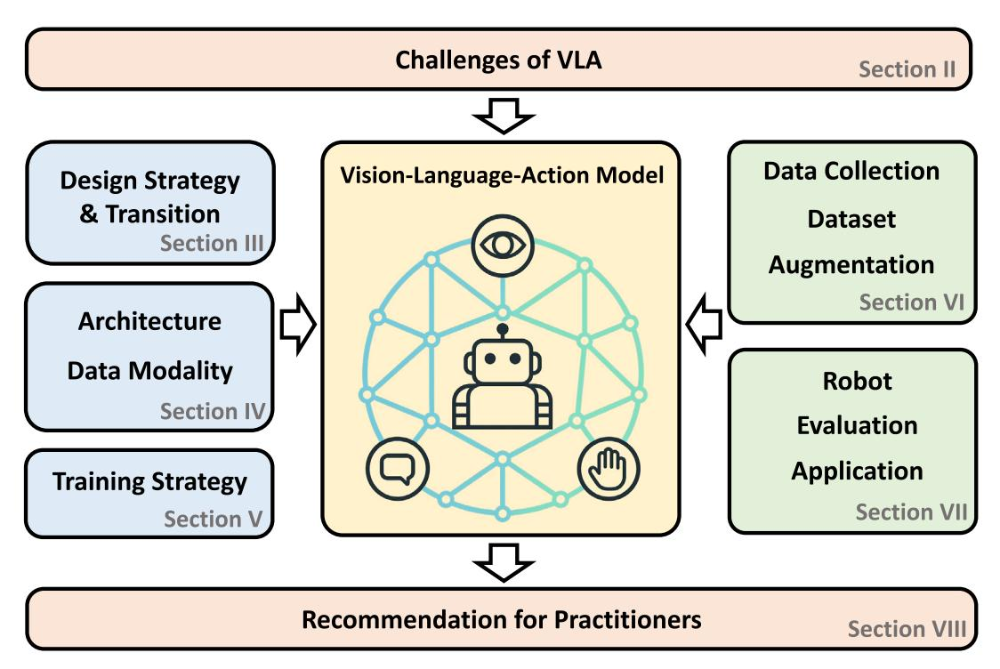

**FIGURE 1.** Structure of this survey. Section [II](#page-1-1) outlines the key challenges in developing Vision-Language-Action (VLA) models. Section [III](#page-2-1) and Section [IV](#page-5-0) review the evolution of VLA strategies, architectures, and modality-specific design choices. Section [V](#page-13-0) categorizes training strategies and practical implementation considerations. Section [VI](#page-17-0) discusses the data collection methologies, publicly available dataset, and data augmentation. Section [VII](#page-21-0) discusses the types of robots used, evaluation benchmarks, and the applications of VLA models in real-world robot systems. Guidance for practitioners is presented in Section [VIII,](#page-24-0) based on the findings of the systematic review.

and even when actions are inferred, they differ substantially from robot actions in both form and semantics. As with robot-to-robot transfer, mapping human demonstrations into robot-executable actions is highly non-trivial.

These embodiment-related challenges raise fundamental questions for VLA development: What kinds of data best support cross-embodiment generalization? How should morphological and sensory differences be represented? And how can models be trained to ensure robust grounding of vision and language across diverse robotic and human embodiments?

#### C. COMPUTATIONAL AND TRAINING COST

Training VLA models entails a considerable amount of computational demands due to the high-dimensional and multi-modal nature of their input, typically including vision, language, and actions. While many recent approaches leverage pre-trained VLM as a backbone, these models are typically adapted for robotics domain via large-scale robot demonstrations or simulated data. Most practitioners are expected to build upon such pre-trained models and further fine-tune them for downstream tasks using task-specific, high-quality expert demonstrations, rather than training end-to-end from scratch. Nonetheless, both the adaptation and fine-tuning stages remain computationally intensive, especially when processing long temporal sequences, highresolution images, or additional modalities such as 3D point clouds or proprioception. Transformer-based architectures, which dominate current VLA designs, also scale poorly with respect to sequence length and input dimensionality, further amplifying memory and compute costs. At inference time, running these models in real-world settings, particularly on resource-constrained robotic platforms, poses additional challenges related to latency and memory usage. These computational burdens limit the accessibility and deployability of VLA systems, motivating ongoing research into efficient model architectures and distillation methods that can reduce resource requirements without significantly degrading performance.

#### **III. VLA DESIGN STRATEGY AND TRANSITION**

This section categorizes major interface strategies for transforming vision and language inputs into robot actions, following the historical progression of VLA architectures (see Fig. [2\)](#page-3-0). Each architectural category corresponds to a distinct generation of VLA systems, characterized by how multimodal representations are aligned with control. The discussion spans from early CNN-based models to transformer-based architectures, diffusion-based policies, and finally, hierarchical control frameworks.

# A. EARLY CNN-BASED END-TO-END ARCHITECTURES

A foundational approach to end-to-end VLAs is CLIPort [\[15\],](#page-27-14) one of the earliest models to integrate CLIP [\[25\]](#page-27-15) for

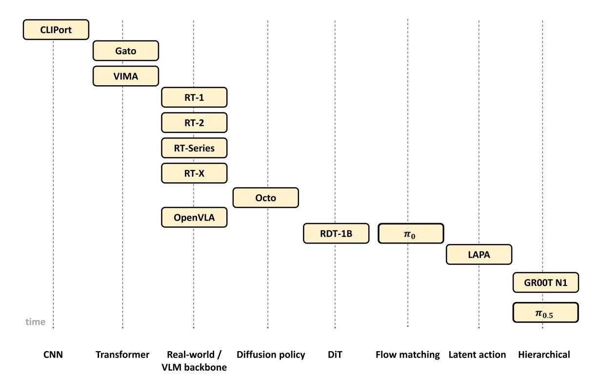

**FIGURE 2.** Timeline of major Vision–Language–Action (VLA) models. This figure summarizes the historical progression of representative VLA models shown in Section [III:](#page-2-1) from early CNN-based models (e.g., CLIPort [\[15\]\),](#page-27-14) to real-world scalable policies leveraging pre-trained VLM backbones (e.g., RT-1, RT-2, RT-X, OpenVLA [\[10\],](#page-27-9) [\[16\],](#page-27-16) [\[17\],](#page-27-17) [\[18\]\),](#page-27-18) followed by models integrating diffusion and flow matching techniques (e.g., Octo, RDT-1B, π0 [\[19\],](#page-27-19) [\[20\],](#page-27-20) [\[21\]\),](#page-27-21) and more recent approaches focusing on latent action inference and hierarchical control (e.g., LAPA, π0.5 , GR00T N1 [\[22\],](#page-27-22) [\[23\],](#page-27-23) [\[24\]\).](#page-27-24)

extracting visual and linguistic features. It combines these modalities with the Transporter Network [\[26\]](#page-27-25) to learn object manipulation tasks in an end-to-end manner, identifying which object to move and where to place it. CLIPort demonstrated the feasibility of jointly training vision, language, and action by leveraging CLIP [\[25\]](#page-27-15) as a pre-trained VLM. However, approaches based on Convolutional Neural Networks (CNNs) and Multi-Layer Perceptrons (MLPs) face challenges in unifying diverse modalities and also struggle to scale effectively.

#### B. TRANSFORMER-BASED SEQUENCE MODELS

To address these limitations, Google DeepMind released Gato [\[27\], a](#page-27-26) generalist agent and precursor to the Robotics Transformer (RT) series. Gato performs a wide range of tasks, such as text chatting, visual question answering, image captioning, gameplay, and robot control, using a single transformer [\[28\]](#page-27-27) model. It tokenizes language instructions using SentencePiece [\[29\]](#page-27-28) and encodes images using Vision Transformer (ViT) [\[30\]. A](#page-27-29) decoder-only transformer is then used to autoregressively generate actions based on the combined input sequence. While Gato enables multiple tasks with a single network, its repertoire of robotic skills remains limited to a narrow set, such as block stacking with a robotic arm. Similarly, VIMA [\[31\]](#page-27-30) is an encoder-decoder transformer model that enables robots to follow general task instructions provided through a combination of text and goal images. Objects are first detected using Mask R-CNN [\[32\],](#page-27-31) after which each detected object's image is tokenized using ViT. Bounding box coordinates are separately embedded as tokens, and textual instructions are tokenized using the T5 tokenizer [\[33\].](#page-27-32) A frozen T5 encoder and a transformer decoder are then used to autoregressively generate discrete action tokens. While VIMA demonstrates the ability to perform a wide range of robotic tasks, all experiments were limited to simulation environments.

# C. UNIFIED REAL-WORLD POLICIES WITH PRE-TRAINED VLMs

To enable scalable real-world applications, Robotics Transformer-1 (RT-1) [\[16\]](#page-27-16) has been introduced as a realtime, general-purpose control model capable of performing a wide range of real-world tasks. RT-1 processes a sequence of images using EfficientNet [\[34\], a](#page-28-0)nd performs FiLM conditioning [\[35\]](#page-28-1) with language features encoded by the Universal Sentence Encoder (USE) [\[36\],](#page-28-2) enabling early fusion of visual and linguistic modalities. The extracted tokens are compressed via TokenLearner [\[37\]](#page-28-3) and then passed through a decoder-only transformer, which outputs discretized action tokens nonautoregressively (see Section [IV-A\)](#page-5-1). Trained on a large-scale dataset comprising 700 tasks and 130,000

episodes, RT-1 is regarded as the first VLA that unifies a broad range of robotic tasks. Subsequently, RT-2 [\[10\]](#page-27-9) has been introduced as the successor to RT-1. It builds on a Vision-Language Model (VLM) backbone such as PaLM-E [\[38\]](#page-28-4) or PaLI-X [\[39\], p](#page-28-5)re-trained on large-scale internet data. RT-2 is jointly fine-tuned on both internet-scale visionlanguage tasks and robotic data from RT-1, resulting in strong generalization to novel environments. This VLM-based design has since become the standard architecture for VLAs. In contrast, RT-X [\[17\]](#page-27-17) has been introduced to demonstrate that training on datasets collected from multiple robots enables the development of more general-purpose VLAs, moving beyond the single-robot training paradigm of RT-1 and RT-2.

The RT series has been extended into several variations, including RT-Sketch, which takes sketch images as input; RT-Trajectory, which takes motion trajectories as input; and others such as RT-H, Sara-RT, and AutoRT [\[40\],](#page-28-6) [\[41\],](#page-28-7) [\[42\],](#page-28-8) [\[43\],](#page-28-9) [\[44\]. A](#page-28-10)mong these, RT-H [\[42\]](#page-28-8) is particularly notable for introducing a hierarchical policy structure. Built on the RT-2 architecture, RT-H incorporates a high-level policy that predicts an intermediate representation known as language motion, and a low-level policy that generates actions based on it. By modifying the input prompt, the model can flexibly alternate between generating high-level actions expressed in language and producing low-level robot actions directly. By sequentially switching between high-level and lowlevel policies, RT-H demonstrates improved performance, particularly in long-horizon tasks. Such hierarchical VLA architectures have since become a recurring design pattern in subsequent models. Building upon the RT-series, Open-VLA [\[18\]](#page-27-18) is introduced as an open-source VLA framework that closely mirrors the architecture of RT-2, leveraging a pre-trained VLM as its backbone. Specifically, it employs Prismatic VLM [\[45\],](#page-28-11) based on LLaMa 2 (7B) [\[1\], an](#page-27-0)d encodes image inputs using DINOv2 [\[46\]](#page-28-12) and SigLIP [\[47\].](#page-28-13) Through full fine-tuning on the Open-X Embodiment (OXE) dataset [\[17\], O](#page-27-17)penVLA outperforms both RT-2 and Octo, and has since emerged as a mainstream architecture for VLA.

#### D. DIFFUSION POLICY

Octo [\[19\],](#page-27-19) introduced after the RT series, is the first VLA to leverage Diffusion Policy [\[48\],](#page-28-14) and also gained attention for its fully open-source implementation. Octo supports flexible goal specification, which can include a language instruction and a goal image, processed by a T5 encoder and a CNN, respectively. For input observations, it similarly uses a CNN to encode images and a lightweight multilayer perceptron (MLP) to embed proprioceptive signals. All tokens are concatenated into a single sequence, augmented with modality-specific learnable tokens, and passed into a transformer. Finally, a diffusion policy generates continuous actions, conditioned on the output readout tokens.

# E. DIFFUSION TRANSFORMER ARCHITECTURES

RDT-1B [\[20\]](#page-27-20) has been proposed as a large-scale diffusion transformer for robotics. In contrast to prior approaches, where the diffusion process is applied only at the action head, RDT-1B employs a Diffusion Transformer (DiT) [\[49\]](#page-28-15) as its backbone, integrating the diffusion process directly into the transformer decoder to generate actions. In RDT-1B, language inputs are tokenized using the T5 encoder, while visual inputs are encoded using SigLIP. A diffusion model is then trained using a diffusion transformer with cross-attention, conditioned on both visual and textual tokens. To facilitate multimodal conditioning and avoid overfitting, Alternating Condition Injection is proposed, in which image and text tokens are alternately used as queries at each transformer layer.

# F. FLOW MATCHING POLICY ARCHITECTURES

Recently, inspired by Transfusion [\[50\],](#page-28-16) π0 builds on PaliGemma [\[51\]](#page-28-17) and introduces a custom action output module, the action expert, which enables a multimodal model to handle both discrete and continuous data. The action expert leverages flow-matching [\[52\]](#page-28-18) to generate actions at rates up to 50Hz. It receives proprioceptive input from the robot and the readout token from the transformer, producing actions through a reverse diffusion process. Rather than generating tokens autoregressively, it outputs entire action chunks in parallel, enabling smooth and consistent real-time control.

# G. LATENT ACTION LEARNING FROM VIDEO

Another notable approach is LAPA [\[22\], w](#page-27-22)hich leverages unlabeled video data for pre-training to learn latent actions for use in VLA models. This enables policies to effectively utilize human demonstrations, making them robust to changes in embodiment and well-suited for real-world deployment. The method applies patch embeddings, a spatial transformer, and a causal temporal transformer to images *xt* and *xt*+*H* , then computes their difference. VQ-VAE [\[53\]](#page-28-19) is applied to this difference, generating a discrete token *zt* which, together with *xt* , is used to reconstruct *xt*+*H* . This entire network is trained jointly, forming a Latent Quantization Network. Building on LWM-Chat-1M (7B) [\[54\], t](#page-28-20)he vision and text encoders are kept frozen, and the resulting readout token is processed through an MLP trained to predict *zt* . Finally, only the MLP component is replaced by a separate network trained to directly output robot control commands.

# H. HIERARCHICAL POLICY ARCHITECTURES

The most recent generation of VLAs adopts hierarchical policies to bridge high-level language understanding with low-level motor execution. RT-H [\[42\]](#page-28-8) exemplifies this design by introducing a high-level controller that predicts intermediate ''language motion'' plans, followed by a low-level controller that refines these into concrete actions. The system can dynamically switch between generating symbolic

actions and executing detailed control sequences, improving performance in long-horizon, multi-step tasks.

This design is extended in π0.5 [\[55\], w](#page-28-21)hich combines high-level action token generation (using FAST tokens) with a low-level controller trained via flow matching. Pre-training aligns symbolic actions with language, while post-training ensures smooth execution via continuous action decoding. GR00T N1 [\[24\]](#page-27-24) integrates multiple elements: latent actions from LAPA, diffusion-based generation from RDT-1B, and flow-matching controllers from π0, unified into a multi-stage policy that generalizes across robots and tasks. Hierarchical architectures now represent a state-of-the-art approach for scalable and adaptable VLA models, balancing the abstraction of language grounding with the precision of motor control.

#### **IV. ARCHITECTURES AND BUILDING BLOCKS**

Vision-Language-Action (VLA) models encompass a wide range of architectural designs, reflecting diverse strategies for integrating perception, instruction, and control. A widely adopted approach is the sensorimotor model, which jointly learns visual, linguistic, and action representations. These models take images and language as input and directly output actions, and can adopt either a flat or hierarchical structure with varying backbone architectures. While sensorimotor models form a foundational class of VLA systems, several alternative architectures have been proposed. World models predict the future evolution of sensory modalities, typically visual, conditioned on language input, and use these predictions to guide action generation. Affordance-based models are another variant that predict action-relevant visual affordances based on language, and then generate actions accordingly.

# A. SENSORIMOTOR MODEL

There are currently seven architectural variations of the sensorimotor models, as illustrated in Fig. [4.](#page-7-0)

# 1) TRANSFORMER + DISCRETE ACTION TOKEN

This architecture represents both images and language as tokens, which are fed into a transformer to predict the next action, typically in the form of discrete tokens (see Fig. [4 \(1\)\)](#page-7-0). This category also includes models that use CLS tokens and generate continuous actions through an MLP. Representative examples include VIMA [\[56\]](#page-28-22) and Gato [\[27\],](#page-27-26) which tokenize multiple modalities using language tokenizers, vision transformers, MLPs, and other components, and output discretized actions such as binned values. VIMA employs an encoder-decoder transformer conditioned on diverse task modalities, whereas Gato uses a decoder-only transformer that autoregressively processes all tokens in a single sequence.

In contrast to VIMA and Gato, which generate action tokens autoregressively, RT-1 [\[16\]](#page-27-16) adopts a different approach by compressing inputs using TokenLearner [\[37\]](#page-28-3) and employing a decoder-only transformer to predict all action tokens non-autoregressively. In practice, 48 tokens are fed into the transformer, and the final 11 tokens are extracted as action outputs. This architecture has been adopted by several approaches, such as MOO [\[57\],](#page-28-23) RT-Sketch [\[58\],](#page-28-24) and RT-Trajectory [\[59\].](#page-28-25) It has also become a common design choice in other VLA models such as Robocat [\[60\],](#page-28-26) RoboFlamingo [\[61\], a](#page-28-27)nd many others [\[62\],](#page-28-28) [\[63\],](#page-28-29) [\[64\],](#page-28-30) [\[65\],](#page-28-31) [\[66\],](#page-28-32) [\[67\], d](#page-28-33)ue to its simplicity and scalability.

# 2) TRANSFORMER + DIFFUSION ACTION HEAD

This architecture builds upon the structure in (1) by incorporating a diffusion policy as the action head following the transformer. While discrete action tokens often lack real-time responsiveness and smoothness, these models achieve continuous and stable action outputs using diffusion models [\[68\].](#page-28-34) Representative examples include Octo [\[19\]](#page-27-19) and NoMAD [\[69\].](#page-28-35) Octo processes image and language tokens as a single sequence through a transformer, then applies a diffusion action head conditioned on the readout token. In contrast, NoMAD replaces the language input with a goal image, compresses the transformer output via average pooling, and uses the resulting vector to condition the diffusion model. TinyVLA [\[70\], R](#page-28-36)oboBERT [\[71\], a](#page-28-37)nd VidBot [\[72\]](#page-28-38) also adopt this architecture.

#### 3) DIFFUSION TRANSFORMER

The diffusion transformer model shown in Fig. [4 \(3\)](#page-7-0) integrates the transformer and diffusion action head, executing the diffusion process directly within the transformer. This enables the model to perform the diffusion process conditioned directly on image and language tokens. For example, RDT-1B [\[20\], b](#page-27-20)uilt on this architecture, generates a sequence of action tokens via cross-attention with a vision and language query, which are subsequently mapped to executable robot actions through an MLP. Similarly, Large Behavior Models (LBMs) also adopt the diffusion transformer architecture and emphasize the importance of large-scale and diverse pretraining. In addition, StructDiffusion, MDT, DexGraspVLA, UVA, FP3, PPL, PPI, and Dita [\[73\],](#page-28-39) [\[74\],](#page-28-40) [\[75\],](#page-28-41) [\[76\],](#page-28-42) [\[77\],](#page-29-0) [\[78\],](#page-29-1) [\[79\],](#page-29-2) [\[80\]](#page-29-3) uses this architecture.

# 4) VLM + DISCRETE ACTION TOKEN

[V](#page-7-0)LM + Discrete Action Token models, as illustrated in Fig. [4](#page-7-0) [\(4\),](#page-7-0) improve generalization by replacing the transformer in (1) with a Vision-Language Model (VLM) pre-trained on large-scale internet data. Leveraging a VLM allows these models to incorporate human commonsense knowledge and benefit from in-context learning capabilities. For example, RT-2 uses large-scale VLMs such as PaLM-E or PaLI-X as the backbone, which processes image and language tokens as input and outputs the next action as discrete tokens. Furthermore, LEO, GR-1, RT-H, RoboMamba, QUAR-VLA, OpenVLA, LLARA, ECoT, 3D-VLA, RoboUniView, and CoVLA [\[18\],](#page-27-18) [\[42\],](#page-28-8) [\[81\],](#page-29-4) [\[82\],](#page-29-5) [\[83\],](#page-29-6) [\[84\],](#page-29-7) [\[85\],](#page-29-8) [\[86\],](#page-29-9) [\[87\],](#page-29-10) [\[88\],](#page-29-11) [\[89\]](#page-29-12) adopt this architecture.

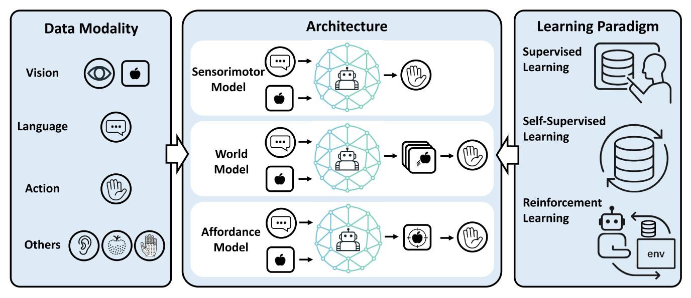

**FIGURE 3.** Structure of Section [IV](#page-5-0) and Section [V.](#page-13-0) The figure summarizes key components of VLA models. The center illustrates core architectural types, including sensorimotor models, world models, and affordance-based models. The left side depicts the input and output modalities—vision, language, action, and other auxiliary modalities. The right side presents training strategies, including supervised learning, self-supervised learning, and reinforcement learning, along with practical implementation considerations.

# 5) VLM + DIFFUSION ACTION HEAD

[V](#page-7-0)LM + Diffusion Action Head models, as shown in Fig. [4](#page-7-0) [\(5\),](#page-7-0) build on (2) by replacing the transformer with a VLM. This architecture combines VLMs, which enable better generalization, with diffusion models that generate smooth, continuous robot action commands. For example, Diffusion-VLA, DexVLA, ChatVLA, ObjectVLA, GO-1 (AgiBot World Colosseo), PointVLA, MoLe-VLA, Fis-VLA, and CronusVLA [\[90\],](#page-29-13) [\[91\],](#page-29-14) [\[92\],](#page-29-15) [\[93\],](#page-29-16) [\[94\],](#page-29-17) [\[95\],](#page-29-18) [\[96\],](#page-29-19) [\[97\],](#page-29-20) [\[98\]](#page-29-21) adopt this architecture. HybridVLA [\[99\]](#page-29-22) further combines (4) and (5) to both autoregressively generate discrete tokens as well as use a diffusion action head to generate continuous actions within a single model.

# 6) VLM + FLOW MATCHING ACTION HEAD

VLM + Flow Matching Action Head models, as shown in Fig. [4 \(6\),](#page-7-0) replace the diffusion model in (5) with a flow matching action head [\[52\], i](#page-28-18)mproving real-time responsiveness while maintaining smooth, continuous control. A representative example is π0, based on PaliGemma [\[51\], w](#page-28-17)hich achieves control rates of up to 50 Hz. Other examples include GraspVLA, OneTwoVLA, Hume, and SwitchVLA [\[100\],](#page-29-23) [\[101\],](#page-29-24) [\[102\],](#page-29-25) [\[103\].](#page-29-26) π0.5 [\[23\]](#page-27-23) integrates the architectures of (4) and (6), supporting both discrete tokens and flow matching within a unified framework.

# 7) VLM + DIFFUSION TRANSFORMER

VLM + Diffusion Transformer models, shown in Fig. [4 \(7\),](#page-7-0) combine a VLM with a diffusion transformer described in (3). The VLM typically serves as a high-level policy (system 2), while the diffusion transformer acts as a low-level policy (system 1). The diffusion transformer may be implemented using either diffusion or flow matching. A representative model is GR00T N1 [\[24\],](#page-27-24) which applies cross-attention from the diffusion transformer to VLM tokens and generates continuous actions via flow matching. This design is also used in CogACT, TrackVLA, SmolVLA, and MinD [\[104\],](#page-29-27) [\[105\],](#page-29-28) [\[106\],](#page-29-29) [\[107\].](#page-29-30)

#### B. WORLD MODEL

World models are capable of anticipating future observations or latent representations based on the current inputs. Their forward predictive capabilities have made them increasingly central to VLA systems, where they support planning, reasoning, and control. In this section, we group these approaches into three types, as illustrated in Fig. [5.](#page-8-0)

#### 1) ACTION GENERATION IN WORLD MODELS

In contrast to models that directly generate actions, world models generate future visual observations, such as images or video sequences, which are then used to guide action generation. For example, UniPi [\[108\]](#page-29-31) employs a diffusion model inspired by Video U-Net [\[109\]](#page-29-32) to generate video sequences from an initial observation image and task instruction. Then, an inverse dynamics model (IDM) translates the predicted image sequence into low-level actions. This combination of visual prediction and IDM-based control is a common design pattern in model-based VLAs. Similarly, DreamGen [\[110\]](#page-29-33) and GeVRM [\[111\]](#page-29-34) predict future visual representations for action generation. HiP [\[112\]](#page-29-35) extends this idea by incorporating subtask decomposition with a LLM, enabling the execution of longer-horizon behaviors. Dreamitate [\[113\]](#page-29-36) finetunes Stable Video Diffusion [\[114\]](#page-29-37) to synthesize a video of human using a tool for manipulation tasks. Then, given

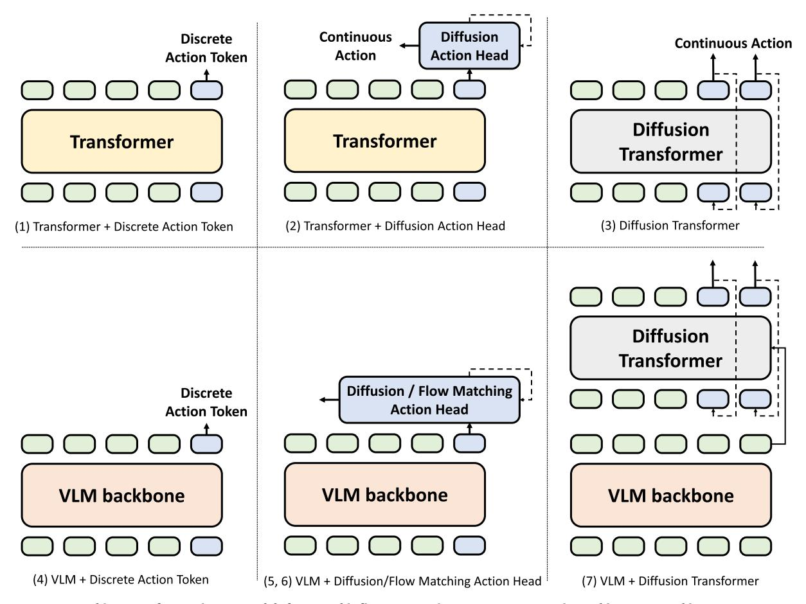

**FIGURE 4.** Architecture of sensorimotor models for VLA. This figure categorizes seven representative architectures used in recent VLA research. (1) Transformer + Discrete Action Token: A standard transformer processes tokenized inputs to predict discrete actions. (2) Transformer + Diffusion Action Head: A diffusion model is appended to the transformer for generating smooth, continuous actions. (3) Diffusion Transformer: The diffusion process is integrated directly within the transformer architecture. (4) VLM + Discrete Action Token: Vision-language models (VLMs) replace transformers to leverage pre-trained knowledge while predicting discrete actions. (5) VLM + Diffusion Action Head: Combines VLMs with diffusion heads for continuous control. (6) VLM + Flow Matching Action Head: Substitutes diffusion with flow matching to enhance real-time control. (7) VLM + Diffusion Transformer: Employs a VLM as a backbone and a diffusion transformer as a low-level policy for end-to-end continuous action generation.

the generated video, MegaPose [\[115\]](#page-29-38) estimates the 6-DoF pose of the tool so that the robot can follow the estimated tool poses. In contrast to generating full video sequences, SuSIE [\[116\]](#page-29-39) predicts abstract subgoal images by using InstructPix2Pix [\[117\]](#page-29-40) to generate intermediate goal images from the initial observation and task instruction, which are then used to condition a diffusion policy. CoT-VLA employs a similar approach for chain-of-thought reasoning (see Section [IV-A](#page-5-1) for further details.). LUMOS [\[118\]](#page-30-0) also generates a goal image, but does so using a world model that takes low-level action commands as input. In LUMOS, a policy is trained to imitate expert demonstrations by interacting with the learned world model.

In addition to video and image generation, many recent works leverage optical flow or feature point tracking. Because optical flow and feature tracking are agnostic to robot embodiment, they offer a more generalizable way to leverage human demonstrations. AVDC [\[119\],](#page-30-1) similar to UniPi, generates video sequences and computes optical flow for each frame using GMFlow [\[120\].](#page-30-2) It then formulates the estimation of SE(3) rigid body transformations for target objects as an optimization problem. ATM [\[121\]](#page-30-3) predicts future trajectories of arbitrary feature points (using CoTracker [\[122\]](#page-30-4) during training), and trains a transformer that generates actions guided by these trajectories. Track2Act [\[123\]](#page-30-5) predicts feature point trajectories between an initial and goal image, optimizes for 3D rigid body transformations, and learns a residual policy to refine the motion. LangToMo [\[124\]](#page-30-6) predicts future optical flow from an initial image and task instruction, using RAFT [\[125\]](#page-30-7) for optical flow supervision, and maps this prediction to robot actions. MinD [\[107\]](#page-29-30) adopts an end-to-end approach that jointly learns video and action prediction. In particular, MinD combines a low-frequency video generator, which predicts future visual observations in a latent space from initial images and instructions, with DiffMatcher, which transforms these predictions into time-series features that the high-frequency action policy then uses to efficiently generate an action sequence. PPI [\[79\]](#page-29-2) takes

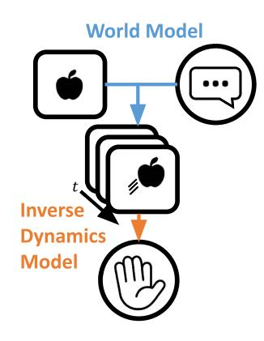

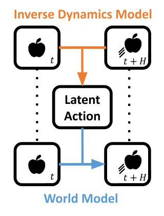

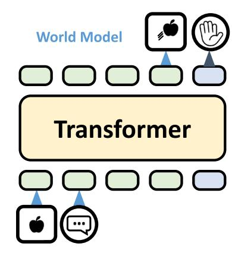

**FIGURE 5.** Design patterns for incorporating world models in VLA.(1) Using world models in conjunction with inverse dynamics models to generate actions.(2) Leveraging world models to learn latent action representations, particularly from human videos; the resulting latent tokens are then used for VLA training to incorporate human video datasets.(3) Generating future observations in addition to actions, enabling predictive planning and multimodal reasoning.

visual and language inputs to predict gripper poses and object displacements (Pointflow) at each keyframe. These are then used as intermediate conditions for action generation.

#### 2) LATENT ACTION GENERATION VIA WORLD MODELS

This category of VLAs leverages world models to learn latent action representations from human demonstrations. For example, LAPA (Latent Action Pre-training from Videos) [\[22\]](#page-27-22) (see Section [III](#page-2-1) for details) jointly learns to predict action representations from tuples of current and future images, as well as to generate future frames conditioned on the current image and the latent action. This dual objective enables training on datasets without explicit action labels, such as human videos. Once latent actions are learned, a VLA policy is trained using these tokens. The action head is then replaced and fine-tuned to output robot actions. LAPA has been used for pre-training in GR00T N1 [\[24\]](#page-27-24) and DreamGen [\[110\].](#page-29-33) Moreover, GO-1 [\[94\]](#page-29-17) and Moto [\[126\]](#page-30-8) employ a similar approach. UniVLA [\[127\]](#page-30-9) augments the latent space of DINOv2 [\[46\]](#page-28-12) with language inputs and uses a two-stage training process to disentangle task-independent and task-dependent latent action tokens. UniSkill [\[128\]](#page-30-10) employs image editing based approach to extract latent actions from RGB-D images and uses them as conditions for a diffusion policy.

# 3) SENSORIMOTOR MODELS WITH IMPLICIT WORLD MODELS

This category refers to VLAs that jointly output both actions and predictions of future observations to improve performance. GR-1 [\[82\]](#page-29-5) integrates a pre-trained MAE-ViT encoder [\[129\],](#page-30-11) CLIP text encoder [\[25\], a](#page-27-15)nd a transformer, and is trained on the Ego4D dataset [\[130\]](#page-30-12) to predict future observation images. It is then fine-tuned to jointly predict both actions and future frames from image, language, and proprioceptive inputs. By incorporating observation prediction, akin to a video prediction model, into a standard VLA framework, GR-1 demonstrates improved task success. GR-2 [\[131\]](#page-30-13) builds on GR-1 by scaling up the training dataset and incorporating architectural improvements, including VQGAN-based image tokenization [\[132\]](#page-30-14) and a conditional VAE [\[133\]](#page-30-15) for action generation. GR-MG [\[134\]](#page-30-16) generates intermediate goal images using an InstructPix2Pix-based model [\[117\]](#page-29-40) and embedding them within a GR-1-style framework. Furthermore, GR-3 [\[135\]](#page-30-17) implements a hierarchical structure by integrating VLM (Qwen2.5-VL [\[136\]](#page-30-18) and diffusion transformer with flow matching for action. 3D-VLA [\[87\]](#page-29-10) extends this line of work by predicting RGB-D images with Stable Diffusion [\[137\]](#page-30-19) and point clouds using Point-E [\[138\].](#page-30-20) Several other models incorporate full video prediction into sensorimotor models, including FLARE [\[139\],](#page-30-21) UVA [\[76\], W](#page-28-42)orldVLA [\[140\],](#page-30-22) and ViSA-Flow [\[141\].](#page-30-23)

# C. AFFORDANCE-BASED MODEL

Affordances [\[142\]](#page-30-24) refer to the action possibilities that an environment offers an agent, relative to its physical and perceptual capabilities. In robotics, this concept is often adapted to denote the actionable properties of objects or scenes, specifically, what actions are possible given the robot's embodiment and the spatial or functional cues present. VLAs based on affordance prediction can be currently categorized into three types, as illustrated in Fig. [6.](#page-9-0)

# 1) AFFORDANCE PREDICTION AND ACTION GENERATION USING VLMs

Pre-trained VLMs are often used to estimate affordances and generate corresponding actions. For example, VoxPoser [\[143\]](#page-30-25)

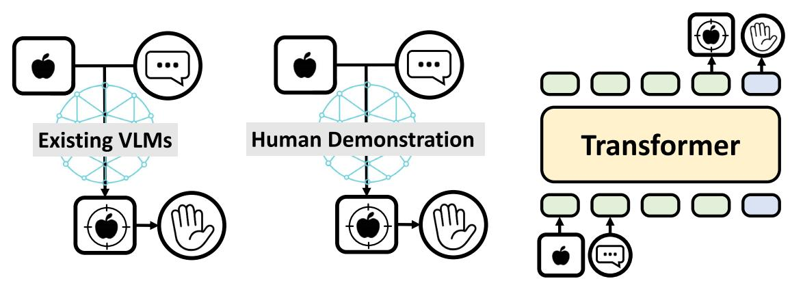

- 
- 

**FIGURE 6.** Design patterns for incorporating affordance-based models in VLA. (1) Predicting affordances and subsequently generating actions conditioned on the predicted affordances;(2) Extracting affordances from human demonstration videos and learning latent representations to guide action generation;(3) Integrating affordance prediction modules directly into the VLA architecture.

uses GPT-4 [\[2\], O](#page-27-1)WL-ViT [\[144\],](#page-30-26) and Segment Anything [\[145\]](#page-30-27) to generate Affordance and Constraint Maps from language instructions, which are then used to guide action generation via Model Predictive Control (MPC). KAGI [\[146\]](#page-30-28) employs GPT-4o [4] [to](#page-27-3) infer a sequence of target keypoints from top-down and side-view images with overlaid grid lines, providing guidance for RL. LERF-TOGO [\[147\]](#page-30-29) builds a 3D scene using a NeRF [\[148\]](#page-30-30) trained on visual features extracted from CLIP and DINO [\[25\],](#page-27-15) [\[149\]](#page-30-31) (LERF [\[150\]\)](#page-30-32). CLIP's text encoder is used to compute similarity between language instructions and visual features, and high-activation regions are converted into 3D point clouds, which are then processed by GraspNet [\[151\]](#page-30-33) to rank grasp poses. Splat-MOVER [\[152\]](#page-30-34) replaces NeRF with Gaussian Splatting [\[153\]](#page-30-35) for faster scene construction and incorporates affordance heatmaps from the VRB model [\[154\],](#page-30-36) improving both efficiency and performance.

#### 2) AFFORDANCE EXTRACTION FROM HUMAN DATASETS

This line of work focuses on extracting affordances from human motion videos, often without annotations, to enable scalable learning for robotic action generation. VRB [\[154\]](#page-30-36) learns contact points and hand trajectories from demonstration videos in the EPIC-KITCHENS datasets [\[155\],](#page-30-37) [\[156\].](#page-30-38) In VRB, Hand-Object Detector (HOD) [\[157\]](#page-30-39) is used to identify hand positions and contact states, then tracks subsequent hand movements on the image plane to automatically construct a training dataset. The extracted data are projected into 3D and used to generate robot actions. HRP [\[158\]](#page-30-40) extracts hand, contact, and object affordance labels from the Ego4D dataset [\[130\],](#page-30-12) trains a ViT model to predict these labels, and uses its latent representations for imitation learning. VidBot [\[159\]](#page-30-41) extends 2D affordance representations to 3D, aiming to support zero-shot deployment on robots.

# 3) INTEGRATION OF SENSORIMOTOR MODELS AND AFFORDANCE-BASED MODELS

This approach incorporates affordance prediction into VLA. CLIPort [\[15\]](#page-27-14) predicts affordances of objects and the environment from visual and language inputs, and generates actions based on these affordances. RoboPoint [\[160\]](#page-31-0) builds a vision-language model that identifies affordance points, specific locations in an image where the robot should act, which are then projected into 3D to generate corresponding actions. RoboGround [\[161\]](#page-31-1) predicts masks for the target object and placement area in pick-and-place tasks given image and language inputs; RT-Affordance [\[162\]](#page-31-2) outputs key end-effector poses at critical moments; *A*0 [\[163\]](#page-31-3) predicts object contact point trajectories; and RoboBrain [\[164\]](#page-31-4) identifies affordance regions as bounding boxes. Collectively, these models leverage affordance information as conditioning input for action generation. Chain-of-Affordance [\[165\],](#page-31-5) inspired by Chain-of-Thought reasoning (see Section [IV-A\)](#page-5-1), predicts a sequence of affordances such as object positions, grasp points, and placement locations in an autoregressive manner, and then generates actions, leading to improved performance.

#### D. DATA MODALITIES

VLAs process multiple modalities simultaneously, including vision, language, and action. This section summarizes how each modality is handled in state-of-the-art systems.

#### 1) VISION

The most common approach for visual feature extraction in VLAs is to use ResNet [\[166\]](#page-31-6) or Vision Transformer (ViT) [\[30\].](#page-27-29) These models are typically pre-trained on large-scale datasets such as ImageNet [\[167\],](#page-31-7) [\[168\]](#page-31-8) or LAION [\[169\],](#page-31-9) [\[170\],](#page-31-10) although ResNet is often trained from scratch. Some methods apply ResNet directly to the image

and convert the output into tokens using an MLP, while others first divide the image into patches before applying the encoder. Furthermore, ViT pre-trained with MAE [\[129\]](#page-30-11) and EfficientNet [\[34\]](#page-28-0) are also commonly used.

Vision-language models such as CLIP [\[25\]](#page-27-15) and SigLIP [\[47\]](#page-28-13) are also widely used. CLIP learns joint visual and textual representations via contrastive learning, while SigLIP improves upon it by removing the softmax constraint and reducing sensitivity to batch size. These models are often used alongside DINOv2 [\[46\], a](#page-28-12) self-supervised vision model that learns image features without requiring paired text or contrastive objectives. While CLIP was initially the dominant choice, SigLIP and DINOv2 have emerged as the preferred models for visual feature extraction in VLAs. OpenCLIP [\[171\]](#page-31-11) and EVA-CLIP [\[172\]](#page-31-12) are also adopted in several prior works.

In addition, VQ-GAN [\[132\]](#page-30-14) and VQ-VAE [\[53\]](#page-28-19) are commonly used for discretizing images into token sequences. Unlike ViT or CLIP, which produce continuous embeddings, these models generate discrete tokens that are more naturally aligned with the input format of LLMs. The resulting visual tokens are often further processed to integrate with other modalities or to reduce token length. A well-known example is the Perceiver Resampler from Flamingo [\[173\],](#page-31-13) which compresses visual information using a fixed-length set of learnable latent tokens via cross-attention. Building on this idea, Q-Former in BLIP-2 [3] [com](#page-27-2)bines cross-attention and self-attention to extract task-relevant information, while QT-Former [\[174\]](#page-31-14) incorporates temporal structure into the process. TokenLearner [\[37\]](#page-28-3) takes a different approach by performing spatial summarization to reduce token count. These compression and integration techniques are widely used in VLAs.

Several works in VLA adopt object-centric features, such as bounding box coordinates or cropped region embeddings, instead of relying solely on continuous feature maps. These features are typically extracted using object detection, segmentation, or tracking models, including Mask R-CNN [\[32\],](#page-27-31) OWL-ViT [\[144\],](#page-30-26) SAM [\[145\],](#page-30-27) GroundingDINO [\[175\],](#page-31-15) Detic [\[176\],](#page-31-16) and Cutie [\[177\].](#page-31-17)

#### 2) LANGUAGE

For language tokenization, VLAs typically inherit the tokenizer from their underlying LLM backbone, such as the T5 tokenizer [\[33\]](#page-27-32) or LLaMA tokenizer [\[1\]. W](#page-27-0)hen the base model is not a pre-trained LLM, tokenization is typically performed using subword algorithms such as Byte-Pair Encoding (BPE) or tools like SentencePiece [\[29\],](#page-27-28) which implements BPE as well as other algorithms. For language encoding, VLAs employ various text encoders to embed natural language instructions into vector representations, including the Universal Sentence Encoder (USE) [\[36\], C](#page-28-2)LIP Text Encoder [\[25\], S](#page-27-15)entence-BERT [\[178\],](#page-31-18) and DistilBERT [\[179\].](#page-31-19) These language embeddings are frequently used to condition visual features via techniques such as FiLM conditioning. In architectures that use VLMs as backbones, visual information is directly integrated into the LLM component, with popular choices including LLaMA 2 [\[1\], V](#page-27-0)icuna [\[180\],](#page-31-20) Gemma [\[181\],](#page-31-21) Qwen2 [\[182\],](#page-31-22) Phi-2 [\[183\],](#page-31-23) SmolLM2 [\[184\],](#page-31-24) GPT-NeoX [\[185\],](#page-31-25) and Pythia [\[186\].](#page-31-26)

#### 3) ACTION

Action representation in end-to-end VLA models can be categorized into several primary approaches. This classification excludes specialized architectures such as affordance-based or world model-based methods.

#### *a: DISCRETIZED ACTION TOKENS OBTAINED VIA BINNING*

The most common approach to representing actions in VLAs is to discretize each dimension of the action space into bins (typically 256), with each bin ID treated as a discrete token. For example, RT-2 with PaLI-X [\[10\],](#page-27-9) [\[39\]](#page-28-5) directly outputs numeric tokens as actions; and RT-2 with PaLM-E [\[38\]](#page-28-4) and OpenVLA [\[18\]](#page-27-18) reserve the 256 least frequent tokens in the vocabulary for action representation. These models are typically trained using cross-entropy loss and adopt autoregressive decoding, similar to LLMs. Several models instead use non-autoregressive decoding, by inserting a readout token to enable parallel generation of all action tokens [\[187\],](#page-31-27) or by treating the final few output tokens as discretized arm and base action (as in RT-1). A known drawback of standard binning is the increase in token length, which can limit control frequency. To mitigate this, FAST [\[55\]](#page-28-21) applies the Discrete Cosine Transform (DCT) along the temporal axis, quantizes the frequency components, and compresses them using Byte-Pair Encoding (BPE). This significantly reduces token length and enables faster inference compared to conventional binning.

#### *b: DECODING TOKENS INTO CONTINUOUS ACTIONS*

In this approach, tokens generated by a transformer are mapped to continuous actions via a multilayer perceptron (MLP), typically trained with an L2 or L1 loss. For binary outputs such as gripper open/close, binary cross-entropy is often used. OpenVLA-OFT [\[188\]](#page-31-28) suggests that L1 loss may yield better performance. The MLP decoder can be replaced by alternative modules, such as an LSTM [\[189\]](#page-31-29) to incorporate temporal context, or a Gaussian Mixture Model (GMM) to model stochasticity in the action space. Proprioceptive or force signals are often incorporated into the decoding module, such as an MLP or LSTM. Non-autoregressive variants commonly apply pooling operations (e.g., average or max pooling) to compress multiple tokens into a single action representation, as seen in RoboFlamingo [\[61\]. O](#page-28-27)penVLA-OFT [\[188\]](#page-31-28) extends this by predicting multi-step action chunks, resulting in smoother and more temporally coherent trajectories.

# *c: CONTINUOUS ACTION MODELING VIA DIFFUSION OR FLOW MATCHING*

Diffusion models and flow matching have become prominent approaches for generating continuous actions in VLAs, as seen in Octo [\[19\]](#page-27-19) and π0 [\[21\]. T](#page-27-21)hese models generate actions non-autoregressively, enabling smoother and more scalable control. Flow matching is particularly suitable for real-time applications, as it requires fewer inference steps than traditional diffusion. While some models implement diffusion as an external action head after the transformer, recent designs increasingly embed the process within the transformer itself, for example, in diffusion transformer architectures. Training and inference are commonly based on DDPM [\[68\]](#page-28-34) and DDIM [\[190\],](#page-31-30) with improved performance in stability and efficiency offered by methods such as TUDP [\[191\],](#page-31-31) which ensure denoising consistency at every time step.

# *d: LEARNING LATENT ACTION REPRESENTATIONS FROM WEB-SCALE DATA*

This approach utilizes world modeling to obtain latent action representations when explicit actions are unavailable, such as in human demonstrations. By leveraging web-scale video data, this method enables training on significantly larger datasets and facilitates learning more generalizable VLAs. LAPA [\[22\], M](#page-27-22)oto [\[126\],](#page-30-8) UniVLA [\[127\],](#page-30-9) and UniSkill [\[128\]](#page-30-10) demonstrate this approach. For additional details, see Section [IV-B.](#page-6-0)

# *e: ALTERNATIVE ACTION REPRESENTATION*

SpatialVLA [\[192\]](#page-31-32) statistically discretizes the action space and reduces the number of spatial tokens by allocating higher resolution to frequently occurring motions. ForceVLA [\[193\]](#page-31-33) and ChatVLA [\[92\]](#page-29-15) employ Mixture of Experts (MoE) architectures to dynamically switch action policies based on task phases. iManip [\[194\]](#page-31-34) enables continual learning by incrementally adding learnable action prompts, preserving prior skills while acquiring new ones.

# *f: CROSS-EMBODIMENT ACTION REPRESENTATION*

The challenge of embodiment diversity arises when handling robot-specific modalities such as actions and proprioception. Open X-Embodiment Project [\[17\]](#page-27-17) was the first to tackle this embodiment challenge. Building upon the RT-1 [\[16\]](#page-27-16) and RT-2 [\[10\]](#page-27-9) architectures, this work standardized datasets across different robots using a unified format: single camera input, language instructions, and 7-DoF actions (position, orientation, and gripper open/close). This approach demonstrates a key insight that integrating data from robots with diverse embodiments leads to significantly improved VLA model performance compared to training on a single embodiment. Moreover, another prior work [\[195\]](#page-31-35) has proposed to normalize and align actions and observations from heterogeneous embodiments into a shared first-person perspective, thereby enabling unified control of various robots using only observations and goal images [\[195\].](#page-31-35) However, such approaches struggle to uniformly handle robots with drastically different observations or control inputs, such as manipulators, mobile robots, and legged robots.

To address this limitation, CrossFormer [\[67\]](#page-28-33) enables unified processing across diverse embodiments by first tokenizing heterogeneous sensor observations—such as vision, proprioception, and task specifications—using modalityspecific tokenizers. All tokens are then assembled into a unified token sequence, with missing modalities masked as needed. This sequence is processed by a shared decoder-only transformer, which uses readout tokens to extract taskrelevant representations. These are subsequently passed to embodiment-specific action heads (e.g., single-arm, bimanual, navigation, or quadruped) to generate actions tailored to each robot type. UniAct [\[196\]](#page-31-36) proposes a Universal Action Space (UAS) implemented as a discrete codebook shared across embodiments. A transformer predicts discrete action tokens from this codebook, which are then converted into continuous actions by embodiment-specific decoders. By explicitly defining a shared atomic action space, UniAct facilitates knowledge transfer and promotes reusability across diverse robot embodiments. Furthermore, UniSkill [\[128\]](#page-30-10) incorporates human demonstration knowledge by extracting latent skill representations from unlabeled human video data, in addition to robot data, similar to LAPA [\[22\],](#page-27-22) enabling more generalizable VLA models. Additionally, embodiment-agnostic frameworks such as LangToMo [\[124\]](#page-30-6) and ATM [\[121\]](#page-30-3) achieve cross-embodiment learning by leveraging intermediate representations, such as optical flow and feature point trajectories, thereby bypassing the need for direct action space alignment.

# 4) MISCELLANEOUS MODALITIES

In addition to vision, language, and action, modern VLA models increasingly incorporate additional modalities to enhance perception and interaction capabilities. In this section, we describe three additional sensing modalities relevant to VLA systems: audio, tactile sensing, and 3D spatial information.

# *a: AUDIO*

Several prior works such as Unified-IO 2 [\[62\], S](#page-28-28)OLAMI [\[197\],](#page-31-37) FuSe [\[198\],](#page-31-38) VLAS [\[199\],](#page-31-39) and MultiGen [\[200\]](#page-31-40) leverage audio information as input. Audio encoders typically take spectrograms or mel-spectrogram images as input, which are then converted into audio tokens using models like ResNet or ViT-VQGAN. RVQ-VAE-based SpeechTokenizer [\[201\],](#page-32-0) Audio Spectrogram Transformer (AST) [\[202\],](#page-32-1) or the Whisper encoder [\[203\]](#page-32-2) are also frequently used as pre-trained models. These encoders enable the system to leverage rich audio information that may not be readily transcribed into text for robotic decision-making. SoundStorm [\[204\]](#page-32-3) or the decoder of VQGAN are often employed for decoding. A common

and straightforward approach, as employed in RoboNurse-VLA [\[205\],](#page-32-4) is to convert audio into text using standard automatic speech recognition (ASR) systems.

# *b: TACTILE SENSORS*

FuSe [\[198\],](#page-31-38) TLA [\[206\],](#page-32-5) VTLA [\[207\],](#page-32-6) and Tactile-VLA [\[208\]](#page-32-7) incorporate tactile information as part of inputs. Tactile sensors such as DIGIT [\[209\]](#page-32-8) and GelStereo 2.0 [\[210\],](#page-32-9) which produce image-based outputs, are commonly used. These tactile images are either encoded using a Vision Transformer (ViT) or tokenized via a pre-trained Touch-Vision-Language (TVL) model [\[211\].](#page-32-10) This enables the integration of visual and tactile information for learning fine-grained manipulation skills in contact-rich tasks, such as peg insertion. Although not tactile sensors in the strict sense, ForceVLA [\[193\]](#page-31-33) incorporates general 6-axis force-torque sensors. In particular, a force-aware Mixture-of-Experts fusion module integrates force tokens derived from 6-axis force–torque sensor data with visual-language features extracted by a pre-trained VLM, and generates actions through an action head.

# *c: 3D INFORMATION*

Incorporating 3D information enables robots to more accurately perceive their environment and plan actions accordingly. In 3D perception, we specifically introduce (a) depth images, (b) multi-view images, (c) voxel representations, and (d) point clouds below.

**(a) Depth images.** A common strategy for incorporating depth information involves tokenizing depth images using standard visual backbones, such as Vision Transformers (ViTs) or ResNets, similar to the processing of RGB images. In scenarios where direct depth sensing is not available, monocular depth estimation models such as Depth Anything [\[212\]](#page-32-11) and ZoeDepth [\[213\]](#page-32-12) are frequently utilized to predict depth from RGB inputs. SpatialVLA [\[192\]](#page-31-32) is a representative method that utilizes depth images by introducing Ego3D Position Encoding. In this framework, depth maps are first estimated from RGB inputs using ZoeDepth, and the corresponding 3D coordinates for each pixel are computed via the camera's intrinsic parameters. The 3D coordinates are first processed using sinusoidal positional encoding and an MLP, and the resulting features are added to the 2D visual features extracted by SigLIP [\[47\]. T](#page-28-13)his combined representation is used as the Ego3D positional encoding and provided as input to the LLM. Additionally, HAMSTER [\[214\],](#page-32-13) RationalVLA [\[215\],](#page-32-14) and OpenHelix [\[216\]](#page-32-15) incorporate a 3D Diffuser Actor [\[217\],](#page-32-16) a diffusion-based action head that operates in 3D space and processes RGB-D inputs to generate actions.

**(b) Multi-view images.** Several works attempt to extract 3D information from multi-view images. For example, GO-1 [\[94\]](#page-29-17) simply takes as input multi-view RGB-D images, encouraging implicit understanding of 3D structure. 3D-VLA [\[87\]](#page-29-10) extends Q-Former (described in Section [IV-D1\)](#page-9-1) to handle RGB-D and multi-view inputs. Evo-0 [\[218\]](#page-32-17) employs Visual Geometry Grounded Transformer (VGGT) [\[219\]](#page-32-18) to extract implicit 3D geometric information from multi-view RGB images. RoboUniView [\[88\]](#page-29-11) and RoboMM [\[220\]](#page-32-19) utilize UVFormer, a pre-trained model that takes multi-view RGB-D images and corresponding camera parameters as input and outputs a 3D occupancy grid. The encoder's output features are then used as tokens for downstream processing. Furthermore, SAM2Act [\[221\]](#page-32-20) and HAMSTER [\[214\]](#page-32-13) use Robotic View Transformer-2 (RVT-2) [\[222\]](#page-32-21) to reproject point cloud or depth information into a virtual view (often using orthographic projection to generate three images), and each image is tokenized by ViT. Similar approaches are also used in OG-VLA [\[223\]](#page-32-22) and BridgeVLA [\[224\].](#page-32-23) Overall, two main approaches have emerged: integrating information from multiple viewpoints, and projecting 3D data into orthographic images to facilitate easier processing.

**(c) Voxel representations.** Voxel-based representations are another widely adopted approach for encoding 3D information. OccLLaMA [\[225\]](#page-32-24) and OpenDriveVLA [\[226\]](#page-32-25) convert 3D occupancy grids into 2D Bird's Eye View (BEV) feature maps, which are then tokenized using VQ-VAE. Several approaches operate directly on three-dimensional voxel grids, such as iManip [\[194\],](#page-31-34) which extracts features using a 3D U-Net [\[227\],](#page-32-26) and VidBot [\[72\],](#page-28-38) which first converts voxel grids into Truncated Signed Distance Fields (TSDFs) and then processes them using a 3D U-Net. Because voxel representations resemble image structures and are compatible with convolutional processing, they have been widely adopted across various studies.

**(d) Point clouds.** A common approach involves tokenizing point clouds using pre-trained point-based transformers such as PointNet [\[228\],](#page-32-27) PointNet++ [\[229\],](#page-32-28) PointNext [\[230\],](#page-32-29) and Uni3D ViT [\[231\].](#page-32-30) These backbones are widely adopted in models such as SOFAR [\[232\],](#page-32-31) LEO [\[81\],](#page-29-4) PPI [\[79\],](#page-29-2) LMM-3DP [\[233\],](#page-32-32) GeneralFlow [\[234\],](#page-32-33) FP3 [\[77\], a](#page-29-0)nd Dex-TOG [\[235\].](#page-32-34) In contrast, some methods opt for taskspecific training: StructDiffusion [\[73\]](#page-28-39) uses the Point Cloud Transformer (PCT) [\[236\],](#page-32-35) and PointVLA [\[95\]](#page-29-18) employs PointCNN [\[237\],](#page-32-36) with both models trained from scratch for their respective tasks. Additionally, although less common, LERF-TOGO [\[147\]](#page-30-29) and Splat-MOVER [\[152\]](#page-30-34) integrate point clouds reconstructed using Neural Radiance Fields (NeRF) or Gaussian Splatting with semantic features extracted from CLIP [\[25\]. T](#page-27-15)hese enriched representations are then used in conjunction with GraspNet [\[151\]](#page-30-33) to generate grasping plans.

Beyond the primary modalities discussed above, several VLA models have been proposed to incorporate additional forms of information. ARM4R [\[238\],](#page-32-37) for example, integrates 3D tracking data to enhance motion understanding. SOLAMI [\[197\]](#page-31-37) introduces a Motion Tokenizer that applies VQ-VAE to discretize the joint angles of SMPL-X [\[239\]](#page-32-38) on a per-body-part basis, following the approach introduced in motionGPT [\[240\].](#page-32-39) Additionally, PPL [\[78\]](#page-29-1) and LangToMo [\[124\]](#page-30-6) incorporate motion dynamics by using

RAFT [\[125\]](#page-30-7) to estimate optical flow from pairs of images, enabling fine-grained temporal reasoning.

#### E. EMERGING TECHNIQUES

Recent advances in VLA research highlight two emerging directions: *hierarchical architectures* and *Chain-of-Thought (CoT) reasoning*. Both approaches introduce structured intermediate representations between language instructions and low-level actions, enabling more robust planning, decomposition, and reasoning. Further details of these approaches are provided below.

#### 1) HIERARCHICAL ARCHITECTURES

The most foundational approach is Atomic Skill [\[241\]](#page-32-40) and LMM-3DP [\[233\],](#page-32-32) which use existing VLMs as high-level policies to decompose task instructions into subtasks. These subtask descriptions are then passed to a VLA acting as the low-level policy. Since the low-level policy receives cleaner and more concise language inputs, it can execute actions more reliably than when processing complex, unstructured instructions directly. On the other hand, Hi Robot [\[242\]](#page-32-41) trains a custom high-level policy instead of relying on existing VLMs. NAVILA [\[243\]](#page-33-0) and HumanoidVLA [\[244\]](#page-33-1) employ low-level policies trained using reinforcement learning (RL) to achieve fine-grained motor control. RT-H [\[42\]](#page-28-8) and LoHoVLA [\[245\]](#page-33-2) take a more integrated approach by jointly training both high-level and low-level policies within a single network. By switching the input prompt, these models can flexibly alternate between decomposing a task instruction into subtasks and converting a subtask into a corresponding action. This approach has been further extended to π0.5 [\[23\], w](#page-27-23)hich unifies subtask decomposition, discrete action token generation, and continuous action generation within the same network. The integration of task decomposition with VLA models is emerging as a promising approach for enabling more flexible and scalable robot behavior. Additionally, FiS-VLA [\[97\], O](#page-29-20)penHelix [\[216\],](#page-32-15) and DP-VLA [\[246\]](#page-33-3) propose connecting high-level and low-level policies through latent spaces, without explicitly defining intermediate representations as subtasks. Tri-VLA [\[247\]](#page-33-4) integrates a pre-trained vision-language model for scene understanding with Stable Video Diffusion, which produces visual representations capturing both static observations and future dynamics. These representations are then used as input to a diffusion transformer, which generates actions via crossattention.

# 2) CHAIN-OF-THOUGHT (CoT) REASONING

Chain-of-Thought (CoT) reasoning, while conceptually similar to hierarchical approaches, introduces a distinct mechanism that has been integrated into VLA models such as ECoT [\[86\]](#page-29-9) and CoT-VLA [\[187\].](#page-31-27) ECoT addresses a key limitation of typical VLAs, which is their lack of intermediate reasoning, by introducing a step-by-step process between observations, instructions, and action generation, thereby enhancing planning and inference capabilities. In particular, ECoT achieves this by autoregressively predicting intermediate representations, such as task descriptions, subtasks, and object positions, before generating the final action sequence. On the other hand, CoT-VLA [\[187\]](#page-31-27) generates subgoal images, thereby improving success rates on more visually grounded tasks. ECoT-Lite [\[248\]](#page-33-5) reduces inference latency caused by reasoning by selectively dropping certain reasoning components during training. Fast ECoT [\[249\]](#page-33-6) takes this further by reusing intermediate reasoning outputs and parallelizing reasoning and action generation, resulting in faster action execution.

# **V. TRAINING STRATEGY AND IMPLEMENTATION**

We categorize the training approaches of Vision-Language-Action (VLA) models into supervised learning, selfsupervised learning, and reinforcement learning. Below, we summarize the core characteristics and representative methods of each approach.

#### A. SUPERVISED LEARNING

Most VLA models are trained using supervised learning on datasets consisting of pairs of images, language, and actions. Since many VLAs are built on LLMs, training is often formulated as a next-token prediction task. The choice of action loss function depends on the architecture of the action head, such as MLPs, diffusion models, or flow matching networks, ensuring appropriate supervision for each model type.

VLA training generally consists of two stages: pre-training and post-training. In many cases, a LLM or VLM pre-trained on web-scale data is first used as the initial backbone for training. While some models are trained from scratch, it is more common to initialize training with a pre-trained VLM that has already acquired commonsense knowledge, in order to enhance generalization. Pre-training is typically performed using datasets such as human demonstrations, heterogeneous robot demonstrations, or VQA datasets related to robotic planning. Similar to LLMs, data scale plays a crucial role in VLA pre-training. Leveraging large and diverse datasets enables the development of VLA models with stronger generalization across tasks and embodiments. In the pre-training stage, the pre-trained VLM is typically fully fine-tuned to adapt to robotics-related domains. For further details about pre-training, see Section [V-D1.](#page-15-0)

After pre-training, post-training is performed using taskor robot-specific datasets. In this stage, data quality tends to be more important than quantity, and the datasets are often smaller to those used in pre-training. Finetuning strategies differ across implementations. In some cases, the entire model undergoes full finetuning, whereas in others, adaptation is limited to the action head.

Moreover, in-context learning, a technique originally developed for LLMs, has also been adapted for use in VLA systems. Rather than explicitly fine-tuning on demonstration data, in-context VLA models condition on a small number

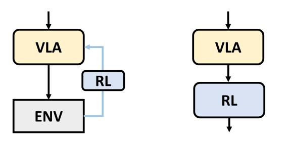

- 

**FIGURE 7.** Approaches to integrating RL with VLA models. (1) RL is used to fine-tune VLA models to enhance their performance. (2) VLA models serve as high-level policies, while RL policies handle low-level control.

of human teleoperation trajectories at test time to infer appropriate actions. For instance, ICRT [\[250\]](#page-33-7) introduces a framework in which 1–3 teleoperated demonstrations are provided as prompts, enabling the model to generate corresponding robot actions in a zero-shot manner.

# B. SELF-SUPERVISED LEARNING

Self-supervised learning is occasionally incorporated into the training of Vision-Language-Action (VLA) models, serving three primary purposes.

**Modality alignment** focuses on learning temporal and task-level consistency across modalities in VLA models. For instance, TRA [\[251\]](#page-33-8) uses contrastive learning to align representations of current and future states within a shared latent space, achieving temporal alignment. Similarly, task alignment is achieved by aligning language instruction embeddings with those of goal images through contrastive objectives.

**Visual representation learning** aims to extract visual features from images or videos using techniques such as masked autoencoding (e.g., MAE [\[129\]\)](#page-30-11), contrastive learning (e.g., CLIP [\[25\]\),](#page-27-15) and self-distillation (e.g., DINOv2 [\[46\]\).](#page-28-12) These pre-trained models are widely adopted in VLAs as foundational visual encoders.

**Latent action representation learning** leverages selfsupervised techniques to learn action embeddings, as discussed in Section [IV-B](#page-6-0) and Section [IV-D3.](#page-10-0) By extracting a latent action from the initial and goal images, and reconstructing the goal image using the initial image and the extracted latent action, the model learns meaningful action representations without requiring explicit labels. This approach is highly scalable and well-suited for large, unannotated datasets.

#### C. REINFORCEMENT LEARNING

While VLA is trained via imitation learning in general, imitation learning alone faces challenges such as the inability to handle novel behaviors and the requirement for sufficiently large and high-quality expert demonstrations. To address these issues, several prior arts have explored finetuning VLA or training low-level policies using reinforcement learning (RL), such as PPO [\[252\]](#page-33-9) and SAC [\[253\].](#page-33-10) These approaches can be broadly categorized into the following two types, as shown in Fig. [7.](#page-14-0)

# 1) IMPROVING VLA USING RL

Recent work leverages RL to improve the robustness, adaptability, and real-world performance of VLA models. Several approaches fine-tune VLAs using RL with task success or failure as the reward signal. iRe-VLA [\[254\]](#page-33-11) achieves high performance by repeatedly combining supervised finetuning (SFT) on expert data, online RL on the action head using success and failure rewards, and subsequent SFT using both expert data and successful trajectories collected during online learning. ConRFT [\[255\]](#page-33-12) applies imitation learning on a small set of demonstrations, performs offline RL to learn a Q-function, and subsequently fine-tunes the policy online through human interventions. This approach is inspired by prior frameworks such as SERL [\[256\]](#page-33-13) and HIL-SERL [\[257\],](#page-33-14) which are reset-free [\[258\],](#page-33-15) [\[259\],](#page-33-16) offpolicy RL methods [\[260\]](#page-33-17) designed for real-world robot learning. VLA-RL [\[261\]](#page-33-18) introduces the Robotic Process Reward Model (RPRM), which replaces sparse binary rewards with dense pseudo-rewards derived from gripper actions and task progress, enabling more stable PPO-based training. RLDG [\[262\]](#page-33-19) fine-tunes large VLA models such as OpenVLA [\[18\]](#page-27-18) and Octo [\[19\]](#page-27-19) using successful trajectories collected via HIL-SERL, allowing integration of multiple expert policies into a unified VLA. MoRE introduces a Mixture of Experts (MoE) structure into the VLA, enabling token-wise expert selection and refinement via RL. RLRC [\[263\]](#page-33-20) compresses OpenVLA by pruning up to 90% of its parameters, recovers performance via SFT, and then applies RL for final fine-tuning using task-level feedback. These studies demonstrate that RL, especially when combined with expert demonstrations or human interventions, can significantly improve the flexibility and reliability of VLA models in real-world settings. More recently, to address the potential instability associated with backpropagation through diffusion chains, DSRL [\[264\]](#page-33-21) proposes applying RL in the latent noise space of the diffusion policy. This approach avoids updating the parameters of the underlying VLA model during RL fine-tuning. Instead, it learns a distribution over the latent noise, allowing the model to sample informative initial noise vectors rather than from a standard Gaussian. Notably, DSRL demonstrates that the success rate of π0 can be improved from approximately 20% to nearly 100% using only 10K samples.

# 2) USING VLAs AS HIGH-LEVEL POLICIES AND RL FOR LOW-LEVEL CONTROL

This class of approaches delegates high-level decisionmaking to the VLA, while low-level control is handled by policies trained with RL. Humanoid-VLA [\[244\]](#page-33-1) uses a VLA to generate high-level commands, which are executed by a whole-body controller trained via RL for humanoid robots.

NaVILA [\[243\]](#page-33-0) adopts a similar strategy, applying RL to convert velocity commands from the VLA into torque control for a legged robot. A more advanced system, SLIM [\[265\],](#page-33-22) targets a mobile manipulator comprising a quadruped base and robotic arm. It first trains a teacher policy using RL with privileged inputs, such as footstep plans, object placements, and subtask identifiers, to generate base and arm trajectories. This policy is then distilled into a student VLA via imitation learning, enabling end-to-end mapping from images and language to actions. RPD [\[266\]](#page-33-23) takes a complementary approach, using a pre-trained VLA to guide exploration during RL. Here, the VLA acts as a teacher, shaping the learning process rather than serving as a high-level controller.

In addition, LUMOS performs imitation learning in the latent space of a world model by employing reinforcement learning guided by an intrinsic reward that quantifies the deviation from expert trajectories within the latent space. DexTOG [\[235\]](#page-32-34) generates a diverse set of grasp poses using a diffusion model and employs reinforcement learning to evaluate whether each candidate pose leads to task success. Through iterative fine-tuning with successful trajectories, the diffusion model learns object-specific grasp poses that are well-suited for subsequent tasks.

Despite the growing number of VLA methods incorporating RL, most prior work remains limited to simulation or simplified real-world setups, due to sample inefficiency, unsafe exploration, and computational inefficiency.

# D. TRAINING STAGES

Training Vision-Language-Action (VLA) models typically involves multiple stages, each targeting a specific aspect of learning. The pre-training aims to acquire general capabilities and promote transferability across diverse robotic embodiments. When a pre-trained Vision-Language Model (VLM) is used as the backbone of a VLA model, it must be adapted to the robotics domain to effectively ground language and visual understanding in action. This is followed by a post-training, in which the model is further refined using high-quality robot demonstration data to improve performance on specific downstream tasks. This section provides a stage-wise overview of representative training strategies, highlighting common data sources, model backbones, and adaptation techniques used in recent VLA systems.

#### 1) PRE-TRAINING

Pre-training plays a pivotal role in shaping the generalization ability and semantic grounding of VLA models. This subsection outlines key strategies and design choices in recent pre-training pipelines, highlighting how large-scale multimodal data, powerful VLM backbones, and training stabilization techniques contribute to effective policy initialization.

#### *a: DATA SCALE AND SOURCE*

The scale and heterogeneity of training data significantly impact the generalization ability of VLA models across diverse scenes, objects, and tasks. Recent models increasingly leverage large-scale datasets that combine robot demonstrations, web-scale vision-language corpora, and structured annotations to improve semantic understanding and visuomotor grounding.

π0 [\[21\]](#page-27-21) is trained on millions of real-world trajectories collected across varied embodiments and tasks. Its successor, π0.5 [\[23\], e](#page-27-23)xtends this approach by incorporating not only robotic data but also large-scale vision-language datasets commonly used for object detection and visual reasoning (e.g., COCO [\[267\],](#page-33-24) VQA [\[268\]\)](#page-33-25). The model is trained with auxiliary cross-entropy losses for multiple tasks, including bounding box prediction, image captioning, subtask language generation, and discrete action prediction.

Similarly, Gr00T N1 [\[24\]](#page-27-24) incorporates an auxiliary bounding box loss to improve spatial localization and affordance detection. These bounding box labels are obtained using OWL-ViT [\[144\],](#page-30-26) allowing the model to learn from weakly supervised visual data. Gr00T N1 further leverages egocentric human videos, from which latent action representations are extracted to supervise the VLA model. Additionally, it introduces diverse synthetic trajectories generated in simulation, which are transformed into realistic visual observations using the COSMOS world model [\[269\],](#page-33-26) enhancing the model's capacity to learn long-horizon, multistage behaviors.

These approaches demonstrate a growing trend toward enriching VLA training data not only in scale but also in structure and modality. By jointly training on action, grounding, and reasoning tasks, modern VLAs acquire richer representations that support robust policy learning and generalization.

#### *b: VLM BACKBONES*

A common practice in recent VLA models is to leverage vision-language models (VLMs) that have been pre-trained on large-scale web data. This strategy enables models to inherit broad visual and linguistic priors, including common sense knowledge, semantic grounding, and reasoning capabilities. By decoupling low-level perceptual grounding from action policy learning, pre-trained VLMs provide a flexible foundation that can be adapted to various robotic tasks with limited additional supervision. We now introduce a selection of representative VLM backbones that have been employed in VLA models. leftmargin=2em

• **PaLM-E** [\[38\], d](#page-28-4)eveloped by Google, has been used along with PaLI-X [\[39\]—](#page-28-5)as the backbone for RT-2 and its successor VLA models.

- **PaliGemma** [\[51\]](#page-28-17) combines Gemma [\[181\]](#page-31-21) with SigLIP [\[47\], a](#page-28-13)nd is used in π0 [\[21\]](#page-27-21) and π0.5 [\[23\]](#page-27-23) developed by Physical Intelligence.
- **PrismaticVLM** [\[45\]](#page-28-11) is based on LLaMA 2 [\[1\]](#page-27-0) and combines it with DINOv2 [\[46\]](#page-28-12) and SigLIP [\[47\].](#page-28-13) It is widely used in current VLA models, including OpenVLA [\[18\]](#page-27-18) and CogACT [\[104\].](#page-29-27)
- • **Qwen2.5-VL** [\[136\],](#page-30-18) developed by Alibaba, combines Qwen2.5 LLM [\[270\]](#page-33-27) with a ViT-based vision encoder. It is used in a variety of VLA models such as NORA [\[271\],](#page-33-28) Interleave-VLA [\[272\],](#page-33-29) and Combat-VLA [\[273\].](#page-33-30)
- • **LLaVA** [\[274\]](#page-33-31) integrates the LLaMA-based LLM Vicuna [\[180\]](#page-31-20) with the vision encoder from CLIP [\[25\]](#page-27-15) via an MLP. It has been widely adopted in models such as OpenHelix [\[216\],](#page-32-15) OE-VLA [\[275\],](#page-33-32) and RationalVLA [\[215\].](#page-32-14)
- • **Gemini 2.0** [\[276\],](#page-33-33) developed by Google, includes variants such as Gemini Robotics-ER for robotic question answering and Gemini Robotics, which extends its capabilities to VLA applications [\[277\].](#page-33-34)
- • **Fuyu-8B** [\[278\]:](#page-33-35) QUAR-VLA [\[279\]](#page-33-36) and MoRE [\[280\],](#page-33-37)
- **OpenFlamingo** [\[61\]:](#page-28-27) RoboFlamingo [\[61\],](#page-28-27) DeeR-VLA [\[281\],](#page-33-38) and RoboMM [\[220\],](#page-32-19)
- • **BLIP-2** [\[3\]: 3D](#page-27-2)-VLA [\[87\],](#page-29-10)
- • **LLaMA3.2** [\[282\]:](#page-33-39) FOREWARN [\[283\],](#page-33-40)
- • **AnyGPT** [\[284\]:](#page-33-41) SOLAMI [\[197\],](#page-31-37)
- **Phi** [\[183\]:](#page-31-23) TraceVLA [\[285\],](#page-33-42) UP-VLA [\[286\],](#page-33-43) and HybridVLA [\[99\],](#page-29-22)
- • **Molmo** [\[287\]:](#page-33-44) UAV-VLA [\[288\],](#page-33-45)
- • **VILA** [\[289\]:](#page-33-46) NaVILA [\[243\]](#page-33-0) and HAMSTER [\[214\],](#page-32-13)
- • **InternVL** [\[290\]](#page-34-0) GO-1 [\[94\],](#page-29-17)
- **Eagle-2** [\[291\]:](#page-34-1) GR00T N1 [\[24\],](#page-27-24)
- • **Chameleon** [\[292\]:](#page-34-2) WorldVLA [\[140\].](#page-30-22)

This demonstrates the extensive diversity in VLM backbones currently employed across the VLA landscape.

# *c: GRADIENT INSULATION*

An emerging trend in training VLA models involves preventing gradient flow from the action head into the vision-language backbone [\[293\].](#page-34-3) Allowing gradients from a randomly initialized action head to propagate can compromise pre-trained representations, resulting in unstable and inefficient training. Prior work demonstrates that this form of gradient insulation significantly improves both training stability and efficiency [\[293\].](#page-34-3) GR00T N1.5 [\[24\]](#page-27-24) also freezes the VLA model entirely, likely for similar reasons. Similarly, RevLA [\[294\]](#page-34-4) also addresses catastrophic forgetting by gradually reversing the backbone model weights, inspired by model merging.

# *d: STABILITY AND EFFICIENCY HEURISTICS*

Re-Mix [\[295\]](#page-34-5) adjusts the sampling weights of individual datasets based on excess loss, which quantifies the remaining potential for policy improvement within each domain.

#### 2) POST-TRAINING

In contrast to pre-training, which relies on large-scale and diverse datasets, post-training requires high-quality, robotand task- specific data. As full fine-tuning typically demands substantial computational resources, an alternative strategy is to fine-tune only the action head while keeping the backbone weights frozen. Another approach is to use Low-Rank Adaptation (LoRA) [\[296\],](#page-34-6) which enables computationally efficient fine-tuning with minimal performance degradation.

In addition, BitVLA [\[297\]](#page-34-7) introduces a distillation-based approach to quantize the vision encoder, aiming to enable memory-efficient training. Specifically, the vision encoder is compressed to 1.58 bits by distilling a full-precision encoder into a quantized student model. This strategy achieves substantial memory savings with minimal performance degradation, thereby facilitating efficient deployment on resource-constrained systems.

**Freezing backbone vs. full fine-tuning.** When adapting pre-trained VLMs for robotic tasks, a critical design choice is whether to freeze the vision-language backbone or perform full fine-tuning. This decision involves fundamental trade-offs across multiple dimensions.

- **(a) Computational efficiency:** Freezing the backbone requires significantly less GPU memory and training time as gradients only need to be computed for the action head, enabling training on consumer-grade GPUs. In contrast, full fine-tuning demands substantial computational resources, often requiring large GPU clusters and extended training periods, which limits accessibility for many researchers.
- **(b) Domain adaptation:** Full fine-tuning excels by enabling end-to-end optimization that jointly learns perception and control, allowing the model to adjust to robot-specific visual patterns and domain-specific knowledge. Frozen backbones, however, cannot adapt to these domain shifts, potentially creating a gap between pre-trained representations and robotic perception requirements.
- **(c) Performance-resource trade-off:** Full fine-tuning of VLA models often yields the highest task-specific performance when sufficient data and compute are available, but it incurs substantial computational cost. To mitigate this, parameter-efficient adaptation methods such as Low-Rank Adaptation (LoRA) [\[296\]](#page-34-6) offer a compelling alternative. For instance, OpenVLA [\[18\]](#page-27-18) demonstrates that LoRA can achieve competitive performance while significantly reducing memory and compute requirements, enabling training on consumer-grade GPUs rather than large-scale clusters. Recent work has also explored intermediate strategies, such as staged unfreezing or selective fine-tuning of specific layers, to strike a balance between adaptation capability and efficiency.
- **(d) Knowledge preservation:** Frozen backbones maintain the rich visual and linguistic representations learned from web-scale data, preventing catastrophic forgetting of general vision-language capabilities. Full fine-tuning, while allowing the model to specialize for robotic visual features

and action-grounded language, risks degrading these pretrained representations, potentially losing valuable general knowledge that could benefit zero-shot generalization.

#### E. INFERENCE

To address latency during real-world execution, Real-Time Chunking (RTC) [\[298\]](#page-34-8) introduces an asynchronous action generation strategy. RTC mitigates delays by fixing previously executed actions while generating subsequent actions in the sequence. This method uses soft masking to maintain temporal consistency with past trajectories while enabling dynamic replanning based on updated sensory inputs.

Furthermore, DeeR-VLA [\[299\]](#page-34-9) is trained to enable action prediction at each layer of the transformer. If the difference between actions predicted from two consecutive layers is small, the remaining layers are skipped to accelerate inference. VLA-Cache [\[300\]](#page-34-10) improves inference speed by identifying static tokens and reusing previously computed features from earlier steps.

#### **VI. DATASETS**

# A. DATA COLLECTION FOR VLA

Training VLA models requires access to large volumes of high-quality data. This section outlines the primary data collection strategies employed in VLA research. Note that data collection via simulation is discussed in Section [VI-B;](#page-19-0) here we focus on methods based on real devices.

# 1) TELEOPERATION

In this approach, demonstrations are recorded in real time while a human operator directly controls the robot, enabling the collection of high-quality trajectories. This method forms the basis of many VLA datasets. For example, ALOHA [\[301\]](#page-34-11) employs a unilateral teleoperation setup consisting of a dualarm WidowX 250 as the leader and a dual-arm ViperX-300 as the follower. The follower robot mimics the leader's motions, allowing precise manipulation data to be captured. Mobile ALOHA [\[302\]](#page-34-12) extends this framework by mounting the system on a mobile base, enabling the collection of mobile manipulation demonstrations. The ALOHA framework has evolved through multiple iterations. ALOHA 2 introduces refined hardware components, such as upgraded grippers and gravity compensation mechanisms, along with open-source hardware and simulation environments [\[303\].](#page-34-13) Building on this upgraded platform, ALOHA Unleashed investigates large-scale imitation learning [\[304\].](#page-34-14) Furthermore, Bi-ACT [\[305\]](#page-34-15) introduces bilateral control to enable more responsive interaction between the leader and follower robots, while GELLO [\[306\]](#page-34-16) adapts the system by employing a scaled-down follower robot with proportionally adjusted link lengths.

In contrast to leader-follower approaches, which require robots on both the leader and follower sides, many prior works have proposed methods to reduce both the burden on the human operator and the overall cost of the teleoperation system. For instance, AnyTeleop [\[307\]](#page-34-17) estimates the position and orientation of the human hands from a single RGB camera using MediaPipe [\[308\],](#page-34-18) and retargets this information to the robot via CuRobo [\[309\]](#page-34-19) for teleoperation. ACE [\[310\]](#page-34-20) combines precise wrist tracking using an exoskeleton device with hand pose estimation from Mediapipe to facilitate accurate teleoperation. Aiming for applications in humanoid robotics, Open-Television [\[311\]](#page-34-21) utilizes hand and head pose estimation via the Apple Vision Pro to enable both teleoperation and active-vision-based manipulation. Bunny-VisionPro [\[312\]](#page-34-22) also employs the Apple Vision Pro, with greater emphasis on haptic feedback and real-time system integration.

In addition to these approaches, data collection can also be performed through more direct control methods such as 3D mice or game controllers. While these alternatives simplify the setup and eliminate the need for wearable or vision-based pose estimation systems, they may offer lower fidelity in replicating natural human motions.

# 2) DATA COLLECTION USING PROXY DEVICES

Controlling a physical robot directly poses significant challenges for scaling data collection. By decoupling human motion from physical robot control, recent approaches enable more intuitive, flexible, and scalable data collection through the use of proxy devices. For example, UMI [\[313\]](#page-34-23) is a handheld gripper equipped with a GoPro camera, whose 6-DoF trajectory is estimated using visual SLAM. The collected data can be used to train a policy, and by later mounting UMI as the robot's end-effector, the robot can reproduce the demonstrated motions without being physically involved during data collection. Recently, LBM [\[314\]](#page-34-24) leverages UMI to collect 32 hours of demonstrations. DexUMI [\[315\]](#page-34-25) extends this concept to dexterous manipulation by replacing the simple gripper with a five-fingered robotic hand. The human demonstrator wears an exoskeleton glove equipped with the same cameras and tactile sensors as the target robot, allowing the recorded hand motions to be faithfully transferred.

Building on similar principles, Dobb-E [\[316\]](#page-34-26) uses a rod-shaped device resembling the end-effector of Hello Stretch to capture human demonstrations. RUMs [\[317\]](#page-34-27) further enhances this paradigm by increasing the diversity of collected tasks, incorporating failure detection mechanisms, and improving the network architecture. These improvements enable the robot to generalize to a wide range of tasks through pre-training alone. DexCap [\[318\]](#page-34-28) is the device for data collection by mounting Realsense T265 cameras on Rokoko EMF gloves for both hands, along with additional Realsense T265 and L515 sensors on the chest, enabling SLAM-based 6-DOF wrist pose estimation and glove-based hand pose tracking. In contrast, DexWild [\[319\]](#page-34-29) addresses the wiring complexity and SLAM calibration challenges of DexCap by using EMF gloves in combination with palm-facing cameras on both hands and ArUco marker tracking via external cameras.

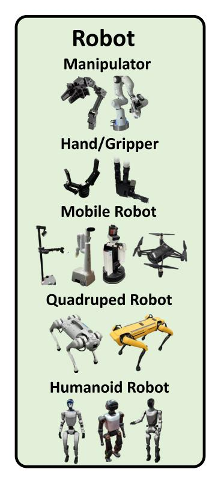

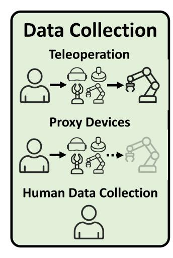

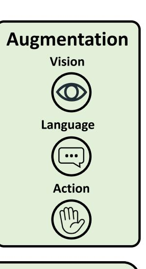

| Evaluation    |                            |           |               |           |  |  |
|---------------|----------------------------|-----------|---------------|-----------|--|--|
| CALVIN        | Habitat                    | robosuite | ManiSkill     | RLBench   |  |  |
| AI2-THOR      | Habitat 2.0 Habitat 3.0 | robomimic | ManiSkill 2   | COLOSSEUM |  |  |
| Meta-World    |                            | RoboCasa  | ManiSkill 3   | SIMPLER   |  |  |
| ivieta-vvoria |                            | LIBERO    | ManiSkill-HAB | RoboArena |  |  |

**FIGURE 8.** Structure of Section [VI](#page-17-0) and Section [VII:](#page-21-0) robots used VLA research — including manipulator, hand/gripper, mobile robot, quadruped robot, and humanoid robot; data collection methods — including teleoperation, proxy devices, and human data collection; publicly available dataset — including human egocentric data, simulation data, and real-world robot data; augmentation for vision, language, and action; various evaluation benchmarks.

#### 3) HUMAN DATA COLLECTION

This approach involves collecting data by recording natural human behavior without relying on proxy devices that mimic the robot's end effector. The simplest form of this method involves mounting a GoPro camera or microphone on the user's head to capture first-person visual and auditory data, often supplemented with inertial measurement unit (IMU) or gaze information. This technique has been widely adopted in large-scale egocentric datasets such as Ego4D and EPIC-KITCHENS [\[130\],](#page-30-12) [\[155\],](#page-30-37) [\[156\].](#page-30-38) Recent advances in wearable sensing technologies have enabled more naturalistic and scalable data collection using compact smart glasses such as Meta's Project Aria. These devices have facilitated the development of enriched datasets including Ego Exo4D, HOT3D, HD EPIC, and Aria Everyday Activities [\[320\],](#page-34-30) [\[321\],](#page-34-31) [\[322\],](#page-34-32) [\[323\].](#page-34-33) Leveraging these datasets, several prior works have trained robot policies directly from human demonstration data. For instance, EgoMimic and EgoZero learn visuomotor control by imitating egocentric human behavior [\[324\],](#page-34-34) [\[325\].](#page-34-35) Similarly, other studies use data collected with devices such as the Apple Vision Pro to train humanoid robot policies based on natural human motion [\[326\].](#page-34-36)

# 4) DATA COLLECTION PIPELINE

Data collection plays a pivotal role in training VLA models. These models require large-scale, high-quality datasets, and the data acquisition pipeline must be carefully designed to ensure both efficiency and diversity. In the case of RT-1 [\[16\], a](#page-27-16) large-scale real-robot dataset is collected using a framework that samples instructions and randomized initial states from a curated instruction set. This approach enabled the collection of demonstrations across a broad range of tasks and environments, with human operators executing the sampled instructions to generate diverse and balanced data. In RoboTurk [\[327\],](#page-34-37) a 6-DOF teleoperation interface was developed using an iPhone, enabling the collection of large-scale robot manipulation demonstrations via a crowdsourcing platform [\[328\].](#page-34-38)

Furthermore, prior work [\[329\],](#page-34-39) [\[330\]](#page-34-40) demonstrates the effectiveness of annotating pre-collected datasets with natural language. For example, the Language Table dataset [\[329\]](#page-34-39) collects teleoperated trajectories and subsequently adds language annotations via crowdsourcing, resulting in a large-scale dataset with approximately 600,000 languagelabeled trajectories. Similarly, DROID [\[330\]](#page-34-40) conducts distributed data collection across 18 research institutions, gathering 76,000 trajectories and 350 hours of interaction data over 564 scenes and 86 tasks, which are later annotated with natural language through a crowdsourcing platform.

However, since human annotation is costly, recent trends increasingly leverage foundation models such as VLMs to automate the annotation process. ECoT [\[86\]](#page-29-9) and EMMA-X [\[331\]](#page-34-41) combine object detection and gripper localization

using Grounding DINO [\[175\]](#page-31-15) and SAM [\[145\],](#page-30-27) and high-level plan and subtask generation using Gemini 1.0 to produce automatic annotations. NILS [\[332\]](#page-35-0) is a framework that segments long-horizon robot videos and generates language annotations without human intervention. It integrates multiple VLMs to detect keystates based on object state changes and gripper motions, and employs LLMs to generate natural language instructions. RoboMIND [\[333\]](#page-35-1) also employs an annotation system based on Gemini [\[334\],](#page-35-2) and demonstrates substantial performance improvements through pre-training with a VLA model.

While such methods are more cost-effective and scalable than human post-hoc annotations, they face challenges such as fine-grained scene understanding and hallucinations. Particularly in methods like ECoT that rely solely on text, inconsistencies with actual visual context are more likely to occur. Approaches grounded in visual input, such as EMMA-X, or those integrating multiple perceptual modalities, such as NILS, have proven effective in addressing these issues.

#### B. DATASETS FOR VLA

We outline key datasets used in the pre-training of VLA models. Since the development of VLAs builds upon advances in LLMs and VLMs, a wide range of web-based datasets are leveraged. In this section, we focus specifically on datasets used for *pre-training* of VLA models, grouped into three main categories. Datasets used for post-training are typically proprietary or integrated into evaluation benchmarks such as CALVIN [\[342\]](#page-35-3) and LIBERO [\[343\],](#page-35-4) and are therefore excluded from this summary.

# 1) HUMAN DATASETS

Collecting human data is significantly more scalable than collecting robotic data, as it does not require access to physical robots, precise calibration, or safety-critical execution environments. While third-person visual data is still used, first-person data has become particularly important for VLA pre-training because it more closely approximates the perceptual input received by real-world robots, especially those equipped with head-mounted sensors or humanlike embodiments. As a result, first-person visual data is now widely adopted as a key resource for pre-training VLA models. For example, Ego4D [\[130\]](#page-30-12) is one of the largest and most comprehensive egocentric video datasets, comprising over 3,000 hours of head-mounted RGB footage collected from more than 800 participants across 74 cities in 9 countries. Other notable examples include EPIC-KITCHENS [\[155\],](#page-30-37) [\[156\],](#page-30-38) which documents everyday kitchen activities, and HOI4D [\[344\],](#page-35-5) which captures fine-grained human-object interactions. Several datasets focus specifically on manipulation tasks. OAKINK2 [\[345\]](#page-35-6) and H2O [\[346\]](#page-35-7) capture bimanual object manipulation using RGB-D sensors and motion capture systems. ARCTIC [\[347\]](#page-35-8) centers on interaction with articulated objects through dexterous bimanual manipulation, while EgoPAT3D [\[348\]](#page-35-9) focuses on human action target prediction from egocentric views.

Moreover, the advent of smart-glass-based recording devices has enabled more naturalistic and unobtrusive egocentric data collection (see Section [VI-A\)](#page-17-1). Notable examples include Aria Everyday Activities [\[323\];](#page-34-33) Ego-Exo4D [\[320\],](#page-34-30) which integrates egocentric and exocentric perspectives; HOT3D [\[321\],](#page-34-31) focused on fine-grained hand-object tracking; and HD-EPIC [\[322\],](#page-34-32) which extends egocentric cooking data. These datasets are frequently used for pre-training VLA models, often via latent action prediction approaches such as LAPA [\[22\]. A](#page-27-22)lthough not egocentric, large-scale video-language datasets like HowTo100M [\[349\],](#page-35-10) Something-Something V2 [\[350\],](#page-35-11) and Kinetics-700 [\[351\]](#page-35-12) are also used for model pre-training and are sometimes adapted for VLA-related tasks. As VLA research increasingly employs humanoid robots and systems with human-like sensory configurations, egocentric datasets, particularly those capturing natural, goal-directed behavior, are expected to play an increasingly vital role.

# 2) SIMULATION DATASETS

Simulation environments have long been used to generate robotic datasets in a scalable, safe, and cost-effective manner. They support controlled data collection and flexible manipulation of scene configurations, making them particularly suitable for imitation learning and large-scale model pretraining. For example, RoboTurk [\[327\]](#page-34-37) consists of task demonstrations on Sawyer robots within the MuJoCo physics engine [\[352\],](#page-35-13) collected via remote human teleoperation over the cloud. However, collecting large-scale demonstration data in simulation, particularly via teleoperation, can still be timeconsuming. To mitigate this limitation, MimicGen [\[353\]](#page-35-14) introduces a framework for generating large-scale datasets from a small number of expert demonstrations. It decomposes demonstrations into object-centric subtasks and synthesizes new trajectories by transforming and recomposing them into novel scenes. DexMimicGen [\[354\]](#page-35-15) extends this approach to more complex embodiments, such as dual-arm robots and multi-fingered hands.

In parallel, large-scale video world models such as COSMOS [\[269\]](#page-33-26) have been developed to generate diverse imagined trajectories, providing rich and scalable training data for VLA models.

Although simulation played a central role in early VLA research, its dominance has declined with the increasing availability of large-scale real-world robot datasets (see the next category, which covers real robot datasets). Nonetheless, simulation remains a powerful tool for producing diverse, controllable data—particularly when real-world collection is impractical or cost-prohibitive.

#### 3) REAL ROBOT DATASETS

Real-world robot datasets play a crucial role in the development and evaluation of VLA models. Collected on physical

**TABLE 1.** Recent real-world robot datasets used in VLA research. Here, Skill denote atomic action primitives (e.g., pick, place, reach), whereas Task correspond to instruction-level goals. All statistics are reported as in the original papers; the table is adapted from prior works [\[11\],](#page-27-10) [\[330\],](#page-34-40) [\[333\],](#page-35-1) [\[335\].](#page-35-16)

| Name                 | Episodes | Skill    | Task    | Modality       | Embodiment    | Collection        |
|----------------------|----------|----------|---------|----------------|---------------|-------------------|
| QT-Opt [336]         | 580K     | 1 (Pick) | NA      | RGB            | KUKA LBR iiwa | Learned           |
| MT-Opt [337]         | 800K     | 2        | 12      | RGB, L         | 7 robots      | Scripted, Learned |
| RoboNet [338]        | 162K     | NA       | NA      | RGB            | 7 robots      | Scripted          |
| BridgeData [339]     | 7.2K     | 4        | 71      | RGB, L         | WidowX 250    | Teleop            |
| BridgeData V2 [340]  | 60.1K    | 13       | NA      | RGB-D, L       | WidowX 250    | Teleop            |
| BC-Z [341]           | 26.0K    | 3        | 100     | RGB, L         | Google EDR    | Teleop            |
| Language Table [329] | 413K     | 1 (Push) | NA      | RGB, L         | xArm          | Teleop            |
| RH20T [335]          | 110K     | 42       | 147     | RGB-D, L, F, A | 4 robots      | Teleop            |
| RT-1 [16]            | 130K     | 12       | 700+    | RGB, L         | Google EDR    | Teleop            |
| OXE [17]             | 1.4M     | 527      | 160,266 | RGB-D, L       | 22 robots     | Mixed             |
| DROID [330]          | 76K      | 86       | NA      | RGB-D, L       | Franka        | Teleop            |
| FuSe [198]           | 27K      | 2        | 3       | RGB, L, T, A,  | WidowX 250    | Teleop            |
| RoboMIND [333]       | 107K     | 38       | 479     | RGB-D, L       | 4 robots      | Teleop            |
| AgiBot World [94]    | 1M       | 87       | 217     | RGB-D, L       | AgiBot G1     | Teleop            |

robot hardware, these datasets offer diverse embodiments, realistic interactions, and rich sensory inputs that are essential for training models capable of generalizing to real-world tasks. MIME [\[355\]](#page-35-17) is one of the first large-scale robotic datasets. It contains 8.2K trajectories across 20 tasks, consisting of paired human demonstrations and kinesthetic teaching of a Baxter robot performed by humans. Concurrently, QT-Opt [\[336\]](#page-35-18) has been introduced, comprising 580,000 grasp attempts collected over four months using seven KUKA LBR iiwa robotic arms. MT-Opt [\[337\],](#page-35-19) an extension of QT-Opt, expands the task scope beyond grasping to support a wider range of manipulation skills. RoboNet [\[338\]](#page-35-20) contains 162, 000 trajectories gathered across seven robot types— Sawyer, Baxter, WidowX, Franka Emika Panda, KUKA LBR iiwa, Fetch, and Google Robot. Although the trajectories are generated using random or rule-based actions rather than expert demonstrations, the dataset supports research on generalization across diverse platforms and environments. BridgeData [\[339\]](#page-35-21) is collected via VR teleoperation using an Oculus Quest 2 and a WidowX 250 robot. It consists of 7, 200 trajectories across 10 environments and 71 tasks. An extension of this work, BridgeData V2 [\[340\],](#page-35-22) scales the dataset to 60, 000 trajectories across 24 diverse environments. BC-Z [\[341\]](#page-35-23) involves 12 Google Robots operated by seven human teleoperators performing over 100 manipulation tasks. Additional data are collected through policy executions with human oversight, resulting in 25,900 trajectories. Language Table [\[329\]](#page-34-39) contains 600, 000 block manipulation trajectories (413K for real-world and 181K for simulated trajectories) paired with natural language instructions. The data are collected through long, goal-free demonstrations and annotated via crowdsourcing to support instruction-conditioned training. RH20T [\[335\]](#page-35-16) provides multimodal data collected from four robots (Franka Emika Panda, UR5, KUKA LBR iiwa, and Flexiv Rizon) across 147 tasks and seven configurations. Unlike earlier datasets, it includes synchronized RGB-D, 6 axis force-torque, joint torque, and audio signals—supporting multimodal perception and control. RT-1 [\[16\]](#page-27-16) comprises 130,000 real-world robotic demonstration trajectories collected over 17 months using 13 Google Robots. It serves as the foundation for the RT-series of transformer-based VLA models for real-time, instruction-conditioned behavior.

Finally, Open-X Embodiment (OXE) dataset [\[17\]](#page-27-17) unifies many of these datasets, including RT-1, BC-Z, BridgeData, and Language Table—into a standardized format using the RLDS schema [\[356\].](#page-35-24) Developed through a large-scale collaboration involving 21 institutions and 173 authors, OXE dataset represents one of the most comprehensive and widely adopted real-robot VLA datasets to date.

Several additional real-world robot datasets have been released to further advance VLA research. DROID [\[330\]](#page-34-40) is a large-scale dataset comprising 76, 000 trajectories collected across 13 institutions using a standardized hardware setup. Each participating lab used a Franka Emika Panda arm equipped with a Robotiq 2F-85 gripper, two external stereo cameras, and a wrist-mounted camera. Unlike Open X-Embodiment dataset, which aggregates data from heterogeneous robot platforms, DROID ensures consistency across environments and embodiments, making it well-suited for benchmarking. FuSe [\[198\]](#page-31-38) provides 27, 000 multimodal trajectories collected using a WidowX 250 platform. The robot is outfitted with external cameras, a wrist-mounted camera, DIGIT tactile sensors, microphones, and an IMU, enabling rich cross-modal learning for VLA tasks. RoboMIND [\[333\]](#page-35-1) offers 107, 000 trajectories collected from a diverse set of robot embodiments, including single-arm, dual-arm, humanoid, and dexteroushand configurations. The dataset emphasizes diversity in morphology and manipulation strategies, supporting research in generalization and transfer. AgiBot World Dataset [\[94\]](#page-29-17) is a massive-scale dataset comprising 1 million trajectories collected using over 100 AgiBot G1 robots. Its unprecedented scale enables training of large VLA models under highly diverse conditions. In addition to these major releases, several task-specific or platform-specific datasets have been introduced, including Task-Agnostic Robot Play [\[357\],](#page-35-25) [\[358\],](#page-35-26) Jaco Play [\[359\],](#page-35-27) Cable Routing [\[360\],](#page-35-28) Berkeley Autolab UR5 [\[361\],](#page-35-29) TOTO [\[362\],](#page-35-30) and RoboSet [\[363\].](#page-35-31) Navigation-focused VLA datasets have also emerged, such as SACSoN [\[364\],](#page-35-32) SCAND [\[365\],](#page-35-33) RECON [\[366\],](#page-35-34) and BDD100K [\[367\],](#page-35-35) which support instruction-following and goal-directed behaviors in mobile platforms. Finally, specialized datasets such as RoboVQA [\[368\]](#page-35-36) target robot-specific question answering, further broadening the

scope of VLA applications beyond manipulation and navigation.

#### C. DATA AUGMENTATION FOR VLA

Given the high cost of collecting datasets, various data augmentation methods have been developed to expand existing datasets. These approaches span multiple modalities, including vision, language, and action.

# 1) VISION AUGMENTATION

In most computer vision tasks, augmentation techniques such as rotation, cropping, and scaling are commonly used to improve generalization. However, in robotics, where the robot's embodiment and its spatial relationship to the camera are critical, such transformations can distort these relationships and negatively affect performance. To address this, recent methods have proposed using image generation models, such as Stable Diffusion [\[137\],](#page-30-19) to perform embodiment-aware augmentations. CACTI [\[369\]](#page-35-37) leverages Stable Diffusion to modify a specific region of images to augment a small, yet high-quality dataset. GenAug [\[370\]](#page-35-38) introduces more sophisticated visual augmentation by leveraging Stable Diffusion to apply three types of transformations: altering object textures, inserting task-irrelevant distractors, and modifying backgrounds. These augmentations aim to improve policy robustness by increasing visual diversity while preserving task-relevant semantics. ROSIE [\[371\]](#page-36-0) builds on CACTI and GenAug by using an LLM, OWL-ViT [\[144\],](#page-30-26) and Imagen Editor [\[372\]](#page-36-1) to automatically identify and modify masked regions based on text prompts, enabling controlled edits to target objects, backgrounds, or the insertion of new objects. The augmented data is used to train RT-1 [\[16\].](#page-27-16) DreamGen [\[110\]](#page-29-33) utilizes a video world model to generate diverse visual variations, paired with an inverse dynamics model (IDM) to infer the corresponding actions. This combination enables the synthesis of training data, facilitating policy learning in novel environments and enhancing generalization. In contrast, MOO [\[57\]](#page-28-23) forgoes explicit visual augmentation and instead disentangles object and skill representations using a vision-language model (VLM), allowing policies to generalize to unseen object-skill combinations from limited data. It addresses visual variability implicitly by leveraging the broad generalization capabilities of pre-trained VLMs. Moreover, BYOVLA [\[373\]](#page-36-2) extracts and inpaints task-irrelevant regions in image observations during runtime, aiming to enhance robustness against visual distractions.

#### 2) LANGUAGE AUGMENTATION

DIAL [\[374\]](#page-36-3) starts with a small, manually labeled seed set of trajectory-instruction pairs. A VLM is trained on this seed set to compute similarity between trajectories and instructions. Simultaneously, an LLM generates diverse paraphrases of the seed instructions, forming a large pool of candidates. These are then matched to the remaining unlabeled trajectories using the trained VLM, and the top-k most similar instructions are assigned. The resulting dataset is used to train RT-1 [\[16\].](#page-27-16)

# 3) ACTION AUGMENTATION

Since actions are directly tied to the robot's physical behavior and embodiment, augmenting action data is generally challenging. A common approach to address this challenge is dataset expansion through interactive methods such as DAgger [\[375\],](#page-36-4) which iteratively collects expert actions in states visited by the learned policy. Similarly, CCIL [\[376\]](#page-36-5) generates corrective data when a policy encounters out-ofdistribution states by learning a locally smooth dynamics model. It synthesizes actions that guide the robot from novel states back to expert-visited ones, and the resulting corrective data is combined with the original demonstrations to refine the policy.

#### **VII. REVIEW OF REAL-WORLD ROBOT APPLICATIONS**

In this section, we summarize key practical aspects of VLA research, including the types of robots used, data collection methodologies, publicly available datasets and augmentation techniques, and the evaluation protocols applied to assess model performance.

# A. ROBOT FOR VLA

In this section, we present an overview of the types of robots commonly employed in VLA research.

#### 1) MANIPULATOR

Robotic manipulators are the most commonly used robots in VLA research, encompassing both single-arm and dualarm configurations. Single-arm robots used in the prior works reviewed in this survey include: Franka Emika Panda, Franka Research 3, UR5, UR5e, UR3, UR3e, UR10, Kinova Gen3, Kinova Jaco 2, Sawyer, KUKA LBR iiwa 14, UFactory xArm, DENSO Cobotta, FANUC LR Mate 200iD, Realman RM65-B, Realman RM75-6F, AgileX PiPER, Unitree Z1 Pro, Dobot, Flexiv Rizon, AIRBOT Play, ARX, DLR SARA [\[377\],](#page-36-6) WidowX 250 6DoF, ViperX 300 6DoF, SO-100/101, and PAMY2 [\[378\].](#page-36-7) These manipulators typically feature 5, 6, or 7 degrees of freedom (DoFs). The joint configurations and link lengths vary across these manipulators. PAMY2 uses pneumatic actuation, reflecting the diversity of robotic embodiments. In addition, several systems (e.g., AgileX PiPER, ARX, Franka Emika Panda, UFactory xArm, UR5e, AIRBOT Play, ALOHA [\[301\],](#page-34-11) and ALOHA2 [\[303\]](#page-34-13) adopt a bimanual configuration by placing two arms side by side. WidowX, ViperX, ALOHA, SO-100/101, and PAMY2 are fully open-source in hardware, allowing researchers to flexibly modify or extend their physical embodiment. These manipulators are used to perform a wide range of tasks, including object grasping and relocation, assembly, manipulation of deformable objects, and peg-in-hole insertion.

# 2) HAND/GRIPPER

This category refers to the hands and grippers that serve as end-effectors mounted on the manipulators described above. Hands used in prior works in VLA include the ROBOTERA Xhand, PSYONIC Ability Hand, Inspire Robots RH56, Shadow Hand, PsiBot G0-R, Robotiq 2F-85/140, LEAP Hand, and UMI. These vary in design: the LEAP Hand [\[379\]](#page-36-8) has four fingers; the Robotiq Gripper and UMI [\[313\]](#page-34-23) are two-fingered; the others are five-fingered. Some systems also use suction cups or task-specific grippers, as in Shake-VLA [\[380\].](#page-36-9) Platforms such as ALOHA, ARX, and PiPER typically include two-fingered grippers by default. The LEAP Hand and UMI are open-source, allowing easy hardware modification. While two-fingered grippers are suited for grasping, four- and five-fingered hands enable tool use and in-hand manipulation.

#### 3) MOBILE ROBOT

Mobile robots in VLA research include both wheeled platforms and mobile manipulators that combine robotic arms with mobile bases. Jackal and TurtleBot 2 are examples of systems that rely exclusively on wheeled locomotion and do not incorporate manipulation capabilities. In contrast, mobile manipulators exhibit diverse configurations, including single-arm platforms such as Hello Stretch, Google Robot, and LoCoBot, as well as dual-arm systems like Mobile ALOHA, PR2, Fibocom, and AgiBot G1. LoCoBot and TurtleBot 2 are also notable for their fully open-source hardware, which facilitates embodiment customization and experimentation. Mobile platforms enable locomotion and environmental interaction capabilities beyond those afforded by stationary arms or grippers, supporting tasks that involve navigation and dynamic scene engagement. Some models, such as RT-1, are capable of performing navigation and manipulation concurrently.

#### 4) QUADRUPED ROBOT

Quadruped robots, characterized by their animal-like locomotion, have been increasingly considered in VLA research due to their ability to navigate unstructured and uneven environments. Unitree A1, Go1, Go2, B1, Boston Dynamics Spot, and ANYmal are frequently used. These are all commercially available systems capable of traversing complex terrain using RL-based control policies. These platforms not only provide locomotion but can also be equipped with manipulators to support a wide range of manipulation tasks.

# 5) HUMANOID ROBOT

Humanoid robots, characterized by body structures resembling those of humans, represent another category of platforms explored in VLA research. In prior works, Fourier GR-1, Unitree G1, Unitree H1, and Booster T1 are often used. These systems typically possess two legs, two arms, and five-fingered hands attached to their end effectors. Their human-like morphology makes them well-suited for operating in spaces designed for humans and facilitates compatibility with VLAs trained on human motion datasets.

#### B. EVALUATION FOR VLA

Evaluation metrics for VLA models remain poorly defined, particularly in real-world settings. Assessing generalization on physical robots is challenging due to differences in embodiment, safety concerns, and limited reproducibility. Consequently, most evaluations are conducted in simulation, where standardized environments and benchmarks facilitate fair comparisons across methods. Below, we introduce representative simulation environments and their variants commonly used for evaluating and comparing VLA models.

#### 1) MuJoCo

Several simulation environments have been developed on top of MuJoCo [\[352\]](#page-35-13) to support research in robotic manipulation. For example, robosuite [\[381\],](#page-36-10) a modular simulation framework in which robots, arenas, and task objects are composed using MJCF files, provides 11 manipulation tasks.

Building on robosuite, robomimic [\[382\]](#page-36-11) introduces a systematic benchmark for evaluating learning from demonstrations in robotic manipulation. The robomimic benchmark includes 8 tasks performed using a Franka Emika Panda robot.

RoboCasa [\[383\]](#page-36-12) further extends robosuite by incorporating large-scale, photorealistic scenes that span 100 tasks across a variety of robot platforms, enabling broader generalization and transfer learning studies. Currently, the most widely used benchmark for evaluating VLA models is LIBERO [\[402\],](#page-36-13) which is designed for language-conditioned manipulation tasks. It provides 4 task suites comprising a total of 130 tasks, all executed by a Franka Emika Panda robot: LIBERO-SPATIAL focuses on spatial reasoning between objects, LIBERO-OBJECT targets object category recognition, LIBERO-GOAL evaluates understanding of object manipulation goals, and LIBERO-100 integrates the three previous suites to assess compositional generalization. Furthermore, Meta-World [\[384\]](#page-36-14) is another simulation environment built on MuJoCo, designed to evaluate multi-task and meta-reinforcement learning. It includes 50 distinct tasks performed using a Sawyer robotic arm, enabling evaluation of generalization across diverse manipulation skills.

# 2) PhysX

IsaacLab [\[403\]](#page-36-15) is a GPU-accelerated framework built on IsaacSim, which employs PhysX as its underlying physics engine. It provides a comprehensive suite of tools for robot learning, including a diverse set of robots, environments, and sensors, along with photorealistic rendering capabilities. LeVERB-Bench [\[385\],](#page-36-16) also built on IsaacSim, focuses on full-body humanoid control and includes 154 visionlanguage tasks and 460 language-only tasks.

Moreover, ManiSkill [\[386\],](#page-36-17) [\[387\],](#page-36-18) [\[388\],](#page-36-19) built on the SAPIEN simulation platform [\[404\],](#page-36-20) whose underlying

| TABLE 2. Benchmarks for VLA evaluation. This table shows various simulation environments used for evaluating VLA models with their key                |
|-------------------------------------------------------------------------------------------------------------------------------------------------------|
| characteristics. Task types include Navigation (Nav), Manipulation (Manip), and Whole-Body Control (WBC). Observation modalities include RGB-D (RGB + |
| Depth), S (Semantic segmentation), and PC (Point Cloud). The Scenes/Objects column indicates the number of available scenes and objects respectively. |

| Name                  | Task            | Scenes/Objects | Observation  | Physics  | Built Upon            | Description                       |
|-----------------------|-----------------|----------------|--------------|----------|-----------------------|-----------------------------------|
| robosuite [381]       | Manip           | NA / 10        | RGB-D, S     | MuJoCo   | NA                    | Modular framework, 11 tasks       |
| robomimic [382]       | Manip           | NA / NA        | RGB          | MuJoCo   | robosuite             | Offline learning, 8 tasks         |
| RoboCasa [383]        | Manip           | 120 / 2.5K     | RGB          | MuJoCo   | robosuite             | 100 kitchen tasks, photorealistic |
| LIBERO [343]          | Manip           | NA / NA        | RGB          | MuJoCo   | robosuite             | 130 tasks in 4 task suites        |
| Meta-World [384]      | Manip           | 1 / 80         | Pose         | MuJoCo   | NA                    | 50 Manip tasks for Meta-RL        |
| LeVERB-Bench [385]    | Nav, WBC        | 4 / NA         | RGB          | PhysX    | Isaac Sim             | Humanoid control                  |
| ManiSkill [386]       | Manip           | NA / 162       | RGB-D, PC, S | PhysX    | SAPIEN                | 4 tasks, 36K demos                |
| ManiSkill 2 [387]     | Manip           | NA / 2.1K      | RGB-D, PC    | PhysX    | ManiSkill             | Extended task diversity           |
| ManiSkill 3 [388]     | Nav, Manip, WBC | NA / NA        | RGB-D, PC, S | PhysX    | ManiSkill 2           | GPU-parallelized simulation       |
| ManiSkill-HAB [389]   | Manip           | 105 / 92       | RGB-D        | PhysX    | ManiSkill 3,          | HAB tasks from Habitat 2.0        |
| RoboTwin [390], [391] | Manip           | NA / 731       | RGB-D        | PhysX    | Habitat 2.0 SAPIEN | Dual-arm tasks                    |
| Ravens [26]           | Manip           | NA / NA        | RGB-D        | PyBullet | NA _                  | 10 tabletop tasks                 |
| VIMA-BENCH [31]       | Manip           | NA / 29        | RGB, S       | PyBullet | Ravens                | 17 multimodal prompt tasks        |
| LoHoRavens [392]      | Manip           | 1/3            | RGB-D        | PyBullet | Ravens                | Long-horizon planning             |
| CALVIN [342]          | Manip           | 4/7            | RGB-D        | PyBullet | NA NA                 | Long-horizon lang-cond tasks      |
| Habitat [393]         | Nav             | 185 / NA       | RGB-D, S     | Bullet   | NA NA                 | Fast, Nav only                    |
| Habitat 2.0 [394]     | Nav, Manip      | 105 / 92       | RGB-D        | Bullet   | Habitat               | Mobile manipulation (HAB)         |
| Habitat 3.0 [395]     | Nav, Manip      | 211 / 18K      | RGB-D        | Bullet   | Habitat 2.0           | Human avatars support             |
| RLBench [396]         | Manip           | 1 / 28         | RGB-D, S     | PyBullet | V-REP                 | Tiered task difficulty            |
| THE COLOSSEUM [397]   | Manip           | 1 / 107        | RGB-D        | PyBullet | RLBench               | 20 tasks, 14 env variations       |
| AI2-THOR [398]        | Nav, Manip      | NA / 118       | RGB-D, S     | Unity    | NA                    | Object states, task planning      |
| CHORES [399]          | Nav             | 191K / 40K     | RGB          | Unity    | AI2-THOR              | Shortest-path planning            |
| SIMPLER [400]         | Manip           | 4 / 17         | RGB          | PhysX    | SAPIEN,               | Real-to-sim evaluation            |
| RoboArena [401]       | Manip           | NA / NA        | RGB          | Real     | Isaac Sim NA       | Distributed real-world evaluation |

physics engine is also based on PhysX, serves as a comprehensive benchmark for learning object manipulation skills from 3D visual input. It includes a wide range of tasks involving articulated and deformable objects, mobility, and diverse robot embodiments, and provides large-scale demonstration data with support for efficient, high-quality simulation. ManiSkill-HAB [\[389\]](#page-36-21) is a benchmark focused on object rearrangement tasks that follow the Home Assistant Benchmark (HAB) introduced in Habitat 2.0 [\[394\].](#page-36-22) In addition, several other benchmarks have been developed on SAPIEN, such as RoboCAS [\[405\],](#page-36-23) which evaluates robotic manipulation in complex object arrangement environments, and DexArt [\[406\],](#page-36-24) which focuses on manipulation of articulated objects using multi-fingered hands. More recently, RoboTwin [\[390\],](#page-36-25) [\[391\]](#page-36-26) has been proposed as a benchmark for dual-arm manipulation, offering 50 tasks, 731 objects, and 5 distinct embodiments.

#### 3) BULLET

Ravens[\[26\]](#page-27-25) is a benchmark of 10 tabletop manipulation tasks implemented using PyBullet [\[407\].](#page-36-27) VIMA-BENCH [\[31\]](#page-27-30) extends this benchmark with 17 tasks that allow multimodal prompt-based task specification. LoHoRavens [\[392\]](#page-36-28) is another extension that evaluates long-horizon planning capabilities in tabletop manipulation scenarios. Moreover, CALVIN [\[342\]](#page-35-3) provides a simulation and benchmark for long-horizon manipulation based on natural language instructions, which includes 34 manipulation tasks performed by a Franka Emika Panda robot. In addition, Habitat [\[393\],](#page-36-29) [\[394\],](#page-36-22) [\[395\]](#page-36-30) is a simulation framework primarily developed by Meta. Habitat 1.0 [\[393\]](#page-36-29) provides a simulation platform specialized for visual navigation tasks. Habitat 2.0 [\[394\]](#page-36-22) extends this to mobile manipulation tasks and introduces the Home Assistant Benchmark (HAB). Further, Habitat 3.0 [\[395\]](#page-36-30) expands the framework to support not only robots but also human avatars.

# 4) V-REP

RLBench [\[396\]](#page-36-31) is the first large-scale benchmark for imitation and reinforcement learning, built using V-REP [\[408\]](#page-36-32) and PyRep [\[409\].](#page-36-33) It contains 100 manipulation tasks using the Panda robot. THE COLOSSEUM [\[397\],](#page-36-34) built on top of RLBench, is a benchmark designed to systematically evaluate the generalization capabilities of robotic manipulation policies under environment variations. THE COLOSSEUM includes 20 manipulation tasks with 14 types of environment perturbations.

# 5) UNITY

AI2-THOR is a photorealistic, interactive 3D simulation environment built on the Unity engine, offering four task suites, such as iTHOR, RoboTHOR, ProcTHOR-10K, and ArchitecTHOR [\[398\],](#page-36-35) [\[410\],](#page-37-0) [\[411\],](#page-37-1) that collectively encompass a diverse range of indoor environments. Moreover, SPOC [\[399\]](#page-36-36) introduces CHORES, an extension of AI2- THOR designed as a benchmark for shortest-path planning in navigation tasks.

# 6) MISCELLANEOUS

While not strictly simulation-based benchmarks, several studies have proposed evaluation protocols to assess the capabilities of VLA models. VLATest [\[412\]](#page-37-2) systematically evaluates the impact of various factors on VLA model performance, including the number of confounding objects, lighting conditions, camera poses, unseen objects, and mutations in task instructions. Moreover, several works aim to improve robustness against adversarial attacks [\[413\],](#page-37-3) [\[414\]](#page-37-4) and enhance interpretability by probing the latent representations

of VLA models to uncover symbolic structures corresponding to object properties, spatial relations, and action states [\[415\].](#page-37-5)

# 7) TOWARD REALISTIC AND SCALABLE EVALUATION FOR VLA

There is increasing emphasis on evaluation under conditions that closely resemble the real world, leading to the development of both realistic simulation benchmarks and scalable systems for distributed real-world evaluation of VLA models. SIMPLER [\[400\]](#page-36-37) enables the evaluation of policies trained on real-world data within simulation by minimizing visual and control domain gaps, achieving high correlation between simulation and real-world performance. RoboArena [\[401\]](#page-36-38) is a distributed framework for large-scale, fair, and reliable evaluation of VLA models in the real world. It conducts pairwise comparisons across a network of robots deployed at seven universities, with results aggregated by a central server to produce global rankings. This system is built on the DROID platform.

#### C. REAL-WORLD APPLICATIONS

This section provides concrete examples of how the previously introduced robotic platforms, including manipulators, hands, mobile robots, quadrupeds, and humanoids, are employed in the development and evaluation of VLA models.

#### 1) MANIPULATOR

Manipulators represent the most widely used robotic platforms in VLA research. They are employed across a diverse set of tasks, including object grasping and relocation, assembly, deformable object manipulation, and peg-in-hole insertion. Both single-arm and more complex dual-arm robots are commonly utilized, enabling a broader range of dexterous manipulation tasks. Notable demonstrations in this domain include Shake-VLA [\[380\],](#page-36-9) which performs cocktail mixing using dual-arm coordination, and RoboNurse-VLA [\[205\],](#page-32-4) which automates surgical instrument handovers in clinical environments.

#### 2) HAND/GRIPPER

Hands and grippers, commonly used as end-effectors on manipulators, enable a wide range of manipulation tasks. Two-fingered grippers are particularly well suited for object grasping, while more dexterous four- and five-fingered robotic hands facilitate tool use and in-hand manipulation. For instance, GraspVLA [\[100\]](#page-29-23) develops a VLA model for object grasping using a two-fingered gripper. In contrast, DexGraspVLA [\[75\]](#page-28-41) leverages a multi-fingered robotic hand to construct a VLA model capable of performing more delicate and precise grasping tasks.

#### 3) MOBILE ROBOT

Mobile robots are primarily utilized in VLA models for navigation-related tasks [\[416\].](#page-37-6) Beyond navigation, models such as RT-1 [\[16\]](#page-27-16) are capable of generating both arm and base motions for mobile manipulators, robots that integrate a mobile base with a robotic arm. The VLA framework has also been extended to other mobile domains. For instance, aerial robots such as the DJI Tello are used in UAV-based VLA research, with works including UAV-VLA [\[288\],](#page-33-45) RaceVLA [\[417\],](#page-37-7) and CognitiveDrone [\[418\]](#page-37-8) focusing on autonomous flight. Similarly, VLA applications in autonomous driving have been explored in OpenDriveVLA [\[226\],](#page-32-25) ORION [\[174\],](#page-31-14) CoVLA [\[89\], a](#page-29-12)nd OccLLaMA [\[225\].](#page-32-24) These developments demonstrate the adaptability of VLA systems across a diverse range of mobile robotic platforms.

#### 4) QUADRUPED ROBOT

Quadruped robots enable more diverse and versatile navigation compared to wheeled mobile robots due to their ability to traverse uneven, unstructured, and dynamic terrains. Several prior works, including TrackVLA [\[105\],](#page-29-28) [\[243\],](#page-33-0) NaV-ILA [\[243\],](#page-33-0) and CrossFormer [\[419\],](#page-37-9) successfully demonstrate robust navigation capabilities, including deployment in the wild. Furthermore, Track2Act [\[420\]](#page-37-10) and VidBot [\[159\]](#page-30-41) utilize Boston Dynamics Spot equipped with a manipulator for integrated navigation and manipulation in home environments. SLIM [\[265\]](#page-33-22) similarly employs a Unitree Go1 equipped with a mounted WidowX 250 arm to perform multimodal tasks, such as grasping objects from the ground while navigating uneven terrain.

# 5) HUMANOID ROBOT

Humanoids have gained significant attention in VLA research, because their human-like morphology offers practical advantages for real-world deployment, as most environments, tools, and interfaces are designed for human use, making task transfer and embodiment alignment more straightforward. NaVILA [\[243\]](#page-33-0) demonstrates robust locomotion capabilities in tightly controlled laboratory settings. In contrast, EgoVLA [\[421\]](#page-37-11) and GO-1 [\[94\]](#page-29-17) focus on manipulation tasks commonly encountered in household environments, including picking, placing, pouring, and folding.

#### **VIII. RECOMMENDATIONS FOR PRACTITIONERS**

Drawing on insights from recent VLA research, this section provides actionable recommendations for practitioners seeking to design, train, and deploy VLA models in real-world robotic systems. We highlight practical strategies across data collection, architecture selection, and model adaptation.

#### A. PRIORITIZE DIVERSE AND HIGH-QUALITY DATASETS

Robust generalization across tasks, objects, and embodiments relies on training with large-scale, high-quality datasets that encompass vision, language, and action modalities. Practitioners should aim to collect or utilize datasets that offer broad task coverage, environmental variability, and embodiment

diversity. Such diversity is essential for improving the robustness and transferability of VLA policies.

Prefer continuous action generation via generative methods. While it is increasingly well established in recent literature, generating continuous actions, rather than relying on discretized tokens, remains critical for achieving smooth and precise robot behavior. Practitioners are encouraged to adopt generative approaches such as diffusion or flow matching to enable high-fidelity control in real-world settings.

# B. TRY GRADIENT INSULATION DURING PRE-TRAINING

Allowing gradients from randomly initialized action heads to propagate into pre-trained VLM backbones can degrade the quality of learned representations that already capture common-sense knowledge. To stabilize training and preserve the semantic knowledge in the backbone, practitioners are encouraged to freeze the backbone or apply gradient insulation mechanisms. This approach has been shown to improve both training efficiency and final performance.

#### C. BEGIN WITH LIGHTWEIGHT ADAPTATION METHODS

Full fine-tuning of large VLA models is often computationally prohibitive. As a first step, practitioners, who do not have access to a GPU cluster, can fine-tune only the action head while keeping the backbone frozen. Alternatively, methods such as LoRA enable parameter-efficient finetuning, offering a favorable trade-off between performance and resource consumption.

# D. INCORPORATE WORLD MODELS OR LATENT ACTION LEARNING FOR SCALABILITY

In scenarios involving humanoid robots, incorporating human video data during pre-training can be particularly advantageous due to the similarity in embodiment. However, as such datasets typically lack explicit action annotations, it is beneficial to learn latent action representations that can be used as surrogate action targets during pre-training. In addition, the predictive capabilities of world models can support more effective planning and reasoning, especially in manipulation tasks. By anticipating future observations, world models facilitate better long-horizon control and multimodal grounding, as demonstrated in prior work such as FLARE [\[139\].](#page-30-21)

# E. EMBRACE MULTI-TASK LEARNING TO ENHANCE REPRESENTATIONS FOR ACTION GENERATION

While VLMs pre-trained on web-scale data offer strong semantic grounding, their representations are not always directly suited for downstream control. Incorporating auxiliary tasks such as affordance estimation, keypoint detection, future state prediction, and segmentation for a target object encourages the model to learn representations that are better aligned with the requirements of action generation. These tasks support spatial reasoning, temporal prediction, and physical interaction modeling, ultimately improving the model's ability to translate perception into effective control.

# **IX. FUTURE RESEARCH DIRECTION**

#### A. DATA MODALITY

While several prior works have attempted to integrate additional modalities such as audio, tactile sensing, and 3D point clouds into VLA models, collecting large-scale datasets with such modalities remains a significant challenge. In particular, tactile sensing poses serious difficulties due to the diversity of sensor types, data formats, and hardware configurations. The lack of standardization across robotic platforms further complicates multimodal data collection and integration. Although tactile feedback is likely essential for achieving human-level dexterous manipulation, current tactile sensors vary widely in design and are not yet widely adopted. Therefore, unifying sensor configurations is critical to enabling scalable, multimodal VLA systems.

# B. REASONING

Reasoning is a particularly important capability for solving long-horizon tasks in VLA systems. Beyond anticipating future events based on current observations, effective reasoning requires the ability to retain relevant information over time and retrieve it when needed. This involves maintaining a form of memory and selectively attending to key information that supports decision-making across temporally extended tasks. For example, in mobile robot manipulation, a typical task may involve first locating a shelf, then navigating to a different location to pick up a cup, and finally returning to place the cup on the shelf. In such cases, the robot must remember the location of the shelf encountered earlier and retrieve that information at the appropriate time. This type of temporal abstraction and memory-based retrieval is essential for robust reasoning and planning in real-world scenarios. Enhancing these capabilities is likely to be a key direction for future research in VLA systems, particularly as tasks grow in complexity and duration.

#### C. CONTINUAL LEARNING

A fundamental limitation of current VLA systems is their inability to learn beyond their initial training phase. Once trained offline, these models are typically frozen and do not adapt to new situations. Unlike humans, who continuously learn from ongoing experience, VLA systems remain fixed, making them vulnerable when faced with novel or out-ofdistribution scenarios. In such cases, the robot may fail to act appropriately. To overcome this limitation, enabling online or continual learning will be essential. By incrementally updating their internal representations and policies based on new data, VLA systems could better adapt to diverse environments. However, this capability introduces several challenges, including catastrophic forgetting and safety concerns related to deploying untested updates in realworld settings. Despite these difficulties, continual learning

remains a promising direction for future VLA research. Approaches such as reinforcement learning from human feedback (RLHF) and active learning inspired by cognitive development may offer viable pathways toward building adaptive, lifelong-learning VLA systems capable of operating safely and effectively in the real world.

# D. REINFORCEMENT LEARNING

While several prior studies [\[254\],](#page-33-11) [\[255\],](#page-33-12) [\[261\]](#page-33-18) have explored the use of RL to fine-tune vision-language-action (VLA) models, these efforts have predominantly focused on evaluation in simulated environments. This is largely due to the substantial number of samples required for RL and the risk of unsafe behavior during real-world exploration. As a result, fine-tuning VLA models within a learned world model presents a promising research direction, offering a safer and more sample-efficient alternative. In addition, realto-sim techniques allow the construction of digital twin environments in which VLA models can be fine-tuned using RL. However, challenges remain in accurately identifying physical parameters and reconstructing scenes, the latter of which often requires multi-view observations [\[422\].](#page-37-12) Overall, we posit that advances in world modeling and real-to-sim transfer may enable scalable and safe fine-tuning of VLA models through RL.

# E. SAFETY

While VLA models perform well on manipulation tasks in controlled settings, their deployment in unstructured environments poses significant safety challenges. Current systems often lack mechanisms to detect and avoid unexpected human presence in the workspace, increasing the risk of collisions. Although collecting demonstrations of such edge cases is possible, doing so via teleoperation remains risky, as the robot may not respond safely in real time. This underscores the need to integrate VLA with model-based control approaches, which offer predictive reasoning in safety-critical situations. We argue that improving the safety of VLA systems requires hybrid architectures that combine the generalization capabilities of learned policies with the reliability of model-based controllers [\[423\],](#page-37-13) [\[424\].](#page-37-14)

# F. FAILURE DETECTION AND RECOVERY

In real-world environments, unexpected failures are often unavoidable. However, most current VLA systems lack mechanisms for detecting such failures or responding appropriately. Failures are typically treated as terminal events, with no recovery or re-planning strategies in place. To enable reliable deployment in practical applications, it is essential for VLA systems to detect failures and adapt their behavior accordingly. Several recent works have begun to address this gap. SAFE [\[425\]](#page-37-15) leverages intermediate representations within VLA models to identify failure events during execution. Agentic Robot [\[426\]](#page-37-16) uses a vision-language model (VLM) to detect failures, execute predefined recovery behaviors, and then re-plan the task. A more robust solution is proposed in LoHoVLA [\[245\],](#page-33-2) which employs a hierarchical architecture. Upon detecting a failure, the system regenerates the current action; if the same failure is detected multiple times, it escalates the response by re-generating the higher-level subtask, thus enhancing overall robustness. FOREWARN [\[283\]](#page-33-40) introduces a predictive planning mechanism by sampling a large number of action sequences from the policy, clustering them into six behavioral modes, and using the DreamerV3 world model [\[427\]](#page-37-17) to simulate future states. The most promising behavioral mode is then selected based on these predictions. As VLA systems are increasingly applied to long-horizon and open-ended tasks, the ability to detect failures and recover through adaptive re-planning will be critical for achieving robustness and reliability in real-world deployment.

#### G. EVALUATION

While various VLAs with different architectures, modalities, and training methods have been proposed, it remains unclear which approaches yield the most effective performance. This ambiguity largely stems from the lack of a statistically rigorous evaluation. As demonstrated in LBM [\[314\],](#page-34-24) it is crucial to conduct evaluations under controlled and comparable conditions, with a sufficient number of evaluation trials and appropriate statistical analysis (e.g. confidence intervals) to ensure whether observed performance differences are statistically significant.

#### H. APPLICATIONS

VLA systems have potential applications across a wide range of domains, including healthcare, assistive technologies, industrial automation, and autonomous driving. However, despite this breadth of applicability, VLA models have not yet reached the level of performance or reliability required for practical deployment. Most existing systems operate only within constrained, predefined environments and still fall short of human-level capabilities in terms of robustness and adaptability.

As the field increasingly prioritizes real-world use cases, there will likely be growing attention to issues such as safety, reliability, and operational efficiency, key factors that must be addressed to enable the successful deployment of VLA systems in practical applications.

#### **X. CONCLUSION**

This survey provides a comprehensive review of Vision-Language-Action (VLA) models for robotics, tracing their evolution from early CNN-based approaches to sophisticated multimodal architectures integrating diffusion models and latent action representations. We have examined the fundamental challenges, architectural innovations, training methodologies, and real-world applications that define the current landscape of VLA research.

Our analysis reveals several key insights: (1) the critical role of large-scale datasets and pre-trained foundation models

in enabling generalization, (2) the emergence of hierarchical architectures that separate high-level reasoning from lowlevel control, (3) the growing importance of multimodal inputs beyond vision and language, and (4) the persistent challenges in sim-to-real transfer and embodiment generalization. The field has reached a critical inflection point at which recent advances in foundation models, in conjunction with improved data collection protocols and refined training methodologies, are anticipated to facilitate the development of robotic systems with improved generalization and capability. The incorporation of world models, affordance-based reasoning, and RL is expected to underpin the next generation of VLA models, enabling continuous learning, sophisticated task reasoning, and robust adaptation across diverse and unstructured real-world environments.

# **ACKNOWLEDGMENT**

ChatGPT-4o was used to assist in the creation of several figures.

*(Ingmar Posner and Yuke Zhu contributed equally to this work.)*

#### **REFERENCES**

- [\[1\] H](#page-0-0). Touvron et al., ''Llama 2: Open foundation and fine-tuned chat models,'' 2023, *arXiv:2307.09288*.
- [\[2\] J](#page-0-1). Achiam et al., ''GPT-4 technical report,'' 2023, *arXiv:2303.08774*.
- [\[3\] J](#page-0-2). Li, D. Li, S. Savarese, and S. C. H. Hoi, ''BLIP-2: Bootstrapping language-image pre-training with frozen image encoders and large language models,'' in *Proc. 40th Int. Conf. Mach. Learn. (ICML)*, Jul. 2023, pp. 19730–19742.
- [\[4\] A](#page-0-3). Hurst et al., ''GPT-4o system card,'' 2024, *arXiv:2410.21276*.
- [\[5\] Y](#page-0-4). Hu et al., ''Toward general-purpose robots via foundation models: A survey and meta-analysis,'' 2023, *arXiv:2312.08782*.
- [\[6\] K](#page-0-5). Kawaharazuka, T. Matsushima, A. Gambardella, J. Guo, C. Paxton, and A. Zeng, ''Real-world robot applications of foundation models: A review,'' *Adv. Robot.*, vol. 38, no. 18, pp. 1232–1254, Sep. 2024.
- [\[7\] R](#page-0-6). Firoozi, J. Tucker, S. Tian, A. Majumdar, J. Sun, W. Liu, Y. Zhu, S. Song, A. Kapoor, K. Hausman, B. Ichter, D. Driess, J. Wu, C. Lu, and M. Schwager, ''Foundation models in robotics: Applications, challenges, and the future,'' *Int. J. Robot. Res.*, vol. 44, no. 5, pp. 701–739, Apr. 2025.
- [\[8\] M](#page-0-7). J. Ahn et al., ''Do as I can, not as I say: Grounding language in robotic affordances,'' in *Proc. 6th Conf. Robot Learn. (CoRL)*, Dec. 2022, pp. 287–318.
- [\[9\] J](#page-0-8). Liang, W. Huang, F. Xia, P. Xu, K. Hausman, B. Ichter, P. Florence, and A. Zeng, ''Code as policies: Language model programs for embodied control,'' in *Proc. IEEE Int. Conf. Robot. Autom. (ICRA)*, May 2023, pp. 9493–9500.
- [\[10\]](#page-0-9) A. Brohan et al., ''RT-2: Vision-language-action models transfer web knowledge to robotic control,'' in *Proc. 7th Conf. Robot Learn. (CoRL)*, Nov. 2023, pp. 2165–2183.
- [\[11\]](#page-1-2) Y. Ma, Z. Song, Y. Zhuang, J. Hao, and I. King, ''A survey on visionlanguage-action models for embodied AI,'' 2024, *arXiv:2405.14093*.
- [\[12\]](#page-1-3) R. Sapkota, Y. Cao, K. I. Roumeliotis, and M. Karkee, ''Vision-languageaction models: Concepts, progress, applications and challenges,'' 2025, *arXiv:2505.04769*.
- [\[13\]](#page-1-4) Y. Zhong, F. Bai, S. Cai, X. Huang, Z. Chen, X. Zhang, Y. Wang, S. Guo, T. Guan, K. Nam Lui, Z. Qi, Y. Liang, Y. Chen, and Y. Yang, ''A survey on vision-language-action models: An action tokenization perspective,'' 2025, *arXiv:2507.01925*.
- [\[14\]](#page-1-5) X. Chen, H. Fang, T.-Y. Lin, R. Vedantam, S. Gupta, P. Dollar, and C. Lawrence Zitnick, ''Microsoft COCO captions: Data collection and evaluation server,'' 2015, *arXiv:1504.00325*.
- [\[15\]](#page-3-1) M. Shridhar, L. Manuelli, and D. Fox, ''CLIPort: What and where pathways for robotic manipulation,'' in *Proc. 5th Conf. Robot Learn. (CoRL)*, Nov. 2021, pp. 894–906. [Online]. Available: https://proceedings.mlr.press/v164/shridhar22a.html

- [\[16\]](#page-3-2) A. Brohan, ''RT-1: Robotics transformer for real-world control at scale,'' in *Proc. Robot., Sci. Syst. XIX*, Jul. 2023, pp. 1–11.
- [\[17\]](#page-3-3) A. O'Neill, A. Rehman, A. Maddukuri, A. Gupta, A. Padalkar, A. Lee, A. Pooley, A. Gupta, A. Mandlekar, and A. Jain, ''Open x-embodiment: Robotic learning datasets and rt-x models: Open x-embodiment collaboration0,'' in *Proc. IEEE Int. Conf. Robot. Autom. (ICRA)*, Jul. 2024, pp. 6892–6903.
- [\[18\]](#page-3-4) M. J. Kim, K. Pertsch, S. Karamcheti, T. Xiao, A. Balakrishna, S. Nair, R. Rafailov, E. Foster, G. Lam, P. Sanketi, Q. Vuong, T. Kollar, B. Burchfiel, R. Tedrake, D. Sadigh, S. Levine, P. Liang, and C. Finn, ''OpenVLA: An open-source vision-language-action model,'' 2024, *arXiv:2406.09246*.
- [\[19\]](#page-3-5) D. Ghosh, H. Walke, K. Pertsch, K. Black, O. Mees, S. Dasari, J. Hejna, T. Kreiman, C. Xu, J. Luo, Y. Tan, L. Chen, Q. Vuong, T. Xiao, P. Sanketi, D. Sadigh, C. Finn, and S. Levine, ''Octo: An open-source generalist robot policy,'' in *Proc. Robot., Sci. Syst. XX*, Delft, Netherlands, Jul. 2024, p. 5.
- [\[20\]](#page-3-6) S. Liu, L. Wu, B. Li, H. T. Tan, H. Chen, Z. Wang, K. Xu, H. Su, and J. Zhu, ''RDT-1B: A diffusion foundation model for bimanual manipulation,'' in *Proc. Int. Conf. Learn. Representat. (ICLR)*, Oct. 2024, pp. 1–11.
- [\[21\]](#page-3-7) K. Black et al., ''π0: A vision-language-action flow model for general robot control,'' 2024, *arXiv:2410.24164*.
- [\[22\]](#page-3-8) S. Ye, J. Jang, B. Jeon, S. Joo, J. Yang, B. Peng, A. Mandlekar, R. Tan, Y.-W. Chao, B. Y. Lin, L. Lidén, K. Lee, J. Gao, L. Zettlemoyer, D. Fox, and M. Seo, ''Latent action pretraining from videos,'' in *Proc. Int. Conf. Learn. Represent. (ICLR)*, 2024, pp. 1–12.
- [\[23\]](#page-3-9) P. Intelligence et al., ''π0.5: A vision-language-action model with openworld generalization,'' 2025, *arXiv:2504.16054*.
- [\[24\]](#page-3-10) J. Bjorck et al., ''GR00T N1: An open foundation model for generalist humanoid robots,'' 2025, *arXiv:2503.14734*.
- [\[25\]](#page-2-2) A. Radford, J. W. Kim, C. Hallacy, A. Ramesh, G. Goh, S. Agarwal, G. Sastry, A. Askell, P. Mishkin, J. Clark, G. Krueger, and I. Sutskever, ''Learning transferable visual models from natural language supervision,'' in *Proc. 38th Int. Conf. Mach. Learn. (ICML)*, Jul. 2021, pp. 8748–8763.
- [\[26\]](#page-3-11) A. Zeng, P. Florence, J. Tompson, S. Welker, J. Chien, M. Attarian, T. Armstrong, I. Krasin, D. Duong, V. Sindhwani, and J. C. Lee, ''Transporter networks: Rearranging the visual world for robotic manipulation,'' in *Proc. Conf. Robot Learn. (CoRL)*, Nov. 2020, pp. 726–747.
- [\[27\]](#page-3-12) S. Reed, K. Żołna, E. Parisotto, S. G. Colmenarejo, A. S. Novikov, G. Barth-Maron, M. Giménez, Y. Sulsky, J. Kay, J. T. Springenberg, T. Eccles, J. Bruce, A. Razavi, A. Edwards, N. Heess, Y. Chen, R. Hadsell, O. Vinyals, M. Bordbar, and N. D. Freitas, ''A generalist agent,'' in *Proc. Trans. Mach. Learn. Res.*, 2022, pp. 28091–28114.
- [\[28\]](#page-3-13) A. Vaswani, N. Shazeer, N. Parmar, J. Uszkoreit, L. Jones, A. N. Gomez, Ł. Kaiser, and I. Polosukhin, ''Attention is all you need,'' in *Proc. Adv. Neural Inf. Process. Syst. (NeurIPS)*, vol. 30, 2017, pp. 5998–6008.
- [\[29\]](#page-3-14) T. Kudo and J. Richardson, ''SentencePiece: A simple and language independent subword tokenizer and detokenizer for neural text processing,'' in *Proc. Conf. Empirical Methods Natural Lang. Process., Syst. Demonstrations*. Brussels, Belgium: Association for Computational Linguistics, Nov. 2018, pp. 66–71. [Online]. Available: https://aclanthology.org/D18- 2012/
- [\[30\]](#page-3-15) A. Dosovitskiy, L. Beyer, A. Kolesnikov, D. Weissenborn, X. Zhai, T. Unterthiner, M. Dehghani, M. Minderer, G. Heigold, S. Gelly, J. Uszkoreit, and N. Houlsby, ''An image is worth 16×16 words: Transformers for image recognition at scale,'' in *Proc. Int. Conf. Learn. Represent. (ICLR)*, 2020, pp. 1–14.
- [\[31\]](#page-3-16) Y. Jiang, A. Gupta, Z. Zhang, G. Wang, Y. Dou, Y. Chen, L. Fei-Fei, A. Anandkumar, Y. Zhu, and L. Fan, ''VIMA: Robot manipulation with multimodal prompts,'' in *Proc. 40th Int. Conf. Mach. Learn. (ICML)*, vol. 202, A. Krause, E. Brunskill, K. Cho, B. Engelhardt, S. Sabato, and J. Scarlett, Eds., pp. 14975–15022. [Online]. Available: https://proceedings.mlr.press/v202/jiang23b.html
- [\[32\]](#page-3-17) K. He, G. Gkioxari, P. Dollár, and R. Girshick, ''Mask R-CNN,'' in *Proc. IEEE Int. Conf. Comput. Vis. (ICCV)*, Oct. 2017, pp. 2980–2988.
- [\[33\]](#page-3-18) C. Raffel, N. Shazeer, A. Roberts, K. Lee, S. Narang, M. Matena, Y. Zhou, W. Li, and P. J. Liu, ''Exploring the limits of transfer learning with a unified text-to-text transformer,'' *J. Mach. Learn. Res.*, vol. 21, no. 140, pp. 1–67, 2019. [Online]. Available: http://jmlr.org/papers/v21/20- 074.html

- [\[34\]](#page-3-19) M. Tan and Q. V. Le, ''EfficientNet: Rethinking model scaling for convolutional neural networks,'' in *Proc. 36th Int. Conf. Mach. Learn. (ICML)*, Jun. 2019, pp. 6105–6114.
- [\[35\]](#page-3-20) E. Perez, F. Strub, H. De Vries, V. Dumoulin, and A. Courville, ''FiLM: Visual reasoning with a general conditioning layer,'' in *Proc. AAAI*, vol. 32, 2018, pp. 12–20.
- [\[36\]](#page-3-21) D. Cer, Y. Yang, S.-Y. Kong, N. Hua, N. Limtiaco, R. S. John, N. Constant, M. Guajardo-Cespedes, S. Yuan, C. Tar, Y.-H. Sung, B. Strope, and R. Kurzweil, ''Universal sentence encoder,'' 2018, *arXiv:1803.11175*.
- [\[37\]](#page-3-22) M. S. Ryoo, A. Piergiovanni, A. Arnab, M. Dehghani, and A. Angelova, ''TokenLearner: Adaptive space-time tokenization for videos,'' in *Proc. Adv. Neural Inf. Process. Syst. (NeurIPS)*, vol. 34, 2021, pp. 12786–12797.
- [\[38\]](#page-4-0) D. Driess et al., ''PaLM-E: An embodied multimodal language model,'' in *Proc. 40th Int. Conf. Mach. Learn. (ICML)*, Jul. 2023, pp. 8469–8488.
- [\[39\]](#page-4-1) X. Chen et al., ''On scaling up a multilingual vision and language model,'' in *Proc. IEEE/CVF Conf. Comput. Vis. Pattern Recognit. (CVPR)*, vol. 33, Jun. 2024, pp. 14432–14444.
- [\[40\]](#page-4-2) P. Sundaresan, Q. Vuong, J. Gu, P. Xu, T. Xiao, S. Kirmani, T. Yu, M. Stark, A. Jain, K. Hausman, D. Sadigh, J. Bohg, and S. Schaal, ''RTsketch: Goal-conditioned imitation learning from hand-drawn sketches,'' in *Proc. 8th Conf. Robot Learn. (CoRL)*, Nov. 2024, pp. 70–96.
- [\[41\]](#page-4-3) J. Gu, S. Kirmani, P. Wohlhart, Y. Lu, M. G. Arenas, K. Rao, W. Yu, C. Fu, K. Gopalakrishnan, Z. Xu, P. Sundaresan, P. Xu, H. Su, K. Hausman, C. Finn, Q. Vuong, and T. Xiao, ''RT-trajectory: Robotic task generalization via hindsight trajectory sketches,'' in *Proc. Int. Conf. Learn. Represent. (ICLR)*, 2023, pp. 1–11.
- [\[42\]](#page-4-4) S. Belkhale, T. Ding, T. Xiao, P. Sermanet, Q. Vuong, J. Tompson, Y. Chebotar, D. Dwibedi, and D. Sadigh, ''RT-H: Action hierarchies using language,'' in *Proc. Robot., Sci. Syst. XX*, Delft, The Netherlands, Jul. 2024, p. 9.
- [\[43\]](#page-4-5) I. Leal, K. Choromanski, D. Jain, A. Dubey, J. Varley, M. Ryoo, Y. Lu, F. Liu, V. Sindhwani, Q. Vuong, T. Sarlos, K. Oslund, K. Hausman, and K. Rao, ''SARA-RT: Scaling up robotics transformers with self-adaptive robust attention,'' in *Proc. IEEE Int. Conf. Robot. Autom. (ICRA)*, May 2024, pp. 6920–6927.
- [\[44\]](#page-4-6) M. Ahn et al., ''AutoRT: Embodied foundation models for large scale orchestration of robotic agents,'' 2024, *arXiv:2401.12963*.
- [\[45\]](#page-4-7) S. Karamcheti, S. Nair, A. Balakrishna, P. Liang, T. Kollar, and D. Sadigh, ''Prismatic VLMs: Investigating the design space of visuallyconditioned language models,'' in *Proc. 41st Int. Conf. Mach. Learn. (ICML)*, vol. 235, 2024, pp. 23123–23144. [Online]. Available: https://proceedings.mlr.press/v235/karamcheti24a.html
- [\[46\]](#page-4-8) M. Oquab et al., ''DINOv2: Learning robust visual features without supervision,'' 2023, *arXiv:2304.07193*.
- [\[47\]](#page-4-9) X. Zhai, B. Mustafa, A. Kolesnikov, and L. Beyer, ''Sigmoid loss for language image pre-training,'' in *Proc. IEEE/CVF Int. Conf. Comput. Vis. (ICCV)*, Oct. 2023, pp. 11975–11986.
- [\[48\]](#page-4-10) C. Chi, S. Feng, Y. Du, Z. Xu, E. Cousineau, B. Burchfiel, and S. Song, ''Diffusion policy: Visuomotor policy learning via action diffusion,'' in *Proc. Robot., Sci. Syst. XIX*, Jul. 2023.
- [\[49\]](#page-4-11) W. Peebles and S. Xie, ''Scalable diffusion models with transformers,'' in *Proc. IEEE/CVF Int. Conf. Comput. Vis. (ICCV)*, Oct. 2023, pp. 4172–4182.
- [\[50\]](#page-4-12) C. Zhou, L. Yu, A. Babu, K. Tirumala, M. Yasunaga, L. Shamis, J. Kahn, X. Ma, L. Zettlemoyer, and O. Levy, ''Transfusion: Predict the next token and diffuse images with one multi-modal model,'' in *Proc. Int. Conf. Learn. Represent. (ICLR)*, 2025, pp. 1–14.
- [\[51\]](#page-4-13) L. Beyer et al., ''PaliGemma: A versatile 3B VLM for transfer,'' 2024, *arXiv:2407.07726*.
- [\[52\]](#page-4-14) Y. Lipman, R. T. Q. Chen, H. Ben-Hamu, M. Nickel, and M. Le, ''Flow matching for generative modeling,'' in *Proc. Int. Conf. Learn. Represent. (ICLR)*, 2022.
- [\[53\]](#page-4-15) A. van den Oord, O. Vinyals, and K. Kavukcuoglu, ''Neural discrete representation learning,'' in *Proc. Adv. Neural Inf. Process. Syst. (NeurIPS)*, Mar. 2017, pp. 1–11.
- [\[54\]](#page-4-16) H. Liu, W. Yan, M. Zaharia, and P. Abbeel, ''World model on millionlength video and language with ringattention,'' 2024, *arXiv:2402.08268*.
- [\[55\]](#page-5-2) K. Pertsch, K. Stachowicz, B. Ichter, D. Driess, S. Nair, Q. Vuong, O. Mees, C. Finn, and S. Levine, ''FAST: Efficient action tokenization for vision-language-action models,'' 2025, *arXiv:2501.09747*.

- [\[56\]](#page-5-3) Y. Jiang, A. Gupta, Z. Zhang, G. Wang, Y. Dou, Y. Chen, L. Fei-Fei, A. Anandkumar, Y. Zhu, and L. Fan, ''VIMA: General robot manipulation with multimodal prompts,'' 2022, *arXiv:2210.03094*.
- [\[57\]](#page-5-4) A. V. Stone, T. Xiao, Y. Lu, K. Gopalakrishnan, K.-H. Lee, Q. Vuong, P. Wohlhart, B. Zitkovich, F. Xia, C. Finn, and K. Hausman, ''Openworld object manipulation using pre-trained vision-language models,'' in *Proc. 7th Conf. Robot Learn. (CoRL)*, Nov. 2023, pp. 3397–3417.
- [\[58\]](#page-5-5) P. Sundaresan, Q. Vuong, J. Gu, P. Xu, T. Xiao, S. Kirmani, T. Yu, M. Stark, A. Jain, K. Hausman, D. Sadigh, J. Bohg, and S. Schaal, ''Rtsketch: Goal-conditioned imitation learning from hand-drawn sketches,'' 2024, *arXiv:2403.02709*.
- [\[59\]](#page-5-6) J. Gu, S. Kirmani, P. Wohlhart, Y. Lu, M. G. Arenas, K. Rao, W. Yu, C. Fu, K. Gopalakrishnan, Z. Xu, P. Sundaresan, P. Xu, H. Su, K. Hausman, C. Finn, Q. Vuong, and T. Xiao, ''Rt-trajectory: Robotic task generalization via hindsight trajectory sketches,'' 2023, *arXiv:2311.01977*.
- [\[60\]](#page-5-7) K. Bousmalis, ''RoboCat: A self-improving generalist agent for robotic manipulation,'' in *Proc. Trans. Mach. Learn. Res.*, Sep. 2023, pp. 1–11.
- [\[61\]](#page-5-8) X. Li, M. Liu, H. Zhang, C. Yu, J. Xu, H. Wu, C. Cheang, Y. Jing, W. Zhang, H. Liu, H. Li, and T. Kong, ''Vision-language foundation models as effective robot imitators,'' 2023, *arXiv:2311.01378*.
- [\[62\]](#page-5-9) J. Lu, C. M. Clark, S.-H. Lee, Z. Zhang, S. Khosla, R. Marten, D. Hoiem, and A. Kembhavi, ''Unified-IO 2: Scaling autoregressive multimodal models with vision, language, audio, and action,'' in *Proc. IEEE/CVF Conf. Comput. Vis. Pattern Recognit. (CVPR)*, vol. 7, Jun. 2024, pp. 26429–26445.
- [\[63\]](#page-5-10) L. Shi, Z. Hu, T. Zhao, A. Sharma, K. Pertsch, J. Luo, S. Levine, and C. Finn, ''Yell at your robot: Improving on-the-fly from language corrections,'' in *Proc. 20th Robot., Sci. Syst.*, Delft, The Netherlands, Jul. 2024, pp. 7–14.
- [\[64\]](#page-5-11) S. Haldar, Z. Peng, and L. Pinto, ''BAKU: An efficient transformer for multi-task policy learning,'' in *Proc. Adv. Neural Inf. Process. Syst. (NeurIPS)*, 2024, pp. 141208–141239.
- [\[65\]](#page-5-12) Y. Ma, D. Chi, S. Wu, Y. Liu, Y. Zhuang, J. Hao, and I. King, ''Actra: Optimized transformer architecture for vision-language-action models in robot learning,'' 2024, *arXiv:2408.01147*.
- [\[66\]](#page-5-13) X. Pang, W. Xia, Z. Wang, B. Zhao, D. Hu, D. Wang, and X. Li, ''Depth helps: Improving pre-trained RGB-based policy with depth information injection,'' in *Proc. IEEE/RSJ Int. Conf. Intell. Robots Syst. (IROS)*, Oct. 2024, pp. 7251–7256.
- [\[67\]](#page-5-14) R. Doshi, H. R. Walke, O. Mees, S. Dasari, and S. Levine, ''Scaling crossembodied learning: One policy for manipulation, navigation, locomotion and aviation,'' in *Proc. 8th Conf. Robot Learn. (CoRL)*, vol. 270, P. Agrawal, O. Kroemer, and W. Burgard, Eds., pp. 496–512.
- [\[68\]](#page-5-15) J. Ho, A. N. Jain, and P. Abbeel, ''Denoising diffusion probabilistic models,'' in *Proc. Adv. Neural Inf. Process. Syst. (NeurIPS)*, 2020, pp. 6840–6851.
- [\[69\]](#page-5-16) A. Sridhar, D. Shah, C. Glossop, and S. Levine, ''NoMaD: Goal masked diffusion policies for navigation and exploration,'' in *Proc. IEEE Int. Conf. Robot. Autom. (ICRA)*, May 2024, pp. 63–70.
- [\[70\]](#page-5-17) J. Wen, Y. Zhu, J. Li, M. Zhu, Z. Tang, K. Wu, Z. Xu, N. Liu, R. Cheng, C. Shen, Y. Peng, F. Feng, and J. Tang, ''TinyVLA: Toward fast, dataefficient vision-language-action models for robotic manipulation,'' *IEEE Robot. Autom. Lett.*, vol. 10, no. 4, pp. 3988–3995, Apr. 2025.
- [\[71\]](#page-5-18) S. Wang, S. Liu, W. Wang, J. Shan, and B. Fang, ''RoboBERT: An end-toend multimodal robotic manipulation model,'' 2025, *arXiv:2502.07837*.
- [\[72\]](#page-5-19) H. Chen, B. Sun, A. Zhang, M. Pollefeys, and S. Leutenegger, ''VidBot: Learning generalizable 3D actions from in-the-wild 2D human videos for zero-shot robotic manipulation,'' in *Proc. IEEE/CVF Conf. Comput. Vis. Pattern Recognit. (CVPR)*, Jun. 2025, pp. 27661–27672.
- [\[73\]](#page-5-20) W. Liu, Y. Du, T. Hermans, S. Chernova, and C. Paxton, ''StructDiffusion: Language-guided creation of physically-valid structures using unseen objects,'' in *Proc. Robot., Sci. Syst. XIX*, Jul. 2023, pp. 1–4.
- [\[74\]](#page-5-21) M. Reuss, Ö. Yağmurlu, F. Wenzel, and R. Lioutikov, ''Multimodal diffusion transformer: Learning versatile behavior from multimodal goals,'' in *Proc. Robot., Sci. Syst. XX*, Delft, The Netherlands, Jul. 2024.
- [\[75\]](#page-5-22) Y. Zhong, X. Huang, R. Li, C. Zhang, Z. Chen, T. Guan, F. Zeng, K. Num Lui, Y. Ye, Y. Liang, Y. Yang, and Y. Chen, ''DexGraspVLA: A visionlanguage-action framework towards general dexterous grasping,'' 2025, *arXiv:2502.20900*.
- [\[76\]](#page-5-23) S. Li, Y. Gao, D. Sadigh, and S. Song, ''Unified video action model,'' 2025, *arXiv:2503.00200*.

- [\[77\]](#page-5-24) R. Yang, G. Chen, C. Wen, and Y. Gao, ''FP3: A 3D foundation policy for robotic manipulation,'' 2025, *arXiv:2503.08950*.
- [\[78\]](#page-5-25) Y. Yao, S. Liu, H. Song, D. Qu, Q. Chen, Y. Ding, B. Zhao, Z. Wang, X. Li, and D. Wang, ''Think small, act big: Primitive prompt learning for lifelong robot manipulation,'' in *Proc. IEEE/CVF Conf. Comput. Vis. Pattern Recognit. (CVPR)*, Jun. 2025, pp. 22573–22583.
- [\[79\]](#page-5-26) Y. Yang, Z. Cai, Y. Tian, J. Zeng, and J. Pang, ''Gripper keypose and object pointflow as interfaces for bimanual robotic manipulation,'' 2025, *arXiv:2504.17784*.
- [\[80\]](#page-5-27) Z. Hou, T. Zhang, Y. Xiong, H. Pu, C. Zhao, R. Tong, Y. Qiao, J. Dai, and Y. Chen, ''Diffusion transformer policy,'' 2024, *arXiv:2410.15959*.
- [\[81\]](#page-5-28) J. Huang, S. Yong, X. Ma, X. Linghu, P. Li, Y. Wang, Q. Li, S. Zhu, B. Jia, and S. Huang, ''An embodied generalist agent in 3D world,'' in *Proc. 41st Int. Conf. Mach. Learn. (ICML)*, Jul. 2023, pp. 20413–20451. [Online]. Available: https://proceedings.mlr.press/v235/huang24ae.html
- [\[82\]](#page-5-29) H. Wu, Y. Jing, C. Cheang, G. Chen, J. Xu, X. Li, M. Liu, H. Li, and T. Kong, ''Unleashing large-scale video generative pre-training for visual robot manipulation,'' 2023, *arXiv:2312.13139*.
- [\[83\]](#page-5-30) J. Liu, M. Liu, Z. Wang, P. An, X. Li, K. Zhou, S. Yang, R. Zhang, Y. Guo, and S. Zhang, ''Robomamba: Efficient vision-language-action model for robotic reasoning and manipulation,'' in *Proc. Adv. Neural Inf. Process. Syst. (NeurIPS)*, vol. 37, A. Globerson, L. Mackey, D. Belgrave, A. Fan, U. Paquet, J. Tomczak, and C. Zhang, Eds., 2024, pp. 40085–40110.
- [\[84\]](#page-5-31) P. Ding, H. Zhao, W. Zhang, W. Song, M. Zhang, S. Huang, N. Yang, and D. Wang, ''QUAR-VLA: Vision-language-action model for quadruped robots,'' in *Proc. Comput. Vis. – ECCV*, Switzerland, 2024, pp. 352–367.
- [\[85\]](#page-5-32) X. Li, C. Mata, J. Park, K. Kahatapitiya, Y. S. Jang, J. Shang, K. Ranasinghe, R. Burgert, M. Cai, Y. J. Lee, and M. S. Ryoo, ''LLaRA: Supercharging robot learning data for vision-language policy,'' in *Proc. Int. Conf. Learn. Represent. (ICLR)*, 2024, p. 20.
- [\[86\]](#page-5-33) M. Zawalski, W. Chen, K. Pertsch, O. Mees, C. Finn, and S. Levine, ''Robotic control via embodied chain-of-thought reasoning,'' in *Proc. 8th Conf. Robot Learn. (CoRL)*, Nov. 2024, pp. 3157–3181.
- [\[87\]](#page-5-34) H. Zhen, X. Qiu, P. Chen, J. Yang, X. Yan, Y. Du, Y. Hong, and C. Gan, ''3D-VLA: A 3D vision-language-action generative world model,'' 2024, *arXiv:2403.09631*.
- [\[88\]](#page-5-35) F. Liu, F. Yan, L. Zheng, C. Feng, Y. Huang, and L. Ma, ''RoboUniView: Visual-language model with unified view representation for robotic manipulation,'' 2024, *arXiv:2406.18977*.
- [\[89\]](#page-5-36) H. Arai, K. Miwa, K. Sasaki, K. Watanabe, Y. Yamaguchi, S. Aoki, and I. Yamamoto, ''CoVLA: Comprehensive vision-language-action dataset for autonomous driving,'' in *Proc. IEEE/CVF Winter Conf. Appl. Comput. Vis. (WACV)*, Feb. 2025, pp. 1933–1943.
- [\[90\]](#page-6-1) J. Wen, M. Zhu, Y. Zhu, Z. Tang, J. Li, Z. Zhou, C. Li, X. Liu, Y. Peng, C. Shen, and F. Feng, ''Diffusion-VLA: Generalizable and interpretable robot foundation model via self-generated reasoning,'' 2024, *arXiv:2412.03293*.
- [\[91\]](#page-6-2) J. Wen, Y. Zhu, J. Li, Z. Tang, C. Shen, and F. Feng, ''DexVLA: Visionlanguage model with plug-in diffusion expert for general robot control,'' 2025, *arXiv:2502.05855*.
- [\[92\]](#page-6-3) Z. Zhou, Y. Zhu, M. Zhu, J. Wen, N. Liu, Z. Xu, W. Meng, R. Cheng, Y. Peng, C. Shen, and F. Feng, ''ChatVLA: Unified multimodal understanding and robot control with vision-language-action model,'' 2025, *arXiv:2502.14420*.
- [\[93\]](#page-6-4) M. Zhu, Y. Zhu, J. Li, Z. Zhou, J. Wen, X. Liu, C. Shen, Y. Peng, and F. Feng, ''ObjectVLA: End-to-end open-world object manipulation without demonstration,'' 2025, *arXiv:2502.19250*.
- [\[94\]](#page-6-5) Q. Bu et al., ''AgiBot world colosseo: A large-scale manipulation platform for scalable and intelligent embodied systems,'' 2025, *arXiv:2503.06669*.
- [\[95\]](#page-6-6) C. Li, J. Wen, Y. Peng, Y. Peng, F. Feng, and Y. Zhu, ''PointVLA: Injecting the 3D world into vision-language-action models,'' 2025, *arXiv:2503.07511*.
- [\[96\]](#page-6-7) R. Zhang, M. Dong, Y. Zhang, L. Heng, X. Chi, G. Dai, L. Du, Y. Du, and S. Zhang, ''MoLe-VLA: Dynamic layer-skipping vision language action model via mixture-of-layers for efficient robot manipulation,'' 2025, *arXiv:2503.20384*.
- [\[97\]](#page-6-8) H. Chen, J. Liu, C. Gu, Z. Liu, R. Zhang, X. Li, X. He, Y. Guo, C.-W. Fu, S. Zhang, and P.-A. Heng, ''Fast-in-slow: A dual-system foundation model unifying fast manipulation within slow reasoning,'' 2025, *arXiv:2506.01953*.

- [\[98\]](#page-6-9) H. Li, S. Yang, Y. Chen, Y. Tian, X. Yang, X. Chen, H. Wang, T. Wang, F. Zhao, D. Lin, and J. Pang, ''CronusVLA: Transferring latent motion across time for multi-frame prediction in manipulation,'' 2025, *arXiv:2506.19816*.
- [\[99\]](#page-6-10) J. Liu, H. Chen, P. An, Z. Liu, R. Zhang, C. Gu, X. Li, Z. Guo, S. Chen, M. Liu, C. Hou, M. Zhao, K. A. Zhou, P.-A. Heng, and S. Zhang, ''HybridVLA: Collaborative diffusion and autoregression in a unified vision-language-action model,'' 2025, *arXiv:2503.10631*.
- [\[100\]](#page-6-11) S. Deng, M. Yan, S. Wei, H. Ma, Y. Yang, J. Chen, Z. Zhang, T. Yang, X. Zhang, W. Zhang, H. Cui, Z. Zhang, and H. Wang, ''GraspVLA: A grasping foundation model pre-trained on billion-scale synthetic action data,'' 2025, *arXiv:2505.03233*.
- [\[101\]](#page-6-12) F. Lin, R. Nai, Y. Hu, J. You, J. Zhao, and Y. Gao, ''OneTwoVLA: A unified vision-language-action model with adaptive reasoning,'' 2025, *arXiv:2505.11917*.
- [\[102\]](#page-6-13) H. Song, D. Qu, Y. Yao, Q. Chen, Q. Lv, Y. Tang, M. Shi, G. Ren, M. Yao, B. Zhao, D. Wang, and X. Li, ''Hume: Introducing system-2 thinking in visual-language-action model,'' 2025, *arXiv:2505.21432*.
- [\[103\]](#page-6-14) M. Li, Z. Zhao, Z. Che, F. Liao, K. Wu, Z. Xu, P. Ren, Z. Jin, N. Liu, and J. Tang, ''SwitchVLA: Execution-aware task switching for visionlanguage-action models,'' 2025, *arXiv:2506.03574*.
- [\[104\]](#page-6-15) Q. Li, Y. Liang, Z. Wang, L. Luo, X. Chen, M. Liao, F. Wei, Y. Deng, S. Xu, Y. Zhang, X. Wang, B. Liu, J. Fu, J. Bao, D. Chen, Y. Shi, J. Yang, and B. Guo, ''CogACT: A foundational vision-language-action model for synergizing cognition and action in robotic manipulation,'' 2024, *arXiv:2411.19650*.
- [\[105\]](#page-6-16) S. Wang, J. Zhang, M. Li, J. Liu, A. Li, K. Wu, F. Zhong, J. Yu, Z. Zhang, and H. Wang, ''TrackVLA: Embodied visual tracking in the wild,'' 2025, *arXiv:2505.23189*.
- [\[106\]](#page-6-17) M. Shukor, D. Aubakirova, F. Capuano, P. Kooijmans, S. Palma, A. Zouitine, M. Aractingi, C. Pascal, M. Russi, A. Marafioti, S. Alibert, M. Cord, T. Wolf, and R. Cadene, ''SmolVLA: A vision-language-action model for affordable and efficient robotics,'' 2025, *arXiv:2506.01844*.
- [\[107\]](#page-6-18) X. Chi, K. Ge, J. Liu, S. Zhou, P. Jia, Z. He, Y. Liu, T. Li, L. Han, S. Han, S. Zhang, and Y. Guo, ''Mind: Unified visual imagination and control via hierarchical world models,'' 2025, *arXiv:2506.18897*.
- [\[108\]](#page-6-19) Y. Du, M. Yang, B. Dai, H. Dai, O. Nachum, J. B. Tenenbaum, D. Schuurmans, and P. Abbeel, ''Learning universal policies via textguided video generation,'' in *Proc. Adv. Neural Inf. Process. Syst. (NeurIPS)*, 2023, pp. 9156–9172.
- [\[109\]](#page-6-20) J. Ho, T. Salimans, A. A. Gritsenko, W. Chan, M. Norouzi, and D. J. Fleet, ''Video diffusion models,'' in *Proc. Adv. Neural Inf. Process. Syst. (NeurIPS)*, 2022, pp. 8633–8646.
- [\[110\]](#page-6-21) J. Jang et al., ''DreamGen: Unlocking generalization in robot learning through video world models,'' 2025, *arXiv:2505.12705*.
- [\[111\]](#page-6-22) H. Zhang, P. Ding, S. Lyu, Y. Peng, and D. Wang, ''Gevrm: Goalexpressive video generation model for robust visual manipulation,'' in *Proc. Int. Conf. Learn. Represent. (ICLR)*, 2025, pp. 1–7.
- [\[112\]](#page-6-23) A. Ajay, S. Han, Y. Du, S. Li, A. Gupta, T. Jaakkola, J. Tenenbaum, L. P. Kaelbling, A. Srivastava, and P. Agrawal, ''Compositional foundation models for hierarchical planning,'' in *Proc. Adv. Neural Inf. Process. Syst. (NeurIPS)*, 2023, pp. 22304–22325.
- [\[113\]](#page-6-24) J. Liang, R. Liu, E. Ozguroglu, S. Sudhakar, A. Dave, P. Tokmakov, S. Song, and C. Vondrick, ''Dreamitate: Real-world visuomotor policy learning via video generation,'' in *Proc. 8th Conf. Robot Learn. (CoRL)*, Nov. 2024, pp. 3943–3960.
- [\[114\]](#page-6-25) A. Blattmann, T. Dockhorn, S. Kulal, D. Mendelevitch, M. Kilian, D. Lorenz, Y. Levi, Z. English, V. Voleti, A. Letts, V. Jampani, and R. Rombach, ''Stable video diffusion: Scaling latent video diffusion models to large datasets,'' 2023, *arXiv:2311.15127*.
- [\[115\]](#page-7-1) Y. Labbé, L. Manuelli, A. Mousavian, S. Tyree, S. Birchfield, J. Tremblay, J. Carpentier, M. Aubry, D. Fox, and J. Sivic, ''Megapose: 6d pose estimation of novel objects via render & compare,'' in *Proc. 6th Conf. Robot Learn. (CoRL)*, vol. 205, pp. 715–725. [Online]. Available: https://proceedings.mlr.press/v205/labbe23a.html
- [\[116\]](#page-7-2) K. Black, M. Nakamoto, P. Atreya, H. R. Walke, C. Finn, A. Kumar, and S. Levine, ''Zero-shot robotic manipulation with pre-trained imageediting diffusion models,'' in *Proc. Int. Conf. Learn. Represent. (ICLR)*, 2024, pp. 1–12.
- [\[117\]](#page-7-3) T. Brooks, A. Holynski, and A. A. Efros, ''InstructPix2Pix: Learning to follow image editing instructions,'' in *Proc. IEEE/CVF Conf. Comput. Vis. Pattern Recognit. (CVPR)*, Jun. 2023, pp. 18392–18402.

- [\[118\]](#page-7-4) I. Nematollahi, B. DeMoss, A. L. Chandra, N. Hawes, W. Burgard, and I. Posner, ''LUMOS: Language-conditioned imitation learning with world models,'' 2025, *arXiv:2503.10370*.
- [\[119\]](#page-7-5) P.-C. Ko, J. Mao, Y. Du, S. Sun, and J. B. Tenenbaum, ''Learning to act from actionless videos through dense correspondences,'' in *Proc. Int. Conf. Learn. Represent. (ICLR)*, 2023, pp. 1–4.
- [\[120\]](#page-7-6) H. Xu, J. Zhang, J. Cai, H. Rezatofighi, and D. Tao, ''GMFlow: Learning optical flow via global matching,'' in *Proc. IEEE/CVF Conf. Comput. Vis. Pattern Recognit. (CVPR)*, Jun. 2022, pp. 8111–8120.
- [\[121\]](#page-7-7) C. Wen, X. Lin, J. So, K. Chen, Q. Dou, Y. Gao, and P. Abbeel, ''Any-point trajectory modeling for policy learning,'' in *Proc. Robot., Sci. Syst. XX*, Delft, The Netherlands, Jul. 2024.
- [\[122\]](#page-7-8) N. Karaev, I. Rocco, B. A. T. Graham, N. Neverova, A. Vedaldi, and C. Rupprecht, ''CoTracker: It is better to track together,'' in *Proc. Comput. Vis. (ECCV)*, Switzerland, A. Leonardis, E. Ricci, S. Roth, O. Russakovsky, T. Sattler, and G. Varol, Eds., 2023, pp. 18–35.
- [\[123\]](#page-7-9) H. Bharadhwaj, R. Mottaghi, A. Gupta, and S. Tulsiani, ''Track2Act: Predicting point tracks from internet videos enables generalizable robot manipulation,'' in *Proc. Comput. Vis. – ECCV*, Switzerland, 2024, pp. 306–324.
- [\[124\]](#page-7-10) K. Ranasinghe, X. Li, E.-R. Nguyen, C. Mata, J. Park, and M. S. Ryoo, ''Pixel motion as universal representation for robot control,'' 2025, *arXiv:2505.07817*.
- [\[125\]](#page-7-11) Z. Teed and J. Deng, ''RAFT: Recurrent all-pairs field transforms for optical flow,'' in *Proc. Comput. Vis. (ECCV)*, 2020, pp. 402–419.
- [\[126\]](#page-8-1) Y. Chen, Y. Ge, W. Tang, Y. Li, Y. Ge, M. Ding, Y. Shan, and X. Liu, ''Moto: Latent motion token as the bridging language for learning robot manipulation from videos,'' 2024, *arXiv:2412.04445*.
- [\[127\]](#page-8-2) Q. Bu, Y. Yang, J. Cai, S. Gao, G. Ren, M. Yao, P. Luo, and H. Li, ''UniVLA: Learning to act anywhere with task-centric latent actions,'' 2025, *arXiv:2505.06111*.
- [\[128\]](#page-8-3) H. Kim, J. Kang, H. Kang, M. Cho, S. J. Kim, and Y. Lee, ''UniSkill: Imitating human videos via cross-embodiment skill representations,'' 2025, *arXiv:2505.08787*.
- [\[129\]](#page-8-4) K. He, X. Chen, S. Xie, Y. Li, P. Dollár, and R. Girshick, ''Masked autoencoders are scalable vision learners,'' in *Proc. IEEE/CVF Conf. Comput. Vis. Pattern Recognit. (CVPR)*, Jun. 2022, pp. 15979–15988.
- [\[130\]](#page-8-5) K. Grauman et al., ''Ego4D: Around the world in 3,000 hours of egocentric video,'' in *Proc. IEEE/CVF Conf. Comput. Vis. Pattern Recognit. (CVPR)*, Jun. 2022, pp. 18973–18990.
- [\[131\]](#page-8-6) C.-L. Cheang, G. Chen, Y. Jing, T. Kong, H. Li, Y. Li, Y. Liu, H. Wu, J. Xu, Y. Yang, H. Zhang, and M. Zhu, ''GR-2: A generative video-languageaction model with web-scale knowledge for robot manipulation,'' 2024, *arXiv:2410.06158*.
- [\[132\]](#page-8-7) P. Esser, R. Rombach, and B. Ommer, ''Taming transformers for highresolution image synthesis,'' in *Proc. IEEE/CVF Conf. Comput. Vis. Pattern Recognit. (CVPR)*, Jun. 2021, pp. 12868–12878.
- [\[133\]](#page-8-8) D. P. Kingma, S. Mohamed, D. J. Rezende, and M. Welling, ''Semisupervised learning with deep generative models,'' in *Proc. Adv. Neural Inf. Process. Syst. (NeurIPS)*, vol. 27, 2014, pp. 3581–3589.
- [\[134\]](#page-8-9) P. Li, H. Wu, Y. Huang, C. Cheang, L. Wang, and T. Kong, ''GR-MG: Leveraging partially-annotated data via multi-modal goal-conditioned policy,'' *IEEE Robot. Autom. Lett.*, vol. 10, no. 2, pp. 1912–1919, Feb. 2025.
- [\[135\]](#page-8-10) C. Cheang et al., ''GR-3 technical report,'' 2025, *arXiv:2507.15493*.
- [\[136\]](#page-8-11) S. Bai et al., ''Qwen2.5-VL technical report,'' 2025, *arXiv:2502.13923*.
- [\[137\]](#page-8-12) R. Rombach, A. Blattmann, D. Lorenz, P. Esser, and B. Ommer, ''High-resolution image synthesis with latent diffusion models,'' in *Proc. IEEE/CVF Conf. Comput. Vis. Pattern Recognit. (CVPR)*, Jun. 2022, pp. 10674–10685.
- [\[138\]](#page-8-13) A. Nichol, H. Jun, P. Dhariwal, P. Mishkin, and M. Chen, ''Point-E: A system for generating 3D point clouds from complex prompts,'' 2022, *arXiv:2212.08751*.
- [\[139\]](#page-8-14) R. Zheng et al., ''FLARE: Robot learning with implicit world modeling,'' 2025, *arXiv:2505.15659*.
- [\[140\]](#page-8-15) J. Cen, C. Yu, H. Yuan, Y. Jiang, S. Huang, J. Guo, X. Li, Y. Song, H. Luo, F. Wang, D. Zhao, and H. Chen, ''WorldVLA: Towards autoregressive action world model,'' 2025, *arXiv:2506.21539*.
- [\[141\]](#page-8-16) C. Chen, Q. Yang, X. Xu, N. Fazeli, and O. Andersson, ''ViSA-flow: Accelerating robot skill learning via large-scale video semantic action flow,'' 2025, *arXiv:2505.01288*.

- [\[142\]](#page-8-17) J. J. Gibson, ''The theory of affordances,'' in *Perceiving, Acting, and Knowing: Toward an Ecological Psychology*, J. B. Robert and E. Sha, Eds., Hillsdale, NJ, USA: Lawrence Erlbaum Associates, 1977, pp. 67–82. [Online]. Available: https://hal.science/hal-00692033
- [\[143\]](#page-8-18) W. Huang, C. Wang, R. Zhang, Y. Li, J. Wu, and L. Fei-Fei, ''VoxPoser: Composable 3D value maps for robotic manipulation with language models,'' in *Proc. 7th Conf. Robot Learn. (CoRL)*, Nov. 2023, pp. 540–562.
- [\[144\]](#page-9-2) M. Minderer, A. A. Gritsenko, A. Stone, M. Neumann, D. Weissenborn, A. Dosovitskiy, A. Mahendran, A. Arnab, M. Dehghani, Z. Shen, X. Wang, X. Zhai, T. Kipf, and N. Houlsby, ''Simple open-vocabulary object detection,'' in *Proc. Comput. Vis. (ECCV)*, Switzerland, 2022, pp. 728–755.
- [\[145\]](#page-9-3) A. M. Kirillov, E. Mintun, N. Ravi, H. Mao, C. Rolland, L. Gustafson, T. Xiao, S. Whitehead, A. C. Berg, W. Lo, P. Dollár, and R. Girshick, ''Segment anything,'' in *Proc. IEEE/CVF Int. Conf. Comput. Vis. (ICCV)*, Oct. 2023, pp. 4015–4026.
- [\[146\]](#page-9-4) O. Y. Lee, A. Xie, K. Fang, K. Pertsch, and C. Finn, ''Affordance-guided reinforcement learning via visual prompting,'' 2024, *arXiv:2407.10341*.
- [\[147\]](#page-9-5) A. Rashid, S. Sharma, C. M. Kim, J. Kerr, L. R. Chen, A. Kanazawa, and K. Goldberg, ''Language embedded radiance fields for zero-shot task-oriented grasping,'' in *Proc. 7th Conf. Robot Learn. (CoRL)*, Nov. 2023, pp. 178–200. [Online]. Available: https://proceedings.mlr.press/v229/rashid23a.html
- [\[148\]](#page-9-6) B. Mildenhall, P. P. Srinivasan, M. Tancik, J. T. Barron, R. Ramamoorthi, and R. Ng, ''NeRF: Representing scenes as neural radiance fields for view synthesis,'' in *Proc. Comput. Vis. (ECCV)*, A. Vedaldi, H. Bischof, T. Brox, and J.-M. Frahm, Eds., 2020, pp. 405–421.
- [\[149\]](#page-9-7) M. Caron, H. Touvron, I. Misra, H. Jegou, J. Mairal, P. Bojanowski, and A. Joulin, ''Emerging properties in self-supervised vision transformers,'' in *Proc. IEEE/CVF Int. Conf. Comput. Vis. (ICCV)*, Oct. 2021, pp. 9650–9660.
- [\[150\]](#page-9-8) J. Kerr, C. M. Kim, K. Goldberg, A. Kanazawa, and M. Tancik, ''LERF: Language embedded radiance fields,'' in *Proc. IEEE/CVF Int. Conf. Comput. Vis. (ICCV)*, Oct. 2023, pp. 19672–19682.
- [\[151\]](#page-9-9) H.-S. Fang, C. Wang, M. Gou, and C. Lu, ''GraspNet-1Billion: A largescale benchmark for general object grasping,'' in *Proc. IEEE/CVF Conf. Comput. Vis. Pattern Recognit. (CVPR)*, Jun. 2020, pp. 11441–11450.
- [\[152\]](#page-9-10) O. Shorinwa, J. Tucker, A. Smith, A. Swann, T. Chen, R. Firoozi, M. D. Kennedy, and M. Schwager, ''Splat-mover: Multi-stage, openvocabulary robotic manipulation via editable Gaussian splatting,'' in *Proc. 8th Conf. Robot Learn. (CoRL)*, vol. 270, P. Agrawal, O. Kroemer, and W. Burgard, Eds., 2025, pp. 4748–4770. [Online]. Available: https://proceedings.mlr.press/v270/shorinwa25a.html
- [\[153\]](#page-9-11) B. Kerbl, G. Kopanas, T. Leimkuehler, and G. Drettakis, ''3D Gaussian splatting for real-time radiance field rendering,'' *ACM Trans. Graph.*, vol. 42, no. 4, pp. 1–14, Jul. 2023. [Online]. Available: https://reposam.inria.fr/fungraph/3d-gaussian-splatting/
- [\[154\]](#page-9-12) S. Bahl, R. Mendonca, L. Chen, U. Jain, and D. Pathak, ''Affordances from human videos as a versatile representation for robotics,'' in *Proc. IEEE/CVF Conf. Comput. Vis. Pattern Recognit. (CVPR)*, Jun. 2023, pp. 1–13.
- [\[155\]](#page-9-13) D. Damen, H. Doughty, G. M. Farinella, S. Fidler, A. Furnari, E. Kazakos, D. Moltisanti, J. Munro, T. Perrett, and W. Price, ''Scaling egocentric vision: The dataset,'' in *Proc. ECCV*. Cham, Switzerland: Springer, 2018, pp. 753–771.
- [\[156\]](#page-9-14) D. Damen, H. Doughty, G. M. Farinella, A. Furnari, E. Kazakos, J. Ma, D. Moltisanti, J. Munro, T. Perrett, W. Price, and M. Wray, ''Rescaling egocentric vision: Collection, pipeline and challenges for EPIC-KITCHENS-100,'' *Int. J. Comput. Vis.*, vol. 130, no. 1, pp. 33–55, Jan. 2022, doi: [10.1007/s11263-021-01531-2.](http://dx.doi.org/10.1007/s11263-021-01531-2)
- [\[157\]](#page-9-15) D. Shan, J. Geng, M. Shu, and D. F. Fouhey, ''Understanding human hands in contact at internet scale,'' in *Proc. IEEE/CVF Conf. Comput. Vis. Pattern Recognit. (CVPR)*, Jun. 2020, pp. 9866–9875.
- [\[158\]](#page-9-16) M. Srirama, S. Dasari, S. Bahl, and A. Gupta, ''HRP: Human affordances for robotic pre-training,'' in *Proc. Robot., Sci. Syst. XX*, Delft, The Netherlands, Jul. 2024.
- [\[159\]](#page-9-17) H. Chen, B. Sun, A. Zhang, M. Pollefeys, and S. Leutenegger, ''Vidbot: Learning generalizable 3D actions from in-the-wild 2D human videos for zero-shot robotic manipulation,'' 2025, *arXiv:2503. 07135*.

- [\[160\]](#page-9-18) W. Yuan, J. Duan, V. Blukis, W. Pumacay, R. Krishna, A. Murali, A. Mousavian, and D. Fox, ''Robopoint: A vision-language model for spatial affordance prediction in robotics,'' in *Proc. 8th Conf. Robot Learn. (CoRL)*, vol. 270, 2025, pp. 4005–4020.
- [\[161\]](#page-9-19) H. Huang, X. Chen, Y. Chen, H. Li, X. Han, Z. Wang, T. Wang, J. Pang, and Z. Zhao, ''RoboGround: Robotic manipulation with grounded vision-language priors,'' in *Proc. IEEE/CVF Conf. Comput. Vis. Pattern Recognit. (CVPR)*, Jun. 2025, pp. 22540–22550.
- [\[162\]](#page-9-20) S. Nasiriany, S. Kirmani, T. Ding, L. Smith, Y. Zhu, D. Driess, D. Sadigh, and T. Xiao, ''RT-affordance: Affordances are versatile intermediate representations for robot manipulation,'' 2024, *arXiv:2411.02704*.
- [\[163\]](#page-9-21) R. Xu, J. Zhang, M. Guo, Y. Wen, H. Yang, M. Lin, J. Huang, Z. Li, K. Zhang, L. Wang, Y. Kuang, M. Cao, F. Zheng, and X. Liang, ''A0: An affordance-aware hierarchical model for general robotic manipulation,'' 2025, *arXiv:2504.12636*.
- [\[164\]](#page-9-22) Y. Ji, H. Tan, J. Shi, X. Hao, Y. Zhang, H. Zhang, P. Wang, M. Zhao, Y. Mu, P. An, X. Xue, Q. Su, H. Lyu, X. Zheng, J. Liu, Z. Wang, and S. Zhang, ''RoboBrain: A unified brain model for robotic manipulation from abstract to concrete,'' in *Proc. IEEE/CVF Conf. Comput. Vis. Pattern Recognit. (CVPR)*, Jun. 2025, pp. 1724–1734.
- [\[165\]](#page-9-23) J. Li, Y. Zhu, Z. Tang, J. Wen, M. Zhu, X. Liu, C. Li, R. Cheng, Y. Peng, Y. Peng, and F. Feng, ''CoA-VLA: Improving vision-language-action models via visual-textual chain-of-affordance,'' 2024, *arXiv:2412.20451*.
- [\[166\]](#page-9-24) K. He, X. Zhang, S. Ren, and J. Sun, ''Deep residual learning for image recognition,'' in *Proc. IEEE Conf. Comput. Vis. Pattern Recognit. (CVPR)*, Jun. 2016, pp. 770–778.
- [\[167\]](#page-9-25) J. Deng, W. Dong, R. Socher, L.-J. Li, K. Li, and L. Fei-Fei, ''ImageNet: A large-scale hierarchical image database,'' in *Proc. IEEE Conf. Comput. Vis. Pattern Recognit.*, Jun. 2009, pp. 248–255.
- [\[168\]](#page-9-26) O. Russakovsky, J. Deng, H. Su, J. Krause, S. Satheesh, S. Ma, Z. Huang, A. Karpathy, A. Khosla, M. Bernstein, A. C. Berg, and L. Fei-Fei, ''ImageNet large scale visual recognition challenge,'' *Int. J. Comput. Vis.*, vol. 115, no. 3, pp. 211–252, Dec. 2015.
- [\[169\]](#page-9-27) C. Schuhmann, R. Vencu, R. Beaumont, R. Kaczmarczyk, C. Mullis, A. Katta, T. Coombes, J. Jitsev, and A. Komatsuzaki, ''LAION-400M: Open dataset of CLIP-filtered 400 million image-text pairs,'' in *Proc. Neurips Data-Centric AI Workshop*, 2021.
- [\[170\]](#page-9-28) C. Schuhmann, R. Beaumont, R. Vencu, C. Gordon, R. Wightman, M. Cherti, T. Coombes, A. Katta, C. H. Mullis, M. Wortsman, P. Schramowski, S. Kundurthy, K. Crowson, L. Schmidt, R. Kaczmarczyk, and J. Jitsev, ''LAION-5B: An open large-scale dataset for training next generation image-text models,'' in *Proc. Adv. Neural Inf. Process. Syst. (NeurIPS)*, 2022, pp. 25278–25294.
- [\[171\]](#page-10-1) M. Cherti, R. Beaumont, R. Wightman, M. Wortsman, G. Ilharco, C. Gordon, C. Schuhmann, L. Schmidt, and J. Jitsev, ''Reproducible scaling laws for contrastive language-image learning,'' in *Proc. IEEE/CVF Conf. Comput. Vis. Pattern Recognit. (CVPR)*, Jun. 2023, pp. 2818–2829.
- [\[172\]](#page-10-2) Q. Sun, Y. Fang, L. Wu, X. Wang, and Y. Cao, ''EVA-CLIP: Improved training techniques for CLIP at scale,'' 2023, *arXiv:2303.15389*.
- [\[173\]](#page-10-3) J.-B. Alayrac et al., ''Flamingo: A visual language model for few-shot learning,'' in *Proc. Adv. Neural Inf. Process. Syst. (NeurIPS)*, 2022, pp. 23716–23736.
- [\[174\]](#page-10-4) H. Fu, D. Zhang, Z. Zhao, J. Cui, D. Liang, C. Zhang, D. Zhang, H. Xie, B. Wang, and X. Bai, ''ORION: A holistic end-to-end autonomous driving framework by vision-language instructed action generation,'' 2025, *arXiv:2503.19755*.
- [\[175\]](#page-10-5) S. Liu, Z. Zeng, T. Ren, F. Li, H. Zhang, J. Yang, Q. Jiang, C. Li, J. Yang, H. Su, J. Zhu, and L. Zhang, ''Grounding DINO: Marrying DINO with grounded pre-training for open-set object detection,'' in *Proc. Comput. Vis. (ECCV)*, Cham, Switzerland, A. Leonardis, E. Ricci, S. Roth, O. Russakovsky, T. Sattler, and G. Varol, Eds., 2024, pp. 38–55.
- [\[176\]](#page-10-6) X. Zhou, R. Girdhar, A. Joulin, P. Krähenbühl, and I. Misra, ''Detecting twenty-thousand classes using image-level supervision,'' in *Proc. Comput. Vis. (ECCV)*, Cham, Switzerland, 2022, pp. 350–368.
- [\[177\]](#page-10-7) H. K. Cheng, S. W. Oh, B. Price, J.-Y. Lee, and A. Schwing, ''Putting the object back into video object segmentation,'' in *Proc. IEEE/CVF Conf. Comput. Vis. Pattern Recognit. (CVPR)*, Jun. 2024, pp. 3151–3161.
- [\[178\]](#page-10-8) N. Reimers and I. Gurevych, ''Sentence-BERT: Sentence embeddings using Siamese BERT-networks,'' in *Proc. Conf. Empirical Methods Natural Lang. Process. 9th Int. Joint Conf. Natural Lang. Process. (EMNLP-IJCNLP)*, Nov. 2019, pp. 3982–3992. [Online]. Available: https://aclanthology.org/D19-1410/

- [\[179\]](#page-10-9) V. Sanh, L. Debut, J. Chaumond, and T. Wolf, ''DistilBERT, a distilled version of BERT: Smaller, faster, cheaper and lighter,'' 2019, *arXiv:1910.01108*.
- [\[180\]](#page-10-10) W.-L. Chiang, Z. Li, Z. Lin, Y. Sheng, Z. Wu, H. Zhang, L. Zheng, S. Zhuang, Y. Zhuang, and J. E. Gonzalez. (Mar. 2023). *Vicuna: An Open-Source Chatbot Impressing GPT-4 With 90% ChatGPT Quality*. [Online]. Available: https://lmsys.org/blog/2023-03-30-vicuna/
- [\[181\]](#page-10-11) G. Team et al., ''Gemma: Open models based on Gemini research and technology,'' 2024, *arXiv:2403.08295*.
- [\[182\]](#page-10-12) A. Yang et al., ''Qwen2 technical report,'' 2024, *arXiv:2407.10671*.
- [\[183\]](#page-10-13) M. Javaheripi et al., ''Phi-2: The surprising power of small language models,'' *Microsoft Res. Blog*, vol. 1, no. 3, pp. 1–3, Dec. 2023.
- [\[184\]](#page-10-14) L. B. Allal et al., ''SmolLM2: When smol goes big—Data-centric training of a small language model,'' 2025, *arXiv:2502.02737*.
- [\[185\]](#page-10-15) S. Black, S. Biderman, E. Hallahan, Q. Anthony, L. Gao, L. Golding, H. He, C. Leahy, K. McDonell, J. Phang, M. Pieler, U. Sai Prashanth, S. Purohit, L. Reynolds, J. Tow, B. Wang, and S. Weinbach, ''GPT-NeoX-20B: An open-source autoregressive language model,'' 2022, *arXiv:2204.06745*.
- [\[186\]](#page-10-16) S. Biderman, H. Schoelkopf, Q. Anthony, H. Bradley, K. O'Brien, E. Hallahan, M. A. Khan, S. Purohit, U. S. Prashanth, E. Raff, A. Skowron, L. Sutawika, and O. V. D. Wal, ''Pythia: A suite for analyzing large language models across training and scaling,'' in *Proc. 40th Int. Conf. Mach. Learn. (ICML)*, Jul. 2023, pp. 2397–2430. [Online]. Available: https://proceedings.mlr.press/v202/biderman23a.html
- [\[187\]](#page-10-17) Q. Zhao, Y. Lu, M. J. Kim, Z. Fu, Z. Zhang, Y. Wu, Z. Li, Q. Ma, S. Han, C. Finn, A. Handa, T.-Y. Lin, G. Wetzstein, M.-Y. Liu, and D. Xiang, ''CoT-VLA: Visual chain-of-thought reasoning for visionlanguage-action models,'' in *Proc. IEEE/CVF Conf. Comput. Vis. Pattern Recognit. (CVPR)*, Jun. 2025, pp. 1702–1713.
- [\[188\]](#page-10-18) M. Jin Kim, C. Finn, and P. Liang, ''Fine-tuning vision-language-action models: Optimizing speed and success,'' 2025, *arXiv:2502.19645*.
- [\[189\]](#page-10-19) S. Hochreiter and J. Schmidhuber, ''Long short-term memory,'' *Neural Comput.*, vol. 9, no. 8, pp. 1735–1780, Nov. 1997.
- [\[190\]](#page-11-0) J. Song, C. Meng, and S. Ermon, ''Denoising diffusion implicit models,'' in *Proc. Int. Conf. Learn. Represent. (ICLR)*, 2020, pp. 1–14.
- [\[191\]](#page-11-1) Y. Niu, S. Zhou, Y. Li, Y. Den, and L. Wang, ''Time-unified diffusion policy with action discrimination for robotic manipulation,'' 2025, *arXiv:2506.09422*.
- [\[192\]](#page-11-2) D. Qu, H. Song, Q. Chen, Y. Yao, X. Ye, Y. Ding, Z. Wang, J. Gu, B. Zhao, D. Wang, and X. Li, ''SpatialVLA: Exploring spatial representations for visual-language-action model,'' 2025, *arXiv:2501.15830*.
- [\[193\]](#page-11-3) J. Yu, H. Liu, Q. Yu, J. Ren, C. Hao, H. Ding, G. Huang, G. Huang, Y. Song, P. Cai, C. Lu, and W. Zhang, ''ForceVLA: Enhancing VLA models with a force-aware MoE for contact-rich manipulation,'' 2025, *arXiv:2505.22159*.
- [\[194\]](#page-11-4) Z. Zheng, J.-F. Cai, X.-M. Wu, Y.-L. Wei, Y.-M. Tang, and W.-S. Zheng, ''IManip: Skill-incremental learning for robotic manipulation,'' 2025, *arXiv:2503.07087*.
- [\[195\]](#page-11-5) J. Yang, C. Glossop, A. Bhorkar, D. Shah, Q. Vuong, C. Finn, D. Sadigh, and S. Levine, ''Pushing the limits of cross-embodiment learning for manipulation and navigation,'' 2024, *arXiv:2402.19432*.
- [\[196\]](#page-11-6) J. Zheng, J. Li, D. Liu, Y. Zheng, Z. Wang, Z. Ou, Y. Liu, J. Liu, Y.-Q. Zhang, and X. Zhan, ''Universal actions for enhanced embodied foundation models,'' in *Proc. IEEE/CVF Conf. Comput. Vis. Pattern Recognit. (CVPR)*, Jun. 2025, pp. 22508–22519.
- [\[197\]](#page-11-7) J. Jiang, W. Xiao, Z. Lin, H. Zhang, T. Ren, Y. Gao, Z. Lin, Z. Cai, L. Yang, and Z. Liu, ''SOLAMI: Social vision-language-action modeling for immersive interaction with 3D autonomous characters,'' 2024, *arXiv:2412.00174*.
- [\[198\]](#page-11-8) J. Jones, O. Mees, C. Sferrazza, K. Stachowicz, P. Abbeel, and S. Levine, ''Beyond sight: Finetuning generalist robot policies with heterogeneous sensors via language grounding,'' 2025, *arXiv:2501.04693*.
- [\[199\]](#page-11-9) W. Zhao, P. Ding, Z. Min, Z. Gong, S. Bai, H. Zhao, and D. Wang, ''Vlas: Vision-language-action model with speech instructions for customized robot manipulation,'' in *Proc. Int. Conf. Learn. Represent. (ICLR)*, 2025, pp. 1–14.
- [\[200\]](#page-11-10) R. Wang, H. Geng, T. Li, F. Wang, G. Anumanchipalli, P. Wu, T. Darrell, B. Li, P. Abbeel, J. Malik, and A. A. Efros, ''MultiGen: Using multimodal generation in simulation to learn multimodal policies in real,'' 2025, *arXiv:2507.02864*.

- [\[201\]](#page-11-11) X. Zhang, D. Zhang, S. Li, Y. Zhou, and X. Qiu, ''Speechtokenizer: Unified speech tokenizer for speech language models,'' in *Proc. Int. Conf. Learn. Represent. (ICLR)*, 2024, pp. 1–8.
- [\[202\]](#page-11-12) Y. Gong, Y.-A. Chung, and J. Glass, ''AST: Audio spectrogram transformer,'' in *Proc. Interspeech*, Aug. 2021, pp. 571–575.
- [\[203\]](#page-11-13) A. Radford, J. W. Kim, T. Xu, G. Brockman, C. McLeavey, and I. Sutskever, ''Robust speech recognition via large-scale weak supervision,'' in *Proc. 40th Int. Conf. Mach. Learn. (ICML)*, Jul. 2022, pp. 28492–28518. [Online]. Available: https://proceedings.mlr.press/v202/radford23a.html
- [\[204\]](#page-11-14) Z. Borsos, M. Sharifi, D. Vincent, E. Kharitonov, N. Zeghidour, and M. Tagliasacchi, ''SoundStorm: Efficient parallel audio generation,'' 2023, *arXiv:2305.09636*.
- [\[205\]](#page-12-0) S. Li, J. Wang, R. Dai, W. Ma, W. Y. Ng, Y. Hu, and Z. Li, ''RoboNurse-VLA: Robotic scrub nurse system based on vision-language-action model,'' 2024, *arXiv:2409.19590*.
- [\[206\]](#page-12-1) P. Hao, C. Zhang, D. Li, X. Cao, X. Hao, S. Cui, and S. Wang, ''TLA: Tactile-language-action model for contact-rich manipulation,'' 2025, *arXiv:2503.08548*.
- [\[207\]](#page-12-2) C. Zhang, P. Hao, X. Cao, X. Hao, S. Cui, and S. Wang, ''VTLA: Visiontactile-language-action model with preference learning for insertion manipulation,'' 2025, *arXiv:2505.09577*.
- [\[208\]](#page-12-3) J. Huang, S. Wang, F. Lin, Y. Hu, C. Wen, and Y. Gao, ''Tactile-VLA: Unlocking vision-language-action model's physical knowledge for tactile generalization,'' 2025, *arXiv:2507.09160*.
- [\[209\]](#page-12-4) M. Lambeta, P.-W. Chou, S. Tian, B. Yang, B. Maloon, V. R. Most, D. Stroud, R. Santos, A. Byagowi, G. Kammerer, D. Jayaraman, and R. Calandra, ''DIGIT: A novel design for a low-cost compact highresolution tactile sensor with application to in-hand manipulation,'' *IEEE Robot. Autom. Lett.*, vol. 5, no. 3, pp. 3838–3845, Jul. 2020.
- [\[210\]](#page-12-5) C. Zhang, S. Cui, S. Wang, J. Hu, Y. Cai, R. Wang, and Y. Wang, ''GelStereo 2.0: An improved GelStereo sensor with multimedium refractive stereo calibration,'' *IEEE Trans. Ind. Electron.*, vol. 71, no. 7, pp. 7452–7462, Jul. 2024.
- [\[211\]](#page-12-6) L. Fu, G. Datta, H. Huang, W. C.-H. Panitch, J. Drake, J. D. Ortiz, M. Mukadam, M. Lambeta, R. Calandra, and K. Goldberg, ''A touch, vision, and language dataset for multimodal alignment,'' in *Proc. 41st Int. Conf. Mach. Learn. (ICML)*, Jul. 2024, pp. 14080–14101. [Online]. Available: https://proceedings.mlr.press/v235/fu24b.html
- [\[212\]](#page-12-7) L. Yang, B. Kang, Z. Huang, X. Xu, J. Feng, and H. Zhao, ''Depth anything: Unleashing the power of large-scale unlabeled data,'' in *Proc. IEEE/CVF Conf. Comput. Vis. Pattern Recognit. (CVPR)*, Jun. 2024, pp. 10371–10381.
- [\[213\]](#page-12-8) S. F. Bhat, R. Birkl, D. Wofk, P. Wonka, and M. Müller, ''ZoeDepth: Zero-shot transfer by combining relative and metric depth,'' 2023, *arXiv:2302.12288*.
- [\[214\]](#page-12-9) Y. Li, Y. Deng, J. Zhang, J. Jang, M. Memme, R. Yu, C. R. Garrett, F. Ramos, D. Fox, A. Li, A. Gupta, and A. Goyal, ''HAMSTER: Hierarchical action models for open-world robot manipulation,'' in *Proc. Int. Conf. Learn. Represent. (ICLR)*, 2025.
- [\[215\]](#page-12-10) W. Song, J. Chen, W. Li, X. He, H. Zhao, C. Cui, P. D. S. Su, F. Tang, X. Cheng, D. Wang, Z. Ge, X. Zheng, Z. Liu, H. Wang, and H. Li, ''RationalVLA: A rational vision-language-action model with dual system,'' 2025, *arXiv:2506.10826*.
- [\[216\]](#page-12-11) C. Cui, P. Ding, W. Song, S. Bai, X. Tong, Z. Ge, R. Suo, W. Zhou, Y. Liu, B. Jia, H. Zhao, S. Huang, and D. Wang, ''OpenHelix: A short survey, empirical analysis, and open-source dual-system VLA model for robotic manipulation,'' 2025, *arXiv:2505.03912*.
- [\[217\]](#page-12-12) T.-W. Ke, N. Gkanatsios, and K. Fragkiadaki, ''3D diffuser actor: Policy diffusion with 3D scene representations,'' in *Proc. 8th Conf. Robot Learn. (CoRL)*, Nov. 2024, pp. 1949–1974.
- [\[218\]](#page-12-13) T. Lin, G. Li, Y. Zhong, Y. Zou, and B. Zhao, ''Evo-0: Visionlanguage-action model with implicit spatial understanding,'' 2025, *arXiv:2507.00416*.
- [\[219\]](#page-12-14) J. Wang, M. Chen, N. Karaev, A. Vedaldi, C. Rupprecht, and D. Novotny, ''VGGT: Visual geometry grounded transformer,'' in *Proc. IEEE/CVF Conf. Comput. Vis. Pattern Recognit. (CVPR)*, Jun. 2025, pp. 5294–5306.
- [\[220\]](#page-12-15) F. Yan, F. Liu, L. Zheng, Y. Zhong, Y. Huang, Z. Guan, C. Feng, and L. Ma, ''RoboMM: All-in-one multimodal large model for robotic manipulation,'' 2024, *arXiv:2412.07215*.

- [\[221\]](#page-12-16) H. Fang, M. Grotz, W. Pumacay, Y. Ru Wang, D. Fox, R. Krishna, and J. Duan, ''SAM2Act: Integrating visual foundation model with a memory architecture for robotic manipulation,'' 2025, *arXiv:2501.18564*.
- [\[222\]](#page-12-17) A. Goyal, V. Blukis, J. Xu, Y. Guo, Y.-W. Chao, and D. Fox, ''RVT-2: Learning precise manipulation from few demonstrations,'' in *Proc. Robot., Sci. Syst. XX*, Delft, The Netherlands, Jul. 2024.
- [\[223\]](#page-12-18) I. Singh, A. Goyal, S. Birchfield, D. Fox, A. Garg, and V. Blukis, ''OG-VLA: 3D-aware vision language action model via orthographic image generation,'' 2025, *arXiv:2506.01196*.
- [\[224\]](#page-12-19) P. Li, Y. Chen, H. Wu, X. Ma, X. Wu, Y. Huang, L. Wang, T. Kong, and T. Tan, ''BridgeVLA: Input–output alignment for efficient 3D manipulation learning with vision-language models,'' 2025, *arXiv:2506.07961*.
- [\[225\]](#page-12-20) J. Wei, S. Yuan, P. Li, Q. Hu, Z. Gan, and W. Ding, ''OccLLaMA: An occupancy-language-action generative world model for autonomous driving,'' 2024, *arXiv:2409.03272*.
- [\[226\]](#page-12-21) X. Zhou, X. Han, F. Yang, Y. Ma, and A. C. Knoll, ''OpenDriveVLA: Towards end-to-end autonomous driving with large vision language action model,'' 2025, *arXiv:2503.23463*.
- [\[227\]](#page-12-22) S. Peng, M. Niemeyer, L. Mescheder, M. Pollefeys, and A. Geiger, ''Convolutional occupancy networks,'' in *Proc. Comput. Vis. – ECCV*, 2020, pp. 523–540.
- [\[228\]](#page-12-23) R. Q. Charles, H. Su, M. Kaichun, and L. J. Guibas, ''PointNet: Deep learning on point sets for 3D classification and segmentation,'' in *Proc. IEEE Conf. Comput. Vis. Pattern Recognit. (CVPR)*, Jul. 2017, pp. 77–85.
- [\[229\]](#page-12-24) C. R. Qi, Y. Li, H. Su, and L. Guibas, ''PointNet++: Deep hierarchical feature learning on point sets in a metric space,'' in *Proc. Adv. Neural Inf. Process. Syst. (NeurIPS)*, Sep. 2017, pp. 1–12.
- [\[230\]](#page-12-25) G. Qian, Y. Li, H. Peng, J. Mai, H. A. A. K. Hammoud, M. Elhoseiny, and B. Ghanem, ''PointNeXt: Revisiting PointNet++ with improved training and scaling strategies,'' in *Proc. Adv. Neural Inf. Process. Syst. (NeurIPS)*, 2022, pp. 23192–23204.
- [\[231\]](#page-12-26) J. Zhou, J. Wang, B. Ma, Y.-S. Liu, T. Huang, and X. Wang, ''Uni3D: Exploring unified 3D representation at scale,'' in *Proc. Int. Conf. Learn. Represent. (ICLR)*, 2023. [Online]. Available: https://openreview.net/forum?id=wcaE4Dfgt8
- [\[232\]](#page-12-27) Z. Qi, W. Zhang, Y. Ding, R. Dong, X. Yu, J. Li, L. Xu, B. Li, X. He, G. Fan, J. Zhang, J. He, J. Gu, X. Jin, K. Ma, Z. Zhang, H. Wang, and L. Yi, ''SoFar: Language-grounded orientation bridges spatial reasoning and object manipulation,'' 2025, *arXiv:2502.13143*.
- [\[233\]](#page-12-28) Y. Li, G. Yan, A. Macaluso, M. Ji, X. Zou, and X. Wang, ''Integrating LMM planners and 3D skill policies for generalizable manipulation,'' 2025, *arXiv:2501.18733*.
- [\[234\]](#page-12-29) C. Yuan, C. Wen, T. Zhang, and Y. Gao, ''General flow as foundation affordance for scalable robot learning,'' in *Proc. 8th Conf. Robot Learn. (CoRL)*, Nov. 2024, pp. 1541–1566.
- [\[235\]](#page-12-30) J. Zhang, W. Xu, Z. Yu, P. Xie, T. Tang, and C. Lu, ''DexTOG: Learning task-oriented dexterous grasp with language,'' 2025, *arXiv:2504.04573*.
- [\[236\]](#page-12-31) M.-H. Guo, J.-X. Cai, Z.-N. Liu, T.-J. Mu, R. R. Martin, and S.-M. Hu, ''PCT: Point cloud transformer,'' *Comput. Vis. Media*, vol. 7, no. 2, pp. 187–199, Jun. 2021, doi: [10.1007/s41095-021-0229-5.](http://dx.doi.org/10.1007/s41095-021-0229-5)
- [\[237\]](#page-12-32) Y. Li, R. Bu, M. Sun, W. Wu, X. Di, and B. Chen, ''PointCNN: Convolution on x-transformed points,'' in *Proc. Adv. Neural Inf. Process. Syst. (NeurIPS)*, vol. 31, S. Bengio, H. Wallach, H. Larochelle, K. Grauman, N. Cesa-Bianchi, and R. Garnett, Eds., Apr. 2018, pp. 1–9.
- [\[238\]](#page-12-33) D. Niu, Y. Sharma, H. Xue, G. Biamby, J. Zhang, Z. Ji, T. Darrell, and R. Herzig, ''Pre-training auto-regressive robotic models with 4D representations,'' 2025, *arXiv:2502.13142*.
- [\[239\]](#page-12-34) G. Pavlakos, V. Choutas, N. Ghorbani, T. Bolkart, A. A. Osman, D. Tzionas, and M. J. Black, ''Expressive body capture: 3D hands, face, and body from a single image,'' in *Proc. IEEE/CVF Conf. Comput. Vis. Pattern Recognit. (CVPR)*, Jun. 2019, pp. 10967–10977.
- [\[240\]](#page-12-35) B. Jiang, X. Chen, W. Liu, J. Yu, G. Yu, and T. Chen, ''MotionGPT: Human motion as a foreign language,'' in *Proc. Adv. Neural Inf. Process. Syst. (NeurIPS)*, 2023, pp. 20067–20079.
- [\[241\]](#page-13-1) D. Li, B. Peng, C. Li, N. Qiao, Q. Zheng, L. Sun, Y. Qin, B. Li, Y. Luan, B. Wu, Y. Zhan, M. Sun, T. Xu, L. Li, H. Shen, and X. He, ''An atomic skill library construction method for data-efficient embodied manipulation,'' 2025, *arXiv:2501.15068*.
- [\[242\]](#page-13-2) L. Xiaoyang Shi, B. Ichter, M. Equi, L. Ke, K. Pertsch, Q. Vuong, J. Tanner, A. Walling, H. Wang, N. Fusai, A. Li-Bell, D. Driess, L. Groom, S. Levine, and C. Finn, ''Hi robot: Open-ended instruction following with hierarchical vision-language-action models,'' 2025, *arXiv:2502.19417*.

- [\[243\]](#page-13-3) A.-C. Cheng, Y. Ji, Z. Yang, Z. Gongye, X. Zou, J. Kautz, E. Bıyık, H. Yin, S. Liu, and X. Wang, ''NaVILA: Legged robot vision-language-action model for navigation,'' 2024, *arXiv:2412.04453*.
- [\[244\]](#page-13-4) P. Ding, J. Ma, X. Tong, B. Zou, X. Luo, Y. Fan, T. Wang, H. Lu, P. Mo, J. Liu, Y. Wang, H. Zhou, W. Feng, J. Liu, S. Huang, and D. Wang, ''Humanoid-VLA: Towards universal humanoid control with visual integration,'' 2025, *arXiv:2502.14795*.
- [\[245\]](#page-13-5) Y. Yang, J. Sun, S. Kou, Y. Wang, and Z. Deng, ''LoHoVLA: A unified vision-language-action model for long-horizon embodied tasks,'' 2025, *arXiv:2506.00411*.
- [\[246\]](#page-13-6) B. Han, J. Kim, and J. Jang, ''A dual process VLA: Efficient robotic manipulation leveraging VLM,'' 2024, *arXiv:2410.15549*.
- [\[247\]](#page-13-7) Z. Liu, Y. Gu, S. Zheng, X. Xue, and Y. Fu, ''TriVLA: A triple-systembased unified vision-language-action model for general robot control,'' 2025, *arXiv:2507.01424*.
- [\[248\]](#page-13-8) W. Chen, S. Belkhale, S. Mirchandani, O. Mees, D. Driess, K. Pertsch, and S. Levine, ''Training strategies for efficient embodied reasoning,'' 2025, *arXiv:2505.08243*.
- [\[249\]](#page-13-9) Z. Duan, Y. Zhang, S. Geng, G. Liu, J. Boedecker, and C. X. Lu, ''Fast ECoT: Efficient embodied chain-of-thought via thoughts reuse,'' 2025, *arXiv:2506.07639*.
- [\[250\]](#page-14-1) L. Fu, H. Huang, G. Datta, L. Yunliang Chen, W. C.-H. Panitch, F. Liu, H. Li, and K. Goldberg, ''In-context imitation learning via next-token prediction,'' 2024, *arXiv:2408.15980*.
- [\[251\]](#page-14-2) V. Myers, B. C. Zheng, A. Dragan, K. Fang, and S. Levine, ''Temporal representation alignment: Successor features enable emergent compositionality in robot instruction following,'' 2025, *arXiv:2502.05454*.
- [\[252\]](#page-14-3) J. Schulman, F. Wolski, P. Dhariwal, A. Radford, and O. Klimov, ''Proximal policy optimization algorithms,'' 2017, *arXiv:1707.06347*.
- [\[253\]](#page-14-4) T. Haarnoja, A. Zhou, P. Abbeel, and S. Levine, ''Soft actor-critic: Offpolicy maximum entropy deep reinforcement learning with a stochastic actor,'' in *Proc. 35th Int. Conf. Mach. Learn. (ICML)*, Jul. 2018, pp. 1861–1870.
- [\[254\]](#page-14-5) Y. Guo, J. Zhang, X. Chen, X. Ji, Y.-J. Wang, Y. Hu, and J. Chen, ''Improving vision-language-action model with online reinforcement learning,'' 2025, *arXiv:2501.16664*.
- [\[255\]](#page-14-6) Y. Chen, S. Tian, S. Liu, Y. Zhou, H. Li, and D. Zhao, ''ConRFT: A reinforced fine-tuning method for VLA models via consistency policy,'' 2025, *arXiv:2502.05450*.
- [\[256\]](#page-14-7) J. Luo, Z. Hu, C. Xu, Y. L. Tan, J. Berg, A. Sharma, S. Schaal, C. Finn, A. Gupta, and S. Levine, ''SERL: A software suite for sampleefficient robotic reinforcement learning,'' in *Proc. IEEE Int. Conf. Robot. Autom. (ICRA)*, May 2024, pp. 16961–16969.
- [\[257\]](#page-14-8) J. Luo, C. Xu, J. Wu, and S. Levine, ''Precise and dexterous robotic manipulation via human-in-the-loop reinforcement learning,'' 2024, *arXiv:2410.21845*.
- [\[258\]](#page-14-9) W. Han, S. Levine, and P. Abbeel, ''Learning compound multistep controllers under unknown dynamics,'' in *Proc. IEEE/RSJ Int. Conf. Intell. Robots Syst. (IROS)*, Sep. 2015, pp. 6435–6442.
- [\[259\]](#page-14-10) A. Gupta, J. Yu, T. Z. Zhao, V. Kumar, A. Rovinsky, K. Xu, T. Devlin, and S. Levine, ''Reset-free reinforcement learning via multitask learning: Learning dexterous manipulation behaviors without human intervention,'' in *Proc. IEEE Int. Conf. Robot. Autom. (ICRA)*, May 2021, pp. 6664–6671.
- [\[260\]](#page-14-11) P. Ball, L. Smith, I. Kostrikov, and S. Levine, ''Efficient online reinforcement learning with offline data,'' in *Proc. 40th Int. Conf. Mach. Learn. (ICML)*, Jul. 2023, pp. 1577–1594.
- [\[261\]](#page-14-12) G. Lu, W. Guo, C. Zhang, Y. Zhou, H. Jiang, Z. Gao, Y. Tang, and Z. Wang, ''VLA-RL: Towards masterful and general robotic manipulation with scalable reinforcement learning,'' 2025, *arXiv:2505.18719*.
- [\[262\]](#page-14-13) C. Xu, Q. Li, J. Luo, and S. Levine, ''RLDG: Robotic generalist policy distillation via reinforcement learning,'' 2024, *arXiv:2412.09858*.
- [\[263\]](#page-14-14) Y. Chen and X. Li, ''RLRC: Reinforcement learning-based recovery for compressed vision-language-action models,'' 2025, *arXiv:2506.17639*.
- [\[264\]](#page-14-15) A. Wagenmaker, M. Nakamoto, Y. Zhang, S. Park, W. Yagoub, A. Nagabandi, A. Gupta, and S. Levine, ''Steering your diffusion policy with latent space reinforcement learning,'' 2025, *arXiv:2506.15799*.
- [\[265\]](#page-15-1) H. Zhang, H. Yu, L. Zhao, A. Choi, Q. Bai, B. Yang, and W. Xu, ''SLIM: Sim-to-real legged instructive manipulation via long-horizon visuomotor learning,'' 2025, *arXiv:2501.09905*.
- [\[266\]](#page-15-2) T. Jülg, W. Burgard, and F. Walter, ''Refined policy distillation: From VLA generalists to RL experts,'' 2025, *arXiv:2503.05833*.

- [\[267\]](#page-15-3) T.-Y. Lin, M. Maire, S. Belongie, J. Hays, P. Perona, D. Ramanan, P. Dollár, and C. L. Zitnick, ''Microsoft COCO: Common objects in context,'' in *Proc. Comput. Vis. (ECCV)*. Cham, Switzerland: Springer, 2014, pp. 740–755.
- [\[268\]](#page-15-4) S. Antol, A. Agrawal, J. Lu, M. Mitchell, D. Batra, C. L. Zitnick, and D. Parikh, ''VQA: Visual question answering,'' in *Proc. IEEE Int. Conf. Comput. Vis. (ICCV)*, Dec. 2015, pp. 2425–2433.
- [\[269\]](#page-15-5) N. Agarwal et al., ''Cosmos world foundation model platform for physical AI,'' 2025, *arXiv:2501.03575*.
- [\[270\]](#page-16-0) A. Yang et al., ''Qwen2.5 technical report,'' 2024, *arXiv:2412.15115*.
- [\[271\]](#page-16-1) C.-Y. Hung, Q. Sun, P. Hong, A. Zadeh, C. Li, U.-X. Tan, N. Majumder, and S. Poria, ''NORA: A small open-sourced generalist vision language action model for embodied tasks,'' 2025, *arXiv:2504.19854*.
- [\[272\]](#page-16-2) C. Fan, X. Jia, Y. Sun, Y. Wang, J. Wei, Z. Gong, X. Zhao, M. Tomizuka, X. Yang, J. Yan, and M. Ding, ''Interleave-VLA: Enhancing robot manipulation with interleaved image-text instructions,'' 2025, *arXiv:2505.02152*.
- [\[273\]](#page-16-3) P. Chen, P. Bu, Y. Wang, X. Wang, Z. Wang, J. Guo, Y. Zhao, Q. Zhu, J. Song, and S. Yang, ''CombatVLA: An efficient vision-language-action model for combat tasks in 3D action role-playing games,'' in *Proc. IEEE/CVF Int. Conf. Comput. Vis. (ICCV)*, Mar. 2025, pp. 1–4.
- [\[274\]](#page-16-4) H. Liu, C. Li, Q. Wu, and Y. J. Lee, ''Visual instruction tuning,'' in *Proc. Adv. Neural Inf. Process. Syst. (NeurIPS)*, 2023, pp. 34892–34916.
- [\[275\]](#page-16-5) W. Zhao, G. Li, Z. Gong, P. Ding, H. Zhao, and D. Wang, ''Unveiling the potential of vision-language-action models with open-ended multimodal instructions,'' 2025, *arXiv:2505.11214*.
- [\[276\]](#page-16-6) G. DeepMind. (2024). *Introducing Gemini 2.0: Our New AI Model for the Agentic Era*. Accessed: Aug. 4, 2025. [Online]. Available: https://blog.google/technology/google-deepmind/google-gemini-aiupdate-december-2024/
- [\[277\]](#page-16-7) G. R. Team et al., ''Gemini robotics: Bringing AI into the physical world,'' 2025, *arXiv:2503.20020*.
- [\[278\]](#page-16-8) R. Bavishi, E. Elsen, C. Hawthorne, M. Nye, A. Odena, A. Somani, and S. Taşírlar. (2023). *Introducing Our Multimodal Models*. [Online]. Available: https://www.adept.ai/blog/fuyu-8b
- [\[279\]](#page-16-9) P. Ding, H. Zhao, W. Zhang, W. Song, M. Zhang, S. Huang, N. Yang, and D. Wang, ''QUAR-VLA: Vision-language-action model for quadruped robots,'' 2023, *arXiv:2312.14457*.
- [\[280\]](#page-16-10) H. Zhao, W. Song, D. Wang, X. Tong, P. Ding, X. Cheng, and Z. Ge, ''MoRE: Unlocking scalability in reinforcement learning for quadruped vision-language-action models,'' 2025, *arXiv:2503.08007*.
- [\[281\]](#page-16-11) Y. Yue, Y. Wang, B. Kang, Y. Han, S. Wang, S. Song, J. Feng, and G. Huang, ''Deer-VLA: Dynamic inference of multimodal large language models for efficient robot execution,'' in *Proc. Adv. Neural Inf. Process. Syst. (NeurIPS)*, vol. 37, 2024, pp. 56619–56643.
- [\[282\]](#page-16-12) A. Grattafiori et al., ''The llama 3 herd of models,'' 2024, *arXiv:2407.21783*.
- [\[283\]](#page-16-13) Y. Wu, R. Tian, G. Swamy, and A. Bajcsy, ''From foresight to forethought: VLM-in-the-loop policy steering via latent alignment,'' 2025, *arXiv:2502.01828*.
- [\[284\]](#page-16-14) J. Zhan, J. Dai, J. Ye, Y. Zhou, D. Zhang, Z. Liu, X. Zhang, R. Yuan, G. Zhang, L. Li, H. Yan, J. Fu, T. Gui, T. Sun, Y.-G. Jiang, and X. Qiu, ''AnyGPT: Unified multimodal LLM with discrete sequence modeling,'' 2024, *arXiv:2402.12226*.
- [\[285\]](#page-16-15) R. Zheng, Y. Liang, S. Huang, J. Gao, A. Kolobov, F. Huang, and J. Yang, ''Tracevla: Visual trace prompting enhances spatial–temporal awareness for generalist robotic policies,'' in *Proc. Int. Conf. Learn. Represent. (ICLR)*, 2025.
- [\[286\]](#page-16-16) J. Zhang, Y. Guo, Y. Hu, X. Chen, X. Zhu, and J. Chen, ''UP-VLA: A unified understanding and prediction model for embodied agent,'' 2025, *arXiv:2501.18867*.
- [\[287\]](#page-16-17) M. Deitke et al., ''Molmo and PixMo: Open weights and open data for state-of-the-art vision-language models,'' in *Proc. IEEE/CVF Conf. Comput. Vis. Pattern Recognit. (CVPR)*, Jun. 2025, pp. 91–104.
- [\[288\]](#page-16-18) O. Sautenkov, Y. Yaqoot, A. Lykov, M. A. Mustafa, G. Tadevosyan, A. Akhmetkazy, M. A. Cabrera, M. Martynov, S. Karaf, and D. Tsetserukou, ''UAV-VLA: Vision-language-action system for large scale aerial mission generation,'' 2025, *arXiv:2501.05014*.
- [\[289\]](#page-16-19) J. Lin, H. Yin, W. Ping, P. Molchanov, M. Shoeybi, and S. Han, ''VILA: On pre-training for visual language models,'' in *Proc. IEEE/CVF Conf. Comput. Vis. Pattern Recognit. (CVPR)*, Jun. 2024, pp. 26689–26699.

- [\[290\]](#page-16-20) Z. Chen et al., ''Expanding performance boundaries of open-source multimodal models with model, data, and test-time scaling,'' 2024, *arXiv:2412.05271*.
- [\[291\]](#page-16-21) Z. Li et al., ''Eagle 2: Building post-training data strategies from scratch for frontier vision-language models,'' 2025, *arXiv:2501.14818*.
- [\[292\]](#page-16-22) C. Team, ''Chameleon: Mixed-modal early-fusion foundation models,'' 2024, *arXiv:2405.09818*.
- [\[293\]](#page-16-23) D. Driess, J. T. Springenberg, B. Ichter, L. Yu, A. Li-Bell, K. Pertsch, A. Z. Ren, H. Walke, Q. Vuong, L. X. Shi, and S. Levine, ''Knowledge insulating vision-language-action models: Train fast, run fast, generalize better,'' 2025, *arXiv:2505.23705*.
- [\[294\]](#page-16-24) S. Dey, J.-N. Zaech, N. Nikolov, L. Van Gool, and D. P. Paudel, ''ReVLA: Reverting visual domain limitation of robotic foundation models,'' 2024, *arXiv:2409.15250*.
- [\[295\]](#page-16-25) J. Hejna, C. A. Bhateja, Y. Jiang, K. Pertsch, and D. Sadigh, ''Remix: Optimizing data mixtures for large scale imitation learning,'' in *Proc. 8th Conf. Robot Learn. (CoRL)*, vol. 270, P. Agrawal, O. Kroemer, and W. Burgard, Eds., pp. 145–164.
- [\[296\]](#page-16-26) J. E. Hu, Y. Shen, P. Wallis, Z. Allen-Zhu, Y. Li, S. Wang, and W. Chen, ''LoRA: Low-rank adaptation of large language models,'' in *Proc. Int. Conf. Learn. Represent. (ICLR)*, 2021.
- [\[297\]](#page-16-27) H. Wang, C. Xiong, R. Wang, and X. Chen, ''BitVLA: 1-bit vision-language-action models for robotics manipulation,'' 2025, *arXiv:2506.07530*.
- [\[298\]](#page-17-2) K. Black, M. Y. Galliker, and S. Levine, ''Real-time execution of action chunking flow policies,'' 2025, *arXiv:2506.07339*.
- [\[299\]](#page-17-3) Y. Yue, Y. Wang, B. Kang, Y. Han, S. Wang, S. Song, J. Feng, and G. Huang, ''Deer-VLA: Dynamic inference of multimodal large language models for efficient robot execution,'' 2024, *arXiv:2411.02359*.
- [\[300\]](#page-17-4) S. Xu, Y. Wang, C. Xia, D. Zhu, T. Huang, and C. Xu, ''VLAcache: Towards efficient vision-language-action model via adaptive token caching in robotic manipulation,'' 2025, *arXiv:2502.02175*.
- [\[301\]](#page-17-5) T. Zhao, V. Kumar, S. Levine, and C. Finn, ''Learning fine-grained bimanual manipulation with low-cost hardware,'' in *Proc. Robot., Sci. Syst. XIX*, Jul. 2023.
- [\[302\]](#page-17-6) Z. Fu, T. Z. Zhao, and C. Finn, ''Mobile aloha: Learning bimanual mobile manipulation using low-cost whole-body teleoperation,'' in *Proc. 8th Conf. Robot Learn. (CoRL)*, vol. 270, P. Agrawal, O. Kroemer, and W. Burgard, Eds., 2025, pp. 4066–4083. [Online]. Available: https://proceedings.mlr.press/v270/fu25b.html
- [\[303\]](#page-17-7) J. Aldaco et al., ''ALOHA 2: An enhanced low-cost hardware for bimanual teleoperation,'' 2024, *arXiv:2405.02292*.
- [\[304\]](#page-17-8) T. Z. Zhao, J. Tompson, D. Driess, P. Florence, K. Ghasemipour, C. Finn, and A. Wahid, ''ALOHA unleashed: A simple recipe for robot dexterity,'' in *Proc. 8th Conf. Robot Learn. (CoRL)*, Nov. 2024, pp. 1910–1924.
- [\[305\]](#page-17-9) T. Buamanee, M. Kobayashi, Y. Uranishi, and H. Takemura, ''Bi-ACT: Bilateral control-based imitation learning via action chunking with transformer,'' in *Proc. IEEE Int. Conf. Adv. Intell. Mechatronics (AIM)*, Jul. 2024, pp. 410–415.
- [\[306\]](#page-17-10) P. Wu, Y. Shentu, Z. Yi, X. Lin, and P. Abbeel, ''GELLO: A general, low-cost, and intuitive teleoperation framework for robot manipulators,'' in *Proc. IEEE/RSJ Int. Conf. Intell. Robots Syst. (IROS)*, Oct. 2024, pp. 12156–12163.
- [\[307\]](#page-17-11) Y. Qin, W. Yang, B. Huang, K. Wyk, H. Su, X. Wang, Y.-W. Chao, and D. Fox, ''AnyTeleop: A general vision-based dexterous robot arm-hand teleoperation system,'' in *Proc. Robot., Sci. Syst. XIX*, Jul. 2023.
- [\[308\]](#page-17-12) F. Zhang, V. Bazarevsky, A. Vakunov, A. Tkachenka, G. Sung, C.-L. Chang, and M. Grundmann, ''MediaPipe hands: On-device realtime hand tracking,'' 2020, *arXiv:2006.10214*.
- [\[309\]](#page-17-13) B. Sundaralingam, S. K. S. Hari, A. Fishman, C. Garrett, K. Van Wyk, V. Blukis, A. Millane, H. Oleynikova, A. Handa, F. Ramos, N. Ratliff, and D. Fox, ''CuRobo: Parallelized collision-free robot motion generation,'' in *Proc. IEEE Int. Conf. Robot. Autom. (ICRA)*, May 2023, pp. 8112–8119.
- [\[310\]](#page-17-14) S. Yang, M. Liu, Y. Qin, R. Ding, J. Li, X. Cheng, R. Yang, S. Yi, and X. Wang, ''Ace: A cross-platform and visual-exoskeletons system for low-cost dexterous teleoperation,'' in *Proc. 8th Conf. Robot Learn. (CoRL)*, vol. 270, P. Agrawal, O. Kroemer, and W. Burgard, Eds., 2025, pp. 4895–4911.
- [\[311\]](#page-17-15) X. Cheng, J. Li, S. Yang, G. Yang, and X. Wang, ''Open-TeleVision: Teleoperation with immersive active visual feedback,'' in *Proc. 8th Conf. Robot Learn. (CoRL)*, Nov. 2024, pp. 2729–2749.

- [\[312\]](#page-17-16) R. Ding, Y. Qin, J. Zhu, C. Jia, S. Yang, R. Yang, X. Qi, and X. Wang, ''Bunny-VisionPro: Real-time bimanual dexterous teleoperation for imitation learning,'' 2024, *arXiv:2407.03162*.
- [\[313\]](#page-17-17) C. Chi, Z. Xu, C. Pan, E. Cousineau, B. Burchfiel, S. Feng, R. Tedrake, and S. Song, ''Universal manipulation interface: In-the-wild robot teaching without in-the-wild robots,'' in *Proc. Robot., Sci. Syst. XX*, Delft, The Netherlands, Jul. 2024, pp. 1–8.
- [\[314\]](#page-17-18) J. Barreiros et al., ''A careful examination of large behavior models for multitask dexterous manipulation,'' 2025, *arXiv:2507.05331*.
- [\[315\]](#page-17-19) M. Xu, H. Zhang, Y. Hou, Z. Xu, L. Fan, M. Veloso, and S. Song, ''Dexumi: Using human hand as the universal manipulation interface for dexterous manipulation,'' in *Proc. 3rd RSS Workshop Dexterous Manipulation, Learn. Control Diverse Data*, 2025.
- [\[316\]](#page-17-20) N. M. M. Shafiullah, A. Rai, H. Etukuru, Y. Liu, I. Misra, S. Chintala, and L. Pinto, ''On bringing robots home,'' 2023, *arXiv:2311.16098*.
- [\[317\]](#page-17-21) H. Etukuru, N. Naka, Z. Hu, S. Lee, J. Mehu, A. Edsinger, C. Paxton, S. Chintala, L. Pinto, and N. M. M. Shafiullah, ''Robot utility models: General policies for zero-shot deployment in new environments,'' 2024, *arXiv:2409.05865*.
- [\[318\]](#page-17-22) C. Wang, H. Shi, W. Wang, R. Zhang, L. Fei-Fei, and K. Liu, ''DexCap: Scalable and portable mocap data collection system for dexterous manipulation,'' in *Proc. Robot., Sci. Syst. XX*, Delft, Netherlands, Jul. 2024.
- [\[319\]](#page-17-23) T. Tao, M. K. Srirama, J. J. Liu, K. Shaw, and D. Pathak, ''DexWild: Dexterous human interactions for in-the-wild robot policies,'' 2025, *arXiv:2505.07813*.
- [\[320\]](#page-18-0) K. Grauman et al., ''Ego-Exo4D: Understanding skilled human activity from first- and third-person perspectives,'' in *Proc. IEEE/CVF Conf. Comput. Vis. Pattern Recognit. (CVPR)*, vol. 33, Mali, Jun. 2024, pp. 19383–19400.
- [\[321\]](#page-18-1) P. Banerjee, S. Shkodrani, P. Moulon, S. Hampali, S. Han, F. Zhang, L. Zhang, J. Fountain, E. Miller, S. Basol, R. Newcombe, R. Wang, J. J. Engel, and T. Hodan, ''HOT3D: Hand and object tracking in 3D from egocentric multi-view videos,'' in *Proc. IEEE/CVF Conf. Comput. Vis. Pattern Recognit. (CVPR)*, Jun. 2025, pp. 7061–7071.
- [\[322\]](#page-18-2) T. Perrett, A. Darkhalil, S. Sinha, O. Emara, S. Pollard, K. K. Parida, K. Liu, P. Gatti, S. Bansal, K. Flanagan, J. Chalk, Z. Zhu, R. Guerrier, F. Abdelazim, B. Zhu, D. Moltisanti, M. Wray, H. Doughty, and D. Damen, ''HD-EPIC: A highly-detailed egocentric video dataset,'' in *Proc. IEEE/CVF Conf. Comput. Vis. Pattern Recognit. (CVPR)*, Jun. 2025, pp. 23901–23913.
- [\[323\]](#page-18-3) Z. Lv et al., ''Aria everyday activities dataset,'' 2024, *arXiv:2402.13349*.
- [\[324\]](#page-18-4) S. Kareer, D. Patel, R. Punamiya, P. Mathur, S. Cheng, C. Wang, J. Hoffman, and D. Xu, ''EgoMimic: Scaling imitation learning via egocentric video,'' 2024, *arXiv:2410.24221*.
- [\[325\]](#page-18-5) V. Liu, A. Adeniji, H. Zhan, S. Haldar, R. Bhirangi, P. Abbeel, and L. Pinto, ''EgoZero: Robot learning from smart glasses,'' 2025, *arXiv:2505.20290*.
- [\[326\]](#page-18-6) R.-Z. Qiu, S. Yang, X. Cheng, C. Chawla, J. Li, T. He, G. Yan, D. J. Yoon, R. Hoque, L. Paulsen, G. Yang, J. Zhang, S. Yi, G. Shi, and X. Wang, ''Humanoid policy human policy,'' 2025, *arXiv:2503.13441*.
- [\[327\]](#page-18-7) A. Mandlekar, Y. Zhu, A. Garg, J. Booher, M. Spero, A. Tung, J. Gao, J. Emmons, A. Gupta, E. Orbay, S. Savarese, and L. Fei-Fei, ''RoboTurk: A crowdsourcing platform for robotic skill learning through imitation,'' in *Proc. 2nd Conf. Robot Learn. (CoRL)*, Oct. 2018, pp. 879–893.
- [\[328\]](#page-18-8) K. Crowston, ''Amazon mechanical turk: A research tool for organizations and information systems scholars,'' in *Shaping the Future of ICT Research. Methods and Approaches*. Berlin, Germany: Springer, 2012, pp. 210–221.
- [\[329\]](#page-18-9) C. Lynch, A. Wahid, J. Tompson, T. Ding, J. Betker, R. Baruch, T. Armstrong, and P. Florence, ''Interactive language: Talking to robots in real time,'' in *Proc. IEEE Robot. Autom. Lett.*, Feb. 2024, pp. 1–8.
- [\[330\]](#page-18-10) A. Khazatsky et al., ''DROID: A large-scale in-the-wild robot manipulation dataset,'' in *Proc. Robot., Sci. Syst. (RSS)*, Delft, The Netherlands, Jul. 2024.
- [\[331\]](#page-18-11) Q. Sun, P. Hong, T. D. Pala, V. Toh, U.-X. Tan, D. Ghosal, and S. Poria, ''Emma-X: An embodied multimodal action model with grounded chain of thought and look-ahead spatial reasoning,'' in *Proc. 63rd Annu. Meeting Assoc. Comput. Linguistics*. Vienna, Austria: Association for Computational Linguistics, Jul. 2025, pp. 14199–14214.

- [\[332\]](#page-19-1) N. Blank, M. Reuss, M. Rühle, Ö. E. Yağmurlu, F. Wenzel, O. Mees, and R. Lioutikov, ''Scaling robot policy learning via zero-shot labeling with foundation models,'' in *Proc. 8th Conf. Robot Learn. (CoRL)*, vol. 270, P. Agrawal, O. Kroemer, and W. Burgard, Eds., Apr.2024, pp. 4158–4187. [Online]. Available: https://proceedings.mlr.press/v270/blank25a.html
- [\[333\]](#page-19-2) K. Wu et al., ''RoboMIND: Benchmark on multi-embodiment intelligence normative data for robot manipulation,'' 2024, *arXiv:2412.13877*.
- [\[334\]](#page-19-3) G. Team et al., ''Gemini 1.5: Unlocking multimodal understanding across millions of tokens of context,'' 2024, *arXiv:2403.05530*.
- [\[335\]](#page-20-0) H.-S. Fang, H. Fang, Z. Tang, J. Liu, J. Wang, H. Zhu, and C. Lu, ''Rh20t: A robotic dataset for learning diverse skills in one-shot,'' in *Proc. RSS Workshop Learn. Task Motion Planning*, 2023.
- [\[336\]](#page-0-10) D. Kalashnikov, A. Irpan, P. Pastor, J. Ibarz, A. Herzog, E. Jang, D. Quillen, E. Holly, M. Kalakrishnan, and V. Vanhoucke, ''Scalable deep reinforcement learning for vision-based robotic manipulation,'' in *Proc. 2nd Conf. Robot Learn. (CoRL)*, vol. 87, A. Billard, A. Dragan, J. Peters, and J. Morimoto, Eds., pp. 651–673.
- [\[337\]](#page-0-10) D. Kalashnikov, J. Varley, Y. Chebotar, B. Swanson, R. Jonschkowski, C. Finn, S. Levine, and K. Hausman, ''MT-opt: Continuous multi-task robotic reinforcement learning at scale,'' 2021, *arXiv:2104.08212*.
- [\[338\]](#page-0-10) S. Dasari, F. Ebert, S. Tian, S. Nair, B. Bucher, K. Schmeckpeper, S. Singh, S. Levine, and C. Finn, ''RoboNet: Large-scale multi-robot learning,'' in *Proc. Conf. Robot Learn. (CoRL)*, Nov. 2019, pp. 885–897.
- [\[339\]](#page-0-10) F. Ebert, Y. Yang, K. Schmeckpeper, B. Bucher, G. Georgakis, K. Daniilidis, C. Finn, and S. Levine, ''Bridge data: Boosting generalization of robotic skills with cross-domain datasets,'' in *Proc. Robot., Sci. Syst. XVIII*, New York, NY, USA, Jun. 2022.
- [\[340\]](#page-0-10) H. Walke, K. Black, A. P. Lee, M. J. Kim, M. Du, C. Zheng, T. Z. Zhao, P. Hansen-Estruch, Q. Vuong, A. He, V. Myers, K. Fang, C. Finn, and S. Levine, ''BridgeData v2: A dataset for robot learning at scale,'' in *Proc. 7th Conf. Robot Learn. (CoRL)*, Nov. 2023, pp. 1723–1736. [Online]. Available: https://proceedings.mlr.press/v229/walke23a.html
- [\[341\]](#page-0-10) E. Jang, A. Irpan, M. Khansari, D. Kappler, F. Ebert, C. Lynch, S. Levine, and C. Finn, ''BC-Z: Zero-shot task generalization with robotic imitation learning,'' in *Proc. 5th Conf. Robot Learn. (CoRL)*, Nov. 2022, pp. 991–1002.
- [\[342\]](#page-19-4) O. Mees, L. Hermann, E. Rosete-Beas, and W. Burgard, ''CALVIN: A benchmark for language-conditioned policy learning for long-horizon robot manipulation tasks,'' *IEEE Robot. Autom. Lett.*, vol. 7, no. 3, pp. 7327–7334, Jul. 2022.
- [\[343\]](#page-19-5) B. Liu, Y. Zhu, C. Gao, Y. Feng, Q. Liu, Y. Zhu, and P. Stone, ''LIBERO: Benchmarking knowledge transfer for lifelong robot learning,'' in *Proc. Adv. Neural Inf. Process. Syst. (NeurIPS)*, 2023, pp. 44776–44791.
- [\[344\]](#page-19-6) Y. Liu, Y. Liu, C. Jiang, K. Lyu, W. Wan, H. Shen, B. Liang, Z. Fu, H. Wang, and L. Yi, ''HOI4D: A 4D egocentric dataset for categorylevel human-object interaction,'' in *Proc. IEEE/CVF Conf. Comput. Vis. Pattern Recognit. (CVPR)*, Jun. 2022, pp. 21013–21022.
- [\[345\]](#page-19-7) X. Zhan, L. Yang, Y. Zhao, K. Mao, H. Xu, Z. Lin, K. Li, and C. Lu, ''OakInk2 : A dataset of bimanual hands-object manipulation in complex task completion,'' in *Proc. IEEE/CVF Conf. Comput. Vis. Pattern Recognit. (CVPR)*, Jun. 2024, pp. 445–456.
- [\[346\]](#page-19-8) T. Kwon, B. Tekin, J. Stuhmer, F. Bogo, and M. Pollefeys, ''H2O: Two hands manipulating objects for first person interaction recognition,'' in *Proc. IEEE/CVF Int. Conf. Comput. Vis. (ICCV)*, Oct. 2021, pp. 10118–10128.
- [\[347\]](#page-19-9) Z. Fan, O. Taheri, D. Tzionas, M. Kocabas, M. Kaufmann, M. J. Black, and O. Hilliges, ''ARCTIC: A dataset for dexterous bimanual handobject manipulation,'' in *Proc. IEEE/CVF Conf. Comput. Vis. Pattern Recognit. (CVPR)*, Jun. 2023, pp. 12943–12954.
- [\[348\]](#page-19-10) Y. Li, Z. Cao, A. Liang, B. Liang, L. Chen, H. Zhao, and C. Feng, ''Egocentric prediction of action target in 3D,'' in *Proc. IEEE/CVF Conf. Comput. Vis. Pattern Recognit. (CVPR)*, Jun. 2022, pp. 20971–20980.
- [\[349\]](#page-19-11) A. Miech, D. Zhukov, J.-B. Alayrac, M. Tapaswi, I. Laptev, and J. Sivic, ''HowTo100M: Learning a text-video embedding by watching hundred million narrated video clips,'' in *Proc. IEEE/CVF Int. Conf. Comput. Vis. (ICCV)*, Oct. 2019, pp. 2630–2640.
- [\[350\]](#page-19-12) R. Goyal, S. E. Kahou, V. Michalski, J. Materzynska, S. Westphal, H. Kim, V. Haenel, I. Fruend, P. Yianilos, and M. Mueller-Freitag, ''The 'something something' video database for learning and evaluating visual common sense,'' in *Proc. IEEE Int. Conf. Comput. Vis.*, Feb. 2017, pp. 5842–5850.

- [\[351\]](#page-19-13) J. Carreira, E. Noland, C. Hillier, and A. Zisserman, ''A short note on the kinetics-700 human action dataset,'' 2019, *arXiv:1907.06987*.
- [\[352\]](#page-19-14) E. Todorov, T. Erez, and Y. Tassa, ''MuJoCo: A physics engine for model-based control,'' in *Proc. IEEE/RSJ Int. Conf. Intell. Robots Syst.*, Oct. 2012, pp. 5026–5033.
- [\[353\]](#page-19-15) A. Mandlekar, S. Nasiriany, B. Wen, I. Akinola, Y. Narang, L. Fan, Y. Zhu, and D. Fox, ''MimicGen: A data generation system for scalable robot learning using human demonstrations,'' in *Proc. 7th Conf. Robot Learn. (CoRL)*, Nov. 2023, pp. 1820–1864. [Online]. Available: https://proceedings.mlr.press/v229/mandlekar23a.html
- [\[354\]](#page-19-16) Z. Jiang, Y. Xie, K. Lin, Z. Xu, W. Wan, A. Mandlekar, L. Fan, and Y. Zhu, ''DexMimicGen: Automated data generation for bimanual dexterous manipulation via imitation learning,'' 2024, *arXiv:2410.24185*.
- [\[355\]](#page-20-1) P. Sharma, L. Mohan, L. Pinto, and A. Gupta, ''Multiple interactions made easy (MIME): Large scale demonstrations data for imitation,'' in *Proc. 2nd Conf. Robot Learn. (CoRL)*, Oct. 2018, pp. 906–915.
- [\[356\]](#page-20-2) S. Ramos, S. Girgin, L. Hussenot, D. Vincent, H. Yakubovich, D. Toyama, A. Gergely, P. Stanczyk, R. Marinier, J. Harmsen, O. Pietquin, and N. Momchev, ''RLDS: An ecosystem to generate, share and use datasets in reinforcement learning,'' 2021, *arXiv:2111.02767*.
- [\[357\]](#page-20-3) E. Rosete-Beas, O. Mees, G. Kalweit, J. Boedecker, and W. Burgard, ''Latent plans for task-agnostic offline reinforcement learning,'' in *Proc. 6th Conf. Robot Learn. (CoRL)*, Dec. 2022, pp. 1838–1849. [Online]. Available: https://proceedings.mlr.press/v205/rosetebeas23a.html
- [\[358\]](#page-20-4) O. Mees, J. Borja-Diaz, and W. Burgard, ''Grounding language with visual affordances over unstructured data,'' in *Proc. IEEE Int. Conf. Robot. Autom. (ICRA)*, May 2023, pp. 11576–11582.
- [\[359\]](#page-20-5) S. Dass, J. Yapeter, J. Zhang, J. Zhang, K. Pertsch, S. Nikolaidis, and J. J. Lim. (2023). *Clvr Jaco Play Dataset*. [Online]. Available: https://github.com/clvrai/clvr\_jaco\_play\_dataset
- [\[360\]](#page-20-6) J. Luo, C. Xu, X. Geng, G. Feng, K. Fang, L. Tan, S. Schaal, and S. Levine, ''Multistage cable routing through hierarchical imitation learning,'' *IEEE Trans. Robot.*, vol. 40, pp. 1476–1491, 2024.
- [\[361\]](#page-20-7) L. Y. Chen, S. Adebola, and K. Goldberg. *Berkeley UR5 Demonstration Dataset*. Accessed: Sep. 14, 2025. [Online]. Available: https://sites.google.com/view/berkeley-ur5/home
- [\[362\]](#page-20-8) G. Zhou, V. Dean, M. K. Srirama, A. Rajeswaran, J. Pari, K. Hatch, A. Jain, T. Yu, P. Abbeel, L. Pinto, C. Finn, and A. Gupta, ''Train offline, test online: A real robot learning benchmark,'' in *Proc. IEEE Int. Conf. Robot. Autom. (ICRA)*, May 2023, pp. 9197–9203.
- [\[363\]](#page-20-9) H. Bharadhwaj, J. Vakil, M. Sharma, A. Gupta, S. Tulsiani, and V. Kumar, ''RoboAgent: Generalization and efficiency in robot manipulation via semantic augmentations and action chunking,'' in *Proc. IEEE Int. Conf. Robot. Autom. (ICRA)*, May 2024, pp. 4788–4795.
- [\[364\]](#page-20-10) N. Hirose, D. Shah, A. Sridhar, and S. Levine, ''SACSoN: Scalable autonomous control for social navigation,'' *IEEE Robot. Autom. Lett.*, vol. 9, no. 1, pp. 49–56, Jan. 2024.
- [\[365\]](#page-20-11) H. Karnan, A. Nair, X. Xiao, G. Warnell, S. Pirk, A. Toshev, J. Hart, J. Biswas, and P. Stone, ''Socially CompliAnt navigation dataset (SCAND): A large-scale dataset of demonstrations for social navigation,'' *IEEE Robot. Autom. Lett.*, vol. 7, no. 4, pp. 11807–11814, Oct. 2022.
- [\[366\]](#page-20-12) D. Shah, B. Eysenbach, N. Rhinehart, and S. Levine, ''Rapid exploration for open-world navigation with latent goal models,'' in *Proc. 5th Conf. Robot Learn. (CoRL)*, Nov. 2021, pp. 674–684. [Online]. Available: https://proceedings.mlr.press/v164/shah22a.html
- [\[367\]](#page-20-13) F. Yu, H. Chen, X. Wang, W. Xian, Y. Chen, F. Liu, V. Madhavan, and T. Darrell, ''BDD100K: A diverse driving dataset for heterogeneous multitask learning,'' in *Proc. IEEE/CVF Conf. Comput. Vis. Pattern Recognit. (CVPR)*, Jun. 2020, pp. 2633–2642.
- [\[368\]](#page-20-14) P. Sermanet et al., ''RoboVQA: Multimodal long-horizon reasoning for robotics,'' in *Proc. IEEE Int. Conf. Robot. Autom. (ICRA)*, May 2024, pp. 645–652.
- [\[369\]](#page-21-1) Z. Mandi, H. Bharadhwaj, V. Moens, S. Song, A. Rajeswaran, and V. Kumar, ''CACTI: A framework for scalable multi-task multi-scene visual imitation learning,'' in *Proc. CoRL Workshop Pre-Training Robot Learn.*, 2022.
- [\[370\]](#page-21-2) Q. Chen, S. Kiami, A. Gupta, and V. Kumar, ''GenAug: Retargeting behaviors to unseen situations via generative augmentation,'' in *Proc. Robot., Sci. Syst. XIX*, Jul. 2023.

- [\[371\]](#page-21-3) T. Yu, T. Xiao, J. Tompson, A. Stone, S. Wang, A. Brohan, J. Singh, C. Tan, M. Dee, J. Peralta, K. Hausman, B. Ichter, and F. Xia, ''Scaling robot learning with semantically imagined experience,'' in *Proc. Robot., Sci. Syst. XIX*, Jul. 2023.
- [\[372\]](#page-21-4) S. Wang, C. Saharia, C. Montgomery, J. Pont-Tuset, S. Noy, S. Pellegrini, Y. Onoe, S. Laszlo, D. J. Fleet, R. Soricut, J. Baldridge, M. Norouzi, P. Anderson, and W. Chan, ''Imagen editor and EditBench: Advancing and evaluating text-guided image inpainting,'' in *Proc. IEEE/CVF Conf. Comput. Vis. Pattern Recognit. (CVPR)*, Jun. 2023, pp. 18359–18369.
- [\[373\]](#page-21-5) A. J. Hancock, A. Z. Ren, and A. Majumdar, ''Run-time observation interventions make vision-language-action models more visually robust,'' 2024, *arXiv:2410.01971*.
- [\[374\]](#page-21-6) T. Xiao, H. Chan, P. Sermanet, A. Wahid, A. Brohan, K. Hausman, S. Levine, and J. Tompson, ''Robotic skill acquisition via instruction augmentation with vision-language models,'' in *Proc. Robot., Sci. Syst. XIX*, Jul. 2023.
- [\[375\]](#page-21-7) S. Ross, G. J. Gordon, and J. A. Bagnell, ''A reduction of imitation learning and structured prediction to no-regret online learning,'' in *Proc. 14th Int. Conf. Artif. Intell. Statist.*, G. Gordon, D. Dunson, and M. Dudík, Eds., Apr. 2010, pp. 627–635.
- [\[376\]](#page-21-8) L. Ke, Y. Zhang, A. Deshpande, S. S. Srinivasa, and A. Gupta, ''CCIL: Continuity-based data augmentation for corrective imitation learning,'' in *Proc. Int. Conf. Learn. Represent. (ICLR)*, 2023.
- [\[377\]](#page-21-9) M. Iskandar, C. Ott, O. Eiberger, M. Keppler, A. Albu-Schäffer, and A. Dietrich, ''Joint-level control of the DLR lightweight robot SARA,'' in *Proc. IEEE/RSJ Int. Conf. Intell. Robots Syst. (IROS)*, Oct. 2020, pp. 8903–8910.
- [\[378\]](#page-21-10) S. Guist, J. Schneider, H. Ma, L. Chen, V. Berenz, J. Martus, H. Ott, F. Grüninger, M. Muehlebach, J. Fiene, B. Schölkopf, and D. Büchler, ''Safe & accurate at speed with tendons: A robot arm for exploring dynamic motion,'' in *Proc. Robot., Sci. Syst. XX*, Jul. 2024, pp. 1–4.
- [\[379\]](#page-22-0) K. Shaw, A. Agarwal, and D. Pathak, ''LEAP hand: Low-cost, efficient, and anthropomorphic hand for robot learning,'' in *Proc. Robot., Sci. Syst. XIX*, Jul. 2023.
- [\[380\]](#page-22-1) M. H. Khan, S. Asfaw, D. Iarchuk, M. A. Cabrera, L. Moreno, I. Tokmurziyev, and D. Tsetserukou, ''Shake-VLA: Vision-languageaction model-based system for bimanual robotic manipulations and liquid mixing,'' 2025, *arXiv:2501.06919*.
- [\[381\]](#page-0-10) Y. Zhu, J. Wong, A. Mandlekar, R. Martín-Martín, A. Joshi, K. Lin, A. Maddukuri, S. Nasiriany, and Y. Zhu, ''Robosuite: A modular simulation framework and benchmark for robot learning,'' 2020, *arXiv:2009.12293*.
- [\[382\]](#page-0-10) A. Mandlekar, D. Xu, J. Wong, S. Nasiriany, C. Wang, R. Kulkarni, L. Fei-Fei, S. Savarese, Y. Zhu, and R. Martín-Martín, ''What matters in learning from offline human demonstrations for robot manipulation,'' in *Proc. 5th Conf. Robot Learn. (CoRL)*, Nov. 2021, pp. 1678–1690. [Online]. Available: https://proceedings.mlr.press/v164/mandlekar22a.html
- [\[383\]](#page-0-10) S. Nasiriany, A. Maddukuri, L. Zhang, A. Parikh, A. Lo, A. Joshi, A. Mandlekar, and Y. Zhu, ''RoboCasa: Large-scale simulation of household tasks for generalist robots,'' in *Proc. Robot., Sci. Syst. XX*, Jul. 2024.
- [\[384\]](#page-0-10) T. Yu, D. Quillen, Z. He, R. Julian, A. Narayan, H. Shively, A. Bellathur, K. Hausman, C. Finn, and S. Levine, ''Meta-world: A benchmark and evaluation for multi-task and meta reinforcement learning,'' in *Proc. Conf. Robot Learn. (CoRL)*, Nov. 2019, pp. 1094–1100.
- [\[385\]](#page-0-10) H. Xue, X. Huang, D. Niu, Q. Liao, T. Kragerud, J. T. Gravdahl, X. B. Peng, G. Shi, T. Darrell, K. Screenath, and S. Sastry, ''LeVERB: Humanoid whole-body control with latent vision-language instruction,'' 2025, *arXiv:2506.13751*.
- [\[386\]](#page-0-10) T. Mu, Z. Ling, F. Xiang, D. Yang, X. Li, S. Tao, Z. Huang, Z. Jia, and H. Su, ''ManiSkill: Generalizable manipulation skill benchmark with large-scale demonstrations,'' in *Proc. Neural Inf. Process. Syst. Track Datasets Benchmarks*, J. Vanschoren and S. Yeun, Eds., 2021.
- [\[387\]](#page-0-10) J. Gu, F. Xiang, X. Li, Z. Ling, L. Xi-Qiang, T. Mu, Y. Tang, S. Tao, X. Wei, Y. Yao, X. Yuan, P. Xie, Z. Huang, R. Chen, and H. Su, ''ManiSkill2: A unified benchmark for generalizable manipulation skills,'' in *Proc. Int. Conf. Learn. Represent. (ICLR)*, 2023.
- [\[388\]](#page-0-10) S. Tao et al., ''ManiSkill3: GPU parallelized robotics simulation and rendering for generalizable embodied AI,'' 2024, *arXiv:2410.00425*.
- [\[389\]](#page-0-10) A. Shukla, S. Tao, and H. Su, ''Maniskill-hab: A benchmark for low-level manipulation in home rearrangement tasks,'' in *Proc. Int. Conf. Learn. Represent. (ICLR)*, 2025.

- [\[390\]](#page-0-10) Y. Mu, T. Chen, Z. Chen, S. Peng, Z. Lan, Z. Gao, Z. Liang, Q. Yu, Y. Zou, M. Xu, L. Lin, Z. Xie, M. Ding, and P. Luo, ''RoboTwin: Dual-arm robot benchmark with generative digital twins,'' in *Proc. IEEE/CVF Conf. Comput. Vis. Pattern Recognit. (CVPR)*, Jun. 2025, pp. 27649–27660.
- [\[391\]](#page-0-10) T. Chen et al., ''RoboTwin 2.0: A scalable data generator and benchmark with strong domain randomization for robust bimanual robotic manipulation,'' 2025, *arXiv:2506.18088*.
- [\[392\]](#page-0-10) S. Zhang, P. Wicke, L. K. Şenel, L. Figueredo, A. Naceri, S. Haddadin, B. Plank, and H. Schütze, ''LoHoRavens: A long-horizon languageconditioned benchmark for robotic tabletop manipulation,'' 2023, *arXiv:2310.12020*.
- [\[393\]](#page-0-10) M. Savva, A. Kadian, O. Maksymets, Y. Zhao, E. Wijmans, B. Jain, J. Straub, J. Liu, V. Koltun, J. Malik, D. Parikh, and D. Batra, ''Habitat: A platform for embodied AI research,'' in *Proc. IEEE/CVF Int. Conf. Comput. Vis. (ICCV)*, Oct. 2019, pp. 9338–9346.
- [\[394\]](#page-0-10) A. Szot, ''Habitat 2.0: Training home assistants to rearrange their habitat,'' in *Proc. Adv. Neural Inf. Process. Syst. (NeurIPS)*, 2021, pp. 251–266.
- [\[395\]](#page-0-10) X. Puig et al., ''Habitat 3.0: A co-habitat for humans, avatars and robots,'' 2023, *arXiv:2310.13724*.
- [\[396\]](#page-0-10) S. James, Z. Ma, D. R. Arrojo, and A. J. Davison, ''RLBench: The robot learning benchmark & learning environment,'' *IEEE Robot. Autom. Lett.*, vol. 5, no. 2, pp. 3019–3026, Apr. 2020.
- [\[397\]](#page-0-10) W. Pumacay, I. Singh, J. Duan, R. Krishna, J. Thomason, and D. Fox, ''The colosseum: A benchmark for evaluating generalization for robotic manipulation,'' in *Proc. Robot., Sci. Syst. XX*, Delft, The Netherlands, Jul. 2024.
- [\[398\]](#page-0-10) E. Kolve, R. Mottaghi, W. Han, E. VanderBilt, L. Weihs, A. Herrasti, M. Deitke, K. Ehsani, D. Gordon, Y. Zhu, A. Kembhavi, A. Gupta, and A. Farhadi, ''AI2-THOR: An interactive 3D environment for visual AI,'' 2017, *arXiv:1712.05474*.
- [\[399\]](#page-0-10) K. Ehsani, T. Gupta, R. Hendrix, J. Salvador, L. Weihs, K.-H. Zeng, K. P. Singh, Y. Kim, W. Han, A. Herrasti, R. Krishna, D. Schwenk, E. VanderBilt, and A. Kembhavi, ''SPOC: Imitating shortest paths in simulation enables effective navigation and manipulation in the real world,'' in *Proc. IEEE/CVF Conf. Comput. Vis. Pattern Recognit. (CVPR)*, Jun. 2024, pp. 16238–16250.
- [\[400\]](#page-0-10) X. Li, K. Hsu, J. Gu, K. Pertsch, O. Mees, H. Walke, C. Fu, I. Lunawat, I. Sieh, S. Kirmani, S. Levine, J. Wu, C. Finn, H. Su, Q. Vuong, and T. Xiao, ''Evaluating real-world robot manipulation policies in simulation,'' in *Proc. 8th Conf. Robot Learn. (CoRL)*, Nov. 2024, pp. 3705–3728.
- [\[401\]](#page-0-10) P. Atreya et al., ''RoboArena: Distributed real-world evaluation of generalist robot policies,'' 2025, *arXiv:2506.18123*.
- [\[402\]](#page-22-2) B. Liu, Y. Zhu, C. Gao, Y. Feng, Q. Liu, Y. Zhu, and P. Stone, ''Libero: Benchmarking knowledge transfer for lifelong robot learning,'' 2023, *arXiv:2306.03310*.
- [\[403\]](#page-22-3) M. Mittal, C. Yu, Q. Yu, J. Liu, N. Rudin, D. Hoeller, J. L. Yuan, R. Singh, Y. Guo, H. Mazhar, A. Mandlekar, B. Babich, G. State, M. Hutter, and A. Garg, ''Orbit: A unified simulation framework for interactive robot learning environments,'' *IEEE Robot. Autom. Lett.*, vol. 8, no. 6, pp. 3740–3747, Jun. 2023.
- [\[404\]](#page-22-4) F. Xiang, Y. Qin, K. Mo, Y. Xia, H. Zhu, F. Liu, M. Liu, H. Jiang, Y. Yuan, H. Wang, L. Yi, A. X. Chang, L. J. Guibas, and H. Su, ''SAPIEN: A simulated part-based interactive environment,'' in *Proc. IEEE/CVF Conf. Comput. Vis. Pattern Recognit. (CVPR)*, Jun. 2020, pp. 11094–11104.
- [\[405\]](#page-23-0) L. Zheng, F. Yan, F. Liu, C. Feng, Z. Kang, and L. Ma, ''Robocas: A benchmark for robotic manipulation in complex object arrangement scenarios,'' in *Proc. NeurIPS*, 2024, pp. 1–11.
- [\[406\]](#page-23-1) C. Bao, H. Xu, Y. Qin, and X. Wang, ''DexArt: Benchmarking generalizable dexterous manipulation with articulated objects,'' in *Proc. IEEE/CVF Conf. Comput. Vis. Pattern Recognit. (CVPR)*, Jun. 2023, pp. 21190–21200.
- [\[407\]](#page-23-2) E. Coumans and Y. Bai, ''Pybullet, a Python module for physics simulation for games, robotics and machine learning,'' Tech. Rep., 2016. [Online]. Available: https://docs.google.com/document/d/10sXEh zFRSnvFcl3XxNGhnD4N2SedqwdAvK3dsihxVUA
- [\[408\]](#page-23-3) E. Rohmer, S. P. N. Singh, and M. Freese, ''V-REP: A versatile and scalable robot simulation framework,'' in *Proc. IEEE/RSJ Int. Conf. Intell. Robots Syst.*, Nov. 2013, pp. 1321–1326.
- [\[409\]](#page-23-4) S. James, M. Freese, and A. J. Davison, ''PyRep: Bringing V-REP to deep robot learning,'' 2019, *arXiv:1906.11176*.

- [\[410\]](#page-23-5) M. Deitke, W. Han, A. Herrasti, A. Kembhavi, E. Kolve, R. Mottaghi, J. Salvador, D. Schwenk, E. VanderBilt, M. Wallingford, L. Weihs, M. Yatskar, and A. Farhadi, ''RoboTHOR: An open simulation-to-real embodied AI platform,'' in *Proc. IEEE/CVF Conf. Comput. Vis. Pattern Recognit. (CVPR)*, Jun. 2020, pp. 3161–3171.
- [\[411\]](#page-23-6) M. Deitke, E. VanderBilt, A. Herrasti, L. Weihs, J. Salvador, K. Ehsani, W. Han, E. Kolve, A. Farhadi, A. Kembhavi, and R. Mottaghi, ''ProcTHOR: Large-scale embodied AI using procedural generation,'' in *Proc. Adv. Neural Inf. Process. Syst. (NeurIPS)*, 2022, pp. 5982–5994.
- [\[412\]](#page-23-7) Z. Wang, Z. Zhou, J. Song, Y. Huang, Z. Shu, and L. Ma, ''VLATest: Testing and evaluating vision-language-action models for robotic manipulation,'' 2024, *arXiv:2409.12894*.
- [\[413\]](#page-23-8) T. Wang, C. Han, J. Chenhao Liang, W. Yang, D. Liu, L. Xinyu Zhang, Q. Wang, J. Luo, and R. Tang, ''Exploring the adversarial vulnerabilities of vision-language-action models in robotics,'' 2024, *arXiv:2411.13587*.
- [\[414\]](#page-23-9) H. Cheng, E. Xiao, C. Yu, Z. Yao, J. Cao, Q. Zhang, J. Wang, M. Sun, K. Xu, J. Gu, and R. Xu, ''Manipulation facing threats: Evaluating physical vulnerabilities in end-to-end vision language action models,'' 2024, *arXiv:2409.13174*.
- [\[415\]](#page-24-1) H. Lu, H. Li, P. S. Shahani, S. Herbers, and M. Scheutz, ''Probing a visionlanguage-action model for symbolic states and integration into a cognitive architecture,'' 2025, *arXiv:2502.04558*.
- [\[416\]](#page-24-2) H.-T. L. Chiang et al., ''Mobility VLA: Multimodal instruction navigation with long-context VLMs and topological graphs,'' 2024, *arXiv:2407.07775*.
- [\[417\]](#page-24-3) V. Serpiva, A. Lykov, A. Myshlyaev, M. H. Khan, A. A. Abdulkarim, O. Sautenkov, and D. Tsetserukou, ''RaceVLA: VLA-based racing drone navigation with human-like behaviour,'' 2025, *arXiv:2503.02572*.
- [\[418\]](#page-24-4) A. Lykov, V. Serpiva, M. Haris Khan, O. Sautenkov, A. Myshlyaev, G. Tadevosyan, Y. Yaqoot, and D. Tsetserukou, ''CognitiveDrone: A VLA model and evaluation benchmark for real-time cognitive task solving and reasoning in UAVs,'' 2025, *arXiv:2503.01378*.
- [\[419\]](#page-24-5) R. Doshi, H. Walke, O. Mees, S. Dasari, and S. Levine, ''Scaling crossembodied learning: One policy for manipulation, navigation, locomotion and aviation,'' 2024, *arXiv:2408.11812*.
- [\[420\]](#page-24-6) R. Zheng, Y. Liang, S. Huang, J. Gao, A. Kolobov, F. Huang, and J. Yang, ''Tracevla: Visual trace prompting enhances spatial–temporal awareness for generalist robotic policies,'' 2024, *arXiv:2412.10345*.
- [\[421\]](#page-24-7) R. Yang, Q. Yu, Y. Wu, R. Yan, B. Li, A.-C. Cheng, X. Zou, Y. Fang, X. Cheng, R.-Z. Qiu, H. Yin, S. Liu, S. Han, Y. Lu, and X. Wang, ''EgoVLA: Learning vision-language-action models from egocentric human videos,'' 2025, *arXiv:2507.12440*.
- [\[422\]](#page-26-1) F. Nolte, A. Geiger, B. Schölkopf, and I. Posner, ''Is single-view mesh reconstruction ready for robotics?'' 2025, *arXiv:2505.17966*.
- [\[423\]](#page-26-2) O. Bastani and S. Li, ''Safe reinforcement learning via statistical model predictive shielding,'' in *Proc. Robot., Sci. Syst. XVII*, Jul. 2021, pp. 1–13.
- [\[424\]](#page-26-3) J. Yamada, A. Murali, A. Mandlekar, C. Eppner, I. Posner, and B. Sundaralingam, ''Grasp-MPC: Closed-loop visual grasping via valueguided model predictive control,'' 2025, *arXiv:2509.06201*.
- [\[425\]](#page-26-4) Q. Gu, Y. Ju, S. Sun, I. Gilitschenski, H. Nishimura, M. Itkina, and F. Shkurti, ''SAFE: Multitask failure detection for vision-language-action models,'' 2025, *arXiv:2506.09937*.
- [\[426\]](#page-26-5) Z. Yang, Y. Chen, X. Zhou, J. Yan, D. Song, Y. Liu, Y. Li, Y. Zhang, P. Zhou, H. Chen, and L. Sun, ''Agentic robot: A brain-inspired framework for vision-language-action models in embodied agents,'' 2025, *arXiv:2505.23450*.
- [\[427\]](#page-26-6) D. Hafner, J. Pasukonis, J. Ba, and T. Lillicrap, ''Mastering diverse control tasks through world models,'' *Nature*, vol. 640, no. 8059, pp. 647–653, Apr. 2025.

KENTO KAWAHARAZUKA (Member, IEEE) received the B.E. degree in mechano-informatics, and the M.S. and Ph.D. degrees in information science and technology from The University of Tokyo, in 2017, 2019, and 2022, respectively. In 2022, he was appointed as a Project Assistant Professor with the Graduate School of Information Science and Technology, The University of Tokyo. Since 2025, he has been a Lecturer with the Next Generation Artificial Intelligence Research

Center, Graduate School of Information Science and Technology, The University of Tokyo. His research interests include the body design and control of musculoskeletal humanoids, and intelligent robotic systems based on deep learning and foundation models.

JIHOON OH received the B.E. degree in mechanical engineering from Tokyo Institute of Technology, in 2022, and the M.S. degree in information science and technology from The University of Tokyo, in 2025, where he is currently pursuing the Ph.D. degree. His current research interests center on computer vision, with a focus on 3-D reconstruction and generative models, and on robot learning that includes imitation learning and reinforcement learning.

JUN YAMADA (Graduate Student Member, IEEE) received the B.Eng. degree in administration engineering from Keio University, Japan, in 2018, and the M.Sc. degree in machine learning and data science from University College London, U.K., in 2019. He is currently pursuing the D.Phil. degree in engineering science with the University of Oxford, U.K. He is with Oxford Robotics Institute, Applied AI Laboratory, University of Oxford. His main research interests include uni-

fying planning and learning, such as model-based RL, generative models for predictive planning, learning-based trajectory optimization, and sim-to-real transfer.

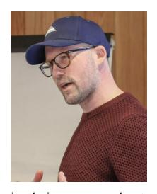

INGMAR POSNER (Member, IEEE) leads the Applied Artificial Intelligence Laboratory, University of Oxford. He is currently the Founding Director of Oxford Robotics Institute. His research aims to enable machines to robustly act and interact in the real world for, with, and alongside humans. With a significant track record of contributions in machine perception and decisionmaking, he and his team are thinking about the next generation of robots that are flexible enough

in their scene understanding, physical interaction, and skill acquisition to learn and carry out new tasks. His research is guided by a vision to create machines which constantly improve through experience. In 2014, he cofounded Oxa, a multi-award-winning provider of mobile autonomy software solutions. He serves as an Amazon Scholar.

YUKE ZHU (Senior Member, IEEE) received the master's and Ph.D. degrees from Stanford University. He is currently an Assistant Professor with the Computer Science Department, UT-Austin, where he directs the Robot Perception and Learning (RPL) Laboratory. He also co-leads the Generalist Embodied Agent Research (GEAR) Group, NVIDIA Research, building robotics foundation models. He focuses on developing intelligent algorithms for generalist robots to reason about

and interact with the real world. His research interests include robotics, computer vision, and machine learning. His work has won various awards and nominations, including the Best Conference Paper Award in ICRA 2019 and 2024, the Outstanding Learning Paper Award at ICRA 2022, and the Outstanding Paper Award at NeurIPS 2022. He received the NSF CAREER Award, the IEEE RAS Early Career Award, the JP Morgan Chase Faculty Fellowship in AI, and multiple faculty awards from Amazon, JP Morgan, and Sony Research.