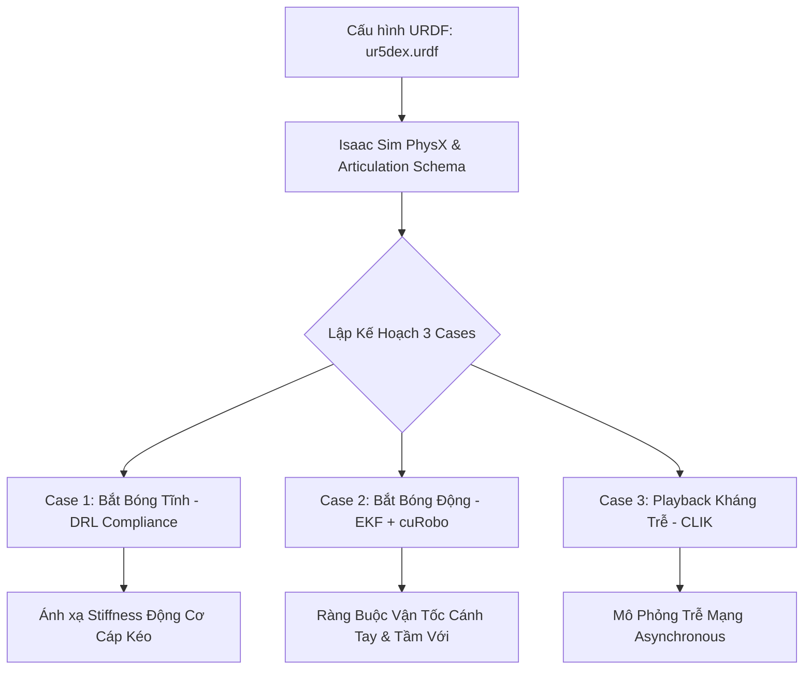

# Lộ Trình Mô Phỏng 3 Case Trên Isaac Sim Theo Định Dạng Robot URDF (`ur5dex.urdf`)

Lộ trình này thiết lập quy trình triển khai mô phỏng đồng bộ cho 3 kịch bản kiểm thử (Case 1, Case 2, Case 3) của robot tích hợp 25-DoF (UR5 + Bàn tay khéo léo DH Robotics) dựa trên cấu hình vật lý mô tả trong tệp cấu trúc [ur5dex.urdf](file:///D:/NCKH/Humanoid/Human-Simulator-ur5dex/config/ur5dex.urdf).

---

## 1. Phân Tích Thông Số Mô Hình Động Học & Động Lực Học (`ur5dex.urdf`)
Trước khi thiết lập mô phỏng, các giới hạn vật lý và động học của robot trong tệp URDF cần được ánh xạ trực tiếp vào Isaac Sim:
* **Hệ thống Cánh tay UR5 (6-DoF)**:
  * Khớp quay: `shoulder_pan_joint` đến `wrist_3_joint`.
  * Giới hạn góc: $\pm 2\pi$ rad (ngoại trừ khớp elbow là $\pm \pi$).
  * Giới hạn lực: Khớp lift tối đa $20,000\,\text{N.m}$ và khớp pan tối đa $40,000\,\text{N.m}$. Tốc độ tối đa $3.14\,\text{rad/s}$.
* **Hệ thống Bàn tay DH Robotics (19-DoF)**:
  * Gồm 4 ngón dài (Index, Middle, Ring, Pinky), mỗi ngón có 4 khớp quay (`J1` là yaw, `J2` đến `J4` là pitch) có giới hạn góc từ $0$ đến $1.309\,\text{rad}$ ($75^\circ$).
  * Ngón cái (Thumb) gồm 3 khớp quay (`thumb_j1` đến `thumb_j3`).
  * **Đặc tính Cáp kéo (Underactuation)**: Mặc dù URDF định nghĩa 19 khớp quay độc lập cho bàn tay, nhưng cấu hình thực tế chỉ có 5 động cơ điều khiển. Các khớp pitch (`J2, J3, J4`) của từng ngón được kéo theo (mimic/coupled) bởi một dây cáp chung.

---

## 2. Chi Tiết Lộ Trình Mô Phỏng 3 Case

### Case 1: Bắt Bóng Tĩnh (Static Catching) - Tối Ưu Hóa Trở Kháng Bàn Tay Bằng DRL
* **Mục tiêu mô phỏng**: Đánh giá khả năng dập tắt xung lực va chạm của bàn tay khi bóng rơi tự do vào lòng bàn tay từ các độ cao khác nhau ($0.5\,\text{m}$ đến $1.5\,\text{m}$).
* **Ánh xạ từ URDF**:
  1. *Thiết lập coupling ngón tay*: Trong PhysX Articulation của Isaac Sim, thiết lập các ràng buộc liên kết (Mimic Joints) giữa `index_J2` (khớp chủ động) với `index_J3` và `index_J4` (khớp bị động) theo tỷ lệ góc truyền dẫn $\theta_3 = k_1 \theta_2$ và $\theta_4 = k_2 \theta_2$.
  2. *Thiết lập giới hạn lực*: Giới hạn mô-men xoắn của các ngón tay trong URDF là $20\,\text{N.m}$. Chúng tôi áp dụng DRL để điều biến độ cứng ảo $\mathbf{K}_a(t)$ của cáp kéo trong khoảng giới hạn lực này để giảm thiểu tối đa phản lực tiếp xúc ($f_{\text{ext}}$).
* **Kết quả dự kiến**: Xác định được dải stiffness $\mathbf{K}_a$ tối ưu giúp triệt tiêu gia tốc dội lại của bóng, thiết lập tiền đề cho soft grasping thực tế.

### Case 2: Bắt Bóng Động (Dynamic Catching) - Phối Hợp UR5 và Bàn Tay
* **Mục tiêu mô phỏng**: Ném bóng với vận tốc $v_0 \in [3.0, 5.0]\,\text{m/s}$ từ khoảng cách xa. Robot phải tự động di chuyển cánh tay UR5 đến điểm đón bóng và khép các ngón tay khéo léo để bắt bóng.
* **Ánh xạ từ URDF**:
  1. *Khống chế tầm với (Reachability)*: cuRobo sử dụng mô hình hình học và giới hạn khớp cánh tay UR5 trong URDF để giải bài toán tránh tự va chạm và tính toán vùng không gian hoạt động (Manipulability ellipsoid).
  2. *Giới hạn tốc độ thực tế*: Mặc dù giới hạn tốc độ khớp tay trong URDF là vô hạn (`5.9e36`), mô phỏng phải giới hạn tốc độ các khớp ngón tay ở mức $2.0\,\text{rad/s}$ để phản ánh đúng quán tính động cơ thực tế.
  3. *Static-to-Dynamic*: Pose đón bóng tĩnh trích xuất từ DexGraspNet được dùng làm điểm đích. Hệ thống tự động kích hoạt tiến trình đón dựa trên vị trí dự đoán từ bộ lọc EKF.
* **Kết quả dự kiến**: Tỷ lệ bắt bóng thành công >90%. Phân tích các góc chết động lực học của UR5 làm cơ sở điều chỉnh vị trí đặt robot ở thực tế.

### Case 3: Playback và Đồng Bộ Kháng Trễ (Latency Compensation Playback)
* **Mục tiêu mô phỏng**: Kiểm chứng tính ổn định của hệ thống dưới ảnh hưởng của độ trễ truyền thông biến thiên $h(t) \in [0, 50]\,\text{ms}$.
* **Ánh xạ từ URDF**:
  1. *Mô phỏng trễ bất đối xứng*: Kênh truyền điều khiển UR5 được cấu hình chạy ở tần số $500\,\text{Hz}$ (RTDE), trong khi lệnh điều khiển bàn tay qua Modbus TCP chạy ở tần số $50\,\text{Hz}$.
  2. *Kiểm chứng LKF*: Áp dụng bộ điều khiển CLIK bù trễ đã thiết kế. Đầu ra điều khiển góc khớp $\mathbf{q}(t)$ được so sánh trực tiếp với giá trị phản hồi góc khớp thực tế từ mô hình động học ngược của URDF.
* **Kết quả dự kiến**: Sai số bám quỹ đạo MAE dưới $2.0\,\text{mm}$ ngay cả khi chịu độ trễ mạng tối đa $32\,\text{ms}$.

---

## 3. Tại Sao Lộ Trình Này Cần Sát Với URDF Nhất Có Thể?

Việc mô phỏng sát với tệp cấu hình `ur5dex.urdf` là bắt buộc vì các lý do học thuật và kỹ thuật sau:

1. **Khắc Phục Chênh Lệch Sim-to-Real (Physical Gap)**: 
   * Nếu không cấu hình đúng các tham số khối lượng (`mass`) và ma trận quán tính (`inertia`) của từng link trong URDF, các hệ số ma sát và lực quán tính trong mô phỏng Isaac Sim sẽ sai lệch hoàn toàn so với thực tế. Điều này dẫn đến việc bộ điều khiển trở kháng DRL được huấn luyện trong sim sẽ bị quá bù (over-compensate) hoặc thiếu bù (under-compensate) khi chạy thực tế.
2. **Ràng Buộc Động Học Của Hệ Thống Dưới Cơ Chế Truyền Động (Tendon-driven Coupling)**:
   * Bàn tay DH Robotics là hệ thống underactuated. Việc ánh xạ đúng ma trận truyền dẫn cáp kéo $\mathbf{S}$ dựa trên cấu trúc khớp của ngón tay trong URDF đảm bảo rằng không gian hành động (Action Space) của mô hình DRL trong Isaac Sim hoàn toàn tương thích với phần cứng thực tế, tránh việc sinh ra các tư thế gập ngón bất khả thi vật lý.
3. **An Toàn Thiết Bị (Hardware Safety Constraints)**:
   * Giới hạn lực torque (`effort limit`) của khớp UR5 trong URDF là thông số an toàn của nhà sản xuất. Bằng cách thiết lập PhysX tuân thủ nghiêm ngặt các giới hạn này, chúng ta đảm bảo rằng bộ giải cuRobo và các xung lực va chạm khi bắt bóng trong mô phỏng không bao giờ sinh ra các command vượt quá ngưỡng tải, ngăn ngừa nguy cơ gãy hỏng hoặc quá nhiệt động cơ thực tế.
